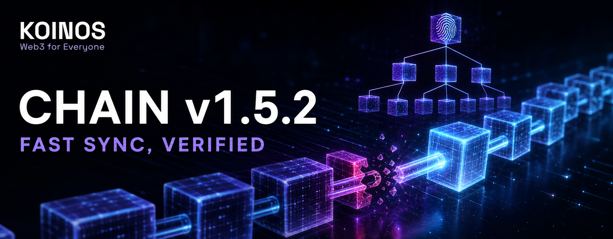

# Koinos Chain v1.5.2: Making Fast Node Sync Trustworthy Again



On July 9, 2026, Koinos released [`koinos-chain` v1.5.2](https://github.com/koinos/koinos-chain/releases/tag/v1.5.2). This release fixes a subtle but important problem in the way the chain microservice reconstructs state from historical block receipts.

The release is the result of a shared effort across the Koinos Community Foundation and the wider Koinos community. Node operators reported and preserved the failure evidence; community contributors reproduced the problem, audited the full chain history, designed and tested the repair; and upstream maintainers reviewed, integrated, and released the changes. The resolution depended on all of those contributions.

The practical message for node operators is simple:

> Update the `koinos-chain` microservice to `v1.5.2`, especially before restoring a backup, rebuilding chain state, or syncing a node from genesis.

The release does not introduce a new hard fork, change balances, or require a coordinated activation height. It corrects how an individual node replays and verifies history. It also makes future replay problems fail at the block that caused them instead of surfacing much later.

## Operator summary

- **Affected component:** `koinos-chain`, primarily its default fast indexing mode, `verify-blocks=false`.
- **Typical symptom:** `block previous state merkle mismatch` after restoring, reindexing, or catching up from historical data.
- **Main risk:** a node can reconstruct local state incorrectly or compute the wrong state-delta commitment, then stop syncing or become unavailable to an API or block producer.
- **Not the issue:** this was not a private-key compromise, forged transaction, or token-theft vulnerability.
- **Fixed version:** `koinos-chain v1.5.2`.
- **Required operator action:** set `CHAIN_TAG=v1.5.2`, pull the new chain image, and recreate the chain service or restart the Compose stack.
- **Database migration:** none is required for a healthy node. Do not delete node data as part of the normal upgrade.

The state-database work shipped as [`koinos-state-db-cpp v1.2.1`](https://github.com/koinos/koinos-state-db-cpp/releases/tag/v1.2.1) and is included in the v1.5.2 chain build. It is a library, not another microservice that operators need to update separately.

## The problem in plain language

Imagine that every block comes with two things:

1. a receipt listing what changed; and
2. a fingerprint of those changes, called a state-delta Merkle root.

A node catching up with the network can either re-run every transaction or use the receipt as a shortcut. Re-running everything is slower. Applying the recorded changes directly is much faster and is the default behavior when `verify-blocks=false`.

The bug was in that shortcut.

### The disappearing deletion

Suppose a contract creates a temporary entry and removes it again inside the same block. By the end of the block the entry no longer exists, so the compacted receipt contains a deletion but no creation.

The deletion still matters to the block's fingerprint. In database terminology it is represented by a **tombstone**: an explicit record that a key was removed.

During normal execution, the key existed when it was removed, so the tombstone became part of the block's state delta and therefore part of its Merkle root. During fast replay, however, the temporary key was not present in the parent state. The old code treated “remove a key that is not here” as a no-op and silently dropped the tombstone.

Both paths ended with the temporary key absent, but they did not produce the same commitment:

```text
Contract execution:  create B -> remove B -> root includes remove(B)
Old receipt replay:              remove B -> key absent -> no-op
```

One missing tombstone meant one missing Merkle leaf. The reconstructed root no longer matched the root signed by the network.

This distinction is important: normal contract execution **should** ignore many attempts to remove missing keys, because otherwise it would invent state changes. Replaying a serialized historical receipt is different. The receipt already says that the removal was part of the committed delta, so replay must preserve it exactly.

## Why the failure was difficult to diagnose

Before v1.5.2, the fast receipt-replay path did not verify each replayed root against the next block's signed expectation. A node could therefore pass the block that caused the divergence without reporting an error.

The mismatch often appeared only when the node returned to live block processing. By then, the visible failure could be millions of blocks or weeks of synchronization away from the original cause. Operators saw a safety check doing its job—stopping on `block previous state merkle mismatch`—but the log pointed near the end of the sync rather than to the historical block where replay had gone wrong.

This explains the reports collected in [issue #860](https://github.com/koinos/koinos-chain/issues/860), including nodes computing 11 state-delta entries where the historical receipt contained 12.

## What was at risk?

The canonical mainnet transactions and signatures were not rewritten by this bug. The defect was in how a local node reconstructed historical state from stored receipts.

That still creates meaningful operational risk:

- a node can stop syncing and require operator intervention;
- an API node can become unavailable or serve state from a reconstruction that has not been fully validated;
- a block producer can lose availability while its chain service is halted;
- backups and fast restores can appear successful until a later Merkle check exposes the divergence;
- a damaged or incomplete historical receipt can leave local state different from the state produced by full execution.

In short, this was primarily a **correctness and availability** problem for node software, not a mechanism for stealing funds. The safe behavior is to stop when commitments disagree; v1.5.2 makes that check earlier and adds a controlled repair path for replayable historical anomalies.

## Two historical exceptions found by the audit

The investigation did more than reproduce the original tombstone bug. A full-history audit processed 37,280,004 blocks and 290,295,679 receipt delta entries. Tombstone-preserving replay reproduced the signed history for 37,280,002 blocks. The remaining two blocks had different historical causes and required explicit handling.

### Block 30,504,202: an incomplete stored receipt

On October 31, 2025, a Koinos Fund rectification updated contract bytecode and metadata. Those two state changes were included in execution and in the consensus commitment, but older software persisted the pre-rectification receipt without them. That persistence bug was later addressed in [`koinos-chain` PR #858](https://github.com/koinos/koinos-chain/pull/858).

The stored receipt at block 30,504,202 therefore cannot reproduce the signed root by replay alone: information is missing. In v1.5.2, the checked replay detects the mismatch before finalization, discards the still-writable replay result, and fully re-executes that one block. Re-execution applies the historical rectification and reconstructs the correct state.

### Block 32,789,377: a permanent consensus scar

Block 32,789,377 was the last block before the January 2026 halt. Its honest receipt has 12 entries, including a Koinos Fund vote-ordering removal. When production resumed, the recovering node had used the old replay behavior and computed the root over 11 entries. That 11-entry value was then signed into block 32,789,378 as the previous state-delta root.

The result is a historical inconsistency:

- the honest receipt and state contain 12 entries;
- the next signed header contains the legacy 11-entry root.

Re-executing the block correctly cannot produce the legacy signed value. For this one case, v1.5.2 recognizes an exact three-part combination: the known parent block ID, the honest computed root, and the historically signed root. Only that exact combination is accepted. Any other mismatch still fails.

This preserves the honest 12-entry state instead of deliberately reproducing the old deletion bug. It also avoids a broad exception that could hide future corruption.

## The resolution for non-experts

The new replay process can be summarized as follows:

1. Copy each historical receipt without dropping its deletion markers.
2. Compare the reconstructed fingerprint with the value signed by the network.
3. If a receipt cannot reproduce the fingerprint, re-run that one block in full.
4. Accept the January historical scar only when every value matches the one documented case.
5. Stop immediately if neither replay nor re-execution can explain a mismatch.

The fast path remains fast for normal blocks. The expensive fallback is reserved for a block whose stored receipt cannot reconstruct consensus.

## Technical deep dive

The fix spans two repositories: [`koinos-state-db-cpp` PR #36](https://github.com/koinos/koinos-state-db-cpp/pull/36) and [`koinos-chain` PR #861](https://github.com/koinos/koinos-chain/pull/861).

### 1. Tombstone-preserving replay in the state database

The state database now exposes a dedicated replay operation:

```cpp
remove_object_preserve_tombstone( space, key )
```

Internally, `state_delta::erase()` gained a `preserve_tombstone` mode. With normal semantics, removing an absent key remains a no-op. With replay semantics, the absent key is inserted into the removed-object set, so the state-delta Merkle tree includes the deletion as `(hash(key), hash(empty value))`.

Keeping these two APIs separate prevents the replay fix from changing live contract-execution semantics.

### 2. An uncached Merkle root for writable nodes

The replay result must be checked while its state node is still writable. The existing `merkle_root()` API requires a finalized node and caches its result. Calling a cached root before later mutations would risk returning a stale commitment.

`koinos-state-db-cpp v1.2.1` therefore adds `pending_merkle_root()`. It computes a fresh root without finalizing the node and without populating the cache. This creates a safe point at which `koinos-chain` can validate the replay result and still discard it if necessary.

### 3. Verification at the causal block

The chain service now performs the checks missing from the old fast path:

- before replaying block `H`, its header's `previous_state_merkle_root` must match the local root of block `H-1`, except for the exact documented historical scar;
- if a receipt contains its own state Merkle root, the replayed pending root must reproduce it;
- when the root for block `H` is known from block `H+1`, the pending root is checked before block `H` is finalized.

This turns silent divergence into a failure at the causal block.

### 4. One-block lookahead

Koinos headers commit to the **previous** block's state-delta root. The signed expectation for block `H` is therefore found in the header of block `H+1`.

The indexer now keeps one block pending. When `H+1` arrives, it uses the header of `H+1` to check the replayed root of `H`. This timing is essential because a finalized head node cannot safely be discarded from the state database. With one-block lookahead, a mismatching node is still writable.

The final block at the current target height has no successor in the indexing batch, so it is applied normally and checked by the first subsequent live block.

### 5. Re-execution fallback without a retry loop

If checked receipt replay cannot reproduce the signed root, the chain service:

1. logs `delta_replay_fallback` with the height and block ID;
2. discards the still-writable replay node;
3. re-executes the block through the same full application path used for verified blocks;
4. propagates any error if full execution still cannot reproduce an acceptable result.

There is no infinite retry and no generic “ignore mismatch” switch. A receipt anomaly can trigger one controlled fallback. An unexplained disagreement still halts synchronization.

## How to update a Docker Compose node

The official [`koinos/koinos`](https://github.com/koinos/koinos) Compose configuration now pins `CHAIN_TAG=v1.5.2`. Existing installations normally keep their own `.env`, so pulling the repository does not automatically change the active tag. Check and update it explicitly.

The following procedure creates a short, controlled outage. Run it from the directory containing your Koinos `docker-compose.yml` and `.env`.

### 1. Prepare and preserve your configuration

If this is a producing node, schedule the restart and make sure production is stopped cleanly. Back up the active environment and configuration files. If your operational policy supports it, also take a filesystem or volume snapshot of the configured `BASEDIR`.

```bash
cd /path/to/your/koinos-compose-directory
cp .env .env.before-chain-v1.5.2
cp -R config config.before-chain-v1.5.2
```

Do not replace your active `.env` or `config` directory with the examples from the repository; that could discard local ports, profiles, seed peers, producer settings, or data paths.

### 2. Pin the chain image

Edit `.env` and set:

```dotenv
CHAIN_TAG=v1.5.2
```

Confirm the value:

```bash
grep '^CHAIN_TAG=' .env
```

### 3. Pull before stopping the node

```bash
docker compose pull chain
```

Pulling first minimizes downtime.

### 4. Restart the stack

```bash
docker compose down
docker compose up -d
```

If you normally pass `--profile` options on the command line, use the same profiles when bringing the stack back up. Never add `-v` to `docker compose down` for this upgrade, and do not remove the configured `BASEDIR`.

Operators who have a tested rolling procedure may instead recreate only the chain service, but a controlled full-stack restart is easier to reason about for block-producing nodes and ensures dependent services reconnect cleanly.

### 5. Verify the running image and health

```bash
docker inspect "$(docker compose ps -q chain)" --format '{{.Config.Image}}'
docker compose ps
docker compose logs --since=10m chain
```

The first command should report:

```text
koinos/koinos-chain:v1.5.2
```

Confirm that the chain service remains up, synchronization height advances, and the logs do not show a crash loop or an unexplained state Merkle mismatch. Re-enable or confirm block production only after the chain, peer connectivity, and producer service are healthy.

## Custom packages and source builds

If your node is not based on the official Docker Compose repository, update the package or deployment manifest that supplies the chain microservice and verify that it contains `koinos-chain v1.5.2`.

Source builders should build from the release tag:

```bash
git fetch --tags
git checkout v1.5.2
```

The release updates its Koinos CMake dependency so the build includes `koinos-state-db-cpp v1.2.1`. Do not combine the v1.5.2 chain source with an older state-db build that lacks `remove_object_preserve_tombstone()` and `pending_merkle_root()`.

## If your node is already halted

Treat an already halted node differently from a routine upgrade:

1. keep block production disabled;
2. preserve the current data directory and collect the chain logs and failing height;
3. upgrade the chain microservice to v1.5.2;
4. restart as an observer and check whether it progresses;
5. if the same mismatch persists, do not repeatedly delete data and retry.

A state node finalized by the old replay path may already contain the wrong historical result. The new binary prevents and repairs this while performing a new indexing pass, but it cannot guarantee an in-place repair of every state database already halted at a bad finalized head. Preserve the original data, then rebuild chain state from the block store or restore a known-good backup using v1.5.2 and your distribution's documented recovery procedure. Full re-execution with `verify-blocks=true` remains the maximum-validation recovery option, at the cost of a substantially slower rebuild.

Do not bring a producer back online until the observer has reached the network head without recurring Merkle errors.

## Frequently asked questions

### Must a healthy, fully synchronized node resync from genesis?

No. A normal upgrade does not require deleting or rebuilding a healthy database. The fix matters when the node next indexes historical blocks, restores from backup, or encounters a receipt anomaly.

### Must every microservice be upgraded?

This release action changes the `chain` image. The state-db fix is linked into that image; there is no separate state-db container to deploy.

### Should operators enable `verify-blocks=true` permanently?

Not for this fix. v1.5.2 makes the default fast replay path verifiable and adds the targeted full-execution fallback. Operators may still choose `verify-blocks=true` for maximum validation, accepting a much longer reindex time.

### Does the release weaken Merkle validation to pass old history?

No. It adds validation to the fast path. The only special acceptance is constrained to one known block ID and one exact pair of computed and historically signed roots. Every other unexplained mismatch still fails.

### How urgent is the update?

All operators should upgrade promptly. It is particularly important for archival nodes, backup providers, API infrastructure, and block producers that may need to restore or reindex under time pressure.

## A Koinos community effort

This work grew from reports by node operators and block producers, followed by a collaborative investigation within the Koinos Community Foundation. Reproducing a failure that appeared far from its cause required historical node data, operational knowledge, contract context, state-database expertise, full-history audit tooling, implementation work across two repositories, review, and release coordination.

No single step would have been sufficient by itself. The operator reports identified the real-world impact. The Koinos Fund analysis exposed the unusual state-delta shape. The audit separated the general tombstone bug from the two historical exceptions. The state-database and chain changes converted those findings into a safe repair. Upstream review and integration then made the fix available to every node operator as an official release.

`koinos-chain v1.5.2` should therefore be understood as a common achievement of the Koinos Community Foundation, participating community members, node operators, block producers, contributors, testers, and upstream maintainers.

## References

- [`koinos-chain` v1.5.2 release](https://github.com/koinos/koinos-chain/releases/tag/v1.5.2)
- [Issue #860: block mismatch](https://github.com/koinos/koinos-chain/issues/860)
- [`koinos-chain` PR #861: tombstones, root verification, and re-execution fallback](https://github.com/koinos/koinos-chain/pull/861)
- [`koinos-state-db-cpp` PR #36: preserve-tombstone removal and pending Merkle root](https://github.com/koinos/koinos-state-db-cpp/pull/36)
- [`koinos-state-db-cpp` v1.2.1 release](https://github.com/koinos/koinos-state-db-cpp/releases/tag/v1.2.1)
- [Official Compose pin update to `CHAIN_TAG=v1.5.2`](https://github.com/koinos/koinos/commit/821674672e699bf56e94d7c0e8bce122e83d1482)

## Suggested post for X

Publish this post when the Medium article is public, replacing
`<MEDIUM_ARTICLE_URL>` with its final URL:

```text
Koinos node operators: upgrade koinos-chain to v1.5.2.

This community-built release fixes fast state-delta replay, verifies Merkle roots at the causal block, and safely handles two historical anomalies.

Read the full story: <MEDIUM_ARTICLE_URL>

#Koinos #Web3
```

Attach the article cover image from
`images/koinos-chain-v1.5.2-medium-cover.png`. Use the Medium article as the
only link so the post has one clear destination. Suggested image alt text:
“Koinos Chain v1.5.2 — Fast Sync, Verified, illustrated with a repaired chain
of connected data blocks and a Merkle tree.”

---

This article documents a shared Koinos Community Foundation and Koinos community effort.
