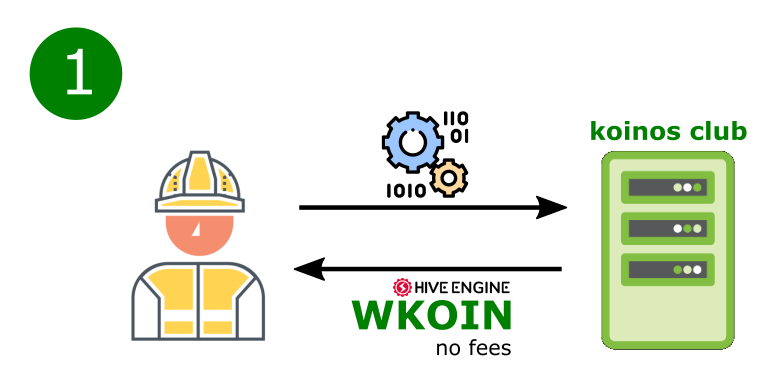
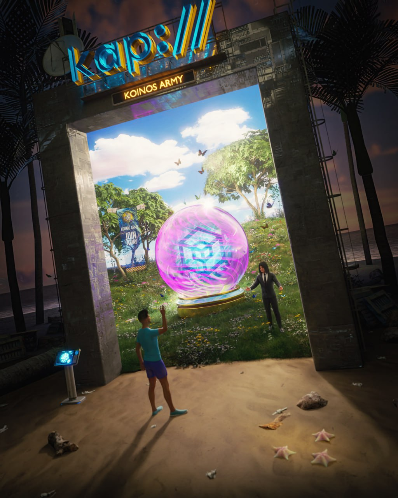
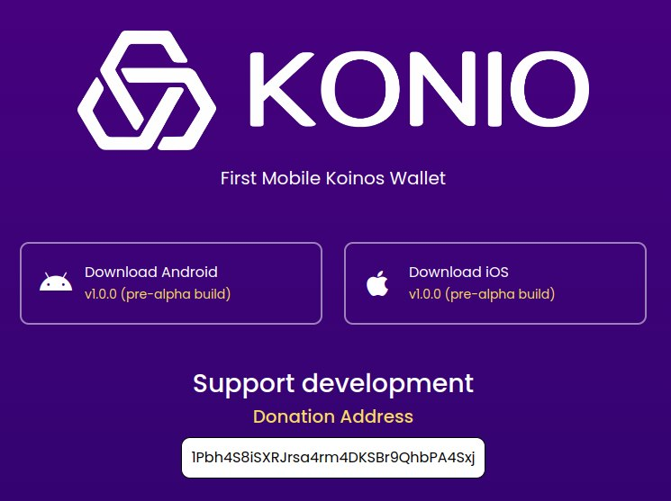
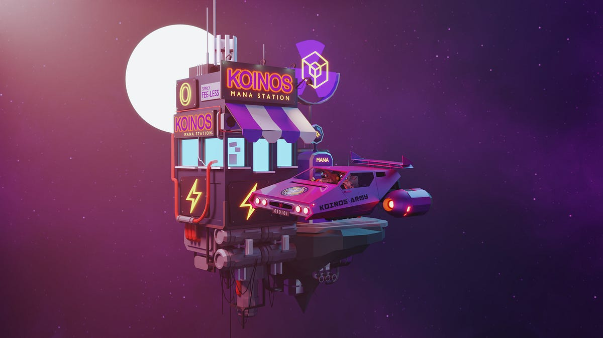
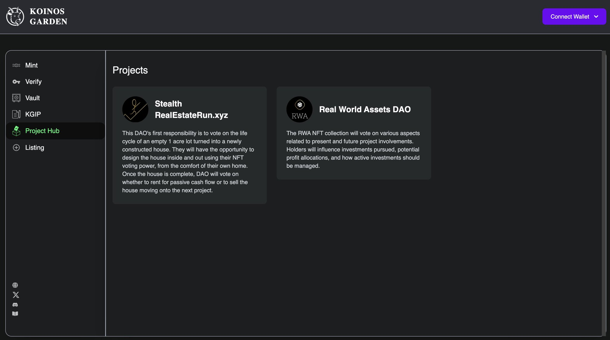
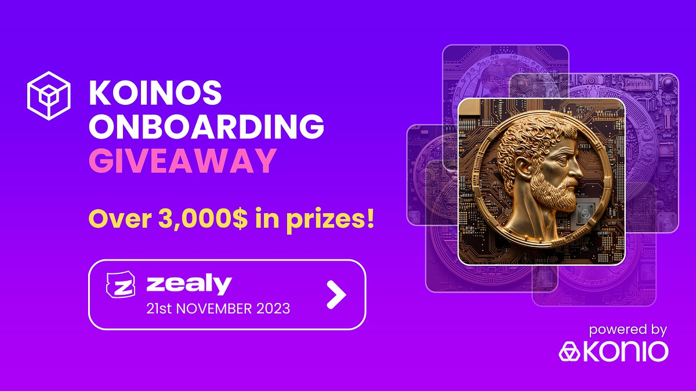
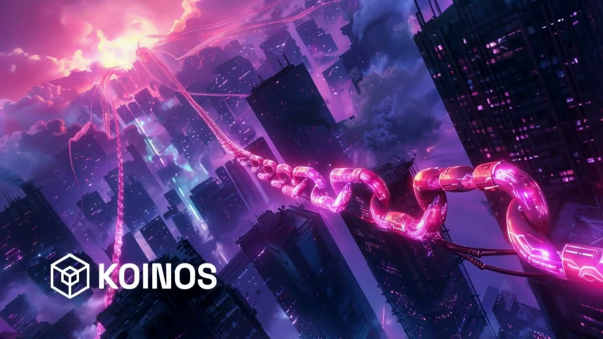
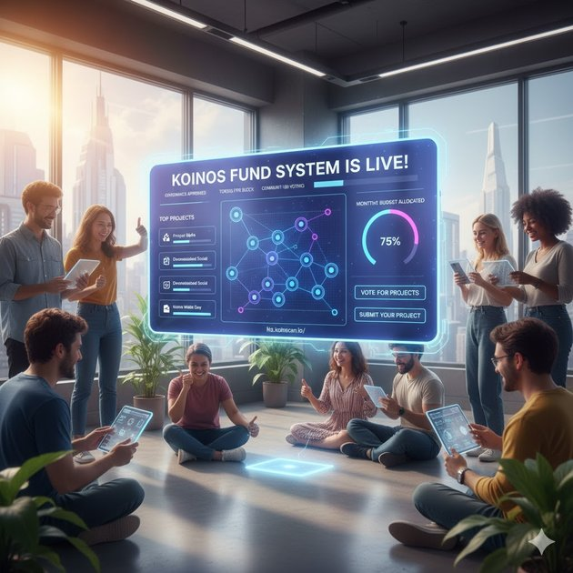

# Koinos existe: crónica de una blockchain que no puede recrearse

*Identidad visual oficial de Koinos. Fuente: [kit de medios de Koinos](https://koinos.io/media).*

Estamos entrando en una era en la que la inteligencia artificial y los grandes modelos de lenguaje pueden ayudar a casi cualquier persona a desarrollar software. Un solo desarrollador puede generar una aplicación, crear una bifurcación de una base de código, modificar un protocolo o incluso lanzar una nueva blockchain más rápido que nunca. En ese mundo, la mera capacidad de crear otra cadena ya no es el bien escaso.

Lo que no puede generarse bajo demanda es la historia.

Koinos importa porque existe como una blockchain vivida: una cadena lanzada en la red principal, utilizada por personas reales, moldeada por transacciones reales, puesta a prueba por los mercados, criticada por su propia comunidad, mantenida durante transiciones difíciles y ampliada por desarrolladores que no formaban parte, en su totalidad, de la empresa fundadora. Su valor no reside únicamente en su código, su arquitectura o sus ideas técnicas. También reside en el camino que la trajo hasta aquí: las personas que la minaron, crearon monederos y herramientas, debatieron sobre gobernanza, perdieron dinero, donaron fondos, lanzaron aplicaciones, operaron infraestructura y mantuvieron visible la red cuando la empresa original dio un paso atrás.

En la era del software generado por IA, esta distinción cobra mayor importancia. Se puede bifurcar el código. Se puede lanzar otra blockchain. Se puede reproducir una arquitectura. Pero no se puede bifurcar la historia exacta de Koinos. No se pueden recrear el período original de minería ERC-20, las lecciones de Steem que dieron forma al proyecto, las primeras transacciones de la red principal, los debates de la comunidad en torno a Cafe, el lanzamiento de KoinDX, Kollection, KAP, Fogata, Konio, Sovrano, Koinos.fun, la formación de Koinos Community Foundation ni la larga cadena de contribuciones que hicieron del ecosistema lo que es.

Por lo tanto, este artículo no es solo una lista de hitos. Es un intento de preservar la memoria de una blockchain como objeto social, técnico e histórico.

La historia de Koinos no comienza con la minería de KOIN ni con la red principal. Comienza en la era de Steem: una demostración práctica de que las aplicaciones blockchain sin comisiones podían llegar a usuarios comunes, seguida de una crisis de gobernanza que dio forma a muchos de los objetivos de diseño de Koinos.

Esta cronología se basa en material público del proyecto, el whitepaper de Koinos, publicaciones de Koinos Group y Koinos Network, versiones publicadas en GitHub, anuncios del ecosistema, publicaciones públicas en X y conversaciones de la comunidad conservadas en Telegram y Discord. Las publicaciones oficiales se utilizan para las fechas y los anuncios formales; los canales de la comunidad se utilizan para recuperar el contexto: qué construía, debatía, cuestionaba, traducía, financiaba y mantenía la gente en cada etapa.

Esta distinción importa porque la historia posterior de Koinos no es únicamente la historia de Koinos Group. También es la historia de desarrolladores independientes de la comunidad, operadores, escritores, traductores, proveedores de liquidez, creadores de monederos, creadores de NFT, participantes en la gobernanza y críticos que gradualmente pasaron a formar parte de la continuidad de la cadena.

## 2016-2020 - La lección de Steem

Antes de Koinos, varias de las personas que posteriormente lo desarrollaron habían sido desarrolladores principales de Steem, una de las primeras grandes blockchains sociales sin comisiones. Steem y Steemit demostraron algo importante: los usuarios comunes podían interactuar con una blockchain a diario si el producto se percibía como una aplicación web convencional y no les exigía pagar comisiones por cada acción.

Esta es la lección positiva que Koinos heredó de Steem. Las transacciones gratuitas, la abstracción de cuentas, las aplicaciones sociales y la delegación de recursos no eran ideas abstractas. Se pusieron a prueba en un entorno real orientado al consumidor.

El ecosistema de Steem también dio lugar a aplicaciones que mostraron hasta dónde podía llegar una blockchain sin comisiones. Steem Monsters, más tarde Splinterlands, se convirtió en uno de los juegos blockchain más conocidos de aquella época. Demostró que los juegos, las aplicaciones sociales y los activos digitales podían atraer usuarios cuando la blockchain permanecía, en gran medida, en un segundo plano.

Pero Steem también puso de manifiesto una grave debilidad de gobernanza. En 2020, después de que Justin Sun adquiriera Steemit Inc., la comunidad de Steem se vio inmersa en un conflicto de gobernanza en el que se utilizaron los fondos en stake de clientes custodiados por exchanges para votar por testigos. Ese acontecimiento condujo al fork de Hive y se convirtió en uno de los ejemplos más claros de cómo el stake en custodia y las tenencias concentradas de los fundadores pueden amenazar una red de prueba de participación delegada.

El whitepaper de Koinos describe esta experiencia directamente: el equipo había formado parte de los desarrolladores principales de Steem hasta que se produjo una adquisición hostil y un ataque de los exchanges. Koinos se diseñó, en parte, como respuesta a ese modo de fallo: una blockchain de propósito general sin comisiones que fuera más descentralizada desde su lanzamiento, más modular en su funcionamiento y más resistente a la captura de la gobernanza por parte de los exchanges.

## 2019-2020 - La conversación en Discord antes de Koinos

El primer registro útil de Discord comienza antes de que Koinos tuviera su nombre definitivo. En agosto de 2019, el servidor aún reflejaba el ecosistema de Steem: propuestas, interoperabilidad entre aplicaciones y la búsqueda de una mejor infraestructura para desarrolladores. En noviembre de 2019, Andrew Levine describía el servidor como un lugar donde debatir funcionalidades multiplataforma para aplicaciones de Steem, entre ellas OpenSeed, cuentas fuera de la cadena, mensajería cifrada y una experiencia de usuario más uniforme entre aplicaciones.

Este debate anterior a Koinos es importante porque demuestra que hubo continuidad. El posterior énfasis de Koinos en las cuentas gratuitas, el uso sin comisiones, una experiencia de usuario fluida y los componentes básicos para aplicaciones no apareció de repente en el whitepaper de 2020. Surgió de un entorno activo de blockchain social en el que los desarrolladores ya habían comprobado qué aspectos de la experiencia de usuario de la blockchain podían llegar a los usuarios habituales y cuáles seguían resultando problemáticos.

Ese mismo historial temprano de Discord también dejó constancia de la lección negativa. A finales de 2019 y principios de 2020, los miembros de la comunidad ya criticaban la prueba de participación delegada, las dinámicas de preminado, la gobernanza de las partes interesadas y el pensamiento condicionado por el precio. Tras la bifurcación de Steem/Hive, esas inquietudes se hicieron más concretas: quienes se sentían atraídos por OpenOrchard solían estarlo porque querían la innovación y la facilidad de uso de Steem sin repetir las debilidades de gobernanza que habían quedado patentes en Steem y Hive.

## 16.04.2020 - Se anuncia OpenOrchard

El 16 de abril de 2020, tras dejar Steemit Inc., gran parte del antiguo equipo de desarrollo de Steem anunció OpenOrchard. La misión era hacer que la tecnología blockchain fuera más accesible para los desarrolladores de aplicaciones descentralizadas.

Este es el punto de partida organizativo de Koinos. El equipo no comenzó diciendo «vamos a lanzar otro token». El planteamiento inicial era más amplio: crear herramientas y tecnología que permitieran a los desarrolladores desarrollar aplicaciones con la facilidad de uso de Steem, pero sin heredar las debilidades de gobernanza de Steem.

El canal `#general` del Discord de Koinos conserva la recepción pública de ese punto de partida. El 16 de abril de 2020, Andrew Levine compartió allí el anuncio de OpenOrchard. En cuestión de días, los miembros de la comunidad ya estaban comparando Steem, Hive, OpenOrchard, las debilidades de gobernanza y la posibilidad de construir sobre una capa base más sostenible. Esto es importante porque el registro de Discord muestra que Koinos comenzó como una conversación entre desarrolladores posterior a Steem antes de convertirse en una historia de minería, mercados de intercambio o precio.

El registro público de Ron Hamenahem muestra que el área de producto y diseño ya tenía un carácter técnico. El 25 de marzo, antes del anuncio de OpenOrchard, comentó en Discord que había estado trabajando en la **aplicación móvil OpenLink** y se ofreció a compartir lo que había aprendido de la API de OpenSeed. Perfiles posteriores lo identificaron como director de Diseño de OpenOrchard. Esa combinación —trabajo de interfaz, experimentación con API y coordinación operativa— se convirtió en el patrón de su contribución a Koinos. No fue uno de los principales arquitectos de la blockchain, pero hizo que su protocolo fuera, una y otra vez, utilizable, visible y más fácil de operar.

## 16.06.2020 - Koinos se anuncia como una nueva blockchain

El 16 de junio de 2020, OpenOrchard anunció que estaba construyendo desde cero una nueva blockchain: Koinos.

Esa decisión es importante. El equipo podría haber desarrollado el proyecto sobre Ethereum, Hive, EOSIO u otra cadena existente. En cambio, llegó a la conclusión de que ninguna de las plataformas disponibles reunía las propiedades que buscaba: un uso verdaderamente sin comisiones, cuentas gratuitas, ejecución gratuita de contratos inteligentes, delegación de recursos, modularidad, un lanzamiento justo y una gobernanza capaz de evolucionar sin bifurcaciones duras.

Por tanto, Koinos no era solo una nueva cadena. Era un intento de generalizar lo que Steem había demostrado en la capa de aplicación y reconstruirlo como una plataforma programable de contratos inteligentes.

Discord también permite ver lo pronto que la idea de los microservicios entró en la conversación. En `#general`, el 16 de junio de 2020, Andrew compartió la actualización de OpenOrchard sobre Koinos y ODESI, y la vista previa describía la blockchain Koinos junto con los microservicios de ODESI. En un debate de julio de 2020 se retomó la misma arquitectura, cuando un miembro de la comunidad señaló que el proyecto se estaba describiendo como un conjunto de microservicios. Es un indicio temprano de que la posterior arquitectura modular de nodos de Koinos no fue una capa de marca añadida tardíamente; ya formaba parte de su identidad técnica durante los primeros meses de exposición pública.

## 23.09.2020 - Se registra Koinos Group LLC

El 23 de septiembre de 2020, Koinos Group LLC fue registrada en Delaware. Esto formalizó el equipo detrás del proyecto y sentó las bases para un lanzamiento más público.

Más adelante, la empresa se convertiría en el centro del desarrollo de Koinos durante la fase de minería ERC-20, las redes de prueba, el lanzamiento de la red principal, KoinosPro, el desarrollo de Vortex y los primeros tiempos del ecosistema. Ese papel cambiaría drásticamente años después, cuando la comunidad tuvo que asumir la responsabilidad operativa.

Los principales nombres de Koinos Group mencionados en esta cronología son:

- **Andrew Levine / `@andrarchy`**: CEO fundador de Koinos Group y principal comunicador público, estratega, portavoz de desarrollo empresarial e interlocutor con la comunidad durante la formación de Koinos, las redes de prueba, el lanzamiento de la red principal y los dos primeros años de producción. No fue el principal arquitecto del protocolo; su contribución distintiva consistió en traducir el trabajo de los arquitectos en una misión comprensible, recabar opiniones, promover a desarrolladores de la comunidad, formar alianzas y distinguir reiteradamente la empresa de la red descentralizada. En agosto de 2024 pasó de CEO a director de Comunicaciones. Tras dejar Koinos Group en diciembre de 2024, continuó durante un tiempo como defensor independiente y ofreció mentoría a desarrolladores de Koinos. Perfil público: X [`@andrarchy`](https://x.com/andrarchy).
- **Steve Gerbino / `@sgerbino`**: cofundador de Koinos y arquitecto de blockchain. Fue anunciado como CTO de Koinos Group en abril de 2022 y se convirtió en CEO en agosto de 2024. El papel de Steve en la comunidad combinó el diseño del protocolo con un apoyo público inusualmente directo: explicó la minería, el mana, las versiones, las propuestas de gobernanza y las actualizaciones de nodos; reconoció a desarrolladores independientes; e invitó a desarrolladores de la comunidad a participar en los repositorios principales. Durante la transición de 2025 comunicó la orientación hacia una nueva red y firmó el traspaso operativo de los activos y servicios de Koinos Group a la comunidad. Perfiles públicos: X [`@ssgerbino`](https://x.com/ssgerbino), GitHub [`sgerbino`](https://github.com/sgerbino), LinkedIn [`stevegerbino`](https://www.linkedin.com/in/stevegerbino/).
- **Michael Vandeberg / `@mvandeberg`**: cofundador de Koinos y principal arquitecto de blockchain; CTO de Koinos Group desde agosto de 2024. Michael fue la referencia pública más constante del proyecto en materia de protocolo: explicó el consenso, el mana, la instantánea y el proceso descentralizado de reclamación, los microservicios, los límites de la gobernanza, los estándares de tokens, el comportamiento de los nodos y la hoja de ruta técnica. También revisó propuestas de la comunidad y convirtió reiteradamente los comentarios de operadores y desarrolladores de dApps en correcciones P2P, contratos más seguros, gestión de nonces y herramientas REST. Durante el cierre progresivo de la empresa siguió respondiendo preguntas técnicas y ofreció explicaciones detalladas sobre las restricciones legales y contables en torno a los tokens restantes de Koinos Group. Perfiles públicos: X [`@koinosvandeberg`](https://x.com/koinosvandeberg), GitHub [`mvandeberg`](https://github.com/mvandeberg), LinkedIn [`michaelvandeberg`](https://www.linkedin.com/in/michaelvandeberg/).
- **Ron Hamenahem / `@brklyn8900`**: cofundador de Koinos, diseñador de producto, responsable de operaciones, gestor de proyectos y desarrollador práctico de frontend y aplicaciones. Fue jefe de Diseño en OpenOrchard y Koinos Group, se le identificó públicamente como cofundador y COO de Koinos Group para el lanzamiento de la red principal, continuó como COO en la reorganización de agosto de 2024 y figura en la página actual del equipo de Koinos como **Fundador de Koinos, gestor de proyectos + desarrollador**. Su trabajo público abarca el soporte a mineros, la marca y los sitios web de Koinos, las interfaces de documentación, los tutoriales y las sesiones para desarrolladores, el diseño de Kondor, Armana Portal, Koinos.fun, Koinscan, el frontend de KPS, la constitución y la infraestructura de la Foundation, y la reescritura de Kondor v2 por parte de Armana. Esta amplitud no debe confundirse con la autoría del consenso o de la arquitectura del protocolo de Koinos, que correspondió principalmente a Steve Gerbino y Michael Vandeberg. Perfiles públicos: GitHub [`brklyn8900`](https://github.com/brklyn8900), LinkedIn [`ronh`](https://www.linkedin.com/in/ronh).
- **Nathaniel Caldwell**: cofundador de Koinos y arquitecto de blockchain mencionado en los primeros materiales técnicos de Koinos, incluido el debate sobre la red de prueba del «easy fork».

Esas funciones cambiaron con el tiempo, especialmente después de que Koinos Group dejara de ser el centro operativo de la cadena. Los nombres que aparecen posteriormente en este artículo, como Luke Willis, Koinos The Goat, Kui He, Julián González, Justin Welch, Adriano Foschi, Frank (`@ElImbatido`), VonLooten, fbslo, MiXiBo, Ederaleng, Saleh Hawi, Roamin, Jon Rice y `@interfecto`, se consideran colaboradores de la comunidad salvo que una fuente citada indique expresamente lo contrario.

Los perfiles públicos conocidos de colaboradores recurrentes de la comunidad incluyen:

- **Luke Willis / `@lukemwillis`**: colaborador comunitario del protocolo, desarrollador full-stack de dApps y UX, cofundador de productos, operador de pool y educador. Creó **The Koin Press**, cuyo boletín y podcast de 57 episodios hicieron comprensibles Koinos y otras ideas cripto relacionadas mediante un lenguaje cotidiano desde noviembre de 2021 hasta junio de 2024. Su contribución más importante al protocolo llegó después del documento original de Proof-of-Burn: propuso sustituir los mineros virtuales similares a NFT por Virtual Hash Power fungible, una idea que Koinos Group reconoció expresamente en el diseño mejorado de KPoB y en el libro blanco unificado. Posteriormente escribió los contratos y el frontend originales del pool BurnKoin, operó conjuntamente con Kui He el primer pool de KPoB, cofundó KAP, construyó su interfaz de usuario y publicó experimentos menores de código abierto, como el NFT Press Badge y componentes React reutilizables para dApps de Koinos. La historia pública de KAP también establece un importante límite de colaboración: Luke dirigió la vertiente visible de producto y frontend, mientras que Roamin fue autor de la mayoría de los commits de contratos que se conservan. La página oficial actual del equipo de Koinos incluye a Luke como **Desarrollador de la comunidad**. X [`@lukemwillis`](https://x.com/lukemwillis), GitHub [`lukemwillis`](https://github.com/lukemwillis), sitio personal [`lukewillis.com`](https://lukewillis.com/) y el [registro histórico del podcast The Koin Press](https://www.listennotes.com/podcasts/the-koin-press-luke-willis-4Iuy2SLmGeg/).
- **Koinos The Goat / `@KoinosTheGoat`**: narrador comunitario de la época de la minería, divulgador económico, corrector de estilo y defensor multimedia independiente. Su trayectoria en el grupo principal comienza en marzo de 2021 con preguntas sobre la seguridad de las carteras, la gobernanza y la inflación. En mayo creó el personaje **Koinos The Goat** y su metáfora de devorar comisiones, abrió un repositorio de Google Docs para textos promocionales elaborados por voluntarios y sostuvo que la economía sin comisiones debía explicarse como un modelo de recursos fundamentalmente diferente y no como gas meramente barato. Su aparición en diciembre de 2021 en **The Koin Press** se convirtió en una de las interpretaciones del mana más memorables de la comunidad y posteriormente fue recomendada en la propuesta de la stablecoin Emporia. Continuó ofreciendo asistencia informal sobre la instantánea, la reclamación, las carteras, las dApps y el ERC-20 heredado; hizo corrección línea por línea de textos de KAMP; y publicó en 2025 la producción independiente **The Chronicles of Koinos, Part One**. Más adelante [replanteó el mana como una capa de permisos para agentes de IA](https://t.me/koinos_community/362453), al tiempo que se convertía en un [crítico inusualmente franco del fracaso de Koinos a la hora de llegar al mercado](https://t.me/koinos_community/339998). Una búsqueda autenticada del historial completo encontró 14.411 mensajes en el grupo principal entre marzo de 2021 y mayo de 2026; el volumen por sí solo no implica relevancia histórica, pero la amplitud demuestra una continuidad inusual. Declaró explícitamente [«No soy desarrollador»](https://t.me/koinos_community/28668), y no se encontró código verificado de Koinos, nombramiento formal como moderador, función en la empresa ni autoría del protocolo. Telegram [`@KoinosTheGoat`](https://t.me/KoinosTheGoat), X [`@koinosthegoat`](https://x.com/koinosthegoat) y YouTube [`@koinosthegoat3756`](https://www.youtube.com/@koinosthegoat3756).
- **Kui He / motoengineer**: desarrollador de la comunidad, cofundador de productos, operador de pools de minería, educador técnico, moderador de Discord y posteriormente miembro de Koinos Community Foundation. Su trayectoria pública es inusual para un desarrollador del ecosistema: LinkedIn documenta su carrera en ingeniería estructural y su acreditación como Professional Engineer, mientras que una entrevista de diciembre de 2023 lo describe como estadounidense de primera generación, con una familia procedente de Guangzhou, y como minero temprano de KOIN desde el día del lanzamiento. Lanzó Koinos Forum y ayudó a reactivar las sesiones AMA de la comunidad; cofundó BurnKoin y KAP con Luke Willis; cofundó Koinos-Social con Roamin; operó infraestructura pública de nodos semilla y productores; publicó una serie educativa de 30 vídeos sobre Koinos; copresentó Koinos Podcast; y regresó en 2025 con la beta de Koinos Pulse asistida por IA. La página oficial actual del equipo de Koinos lo incluye como **Desarrollador**. X [`@kuixihe`](https://x.com/kuixihe), YouTube [`@kuixihe` / motoengineer](https://www.youtube.com/@kuixihe), LinkedIn [`kuixihe`](https://www.linkedin.com/in/kuixihe).
- **Julián González / `@jga` / `@joticajulian`**: desarrollador independiente cuya contribución conecta casi todas las capas técnicas entre el periodo de minería de lanzamiento justo de Koinos y su etapa mantenida por la comunidad. Sus repositorios públicos anteriores a Koinos ya incluían herramientas de exploración y propuestas para Steem/Hive. En Koinos participó en la creación de Koinos Club, creó la biblioteca de JavaScript/TypeScript **Koilib** y la cartera de navegador **Kondor** original, y desarrolló la interfaz de reclamación de WKOIN/nativo, Fogata, Koinos Polls, Nicknames, Arkinos, Manuscript, Koinos Fund System, así como herramientas para carteras inteligentes y desarrollo de contratos, además de ayudar a dar forma a los estándares KCS. También operó productores y pools, revisó o escribió cambios en el núcleo, prestó apoyo a otros desarrolladores en Discord y Telegram y se convirtió en miembro de Koinos Community Foundation. El patrón históricamente importante es la continuidad: la infraestructura de minería se convirtió en herramientas para desarrolladores; estas se convirtieron en carteras y dApps; y las dApps condujeron a la gobernanza, los estándares, la financiación y el mantenimiento de la red posterior a la empresa. No fue uno de los arquitectos fundadores del protocolo de Koinos, y varios de los hitos descritos a continuación fueron colaboraciones y no trabajos individuales. Telegram [`@joticajulian`](https://t.me/joticajulian), X [`@joticajulian`](https://x.com/joticajulian), GitHub [`joticajulian`](https://github.com/joticajulian), Hive [`@jga`](https://hive.blog/@jga/posts).
- **Justin Welch / Justin W. / `@ogjustinw`**: participante temprano de la época de la minería, ingeniero full-stack y de infraestructura, cofundador de Kollection, impulsor del repositorio Koinos Contract Standards, coautor de KCS-2 y colaborador destacado en Koinos.io, Vortex, Koinos.fun y Koinos Community Foundation. Su trayectoria profesional ayuda a explicar la amplitud de ese trabajo: sus perfiles públicos documentan una carrera en infraestructura iniciada en 2001, el puesto de jefe de Ingeniería en Steemit de 2016 a 2020 y posteriores cargos superiores de ingeniería en Splinterlands y AppMakers USA. En Koinos trabajó reiteradamente en contratos, frontends, servicios backend, AWS y despliegue, indexación, estándares y asistencia a usuarios. Varios de los productos descritos a continuación fueron colaboraciones y no proyectos individuales: el equipo de lanzamiento de Kollection también incluyó a Dokterkraakbeen, Ederaleng y VonLooten; KCS-2 tuvo cuatro autores identificados y se basó en la implementación de referencia de Roamin; Vortex surgió del puente anterior de Roamin y del liderazgo de Ederaleng; y Koinos.fun fue desarrollado conjuntamente con Ron Hamenahem y los arquitectos de Koinos. X [`@ogjustinw`](https://x.com/ogjustinw), GitHub [`jredbeard`](https://github.com/jredbeard), LinkedIn [`justin-p-welch`](https://www.linkedin.com/in/justin-p-welch/).
- **Adriano Foschi / `@adrihoke`**: desarrollador de productos de la comunidad centrado en eliminar las fricciones para el usuario. Creó la primera cartera móvil nativa de Koinos, **Konio**; el framework modular de cuentas inteligentes **Veive**; la línea de autenticación y pagos **Sovrano**; la cartera de Telegram **Sovry**; y el prototipo original de predicción de precios **Kuku Games**. También coordinó una campaña de incorporación para varios proyectos, ayudó a otros desarrolladores de dApps y, en 2025, creó un primer tablero de planificación de la Foundation y colaboró voluntariamente en los preparativos de Vortex. Perfiles públicos: X [`@adrihoke`](https://x.com/adrihoke), GitHub [`adrianofoschi`](https://github.com/adrianofoschi), LinkedIn [`adrianofoschi`](https://www.linkedin.com/in/adrianofoschi).
- **Frank / `@ElImbatido`**: Telegram [`@ElImbatido`](https://t.me/ElImbatido), creador y principal desarrollador de **Koiner.App**, su interfaz de explorador, su backend de indexación y su API de datos GraphQL. El repositorio histórico de V1 era `koiner-dao/koiner-backend`; su [URL original de GitHub](https://github.com/koiner-dao/koiner-backend) ya no está disponible.
- **VonLooten / `@vonlooten`**: cofundador y CEO original de KoinDX, colaborador temprano de Koinos, estratega de producto y negocio, responsable de documentación y del registro de tokens, y uno de los comunicadores de DeFi más visibles del ecosistema antes del lanzamiento. Su trayectoria pública en Koinos comienza con dos pequeñas correcciones upstream en noviembre de 2021 y un repositorio de enlaces del ecosistema en febrero de 2022. En KoinDX dirigió la presentación pública del DEX, la economía de KNDX / KOINDX, la DAO propuesta, la IDO, el launchpad, el libro de órdenes, la documentación, los listados, las alianzas y la asistencia a usuarios, además de contribuir directamente al trabajo de producto. El registro público de repositorios no lo identifica como el autor principal de los contratos AMM fundamentales; Ederaleng era el CTO y el desarrollador de contratos más sólido. X [`@vonlooten`](https://x.com/vonlooten), GitHub [`vonlooten`](https://github.com/vonlooten) y Medium [`@vonlooten`](https://medium.com/@vonlooten).
- **Dokterkraakbeen / `@Dokterkraakbeen`**: diseñador visual, comunicador de producto, coautor de estándares y operador veterano en Planet Koinos, KoinDX, Kollection y Koinos Awareness Marketing Program. Lanzó Planet Koinos en abril de 2022 como recurso reutilizable de elementos visuales, kit de prensa, traducciones, pegatinas y productos de fabricación propia; creó el rediseño y el nuevo logotipo de KoinDX en 2022; fue uno de los cuatro autores identificados de KCS-2; formó parte del equipo de lanzamiento de Kollection compuesto por cuatro personas; y posteriormente ejerció como supervisor, responsable visual y coordinador de patrocinios de KAMP. Su trayectoria en 2024-2025 también muestra una labor sostenida de comunicación para KoinDX y Kollection tras la marcha de VonLooten. No se encontró ninguna identidad pública en GitHub ni historial de commits que justifique atribuirle el código del marketplace, del DEX o de los contratos NFT: su autoría mejor documentada corresponde al trabajo visual, de marca, de producto, de estándares, de campañas y de operaciones. Telegram [`@Dokterkraakbeen`](https://t.me/Dokterkraakbeen), [Planet Koinos](https://planetkoinos.com/) y el [anuncio del equipo](https://medium.com/@koindx/koindx-announcement-574aff8f3541) histórico de KoinDX.
- **fbslo / `@fbsloXBT`**: desarrollador full-stack y de DeFi radicado en Eslovenia, cuyo historial público anterior a Koinos ya incluía infraestructura de tokens envueltos de Hive/EVM, multifirma, validadores, oráculos y puentes. En Koinos creó el prototipo AMM original KoinoSwap; se unió a KoinDX en mayo de 2022; proporcionó el linaje de contratos validadores de Ethereum utilizado por el primer prototipo de puente de Roamin; publicó una beta de código abierto para intercambios atómicos HTLC entre Koinos y EVM inmediatamente después de la red principal; y posteriormente operó un pequeño servicio de liquidez de stablecoins a KOIN bajo el nombre KoinSwap. Las pruebas públicas no demuestran que su contrato AMM original se convirtiera en el núcleo de producción de KoinDX, y no se encontró ningún pull request ni commit público de KoinDX bajo su identidad de GitHub. X [`@fbsloXBT`](https://x.com/fbsloXBT), GitHub [`fbslo`](https://github.com/fbslo) y Stack Overflow [`fbslo`](https://stackoverflow.com/users/13095858/fbslo).
- **G Millie / `@DeGemsCrew`**: organizador y administrador de Koinos Army, impulsor de productos NFT, anfitrión de sesiones AMA y nexo entre el grupo específico de Koinos y la comunidad más amplia de DeGems Lounge / Gem Chase. Estuvo presente en el chat desde el día de su apertura en noviembre de 2021, propuso los coleccionables de Koinos Army y su comunidad de titulares en 2023, promovió sesiones AMA del ecosistema y conservaba la capacidad de nombrar administradores en 2025. Eso no lo convierte en fundador del grupo, artista visual ni desarrollador de contratos NFT: el propio G Millie afirmó que Glen creó y dirigió Koinos Army; Eman Vallejos se identificó como artista de la colección y reconoció el trabajo de Glen, Adem, MiXiBo y la comunidad; y el historial público de GitHub de MiXiBo contiene todo el registro conservado de contratos de Koinos Army Journey. Telegram [`@DeGemsCrew`](https://t.me/DeGemsCrew), X [`@Gmills1234`](https://x.com/Gmills1234); Koinos Army: Telegram [`@thekoinosarmy`](https://t.me/thekoinosarmy), X [`@koinosarmy`](https://x.com/koinosarmy).
- **Glen Koin Master**: fundador y operador original de Koinos Army, moderador de la comunidad de KoinDX y colaborador organizativo del proyecto NFT Koinos Army Journey. La atribución más sólida de su condición de fundador es la declaración posterior de G Millie de que el grupo fue «creado y dirigido por Glen»; el anuncio de KoinDX de octubre de 2022 identificó por separado a Glen y Adem como moderadores activos en distintas plataformas que responderían preguntas de la comunidad en nombre del proyecto; y el artista de la colección, Eman Vallejos, agradeció posteriormente a Glen y Adem haber construido con él el proyecto NFT. No se encontró ningún username público verificado, cuenta de GitHub, contribución de código ni identidad civil. Algunas cadenas de respuestas de Telegram hacen ambigua la correspondencia entre el nombre y la cuenta, por lo que esta crónica no equipara a Glen con G Millie ni le atribuye otra cuenta sin pruebas directas.
- **Adem / Kenpachi / X histórico `@ademhassan1`**: copropietario temprano de Koinos Army, moderador de la comunidad y representante de soporte de KoinDX, y responsable de marketing y selección de producto de Koinos Army Journey. La correspondencia de la cuenta pública está respaldada por repetidas respuestas de Telegram que se dirigen a la cuenta `Kenpachi` como Adem y por el enlace de G Millie a `@ademhassan1` como la cuenta de X de Adem. KoinDX lo identificó, junto con Glen, como contacto oficial de la comunidad en distintas plataformas; sus propios mensajes daban la bienvenida a usuarios, difundían eventos y lanzamientos, advertían sobre suplantaciones y estafas previas al lanzamiento, y explicaban el modelo propuesto de KNDX / IDO / Mana. En relación con Koinos Army Journey, G Millie se describió a sí mismo y a Adem como responsables de marketing, mientras que el artista Eman Vallejos denominó a Glen y Adem propietarios del grupo y responsables de la selección de la colección. No se encontró ningún historial público en GitHub ni pruebas de autoría visual o de contratos, y las fuentes examinadas no permiten establecer un username actual, identidad civil, salida formal ni motivo de la reducción de su actividad. X histórico [`@ademhassan1`](https://x.com/ademhassan1).
- **Karlos / `karlos.koin` / `@Karlos_Koinos`**: colaborador visual de la comunidad, probador de carteras y participante veterano en la asistencia a usuarios. Proporcionó el logotipo de My Koinos Wallet; creó su propia versión SVG del símbolo del rayo para VHP seleccionado por la comunidad, que Frank utilizó en Koiner y Adriano solicitó para Konio; y fue reconocido expresamente por el diseño del logotipo de la moneda y las pruebas de Konio v1.4. Julián González también le agradeció su apoyo a la creación de la campaña de recaudación NFT de Kondor. Esos reconocimientos no demuestran autoría de contratos, autoría de todas las imágenes NFT, diseño general de la interfaz de Konio ni una función como desarrollador de carteras: no se encontró ninguna identidad pública en GitHub ni contribución de código, y el código conservado de la campaña de Kondor pertenece al repositorio de Julián. Telegram [`@Karlos_Koinos`](https://t.me/Karlos_Koinos).
- **MiXiBo / `@mixibo_koincity`**: principal desarrollador, diseñador de producto, operador y contacto de soporte comunitario detrás de **KoinCity**. Transformó el proyecto desde el primer launchpad de tokens sin código de Koinos hasta una plataforma de tokens más amplia, con preventas, bloqueos de tokens y liquidez, vistas de mercados y staking, chats de proyectos, integración con KoinDX, claves de API para socios, lanzamientos rápidos, acuñación de NFT e infraestructura propia de nodos y servidores. Perfiles públicos: Telegram [`@mixibo_koincity`](https://t.me/mixibo_koincity), GitHub [`MiXiBo`](https://github.com/MiXiBo), X [`@TheRealKoincity`](https://x.com/TheRealKoincity).
- **Ederaleng / `@ederaleng`**: desarrollador full-stack de la comunidad, cofundador y CTO original de KoinDX, colaborador de Kollection, principal desarrollador del puente Vortex reanudado, miembro fundador de Koinos Community Foundation y posterior autor y operador de trabajos de liquidez multicadena financiados por KFS. Su contribución abarca contratos inteligentes, SDK, pruebas de integración, registros de tokens, validadores de puentes, relayers, interfaces, despliegues, respuesta a incidentes e infraestructura de mercado. La página oficial actual del equipo de Koinos lo incluye como **Desarrollador**. X [`@ederaleng`](https://x.com/ederaleng), Telegram [`@ederaleng`](https://t.me/ederaleng), GitHub [`ederaleng`](https://github.com/ederaleng).
- **Saleh Hawi / `@saleh_hawi`**: Telegram [`@saleh_hawi`](https://t.me/saleh_hawi). Organizador de la comunidad, colaborador de producto y negocio de KoinDX, operador de cara al usuario, coordinador de campañas para el listado en exchanges, moderador y divulgador técnico. No fue uno de los cofundadores originales de KoinDX, pero para 2024 se había convertido en uno de sus colaboradores públicamente reconocidos y siguió siendo un contacto de soporte durante 2025.
- **Roamin / `_roamin_`**: ingeniero independiente de la comunidad cuya contribución recurrente consistió en convertir ideas experimentales de desarrolladores en infraestructura reutilizable de Koinos. Creó el conjunto de herramientas de AssemblyScript que se convirtió en software propio; Local-Koinos; My Koinos Wallet y su SDK para dApps; el prototipo original completo del puente Koinos-Ethereum; la integración de la cadena Koinos con WalletConnect y el SDK de WalletConnect de Armana; el servidor REST original de Koinos; la implementación en AssemblyScript de `get_contract_metadata`; aplicaciones de VRF y pruebas de estrés; y, con Kui He, Koinos-Social. La página actual del equipo de Koinos incluye a `@roamin` como **Desarrollador de la comunidad**. Esas contribuciones no lo convierten en arquitecto fundador del protocolo, autor identificado de KCS-2, autor de Portal ni único autor de los sistemas REST y Vortex de producción posteriores. GitHub [`roaminro`](https://github.com/roaminro).
- **Jon Rice / `@jonricecrypto`**: asesor veterano de Koinos, estratega de comunicación, escritor y defensor de la comunidad. En el lanzamiento de la Federation afirmó que había asesorado al equipo sin remuneración desde 2020; su trayectoria profesional incluye cargos de redactor jefe en Cointelegraph, Blockworks y Crypto Briefing, la cofundación de Crypto Briefing, el lanzamiento de Cointelegraph Magazine y trabajos anteriores como fundador y director creativo de una agencia de publicidad. En Koinos fundó la Koinos Federation de 2023 y fue su primer presidente, articuló públicamente la tesis de adopción «gratuita, sin fricciones y familiar», escribió en 2024 el extenso argumento a favor de Koinos, llevó Koinos.fun a medios de comunicación especializados en criptomonedas y posteriormente ofreció acceso a medios, el dominio `feeless.io` y una contribución condicional de 500.000 KOIN a la financiación comunitaria. La página oficial actual del equipo de Koinos lo incluye como **Defensor de la comunidad**. Su función fue de promoción, coordinación, estrategia de captación de fondos y amplificación editorial, no de arquitectura del protocolo ni desarrollo de aplicaciones, y la propuesta de tesorería de la Federation descrita más adelante nunca se implementó. X [`@jonricecrypto`](https://x.com/jonricecrypto), LinkedIn [`jonricecrypto`](https://www.linkedin.com/in/jonricecrypto/). Publicaciones anteriores de Koinos de la época de la Federation también hacían referencia a [`@jonrice`](https://x.com/jonrice).
- **Pablo Garcia / `pgarcgo`**: organizador y educador temprano de la comunidad española, creador del podcast discontinuado **Koincast**, probador de redes de prueba, operador veterano de nodos, miembro fundador de Koinos Community Foundation, responsable de la red de prueba pública y la API, desarrollador principal de **Koinos One** y del nodo monolítico **Teleno**, y posterior colaborador upstream en la base de datos de estado de Koinos y la reparación de la reproducción de la cadena. Su función cambió considerablemente con el tiempo: no fue uno de los arquitectos originales del protocolo, pero evolucionó desde un nexo bilingüe con la comunidad hasta convertirse en mantenedor de infraestructura y colaborador en áreas próximas al consenso. Telegram [`@pgarcgo`](https://t.me/pgarcgo), X [`@pgarcgo`](https://x.com/pgarcgo), GitHub [`pgarciagon`](https://github.com/pgarciagon).
- **`@interfecto` / Atb 3tb / `@interfectoewm`**: desarrollador de la comunidad, investigador aplicado, miembro de Koinos Community Foundation, operador de redes de prueba y nodos, creador de infraestructura de datos, mantenedor del ecosistema y participante habitual en la asistencia a usuarios. Su trabajo visible comenzó en 2025 con una guía de contratos de Koinos orientada a LLM y el mantenimiento de `koinos.io`, y posteriormente se amplió a la red de prueba y el faucet comunitarios, **KoinosScan**, un panel de distribución de KOIN/VHP, la monitorización de nodos y semillas, un indexador de tokens en Go/SQLite y la prueba de concepto **Koinos EVM Engine**. También presentó actualizaciones del sitio público a medida que Koiner, Konio, Chainge y MEXC dejaron de ser referencias válidas; el trabajo fusionado eliminó Koiner y posteriormente MEXC, mientras que la limpieza inicial más amplia de Konio/Chainge se cerró sin ser fusionada. En el chat principal ayudó reiteradamente a los usuarios a trasladarse entre MEXC, Kondor, MetaMask y Vortex, y recomendó realizar pequeñas transacciones de prueba, usar carteras vacías para los experimentos y actuar con cautela ante mensajes directos no solicitados. El registro muestra un patrón recurrente: utiliza el desarrollo asistido por IA para producir rápidamente prototipos funcionales, pero distingue públicamente las pruebas funcionales de las auditorías de seguridad y de la preparación para producción. La página oficial actual del equipo de Koinos incluye a `@interfecto` como **Consultor + desarrollador**. X [`@interf3cto`](https://x.com/interf3cto), GitHub [`interfecto`](https://github.com/interfecto), Telegram [`@interfectoewm`](https://t.me/interfectoewm).
- **Teing / `@TEingvvv`**: escritor de Koinos en lengua china, entrevistador, educador sobre minería y observador on-chain. Entre agosto y diciembre de 2023 tradujo el diseño sin comisiones, el modelo de minería, el ecosistema, las cuestiones sobre la distribución entre titulares y las motivaciones de los desarrolladores de la comunidad de Koinos para un público de habla china. Su archivo de cuatro publicaciones en Medium culminó con una entrevista a cinco desarrolladores que contenía tanto traducciones al chino asistidas por GPT como los originales en inglés de los participantes; un resumen técnico anterior fue republicado por el medio de criptomonedas en chino Daily Coin Research, que le atribuyó la mayor parte del contenido. Se trató de documentación y análisis de la comunidad, no de desarrollo del protocolo ni de una prueba de que las direcciones que seguía pertenecieran a ninguna persona identificada. X [`@TEingvvv`](https://x.com/TEingvvv) y [Medium `@teingvvv`](https://medium.com/@teingvvv).
- **Alberto / Transeunte / `@Ustulato`**: escritor de habla española, narrador visual, crítico de productos y defensor de los usuarios no técnicos de la comunidad. Su trayectoria pública comienza con vídeos experimentales sobre Koinos y diseños de NFT a finales de 2023, y después evoluciona hacia archivos paralelos en español e inglés en WordPress, medios promocionales asistidos por IA, difusión social diaria, propuestas de preguntas frecuentes y demostraciones orientadas a usuarios, y la solicitud de financiación de 2025 **Koinos Communication & Marketing Center**. Su contribución mejor documentada consistió en hacer comprensibles la actividad técnica y del ecosistema para personas ajenas al núcleo de desarrolladores. No fue desarrollo de software: sus dos primeras colecciones NFT llegaron a tener un contrato de prueba, pero no una versión de producción con soporte, y su afirmación posterior de haber creado aproximadamente cien NFT de avatares en Koinos.fun es una declaración propia y no el total auditado de una campaña. Telegram [`@transeunte`](https://t.me/transeunte), X [`@Ustulato`](https://x.com/Ustulato), blog en español [Mundo Koinos](https://mundokoinos.wordpress.com/) y blog en inglés [Koinos World](https://koinosworld.wordpress.com/).
- **Nomad100x / `@nomad100x`**: participante de habla española en la comunidad, patrocinador de productos y crítico veterano de las limitaciones de financiación y crecimiento de Koinos. Ya era visible en el grupo español en la primavera de 2022; posteriormente impulsó **Koinos Garden**, pagó a un desarrollador externo para construirlo y presentó el producto desplegado como una DAO de inversión restringida a titulares de NFT y una capa sin permisos para la votación de proyectos. El historial público del contrato pertenece al desarrollador de GitHub [`NishantPacharne`](https://github.com/NishantPacharne), no a Nomad; Nomad se describió expresamente como una persona no desarrolladora. También defendió una financiación más reducida y transparente del ecosistema durante el debate sobre la Federation, promovió posteriormente KFS y finalmente describió Koinos Fund como la materialización más amplia de aquello en lo que había querido convertir Koinos Garden. El registro no lo convierte en miembro de la Foundation, autor de KFS, desarrollador de contratos inteligentes ni gestor de fondos acreditado, y tampoco permite establecer qué proyectos, si los hubo, recibieron inversiones de Koinos Garden. Telegram [`@nomad100x`](https://t.me/nomad100x), X [`@nomad100x`](https://x.com/nomad100x) y [Koinos Garden](https://dapp.koinosgarden.com/).
- **Carlos Welele / `@Weleleliano`**: Telegram [`@Weleleliano`](https://t.me/Weleleliano). Participante temprano de la comunidad española, divulgador y traductor bilingüe, organizador de materiales para redes sociales y canales de participación de Koinos, y moderador veterano del grupo principal de Telegram de Koinos. Su contribución fue de infraestructura social: ayudar a los usuarios a comprender Koinos, mantener la circulación de la información y proteger a los recién llegados frente al spam, los suplantadores y los grupos falsos.

## 06.10.2020 - Se anuncian el whitepaper y la minería de KOIN

El 6 de octubre de 2020, Andrew Levine anunció el whitepaper de Koinos y el próximo lanzamiento de KOIN como token ERC-20 minable en Ethereum. El periodo de minería fue diseñado para ser abierto y accesible: minería con CPU, sin ICO, sin preminado y con un mecanismo de distribución destinado a evitar los problemas de concentración que habían minado la confianza en otras cadenas.

El objetivo era explícito: maximizar la descentralización ofreciendo a los usuarios comunes una vía justa para adquirir el token antes de la red principal.

*El anuncio original de la minería de KOIN mostraba la fecha de lanzamiento del 13 de octubre junto al equipo fundador. Fuente: [OpenOrchard, «Anuncio del whitepaper de Koinos y la minería de KOIN»](https://medium.com/openorchard/announcing-koinos-whitepaper-koin-mining-e2755f5be33f).*

El canal `#general` de Discord muestra cómo el anuncio funcionó como un acontecimiento de incorporación inmediata. Andrew publicó el whitepaper y el anuncio de la minería el 6 de octubre de 2020, y la misma conversación rápidamente derivó en preguntas prácticas sobre la frecuencia de las pruebas, los costes en ETH, los portátiles y el funcionamiento del minero. Steve Gerbino explicó que la frecuencia de las pruebas afectaba al gasto en ETH y a la variabilidad de la minería, en lugar de dañar el hardware, lo que demuestra la rapidez con la que el canal pasó de la presentación del proyecto al soporte técnico.

Ese mismo hilo es también donde el discurso del lanzamiento justo del proyecto se puso a prueba públicamente. Los usuarios preguntaron si Koinos repetiría el problema del preminado de Steem o si la minería se comportaría como una ICO encubierta al exigir gastar ETH en gas. La respuesta de Steve fue directa: sin ICO, sin minería furtiva y sin trucos de lanzamiento ocultos. Otros usuarios señalaron la ausencia de una participación de control preminada como la razón principal por la que Koinos podía reivindicar un comienzo más limpio que Steem, aunque reconocían que un lanzamiento justo no garantizaba una distribución perfecta.

Para respaldar este objetivo, el equipo publicó el software de minería en dos modalidades:

- un minero de escritorio con interfaz gráfica para Mac y Windows;
- un minero de línea de comandos para Linux destinado a servidores.

El minero predeterminado incluía una donación opcional para los desarrolladores, pero el ajuste era configurable. Al final del periodo de minería, las donaciones representaban menos del uno por ciento del suministro total.

## 13.10.2020 - Comienza la minería de KOIN ERC-20

El 13 de octubre de 2020, tras una cuenta atrás de siete días, comenzó oficialmente la minería de KOIN ERC-20 en Ethereum.

Ese mismo día se creó de forma anónima el primer par KOIN/ETH de Uniswap v2. Las primeras operaciones se realizaron a aproximadamente un centavo por KOIN, según el tipo de cambio de la época.

Este periodo es importante porque determinó la posterior legitimidad de Koinos. KOIN no se vendió mediante una ICO. Se minó de forma abierta antes de que existiera la cadena nativa, y la futura mainnet utilizaría posteriormente una instantánea de esos saldos ERC-20.

El registro de Discord refleja la compleja realidad de aquel lanzamiento justo. El día del lanzamiento, en `#general` había usuarios que preguntaban por qué el ETH enviado a la dirección del minero no había aparecido, si la aplicación del minero debía permanecer abierta y cómo empezar a minar. Durante los días siguientes, las conversaciones pasaron a tratar los endpoints de Infura, la configuración predeterminada de Ropsten, los precios del gas, las inquietudes sobre las hardware wallets, los mecanismos de reclamación y la futura transición a la mainnet. Esto no cambia la fecha oficial del lanzamiento, pero hace que el hito resulte más concreto: la minería de KOIN comenzó como un proceso técnico abierto que requirió la resolución de problemas por parte de una comunidad real, no como una venta centralizada impecablemente organizada.

Una discusión técnica especialmente importante explicó cómo funcionaba la dificultad de minería. En Discord, Michael Vandeberg describió el mecanismo como un modelo de creador de mercado interno, similar en esencia a la lógica de producto constante de Uniswap: un lado representaba KOIN y el otro, hashes; los hashes se degradaban con el tiempo y la competencia modificaba el precio implícito de producir pruebas. Esto resulta útil desde el punto de vista histórico porque muestra que la minería de KOIN no era simplemente «minería con CPU en Ethereum»; era un mecanismo económico implementado mediante la lógica de contratos inteligentes, transacciones de Ethereum y un mercado dinámico de hashes.

Las preguntas de asistencia de los usuarios formaron parte del propio lanzamiento. Los mineros tuvieron que comprender la frecuencia de las pruebas, el gas de ETH, los endpoints de Infura, los nodos locales de Ethereum y por qué una frecuencia de pruebas menor implicaba menos transacciones de Ethereum, pero también recompensas menos frecuentes. Esa fricción explica tanto las fortalezas como las debilidades del lanzamiento: era abierto y técnicamente verificable, pero aun así favorecía a quienes podían comprender las herramientas de Ethereum, los costes del gas y la variabilidad de la minería.

Pablo Garcia / `pgarcgo` aparece en este registro como uno de los primeros participantes, no como miembro de la empresa de desarrollo. Antes del lanzamiento compartió ayuda para configurar Ubuntu y Node.js; el día del lanzamiento preguntó por la primera prueba y la frecuencia de las pruebas; y durante la semana siguiente ayudó a otros usuarios con problemas de instalación. También cuestionó las afirmaciones sin fundamento de que los mineros con GPU ya habían comprometido el lanzamiento justo, pidió pruebas y propuso que la comunidad pusiera a prueba la hipótesis en vez de repetirla. Ese patrón siguió siendo visible más adelante: la defensa de Koinos combinada con una preferencia por las pruebas reproducibles, la investigación independiente y la crítica abierta.

Justin Welch también estuvo presente antes de que existiera el ecosistema de aplicaciones que posteriormente hizo visible su nombre. Los registros de Discord indican que `ogjustinw` se unió el 14 de octubre de 2020, al día siguiente del inicio de la minería. El 25 de octubre propuso una relación exacta entre `OMP_NUM_THREADS` y la configuración `threadIterations` del minero, mientras que las conversaciones circundantes abordaban las granjas de CPU, el manejo de claves privadas, la frecuencia de las pruebas, el gas y la equidad del lanzamiento. Esto no lo convierte en autor del minero ni en ingeniero de Koinos Group. Establece un límite histórico más útil: Justin llegó como minero con experiencia técnica y colaborador en la resolución de problemas de la comunidad, más de dos años antes del lanzamiento de Kollection.

## 18.11.2020 - OpenOrchard se convierte en Koinos Group

El 18 de noviembre de 2020, OpenOrchard pasó a llamarse Koinos Group.

El cambio de marca hizo que el proyecto fuera más fácil de entender públicamente. OpenOrchard había sido el nombre de la empresa, pero Koinos se estaba convirtiendo en la identidad de la tecnología, el token y la futura blockchain.

## 22.11.2020-30.01.2021 - Koinos Club abarata la minería de lanzamiento justo

El primer producto importante de Koinos creado por Julián apareció durante el período de minería de ERC-20, no después de la mainnet. El 22 de noviembre de 2020, él y el desarrollador de la comunidad `@pstaiano` [presentaron **Koinos Club**](https://hive.blog/koinos/@jga/koinos-pool), un pool diseñado en torno a la función de beneficiario del contrato de minería. Los grupos de cinco mineros podían compartir una transacción de prueba en Ethereum, mientras el contrato de minería seguía pagando las recompensas directamente a la dirección de cada minero. El diseño reducía el gasto de gas hasta aproximadamente un 60 por ciento sin colocar los KOIN minados en una cuenta de retiro bajo custodia.

El [anuncio de Koinos Club V2](https://hive.blog/koinos/@jga/koinos-pool-v2), publicado el 30 de enero de 2021, llevó la misma idea más lejos. Los mineros enviaban al pool pruebas frecuentes y de bajo coste, el pool pagaba las recompensas en forma de WKOIN en Hive y solo se enviaban a Ethereum las pruebas con suficiente solidez. Los usuarios no tenían que registrarse, depositar ETH en una cuenta del pool ni confiar en que un operador mantuviera bajo custodia su saldo de KOIN nativo. Un minero con interfaz gráfica y la comunidad hispanohablante ayudaron a hacer más accesible el flujo de trabajo.

*El diagrama de V2 de Julián documentó el flujo original entre el usuario y el pool, así como el flujo de recompensas en WKOIN, durante el período de minería de ERC-20. Fuente: [Julián González, «Koinos Pool V2»](https://hive.blog/koinos/@jga/koinos-pool-v2), 30 de enero de 2021.*

Koinos Club es importante porque estableció el patrón que más tarde definiría el trabajo de Julián: identificar una capacidad a nivel de protocolo, integrarla en una herramienta abierta y fácil de usar, y reducir el coste de participación para quienes no pueden operar en la capa más técnica. Seguía siendo un pool experimental y su ahorro en comisiones dependía del gas de Ethereum y de las condiciones de las pruebas. Una [`pull request` de `koinos-miner`](https://github.com/koinos/koinos-miner/pull/85) de octubre de 2020, en la que Julián propuso utilizar la dificultad del minero en lugar del objetivo, también pertenece a este período, pero se cerró sin fusionarse y debe recordarse como una intervención técnica temprana, no como una corrección central aceptada.

## Finales de 2020 - Koinos en Español se convierte en la primera rama internacional de la comunidad

La comunidad hispanohablante se formó inusualmente pronto. Las pruebas de Telegram de finales de noviembre y diciembre de 2020 muestran que el grupo `@koinoshispano` ya estaba activo, explicando en español las ideas de Koinos sobre la capacidad de actualización modular y la paginación del estado, debatiendo la fase de minería ERC-20 y compartiendo vídeos subtitulados de Koinos a través del canal de YouTube **Koinos en español**.

El primer mensaje de Pablo que se conserva en el grupo, del 18 de noviembre, identificaba el problema inmediato: [«Hay muy poca información en español publicada»](https://t.me/koinoshispano/9). A continuación, explicó el minero, la ausencia de una ICO convencional, la futura mainnet, la paginación del estado y la capacidad de actualización modular. El 29 de noviembre [resumió la capacidad de actualización modular](https://t.me/koinoshispano/241) como la posibilidad de cambiar las reglas y el protocolo sin hard forks convencionales. Esto hace que su contribución inicial fuera algo más concreto que la mera promoción de un token: estaba traduciendo una arquitectura técnica aún inacabada cuando el único elemento funcional de KOIN seguía siendo un contrato de minería ERC-20.

Para el 20 de diciembre de 2020, el canal en español ya compartía un conjunto más amplio de vías de comunicación: YouTube, Facebook, Twitter / X como `@koinos_espaniol`, Telegram como `@koinoshispano` y un Discord en español. El 11 de enero de 2021 compartió un vídeo subtitulado de Andrew Levine presentando a la comunidad hispanohablante. Más adelante, en noviembre y diciembre de 2021, el miembro de la comunidad Pablo Garcia / `@pgarcgo` se refirió a esos canales en español dentro del grupo principal como vías oficiales de comunicación en español.

Esto hace que `@koinoshispano` tenga una importancia histórica que va más allá del idioma. Fue uno de los primeros ejemplos de cómo Koinos adquirió carácter internacional gracias al trabajo de la comunidad, en lugar de hacerlo mediante un programa regional corporativo formal. Durante aquel periodo inicial, el canal fue creado y mantenido por miembros hispanohablantes de la comunidad, entre ellos `@pgarcgo` y Carlos Welele / `@Weleleliano`, y se convirtió en un espacio para la traducción, las explicaciones técnicas, la incorporación de nuevos usuarios, la ayuda con la minería, el debate sobre la testnet y, posteriormente, la coordinación comunitaria.

Pablo también aportó a esa labor su experiencia previa como operador de una blockchain. En enero de 2021 [se describió](https://t.me/koinoshispano/925) como alguien que llevaba años colaborando con Andrew Levine y Michael Vandeberg en calidad de productor de bloques de Steem y que los conocía a través de conferencias. Se trata del relato del propio participante, no de un registro laboral independiente, pero ayuda a explicar su posición inicial en Koinos: podía presentar a los desarrolladores originales ante los usuarios hispanohablantes y, al mismo tiempo, advertir que, en aquella etapa, el proyecto se componía principalmente de reputación, un token ERC-20 y promesas, en vez de una cadena pública terminada.

El papel de Welele como puente hacia la principal comunidad anglófona ya era visible el 18 de abril de 2021, cuando informó: [«Tengo que decíroslo: en el Telegram en español estamos a tope con el FOMO por Koinos»](https://t.me/koinos_community/8520). La frase era desenfadada, pero la función subyacente perduró durante años: trasladaba las preguntas del grupo en español al canal principal, traducía las respuestas de vuelta, explicaba en español el mana, Proof of Burn, las billeteras, el suministro, las reclamaciones y el funcionamiento de la mainnet, e insistía en que hubiera subtítulos y presentaciones más accesibles. En abril de 2022, mientras se ofrecía voluntario para añadir subtítulos en español a un vídeo, resumió esa filosofía con otra frase característica: [«Este es el contenido que hace accesibles las criptomonedas»](https://t.me/koinos_community/77315).

Hay un matiz. Listas posteriores de Telegram describieron varios grupos lingüísticos, incluido el español, como «grupos internacionales no oficiales». Esa terminología posterior no debería borrar la historia inicial: en 2020 y 2021, Koinos en español se presentaba públicamente como la vía de la comunidad hispanohablante, mientras que la gobernanza comunitaria posterior adoptó más cautela respecto a qué se consideraba oficial.

Esa vertiente en español también dio lugar posteriormente a experimentos mediáticos más formales. Pablo Garcia / `@pgarcgo` lanzó **Koincast**, un pódcast en español vinculado con `koincast.io` y el perfil de X `@koincast`. El pódcast está actualmente descontinuado, pero forma parte de la misma historia de los inicios de la comunidad internacional: Koinos no solo se tradujo al español mediante publicaciones de Telegram, sino que también se explicó a través de contenidos de audio de mayor duración en español.

## 13.04.2021 - El periodo de minería termina de facto

Para el 13 de abril de 2021, seis meses después del comienzo de la minería, aproximadamente el 99,34 % de todos los KOIN habían sido minados y distribuidos entre 1.306 direcciones de Ethereum, según la cronología original de Hive.

Esto completó la fase de lanzamiento justo. El siguiente desafío ya no era la distribución. Era la ejecución: ¿podría el equipo construir la cadena que convertiría en nativos esos saldos ERC-20?

Discord también muestra por qué el final de la minería no puso fin al debate sobre la distribución. Para febrero y marzo de 2021, los miembros de la comunidad ya se preguntaban quién o qué era `cafe`, cómo había obtenido tanto poder de hash, si representaba capacidad de CPU alquilada, un minero coordinado o posiblemente un error, y si dos direcciones `0x1337cafe` estaban relacionadas. Algunos usuarios señalaron que Cafe se había detenido o había reducido el ritmo, que no parecía estar vendiendo de forma tan agresiva como se temía y que la tasa de hash visible había parecido inusualmente elevada. Lo importante no es que Discord demostrara la identidad de Cafe; no lo hizo. Lo importante es que la cuestión de Cafe nació durante la propia era de la minería, no años después como mitología retrospectiva.

Esa incertidumbre inicial debe mantenerse separada de los análisis posteriores en la cadena. KoinosScan puede identificar grupos conocidos de monederos vinculados a Cafe y rastrear los flujos a través de Uniswap, los saldos de la instantánea y las reclamaciones. Discord aporta la dimensión social: la gente vivió el caso de Cafe como una cuestión de equidad sin resolver cuando la minería aún era reciente, y el proyecto tuvo que arrastrar esa incertidumbre hasta la red principal.

## 07-18.05.2021 - Koinos The Goat convierte la ausencia de comisiones en una narrativa comunitaria

La identidad pública **Koinos The Goat** surgió de la comunidad principal de Telegram poco después de que finalizara la minería. La cuenta había aparecido por primera vez el 5 de marzo, planteando preguntas básicas pero reveladoras sobre [la seguridad de MetaMask](https://t.me/koinos_community/4080), [quiénes constituían la «comunidad» en una votación comunitaria](https://t.me/koinos_community/4115) y por qué una criptomoneda podría necesitar una inflación continua. El 16 de mayo explicó cómo había comenzado ese proceso de aprendizaje: [el comentario de alguien en YouTube lo había llevado a Koinos](https://t.me/koinos_community/11093). Ese detalle refleja uno de los primeros ciclos de crecimiento de la comunidad: una persona a la que se llegó mediante la promoción informal se convirtió, a su vez, en un defensor inusualmente perseverante.

Durante un debate de mayo sobre cómo comunicar Koinos, redactó una narrativa centrada en la equidad que concluía con la idea de que la red debía funcionar para los usuarios y no para unos pocos privilegiados. El 11 de mayo propuso [«Koinos the goat»](https://t.me/koinos_community/10248); dos días después, lo convirtió en una metáfora física y visual: una cabra que podía aparecer en eventos y comerse el dinero de papel porque las cabras comen de todo. Su versión concisa se convirtió en una frase memorable: [«Se está comiendo las comisiones. Eso es lo que come. Come comisiones»](https://t.me/koinos_community/10408). El personaje era deliberadamente absurdo, pero dotó a la ausencia de comisiones de una imagen que perduró mucho más que una lista de ventajas técnicas.

Esto fue más que ponerle nombre a un alias. Se ofreció a redactar material para la comunidad, [creó un repositorio compartido en Google Docs](https://t.me/koinos_community/11235) y sostuvo que los usuarios malinterpretarían «gratis» a menos que Koinos explicara en qué se diferenciaba su economía de recursos de los mercados de comisiones y cómo podía actuar como filtro contra el abuso automatizado. El límite histórico es igualmente importante: las pruebas revisadas no muestran que Koinos Group adoptara la cabra como mascota oficial, que se llevara a cabo la campaña propuesta para eventos presenciales ni que el repositorio de documentos aún exista. La contribución fue la narrativa voluntaria, la metáfora y el impulso organizativo, no un mandato oficial de marca.

## 30.06.2021 - Lanzamiento de la primera red de pruebas de Koinos

El 30 de junio de 2021, Koinos lanzó su primera red de pruebas pública, la versión 0.1.

La red de pruebas introdujo una de las decisiones arquitectónicas más importantes de Koinos: un marco de blockchain basado en microservicios. En lugar de construir una cadena monolítica, Koinos dividió las funciones principales en servicios, lo que hizo que el sistema fuera más modular y fácil de actualizar.

Esta fue la primera prueba técnica pública de que Koinos no era simplemente un token a la espera de una cadena. El propio marco de la cadena estaba tomando forma.

*La primera red de pruebas pública hizo que Koinos pasara de ser una historia de distribución de ERC-20 a convertirse en un marco de blockchain operativo. Fuente: [Koinos Network, «Koinos Testnet: LIVE!»](https://medium.com/koinosnetwork/koinos-testnet-live-5674e93bd759).*

El historial de `#general` aporta dos detalles útiles. En primer lugar, para febrero de 2021, los miembros de la comunidad ya consideraban la red de pruebas como el siguiente hito de ejecución tras la minería, y Pablo Garcia / `pgarcgo` instaba a tener paciencia hasta que llegara. En segundo lugar, el 19 de julio de 2021, Andrew compartió la actualización «EASY FORK» de la red de pruebas en `#general`; el avance indicaba que la red de pruebas se había puesto en marcha puntualmente y que el equipo ya había llevado a cabo una bifurcación sencilla. Esto hace que la primera red de pruebas sea importante no solo porque existió, sino porque puso a prueba de inmediato la promesa de Koinos de permitir actualizaciones sin el drama habitual de las bifurcaciones duras.

Para Pablo, la red de pruebas marcó el momento en el que las explicaciones a la comunidad comenzaron a convertirse en pruebas directas del software. El 27 de agosto [informó de un defecto en la CLI](https://github.com/koinos/koinos-cli/issues/39): el monedero afirmaba estar conectado incluso cuando apuntaba a un endpoint RPC inexistente y luego devolvía de forma engañosa un saldo de cero. El problema era pequeño, pero históricamente útil. Es el primer registro público claro en GitHub hallado para esta cronología de `pgarciagon` probando el software de Koinos y convirtiendo la confusión de los usuarios en un informe de error reproducible.

Andrew también presentó la red de pruebas como un proceso de aprendizaje público. En septiembre, [dio las gracias a las personas que habían formulado preguntas, aportado comentarios críticos y contribuido a la conversación](https://t.me/koinos_community/22924). Esto era más que lenguaje de gestión de comunidades: los usuarios de la red de pruebas que ejecutaban nodos ya habían revelado comportamientos de sincronización y consenso que dieron lugar a las primeras correcciones mediante «bifurcaciones sencillas». Su función pública consistía en mantener abierto ese ciclo de retroalimentación y explicar por qué los problemas detectados por los usuarios formaban parte del proceso de desarrollo del producto, en lugar de ser pruebas de que el experimento había fracasado.

## 28.05-20.09.2021 - Julián construye la capa de acceso para TypeScript y monederos de navegador

Antes de que existieran la mayoría de las dApps del ecosistema, Julián trabajó en la vía que permitiría a los desarrolladores de JavaScript y TypeScript acceder a Koinos. En febrero [documentó Koinos Types](https://hive.blog/koinos/@jga/history-to-understand-what-koinos-types-is) y describió su trabajo para llevar los tipos del protocolo a TypeScript. El 28 de mayo publicó un tutorial sobre un microservicio en TypeScript que se suscribía a la cola de bloques AMQP de la cadena, decodificaba bloques mediante Koinos Types y verificaba a sus firmantes. El ejemplo conectaba la nueva arquitectura de microservicios con un lenguaje conocido por los desarrolladores web, en lugar de exigir que cada experimento comenzara en C++.

El 21 de agosto lanzó [Koilib](https://github.com/joticajulian/koilib), una biblioteca cliente de JavaScript/TypeScript para navegadores y Node.js. Sus primeras abstracciones `Provider`, `Signer`, `Contract` y `Wallet` permitían a los desarrolladores crear, firmar y difundir transacciones, así como invocar contratos, sin tener que reconstruir por sí mismos las capas de Protobuf y criptografía. La versión 1.5 incorporó el despliegue de contratos en septiembre; versiones posteriores añadieron compatibilidad con Protobuf, transacciones multifirma, estimación de mana, descubrimiento de contratos del sistema y llamadas a metadatos de contratos.

El 20 de septiembre presentó [Kondor](https://github.com/joticajulian/kondor), el primer monedero de Koinos en forma de extensión de navegador en la red de pruebas pública. La extensión almacenaba localmente las claves cifradas, permitía a las dApps acceder a las cuentas y dotaba a la cadena, aún no lanzada, de un modelo reconocible de interacción con monederos de navegador. Ron Hamenahem ayudó con la interfaz y el logotipo, mientras que Julián siguió siendo el desarrollador original. Kondor era software comunitario independiente, no un monedero oficial de Koinos Group.

Discord muestra por qué estos lanzamientos constituían infraestructura y no anuncios puntuales. Julián anunció allí Koilib el 21 de agosto, ayudó a los desarrolladores a utilizarla a través de los canales archivados de la red de pruebas y de desarrollo, y continuó respondiendo preguntas sobre su implementación años después. Cuando Roamin señaló en abril de 2024 que Koilib 5.7.0 contenía un cambio incompatible en la API bajo una versión menor, Julián publicó la versión 6.0.0 y marcó como obsoleta la versión errónea del paquete. En julio de 2024, al presentar la estimación de mana de Koilib 8, compatible con multifirma, la describió como la capa base para los sitios web que interactúan con Koinos. Ese prolongado historial de mantenimiento es una parte fundamental de su contribución: otros monederos, dApps, scripts y tutoriales podían apoyarse en una capa de acceso a JavaScript mantenida de forma independiente, en lugar de tener que resolver cada uno los mismos problemas de bajo nivel.

## 02.11.2021 - Se lanza la testnet v0.2

El 2 de noviembre de 2021 se lanzó la testnet v0.2. Esto supuso un nuevo avance gradual hacia una red de producción.

Durante este período, la organización de Koinos en GitHub mostró una actividad de desarrollo sostenida, y el equipo celebró sesiones AMA y actualizaciones periódicas para la comunidad. El proyecto seguía siendo pequeño, pero técnicamente activo.

Discord muestra el lado práctico de esta fase. Los usuarios ya preguntaban si Kondor funcionaba en la testnet v2, cómo conectarían las claves compatibles con Ethereum con las cuentas nativas de Koinos el posterior snapshot de ERC-20 y el proceso de reclamación, y cómo mantener en funcionamiento los nodos de la testnet mediante Docker. Esos detalles importan porque la UX de la wallet, la UX del proceso de reclamación y las operaciones de los nodos no fueron cuestiones secundarias que se abordaron tras la mainnet; se estaban resolviendo públicamente antes de que existiera la blockchain.

Pablo era uno de esos operadores. El 9 de noviembre abordó públicamente un error fatal de configuración de base58, limpió y volvió a desplegar el stack de Docker, corrigió la configuración y después informó de que su nodo estaba produciendo bloques. En paralelo, utilizó el grupo en español para buscar a alguien que tradujera las instrucciones del nodo en un artículo o vídeo que pudiera fijarse y difundirse. Esta combinación —operar el software, documentar el fallo y traducir el proceso de recuperación— se convirtió en el patrón recurrente de sus contribuciones posteriores.

## 07.11.2021 - Glen y el primer Koinos Army abren una sala comunitaria orientada al mercado

La historia pública de [`@thekoinosarmy`](https://t.me/thekoinosarmy) comienza el 7 de noviembre de 2021. Sus primeros mensajes conservados aparecieron pocas horas después de la creación del grupo y desde el principio combinaron expectativas sobre el precio de KOIN, comparaciones con otras cadenas, la convicción de los holders y la incorporación informal de nuevos miembros. G Millie, cuya cuenta de Telegram está vinculada públicamente a [`@DeGemsCrew`](https://t.me/DeGemsCrew), ya participaba en el [segundo mensaje conservado](https://t.me/thekoinosarmy/2). Para esa misma noche, el chat ya había generado cientos de mensajes sobre KOIN y mercados relacionados.

La delimitación de la autoría fundacional procede de una declaración posterior de una de las personas con control administrativo. En marzo de 2025, G Millie [describió explícitamente Koinos Army como «creado y dirigido por Glen»](https://t.me/thekoinosarmy/189590). Por tanto, el registro disponible respalda a **Glen Koin Master como fundador / operador original** y a **G Millie como participante desde el día de la apertura que se convirtió en organizador de productos y administrador**. Sin embargo, la primera entrada del chat es un registro de servicio, no un anuncio de fundación firmado, y no se encontró ningún username actual verificado ni la identidad civil de Glen. Esto no justifica considerar fundador a cada miembro activo de los primeros tiempos, atribuir respuestas ambiguas a una cuenta concreta ni utilizar la lista actual de administradores para inferir quién tenía permisos en 2021.

Koinos Army desempeñó de forma deliberada un papel distinto al de la comunidad principal de Koinos y las salas de desarrolladores. Proporcionó un espacio permanente para el precio, la especulación, el sentir de los holders, el debate sobre exchanges y, más adelante, la promoción de proyectos, sin convertir esos temas en el eje del canal técnico oficial. Ese carácter orientado al mercado era a veces ruidoso y polémico, pero también conservó un registro público continuo de cómo los holders vivieron el periodo ERC-20, la conversión a mainnet, la escasez de liquidez, los lanzamientos de productos, los problemas con los exchanges y la transición de unas operaciones dirigidas por la empresa a otras dirigidas por la comunidad.

## 09.10.2020-19.11.2021 - Ron convierte el diseño y las operaciones en parte del producto

El primer registro de Ron en Koinos es inusualmente concreto para alguien a quien más tarde se describiría principalmente mediante un cargo ejecutivo. El 9 de octubre de 2020, publicó un tutorial sobre el minero con interfaz gráfica OpenOrchard. Durante el lanzamiento de la minería, ayudó a los usuarios a solucionar problemas con los endpoints de Infura, la gestión de procesos y la estabilidad de las versiones en Discord. El 20 de enero de 2021, dijo que había actualizado el sitio web público en respuesta a las críticas de la comunidad, pidió opiniones y después corrigió los metadatos de las vistas previas en redes sociales. Durante la testnet de julio, también operaba un VPS con Ubuntu, encontraba bloques y comparaba configuraciones con otros operadores.

El historial público de Git que se conserva muestra el mismo trabajo a mayor escala. Ron preparó el repositorio [`koinos-branding`](https://github.com/koinos/koinos-branding/pulls?q=is%3Apr+author%3Abrklyn8900) para su uso público y corrigió los recursos del logotipo, la tipografía, los SVG, el eslogan y los fondos claros. Sus actualizaciones en Discord de enero de 2021 reflejan el ciclo práctico de publicación: publicar el sitio, recibir críticas, corregir la interfaz y los metadatos, y pedir a los mismos usuarios que verificaran el resultado.

También creó la capa de presentación en torno a las decisiones del protocolo y, el 19 de noviembre, anunció un correo electrónico semanal de novedades. El patrón es históricamente importante: Andrew comunicaba la estrategia, Steve y Michael diseñaban el protocolo, y Ron convertía gran parte de ese trabajo en un sitio, una marca, páginas comprensibles, instrucciones operativas y comunicaciones periódicas. El diseño no era un elemento decorativo alrededor de Koinos; era una de las interfaces mediante las cuales los usuarios y desarrolladores podían participar.

## 14.11.2021 - KOIN alcanza su primer pico importante de precio

El 14 de noviembre de 2021, KOIN alcanzó un máximo histórico de alrededor de $1.63, según la cronología original de Hive.

Esto es importante desde una perspectiva histórica porque la posterior debilidad del precio debe entenderse en el contexto de las expectativas iniciales del mercado. Koinos había despertado atención e interés especulativo y contaba con una comunidad que creía que la tecnología podía competir con plataformas de contratos inteligentes de mayor tamaño.

## 19.12.2021 - Se explica Proof of Burn

El 19 de diciembre de 2021, Koinos publicó un artículo en el que explicaba Koinos Proof of Burn, o KPoB.

Proof of Burn se convirtió en una de las ideas económicas centrales de Koinos. En lugar de pagar comisiones de gas a los validadores, los usuarios consumen mana derivado de KOIN. Los productores de bloques compiten mediante la quema y el coste de oportunidad, en vez de recurrir a las comisiones de transacción convencionales.

El objetivo era preservar una experiencia sin comisiones para los usuarios y, al mismo tiempo, crear un modelo de seguridad e incentivos para la producción de bloques.

El debate en Discord en torno a Proof of Burn no fue únicamente técnico. En el canal de AMA archivado, el 19 de diciembre de 2021, un miembro de la comunidad planteó una cuestión fiscal: si la quema de KOIN se considera una enajenación sujeta a impuestos y las recompensas por bloque también tributan como ingresos, los primeros productores podrían afrontar una doble carga. Esa pregunta anticipó debates posteriores en Koinos sobre si la economía de KPoB era elegante desde el punto de vista del protocolo, pero complicada en términos contables en el mundo real.

Al mismo tiempo, los usuarios de Discord relacionaban KPoB con mana y la gobernanza. Mana se comparaba a menudo con los créditos de recursos al estilo de Steem, pero con la ambición más amplia de impulsar la interacción con contratos inteligentes, en lugar de limitarse a las acciones sociales. A finales de 2021 también surgió el debate sobre los contratos de gobernanza, cuando los desarrolladores de la comunidad preguntaron cómo pasarían los cambios en los contratos del sistema de ser acciones de la empresa a gestionarse mediante gobernanza on-chain.

## 02-03.02.2022 - Kui lanza Koinos Forum y reactiva los AMA de la comunidad

El 3 de febrero de 2022, una actualización oficial del proyecto Koinos atribuyó a **Kui He, conocido como motoengineer**, el lanzamiento de [KoinosForum.com](https://medium.com/koinosnetwork/project-update-authorities-dsas-amas-8f37263bc66b) como fuente de información y espacio de debate impulsados por la comunidad. La misma actualización señalaba que Kui se había asociado con Luke Willis para reactivar los AMA de Koinos, comenzando con una sesión en directo en Twitter Spaces el 2 de febrero.

Discord conserva la cadencia operativa que sustentó aquel anuncio. Kui organizó las preguntas en el canal de AMA, anunció las sesiones en directo, publicó las grabaciones y promovió debates semanales sobre blockchains sin comisiones, mana, wallets, Proof of Burn, incentivos para desarrolladores, incorporación de usuarios, videojuegos y economía de mercados bajistas. La secuencia visible continuó desde febrero hasta, al menos, junio de 2022. También publicó breves contenidos explicativos de **Koinos Koncepts** a través de la cuenta del foro y describió su función en aquel momento como responsable de las charlas sobre Koinos, mientras Luke mantenía The Koin Press.

Este fue el primer producto comunitario de Kui claramente documentado y un ejemplo temprano de su patrón recurrente: crear un espacio, traducir la arquitectura técnica a un lenguaje cotidiano, recopilar preguntas y mantener un ciclo de retroalimentación activo entre usuarios y desarrolladores. Ninguna fuente encontrada en esta revisión documenta una fecha o un motivo formal para el cierre de Koinos Forum, por lo que no debe atribuirse a su posterior desaparición un análisis retrospectivo inventado.

## 19.02.2022-29.03.2024 - Local-Koinos hace reproducibles las pruebas de integración de contratos

El 19 de febrero de 2022, Roamin anunció que había creado una bifurcación del repositorio del nodo de Koinos para permitir que los desarrolladores de dApps pusieran en marcha rápidamente una devnet local de Koinos, con los contratos del sistema y las cuentas de prueba ya disponibles. Para el 3 de marzo, la estaba utilizando para ejecutar pruebas de integración en la testnet v3. En mayo describió **Local-Koinos** como una pequeña herramienta similar a Hardhat: en lugar de simular cada interacción entre contratos o desplegar repetidamente en una testnet compartida, un desarrollador podía probar los contratos en una cadena local desechable.

Esa distinción cobró importancia a medida que las aplicaciones se volvieron más complejas. La Mock VM de AssemblyScript era útil para realizar pruebas unitarias rápidas, pero no podía reproducir todas las interacciones entre contratos, llamadas al sistema, bloques y el estado de las transacciones. Local-Koinos proporcionaba la capa de integración más completa. Roamin la mantuvo alineada con la testnet v4 en octubre de 2022, la recomendó para las pruebas de integración de aplicaciones después de la mainnet y publicó la CLI `@roamin/local-koinos` para Linux, macOS y Windows en diciembre de 2023. El paquete continúa distribuyéndose públicamente como [`@roamin/local-koinos`](https://www.jsdelivr.com/package/npm/%40roamin/local-koinos), y la documentación oficial del SDK de AssemblyScript dirigía a los desarrolladores a él y a sus ejemplos.

Roamin resumió el motivo de la herramienta en marzo de 2024: una vez que los contratos se volvían complicados, prefería ejecutar pruebas de integración mediante Local-Koinos a caer en el «infierno de los mocks». El repositorio histórico `roaminroe/local-koinos`, enlazado en el README oficial del SDK, ya no es público, por lo que no debe deducirse cuál es su estado de mantenimiento actual. No obstante, su papel histórico está claro: proporcionó a los primeros desarrolladores de Koinos un flujo de trabajo reproducible con una cadena local antes de que esa experiencia se convirtiera en un estándar dentro del ecosistema.

## 08.03.2022 - Testnet v0.3

El 8 de marzo de 2022, Koinos lanzó la testnet v0.3. Este fue otro paso hacia la preparación de la mainnet, al incorporar más contratos del sistema y lógica de la cadena necesarios para producción.

## 25.03.2022 - Luke Willis ayuda a sustituir los mineros NFT por VHP fungible

El diseño original de Proof-of-Burn representaba a los mineros virtuales como tokens no fungibles. Tras leer aquel documento, el desarrollador de la comunidad y presentador de The Koin Press **Luke Willis** propuso eliminar los mineros NFT y utilizar un token fungible para medir la potencia de hash virtual adquirida mediante la quema de KOIN. Koinos Group reconoció por primera vez los comentarios de Luke en su [actualización del 25 de marzo sobre Proof-of-Burn mejorado](https://hackernoon.com/enhanced-proof-of-burn-on-the-koinos-blockchain-explained), y volvió a atribuirle su propuesta concreta cuando publicó el [libro blanco unificado](https://medium.com/koinos-group/koinos-unified-whitepaper-the-evolving-blockchain-with-free-to-use-dapps-and-proof-of-burn-ff1185294b67) el 6 de julio.

El cambio fue importante a nivel de protocolo. El **VHP** fungible reducía el estado de la cadena, permitía a los productores de bloques mantener y transferir un recurso de minería divisible, mejoraba la liquidez y facilitaba abandonar una posición de producción en comparación con un diseño basado en mineros NFT individuales. También creó el instrumento económico primitivo que más adelante pools como BurnKoin y Fogata pudieron agregar y devolver a los usuarios.

No debe presentarse a Luke como el único diseñador o implementador del consenso de Koinos: Steve Gerbino, Michael Vandeberg y el equipo central convirtieron los comentarios de la comunidad en los contratos de sistema y las reglas de red definitivos. Pero esto fue más que un comentario general. La empresa fundadora documentó que un miembro de la comunidad propuso la representación utilizada en el diseño de KPoB en producción, lo que convierte a Luke en uno de los primeros ejemplos más claros de cómo la arquitectura de Koinos cambió mediante una revisión externa pública.

## 24.04.2022 - Dokterkraakbeen lanza Planet Koinos como archivo visual de la comunidad

Tras varias semanas de preparación, Dokterkraakbeen [anunció Planet Koinos V1](https://t.me/koinos_community/78884) el 24 de abril de 2022. El sitio recopilaba gráficos para redes sociales, diagramas, material de la hoja de ruta, stickers, un kit de prensa, paquetes de traducción y archivos que los usuarios podían imprimir localmente o convertir en productos de merchandising. No se trataba del lanzamiento de un protocolo ni de una aplicación. Era una capa de comunicación deliberadamente reutilizable: los miembros de la comunidad que carecían de conocimientos de diseño podían explicar Koinos sin tener que rehacer cada elemento visual desde cero.

*El logotipo original de Planet Koinos se recuperó del primer archivo conservado del sitio correspondiente al día de su lanzamiento; el dominio actual ya no es una copia fiable del proyecto histórico. Fuente: [captura de Planet Koinos, 24 de abril de 2022](https://web.archive.org/web/20220424182710/http://www.planetkoinos.com/).*

Las semanas siguientes demuestran que el sitio se gestionaba activamente y no se limitó a publicarse. Dokterkraakbeen solicitó el voto de la comunidad para los diseños de stickers, [aceptó versiones traducidas](https://t.me/koinos_community/80547), puso los archivos a disposición de forma gratuita para su uso en redes sociales y su impresión local, añadió una tienda de merchandising y vinculó el sitio con el canal de marketing de la comunidad. Ese trabajo también explica por qué KoinDX lo incorporó más adelante en 2022: para entonces ya contaba con una trayectoria visible transformando mensajes técnicos clave en una identidad visual coherente.

Planet Koinos no debe confundirse con la documentación oficial de Koinos Group. Era un archivo y sitio de campañas gestionado por la comunidad, y algunas de sus páginas reflejan los planes con mayor claridad que los resultados obtenidos. Su valor duradero residía en la memoria y la reutilización: conservaba material de marca, enlaces a proyectos, registros de KAMP y recursos visuales que, de otro modo, habrían permanecido dispersos por las redes sociales.

## 27.04.2022 - El SDK de AssemblyScript de Roamin se convierte en software propio de Koinos

El 27 de abril de 2022, Koinos Network publicó una actualización en la que anunciaba que AssemblyScript se había convertido en software propio de Koinos. La publicación reconocía al desarrollador de la comunidad `@Roamin` por el SDK de AssemblyScript, que hacía accesibles los contratos inteligentes de Koinos a los desarrolladores familiarizados con TypeScript y JavaScript.

Esto fue mucho más que una nota al pie sobre herramientas. Antes de este cambio, la vía original para desarrollar contratos inteligentes se centraba en C++. El SDK de Roamin hizo que el desarrollo en Koinos se acercara más al mundo del desarrollo web, donde muchos más desarrolladores ya conocen una sintaxis al estilo de TypeScript. Una [actualización del proyecto de febrero](https://medium.com/koinosnetwork/project-update-finalizing-the-koinos-blockchain-framework-ee40a8f404cf) anterior señalaba que, en la práctica, su trabajo había incorporado contratos inteligentes en JavaScript antes de lo que esperaba el equipo principal y que podía implementar tanto contratos del sistema como dApps. Koinos Group lo integró entonces en la vía principal de desarrollo: el contrato de gobernanza se reescribió en AssemblyScript y el equipo describió el SDK como el conjunto de herramientas llamado a ser la principal opción para el desarrollo de contratos inteligentes en Koinos.

Discord muestra el comienzo de esa trayectoria antes de la actualización oficial de abril. El 20 de enero de 2022, Roamin se presentó en `#general` como un desarrollador que había trabajado en un explorador de blockchain y estaba investigando si AssemblyScript podía utilizarse para crear un conjunto de herramientas de desarrollo de contratos similar a TypeScript para Koinos. Andrew señaló de inmediato los contratos AssemblyScript-WASM de NEAR como validación de esa orientación, y Steve debatió después con Roamin en los canales de desarrolladores las cuestiones relativas a la interfaz WASM de bajo nivel. Para el 21 de enero, Roamin ya informaba de que se estaba ejecutando código AssemblyScript en Koinos y compartía enlaces a los primeros repositorios del CDT y de ejemplos.

Roamin no había creado solamente una biblioteca de encapsulación. El historial de los repositorios públicos conserva una cadena de herramientas conectada: [`koinos-sdk-as`](https://github.com/koinos/koinos-sdk-as), las definiciones de Koinos generadas en [`koinos-proto-as`](https://github.com/koinos/koinos-proto-as), el entorno de ejecución de Protobuf [`as-proto`](https://github.com/koinos/as-proto), el plugin del compilador [`koinos-as-gen`](https://github.com/koinos/koinos-as-gen), [`koinos-mock-vm`](https://github.com/koinos/koinos-mock-vm) para ejecutar localmente el WASM de los contratos, [`koinos-sdk-as-cli`](https://github.com/koinos/koinos-sdk-as-cli) para las compilaciones y [`koinos-abi-proto-gen`](https://github.com/koinos/koinos-abi-proto-gen) para generar la ABI. En el momento de esta revisión, el historial del SDK principal atribuía 123 commits a Roamin; los repositorios complementarios conservan decenas más. Los recuentos no son una métrica arquitectónica, pero demuestran que la adopción como software propio abarcó un compilador, serialización, generación de código, ABI, pruebas y una vía mediante CLI, en lugar de limitarse a un único contrato de ejemplo.

El [informe de adopción de abril](https://medium.com/koinosnetwork/koinos-update-governance-randomness-new-cto-58ee359f8ac7) también publicó una comparación útil y acotada: la reescritura del contrato de gobernanza redujo su tamaño compilado de aproximadamente 200 KB en C++ a 50 KB en AssemblyScript, y una prueba se ejecutó alrededor de un 2 % más rápido. No se trataba de una prueba comparativa universal entre lenguajes, pero demostraba que optar por la vía más accesible no exigía aceptar una penalización evidente en tamaño o ejecución. Cronológicamente, la decisión se sitúa antes del hito de la gobernanza porque contribuyó a definir cómo se construyó el propio sistema central, no solo cómo se escribieron las dApps de terceros.

Ron ayudó a convertir esa apertura técnica en una secuencia didáctica. El 3 de mayo de 2022, anunció una retransmisión en directo por Discord en la que Roamin desarrollaría un contrato básico en AssemblyScript y respondería preguntas; el 8 de mayo convirtió la sesión en un tutorial de YouTube; y el 11 de mayo organizó una segunda retransmisión en directo, más profunda, sobre el almacenamiento y la recuperación de datos de la blockchain. La delimitación de la autoría es clara: Roamin creó y enseñó el SDK, mientras que Ron organizó, estructuró y preservó el itinerario de aprendizaje. Este es un buen ejemplo de cómo su función de gestor de proyectos operaba junto a sus contribuciones de diseño y código.

Julián creó una capa sustancial en torno al SDK original de Roamin, en lugar de reemplazar su autoría. Sus repositorios públicos de 2022 incluyen un conjunto de herramientas para el desarrollo de contratos, soporte para pruebas con MockVM, ejemplos de contratos en AssemblyScript, generadores de ABI y código fuente, y utilidades auxiliares para el precompilador. También aportó correcciones que se integraron en los repositorios oficiales de Protobuf y del SDK de AssemblyScript. La distinción es importante: Roamin creó el SDK comunitario que se convirtió en software propio; Julián ayudó a transformar la vía circundante de TypeScript/AssemblyScript en un entorno más completo para probar, generar, desplegar y utilizar contratos.

El 4 de mayo de 2022, Julián también presentó una cartera de contratos inteligentes con autoridades programables, control multifirma, recuperación social, cambios de recuperación con demora, límites diarios y protecciones modulares. Se trataba de un conjunto de ejemplos abiertos, no de una cartera para el mercado masivo, pero anticipó trabajos posteriores de Koinos sobre cuentas definidas mediante contratos, Nicknames, Manuscript y la autorización KCS-4. El 27 de junio, su [pull request de SLIP-0044 que asignaba a Koinos el tipo de moneda 659](https://github.com/satoshilabs/slips/pull/1351) se integró en el registro de SatoshiLabs. Esa pequeña contribución a los estándares proporcionó a las carteras jerárquicas deterministas y de hardware un identificador canónico de derivación para Koinos, un requisito previo para las vías de carteras Ledger, Trezor y compatibles con Ethereum que retomó en Manuscript.

## 16-17.05.2022 - El desarrollador de KoinoSwap fbslo une fuerzas con KoinDX

La trayectoria de KoinDX comenzó antes de su lanzamiento público en la red principal y antes del anuncio de su equipo en octubre de 2022. El 14 de diciembre de 2021, el desarrollador **fbslo** [presentó públicamente KoinoSwap como un proyecto en desarrollo](https://web.archive.org/web/20211214004941/https://twitter.com/fbsloXBT/status/1470555266307567620). El 7 de enero de 2022, Luke Willis lo describió en Telegram como un proyecto creado por un miembro de la comunidad, sin que hubiera certeza de que estaría listo para la red principal.

Ese desarrollador era **fbslo**, X [`@fbsloXBT`](https://x.com/fbsloXBT), un desarrollador full-stack y de DeFi afincado en Eslovenia. Sus repositorios públicos ya contenían los componentes propios de un ingeniero de puentes e intercambios: contratos de Hive encapsulado y de tokens BEP-20, contratos multifirma, nodos validadores, oráculos, interfaces de usuario para puentes y servicios relacionados con la liquidez. El 10 de mayo, KoinoSwap informó de que su contrato principal estaba terminado y que solo quedaban el sitio web y pruebas exhaustivas ([registro de Telegram](https://t.me/koinos_community/81583)). El 16 de mayo, el proyecto [anunció que fbslo se incorporaba al equipo de KoinDX](https://web.archive.org/web/20220516214735/https://twitter.com/KoinoSwap/status/1526318305098797056). Un día después, Koinos Network dejó constancia formal del acontecimiento bajo el título [«Los DEX de Koinos unen fuerzas»](https://medium.com/koinosnetwork/verifiable-randomness-dexs-and-tutorials-9a8c7bcfbc35), indicando que el desarrollador de KoinoSwap se había unido al equipo de KoinDX para crear un único DEX más sólido.

Esto es distinto del registro posterior sobre los fundadores de KoinDX. Las pruebas disponibles establecen que fbslo fue el desarrollador de un DEX anterior que integró sus esfuerzos en KoinDX, pero el anuncio de KoinDX de octubre de 2022 identifica a **VonLooten y Ederaleng** como cofundadores del proyecto. El registro público de GitHub revisado no contiene solicitudes de incorporación de cambios ni commits de KoinDX bajo `fbslo`, y no se encontró públicamente el repositorio original del contrato de KoinoSwap. Por tanto, no es posible demostrar que el contrato del prototipo terminado se convirtiera en el AMM de producción de KoinDX. fbslo debe ser recordado como parte de la prehistoria técnica y la consolidación de KoinDX, sin sustituir tácitamente a ninguno de los cofundadores documentados ni atribuirle el trabajo posterior de Ederaleng en el contrato principal.

## 01.06.2022 - Contrato de gobernanza completado

El 1 de junio de 2022, Koinos anunció la finalización del contrato de gobernanza, descrito como la DAO más sencilla del mundo.

La gobernanza no era una función secundaria. Dado que Koinos fue diseñada para poder actualizarse sin hard forks, la gobernanza era el mecanismo mediante el cual posteriormente se aprobarían y aplicarían los cambios a nivel del sistema.

## 06.07.2022 - Publicación del whitepaper unificado

El 6 de julio de 2022, Koinos Group publicó el whitepaper unificado de Koinos: una explicación más amplia de la blockchain en evolución, las dApps de uso gratuito, el mana y Proof of Burn.

El whitepaper vinculó la lección de Steem, el lanzamiento justo, el modelo sin comisiones y la arquitectura técnica. También preservó formalmente una contribución de la comunidad en el registro del protocolo: el diseño de VHP del documento incorporó la propuesta de Luke Willis de sustituir los mineros NFT por poder de hash virtual fungible.

## 19.08.2022 - Harbinger Testnet v4

El 19 de agosto de 2022, Koinos lanzó la última red de pruebas importante antes de la red principal: Harbinger v4.

Este fue el último ensayo general antes de la instantánea de ERC-20 y el lanzamiento de la cadena nativa.

## 27.09-30.10.2022 - Roamin convierte Harbinger en un laboratorio de VRF y mempool

El 27 de septiembre, Roamin publicó una aplicación de dados de código abierto para demostrar la función aleatoria verificable de Koinos. La dApp convirtió una característica abstracta del protocolo en algo que los desarrolladores podían examinar: un contrato podía obtener aleatoriedad verificable para juegos y otras aplicaciones sin confiar en un generador de números centralizado. La [actualización de octubre de la testnet](https://medium.com/koinosnetwork/snapshot-name-service-dapps-ac58a5974dfd) de Koinos Network destacó tanto la aplicación de dados como el conjunto más amplio de aplicaciones en AssemblyScript de Roamin.

Luego utilizó un emisor de transacciones «firehose» para someter Harbinger a una prueba de estrés. La misma actualización oficial registró más de **450 transacciones en un bloque** durante el experimento. Esa cifra no debe presentarse como una referencia de rendimiento sostenido de la mainnet; se trató de una prueba de carga específica en la testnet. Su mayor valor fue de carácter diagnóstico. En los días siguientes, Roamin examinó cómo una mempool saturada ordenaba las transacciones por pagador y nonce, y advirtió que un tráfico intenso podía relegar las transacciones de usuarios no relacionados a posiciones inferiores de la cola o provocar que se descartaran.

Estas fueron pruebas comunitarias en su expresión más útil. La aplicación de dados validó una nueva primitiva para aplicaciones, mientras que el firehose convirtió el rendimiento nominal en preguntas concretas sobre equidad, descarte y experiencia de usuario bajo carga. Roamin no estaba rediseñando la mempool por sí solo; estaba proporcionando a los desarrolladores principales una carga de trabajo adversarial y una observación reproducible antes de la mainnet.

## 11.10.2022 - BurnKoin lanza el primer pool de prueba de quema en la testnet

El 11 de octubre de 2022, el miembro de la comunidad motoengineer publicó [Quema KOIN, gana KOIN. El primer y más sencillo pool de minería de prueba de quema](https://hive.blog/koinos/@motoengineer/burn-koin-earn-koin-the-first-and-simplest-proof-of-burn-mining-pool). La publicación anunció que BurnKoin.com ya estaba operativo en la testnet de Koinos y lo describió como el primer pool de minería de prueba de quema.

Este fue un acontecimiento importante para el ecosistema previo a la mainnet. BurnKoin permitía a los titulares de KOIN participar en la producción de bloques, la seguridad de la red y la gobernanza sin operar su propio nodo. La publicación describía un VHP agrupado, una comisión del operador del 5 % sobre las recompensas, la ausencia de comisiones ocultas por depósito o retiro y la interacción mediante Kondor. Identificaba con mayor precisión a los creadores como el desarrollador de software Luke M. Willis y el ingeniero estructural profesional Kui X. He. Las pruebas públicas respaldan considerar a ambos cofundadores y operadores; no respaldan atribuir de manera tácita a Kui toda la autoría de los contratos inteligentes.

El historial público de GitHub precisa la atribución. [`lukemwillis/koinos-burn-pool`](https://github.com/lukemwillis/koinos-burn-pool) se describe como los primeros contratos de pools de quema creados para Koinos y señala que Kui He y Luke Willis operarían el pool. Los 31 commits del historial de contratos revisado aparecen registrados a nombre de Luke Willis o `luke`, desde el commit inicial del 24 de agosto hasta la versión publicada el 6 de diciembre. El repositorio complementario [`koinos-burn-pool-ui`](https://github.com/lukemwillis/koinos-burn-pool-ui) conserva igualmente 69 commits bajo esos nombres. Por tanto, las pruebas más sólidas que se conservan identifican a Luke como el autor principal de los contratos y el frontend originales del pool, mientras que Kui cofundó el producto, operó su infraestructura, lo probó en producción y fue su divulgador público y contacto de soporte más constante.

Discord aporta dos detalles que hacen de BurnKoin algo más que un anuncio de lanzamiento. En primer lugar, motoengineer ya hablaba sobre el funcionamiento de BurnKoin en la testnet a principios de octubre de 2022, entre otras cosas sobre activar y desactivar una gran proporción del VHP para observar el efecto en la producción. En segundo lugar, Luke Willis habló de un riesgo de seguridad relacionado con los metadatos para dApps como BurnKoin: si los usuarios confiaban de forma demasiado ingenua en metadatos mutables, un operador malicioso del pool podía redirigir la dirección del contrato del sistema. Ese debate demuestra que el primer pool también fue una prueba en vivo de los supuestos de seguridad de las dApps de Koinos. Asimismo, una actualización oficial previa a la mainnet dejó constancia de que el equipo de BurnKoin detectó un problema de comparación de `UInt8Array` durante las pruebas, lo que proporciona un ejemplo concreto de una aplicación de la comunidad que puso al descubierto un problema del SDK antes del lanzamiento.

## 28.10.2022 - VonLooten y Ederaleng presentan al equipo inicial de KoinDX

El 28 de octubre de 2022, antes de la instantánea de KOIN y del lanzamiento de la red principal, KoinDX publicó su primer [anuncio detallado sobre el equipo y el producto](https://medium.com/@koindx/koindx-announcement-574aff8f3541). En él se identificaba a **VonLooten** y **Ederaleng** como los dos cofundadores de KoinDX. El equipo ya llevaba meses desarrollando y probando un exchange descentralizado nativo para Koinos.

El anuncio también incorporó a tres miembros de la comunidad: **Dokterkraakbeen** para el diseño, y **Glen Koin Master** y **Adem** como moderadores de la comunidad. KoinDX indicó que Glen y Adem ya participaban activamente en Telegram, Discord y X y que responderían oficialmente a las preguntas de la comunidad en nombre del proyecto. Esto documenta una responsabilidad de soporte y comunicación multiplataforma, no la condición de cofundadores ni la autoría del software. Tampoco se atribuyó a Dokterkraakbeen una función genérica: KoinDX señaló que ya había producido numerosos recursos de marketing para Koinos, gestionaba Planet Koinos y había creado el rediseño completo y el nuevo logotipo de KoinDX. La interfaz de la nueva aplicación DEX todavía se estaba adaptando a ese diseño, por lo que el anuncio distingue una identidad de marca y una página de inicio ya entregadas del trabajo aún inconcluso en la interfaz del producto. También presentó el token KNDX, los planes de staking y gobernanza, los descuentos en las operaciones y una plataforma de lanzamiento prevista. Esto sitúa claramente a KoinDX en la historia de desarrollo anterior a la red principal, en lugar de tratarlo como un proyecto que apareció únicamente cuando se lanzó el DEX en agosto de 2023.

Los mensajes posteriores de Adem muestran lo que significó en la práctica ese nombramiento como moderador. En noviembre [explicó la IDO de KNDX propuesta y su justificación relacionada con Mana](https://t.me/koindx/1572); en marzo [difundió el evento de actualización de la comunidad de KoinDX en Discord](https://t.me/koindx/5790), [advirtió que el DEX aún no se había lanzado y que las ofertas que lo imitaran podían ser estafas](https://t.me/koindx/5981), y [describió los NFT de apoyo como una forma de financiar el inicio del proyecto](https://t.me/koindx/6036). Durante el periodo de lanzamiento de julio y agosto, retransmitió anuncios oficiales de X, respondió a los usuarios y dio repetidamente la bienvenida a los recién llegados. Estas fueron responsabilidades reales de comunicación del producto y seguridad de los usuarios, pero los planes que explicó procedían del proyecto y no demuestran que él mismo diseñara la tokenómica.

Las descripciones posteriores de los fundadores aclaran sus diferentes funciones. VonLooten se identificó como **CEO y cofundador** de KoinDX, responsable de la estrategia empresarial y, al mismo tiempo, colaborador en el desarrollo. Describió a Ederaleng como su cofundador y **CTO**, con una mayor dedicación al desarrollo técnico. En marzo de 2023, VonLooten también se nombró a sí mismo, a Ederaleng y a Dokterkraakbeen como miembros fundadores de la DAO de KoinDX prevista. Por tanto, el registro histórico respalda una autoría compartida: VonLooten fue desde el principio el responsable público y estratégico, mientras que Ederaleng estuvo presente desde el comienzo como cofundador y responsable técnico.

VonLooten ya había pasado a formar parte del registro de desarrolladores de Koinos antes del DEX. En noviembre de 2021 presentó dos [pequeñas](https://github.com/koinos/koinos/pull/30) [correcciones integradas](https://github.com/koinos/koinos/pull/32) en el repositorio principal de despliegue, que corregían un valor predeterminado de entorno y el nombre de un servicio en el README. En febrero de 2022 creó [`awesome-koinos`](https://github.com/vonlooten/awesome-koinos), una lista seleccionada de enlaces del ecosistema, e hizo forks de Koilib y Kondor mientras aprendía la pila de aplicaciones. En diciembre describió su evolución como «de desarrollador júnior a CTO. Incluso ahora a CEO», al tiempo que explicaba que entregar el proyecto no solo incluía desarrollar el DEX, sino también crear su organización y su economía. Esta es una historia sobre sus orígenes más precisa que presentarlo como un profesional del marketing sin conocimientos técnicos o como el único ingeniero del DEX.

La economía prevista era extraordinariamente ambiciosa. El primer diseño de KNDX proponía un máximo de 350 millones de tokens, una IDO que intercambiaba KOIN por KNDX y el uso del mana de los KOIN recibidos para que los usuarios no tuvieran que gastar su propio mana al operar. Para marzo de 2023, el modelo revisado KOINDX / sKOINDX distribuía las comisiones del AMM entre los proveedores de liquidez y una futura DAO, con gobernanza, recompensas, acceso a la plataforma de lanzamiento, descuentos, un libro de órdenes, una tesorería y recompras vinculadas a las posiciones en staking. VonLooten afirmó que los miembros fundadores de la DAO serían él mismo, Ederaleng y Dokterkraakbeen. Estos eran planes de producto y financiación, no funcionalidades entregadas en su totalidad: el lanzamiento de agosto de 2023 puso en funcionamiento el AMM, mientras que la DAO, la IDO, la plataforma de lanzamiento, el libro de órdenes y el lanzamiento del token quedaron inconclusos o fueron rediseñados posteriormente.

GitHub permite cuantificar los límites del trabajo práctico. En el momento de esta revisión, la búsqueda atribuye **54 pull requests integradas de KoinDX** a VonLooten: 23 en documentación, 22 en la lista de tokens, cuatro en el SDK de V2 y cambios aislados de configuración de repositorios o del README en otros lugares. Otras cuatro pull requests integradas actualizaron la documentación de Kollection. Ese registro abarca explicaciones sobre liquidez, material de integración y del SDK, listados de tokens, recursos, analítica, flujos de trabajo y mantenimiento orientado a los usuarios. Respalda su afirmación de que colaboró en tareas de desarrollo, pero no permite atribuirle la autoría de los contratos centrales de Ederaleng; sus pull requests nominales en los repositorios del núcleo y la periferia añadieron licencias, no código del protocolo.

La primera contribución conservada de Ederaleng al proyecto principal de Koinos es anterior a este anuncio. El 31 de agosto de 2022, [informó de una comparación de autorización defectuosa de `Uint8Array`](https://github.com/koinos/koinos-contracts-as/issues/44) en la ruta de transferencia de VHP y presentó la [corrección integrada](https://github.com/koinos/koinos-contracts-as/pull/45), incluidas las pruebas; Michael Vandeberg la revisó y aprobó. La actualización oficial para desarrolladores atribuyó a Luke Willis el hallazgo del problema de comparación mientras desarrollaba BurnKoin, mientras que GitHub documenta que Ederaleng convirtió aquel hallazgo de la red de pruebas en el parche. Esto establece una útil delimitación de la colaboración: el pool sacó a la luz el defecto y el cofundador técnico de KoinDX proporcionó la corrección al proyecto principal.

El registro posterior de los repositorios públicos confirma que CTO no era solo un título. En el momento de esta revisión, la búsqueda de GitHub atribuye **47 pull requests integradas** a Ederaleng en toda la organización de KoinDX. El trabajo visible abarca los contratos del núcleo y la periferia de V2, el SDK, las pruebas de integración, la documentación y el registro de tokens: preparación para la red principal, adopción de Nameservice, métodos de liquidez, cambios de seguridad, correcciones de rutas, activos nativos y envueltos, y la larga sucesión de tareas de mantenimiento de tokens y autorizaciones. Es posible que el trabajo inicial privado o consolidado no aparezca en ese recuento, por lo que conviene interpretarlo como un registro público mínimo y no como un cómputo completo de autoría.

## 31.10.2022 - Instantánea de KOIN ERC-20

El 31 de octubre de 2022, la instantánea de KOIN ERC-20 se completó con éxito. Esta instantánea determinó los saldos iniciales de KOIN nativo en la mainnet de Koinos.

La instantánea conectó la fase de minería justa de 2020 con la futura cadena nativa. Sin ella, el lanzamiento justo habría quedado únicamente como un evento de distribución de la era de Ethereum.

*La actualización del proyecto de octubre de 2022 reflejó la transición final desde Harbinger y la instantánea de ERC-20 hacia la mainnet. Fuente: [Koinos Network, «Snapshot, Name Service, & DAPPS»](https://medium.com/koinosnetwork/snapshot-name-service-dapps-ac58a5974dfd).*

El proceso de reclamación de cara al usuario también se convirtió en un relevo hacia la comunidad. Después de que `@harpagon` preparara la información final sobre la distribución de WKOIN/KOIN nativo, Julián creó la interfaz del contrato [`koinos-claim`](https://github.com/joticajulian/koinos-claim) y el frontend basado en Kondor. Un titular podía recibir un secreto cifrado mediante un memo de Hive, demostrar el control y reclamar sus fondos sin pedir a un empleado de una empresa que los transfiriera manualmente. Julián también documentó un método de firma manual para los usuarios que no querían instalar Kondor. Este trabajo no creó la instantánea ni el sistema descentralizado de reclamación subyacente; Michael Vandeberg y el equipo principal diseñaron ese mecanismo. Hizo que el mecanismo fuera utilizable para los titulares de WKOIN y los usuarios de monederos de navegador.

Discord confirma hasta qué punto este momento fue público y operativo. En el canal oficial de anuncios, Michael Vandeberg publicó el 31 de octubre de 2022 que la instantánea estaba completa y enlazó la transacción de Etherscan. La retransmisión de Twitter repitió después que la instantánea de KOIN se había generado correctamente y que la mainnet era el siguiente paso. En `#general`, los usuarios ya habían estado preguntando cómo funcionaría la instantánea y si las operaciones con el ERC-20 seguirían siendo relevantes después.

Michael ya había explicado públicamente el modelo de seguridad el 1 de septiembre. La instantánea registraba las direcciones y los saldos, pero una reclamación nativa exigía que el titular [firmara un mensaje con la clave privada de Ethereum](https://t.me/koinos_community/96211); el contrato de reclamación de tokens verificaba esa prueba sin que Koinos Group decidiera quién era el propietario de una cuenta. Su conciso resumen —«La reclamación está completamente descentralizada»— ayudó a los usuarios a comprender tanto la ventaja como la estricta limitación: una captura de pantalla de un exchange o una solicitud de asistencia no podían sustituir la custodia de la clave.

El posterior [análisis de reclamaciones](https://koinosscan.com/claims) de KoinosScan ofrece una manera útil de interpretar este momento. Sitúa la instantánea en el bloque 15,868,963 de Ethereum y reconstruye 3,754 direcciones incluidas en ella que contenían unos 99.74 millones de KOIN. En el momento al que correspondía ese conjunto de datos, 1,974 direcciones habían reclamado unos 79.03 millones de KOIN, mientras que 1,780 direcciones aún tenían unos 20.71 millones de KOIN sin reclamar.

El mismo conjunto de datos también ofrece una forma más prudente de analizar la concentración de la minería. Su sección dedicada a Cafe identifica un clúster coordinado `0x1337cafe...` de siete monederos conocidos que minó unos 67.56 millones de KOIN, envió unos 52.09 millones a Uniswap, transfirió unos 16.39 millones a otros destinos y conservó directamente en la instantánea solo unos 506,365 KOIN. La página también utiliza heurísticas ponderadas F1-F7 para agrupar clústeres más amplios de tipo Sybil, pero esas heurísticas deben tratarse como indicios analíticos, no como prueba de una identidad del mundo real.

Esta distinción es importante. La cifra bruta de minería hace que Cafe parezca el actor dominante de la fase de minería, pero los datos de la instantánea y las reclamaciones muestran una trayectoria más compleja: gran parte de los KOIN minados ya se había trasladado a través de Uniswap, transferencias OTC o monederos posteriores antes de la mainnet. Por tanto, la pregunta históricamente importante no es solo «¿quién los minó?», sino «¿dónde estaban en el momento de la instantánea, quién los reclamó y eran independientes o estaban coordinados los monederos posteriores?».

## 05.11.2022 - Lanzamiento de la red principal de Koinos

El 5 de noviembre de 2022, la red principal de Koinos se lanzó con éxito.

El lanzamiento no representó de inmediato el estado definitivo de gobernanza. El equipo mantuvo abierta una vía administrativa temporal para gestionar problemas inesperados sin obligar a la red a adoptar un sistema de gobernanza antes de estar preparada.

Aun así, el 5 de noviembre de 2022 es el nacimiento técnico de la blockchain Koinos: KOIN pasó a ser nativo, la plataforma de contratos inteligentes sin comisiones entró en funcionamiento y el proyecto pasó de ser una promesa a convertirse en un producto operativo.

El tráfico final de Discord previo al lanzamiento muestra cómo las expectativas habían pasado de la teoría al acceso práctico. El 4 de noviembre de 2022, los usuarios de `#general` comentaban el anuncio del sitio web de que la red principal se lanzaría al día siguiente y preguntaban si también estaría disponible la reclamación y si seguía teniendo sentido comprar el token ERC-20 después de la instantánea. El 5 de noviembre, las conversaciones archivadas sobre la red de pruebas señalaban el lanzamiento de la red principal como el objetivo de la jornada. Estas pruebas ayudan a situar el lanzamiento como un momento de traspaso a la comunidad: los usuarios ya no se limitaban a minar o seguir las novedades; se preparaban para reclamar, utilizar monederos e interactuar con la cadena activa.

La contribución de Andrew a este hito se centró principalmente en la comunicación y la coordinación, más que en la implementación del protocolo central. Antes del lanzamiento, publicó las [Preguntas frecuentes sobre la instantánea](https://medium.com/koinosnetwork/snapshot-faqs-54568ae581c8), explicó cómo funcionaría la reclamación, advirtió a los usuarios de que los errores podían provocar la pérdida permanente de KOIN y señaló herramientas creadas por la comunidad, como el monedero Kondor de Julián González. Esto formaba parte de una función más amplia que había desempeñado durante toda la fase de red de pruebas: convertir las decisiones de implementación de los arquitectos de la blockchain en instrucciones, relatos y preguntas que los usuarios y desarrolladores externos pudieran llevar a la práctica.

Ron representó la vertiente de diseño y operaciones de ese mismo lanzamiento. El 3 de noviembre copresentó la [fiesta de lanzamiento de Koinos con The Tie](https://luma.com/TiexKoinos) en Nueva York, dos días antes de la red principal. El 16 de noviembre, un [artículo invitado en Nasdaq](https://www.nasdaq.com/articles/why-we-all-need-to-take-responsibility-in-the-wake-of-ftx) lo identificó como cofundador y director de operaciones de Koinos Group y recogió su anterior cargo como director de Diseño de OpenOrchard. Su argumentación tras FTX no fue un anuncio sobre el protocolo: vinculaba la descentralización con la responsabilidad personal, la regulación, la educación y la atención a las señales de alarma. Junto con su aparición en enero en The Koin Press para hablar sobre el diseño para blockchain, esto demuestra que su función pública abarcaba desde las interfaces y las operaciones internas hasta las cuestiones de confianza y usabilidad que rodean a un producto de criptomonedas operativo.

Pablo y el grupo español desempeñaron en paralelo una función de apoyo a la comunidad después del lanzamiento. Explicó por qué las compras de ERC-20 posteriores a la instantánea no generaban saldos nativos en la red principal, diferenció la quema de KOIN del staking pasivo, describió VHP y la producción activa de bloques, dirigió a los usuarios a las instrucciones para nodos y productores y comparó los monederos disponibles. También gestionaba un nodo y animaba a otros participantes hispanohablantes a convertirse en operadores. Por tanto, la red principal volvió a transformar su función: de experimentador en la red de pruebas a educador de usuarios en producción y participante independiente en la infraestructura.

Los días inmediatamente posteriores al lanzamiento también muestran la confusión inicial en torno a los exchanges. Los usuarios de Discord debatían si el listado en MEXC era real, por qué algunos enlaces de exchanges no funcionaban y cómo interpretar la negociación de ERC-20 después de la instantánea. Se trata de una primera manifestación de un tema posterior mucho más amplio: Koinos podía lanzar tecnología de cadena innovadora, pero la liquidez, la comunicación con los exchanges y el acceso al mercado de cara al usuario seguían siendo deficientes y confusos.

## 04-08.11.2022 - fbslo lanza intercambios atómicos entre Koinos y EVM durante la semana de la mainnet

Mientras la mainnet de Koinos entraba en funcionamiento, fbslo creó y publicó una vía de intercambio entre pares que no requería un exchange centralizado ni un custodio de puente. El repositorio [`koinos-atomic-swaps`](https://github.com/fbslo/koinos-atomic-swaps) registra 64 commits bajo su identidad de autor entre el 4 y el 8 de noviembre, que abarcan un contrato de Koinos en AssemblyScript, un contrato de EVM en Solidity, pruebas, interacción con Kondor y el navegador, y un pequeño frontend. El 8 de noviembre, el canal Koinos Army [anunció que la beta](https://t.me/thekoinosarmy/47710) estaba lista para probarse.

Las [preguntas frecuentes publicadas](https://hackmd.io/@fbslo/koinos-atomic-swaps-faq) explican el mecanismo con precisión. Primero, dos operadores llegaban a un acuerdo fuera de la cadena; el operador del lado de EVM bloqueaba fondos mediante un hash SHA-256; el operador del lado de Koinos verificaba las condiciones y bloqueaba KOIN mediante el mismo hash; revelar el secreto para reclamar los fondos de un lado permitía a la contraparte reclamar los del otro. Unos plazos de expiración distintos permitían a cualquiera de las partes recuperar los fondos si se abandonaba el intercambio. Los destinos EVM enumerados eran BNB Smart Chain, Polygon y Avalanche C-Chain. Se trataba de un **intercambio atómico HTLC**, no de un puente de validadores ni de un AMM automatizado.

El lanzamiento mantuvo sus propios límites de seguridad. Se trataba explícitamente de software beta, sin auditar en ninguno de los dos lados, destinado únicamente a cantidades pequeñas, y la autoridad del contrato de Koinos aún no se había vuelto inmutable para que fbslo pudiera reparar o solucionar un fallo. Posteriormente, las instrucciones de la comunidad describieron los intercambios como activos en la mainnet, pero señalaron que los usuarios todavía tenían que encontrar una contraparte dispuesta. La interfaz alojada en `swap.fbslo.net` devuelve ahora un error de origen, mientras que los contratos de código abierto y las preguntas frecuentes siguen disponibles. El proyecto demostró muy pronto la liquidación entre cadenas con confianza minimizada, pero no se convirtió en el posterior puente Vortex ni resolvió el descubrimiento de mercado y la liquidez.

## 12.04-18.11.2022 - Roamin construye y ejecuta el prototipo original del puente Koinos-Ethereum

El linaje del puente que más tarde se convertiría en Vortex comenzó meses antes de su prueba pública de 2024. Una actualización de Koinos Network del 13 de abril señalaba que Roamin había combinado el patrón de puente de Wormhole con **contratos validadores de Ethereum creados por fbslo**. Esos contratos procedían del trabajo anterior de fbslo sobre wrapped Hive y validadores entre cadenas; el reconocimiento identifica un componente de Ethereum reutilizado y un linaje de diseño, no la coautoría de todas las capas posteriores del puente de Koinos. El historial de Git, ahora conservado en la organización de Vortex, muestra que Roamin comenzó a desarrollar el contrato del lado de Ethereum en abril de 2022 y que después construyó las cuatro capas esenciales: el contrato [`koinos-bridge-ethereum`](https://github.com/VortexBridge/koinos-bridge-ethereum), [`koinos-bridge-contract`](https://github.com/VortexBridge/koinos-bridge-contract) en Koinos, [`koinos-bridge-validator`](https://github.com/VortexBridge/koinos-bridge-validator) y la interfaz original [`koinos-bridge-ui`](https://github.com/VortexBridge/koinos-bridge-ui). En el momento de esta revisión, los historiales de los repositorios atribuían a Roamin 36, 20, 42 y 27 contribuciones, respectivamente. Esas cifras no describen al equipo de producción posterior; establecen la amplitud del prototipo original.

El 14 de noviembre, nueve días después de la mainnet, Roamin informó de un puente Harbinger-Goerli operativo con tres validadores y transferencias mediante scripts de KOIN de prueba y ETH wrapped. Describió un flujo inspirado en Wormhole, pero simplificado: los validadores observaban un depósito, exponían las firmas mediante servicios HTTP y el usuario proporcionaba las firmas requeridas para desbloquear el activo de destino. A continuación llegó una primera interfaz con MetaMask, Kondor, gestión de confirmaciones de Ethereum y un umbral de dos de tres validadores.

Roamin fue igual de explícito sobre lo que **no** se había resuelto. El conjunto de validadores era pequeño, no había ningún modelo de incentivos para los validadores, el primer sistema de transporte era HTTP en lugar de una red entre pares dedicada, aún quedaban correcciones en los contratos y él no quería convertirse en el operador o validador permanente del puente. Calificó el experimento como «simplemente un regalo para la comunidad». Por tanto, se trataba de un prototipo funcional en la testnet, no de un puente de producción ni de una afirmación de descentralización madura. Ese límite explica tanto su importancia como por qué Ederaleng, Justin Welch y el posterior equipo de Vortex aún tenían por delante un trabajo considerable de ingeniería, operaciones, interfaz, asuntos legales y lanzamiento.

## 30.11.2022 - El desarrollador de la comunidad Frank lanza Koiner.App

El 30 de noviembre de 2022, tan solo 25 días después del lanzamiento de la red principal de Koinos, el desarrollador de la comunidad **Frank**, conocido en Telegram como [`@ElImbatido`](https://t.me/ElImbatido), lanzó oficialmente **Koiner.App**. El [artículo oficial de lanzamiento](https://medium.com/@koiner/koiner-app-accelerating-decentralization-by-making-koinos-blockchain-data-accessible-45e6df75551a) la presentó como la siguiente dApp operativa del ecosistema y describió un panel diseñado para hacer comprensibles los datos de la blockchain de Koinos sin que los usuarios tuvieran que consultar un nodo ni interpretar operaciones sin procesar. El 29 de noviembre ya circulaba un enlace a Koiner en la [comunidad española](https://t.me/koinoshispano/15217), y la reacción del grupo principal el día del lanzamiento fue inmediata: [«¡Koiner.app es buenísima!»](https://t.me/koinos_community/122481).

*El panel de lanzamiento de Koiner.App permitía acceder a transferencias, bloques, actividad de tokens y datos de productores desde una única interfaz. Fuente: [artículo original de Frank sobre el lanzamiento de Koiner.App](https://medium.com/@koiner/koiner-app-accelerating-decentralization-by-making-koinos-blockchain-data-accessible-45e6df75551a).*

La primera versión pública ya iba más allá de una lista básica de bloques. Incluía:

- seguimiento de la cartera de múltiples direcciones almacenadas localmente en el navegador;
- historial de transacciones, operaciones con tokens y búsqueda de eventos;
- recompensas de los productores de bloques y bloques producidos;
- una clasificación de los principales productores de bloques;
- operaciones con tokens, eventos y saldos de los titulares;
- un panel de la red concebido para hacer comprensible la actividad de la cadena para usuarios y operadores.

La hoja de ruta presentada en el lanzamiento también contemplaba una versión móvil, el seguimiento de operaciones en KoinDX, actualizaciones en tiempo real y un pool de quema de Koiner destinado a ayudar a financiar el alojamiento. Este hito es importante porque Koiner llegó casi al mismo tiempo que la red que observaba. Frank no estaba documentando un ecosistema ya maduro; estaba construyendo una de las primeras ventanas públicas a una cadena cuyas herramientas de datos, estándares y aplicaciones aún estaban en proceso de creación.

## 05.12.2022 - Koinos completa su descentralización inicial

El 5 de diciembre de 2022, el equipo eliminó la vía de control temporal y Koinos entró en su primera fase operativa plenamente descentralizada. A partir de ese momento, los cambios a nivel del sistema debían pasar por la gobernanza.

Aquí es donde terminaba la cronología anterior en español. También es donde comienza el segundo acto: la red se había lanzado, pero ahora tenía que sobrevivir al uso real, los ciclos del mercado, los problemas de infraestructura, la gobernanza y, finalmente, la retirada de Koinos Group como fuerza operativa central.

## 05.11-19.12.2022 - BurnKoin se convierte en el primer gran pool de la mainnet

El [informe de lanzamiento de la mainnet del 9 de noviembre de Kui](https://medium.com/@kuixihe/burnkoin-updates-3bc02dccd4a5) afirma que BurnKoin entró en funcionamiento apenas unas horas después del lanzamiento de la cadena el 5 de noviembre. Según el informe, el pool comenzó con 500.000 KOIN y ya había recibido más de 1,4 millones de KOIN en depósitos externos. El equipo también se comprometió a invocar la anulación de autoridades de Koinos al cabo de 30 días: los contratos de depósito pasarían a ser inmutables, mientras que se mantendrían puntos de entrada de alcance limitado para volver a quemar las recompensas y modificar parámetros operativos, como la comisión del operador y la reserva de KOIN líquido.

El 19 de diciembre, Kui publicó una [actualización sobre la comisión del operador de BurnKoin](https://medium.com/@kuixihe/burnkoin-operator-fee-update-d27388499940). La actualización indicaba que BurnKoin había completado su primer mes de funcionamiento, había contribuido a producir el bloque número 1.000.000 y, en su punto álgido, había producido casi el 40 % de todos los bloques.

Esto convirtió a BurnKoin tanto en un éxito como en una temprana señal de alerta sobre la descentralización. Demostró que la agrupación de Proof-of-Burn podía funcionar en producción, pero también reveló la rapidez con la que un pool popular podía concentrar la producción de bloques y la influencia en la gobernanza. La respuesta consistió en ajustar las comisiones del operador por encima de determinados umbrales de VHP, fomentar la minería en solitario y apoyar pools competidores.

Por eso BurnKoin debe aparecer antes que Fogata en la cronología. Fogata no fue el primer pool; fue un segundo pool público importante y un contrapeso descentralizador frente al dominio inicial de BurnKoin.

## 10.12.2022-11.07.2024 - My Koinos Wallet añade una cartera web compatible con dispositivos móviles y un SDK para dApps

El 10 de diciembre de 2022, Roamin publicó la primera versión de una nueva cartera web de código abierto. A diferencia de la opción Kondor, disponible únicamente como extensión, esta funcionaba en un navegador moderno convencional, incluso en smartphones, y al principio permitía realizar transferencias de KOIN, además de gestionar cuentas y carteras. Cinco días después, la rebautizó como **My Koinos Wallet**, con aportaciones para el nombre de Luke Willis, Pablo Garcia, VonLooten y otro participante de la comunidad; Karlos proporcionó el logotipo. Roamin publicó después un SDK para dApps independiente, de modo que las aplicaciones pudieran solicitar a la cartera acceso a las cuentas y operaciones firmadas. Posteriormente, Karlos actuó como promotor informal del producto y probador: [explicó la beta a los usuarios de navegadores](https://t.me/koinos_community/129921), [documentó su compatibilidad con VHP](https://t.me/koinos_community/170978) y [cuestionó la confusa terminología de depósitos y retiros](https://t.me/koinos_community/171107). Este registro respalda la autoría del logotipo, las pruebas y la asistencia a los usuarios, no la autoría del código de la cartera ni del SDK de Roamin.

El trabajo posterior abordó varias de las carencias iniciales de la experiencia de usuario de Koinos. Roamin añadió un modelo de permisos para aplicaciones, exploró una autorización similar a OAuth con límites de contratos y mana, y estimó el mana ejecutando una transacción en seco con `broadcast: false` antes de añadir un margen de recursos del 10 %. En abril de 2023, añadió una nota de transferencia ajena al consenso en el campo 100 de Protobuf y la mostró en la vista de actividad. Esta convención no llegó a convertirse en un estándar obligatorio para tokens, pero My Koinos Wallet seguía siendo, hasta julio de 2024, la única cartera que él conocía que mostraba esas notas.

La cartera y su SDK también se convirtieron en dependencias u objetivos de integración en los ejemplos de KAP, la documentación de Kollection, la documentación de KoinDX, la interfaz del puente de Roamin y otro código de la comunidad. Esto hace que sea más que un gestor de cuentas aislado: fue uno de los primeros intentos de lograr que una cartera alojada en el navegador funcionara como una capa reutilizable de firma para dApps sin requerir una extensión de escritorio.

Su estado posterior debe describirse con cautela. En octubre de 2023, Roamin preguntó si todavía había suficientes personas que usaran My Koinos Wallet como para justificar más trabajo en DeFi y experiencia de usuario; en diciembre, dijo que seguía funcionando, pero que no podía prometer una actualización. No se encontró ningún anuncio formal de cierre y los repositorios históricos ya no son públicos en su cuenta de GitHub. Las pruebas respaldan una disminución gradual del desarrollo activo y una demanda incierta, no una fecha de cierre inventada ni la afirmación de que los usuarios perdieran la custodia.

## 02.01.2023 - Fogata y la descentralización de la producción de bloques

El 2 de enero de 2023, el desarrollador de la comunidad Julián González publicó [Fogata - pools de minería para koinos](https://hive.blog/koinos/@jga/fogata). Menos de dos meses después de la mainnet, la publicación planteó la incorporación de más pools de minería como una forma de reducir la concentración de la producción de bloques y hacer más accesible la participación en KPoB. La publicación reconocía explícitamente que BurnKoin ya existía, lo que otorga a Fogata importancia histórica como el siguiente paso en la competencia entre pools, y no como el primer pool.

Fogata proporcionaba contratos abiertos, un frontend y automatización para crear y operar pools, en lugar de tratar a cada productor como un servicio privado hecho a medida. Julián subrayó que no cobraría una comisión de creación por los nuevos pools. Sus propios pools JGA estuvieron entre los primeros despliegues, pero el objetivo más amplio era permitir que otros operadores compitieran y que los usuarios trasladaran VHP, en vez de depender de un único pool dominante. Una guía de febrero para operar un segundo productor abordó el mismo problema desde la perspectiva del operador.

Más tarde, los pools se convirtieron en infraestructura de gobernanza. En julio de 2023, los participantes de los pools JGA podían expresar sus preferencias de gobernanza y asignar una parte de las recompensas a patrocinadores. En diciembre, Julián documentó un umbral del 60 por ciento para el sí o el no: si ninguna de las dos opciones lo alcanzaba, el operador conservaba la decisión. Se trataba de gobernanza delegada con una regla y una vía de salida explícitas, no de una afirmación de que los depositantes emitieran directamente votos sobre el protocolo. Aun así, hizo más visible el poder político de los VHP agrupados y proporcionó a los depositantes una forma práctica de influir en el productor que ostentaba su peso de voto.

Esto ocupa un lugar temprano en la cronología posterior a la mainnet porque enlaza directamente con la primera prueba de descentralización de Koinos. Eliminar la vía de control temporal de Koinos Group no significaba automáticamente que la producción de bloques estuviera ampliamente distribuida. Herramientas como Fogata eran importantes porque la descentralización debía hacerse operativa, no solo constitucional. Más adelante, Julián resumió con claridad su propio enfoque económico: Kondor era gratuito, de código abierto y sin publicidad; Fogata no cobraba comisiones por nuevos pools; y él dependía de donaciones y patrocinadores mientras intentaba reducir las barreras. Ese modelo de bien público amplió el acceso, pero también ayuda a explicar por qué la financiación sostenible de los desarrolladores se convirtió posteriormente en una de sus prioridades de gobernanza.

## 09.01.2023 - El whitepaper de KAP amplía la trayectoria de Luke y Kui desde la minería hasta las cuentas

El 9 de enero de 2023, Kui He publicó [Anuncio del whitepaper de KAP: acceso gratuito a la blockchain para todos](https://medium.com/@kuixihe/announcing-kap-whitepaper-free-blockchain-access-for-all-8adaa0a3db1f). KAP, o Koinos Account Protocol, se presentó como una capa integral de gestión de cuentas con tres pilares: un servicio de nombres NFT, abstracción de cuentas y mana gratuito.

Esto merece un lugar inmediatamente después de los primeros hitos de los pools de minería porque muestra la rapidez con la que los desarrolladores de la comunidad pasaron de la infraestructura de producción de bloques a una infraestructura de cuentas orientada al usuario. La misma publicación identificaba KAP como una creación de los desarrolladores de la comunidad Luke M. Willis y Kui Xi He, el mismo equipo detrás de BurnKoin. En otras palabras, el equipo de BurnKoin no solo ayudaba a los usuarios a participar en KPoB; también intentaba facilitar el uso de las cuentas de Koinos a los usuarios comunes y las dApps.

El papel de Kui no se limitó a publicar el whitepaper. Discord lo muestra ejerciendo como divulgador del producto KAP, responsable de soporte para el lanzamiento, cofundador de cara a la comunidad y defensor de la gobernanza: respondía preguntas sobre los niveles de nombres y los juegos de caracteres, describía las cuentas premium como un MVP, invitaba a los desarrolladores de hackathons a pedir ayuda y defendía que KAP acabara siendo gobernado por sus usuarios. Sin embargo, la distinción histórica es importante: el documento de enero describía la arquitectura completa, mientras que la primera versión para producción lanzó la capa premium del servicio de nombres. Las smart wallets, la abstracción de cuentas, el mana gratuito, los nombres gratuitos y la gobernanza a cargo de los titulares de tokens siguieron siendo elementos de la hoja de ruta cuya implementación debe evaluarse por separado.

## 24-30.01.2023 - Justin inicia el proceso de estándares de contratos de Koinos y coescribe KCS-2

El trabajo en el marketplace de Kollection puso de manifiesto un problema de coordinación antes del lanzamiento del producto: las wallets, las colecciones, los marketplaces y, más adelante, los exchanges necesitaban interfaces compartidas. El 24 de enero de 2023, Justin creó el repositorio original [`kollection-nft/Koinos-Contract-Standard`](https://github.com/kollection-nft/Koinos-Contract-Standard). El 25 de enero incorporó mediante un commit el marco inicial de estándares y abrió la primera propuesta KCS-2; el 26 de enero, Koinos creó el [repositorio oficial de estándares](https://github.com/koinos/koinos-contract-standards), donde continuó el trabajo. Más tarde, Justin resumió con cierto humor la inusual vía de adopción: iniciar un repositorio y llamarlo oficial hasta que Koinos Group lo adopte. Las fechas respaldan el fondo de la broma —el repositorio de la comunidad fue el primero—, pero no la afirmación de que Justin creara por sí solo todos los KCS posteriores.

El [estándar inicial KCS-2 para colecciones de NFT](https://github.com/koinos/koinos-contract-standards/blob/master/KCSs/kcs-2.md) nombraba como autores a Ederlang, Von Looten, Justin W y Dokterkraakbeen. Su implementación de referencia afirma explícitamente que se creó ampliando el ejemplo original de NFT de Roamin y le da las gracias. La distinción es importante: Roamin aportó el linaje técnico y código de contrato reutilizable, pero no fue uno de los cuatro autores del estándar KCS-2 nombrados. Por el contrario, la línea de autores establece la participación de Dokterkraakbeen en el estándar, pero no identifica qué partes del texto, de la interfaz o de la implementación escribió; en esta revisión no se encontró ninguna identidad pública correspondiente de colaborador en GitHub. KCS-2 adaptó a Koinos conceptos conocidos de ERC-721: propiedad, transferencias, autorizaciones, regalías, metadatos y una interfaz común que los marketplaces pudieran indexar. Igualmente importante fue que el repositorio definiera un **estándar para proponer estándares**. El 25 de enero, Justin [presentó ambas ideas a la comunidad](https://t.me/koinos_community/137632), al tiempo que afirmaba explícitamente que el proceso en sí seguía abierto a debate.

Justin actualizó KCS-2 para la mainnet en mayo de 2023 mediante un cambio revisado y aprobado por Julián González. En diciembre de 2024 también [añadió `token_uri` a KCS-5](https://github.com/koinos/koinos-contract-standards/pull/18), [afirmando que había dado prioridad al cambio](https://t.me/koinos_community/321751) para que otra aplicación no siguiera bloqueada. Por tanto, la contribución perdurable no fue la propiedad del sistema de estándares. Fue iniciar un proceso público de compatibilidad, coescribir su primer estándar de NFT y seguir resolviendo carencias concretas en las aplicaciones a medida que evolucionaba el ecosistema.

## 2023-2024 - Koiner evoluciona de explorador a infraestructura de datos compartida

El explorador visible de Koiner era solo la interfaz de la contribución de Frank. Durante 2023 y 2024, lo convirtió progresivamente en un servicio de datos indexados que otros desarrolladores y proveedores externos de datos de mercado podían utilizar.

Los hitos públicos conservados en Telegram incluyen:

- **12.01.2023:** Frank añadió una barra de maná para móviles destinada a las direcciones guardadas en el portafolio de un usuario ([mensaje 134406](https://t.me/koinos_community/134406)).
- **16.02.2023:** Koiner incorporó una vista específica de titulares de tokens ([mensaje 142402](https://t.me/koinos_community/142402)).
- **03-04.03.2023:** Frank puso a disposición datos en tiempo real sobre el suministro total de KOIN, el suministro virtual y el suministro de VHP, convirtiendo valores que antes requerían analizar la cadena en [endpoints consultables](https://t.me/koinos_community/145540).
- **10.04.2023:** [explicó](https://t.me/koinos_community/158166) que Koiner sincronizaba el precio de MEXC con su backend y lo combinaba con datos indexados sobre el suministro mediante GraphQL para calcular la capitalización de mercado. Así se evitaba consultar por separado la API de un exchange para cada solicitud de usuario.
- **19.04.2023:** el explorador añadió una [página de búsqueda de operaciones](https://t.me/koinos_community/161830) capaz de encontrar operaciones y nombres de contratos.
- **23.07.2024:** Frank [actualizó la API de suministro circulante](https://t.me/koinos_community/285219) utilizada por CoinMarketCap y CoinGecko y añadió información sobre el suministro virtual de VHP.

A finales de 2024, Frank describía Koiner como un proveedor de datos para el ecosistema, y no como un mero explorador. Los desarrolladores podían consultar su API GraphQL personalizada de NestJS en lugar de mantener un indexador independiente para cada contrato. Koiner sincronizaba datos externos de precios, indexaba operaciones y eventos de la cadena, y mantenía una gran base de datos PostgreSQL tras la interfaz pública. Esa arquitectura sustentaba funcionalidades que los miembros de la comunidad recordarían posteriormente de manera específica: capitalización de mercado, información sobre el APY, vistas de los principales titulares y de la distribución, estadísticas detalladas de la red, información sobre productores y datos útiles para supervisar ballenas.

La historia del código abierto exige una distinción precisa. El 23 de octubre de 2024, Frank [afirmó que Koiner V1 era de código abierto](https://t.me/koinos_community/307533) y remitió a los desarrolladores a la configuración de Kubernetes del entonces público repositorio `koiner-dao/koiner-backend`. Esa [URL original del repositorio](https://github.com/koiner-dao/koiner-backend) ya no está disponible. La arquitectura prevista para V2 seguía en desarrollo y nunca se publicó como un reemplazo terminado. Las declaraciones posteriores de la comunidad según las cuales «Koiner no era de código abierto» parecen referirse a la V2 no publicada o al hecho de que no era posible recrear el servicio de producción completo únicamente a partir del repositorio de V1.

Por tanto, la importancia de Koiner trascendía su función como explorador de bloques. Se convirtió en un almacén de datos y una capa de API financiados de manera independiente y creados por la comunidad, en una época en la que, de otro modo, cada dApp de Koinos debía afrontar el coste de operar nodos, decodificar eventos, indexar el historial y diseñar su propio servicio de consultas.

## 30.11.2021-14.06.2024 - The Koin Press y motoengineer se convierten en canales educativos de la comunidad

Además de software, Koinos necesitaba personas capaces de explicar lo que se estaba construyendo. Luke Willis cubrió parte de esa necesidad mediante **The Koin Press**, un boletín y pódcast que abordaba Koinos y conceptos sobre criptoactivos en un inglés sencillo. El [registro del pódcast](https://www.listennotes.com/podcasts/the-koin-press-luke-willis-4Iuy2SLmGeg/) que se conserva data el programa entre el 30 de noviembre de 2021 y el 14 de junio de 2024 y enumera **57 episodios** de unos 44 minutos de media. Sus primeros 38 episodios constituyeron una serie casi semanal que se prolongó hasta el lanzamiento de la red principal en noviembre de 2022; los episodios posteriores retomaron los productos y las organizaciones que se estaban construyendo en la cadena activa. El dominio original ya no aloja la publicación, por lo que los índices de pódcasts de terceros y los archivos web son ahora las referencias históricas más fiables.

Uno de los primeros invitados fue Koinos The Goat. El tercer episodio, de 54 minutos, [**Koinos The Goat - La utilidad del mana**](https://www.ivoox.com/en/koinos-the-goat-the-utility-of-mana-audios-mp3_rf_80440467_1.html), se publicó el 13 de diciembre de 2021 y exploró la hiperinflación, el mana como recurso diseñado para depreciarse y las analogías que había estado desarrollando en Telegram. Su formulación más concisa fue [«El mana NO VALE NADA. Por eso es tan valioso»](https://t.me/koinos_community/50903). El archivo autenticado de Discord de Koinos conserva la difusión que la cuenta oficial de Koinos en X dio al anuncio del episodio de Luke, y la [propuesta de la stablecoin Emporia](https://medium.com/%40IAmJoeWalker/emporia-a-fractional-rebase-stablecoin-for-the-koinos-ecosystem-2168aaec84ad) de Joe Walker, de enero de 2022, remitía a los lectores al episodio para conocer el argumento sobre la regeneración del mana que sustentaba a KOIN como reserva de valor. Esto demuestra su influencia en el vocabulario económico de la comunidad, no la invención del mana ni la autoría de Emporia.

Esto es importante porque The Koin Press se convirtió en una capa de memoria comunitaria. Muchos de los proyectos que más adelante aparecen como hitos en esta cronología también aparecieron allí en forma de entrevistas cuando todavía eran nuevos: Kui He hablando sobre Koinos Burn Pool, Andrew Levine anunciando la fecha de lanzamiento de la red principal, Julián González hablando sobre Kondor y Fogata, Justin Welch sobre Kollection, VonLooten sobre KoinDX, Kui He regresando para hablar de KAP, Jon Rice explicando Koinos Federation y MiXiBo hablando sobre KoinCity.

El archivo también muestra amplitud editorial, en lugar de un canal de anuncios controlado por la empresa. Luke entrevistó a fundadores de Koinos y desarrolladores de la comunidad, pero también a Kelsey Hightower sobre el escepticismo ante los criptoactivos, a Max Howell sobre la financiación del código abierto, a Luke Mulks de Brave sobre publicidad y privacidad, a Aggroed de Splinterlands y a desarrolladores que trabajaban en stablecoins, DAOs, juegos, cadenas modulares, finanzas personales y datos propiedad de los usuarios. También escribió breves explicaciones en el boletín sobre NFTs, DeFi, pérdida impermanente, impuestos, inflación y dinero sólido. Esta combinación permitió examinar Koinos junto a otras ideas técnicas y económicas, en lugar de limitarse a promocionarla dentro de su propia burbuja.

The Koin Press también formaba parte de la estrategia de producto de Luke. En una [entrevista de agosto de 2023 sobre el lanzamiento de KAP](https://podcast.ditchinghourly.com/episodes/luke-willis-39k-launch/transcript), afirmó que la lista de correo diaria o semidiaria y el pódcast semanal habían generado confianza antes de pedir a la comunidad que utilizara un producto. Informó de aproximadamente **500 nombres de KAP y 39.000 dólares en ventas denominadas en KOIN durante las primeras 24 horas**, cifra que aumentó a unos 750 nombres y 45.000 dólares en las semanas siguientes. Estas son las propias conversiones a dólares y el recuento de ventas de Luke, no un estado de ingresos auditado de forma independiente. Su valor histórico reside en el mecanismo que describió: la educación sostenida se convirtió en reputación, y la reputación se convirtió en distribución para una dApp creada por la comunidad.

Luke también desarrollaba software durante ese mismo periodo. Su registro público de GitHub conserva un experimento de explorador de bloques de febrero de 2022, el concepto de NFT de un millón de píxeles **Pixels** de marzo de 2022, la pila original de BurnKoin, el contrato NFT **Koin Press Badge** y su interfaz de acuñación, KAP y el [`react-koinos-toolkit`](https://github.com/lukemwillis/react-koinos-toolkit) de 2023 para componentes reutilizables de monederos, cuentas, perfiles de KAP y proveedores. Los historiales del explorador y de Pixels terminaron tras breves periodos de desarrollo y deben considerarse experimentos, no lanzamientos en producción. BurnKoin y KAP se convirtieron en productos activos; el contrato Press Badge se actualizó posteriormente para ser compatible con Kollection. El patrón importante es que Luke utilizó medios de comunicación, prototipos, contratos, interfaces y componentes reutilizables como vías interconectadas para explorar la experiencia de usuario de las dApps sin comisiones.

Kui He, conocido en la comunidad como **motoengineer**, también creó una importante videoteca de referencia en YouTube bajo `@kuixihe`. La revisión del canal para esta cronología encontró **30 vídeos públicos publicados entre el 13 de julio de 2022 y el 3 de mayo de 2024**. La secuencia comenzó antes de la red principal con [una explicación sencilla de una blockchain sin comisiones](https://www.youtube.com/watch?v=5Q7meM1_zdQ), un análisis detallado del whitepaper, comparaciones de arquitecturas y tutoriales sobre el monedero CLI y la minería en la red de pruebas; luego pasó a [reclamar KOIN de la red principal desde monederos de Ethereum](https://www.youtube.com/watch?v=l-5dHGqUSj4), [orientación técnica sobre minería](https://www.youtube.com/watch?v=CYw2dyFKCRI), explicaciones de KAP, análisis de la oferta y la liquidez, Proof of Burn, minería de VHP, recarga de mana, gobernanza, actualizaciones sin bifurcaciones y la economía de las aplicaciones sin comisiones.

La última serie concentrada del canal, del 24 de enero al 3 de mayo de 2024, publicó quince vídeos. Incluyó [Explicación de Proof of Burn](https://www.youtube.com/watch?v=ZYj0GUCuw0U), [Cómo funcionan las votaciones de gobernanza y las actualizaciones sin bifurcaciones de Koinos](https://www.youtube.com/watch?v=pO1P5JdhwSI), [¡No vuelvas a pagar una comisión de gas con una batería de mana de Koinos y recargas GRATIS!](https://www.youtube.com/watch?v=hGaJ5UdhzVU) y [Cómo ganan dinero los mineros y las aplicaciones sin comisiones](https://www.youtube.com/watch?v=cxtRPWlJ_A0). El archivo presenta una coherencia poco habitual: acompaña a un nuevo usuario desde la comprensión de la cadena, pasando por la reclamación de tokens y la minería, hasta la gobernanza y la economía de las dApps.

El 30 de enero de 2024, Kui y Andrew Levine también lanzaron el **Koinos Podcast** como parte de la estrategia de Rhubarb Media. Su objetivo declarado era unificar las voces descentralizadas de la comunidad, facilitar la comprensión del ecosistema y atraer a nuevos participantes. Discord muestra a Kui promocionando los dos primeros episodios e invitando a miembros de la comunidad a presentar el programa o sus proyectos. Esto forma parte de la cronología porque los videotutoriales, las sesiones AMA en directo, las guías escritas, la asistencia en Discord y la presentación de pódcasts no eran actividades secundarias para Kui; constituían una capa continua de educación e incorporación de usuarios.

Discord ofrece la prueba cuantitativa más sólida de esa continuidad. Una búsqueda autenticada en el servidor de Koinos realizada el 13 de julio de 2026 devolvió **17.758 mensajes** de `motoengineer`. El archivo lo muestra actuando como moderador y vía de soporte de primera línea: dando la bienvenida a los desarrolladores de hackatones, trasladando preguntas a los canales adecuados, explicando los monederos y las reclamaciones de tokens, guiando a operadores de nodos durante las actualizaciones, supervisando nodos semilla, publicando información sobre incidentes de BurnKoin, respondiendo preguntas sobre el lanzamiento de KAP y debatiendo cuándo la gobernanza debía —y cuándo no debía— cambiar el estado de la cadena. En junio de 2023, aconsejó a los nuevos equipos de dApps debatir públicamente sus ideas, recopilar comentarios y crear al menos un sitio web, una demostración y un repositorio de GitHub antes de solicitar un canal específico. Su frase posterior, **«Los desarrolladores están sentando las bases, aunque no siempre se vea»**, refleja tanto su optimismo como su visión de que la infraestructura comunitaria era a menudo un trabajo invisible.

El equivalente en español era más pequeño, pero aun así tenía relevancia histórica. **Koincast**, lanzado por `@pgarcgo`, se describía en Spotify como un pódcast sobre blockchains, economía descentralizada, dApps, Web3, pensamiento liberal e inteligencia artificial. Para abril de 2023, había publicado contenido sobre el ecosistema de Koinos, como una entrevista con Ederaleng, CTO de KoinDX. Aunque Koincast dejó de publicarse posteriormente, forma parte de la misma capa de comunicación que The Koin Press y los vídeos de motoengineer: miembros de la comunidad intentaban hacer comprensible Koinos fuera de los anuncios oficiales y de los canales exclusivamente en inglés.

Koincast no fue la única labor de curación de contenidos de Pablo. En octubre y noviembre de 2022 difundió repetidamente un directorio de «Proyectos de Koinos» que vinculaba las aplicaciones con sus responsables de mantenimiento y, tras el lanzamiento de la red principal, probó productos como Koiner, Kondor, Fogata y monederos de la comunidad, al tiempo que proponía mejoras concretas. Su crítica de diciembre de 2022 resulta especialmente reveladora: advirtió que los desarrolladores de Koinos estaban creando nuevos monederos, exploradores y pools en lugar de reforzar los proyectos existentes. Años después, Koinos One reflejaría el instinto opuesto al consolidar la ejecución de nodos, la restauración, las copias de seguridad, la exploración, la documentación y la seguridad de los productores en torno a un entorno de ejecución local mantenido.

Carlos Welele formó parte de esa capa educativa sin gestionar un pódcast o producto de software comparable. Tradujo repetidamente al inglés las preguntas del grupo de habla hispana, trasladó las explicaciones técnicas a los hispanohablantes, ofreció ayuda con subtítulos y traducciones y convirtió temas difíciles en comparaciones expresadas con lenguaje cotidiano. Su trabajo se entiende mejor como educación persistente entre pares: no como un único hito editorial, sino como años respondiendo a las preguntas que surgen cuando una blockchain sin comisiones, el mana, Proof of Burn, la reclamación de tokens y las actualizaciones sin bifurcaciones son conceptos nuevos para los usuarios.

## 06.02.2023 - Ejecución de varios productores en la arquitectura de microservicios

El 6 de febrero de 2023, el desarrollador de la comunidad Julián González publicó a continuación [Cómo configurar un segundo productor en la blockchain Koinos](https://hive.blog/koinos/@jga/koinos-2-producers). La publicación explicaba cómo la arquitectura de microservicios de Koinos permitía ejecutar más de un productor desde la configuración de un único nodo.

Este fue un hito práctico para los operadores. Demostró que la arquitectura modular de Koinos no era solo una decisión de ingeniería interna, sino algo que los operadores de la comunidad podían utilizar para mejorar la participación de los productores y experimentar con infraestructura de pools.

## 04.04.2023-05.01.2024 - G Millie amplía Koinos Army hacia los NFT, la promoción de proyectos y los AMA

El 4 y 5 de abril de 2023, G Millie utilizó su cuenta [`@DeGemsCrew`](https://t.me/DeGemsCrew) para [proponer](https://t.me/thekoinosarmy/76897) un papel más amplio para Koinos Army: un centro neurálgico para la blockchain, un lugar donde conectar a desarrolladores y usuarios mediante AMA, un canal para actualizaciones de dApps y una capa social de acceso restringido a holders en torno a los coleccionables de Koinos Army. El [anuncio con nombre propio](https://t.me/thekoinosarmy/77608) del día siguiente denominó **KoinKave** a la colección prevista, prometió una sala privada para holders y acceso anticipado a «alpha», y fijó como objetivo una venta a finales de abril.

Ese calendario de abril no se cumplió según lo anunciado. La colección reapareció posteriormente de forma modificada como **Koinos Army Journey**, integrada con KoinCity de MiXiBo. En noviembre, G Millie [describió los NFT como vinculados a la plataforma de lanzamiento](https://t.me/thekoinosarmy/114024) y dijo a los holders que se esperaba que recibieran pequeñas asignaciones de los proyectos lanzados allí. Las pruebas conservadas documentan esa promesa como parte de la propuesta comercial del producto; no demuestran que todos los futuros lanzamientos de KoinCity distribuyeran tokens a los holders.

La función de comunicación sí se hizo realidad. G Millie dio difusión a un AMA de junio de 2023 con Andrew Levine en CryptoGriffons y, el 5 de enero de 2024, [dijo que organizaría un AMA con MiXiBo](https://t.me/thekoinosarmy/140174) sobre OGAS. El NFT fue en sí mismo el resultado del trabajo de varias personas, no un producto individual de Koinos Army. G Millie se [describió públicamente a sí mismo y a Adem como especialistas en marketing](https://t.me/thekoinosarmy/76154) y [dijo que vendían el NFT como un pase de acceso permanente a su tiempo y a un posible acceso anticipado a proyectos](https://t.me/thekoinosarmy/77422). Cuando no se cumplió el plazo de abril, Eman dijo que [Glen y Adem aportaban ideas y revisaban la colección](https://t.me/thekoinosarmy/85839). En noviembre los describió con mayor precisión como sus curadores, y en enero de 2024 [llamó a ambos propietarios del grupo Koinos Army](https://t.me/thekoinosarmy/140706).

Justin Welch [agradeció a Eman Vallejos el arte de la colección](https://t.me/thekoinosarmy/121713); Eman, a su vez, [reconoció las contribuciones de Glen, Adem, MiXiBo y la comunidad](https://t.me/thekoinosarmy/121744), y específicamente [dio las gracias a Glen y Adem por realizar el proyecto con él](https://t.me/thekoinosarmy/121745). MiXiBo implementó el contrato y el repositorio de metadatos que se conservan, mientras que Justin ayudó a corregir los metadatos durante el lanzamiento. La división exacta de las funciones operativas y relativas al producto entre Glen y Adem no está documentada con suficiente detalle como para desglosarla más. La función más sólida que puede atribuirse a G Millie es la de iniciar, estructurar, promocionar y albergar el concepto de comunidad de holders; Adem y Glen fueron sus curadores y organizadores; Eman creó el arte; y MiXiBo escribió el contrato que se conserva.

*Eman Vallejos compartió esta obra de Koinos Army Journey mientras describía la colección como arte creado por personas que registraba momentos de la historia de Koinos, con Glen y Adem como curadores. Fuente: [publicación de Eman en Koinos Army](https://t.me/thekoinosarmy/114527), 9 de noviembre de 2023.*

El anuncio del propio proyecto en X [describía el derecho a una impresión digital gratuita, una propuesta de distribución del 70 % de las regalías entre los holders e incentivos para la comunidad, y una participación del 50 % en los ingresos de futuras colaboraciones](https://x.com/koinosarmy/status/1727646200164167871). Se trata de condiciones del producto documentadas en aquel momento, no de pruebas de que posteriormente se materializaran todos los pagos previstos por regalías o colaboraciones.

La delimitación respecto a DeGems también es relevante. La cuenta y el nombre visible de G Millie lo vinculaban públicamente con DeGems Lounge, y el plan de abril hacía referencia a un canal independiente de Gem Chase para proyectos ajenos a Koinos. Sin embargo, en octubre de 2023 los participantes distinguieron explícitamente el chat de Koinos Army del chat de DeGems. Koinos Army siguió siendo el espacio específico de Koinos, aunque el mismo organizador aportara experiencia y audiencias a ambas comunidades.

## 11.04-09.06.2023 - Roamin incorpora Koinos a WalletConnect y crea el SDK reutilizable

El 11 de abril de 2023, Roamin dijo que había iniciado el proceso para hacer compatible el protocolo WalletConnect con Koinos. El 30 de mayo informó de que la red principal de Koinos y Harbinger habían sido reconocidas por WalletConnect, con lo que el problema pasó del registro de la blockchain a las implementaciones efectivas en monederos y dApps. El 9 de junio creó [`Armana-group/walletconnect-koinos-sdk-js`](https://github.com/Armana-group/walletconnect-koinos-sdk-js), una biblioteca reutilizable de JavaScript para conectar aplicaciones con monederos de Koinos compatibles con WalletConnect. Su historial público atribuye 35 commits a Roamin, quien siguió siendo su único colaborador visible en las versiones revisadas.

Este trabajo abordó la fragmentación en lugar de crear otro monedero. Un frontend podía utilizar un patrón común de firmante en vez de programar un flujo de conexión distinto para cada monedero móvil o de navegador. Roamin publicó una demostración de integración en JavaScript puro, hizo seguimiento de los cambios en el ID de la blockchain de la red de pruebas que podían quebrar la compatibilidad y mostró cómo las aplicaciones de Koilib podían alternar entre los firmantes de Kondor y WalletConnect.

La delimitación de la autoría es importante en hitos posteriores. Roamin añadió la ruta de la blockchain de Koinos y creó el SDK compartido; Ron Hamenahem desarrolló Armana Portal como producto móvil; Konio implementó su propia experiencia de monedero; y Justin Welch integró más tarde WalletConnect en la interfaz de Vortex y reforzó su flujo entre distintos monederos. Se trata de contribuciones relacionadas, no de pruebas de que alguno de ellos fuera autor de toda la pila.

## 19.04.2023 - KAP lanza su servicio de nombres prémium

El 18 de abril de 2023, Kui He publicó [Todo lo que necesitas saber sobre el lanzamiento de KAP del 19 de abril y su hoja de ruta](https://medium.com/@kuixihe/everything-you-need-to-know-about-kaps-april-19th-launch-roadmap-1dcf8fa4ef77). La publicación anunció que Koinos Account Protocol se lanzaría el 19 de abril de 2023, comenzando con su servicio de nombres prémium y ampliándose durante el año siguiente hacia el acceso sin tokens y las billeteras inteligentes.

El lanzamiento es importante porque convirtió el libro blanco de enero en un producto operativo orientado al usuario. KAP buscaba que una cuenta de Koinos se pareciera menos a una dirección de blockchain sin procesar y más a una identidad normal de internet: un nombre legible, una vía de acceso gratuito o subvencionado y, con el tiempo, un comportamiento personalizable de billetera inteligente.

El soporte ofrecido por Kui en Discord aclara mejor los límites del producto. En el lanzamiento, describió los niveles de nombres prémium y los límites de caracteres como un MVP, respondió preguntas de los usuarios sobre el registro y las expectativas respecto al airdrop, y afirmó que las billeteras inteligentes, las estaciones de mana, los nombres largos gratuitos y la futura gobernanza por parte de los poseedores de tokens seguían estando previstos. En septiembre, ya describía KAP como un embudo de adquisición: una capa de identidad gratuita o subvencionada que podía acercar a los usuarios a la próxima generación de dApps de Koinos. Se trata de una contribución importante en cuanto a estrategia de producto y soporte, pero no debe reescribirse la hoja de ruta como si todas sus fases se hubieran lanzado el 19 de abril.

En agosto de 2023, los desarrolladores de la comunidad Luke y Kui presentaron públicamente KAP en DevNTell. En aquella presentación, describieron KAP como una forma de proporcionar a los usuarios nombres de usuario gratuitos o prémium, abstracción de cuentas al estilo de las billeteras inteligentes y acceso sin tokens mediante el mana de Koinos. Cronológicamente, KAP precede a hitos posteriores de identidad y billeteras, como Koinos Nicknames, las actualizaciones de Kondor y Manuscript, porque fue uno de los primeros intentos públicos de convertir la arquitectura sin comisiones de Koinos en una experiencia de incorporación completa.

El historial de Git que se conserva también permite precisar mejor la colaboración en el desarrollo. El historial revisado de [`kap-ui`](https://github.com/lukemwillis/kap-ui) contiene 100 commits cuya autoría corresponde a Luke Willis o `luke`, relacionados con búsquedas, precios, carritos, perfiles, enlaces sociales, metadatos de NFT, actualizaciones del oráculo, estado del lanzamiento e integración con Kollection. En [`kap-contracts`](https://github.com/lukemwillis/kap-contracts), en cambio, 80 de los 100 commits revisados se atribuyen a Roamin y 20 a las identidades de autor de Luke. Luke y Kui fueron los cofundadores de KAP; Luke fue el principal desarrollador visible del frontend y del producto, Kui lideró gran parte de su explicación pública y soporte, y Roamin fue el autor principal en el historial de contratos inteligentes que se conserva. Considerar a cualquiera de ellos como el único creador borraría la forma en que realmente se construyó el producto.

La demostración de Andrew Levine en X de julio de 2023 también muestra por qué KAP fue importante en la práctica: demostró una transferencia de tokens rápida y sin comisiones a un nombre de cuenta basado en un NFT mediante Kondor y KAP, y la presentó como el futuro de la UX de Web3. Lo importante no es la demostración en sí, sino la combinación de elementos: nombres legibles, una billetera fácil de usar y ninguna comisión de gas visible.

## 20.04.2023 - Koinos Group se centra en la infraestructura y las aplicaciones

El 20 de abril de 2023, Andrew Levine publicó [Koinos Group en 2023](https://medium.com/koinos-group/koinos-group-in-2023-f1b597839c79). La publicación explicaba que, tras lanzar la red principal el 5 de noviembre de 2022, Koinos Group había reorientado su actividad hacia Koinos Pro, un producto SaaS concebido para facilitar la integración con la blockchain.

El mensaje era claro: Koinos tenía una red sin comisiones, pero los desarrolladores y las empresas seguían necesitando una infraestructura fiable. Koinos Pro se presentó como el puente entre la cadena y las aplicaciones: APIs, escalabilidad y una futura Mana Fountain para que los desarrolladores pudieran acceder a recursos sin tener que operar por sí mismos cada capa.

El mismo artículo mencionaba Koinos Play y colaboraciones orientadas a los videojuegos, entre ellas GameStack, Royal Reptile Studios y Splinterlands. No todas esas iniciativas tuvieron posteriormente la misma visibilidad pública, pero muestran la fase inicial de exploración posterior al lanzamiento de la red principal: Koinos buscaba casos de uso en los que la interacción sin comisiones pudiera ser relevante para los usuarios corrientes.

Más adelante, la cuenta de X de Koinos Group convirtió KoinosPro en un mensaje más explícito sobre infraestructura para desarrolladores. En julio de 2023 describió KoinosPro como una plataforma lista para usar en la que los desarrolladores podían centrarse en programar mientras Koinos Group se ocupaba de la operación de los nodos, la seguridad, la escalabilidad, el soporte, la documentación y el acceso a la versión más reciente de la cadena. Ese mensaje público es importante porque muestra cómo la empresa pasó del lanzamiento de la cadena a un negocio de infraestructura de estilo SaaS antes de que KoinosPro V1 entrara en funcionamiento en 2024.

## 27.04.2023 - El desarrollador de la comunidad Justin Welch lanza Kollection, el primer mercado de NFT de Koinos

El 27 de abril de 2023, Kollection anunció su lanzamiento en la red principal de Koinos. El anuncio describía Kollection como el primer mercado de NFT que utilizaba la blockchain Koinos, de uso gratuito, y afirmaba que, por primera vez, los usuarios podían intercambiar NFT sin comisiones de gas. El equipo de lanzamiento de la comunidad estaba integrado por Justin Welch, Dokterkraakbeen, Ederaleng y VonLooten.

*La ilustración del lanzamiento de Kollection reunió varias de las primeras colecciones de NFT creadas en torno a Koinos. Fuente: [Anuncio del lanzamiento de Kollection](https://kollection.medium.com/kollection-launch-announcement-8ca9e67273f9).*

Kollection fue importante porque dotó a Koinos de un espacio dedicado a los NFT en una fase muy temprana del ecosistema posterior al lanzamiento de la red principal. Hasta entonces, Koinos contaba con contratos inteligentes, mana, monederos e infraestructura inicial, pero aún necesitaba aplicaciones visibles para los usuarios. Un mercado de NFT no se limita a los objetos coleccionables; pone a prueba la firma con monederos, los estándares de tokens, la indexación, las regalías, los anuncios de venta, los metadatos y los flujos del mercado orientados al usuario.

La función de Justin fue más allá de publicar la interfaz del mercado. Su trayectoria profesional pública lo describe como cofundador y responsable técnico de Kollection en el frontend, el backend, los contratos, la infraestructura de AWS y la entrega del producto. La organización de GitHub conserva las distintas capas de ese trabajo: el [mercado](https://github.com/kollection-nft/marketplace), el contrato base de las colecciones, el sitio estático, la propuesta de estándares, la documentación, la configuración de regalías y las herramientas de metadatos desarrolladas posteriormente. LinkedIn también atribuye al producto varios lanzamientos de colecciones que superaron los $100,000 en ingresos de lanzamiento; esa cifra es información profesional declarada por el propio Justin, no un total del mercado auditado de manera independiente.

El reconocimiento de Ederaleng como integrante del equipo de lanzamiento también cuenta con un historial concreto de ingeniería. La búsqueda en GitHub le atribuye **seis pull requests de Kollection fusionadas**: gestión de regalías y eventos del propietario, actualizaciones de aprobaciones, correcciones del mercado para la conversión hexadecimal y de direcciones, gestión de porcentajes y una migración posterior del formato de solicitudes. Fue una contribución acotada dentro del producto más amplio dirigido por Justin, pero demuestra que el trabajo de Ederaleng en los NFT consistió en implementación y no en una pertenencia meramente ceremonial al equipo.

El reconocimiento de Dokterkraakbeen en el lanzamiento corresponde a una capa diferente. Las pruebas públicas que se conservan lo vinculan con la identidad visual del producto, la promoción, las relaciones con las colecciones y el proceso de diseño de KCS-2, mientras que la trayectoria de Justin acredita el liderazgo técnico y la de Ederaleng acredita cambios de código acotados. Dokter siguió difundiendo lanzamientos de Kollection hasta finales de 2024 y principios de 2025 y, en abril de 2025, [se ofreció a proporcionar apoyo visual para la futura documentación destinada a la incorporación de dApps](https://t.me/koinos_community/349681), como afirmó haber hecho para muchos productos de Koinos. Esa descripción de su propio trabajo coincide con los artefactos, pero no sustituye la autoría de commits.

Kollection se centró inicialmente en explorar, comprar, vender, ordenar y visualizar NFT. Justin describió las herramientas sin código para creadores y el despliegue estandarizado de colecciones como elementos de alta prioridad en la hoja de ruta, ya que las plantillas auditadas podrían reducir el coste de lanzar una colección. Sin embargo, el registro público examinado no permite afirmar que llegara a entregarse el conjunto completo de herramientas sin código para creadores. Esa distinción es importante: Kollection lanzó un mercado funcional y contratos reutilizables, mientras que parte de su visión para la capa de creación quedó inconclusa.

El mercado también se convirtió en un servicio de datos. Para 2024, Justin ofrecía una API pública que devolvía los NFT en poder de una dirección junto con sus metadatos, lo que permitía que monederos como Kondor mostraran colecciones sin tener que crear su propio indexador completo. La [especificación OpenAPI](https://github.com/kollection-nft/documentation/blob/main/openapi_specs/api-v1.yaml) publicada describía un endpoint gratuito de propietario y metadatos respaldado por la capa personalizada de datos indexados y la caché de Kollection. Esto convirtió a Kollection en algo más que un escaparate: pasó a ser una infraestructura compartida de lectura para otros monederos y dApps.

Más adelante, Steve Gerbino resumió con claridad la función de Justin en una actualización de Koinos Network, atribuyéndole el liderazgo de la iniciativa KCS y el desarrollo de Kollection, una de las dApps on-chain importantes del ecosistema. Por tanto, desde el punto de vista cronológico, Kollection debe situarse antes de los resúmenes posteriores del ecosistema: fue uno de los primeros indicios de que Koinos podía sustentar aplicaciones reales orientadas al consumidor, no solo una arquitectura de capa base.

## 13.05-22.11.2023 - Carlos Welele organiza flujos de trabajo de marketing comunitario

Este flujo de trabajo tuvo un precursor conceptual anterior. El 6 de diciembre de 2022, Andrew Levine [sugirió que los miembros de la comunidad propusieran y probaran cada semana un conjunto diferente de «argumentos clave» sobre Koinos](https://t.me/koinos_community/123915), y que después coordinaran comentarios, votos y republicaciones en torno a ellos. Su ejemplo —si Koinos podía presentarse como «el primer unicornio DESCENTRALIZADO del mundo»— era deliberadamente experimental. La idea importante era que una red descentralizada necesitaba una comunicación comunitaria sistemática, en lugar de esperar a que cada mensaje procediera de la empresa.

El 13 de mayo de 2023, Carlos Welele [publicó una recopilación elaborada por la comunidad](https://t.me/koinos_community/168489) de publicaciones relevantes sobre Koinos e hilos reutilizables de X / Twitter, dividida en «Koin Topics» y «Koin Threads». El objetivo práctico era reducir el trabajo necesario para que un holder común explicara o promocionara Koinos: en vez de reconstruir los mismos argumentos cada vez, los miembros de la comunidad podían reutilizar material de referencia organizado.

Ese esfuerzo evolucionó hasta convertirse en un flujo de trabajo más amplio para redes sociales en torno a `@koinsocials` y `@koinosmarketing`. Welele dirigía reiteradamente a los usuarios a Koinos Socials para encontrar publicaciones a las que valiera la pena dar «me gusta», responder y republicar. El 18 de septiembre, cuando el grupo contaba con solo 87 miembros, expresó su visión participativa de la descentralización con una frase característicamente directa: [«Si no eres desarrollador, VE A INTERACTUAR. Parte de tu trabajo es hacer que $KOIN sea más grande.»](https://t.me/koinos_community/191362)

En noviembre, estaba [ayudando a organizar el canal Koinos Marketing](https://t.me/koinos_community/204881) con etiquetas que permitían hacer búsquedas y respuestas preparadas para X, e [informó de que se había añadido un bot](https://t.me/koinos_community/208073) a Koinos Socials para que las publicaciones compartidas mostraran vistas previas útiles. Las pruebas disponibles permiten afirmar que Welele ayudó a gestionar, organizar y promocionar estos flujos de trabajo comunitarios; no demuestran que fuera su único fundador. Su importancia fue modesta pero práctica: convirtieron los vagos llamamientos a favor de «más marketing» en un espacio recurrente donde quienes no eran desarrolladores podían encontrar material y contribuir con su atención.

## Mayo-julio de 2023 - Wachsman, HackerEarth y la campaña de 20 dApps / 100,000 usuarios

En mayo de 2023, la cuenta de X de Koinos Group comenzó a describir una campaña de marketing destinada a incorporar a Koinos 20 dApps y 100,000 usuarios en seis meses. En junio, Andrew Levine y Koinos Group afirmaron que se había contratado a Wachsman para liderar esa campaña. En julio, vincularon la misma estrategia con un hackatón de HackerEarth cuyo inicio estaba programado para el 10 de julio y que se prolongaría durante cuatro semanas.

Esto forma parte de la cronología porque muestra la brecha entre el lanzamiento técnico y la adopción. Koinos contaba con una red principal, mana, monederos y aplicaciones iniciales, pero el equipo aún buscaba una vía reproducible para atraer a desarrolladores externos. La campaña también ayuda a explicar el posterior énfasis en KoinosPro, la documentación, los ejemplos y la experiencia de desarrollo: el proyecto necesitaba algo más que la confianza de la comunidad; necesitaba desarrolladores capaces de descubrir la cadena, lanzar una dApp y permanecer en ella.

La campaña debe interpretarse como un importante esfuerzo estratégico, no como prueba de que se alcanzara el objetivo de adopción. Su valor histórico reside en que refleja la tesis de crecimiento de Koinos Group en 2023: utilizar comunicaciones profesionales, competiciones para desarrolladores y herramientas de infraestructura para convertir la primera blockchain sin comisiones en una plataforma para desarrolladores.

## 16.05.2023 - Kui y BurnKoin participan en la primera votación de gobernanza en la blockchain

El 16 de mayo de 2023, Kui publicó [BurnKoin apoya la primera votación de gobernanza en la blockchain](https://medium.com/@kuixihe/burnkoin-supports-1st-on-chain-governance-vote-d00387531805). Un desarrollador anónimo había informado de un fallo de seguridad, Steve Gerbino lo había confirmado y Koinos Group preparó un parche que requería aprobación mediante la gobernanza en la blockchain. Kui anunció que BurnKoin votaría a favor.

El anuncio también explicaba la responsabilidad que implicaba un productor colectivo. Los depositantes de BurnKoin que no estuvieran de acuerdo podían retirar sus VHP durante el período de votación, reduciendo el poder de voto del fondo común, y volver a depositarlos después de la votación. Esto cumplía una promesa ya presente en el diseño del fondo común de octubre de 2022: BurnKoin haría pública su postura y los usuarios conservarían una vía de salida, en lugar de delegar inadvertidamente la gobernanza para siempre.

Este es un hito particular para Kui porque actuaba simultáneamente como operador del fondo común, comunicador en materia de gobernanza y custodio del poder de voto delegado. La temprana magnitud de BurnKoin hacía que la transparencia del comportamiento de voto fuera sustancialmente importante para toda la red.

## 19.05.2023 - Los NFT de Kondor convierten los objetos de colección en un experimento de financiación de una wallet

Julián González lanzó **Kondor NFTs** a través de Koinosbox como una campaña de recaudación de fondos basada en subastas para continuar el desarrollo de Kondor. El [anuncio del lanzamiento](https://t.me/koinos_community/168841) permitía pujar mediante Kondor y My Koinos Wallet, devolvía los KOIN del pujador anterior cuando su oferta era superada y acuñaba el NFT únicamente una vez finalizada la subasta. También publicó los [contratos del NFT y de la subasta](https://github.com/joticajulian/kondor-website/tree/main/contracts/nft), vinculando directamente un objeto de colección de consumo con una infraestructura abierta de wallets, en lugar de tratarlo como un lanzamiento artístico aislado.

Los límites de la colaboración están excepcionalmente claros. Julián [agradeció a Karlos su apoyo en la creación de los NFT](https://t.me/koinos_community/168842), y Karlos respondió el día del lanzamiento a preguntas sobre las pujas iniciales para las banderas normales y especiales. Sin embargo, el historial de GitHub revisado atribuye a Julián, no a Karlos, el código de los contratos y de la aplicación que se conserva. Por tanto, este hito registra a Karlos como colaborador creativo y de apoyo al lanzamiento, sin atribuirle el contrato de subasta, el producto Kondor en su conjunto ni todas las obras de arte de la colección.

## 24.05.2023-24.10.2024 - Ron desarrolla Armana Portal como producto móvil de Koinos

Armana Portal hace que el papel de Ron como desarrollador resulte más tangible que una biografía ejecutiva. El [historial de versiones](https://apps.apple.com/om/app/armana-portal/id6448726023) de Apple fecha la versión 1.0.0 el 24 de mayo de 2023. El 19 de junio, Ron la presentó en Discord en términos inusualmente personales: **«Portal es mi regalo para la comunidad y para mí mismo».** Dijo que había formado parte de la historia de Koinos desde antes de que existiera el nombre y que siempre había querido una aplicación móvil que hiciera que la blockchain pareciera accesible.

Portal era un producto de Armana, no un componente del protocolo de Koinos Group. Sus primeras versiones ofrecían un monedero móvil y un contenedor para aplicaciones de Koinos; Ron habló de WalletConnect, la importación de cuentas y los comentarios directos de los usuarios mientras seguía perfeccionándolo. Cuando un fallo de la API interrumpió las conexiones con el monedero en noviembre de 2023, aseguró a los usuarios que los fondos estaban a salvo y coordinó el restablecimiento del servicio. Ese incidente ilustra la responsabilidad operativa que conlleva un monedero para consumidores: el diseño de la interfaz solo importa si la API, el soporte, los lanzamientos y los procedimientos de recuperación también funcionan.

La compatibilidad de Portal con WalletConnect se asentaba sobre una capa de integración que Roamin había comenzado a desarrollar a principios de aquella primavera. Roamin registró la ruta de la cadena Koinos y creó el SDK reutilizable de WalletConnect de Armana; Ron incorporó después el protocolo de monedero a la experiencia de producto, lanzamiento y soporte de Portal. El hecho de que el trabajo se encuentre bajo la misma organización de Armana facilita que se confunda, pero los historiales públicos respaldan esta división: herramientas de protocolo comunes por parte de Roamin y responsabilidad sobre el producto móvil por parte de Ron.

El segundo gran ciclo comenzó en 2024. Ron distribuyó de forma privada compilaciones para Android e invitaciones a Apple TestFlight en mayo y junio, y luego anunció en agosto que el lanzamiento de Portal v2 estaba cerca. El [registro de la App Store](https://apps.apple.com/om/app/armana-portal/id6448726023) fecha la versión 2.0.0 el 4 de septiembre y posteriormente registra la función Offers para operaciones entre pares, passkeys y un nuevo diseño. La versión 2.0.2 llegó el 24 de octubre. Este hito es importante porque reúne en un solo producto las responsabilidades recurrentes de Ron: diseño, gestión de lanzamientos móviles, integración de monederos, empaquetado de dApps, coordinación de versiones beta y soporte a usuarios.

## 14.06.2023 - La primera actualización dentro de la propia blockchain demuestra una evolución sin bifurcaciones

El 14 de junio de 2023, Steve Gerbino describió una actualización realizada con éxito dentro de la propia blockchain de Koinos, y Koinos Group afirmó que se complacía en votar sobre la actualización mediante el sistema DeGov on-chain. Andrew Levine resumió el momento como un hito importante: una pieza crítica de la blockchain había sido actualizada de manera fluida mediante un proceso transparente y descentralizado, sin una bifurcación dura.

La intervención de Steve fue importante porque no se limitó a anunciar un lanzamiento. Como uno de los arquitectos que diseñaron la capacidad de actualización de Koinos, explicó la secuencia on-chain a operadores y votantes y confirmó públicamente que el mecanismo en funcionamiento se había comportado según lo previsto. Esa combinación —diseñar el sistema, participar en su proceso de gobernanza y explicar el resultado en un lenguaje corriente— se convirtió en una parte recurrente de su papel en la comunidad.

Esto es distinto del hito de gobernanza comunitaria de febrero de 2024. El acontecimiento de 2024 fue la primera propuesta de gobernanza impulsada por la comunidad que se aplicó en la mainnet. El acontecimiento de junio de 2023 fue una demostración anterior de que la arquitectura de actualización sin bifurcaciones de Koinos realmente podía actualizar componentes activos de la red mediante el proceso de gobernanza. Juntos, muestran una progresión: primero funciona el mecanismo y después los desarrolladores independientes de la comunidad aprenden a utilizarlo.

## 15.06.2023 - Koinos Polls y la coordinación temprana de la gobernanza

El 15 de junio de 2023, el desarrollador de la comunidad Julián González publicó [Koinos Polls](https://hive.blog/koinos/@jga/polls), una dApp gratuita para medir el consenso antes de que el código estuviera listo para una propuesta de gobernanza en la cadena. El momento es importante: Koinos contaba con gobernanza, pero la comunidad aún necesitaba formas con menos fricción de debatir si valía la pena desarrollar una propuesta.

Polls utilizaba señales ponderadas por VHP y permitía a los participantes votar mediante una transacción firmada sin transferir el token subyacente a Julián. Deliberadamente, no era el contrato de gobernanza del sistema. Su propósito se situaba en una fase anterior del proceso: dar a conocer la propuesta, medir si los productores de bloques y los titulares querían que saliera adelante y evitar dedicar semanas a código que no contaba con un mandato plausible.

La primera prueba demostró tanto moderación como participación. Julián propuso una actualización del contrato de reclamación, incluida una solución de recuperación para la situación de Azadi, pero la encuesta obtuvo muy poco apoyo. El 21 de junio, detuvo públicamente la actualización en lugar de intentar convertir su capacidad técnica en un mandato para actualizar el sistema. Esta propuesta fallida resulta útil desde una perspectiva histórica porque demuestra la diferencia entre desarrollar software de gobernanza y arrogarse autoridad sobre la cadena.

Ese mismo periodo también incluyó su publicación sobre la actualización del contrato de reclamación y su publicación del 26 de junio, [¿Es Koinos una blockchain descentralizada?](https://hive.blog/koinos/@jga/is-koinos-a-decentralized-blockchain), que criticaba directamente la concentración de la producción de bloques. En términos cronológicos, aquí es donde la conversación posterior a la mainnet pasó de «la cadena se lanzó» a «¿hasta qué punto está descentralizada la cadena en la práctica?».

Para julio de 2023, el trabajo de Julián también había alcanzado la participación de los productores de bloques en la gobernanza. Andrew Levine dio mayor difusión al anuncio de Julián de que JGA Mining Pool permitía a los participantes intervenir en las decisiones de gobernanza de Koinos, y lo calificó como una innovación importante porque hacía más accesibles la producción de bloques y la participación en la gobernanza. Ese detalle importa porque vincula los hitos del software de Julián con el mismo problema de descentralización planteado en su publicación de junio.

Andrew también intervino en el problema práctico de la participación. En septiembre, [sugirió que los colaboradores con conocimientos técnicos publicaran su propia recomendación a través de Koinos Polls](https://t.me/koinos_community/188642), para que los votantes menos técnicos pudieran conocer una postura, discrepar de ella si fuera necesario y movilizarse. Su argumento no era que los expertos debieran controlar el resultado; era que el silencio dificulta la participación porque los colaboradores corrientes a menudo carecen del tiempo o la confianza necesarios para evaluar cambios a nivel del sistema sin un argumento técnico visible.

## 16.06.2023 - Adriano lanza Konio, la primera billetera móvil nativa

El hito público de Konio comenzó antes del lanzamiento de julio registrado previamente en esta cronología. El 16 de junio de 2023, Adriano Foschi [anunció la primera billetera nativa para iOS y Android de Koinos](https://t.me/koinos_community/174532) y, más tarde ese mismo día, [publicó su código fuente](https://t.me/koinos_community/174613). La alfa pública no presentó problemas críticos, por lo que el 17 de junio inició el proceso de beta en TestFlight y Google Play. Mainnet se convirtió en la red predeterminada el 25 de junio.

*La tarjeta de lanzamiento de Adriano ofrecía versiones prealfa para Android e iOS y presentaba explícitamente a Konio como la primera billetera móvil de Koinos. Fuente: [anuncio del lanzamiento de Konio](https://t.me/koinos_community/174532), 16 de junio de 2023.*

Konio v1.4, publicada el 8 de julio, conserva una pequeña pero reveladora contribución de diseño entre proyectos. El [anuncio del lanzamiento](https://t.me/c/1987244913/603) de Adriano atribuyó **«Logotipos de las monedas por karlos.koin»** y dio las gracias especialmente a Karlos por el diseño de los logotipos y las pruebas. Días antes, Adriano le había [pedido un recurso gráfico de VHP](https://t.me/koinos_community/178214), Frank [dijo que Karlos ya había proporcionado el SVG utilizado por Koiner](https://t.me/koinos_community/178222) y Karlos [aclaró que el rayo había ganado una votación de la comunidad, mientras que el dibujo mostrado era su versión](https://t.me/koinos_community/178225). Se trataba de una infraestructura visual compartida y de pruebas prácticas entre productos independientes. Esto no debe ampliarse hasta atribuirle la autoría del rediseño de la interfaz de v1.4, la refactorización de la UX, el código de la billetera ni el propio concepto de VHP.

El [lanzamiento de Konio v1.5.2 el 25 de julio](https://t.me/koinos_community/182230) aportó el memorable mensaje de producto: **«RÁPIDA, SENCILLA, GRATIS»**. Dos días después, la empresa italiana de software E-Time [anunció su respaldo](https://t.me/koinos_community/182422), aportando recursos de distribución y desarrollo, mientras Adriano seguía siendo el único desarrollador y el proyecto continuaba siendo de código abierto. Konio llegó a la [Apple App Store el 4 de agosto](https://t.me/koinos_community/183819), añadió la integración con KAP Domains en v1.6 y, en v1.7, afirmó que podía conectarse con todas las dApps de Koinos.

Konio obtuvo después reconocimiento externo. El 15 de septiembre, Andrew Levine [anunció que había quedado finalista en el hackathon de HackerEarth, con un premio de 1.000 dólares](https://t.me/koinos_community/190739), junto con MapX, mientras que Kanvas ganó el premio principal. Adriano atribuyó públicamente el mérito a la comunidad, a Julián González y a los demás desarrolladores de Koinos, en lugar de tratar el resultado como un logro individual. El 9 de octubre publicó la que denominó la mayor actualización de Konio: precios de activos en tiempo real, seguimiento y transferencias de NFT, integración con Nicknames, un navegador de dApps integrado, nuevas localizaciones y una arquitectura reescrita que abarcaba aproximadamente el 90 por ciento del código. La valoración inmediata de Andrew fue sencilla: [«la última actualización de Konio es fantástica»](https://t.me/koinos_community/193932).

Konio es importante porque la promesa de Koinos no era únicamente técnica. Una blockchain sin comisiones sigue necesitando billeteras que los usuarios comunes puedan instalar, comprender y utilizar sin depender de una extensión del navegador. Adriano explicó posteriormente que había descubierto Koinos a principios de 2023 y que creó Konio porque no existía ninguna billetera móvil para la cadena. Esto convirtió a Konio en uno de los primeros intentos serios de transformar el diseño sin comisiones de Koinos en una experiencia de usuario centrada en los dispositivos móviles.

La historia posterior tuvo claroscuros. La última versión móvil del repositorio fue v2.5.0, en febrero de 2024, y para 2025 los mensajes de la comunidad describían Konio como un proyecto inactivo y no actualizado para la transición a KCS-4. Discord también muestra el aspecto práctico de esa transición: los usuarios informaron de que la antigua billetera Konio ya no se abría, preguntaron cómo recuperar el acceso y recibieron la indicación de restaurarla con su frase semilla o importar la clave privada en otra billetera, como Kondor. Pero esto no disminuye el papel histórico de Konio. Konio fue el primer paso hacia una billetera móvil nativa y también anticipó la dirección posterior de Adriano: pasar de una billetera móvil convencional a cuentas inteligentes, autorización modular y Sovrano.

## 05.07.2023-04.01.2024 - fbslo opera una pequeña pasarela de stablecoins a KOIN

El 5 de julio, miembros de la comunidad anunciaron que [`exchange.fbslo.net`](https://exchange.fbslo.net/) había iniciado su fase alfa para intercambios de USDT a KOIN y recomendaron a los usuarios comenzar con cantidades pequeñas mientras aumentaba la liquidez ([registro de Telegram](https://t.me/koinos_community/178417)). Mensajes posteriores indicaron que se aceptaban como activos de entrada USDT, BUSD y USDC de BNB Smart Chain, e insistieron repetidamente en que se trataba de un pequeño servicio de intercambio de la comunidad, no de un exchange oficial. Siguió siendo una alternativa práctica mientras el acceso a KOIN era limitado, y los usuarios aún remitían a los recién llegados a este servicio en enero de 2024.

El servicio reutilizó el nombre **KoinSwap**, pero no puede darse por sentada su continuidad con el prototipo de AMM de diciembre de 2021. El registro público examinado aquí no contiene ningún repositorio de esta aplicación alojada ni pruebas de que el contrato inicial de KoinoSwap, KoinDX, los contratos de intercambio atómico de noviembre y este servicio de liquidez compartieran una base de código en producción. Desde el punto de vista funcional, eran diferentes: el proyecto de 2021 era una AMM en desarrollo, la aplicación de 2022 emparejaba a dos operadores voluntarios mediante HTLC, y el sitio de 2023 ofrecía una vía directa de liquidez de stablecoins a KOIN con un inventario limitado.

La distinción se ve reforzada por otros dos elementos menores. fbslo creó en diciembre de 2022 un experimento de billetera inteligente para Koinos con cinco commits y volvió a trabajar en él en mayo de 2023, pero el último commit seguía indicando que la recuperación del firmante era incorrecta; no se encontró ninguna versión para producción. En julio de 2026, el sitio de KoinSwap seguía en línea, pero su interfaz mostraba **«OPERACIONES DESHABILITADAS»**. Estos proyectos muestran experimentos reiterados de implementación en torno al acceso a servicios de intercambio y billeteras, no un único producto mantenido de forma continua ni una línea de desarrollo oculta que condujera a KoinDX o Vortex.

## Agosto de 2023 - KoinDX lanza el primer DEX en Koinos

El 31 de julio de 2023, Koinos Group anunció su asociación con KoinDX, al que describió como el primer exchange descentralizado en Koinos. A principios de agosto aparecieron publicaciones sobre el lanzamiento público de KoinDX, lo que lo convirtió en la primera gran plataforma de negociación DeFi nativa de la cadena. El 2 de agosto, Steve Gerbino [felicitó públicamente tanto a `@vonlooten` como a `@ederaleng`](https://t.me/koinos_community/183430) por el lanzamiento.

*El anuncio de la asociación entre KoinDX y Koinos Group precedió inmediatamente al lanzamiento del primer DEX nativo de Koinos. Fuente: [Koinos Group](https://medium.com/koinos-group/ann-koindx-koinos-group-partnership-3916ebe57405).*

Este fue un hito importante para el ecosistema. Hasta KoinDX, Koinos se había lanzado como una plataforma de contratos inteligentes técnicamente novedosa y sin comisiones, pero aún carecía de una capa de mercado nativa en la que los usuarios pudieran negociar activos, aportar liquidez y desarrollar actividad DeFi sin depender únicamente de exchanges centralizados o de liquidez en Ethereum. KoinDX proporcionó a Koinos su primer DEX de tipo AMM e hizo visible el modelo de mana en una aplicación financiera: las operaciones podían realizarse sin las comisiones de gas convencionales, directamente desde las billeteras de los usuarios.

KoinDX también cobró importancia más adelante, cuando la situación de Koinos en los CEX se debilitó. A medida que los listados, la liquidez y la creación de mercado se convirtieron en problemas recurrentes, la existencia de un DEX nativo hizo que el ecosistema dependiera menos de plataformas centralizadas. Eso no significa que se resolviera la liquidez; significa que Koinos disponía de un espacio local donde la liquidez podía desarrollarse, incentivarse y gobernarse.

VonLooten también estableció unos límites inusualmente explícitos respecto al riesgo del lanzamiento. El 31 de julio comunicó a los usuarios que los contratos se habían publicado como código abierto, pero **no** habían sido auditados profesionalmente; que varios desarrolladores los habían revisado; y que seguía existiendo riesgo. Su formulación más breve —«El código abierto es la única solución»— resumía la filosofía operativa, pero no constituía una garantía de seguridad: la revisión pública se utilizaba como la medida práctica de mitigación al alcance de un pequeño proyecto voluntario. Por tanto, la asociación para el lanzamiento y las felicitaciones de Steve Gerbino a ambos fundadores reconocían la entrega de un AMM real, mientras que la DAO, el token KOINDX, el launchpad, el libro de órdenes y la estrategia más amplia de aceleración prometidos seguían siendo trabajo futuro.

La historia del liderazgo cambió en 2024. La última solicitud de incorporación de cambios visible de VonLooten que se fusionó en KoinDX fue una actualización de la documentación sobre liquidez el 11 de marzo. El 25 de junio, Saleh Hawi [confirmó que VonLooten ya no formaba parte de KoinDX](https://t.me/koinos_community/276060), mientras que Ederaleng continuó siendo su cofundador, desarrollador principal y responsable de la mayoría de las actualizaciones técnicas posteriores; Dokterkraakbeen también siguió vinculado al equipo. El registro público revisado **no** determina por qué se marchó VonLooten, por lo que la insatisfacción posterior o las especulaciones de la comunidad no deben convertirse en una explicación. La conclusión segura es más limitada: su historial activo de producto y comunicación terminó durante la primera mitad de 2024, y el centro operativo pasó a Ederaleng, Dokterkraakbeen y Saleh.

Saleh Hawi pertenece a esta fase posterior de KoinDX, no al registro fundacional original. El anuncio del equipo de octubre de 2022 no lo mencionaba, y las felicitaciones por el lanzamiento de agosto de 2023 fueron para VonLooten y Ederaleng. Sin embargo, para junio de 2024, Saleh ya hablaba públicamente desde dentro del proyecto sobre inversores, tokenomics, integraciones, comportamiento del enrutamiento y problemas de soporte. El 29 de agosto de 2024, Steve Gerbino reconoció formalmente a **Ederaleng, Dokterkraakbeen y Saleh** por haber hecho realidad KoinDX. Las pruebas respaldan la descripción de Saleh como colaborador en las áreas de producto, negocio, operaciones y relación con la comunidad; no demuestran que fuera el fundador original del DEX ni su principal desarrollador de contratos inteligentes.

La trayectoria del mantenimiento volvió a cambiar con el tiempo. Saleh continuó ejerciendo como operador de KoinDX de cara a los usuarios durante 2025: explicó el enrutamiento de swaps, [comunicó que Ederaleng estaba trabajando en una corrección relacionada con Kondor](https://t.me/koindx/20839) y [respondió preguntas básicas sobre el DEX incluso en septiembre](https://t.me/koindx/20885). A finales de 2025, mensajes de la comunidad de KoinDX indicaban que el desarrollo activo de KoinDX se había pausado mientras los colaboradores se centraban en estabilizar la red Koinos en su conjunto: el bridge, los nodos y la infraestructura relacionada. Para 2026, el desarrollador y operador comunitario `@ederaleng` era uno de los operadores visibles de la comunidad vinculados al ámbito de DeFi y la liquidez, incluida la provisión de liquidez financiada por KFS y el posterior trabajo de expansión a Base. Esto convierte a KoinDX en parte de la transición más amplia desde una dApp comunitaria cofundada hasta una infraestructura de mercado mantenida por la comunidad.

## 05.08-17.12.2023 - Teing crea una guía práctica de Koinos en chino

El primer trabajo público específico sobre Koinos de Teing que se conserva no fue contenido promocional, sino una investigación sobre la distribución entre los holders. El 5 de agosto de 2023, poco después de que KoinDX promocionara su canal de seguimiento de ballenas, [trazó las transferencias reiteradas de un gran holder hacia MEXC](https://x.com/TEingvvv/status/1687836239700140032) y, por separado, argumentó que las ventas de los primeros holders ante la nueva actividad podían ayudar a explicar por qué el mercado no avanzaba al ritmo del crecimiento del ecosistema. Dos días después, [diferenció las transferencias de las ventas confirmadas](https://x.com/TEingvvv/status/1688506215977123840) y afirmó explícitamente que el volumen disponible no le permitía determinar si se habían vendido todos los KOIN transferidos. Su artículo de diciembre [«Seguimiento de ballenas de KOIN»](https://medium.com/@teingvvv/koin%E5%A4%A7%E6%88%B7%E8%B7%9F%E8%B8%AA-78d8c8eec594) amplió ese ejercicio de agrupación de direcciones, aunque advirtió que los datos podían contener omisiones y no constituían asesoramiento de inversión. El análisis **no** identificó a un propietario civil y no debe utilizarse para vincular a Cafe ni ninguna otra identidad de la comunidad con esas billeteras.

En noviembre y diciembre convirtió ese mismo hábito de lectura minuciosa en una base de conocimientos compacta en chino. Su [panorama técnico de Koinos](https://medium.com/@teingvvv/%E4%B8%80%E6%96%87%E8%A7%A3%E8%AF%BB%E6%97%A0gas-0%E8%B4%B9%E7%94%A8%E7%9A%84l1%E5%85%AC%E9%93%BE-koinos-00c6ad7d6afd), publicado el 14 de noviembre, explicaba Mana, los recursos delegados, WebAssembly, Protobuf, Proof of Burn, el suministro de KOIN/VHP, las billeteras, KoinDX, KAP, Kollection, KoinCity, Kanvas, Koinos Garden y Koinos Federation desde la perspectiva de un usuario chino. El 22 de noviembre, Xatakis [anunció una edición más amplia en chino](https://t.me/koinos_community/209003) a través de Daily Coin Research / CryptoWeSearch y atribuyó a Teing la mayor parte del contenido. Esto llevó una explicación elaborada por la comunidad más allá de los propios canales de Koinos, hasta una publicación sobre criptomonedas dirigida a Hong Kong y Taiwán.

*La ilustración que encabeza el panorama en chino de Teing es una prueba visual del intento de la comunidad de explicar Koinos más allá de sus canales en inglés y español. Fuente: [Teing, «一文解读无Gas、0费用的L1公链——Koinos»](https://medium.com/@teingvvv/%E4%B8%80%E6%96%87%E8%A7%A3%E8%AF%BB%E6%97%A0gas-0%E8%B4%B9%E7%94%A8%E7%9A%84l1%E5%85%AC%E9%93%BE-koinos-00c6ad7d6afd), 14 de noviembre de 2023.*

Su [tutorial simplificado de minería en chino](https://medium.com/@teingvvv/koin-%E6%8C%96%E7%9F%BF%E4%B8%AD%E6%96%87%E7%AE%80%E7%89%88%E6%95%99%E7%A8%8B-8bee599e6a3b), publicado el 9 de diciembre, documentó después cómo los pools BurnKoin y Fogata presentaban los depósitos de VHP, las recompensas, los límites de retiro, la reserva de Mana, las comisiones y los distintos intervalos de reinversión. Se trataba de formación operativa, no de un respaldo: señaló que los enlaces eran ejemplos y que no garantizaba la seguridad de los pools.

La serie culminó el 17 de diciembre con una [extensa entrevista a desarrolladores de la comunidad](https://medium.com/@teingvvv/%E9%95%BF%E6%96%87%E7%89%88-%E5%92%8C%E7%A4%BE%E5%8C%BA%E5%BC%80%E5%8F%91%E8%80%85%E8%81%8A%E4%B8%80%E8%81%8A-%E4%BB%96%E4%BB%AC%E4%B8%BA%E4%BB%80%E4%B9%88%E9%80%89%E6%8B%A9-koinos-d6c404d32e20). Teing planteó a Julián González, Kui He, Adriano Foschi, Justin Welch y VonLooten las mismas tres preguntas: quiénes eran ellos y cuáles eran sus productos, por qué eligieron Koinos y qué esperaban de su ecosistema. Informó de que GPT había producido la traducción al chino y conservó debajo las respuestas completas en inglés. Esto convierte al artículo en un conjunto de fuentes primarias de una utilidad inusual: Teing fue el entrevistador y traductor, mientras que cada desarrollador siguió siendo el autor de su propio relato.

La nota personal del final refleja el problema de la internacionalización. Teing escribió que había sido extremadamente difícil encontrar material sobre Koinos en chino y que aproximadamente el 80 % de sus propios conocimientos procedían de los artículos de Kui He. Su contribución consistió en proseguir ese relevo: la labor educativa previa de Kui ayudó a incorporar a Teing, quien después recopiló en chino el testimonio de otros cinco desarrolladores. Una [publicación de marzo de 2024 que relaciona los elevados costes de gas con los pequeños usuarios de criptomonedas](https://x.com/TEingvvv/status/1767558725785747798) demuestra que su defensa de Koinos continuó más allá de la serie de Medium, pero el archivo público revisado aquí no acredita la existencia de un programa de publicaciones continuo ni una retirada formal. El arco históricamente defendible es un periodo breve y concentrado de traducción, formación, entrevistas y análisis cauteloso de la actividad on-chain, no una oficina permanente de comunicaciones en chino.

## 05.08.2023 - El desarrollador de la comunidad Julián González propone una llamada al sistema orientada a la seguridad

El 5 de agosto de 2023, el desarrollador de la comunidad Julián González publicó [[propuestas de Koinos] Mejorar la seguridad en Koinos](https://hive.blog/koinos/@jga/improve-security-koinos). La propuesta planteaba una nueva llamada al sistema para ayudar a clasificar direcciones y mejorar la seguridad de los tokens y NFT, especialmente en lo relativo a las billeteras inteligentes y la autorización.

El problema subyacente no consistía únicamente en el etiquetado. Las aplicaciones de Koinos necesitaban una forma fiable de detectar si una dirección contenía código de contrato y cómo debía verificarse la autoridad de una cuenta. Sin esa primitiva, un estándar de token podía ser seguro para las cuentas controladas externamente, pero incompatible con una billetera inteligente, o una dApp podía hacer suposiciones inseguras sobre qué vía de autorización se aplicaba. La propuesta inicial de Julián en torno a `check_authority` se revisó mediante una evaluación pública y dio lugar a la llamada al sistema más general `get_contract_metadata`, que posteriormente permitió a los SDK y a los contratos desarrollar sobre ella verificaciones de autoridad más seguras.

El historial de implementación incorpora a un segundo desarrollador de la comunidad. El 23 de mayo, antes de que Julián publicara su artículo con la propuesta en agosto, Roamin había abierto la [solicitud de incorporación de cambios n.º 100 en `koinos-contracts-as`](https://github.com/koinos/koinos-contracts-as/pull/100) para implementar la nueva llamada al sistema `get_contract_metadata` y sus pruebas de integración en AssemblyScript. Michael Vandeberg revisó la nomenclatura, la limpieza, las pruebas y la compatibilidad con la implementación nativa; Julián ayudó a identificar los requisitos de compilación y del precompilador. Roamin continuó actualizando los enlaces de Protobuf y la implementación a medida que cambiaba el diseño.

Este fue el inicio del trabajo que más tarde se convertiría en la primera actualización de gobernanza de la red principal de Koinos sin bifurcaciones. Es importante situarlo aquí, antes del hito de febrero de 2024, porque la actualización aplicada no fue un lanzamiento repentino de la empresa. Surgió tras meses de debate público de la comunidad, pruebas e iteraciones.

## 21.08-16.11.2023 - Jon Rice lanza la Koinos Federation y luego dimite tras la propuesta de tesorería

El 21 de agosto de 2023, Jon Rice publicó en Telegram y Discord la declaración de lanzamiento firmada de la **Koinos Federation**. La presentó como una organización 100 % dirigida por la comunidad, voluntaria y no remunerada, capaz de coordinar actividades que Koinos Group no podía liderar fácilmente: marketing, cotizaciones en CEX, conversaciones con creadores de mercado y proveedores de infraestructura, recursos educativos, difusión y apoyo a proyectos del ecosistema. Koinos Group se convirtió en su primer miembro formal; inicialmente, para adherirse se pedía a los proyectos que difundieran mensajes coordinados entre la comunidad.

La trayectoria de Jon era fundamental para la propuesta. Afirmó que conocía a Andrew Levine desde 2020 y que había sido asesor no remunerado del equipo de Koinos durante casi tres años. Acababa de dejar el cargo de redactor jefe de Blockworks, anteriormente había dirigido Cointelegraph y cofundado Crypto Briefing y, antes de dedicarse al sector de las criptomonedas, había trabajado como director creativo publicitario para grandes marcas internacionales. Se comprometió a dedicar al menos seis meses a la Federation sin cobrar, aseguró que nunca solicitaría personalmente tokens de la comunidad y señaló al ejecutivo de comunicaciones Jay Cassano y al fundador de una empresa de datos Josh Frank como compañeros impulsores voluntarios.

La teoría organizativa era lo que Jon denominaba **«descentralización pragmática»**: el lanzamiento justo había protegido a Koinos de las asignaciones a fundadores y del control de los inversores, pero la había dejado sin una tesorería convencional para cotizaciones, creación de mercado, marketing, subvenciones para desarrolladores, labores jurídicas o desarrollo empresarial. La Federation pretendía coordinar la acción colectiva sin atribuirse la propiedad de la cadena. En septiembre, Jon trasladó la vertiente de adopción de esa tesis a un artículo de opinión en Cointelegraph: las blockchains destinadas a los consumidores debían ser gratuitas para los usuarios, no presentar fricciones de entrada y resultar lo bastante familiares como para desaparecer detrás de aplicaciones corrientes.

La organización sí comenzó a tomar forma. El 23 de octubre, Jon anunció un nuevo Consejo de siete personas y un próximo debate para ratificar unos Estatutos públicos; al día siguiente participó en The Koin Press en un episodio de 43 minutos sobre su trayectoria periodística, sus razones para apoyar a Koinos y el plan de la Federation. El borrador de los Estatutos definía una afiliación general abierta y un «núcleo» con derecho a voto más restringido, pero dejaba pendientes de debate importantes reglas de elegibilidad. También especificaba que el fundador invitaría a los integrantes del primer Consejo tras consultar con las partes interesadas, mientras que los consejos posteriores serían elegidos anualmente.

La controversia decisiva llegó con el documento de noviembre **«La esperanza no es una estrategia»**. El Consejo votó por 6 votos a 1 recomendar un Evento de Tesorería único que crearía 100 millones de nuevos KOIN a lo largo de cinco años: 30 millones en el primer año y después 25, 20, 15 y 10 millones. Los fondos propuestos se depositarían en una cartera del Consejo con un esquema de 4 de 7 firmas y servirían para financiar cotizaciones en exchanges, creación de mercado y liquidez, marketing, documentación, subvenciones para desarrolladores, herramientas, desarrollo del núcleo, incentivos para la minería, compatibilidad con carteras de hardware, labores jurídicas y operaciones. El documento proponía ventas OTC con periodos de bloqueo cuando se necesitaran stablecoins o moneda fiduciaria, así como quemar la asignación no utilizada de cada año. Estimaba que un programa competitivo para el ecosistema costaría más de 10 millones de dólares al año.

Las salvaguardias eran sustanciales, pero no eliminaban el problema de gobernanza. Los Estatutos prohibían que los miembros del Consejo recibieran salarios y tokens, que realizaran operaciones en beneficio propio y que utilizaran los KOIN de la tesorería para votar en cuestiones de gobernanza. Sin embargo, el primer Consejo había sido designado, las reglas de pertenencia al núcleo seguían sin resolverse, la propuesta habría duplicado aproximadamente el suministro original de 100 millones de tokens del lanzamiento y un consejo reducido habría dirigido la tesorería resultante. Julián González emitió el voto discrepante que quedó documentado: prefería 10 millones de KOIN durante el primer año, seguidos de una inflación gradual, y advirtió sobre la modificación de la distribución inicial de tokens. Por tanto, la oposición de la comunidad no se centraba únicamente en si Koinos necesitaba financiación, sino también en quién la controlaría, con qué rapidez se crearía y si la solución comprometía la premisa del lanzamiento justo.

La respuesta de Nomad100x en el grupo en español reflejó una segunda postura dentro de esa oposición. No rechazaba la financiación del desarrollo en sí: propuso mantener una inflación del 2 % para la minería y añadir un 3 % para la Federation, pero calificó de «locura» una tasa anual del 10 %. Esta era una postura informal de la comunidad, no un voto del Consejo ni un plan de tokenómica implementado. Es relevante porque su posterior trabajo en Koinos Garden partió del mismo diagnóstico subyacente —Koinos necesitaba capital y una forma de seleccionar proyectos—, pero recurrió a un mecanismo mucho más pequeño basado en NFT en lugar de una tesorería de 100 millones de KOIN.

La propuesta nunca llegó a las etapas de ejecución descritas en el borrador. Permaneció abierta a comentarios; no se aplicó ninguna propuesta de gobernanza definitiva, no se produjo ningún Evento de Tesorería de 100 millones de KOIN y no se dotó de fondos a ninguna tesorería de la Federation. El 16 de noviembre, Michael Vandeberg anunció que el chat de la Federation había desaparecido, que el presidente del Consejo, Jon Rice, había dimitido, que la propuesta estaba paralizada y que el Consejo vigente se disolvería. Michael afirmó que se celebrarían elecciones para elegir un nuevo Consejo de 2024, pero el registro examinado no muestra que la Federation original se reconstituyera mediante esas elecciones.

El breve experimento tuvo, aun así, repercusiones. Algunos participantes atacaron el diseño y las motivaciones de Jon; otros defendieron a un voluntario no remunerado cuyo intento de resolver la carencia de financiación se había convertido en un ataque personal. Steve Gerbino resumió el resultado histórico más limitado dos días después del colapso: **«No obstante, hay que reconocer que la Koinos Federation movilizó a la comunidad»**. Andrew Levine también había elogiado públicamente en X el liderazgo de Jon en octubre. La Federation fracasó como institución, pero obligó a Koinos a afrontar un problema que reaparecería repetidamente: una red con un lanzamiento justo puede rechazar la financiación centralizada y, aun así, necesitar presupuestos sostenibles, un liderazgo responsable y personas facultadas para negociar en su nombre.

## 23.08.2023-30.12.2024 - Nomad100x patrocina Koinos Garden, una DAO de inversión con acceso mediante NFT

La contribución más concreta de Nomad100x al ecosistema fue **Koinos Garden**. Ya tenía presencia en la comunidad hispanohablante en mayo de 2022, donde hablaba sobre Proof of Burn, la inflación y la diferencia entre el suministro circulante y la emisión del protocolo. No era desarrollador y posteriormente tampoco afirmó serlo. Su contribución siguió, en cambio, un modelo de fundador y patrocinador: en octubre de 2024 dijo que había contratado al desarrollador que podía permitirse y que asumía la estructura de costes a la que se enfrentaba quien tenía que pagar por la implementación.

El código que se conserva permite identificar a ese desarrollador con mayor precisión. [`NishantPacharne/KoinosGardenContract`](https://github.com/NishantPacharne/KoinosGardenContract) contiene un único commit público del 23 de agosto de 2023 con el contrato de la colección, las pruebas y la ABI; [`koinos-garden-token`](https://github.com/NishantPacharne/koinos-garden-token) añade un experimento con tokens de un solo commit del 28 de marzo de 2024. Estos repositorios respaldan la atribución a NishantPacharne del trabajo público relacionado con los contratos inteligentes. No demuestran que fuera cofundador, que el sitio web desplegado fuera completamente de código abierto ni que Nomad escribiera o revisara el código.

Koinos Garden ya había alcanzado una actividad pública como producto en noviembre de 2023. La campaña de incorporación de Konio incluyó NFT de Garden entre sus premios del ecosistema, y la retrospectiva de MiXiBo sobre KoinCity lo describió como un socio de inversión que financiaría proyectos de Koinos en fase inicial y participaría en estrategias de inversión. La relación dividía funciones, en lugar de fusionar los proyectos: KoinCity proporcionaba una vía de lanzamiento sin código; Koinos Garden se presentaba como una posible capa de capital y comunidad inversora.

La [aplicación desplegada de Koinos Garden](https://dapp.koinosgarden.com/) permite examinar el modelo del producto. Describe una colección de **1.000 NFT de cabras** que otorgan acceso a una DAO de inversión y ofrece secciones de Mint, Verify, Vault, propuestas de mejora, Project Hub y Listing. Para listar un proyecto se solicita un contrato de token o NFT, un cuórum, una descripción y un logotipo; crear una Koinos Garden Improvement Proposal requiere efectuar un pago a la tesorería del protocolo. La [página oficial del ecosistema de Koinos](https://koinos.io/ecosystem) todavía incluye el producto como una DAO de inversión destinada a colaborar en proyectos prometedores de Koinos y financiarlos.

Nomad explicó públicamente la capa de gobernanza el 21 de diciembre de 2024: cualquier proyecto podía listarse para una votación descentralizada, el modelo era comparable a Snapshot, **cada NFT otorgaba un voto** y el proyecto podía elegir su cuórum. Dijo que para comienzos de 2025 estaban previstos proyectos basados en tokens y otra función de la dApp, junto con una votación para cambiar la marca. El 30 de diciembre anunció que la propia Koinos Garden había abierto una propuesta para reducir el suministro total de NFT de la colección. Estos mensajes demuestran la existencia de una interfaz desplegada y, al menos, una acción interna de gobernanza; el registro examinado no demuestra que se implementaran la compatibilidad propuesta con tokens, la nueva función o el cambio de marca, ni permite determinar el resultado de la votación sobre el suministro.

*Una captura de pantalla de la comunidad conservó el directorio de proyectos desplegado de Koinos Garden y su navegación por Mint, Vault, KGIP, Project Hub y Listing. Demuestra las funcionalidades del producto, no los rendimientos de inversión. Fuente: [publicación de Nomad100x sobre Koinos Garden](https://t.me/koinos_community/321037), 20 de diciembre de 2024.*

El registro entre cadenas es menos claro. Una cuenta con la marca Koinos Garden que usaba el nombre de usuario independiente [`@KoinosGardens`](https://x.com/KoinosGardens/status/1773012523635098051) anunció en marzo de 2024 la acuñación en Solana de 1.000 cabras, mientras que una [publicación posterior de la comunidad de Koinos](https://t.me/koinos_community/321037) enlazó el nombre de usuario en singular `@koinosgarden`. La coincidencia en el tamaño de la colección y la identidad de marca justifica registrar un experimento relacionado entre cadenas, pero el cambio de nombre de usuario y la ausencia de código público compartido no justifican describirlo como una adaptación verificada del contrato de Koinos ni atribuir su implementación a Nomad.

Por tanto, la importancia histórica de Koinos Garden es más limitada de lo que su etiqueta de DAO de inversión sugiere. Nomad destinó recursos personales a un intento real de combinar la pertenencia mediante NFT, el descubrimiento de proyectos y el capital descentralizado en Koinos; un desarrollador externo entregó artefactos públicos de contratos; y la aplicación se mantuvo en línea. Ninguna prueba pública examinada aquí demuestra la existencia de una auditoría profesional, una colección agotada, rendimientos de inversión materializados, distribución de recompensas entre cadenas o una lista de proyectos efectivamente financiados por su tesorería. El despliegue está demostrado; el rendimiento de la inversión, no.

En mayo de 2026, Nomad dijo que aquello que había querido conseguir con Koinos Garden ya existía de forma más amplia como **Koinos Fund**. Se trataba de una retrospectiva personal sobre el objetivo común de financiación, no de una afirmación de que KFS reutilizara su código o su diseño de gobernanza: Julián González diseñó e implementó KFS de manera independiente. Nomad también documentó por qué había disminuido su propia actividad: grandes cambios personales, casi nada de tiempo libre y desconexión del mundo cripto, aunque todavía regresaba ocasionalmente para criticar o debatir el rumbo del ecosistema. A diferencia de varias salidas de la comunidad reconstruidas únicamente a partir del silencio, esta reducción de la participación cuenta con una explicación directa de su protagonista.

## 17.09.2023 - La nueva llamada al sistema llega a la testnet

El 17 de septiembre de 2023, el desarrollador de la comunidad Julián González escribió que la nueva llamada al sistema de Koinos ya estaba disponible en la testnet. El 24 de octubre, publicó una segunda actualización en la que describía un enfoque revisado tras debatirlo con Michael Vandeberg y Steve Gerbino.

Este es un buen ejemplo de cómo se suponía que debía funcionar en la práctica la gobernanza de Koinos: no solo mediante votaciones, sino también mediante el debate técnico público, el despliegue en la testnet, los ajustes y una eventual propuesta para la mainnet. Michael y Steve no incorporaron el trabajo a un lanzamiento exclusivo de una empresa; actuaron como revisores del protocolo para un desarrollador independiente y ayudaron a Julián a perfeccionar el diseño de la llamada al sistema, mientras él seguía siendo el autor y promotor público de la propuesta. Roamin creó la correspondiente implementación del contrato de sistema en AssemblyScript y sus pruebas. La posterior API de metadatos de Koilib, la contribución `System.checkAuthority` de AssemblyScript, la compatibilidad con monederos inteligentes y el trabajo sobre KCS-4 surgieron de esta primitiva compartida, razón por la cual este hito tuvo un efecto mayor que una nueva función de RPC o del SDK.

## 30.09.2023 - Koinos Nicknames

El 30 de septiembre de 2023, el desarrollador de la comunidad Julián González publicó [Koinos Nicknames](https://hive.blog/koinos/@jga/nicknames), un servicio de nombres legibles para las personas diseñado para realizar transferencias más seguras. Las actualizaciones de octubre mejoraron la detección de similitudes para reducir la probabilidad de que los usuarios enviaran fondos a nombres confusamente parecidos.

El diseño era más cuidadoso que la mera sustitución de una dirección por texto arbitrario. Se restringieron los nombres de aspecto similar, se podían reservar espacios de nombres para proyectos, las ABI de texto hacían que los nombres fueran visibles para los monederos y los flujos de firma con dispositivos de hardware, y se pretendía que la gobernanza controlara las políticas, en lugar de dejar una autoridad de nomenclatura privada permanente. Para junio de 2024, un apodo también podía apuntar a una dirección distinta de la de su propietario, lo que hacía que los nombres fueran útiles para proyectos, identidades de tokens, perfiles y estructuras de cuentas recuperables.

El límite de la descentralización debe quedar explícito. En junio de 2024, Julián dijo que aún conservaba el control del contrato para poder recuperar nombres para proyectos que habían perdido el acceso y realizar migraciones mientras la solución de monederos inteligentes seguía sin estar terminada. Planeaba bloquear ese control más adelante. Por tanto, Nicknames era una capa de usabilidad creada por la comunidad con un destino de gobernanza declarado, pero durante este periodo no era plenamente inmutable ni carecía por completo de administradores.

Nicknames no fue un hito fundamental del protocolo, pero sí fue importante para la usabilidad. Abordaba un modo de fallo real de los usuarios: incluso los usuarios experimentados pueden perder fondos al escribir o leer incorrectamente un identificador similar a una dirección. También conectaba los experimentos anteriores de Julián con monederos inteligentes con su posterior sistema de cuentas Manuscript: un nombre podía convertirse en una identidad estable de cara al usuario mientras cambiaba el método subyacente de firma y recuperación.

## Finales de septiembre de 2023 - MiXiBo lanza KoinCity

A finales de septiembre de 2023, el desarrollador de la comunidad MiXiBo lanzó KoinCity, que describió en su retrospectiva de noviembre como la primera plataforma de lanzamiento para la blockchain Koinos. El desarrollo había comenzado en octubre de 2022. Ese artículo da la fecha imposible «31 de septiembre de 2023», por lo que la fecha históricamente segura es **finales de septiembre**, no un día exacto inventado.

La primera versión ya era mucho más que un formulario de presentación de tokens. Combinaba la creación sin código de tokens y preventas, bloqueos de liquidez de tokens y KoinDX, listado automático, configuración de objetivos mínimos y máximos de recaudación, límites de contribución, gráficos de distribución de tokens, chats generales y específicos de cada proyecto, perfiles de KAP y Nicknames, vistas adaptables para móviles y acceso a monederos mediante Kondor, Konio y WalletConnect. Las plataformas de lanzamiento finalizadas podían dirigir a los usuarios directamente al par de negociación correspondiente en KoinDX. Koinos Garden figuraba como socio inversor, mientras que KoinDX proporcionaba la capa de intercambio en lugar de quedar integrado en KoinCity.

*La primera interfaz de KoinCity permitía a un usuario crear tanto un token como su plataforma de lanzamiento sin escribir los contratos desde cero. Fuente: [MiXiBo, «The Koincity Project»](https://mixibo.medium.com/the-koincity-project-launchpad-for-the-koinos-blockchain-b7ed343e0229).*

KoinCity merece su propio hito porque cubrió una carencia del ecosistema distinta de las que abordaban KoinDX o Kollection. KoinDX proporcionó a Koinos un DEX, Kollection le proporcionó NFT y KoinCity trató de ofrecer a los emprendedores una vía sin código para lanzar tokens y preventas en Koinos. Esto era importante porque una red de capa uno necesita más que infraestructura básica: necesita vías reproducibles para que surjan proyectos comunitarios sin que cada fundador tenga que escribir contratos personalizados desde cero.

La plataforma no tardó en demostrar un uso real. El 22 de noviembre, KoinCity [abrió la preventa del NFT Koinos Army](https://t.me/koinos_community/209999) a través de su interfaz de acuñación. Se trataba de la versión retrasada y rebautizada del concepto KoinKave que G Millie había anunciado para abril. El [`Koinos-Army-Nft-Contract`](https://github.com/MiXiBo/Koinos-Army-Nft-Contract) aporta pruebas de entrega inusualmente precisas: los tres commits se atribuyen a MiXiBo; sus constantes denominan a la colección **Koinos Army Journey**, la limitan a 600 artículos, configuran el inicio público para el 28 de noviembre y conceden a los titulares de KoinCity Moon Boys y OG Rex una vía de acceso anticipado. El registro comunitario complementario distribuye las responsabilidades con mayor precisión que la publicidad del lanzamiento por sí sola: G Millie inició y promocionó el concepto de comunidad de titulares; Eman Vallejos creó el arte; Glen y Adem colaboraron en su organización y entrega; y MiXiBo implementó el contrato que se conserva y la integración de acuñación.

Dos días después, el anuncio de Black Friday de MiXiBo [informó](https://t.me/koinos_community/212542) de que la preventa de KCT de Koin Crew había alcanzado 10.000 KOIN, DARE DRUGS 2.500 KOIN y Liquidity UP tenía 2.385 KOIN activos. Estas son las cifras promocionales contemporáneas del desarrollador, no totales auditados de forma independiente, pero muestran que KoinCity procesaba lanzamientos reales durante sus dos primeros meses. En diciembre también ofrecía el [despliegue automático de tokens](https://t.me/koinos_community/216997) y podía admitir la [quema automática de liquidez](https://t.me/koinos_community/228637), inicialmente bajo petición antes de que estuviera lista la interfaz de usuario completa.

La cuenta pública de GitHub de MiXiBo conserva pruebas a nivel de contrato de esta fase: los contratos de token estándar y bloqueo de tokens de KoinCity, un contrato NFT compatible con Kollection, el contrato NFT de Koinos Army y varias colecciones NFT de KoinCity. La aplicación web principal, el backend y la API no se publicaron allí. Esta distinción adquirió importancia más adelante: algunas partes de KoinCity siguen siendo examinables, pero el funcionamiento del producto completo aún dependía de MiXiBo y de su infraestructura privada.

## 01.10.2023-21.05.2024 - El servidor REST de Roamin se convierte en infraestructura propia de Koinos

La historia pública de [`koinos/koinos-rest`](https://github.com/koinos/koinos-rest) comienza con Roamin el 1 de octubre de 2023. Para el 20 de diciembre, había publicado un servicio REST alojado de Koinos en `rest.koinos.tools`. Este ofrecía endpoints aptos para navegadores y documentación de Swagger sin exigir que el desarrollador entendiera la interfaz Protobuf del nodo ni instalara una biblioteca específica de Koinos. La oferta inicial incluía bloques y transacciones decodificados, lecturas de contratos, información sobre tokens fungibles y no fungibles, y resolución de KAP/Nicknames; en enero se añadió un endpoint de conversión de ABI.

Esta era una capa de traducción entre la API de microservicios técnicamente eficiente de Koinos y el desarrollo web convencional. En lugar de obligar a cada frontend a generar bindings de Protobuf y reconstruir la misma lógica de decodificación, el servicio devolvía HTTP y JSON conocidos. Roamin publicó el proyecto abiertamente, y el historial actual del repositorio le atribuye 100 commits, comenzando por su commit inicial del 1 de octubre.

El 21 de mayo de 2024, Koinos Network [anunció un microservicio REST oficial](https://medium.com/koinosnetwork/documentation-and-rest-api-announcement-28ba317bd605) explícitamente «basado en el servidor API REST de Roamin». El anuncio afirmaba que su trabajo había ahorrado una cantidad considerable de tiempo al equipo central, al tiempo que explicaba el siguiente paso arquitectónico: el servicio podía desplegarse con cualquier nodo y ofrecer una API pública más segura, separada de las interfaces internas del nodo. Este es uno de los casos más claros de un prototipo comunitario que se convierte en infraestructura de la cadena con soporte oficial.

La delimitación posterior de la autoría es igual de importante. Los ingenieros de Koinos Group convirtieron el servidor en un microservicio propio desplegable en nodos; `gtandes`, Michael Vandeberg, Steve Gerbino y otros colaboradores lo ampliaron; y la hoja de ruta de 2024 y la beta de 2025 añadieron documentación específica para contratos, preparación de operaciones, estado de transacciones y estándares más recientes. Roamin creó el servidor y su implementación inicial, pero no desarrolló por sí solo todas las versiones posteriores. A la inversa, las versiones oficiales posteriores no deben narrarse como si la vía REST hubiera surgido desde cero dentro de Koinos Group.

## 25.10.2023 - Koinos se vuelve multicadena con Chainge

El 25 de octubre de 2023, Koinos Network publicó [Chainge integra Koinos](https://medium.com/koinosnetwork/koinos-goes-cross-chain-57d6e311fa86). La integración de Chainge/Fusion permitió trasladar KOIN a Ethereum como wKOIN y trasladar activos como ETH a Koinos.

Esto era importante porque Koinos era una blockchain independiente. Esa independencia hacía posible su modelo de recursos, pero también limitaba el acceso a liquidez externa. Chainge comenzó a abordar esa tensión: preservar la experiencia sin comisiones de Koinos y, al mismo tiempo, abrir rutas hacia ecosistemas donde ya existía liquidez.

En retrospectiva, Chainge fue uno de los primeros puentes de una narrativa que más adelante adquiriría mayor protagonismo con Vortex. Koinos no podía seguir siendo únicamente una blockchain aislada y técnicamente elegante. Necesitaba puentes, mercados y herramientas que facilitaran la entrada y la salida del ecosistema.

La percepción posterior de la comunidad sobre Chainge se volvió mucho más negativa. Para 2026, en las conversaciones de Telegram se describía reiteradamente la situación de Chainge como un incidente que provocó grandes pérdidas. Miembros de la comunidad afirmaron que los usuarios perdieron activos como BTC, ETH y USDT a través de activos envueltos y que el incidente perjudicó la reputación, la liquidez y el precio de KOIN. Algunos mensajes utilizaron palabras como «robo», «estafa de salida» o «fraude»; estas deben entenderse como acusaciones y opiniones de la comunidad, no como una conclusión jurídica de este artículo.

Lo que puede afirmarse con seguridad es que Chainge pasó de considerarse un logro de interoperabilidad a ser visto por muchos miembros de la comunidad como uno de los mayores errores estratégicos de la historia de Koinos posterior al lanzamiento de la red principal. Esto también explica por qué Vortex cobró tanta importancia posteriormente: la comunidad quería una vía de conexión que pudiera comprender, operar y sustituir si fuera necesario.

## Noviembre de 2023 - Las especulaciones sobre la identidad de Cafe se convierten en un tema de la comunidad

Para noviembre de 2023, Cafe se había convertido no solo en un motivo de preocupación por la distribución, sino también en un misterio sobre su identidad. En `@thekoinosarmy`, los miembros de la comunidad resumieron la incertidumbre básica: la cuenta se llamaba «cafe» por el prefijo de la dirección original, pero nadie sabía si representaba a una persona, a un grupo, a un minero externo o a monederos coordinados.

Las especulaciones posteriores se volvieron mucho más personales y mucho menos certeras. Algunos análisis intentaron relacionar direcciones de Ethereum y Koinos vinculadas a Cafe con reclamaciones, explicaciones sobre operaciones OTC, acuñaciones de nombres KAP, transacciones relacionadas con Kollection e incluso actividad de compraventa de la memecoin $MONG. En las conversaciones aparecieron nombres como Justin W., Glen y Kui, pero el archivo de pruebas de Telegram no permite considerar ninguna de esas identidades como demostrada. La conclusión históricamente segura es más limitada: Cafe adquirió tanto poder que la comunidad pasó años debatiendo la concentración de la minería, la independencia de los monederos receptores y los límites de la atribución en la blockchain.

## 21.11.2023 - Konio coordina un sorteo de incorporación para todo el ecosistema

Konio también se convirtió en un instrumento de coordinación, en lugar de ser únicamente una billetera. El 13 de noviembre, Adriano [anunció un sorteo de incorporación que comenzaría el 21 de noviembre](https://t.me/koinos_community/201228), con más de 3.000 USDT en premios para diez ganadores. La lista de patrocinadores conectaba buena parte del ecosistema activo: Kanvas, KAP, KoinCrew, KoinCity, Koiner.App, Koinos Garden, Koinos Raffles, KoinDX, Kollection, Koinos Blocks y Planet Koinos.

*La tarjeta original de la campaña documentó el intento de Konio de coordinar numerosos productos independientes de Koinos en torno a un único evento de incorporación. La cifra de los premios corresponde al anuncio realizado por los organizadores en aquel momento. Fuente: [anuncio del sorteo de Konio](https://t.me/koinos_community/201228), 13 de noviembre de 2023.*

Este hecho merece un hito propio porque fue uno de los primeros intentos a escala de todo el ecosistema de convertir numerosos proyectos pequeños de Koinos en una campaña coordinada de captación. También muestra una segunda faceta de la contribución de Adriano: no se limitó a escribir el código de la billetera, sino que utilizó el producto y las relaciones desarrolladas en torno a él para organizar la incorporación de usuarios y la promoción conjunta. En 2025, [recordó la campaña como un gran éxito](https://t.me/KoinosTCB/2234) y señaló que KOIN alcanzó un máximo histórico durante el evento. La coincidencia temporal puede verificarse, pero no debe interpretarse como prueba de que el sorteo fuera por sí solo la causa del movimiento del precio.

## 27.11.2023-23.01.2025 - Ron y Justin reconstruyen Koinos.io como infraestructura comunitaria

El 27 de noviembre de 2023, Justin abrió la primera de una serie sostenida de solicitudes de incorporación de cambios en el repositorio público [`koinos-io-website`](https://github.com/koinos/koinos-io-website). Diecinueve de sus veintidós solicitudes de incorporación de cambios del sitio web se fusionaron. El trabajo abarcó desde enlaces de versiones y reclamación, metadatos, encabezados, textos, diseño adaptable, modo oscuro, animaciones y correcciones visuales hasta una sección RSS de Medium y un proxy. No se trató de un único gran commit de rediseño, sino del trabajo de mantenimiento menos visible que convierte una página pública de inicio en un directorio operativo del ecosistema.

Ron aportó una línea de trabajo aún más extensa en el sitio web. Sus veintiocho solicitudes de incorporación de cambios en el mismo repositorio incluyeron analítica, logotipos, encabezados, páginas del equipo y del ecosistema, recursos del kit de prensa, enlaces a exchanges y puentes, aplicaciones destacadas, metadatos, enrutamiento y actualizaciones del framework; veintidós se fusionaron. Estos cambios dieron continuidad al trabajo en el sitio y la identidad de marca que había iniciado en 2020, en lugar de representar una nueva responsabilidad. También explican por qué «director de proyecto + desarrollador» es una descripción actual más precisa que considerarlo únicamente un antiguo COO.

En los repositorios que hoy son de acceso público, la búsqueda de GitHub devolvió al menos 73 solicitudes de incorporación de cambios cuyo autor era `brklyn8900`, 60 de ellas fusionadas, en el momento de esta revisión. Las mayores concentraciones se encontraban en el sitio web actual, la documentación para desarrolladores, el minero con interfaz gráfica, la identidad de marca, el SDK y los front ends de tutoriales. Los resultados de búsqueda pueden cambiar y no miden la importancia arquitectónica, pero aportan una corrección útil a la idea de que la contribución de Ron fue exclusivamente directiva: una parte sustancial de su función operativa se desempeñó mediante código público y revisión de contenidos.

La atribución debe seguir siendo colectiva. Justin [describió la renovación](https://t.me/koinos_community/215078) como algo que «nosotros» habíamos hecho, y el repositorio incluye aportaciones sustanciales de Ron, Steve Gerbino y otros colaboradores. No obstante, el historial de Justin muestra que un desarrollador de aplicaciones independiente se convirtió en uno de los encargados recurrentes del mantenimiento del sitio web mientras seguía gestionando Kollection y colaborando en Vortex; el historial de Ron muestra que el responsable fundador de diseño continuó escribiendo y fusionando personalmente el producto de cara al público.

El 23 de enero de 2025, se fusionó la solicitud de incorporación de cambios de Justin que actualizaba la página del equipo, y el sitio web oficial lo incluyó como **Desarrollador**. Esa denominación pública reconoce una función más amplia que Kollection, pero por sí sola no demuestra que pasara a ser un empleado asalariado de Koinos Group. Su propio relato de la época seguía describiendo un trabajo comunitario realizado al margen de dos empleos remunerados como ingeniero.

## 05.12.2023-19.10.2024 - Kui y Roamin lanzan, perfeccionan y cierran Koinos-Social

El 5 de diciembre de 2023, Kui He y Roamin lanzaron el MVP de **Koinos-Social**, que describieron como la primera red social nativa de Koinos. La [entrevista de la época de Kui como desarrollador de la comunidad](https://medium.com/@teingvvv/%E9%95%BF%E6%96%87%E7%89%88-%E5%92%8C%E7%A4%BE%E5%8C%BA%E5%BC%80%E5%8F%91%E8%80%85%E8%81%8A%E4%B8%80%E8%81%8A-%E4%BB%96%E4%BB%AC%E4%B8%BA%E4%BB%80%E4%B9%88%E9%80%89%E6%8B%A9-koinos-d6c404d32e20) señalaba como socio del proyecto a Roamin, el desarrollador cuyo SDK de AssemblyScript pasó a ser software oficial de Koinos.

El MVP fue concebido deliberadamente para ofrecer la experiencia de una aplicación Web2 corriente, aunque escribía las publicaciones directamente en la blockchain. Los usuarios podían crear una cuenta sin comprar tokens previamente, publicar y responder con mana subvencionado por la aplicación, conservar sus claves y enviar o recibir propinas en KOIN. Kui afirmó que el despliegue inicial utilizaba aproximadamente 100 KOIN en mana regenerativo y no requería un backend independiente para la aplicación. Esto convirtió a Koinos-Social en una demostración práctica de la propuesta de valor de Koinos: un desarrollador podía desplegar contratos y actualizarlos reiteradamente, mientras los usuarios interactuaban sin pagar comisiones de gas por cada publicación.

Los registros de Discord muestran una iteración inusualmente rápida tras el lanzamiento. Las propinas llegaron el 7 de diciembre; las funciones de edición, eliminación y recuento de caracteres, el 14 de diciembre; el formato y los enlaces, el 19 de diciembre; y las publicaciones con imágenes, el 1 de enero de 2024. Los usernames, las insignias, la reputación, las comunidades, los frontends alternativos y un whitepaper previsto para el primer trimestre de 2024 se describieron como trabajo futuro, no como funciones completadas en el lanzamiento.

El desenlace es igual de importante. El 22 de julio de 2024, Roamin comunicó a los usuarios de Discord que el proyecto había sido cerrado y explicó los límites de la custodia: los usuarios habían conservado sus claves privadas y podían trasladar cualquier KOIN desde las cuentas generadas mediante otra herramienta compatible. El 19 de octubre, Kui ofreció un contundente análisis retrospectivo del producto: Koinos-Social había cerrado **porque nadie lo utilizaba**. Las dos declaraciones responden a preguntas distintas: Roamin documentó el cierre y la vía de salida para los usuarios; Kui documentó la falta de demanda.

Esto convierte el proyecto en algo más que una demo olvidada. Demostró que las cuentas gratuitas, el mana subvencionado, las publicaciones on-chain, las propinas y las actualizaciones rápidas de contratos podían combinarse para crear un producto social reconocible, pero también que eliminar el gas y las fricciones de incorporación no generaba demanda automáticamente. Para Kui y Roamin, se convirtió en una lección temprana y concreta sobre el encaje entre producto y mercado en una blockchain pequeña.

## 06.12.2023 - Propuesta de gobernanza presentada en la red principal

El 6 de diciembre de 2023, el desarrollador de la comunidad Julián González publicó [La propuesta de gobernanza ha sido presentada en la red principal de Koinos](https://hive.blog/koinos/@jga/gov-proposal-get-contract-metadata). La propuesta añadió `get_contract_metadata`, una llamada al sistema que exponía los metadatos de los contratos desplegados y proporcionaba a las aplicaciones una base fiable para distinguir las cuentas ordinarias de las cuentas controladas por contratos.

Este fue el puente concreto entre la propuesta de seguridad de agosto y el hito de gobernanza de febrero de 2024. La propuesta se había debatido públicamente y había sido revisada por varios desarrolladores, incluido Michael Vandeberg de Koinos Group. Julián también publicó instrucciones de votación para productores independientes y para sus propios pools JGA, lo que convirtió la actualización en un esfuerzo conjunto de software, pruebas y coordinación de la gobernanza.

La autoría fue compartida. Julián diseñó, propuso, probó y coordinó el cambio de gobernanza; Roamin escribió la implementación del contrato de sistema en AssemblyScript y las pruebas de integración; y Michael llevó a cabo la revisión del protocolo y posteriormente incorporó la implementación oficial. Sigue siendo correcto considerar el hito como una iniciativa de gobernanza de Julián, pero describir toda su implementación como un trabajo individual borraría el componente aportado por Roamin.

## 17.12.2023 - Saleh Hawi coordina la campaña comunitaria para lograr cotizaciones en exchanges

El 17 de diciembre de 2023, Saleh Hawi [anunció la Campaña de Cotización de Koinos](https://t.me/koinos_community/224158), una iniciativa liderada por la comunidad cuyo objetivo era conseguir al menos dos cotizaciones en exchanges de nivel 2 y una en un exchange de nivel 1 durante 2024. El anuncio designó a Saleh como contacto para los miembros de la comunidad que tuvieran relaciones con exchanges, mientras que Andrew Levine y el miembro de la comunidad G-20 fueron nombrados asesores. Sus 29 reacciones y las respuestas posteriores muestran que la iniciativa fue tratada como una campaña comunitaria de peso y no como una sugerencia aislada.

El papel de Andrew como asesor encajaba con una distinción que había formulado anteriormente ese mismo año. En una conversación de abril sobre exchanges, se describió a sí mismo y a otras personas que buscaban establecer alianzas como [«miembros de la comunidad»](https://t.me/koinos_community/159536), mientras describía a Koinos Group como los **inventores de Koinos, pero no sus controladores**. También sostuvo que no se debía generar expectación en torno a posibles cotizaciones con el fin de influir en el precio ni compartirlas como información privilegiada: los anuncios debían hacerse únicamente cuando los acontecimientos fueran reales, para que todo el mundo se enterara al mismo tiempo. Esta intervención buscaba separar el desarrollo comercial legítimo de la promoción del precio y definir la equidad como una norma operativa.

Este hito es importante porque convirtió una queja recurrente sobre el acceso al mercado en una línea de trabajo organizada. Saleh ya se había [identificado como integrante del grupo de exchanges](https://t.me/koinos_community/223583) y había subrayado que las cotizaciones requerían algo más que presentar una solicitud: los exchanges evaluaban el volumen de negociación, la actividad de la comunidad, la integración técnica, la creación de mercado y la capacidad de pagar o negociar los costes de cotización. Durante 2024, [informó de la formalización de documentación y el pago de comisiones de exchanges](https://t.me/koinos_community/276860), y [presentó o renovó solicitudes relacionadas con CoinGecko, GeckoTerminal, Dexscreener, CoinMarketCap e integraciones de datos de DEX](https://t.me/koinos_community/286110).

El objetivo numérico original de la campaña no debe considerarse un logro personal de Saleh ni un resultado final plenamente documentado. Las cotizaciones se negociaron y financiaron colectivamente, con la participación de Koinos Group, asesores, donantes, colaboradores técnicos y representantes de exchanges. El papel históricamente verificable de Saleh fue el de enlace de coordinación práctica: recopilar contactos, comunicar los avances, conectar las solicitudes con proyectos técnicos y mantener a la comunidad involucrada en el trabajo de acceso al mercado.

## 21.12.2023 - Marketing comunitario con Rhubarb Media

El 21 de diciembre de 2023, Koinos Network publicó [La comunidad de Koinos se asocia con Rhubarb Media](https://medium.com/koinosnetwork/the-koinos-community-is-partnering-with-rhubarb-media-a146ddeff309). El anuncio procedía del grupo de marketing comunitario, no simplemente de Koinos Group como empresa.

La colaboración fue importante por dos razones. En primer lugar, reconocía que el problema de Koinos no era únicamente técnico. El proyecto también necesitaba un mensaje más claro. En segundo lugar, reforzaba la idea de que la promoción podía proceder de la comunidad y no solo de la empresa fundadora.

Telegram muestra que el anuncio circuló rápidamente entre la comunidad hispanohablante. El 19 de diciembre de 2023, `@koinoshispano` tradujo el aviso de que el grupo de marketing comunitario había firmado un acuerdo con Rhubarb. El 21 de diciembre, se compartió allí el enlace de Medium. Esto convierte el acontecimiento, que deja de ser una publicación corporativa, en un esfuerzo multilingüe de activación de la comunidad.

Andrew se convirtió en un enlace práctico entre la agencia y los desarrolladores independientes. En febrero de 2024, [pidió a los desarrolladores que le enviaran información sobre sus próximos lanzamientos](https://t.me/koinos_community/238426) y prometió actuar como enlace con Rhubarb para que los proyectos comunitarios pudieran recibir apoyo de marketing. Aquel mensaje recibió dieciocho reacciones de fuego, reflejo de la importancia de esta función hasta entonces ausente: los desarrolladores podían crear aplicaciones, pero alguien aún tenía que conectar los lanzamientos con la comunicación profesional, la prensa y la distribución coordinada.

## 12.01.2024 - El foco se desplaza hacia la experiencia de desarrollo

El 12 de enero de 2024, Andrew Levine publicó [¡Bienvenida a 2024, comunidad de Koinos!](https://medium.com/koinosnetwork/welcome-to-2024-koinos-community-cb45f1d59cde). La publicación presentó 2024 como el año en que Koinos podría pasar de ofrecer la mejor experiencia de usuario, gracias al mana, a competir por ofrecer la mejor experiencia de desarrollo.

La tesis era concreta: los contratos inteligentes en TypeScript, Koinos Pro y una comunidad activa podrían hacer que desarrollar sobre Koinos fuera más fácil que hacerlo sobre cadenas más antiguas, más caras o más condicionadas por el capital riesgo.

Ron ya había estado construyendo elementos de ese camino. Su [`koinos-nft-tutorial`](https://github.com/brklyn8900/koinos-nft-tutorial), creado en febrero de 2023 a partir del tutorial de Roamin, explicaba paso a paso un contrato NFT básico; [`learnkoinos`](https://github.com/brklyn8900/learnkoinos) se convirtió en un sitio de aprendizaje creado con VitePress; y catorce de sus quince solicitudes de incorporación de cambios públicas a `koinos-docs` fueron fusionadas. En abril de 2024 pidió a los desarrolladores de Discord que completaran un breve cuestionario sobre la documentación y enviaran comentarios directamente. Al igual que con las sesiones de AssemblyScript, esto no suponía afirmar que hubiera inventado el SDK o el estándar de contratos. Su contribución consistió en transformar los componentes básicos de otros desarrolladores en ejemplos y páginas mantenidos, así como en un proceso de recopilación de comentarios.

Esto marcó un cambio en la cuestión. Ya no se trataba únicamente de si Koinos podía lanzar una red principal descentralizada y sin comisiones. La cuestión pasó a ser si podía atraer a suficientes desarrolladores para convertir esa ventaja técnica en aplicaciones.

## 14.01.2024 - Propuesta de gobernanza presentada de nuevo

El 14 de enero de 2024, el desarrollador de la comunidad Julián González publicó [Propuesta de gobernanza en la red principal de Koinos (segundo intento)](https://hive.blog/koinos/@jga/gov-proposal-in-koinos-mainnet-second-try). El primer intento había superado el umbral de votación, pero había fallado durante la aplicación porque las operaciones de la propuesta no se habían construido correctamente. Julián corrigió la secuencia de aplicación y volvió a presentar la propuesta, en lugar de presentar la propia votación como una actualización completada.

El relato de Julián de aquella época también reconocía que una investigación adicional de Roamin había permitido detectar que la propia propuesta se había formulado incorrectamente. Roamin participó después en la validación adicional previa a la segunda presentación. Esa contribución a la depuración no transfirió la autoría de la propuesta, pero fue decisiva para convertir una votación aprobada que no podía aplicarse en una vía de actualización corregida.

Merece la pena conservar en la cronología esta secuencia de fallo y nueva presentación. Demuestra que la gobernanza sin bifurcaciones era potente, pero implacable: los desarrolladores de la comunidad podían actualizar la cadena, pero también tenían que aprender la mecánica exacta de la elaboración de propuestas, el orden de las operaciones y su aplicación.

## 12.02.2024 - Primera propuesta de gobernanza aplicada sin un hard fork

El 12 de febrero de 2024, Chad Ballantyne publicó [¡Primera propuesta de gobernanza de Koinos aplicada!](https://medium.com/koinosnetwork/first-koinos-governance-proposal-applied-a531dfb2a74e). Koinos había recibido su primera actualización sin bifurcación aprobada mediante gobernanza descentralizada.

Esto merece un lugar central en la cronología. Koinos llevaba mucho tiempo sosteniendo que su arquitectura permitía actualizar la lógica del sistema sin un hard fork tradicional. En febrero de 2024, esa afirmación pasó de la teoría a producción.

La propuesta mejoró la compatibilidad con las billeteras inteligentes, allanó el camino para mecanismos de aprobación más seguros y reforzó la abstracción de cuentas. También fue desarrollada y presentada por miembros de la comunidad: Julián González dirigió el diseño, el despliegue en la testnet, la propuesta y la coordinación con los productores; Roamin implementó y probó el contrato de sistema en AssemblyScript y ayudó a diagnosticar la primera aplicación fallida; y Michael Vandeberg y Steve Gerbino se encargaron de la revisión del protocolo. Michael fusionó el pull request oficial de Roamin para `koinos-contracts-as` el 14 de febrero, dos días después de la aplicación on-chain; esa fusión documenta la integración en el repositorio del SDK y del contrato de sistema, no una segunda actualización de la blockchain. El ciclo completo —propuesta, testnet, rediseño, presentación en la mainnet, aplicación fallida, nueva presentación corregida y aplicación final— se convirtió en un manual práctico para posteriores actualizaciones de la comunidad.

## Enero de 2024-junio de 2025 - Kui gestiona BurnKoin frente a la presión de los bots, las limitaciones de liquidez y su retirada

La difícil segunda fase de BurnKoin se aprecia principalmente en las explicaciones operativas de Kui en Discord. El pool V1 inmutable hacía más que minar: los usuarios podían canjear sus posiciones agrupadas como VHP o, cuando la tesorería disponía de suficiente KOIN líquido, retirar KOIN. Los operadores automatizados descubrieron que esto creaba una vía práctica de conversión de VHP/KOIN y la utilizaron para realizar arbitraje frente al mercado VHP/KOIN de KoinDX. Como BurnKoin volvía a quemar periódicamente las recompensas para maximizar la producción, el colchón de KOIN líquido podía agotarse más rápido de lo que se recuperaba.

Kui respondió como un operador activo, en lugar de fingir que el diseño no tenía límites. Explicó públicamente los aspectos económicos, modificó los ajustes programables del colchón y del retiro mínimo, pausó o restringió los retiros de KOIN para que el mana y la liquidez pudieran recargarse, actualizó los nodos de BurnKoin, supervisó los problemas de CPU y de la cadena, y siguió recordando a los usuarios que podían canjear el VHP subyacente. El 27 de enero de 2024, también hizo explícita la disyuntiva que implicaba la inmutabilidad: V1 no podía simplemente parchearse para convertirla en V2; un reemplazo exigiría que los usuarios retiraran sus fondos y migraran a un nuevo contrato.

La presión se intensificó en junio, agosto, septiembre y noviembre de 2024. Kui informó de bots de monederos que realizaban ciclos de depósitos y retiros, mínimos temporales de hasta 40.000 KOIN, modo de mantenimiento, pausas para la recarga de mana y restricciones destinadas a impedir que el pool se convirtiera en una fuente de arbitraje permanentemente abierta. Al mismo tiempo, destacó una importante propiedad de resiliencia: el contrato del pool y el token de recibo permanecían en la cadena, por lo que los usuarios podían canjear su participación como VHP aunque el frontend público o los nodos del operador desaparecieran.

Para el 27 de junio de 2025, Kui afirmó que BurnKoin ya no estaba activo y señaló Fogata a los mineros como el principal pool público. Las pruebas respaldan una explicación acumulativa —las limitaciones de la V1 inmutable, la explotación del colchón de KOIN por parte de bots, el mantenimiento operativo y un entorno de uso menguante—, pero ningún análisis post mortem formal de BurnKoin encontrado en esta revisión atribuye su retirada a una única causa. La contribución de importancia histórica es que Kui siguió siendo la persona pública encargada de responder a los incidentes durante todo el proceso: expuso los casos límite económicos del pool, preservó la vía de retiro y documentó por qué un contrato inmutable exitoso puede seguir siendo solvente mientras su producto original se vuelve insostenible desde el punto de vista operativo.

## 12.03.2024 - KoinosPro V1 entra en funcionamiento

El 12 de marzo de 2024, Andrew Levine anunció que [KoinosPro ya está EN FUNCIONAMIENTO](https://andrewlevine.medium.com/koinospro-is-live-a9619f8e93ab). Koinos Group presentó KoinosPro V1 como una infraestructura de API fiable y escalable para Koinos.

KoinosPro abordó un verdadero cuello de botella. Aunque una blockchain sea gratuita para los usuarios finales, los desarrolladores siguen necesitando nodos, API, indexación, disponibilidad y escalabilidad. Si cada proyecto debe resolver esa infraestructura por su cuenta, la barrera de entrada sigue siendo alta.

KoinosPro estaba concebido para permitir que los desarrolladores pasaran de la idea a la aplicación sin operar su propio nodo desde el primer día. Esto estaba directamente relacionado con la promesa de «sin comisiones, sin fricciones y familiar»: eliminar las comisiones para los usuarios no basta si desarrollar aplicaciones sigue siendo demasiado difícil.

Telegram aporta matices posteriores. El 6 de febrero de 2025, `@koinos_community` informó de que el sitio web de KoinosPro se retiraría, pero que los endpoints seguirían funcionando sin afectar a los usuarios. KoinosPro perdió visibilidad como marca o sitio público, pero parte de su infraestructura de API siguió siendo relevante.

## Marzo de 2024-abril de 2025 - Saleh Hawi y el Fondo Comunitario para Listados

En marzo de 2024, la comunidad comenzó a organizar direcciones explícitas para donaciones destinadas a listados y acceso al mercado. Un mensaje compartido en `@koinoshispano` el 21 de marzo de 2024 indicaba que Koinos Group había aceptado gestionar las direcciones de donación de la comunidad: una dirección nativa de KOIN y una dirección de USDT en Ethereum o BSC/BNB Chain.

Este era otro síntoma del mismo problema estructural. Dado que Koinos no contaba con una gran preminería, una tesorería procedente de una ICO ni un presupuesto de creación de mercado financiado por capital de riesgo, los listados en exchanges y las campañas de liquidez requerían donaciones directas de la comunidad o algún nuevo mecanismo de tesorería.

Saleh se convirtió en enlace público y punto de referencia para debatir cómo podían utilizarse esas contribuciones. El 25 de octubre de 2024, después de que el grupo recibiera propuestas de proveedores de acceso de moneda fiat a cripto, [preguntó directamente a los donantes](https://t.me/koinos_community/308436) si querían que el dinero del fondo para listados se utilizara para permitir a los usuarios comprar KOIN dentro de monederos y dApps con tarjetas o Apple Pay. Su planteamiento fue explícito: estos eran los fondos de los contribuyentes, por lo que la decisión les correspondía a ellos. El 17 de abril de 2025, [informó que los fondos para listados seguían intactos](https://t.me/koinos_community/346553), porque Koinos Group había pagado los gastos de listado por separado como parte de su compromiso de aportar una cantidad equivalente.

La iniciativa de donaciones fue controvertida, pero importante. Sus defensores la consideraban una prueba de que la comunidad estaba dispuesta a financiar directamente el crecimiento. Sus críticos manifestaban inquietudes sobre la rendición de cuentas, quién controlaba los fondos, si valía la pena pagar por los listados y si el dinero de la comunidad debía gastarse en acceso a CEX en lugar de infraestructura, liquidez, pasarelas de moneda fiat o subvenciones para desarrolladores. La consulta de Saleh y su posterior actualización contable no resolvieron todas las cuestiones de gobernanza, pero crearon un registro visible de la consulta a los donantes y de la rendición pública de cuentas en torno al dinero recaudado entre los miembros de la comunidad.

## 06.04-20.11.2024 - Koilib madura hasta convertirse en infraestructura mantenida para desarrolladores

Las versiones de Koilib de 2024 muestran cómo la primera biblioteca de Koinos de Julián continuó incorporando nuevas capacidades del protocolo. La versión 5.7 expuso la llamada al sistema de metadatos de contratos creada mediante su propuesta de gobernanza. Tras la corrección del versionado semántico, la versión 7 introdujo componentes de estimación de mana utilizados por Kondor, y la versión 8 rediseñó esa estimación para que también funcionara con transacciones multifirma. La versión 8.1 amplió las interfaces de proveedores, la resolución de contratos del sistema y la documentación.

Este trabajo conectó la gobernanza con el código habitual de las aplicaciones. Una llamada al sistema aplicada en febrero se expuso en Koilib en abril, fue utilizada por herramientas para monederos y contratos, y posteriormente se documentó para los desarrolladores. Julián también [añadió Koilib a la documentación oficial de Koinos](https://github.com/koinos/koinos-docs/pull/197), mientras que un cambio fusionado en [`koinos-sdk-as`](https://github.com/koinos/koinos-sdk-as/pull/74) utilizó metadatos de contratos en `System.checkAuthority`. En su propio resumen de julio, escribió: [«Mi fuerte no es el marketing, sino el desarrollo»](https://t.me/koinos_community/279132), y a continuación enumeró Koilib, estándares, documentación, integración de mana gratuito, la lógica de mana de Kondor y Arkinos. La afirmación concuerda con las pruebas: gran parte de su valor residía en el código de enlace que permitía utilizar las funcionalidades del protocolo en las aplicaciones de otras personas.

Discord también conserva el lado menos atractivo del mantenimiento. Los desarrolladores le preguntaron reiteradamente sobre la decodificación de datos Protobuf, la autoridad de las cuentas, el uso compartido de mana, las versiones de paquetes y los casos límite de la biblioteca. En enero de 2025 abrió una incidencia de Koilib mientras debatía en el canal de estándares sobre una codificación incoherente de enteros repetidos. Este soporte continuo es la razón por la que Koilib debe considerarse infraestructura del ecosistema, no solo la biblioteca personal de Julián.

## 16.04.2024 - Arkinos agiliza el desarrollo de contratos

El 16 de abril de 2024, el desarrollador de la comunidad Julián González presentó [Arkinos](https://hive.blog/koinos/@jga/arkinos), una herramienta para crear y desplegar rápidamente contratos inteligentes de Koinos. Proporcionaba plantillas de NPM para tokens, NFTs y contratos genéricos, generaba una interfaz básica para interactuar con ellos y estaba diseñada para pasar de la selección al despliegue en menos de cinco minutos mediante Kondor, Konio, Portal o My Koinos Wallet.

Arkinos 1.2 incorporó lanzamientos de NFTs compatibles con Kollection y una vía de despliegue con maná gratuito para que un desarrollador pudiera realizar el despliegue sin tener que poseer KOIN previamente. Arkinos enlaza directamente con la temática de la experiencia de desarrollo de enero de 2024: Koinos tenía una arquitectura sin comisiones, pero los desarrolladores seguían necesitando herramientas que hicieran accesible la creación de contratos. Más adelante, en Telegram aparecen desarrolladores que preguntan a Julián cómo gestionaba Arkinos la autorización y que informan de proyectos creados con Cursor y Arkinos, lo que sugiere que se utilizó como una herramienta práctica y que no se anunció únicamente como una demostración.

## 17.04.2024 - Veive convierte el trabajo de Adriano sobre monederos en un framework modular de cuentas inteligentes

Un año después de preguntar por primera vez a la comunidad si Koinos tenía un monedero para smartphones, Adriano [presentó Veive](https://t.me/koinos_community/256226). Konio había resuelto la ausencia de una interfaz móvil; Veive abordaba el problema más profundo de la incorporación de usuarios: un framework de autenticación y autorización basado en las cuentas inteligentes de Koinos y WebAuthn, para que una aplicación pudiera ofrecer passkeys, permisos programables y ejecución patrocinada sin pedirle a un nuevo usuario que comprendiera el mana, las comisiones por transacción o las frases semilla.

Veive no era simplemente un monedero con otro nombre. Adriano lo describió posteriormente como el framework modular general, y a Sovrano como una implementación orientada a los pagos construida sobre él. La [organización pública de GitHub](https://github.com/veive-io) refleja esa arquitectura: módulos separados para ejecución, hooks, autorizaciones, firma mediante mnemónicos y WebAuthn, validación de firmas y multifirmas y, finalmente, OpenID. Este fue uno de los experimentos desarrollados por la comunidad más claros del ecosistema en materia de abstracción de cuentas.

Adriano resumió en mayo la combinación prevista: ["koinos: cero comisiones + veive: passkey de monedero inteligente = Nuevo mundo"](https://t.me/koinos_community/266696). Los ejemplos que propuso abarcaban desde juegos y empresas privadas hasta la administración pública y las votaciones. Esos ejemplos constituían una tesis de producto, no una prueba de que todos esos sistemas llegaran a lanzarse. La contribución concreta fue el diseño reutilizable de cuentas inteligentes y sus módulos abiertos; los casos de uso institucionales más amplios siguieron siendo aspiraciones.

## 06.05.2024 - Steve coordina la actualización de Koinos Cluster v2.0.3

El 6 de mayo, Steve [anunció Koinos Cluster v2.0.3 directamente a los operadores de nodos](https://t.me/koinos_community/260316). La versión mejoró la recuperación tras transacciones fallidas durante la producción de bloques, detectó conflictos de nonce cuando se enviaban transacciones y añadió una RPC del mempool que las billeteras y las dApps podían utilizar para mostrar el mana pendiente con mayor precisión. También advirtió a los operadores que incluyeran la nueva RPC de propuesta de bloques en la lista negra de los nodos públicos, les indicó que actualizaran su configuración y respondió a la cuestión operativa inmediata con una recomendación inequívoca: todos los nodos debían actualizarse.

Este es un hito representativo de Steve porque conecta a tres públicos que suelen estar separados en los proyectos de blockchain. El trabajo subyacente se refería a la producción de bloques y la seguridad de las RPC; los efectos de cara al usuario fueron menos errores confusos de nonce y mana; y el mensaje público convirtió la versión en instrucciones concretas para operadores independientes. Su valor para la comunidad no radicaba únicamente en su autoría arquitectónica, sino también en hacer que los cambios del núcleo pudieran desplegarse fuera de Koinos Group.

## 13.05.2024 - Kuku Games abre pools de predicción de KOIN en vivo

El perfil público actual de Adriano identifica **Kuku Games** como un proyecto personal: un prototipo descentralizado de predicción de precios en Koinos. Telegram muestra [entradas en pools de predicción de BTC/USD en vivo utilizando KOIN el 13 de mayo](https://t.me/koinos_community/262280), y al día siguiente Adriano [dijo que estaba trabajando intensamente tanto en Veive como en Kuku](https://t.me/koinos_community/262697), mientras ayudaba a otros desarrolladores cuando era posible. Para el 18 de mayo, ya había esbozado una hoja de ruta más amplia que incluía juegos, un token, NFT, un airdrop y la incorporación de usuarios. Los pools de predicción en vivo fueron la parte que llegó a publicarse; la hoja de ruta posterior debe registrarse como un plan, en lugar de dar por sentado que se completó.

Kuku es relevante como experimento de producto porque incorporó KOIN a un ciclo sencillo de consumo, en vez de a otra pantalla de infraestructura: elegir la dirección de un mercado, entrar en un pool con una duración limitada y liquidar la predicción. Más adelante se convirtió en un importante caso de prueba para la tesis de Adriano sobre las wallets sin fricciones. Para enero de 2025, Kuku estaba integrando Sovrano, y en mayo Adriano dijo que era la única dApp que por entonces estaba preparada para el nuevo flujo de autenticación.

El historial de propiedad requiere precisión. El perfil de Adriano y su actividad en 2024 respaldan su identificación como creador y desarrollador original de Kuku, pero en abril de 2025 [dijo explícitamente que ya no era su propietario](https://t.me/koinos_community/347396). En esta revisión de julio de 2026, el sitio público de Kuku devolvía una respuesta de página no encontrada y su antigua organización de GitHub ya no estaba disponible. Por tanto, Kuku debe figurar en el historial de contribuciones de Adriano como un prototipo funcional y uno de los primeros socios de integración, no como un producto mantenido de forma continua bajo su control.

## 2024 - El ecosistema se materializa: dApps, wallets y exploradores

Durante 2024, el sitio web oficial de Koinos y los canales de la comunidad comenzaron a mostrar un ecosistema más reconocible. Proyectos como Kollection, KoinDX, Koinos Blocks, Koiner.App, KoinCity, Kondor, Kuku Games, Veive y Sovrano representaban distintas partes de la pila tecnológica:

- **Kollection** como marketplace de NFT;
- **KoinDX** como exchange descentralizado en Koinos;
- **Koinos Blocks** como explorador de bloques;
- **Koiner.App** como explorador, panel de control de la red, rastreador de portafolios y servicio de datos GraphQL indexados;
- **KoinCity** como plataforma de lanzamiento de tokens con staking e interacción social;
- **Kuku Games** como experimento de predicción del precio de KOIN;
- **Veive** como infraestructura modular de cuentas inteligentes;
- **Kondor** y **Sovrano** como wallets para usuarios y dApps.

Esto era importante porque una blockchain de capa uno sin un ecosistema sigue siendo una infraestructura abstracta. Las wallets, los DEX, los marketplaces, los exploradores y las plataformas de lanzamiento hicieron que Koinos fuera utilizable.

Andrew Levine había señalado algo relacionado a finales de 2023: las dApps del primer año de Koinos fueron creadas por desarrolladores de la comunidad sin subvenciones, con herramientas deficientes y documentación insuficiente. Esa crítica pública aporta un contexto importante. No se trataba simplemente de una afirmación promocional de que Koinos tenía un ecosistema; también era un reconocimiento de que los primeros desarrolladores trabajaban sin la estructura de apoyo que la mayoría de las plataformas de desarrollo necesitan.

## 10.06.2024-14.03.2025 - Luke amplía la vigencia de los nombres de KAP mientras la hoja de ruta original se estanca

El 10 de junio de 2024, Luke rompió un largo silencio con [Tus nombres de KAP no caducarán (todavía)](https://web.archive.org/web/20240619044922/https://thekoinpress.com/kap-names-wont-expire-yet/). Reconoció que los nombres adquiridos durante el lanzamiento se acercaban a su fecha de caducidad y que no había cumplido la hoja de ruta prometida entonces. En lugar de pedir a los usuarios que volvieran a pagar, concedió un año adicional a todos los nombres adquiridos. Escribió que KAP estaba concebido para ser algo más que la propiedad de nombres y que la ampliación le daría tiempo para aportar valor adicional.

La publicación también ofrece la explicación en primera persona más clara sobre la reducción de la actividad de Luke. Dijo que había estado muy ocupado con su vida, que no esperaba que la situación se calmara pronto y que planeaba seguir desarrollando cuando pudiera sacar tiempo. Cuatro días después publicó el último episodio grabado de The Koin Press, una conversación con Kui sobre el estado de Koinos. El historial público de [`kap-ui`](https://github.com/lukemwillis/kap-ui/commit/6a241c665f9e6b7380d90bb7a18af8b26a72b65a) muestra un cambio de mantenimiento posterior, realizado el 14 de marzo de 2025, para que el oráculo se actualizara a diario; los contratos públicos de KAP habían recibido su último commit en noviembre de 2023.

Las pruebas respaldan una disminución gradual del desarrollo activo, no un cierre inventado. El servicio de nombres prémium de KAP se lanzó y permaneció en la blockchain, pero la promesa más amplia —nombres gratuitos, abstracción de cuentas generalizada, monederos inteligentes, estaciones de mana y gobernanza de los usuarios— no figura como un producto público terminado en el registro revisado. No se encontró ningún anuncio formal de cierre. La página actual del equipo de Koinos sigue reconociendo a Luke como **Desarrollador de la comunidad**, mientras que la cronología recoge una conclusión histórica más limitada: tras un período de gran actividad en 2022-2023, KAP y The Koin Press pasaron a una situación de mantenimiento puntual y archivo, en lugar de continuar con su ritmo anterior.

## 20.06-29.08.2024 - Saleh Hawi se convierte en colaborador público de KoinDX

El 20 de junio de 2024, Saleh intervino en la comunidad de KoinDX como parte del proyecto, [describiendo los acercamientos de inversores de capital riesgo](https://t.me/koindx/14218), el rediseño de la tokenómica de KOINDX, los planes de venta privada y pública, la adquisición gradual de derechos y la necesidad de financiar el desarrollo y el marketing. En las semanas siguientes, habló sobre decisiones internas del producto, integraciones, la presentación de los pools de liquidez, el trabajo en la API y la colaboración con otras dApps. Esto proporciona una fecha concreta para situar el momento en que su función había trascendido la promoción general de Koinos y pasado a abarcar las operaciones de producto y de negocio de KoinDX.

El ecosistema en su conjunto reconoció formalmente esa función el 29 de agosto. En [Un mensaje de Steve](https://medium.com/koinosnetwork/a-message-from-steve-33ad9f685b8b), Steve Gerbino, CEO de Koinos Group, señaló a Ederaleng, Dokterkraakbeen y Saleh como los miembros de la comunidad que habían creado KoinDX. El mismo anuncio afirmaba que Koinos Group invertiría directamente en KoinDX, ayudaría con la liquidez, las alianzas y el marketing conjunto, y colaboraría en el lanzamiento del token KOINDX.

La importancia de Saleh en esta fase radicó en su labor de enlace más que en una función puramente técnica. Ederaleng siguió siendo el desarrollador principal, mientras que Saleh explicaba a los usuarios las decisiones sobre el producto, coordinaba las conversaciones comerciales y sobre listados, organizaba campañas, recopilaba comentarios y comunicaba las incidencias al desarrollador. Esa división del trabajo ayudó a que un pequeño DEX comunitario funcionara como un producto orientado al usuario, y no solo como un conjunto de contratos desplegados.

## 25.06-28.08.2024 - Dokterkraakbeen organiza la campaña visual y de influencers de KAMP

Planet Koinos se convirtió en el hogar del **Koinos Awareness Marketing Program**, o KAMP, en junio de 2024. Su [página pública archivada del programa](https://web.archive.org/web/20240621014341/https://planetkoinos.com/kamp.html) nombraba a Dokterkraakbeen supervisor, responsable visual y coordinador de patrocinios; a Just y JM, creadores de contenido; a Saleh, operador de tesorería; y a Elbarto, otro coordinador de patrocinios. También dejó constancia de la donación de 2.000 KOIN de Dokter. Esas funciones designadas son importantes: KAMP era un pequeño equipo voluntario de campaña, no un proyecto en solitario de Dokter.

La campaña recaudó donaciones y vendió la colección de NFT Koinos Astronauts en Kollection, y después utilizó esos fondos para patrocinar a influencers del ámbito de las criptomonedas. El 11 de julio, Dokter [informó de que se habían recaudado 20.000 KOIN](https://t.me/koinos_community/280282); el 28 de agosto, [dio difusión a una publicación patrocinada de Frank Lambeek](https://t.me/koinos_community/291106). La página del programa enumera varias otras cuentas contratadas, al tiempo que describe como no remunerado todo el trabajo del equipo que no correspondía a influencers. Se trata de registros publicados por la propia campaña, no de estados financieros auditados de manera independiente, por lo que las cifras establecen lo que afirmaba públicamente sobre su funcionamiento, no un retorno verificado de la inversión en marketing.

Koinos The Goat aportó otra contribución voluntaria pequeña pero concreta. El 27 de agosto, [editó línea por línea el texto público de KAMP](https://t.me/koinos_community/291013), afinando sus afirmaciones sobre el contacto con influencers, la colaboración, los plazos y los beneficios para los desarrolladores de dApps. Se trató de asistencia editorial, no de pruebas de que supervisara el programa, controlara su tesorería o negociara sus patrocinios.

KAMP también dejó constancia en tiempo real de una limitación útil. A principios de julio, Dokter calificó sus primeras publicaciones visuales reiteradas como una fase inicial y afirmó que el programa plenamente financiado comenzaría después del puente y de una cotización en un exchange centralizado. Sí se produjeron algunos patrocinios, pero las pruebas examinadas no acreditan la gran campaña coordinada ni el ciclo de adopción medible descritos en el plan original. Por tanto, el hito representa tanto una contribución como una lección sobre sostenibilidad: Dokter convirtió el diseño, los NFT, la recaudación de fondos, la coordinación de voluntarios y el contacto con influencers en una campaña operativa, pero su ambición dependía de una liquidez, unas cotizaciones, unos fondos y unos colaboradores que la comunidad no podía garantizar.

## 29.06.2024 - Los Nicknames se vuelven más flexibles

El 29 de junio de 2024, el desarrollador de la comunidad Julián González publicó una actualización de Nicknames que permitía que la dirección vinculada fuera distinta de la del propietario del nickname. Esto hizo que Nicknames resultara más útil para perfiles, identidades de tokens y direcciones de proyectos, y no solo para asignar nombres sencillos a cuentas personales.

Esto encaja de forma natural después de la sección más amplia sobre el ecosistema: a medida que aparecían dApps y tokens, la identidad y el direccionamiento cobraban mayor importancia. Nicknames contribuyó a hacer que el ecosistema fuera más comprensible.

## 09.07.2024 - Vortex entra en pruebas públicas

El 9 de julio de 2024, Koinos Network publicó [¡Las pruebas públicas de Vortex Bridge ya están disponibles!](https://medium.com/koinosnetwork/vortex-bridge-public-testing-now-live-f7d2166d415a). Vortex abrió sus pruebas públicas en Koinos Harbinger y Ethereum Sepolia.

*Vortex entró en pruebas públicas en julio de 2024 tras evolucionar desde el prototipo de puente anterior de Roamin hasta convertirse en un proyecto comunitario más amplio. Fuente: [Koinos Network](https://medium.com/koinosnetwork/vortex-bridge-public-testing-now-live-f7d2166d415a).*

Vortex se presentó como un puente nativo entre Koinos y Ethereum, inspirado en Wormhole, pero adaptado a Koinos y a su modelo sin comisiones. En el lanzamiento, se esperaba que los usuarios pudieran transferir KOIN, USDT y ETH a través del puente. El objetivo estaba claro: más ETH y USDT en KoinDX y más KOIN disponible en Uniswap.

El diseño utilizaba nodos guardianes independientes: cinco de los siete guardianes debían validar los depósitos antes de que los activos pudieran transferirse mediante el puente a la cadena de destino. La publicación también mencionaba futuras mejoras, como WalletConnect en Koinos, la reclamación automática, un portal de administración y la expansión a otras cadenas.

En Telegram, Vortex apareció incluso antes de la publicación oficial como uno de los catalizadores más esperados. El 25 de mayo de 2024, `@koinoshispano` resumió que Koinos Group había anunciado un puente llamado Vortex. En julio de 2024, los grupos de KoinCity ya debatían cómo coexistirían Chainge y Vortex.

La contribución de ingeniería de Justin fue directa y extensa. En los repositorios de Vortex, abrió veintiséis pull requests, de los cuales diecinueve se fusionaron: diecisiete en `interface-bridge`, uno en `koinos-bridge-validator` y uno en `validator-proxy`. Añadió configuración del validador y de Docker, gestión del directorio de inicio, despliegue de TLS / Let's Encrypt para el proxy, sondeo de validadores y transacciones, exenciones de responsabilidad y términos, información sobre el hash de transacción y el estado de recepción, redirecciones, metadatos, correcciones de entradas numéricas y otros trabajos para reforzar la versión. Su mayor cambio visible en la interfaz [añadió compatibilidad con WalletConnect para Koinos](https://github.com/VortexBridge/interface-bridge/pull/58), con pruebas en dispositivos móviles usando MetaMask, Konio y Chrome.

Vortex no fue un proyecto desde cero iniciado en 2024. Justin [explicó en julio](https://t.me/koinos_community/285648) que el equipo había retomado el puente que Roamin había construido unos dos años antes. Los cuatro repositorios heredados conservan mucho más que una «base» imprecisa: contratos de Ethereum y Koinos, software de validación y la interfaz original, con un historial de Roamin que se extiende desde abril de 2022 hasta labores de mantenimiento posteriores. Su prototipo de noviembre de 2022 ya había transferido activos de prueba entre Harbinger y Goerli. Lo que le faltaba era la organización de producción en torno al código: un conjunto de guardianes más amplio y sostenible, incentivos y responsabilidad operativa, contratos e infraestructura reforzados, una experiencia de usuario terminada, trabajo de seguridad y aspectos legales, y un equipo dispuesto a operarlo.

El trabajo de traspaso de Ederaleng comenzó mucho antes de la prueba pública. Sus primeros pull requests de Vortex que se conservan datan de abril y mayo de 2023 y añadían comisiones a los contratos de Ethereum y Koinos, además de ampliar el flujo de canje de la interfaz. En 2024 implementó compatibilidad multicadena en ambos contratos y en el validador, modificó el comportamiento del cuórum de guardianes, añadió comisiones para los relayers y su reclamación, corrigió la conversión de decimales, limitó los retiros por token, añadió metadatos de contratos y rediseñó los flujos de los relayers y de la interfaz. La intensa secuencia de lanzamientos de julio abarcó la compatibilidad con Ethereum, las conexiones de monederos, las aprobaciones y comprobaciones de transacciones del lado de Koinos, los decimales de USDT, los identificadores de operaciones y las direcciones de la testnet.

En el momento de esta revisión, la búsqueda de GitHub atribuye **31 pull requests fusionados de Vortex** a Ederaleng en el contrato de Ethereum, el contrato de Koinos, el validador y la interfaz. Ese registro da un significado concreto a «desarrollador principal» sin borrar la trayectoria del proyecto: Roamin aportó el prototipo integral original; Ederaleng comenzó a ampliarlo en 2023 y lideró la reanudación de la implementación; Justin y otros colaboradores añadieron una cantidad sustancial de trabajo de ingeniería de producción, infraestructura, WalletConnect, aspectos legales y operaciones.

El trabajo de Justin en 2024 pertenece a esa segunda fase de ingeniería. Su pull request de WalletConnect para la interfaz dependía de una vía de WalletConnect para Koinos que Roamin había registrado y empaquetado como SDK en 2023; la contribución específica de Justin consistió en integrarla en Vortex, probarla en distintos monederos y navegadores móviles y reforzar el flujo del puente. Justin estimó que, para finales de julio, el esfuerzo renovado ya había consumido más de 240 horas de desarrollo; se trata de la estimación de un participante, no de una auditoría temporal derivada de los repositorios. También dejó claro que estaba ayudando a poner Vortex en marcha, no que lo controlara u operara él solo.

Su [reflexión de agosto](https://t.me/koinos_community/288605) plasmó por qué el proyecto importaba tanto en el plano social como en el técnico: Vortex reunió a desarrolladores fundamentales del ecosistema, cada uno de los cuales aportó un conjunto de habilidades diferente. En 2025, Justin continuó respondiendo preguntas de ingeniería y apoyando un lanzamiento, pero [dijo que no podía asumir el liderazgo](https://t.me/koinos_community/347002) porque el tiempo del que disponía ya se repartía entre trabajo remunerado, Kollection y otros compromisos con Koinos. La distinción es importante: su contribución consistió en una implementación y un apoyo sustanciales, no en la propiedad permanente del puente.

## Julio-diciembre de 2024 - MiXiBo amplía KoinCity para convertirla en una plataforma de tokens más amplia

La fase de producto más intensa de KoinCity tuvo lugar durante la segunda mitad de 2024. MiXiBo la describió como el resultado de casi dos años de desarrollo y publicó actualizaciones reiteradamente mientras respondía también a preguntas de soporte. En julio [integró los datos de mercado de KoinDX y la compatibilidad con múltiples cuentas de Kondor](https://t.me/Koincity/4809), añadió métricas de sesión que preservaban la privacidad y comenzó a preparar suscripciones de pago. Su primera ventana breve de medición registró 50 sesiones únicas y 1.000 visitas a páginas en 20 horas; una prueba útil de que el producto estaba activo, pero también de la audiencia limitada que más adelante restringiría su viabilidad económica.

La plataforma se amplió para incluir páginas de mercado, flujos directos de compra y venta, información sobre staking, promoción de proyectos, niveles de servicio gratuitos y prémium, y claves de API para socios. El modelo de claves de API [permitía a los integradores crear y consultar sus propios launchpads y recibir parte de los ingresos](https://t.me/Koincity/5585). En agosto, MiXiBo eliminó de un paquete gratuito el cargo inicial por creación de tokens para que los proyectos pudieran lanzarse con menos riesgo inicial. En octubre publicó un [flujo sin código de dos minutos para crear tokens](https://t.me/Koincity/7003) y después añadió configuraciones predeterminadas rápidas para lanzamientos justos y [contratos vanilla preimplementados](https://t.me/Koincity/7072). Parte del trabajo seleccionado de V2, incluida la lista de launchpads rediseñada y la visualización del volumen de financiación, se incorporó retroactivamente a la V1 activa.

MiXiBo también ejercía como operador. Cuando los endpoints públicos causaron problemas, sincronizó y trasladó KoinCity a [su propio nodo de Koinos en el mismo servidor que la dApp](https://t.me/Koincity/5040). En noviembre gestionó la migración de un servidor físico y después [puso en línea los servicios prémium desde un segundo servidor en Nueva York](https://t.me/Koincity/7806). Por eso su contribución no debe reducirse a escribir contratos: combinó frontend, backend, integraciones, operación de nodos, alojamiento, fijación de precios, marketing, moderación y soporte directo a los usuarios en una única función de mantenedor.

Un incidente ocurrido en septiembre puso de manifiesto un importante límite de gobernanza. Tras un debate sobre el proyecto WAR, aparentemente abandonado, MiXiBo [desbloqueó y vendió su liquidez](https://t.me/Koincity/6189), propuso devolver proporcionalmente los KOIN restantes y retuvo una comisión de mantenimiento declarada. Miembros de la comunidad objetaron que el operador de la plataforma no debía decidir el destino de un proyecto ni contravenir el significado de la liquidez bloqueada. Más tarde ese mismo día, MiXiBo restauró el LP, se disculpó y aceptó la norma descentralizada con la concisa regla: [«tu configuración, tu proyecto, tus reglas».](https://t.me/Koincity/6233) El episodio no debe presentarse como una acusación de robo; su valor histórico radica en que reveló el poder operativo de KoinCity, provocó un cuestionamiento de la gobernanza y concluyó cuando el mantenedor dio marcha atrás.

Las limitaciones del registro también importan. MiXiBo habló de una V2 más amplia con gráficos de billeteras, mapas de burbujas y KoinCity como punto único de agregación para las dApps de Koinos. En diciembre también afirmó que planeaba migrar los contratos de KoinCity a Solana. Algunos elementos de la interfaz de V2 llegaron a V1, pero ninguna prueba conservada demuestra que la V2 completa o la migración a Solana llegaran a lanzarse. Pertenecen a la hoja de ruta, no a la lista de funcionalidades publicadas.

## Julio-noviembre de 2024 - La comunicación comunitaria también implica salvaguardas

El trabajo de comunicación no era solo marketing. También implicaba ayudar a los usuarios a distinguir los canales comunitarios reales de las estafas y mantener en circulación el material público después de que la comunicación oficial se redujera.

Carlos Welele ya realizaba esta labor mucho antes del período mencionado en el encabezado. En abril de 2023 ya identificaba y denunciaba canales que suplantaban a Koinos. Durante una oleada de suplantaciones en noviembre, dio a los recién llegados una de sus reglas de seguridad más repetidas: [«NI UN SOLO ADMINISTRADOR les enviará JAMÁS un mensaje privado»](https://t.me/koinos_community/206107). Esto era importante porque los estafadores copiaban los nombres y avatares de los administradores y luego iniciaban conversaciones privadas con usuarios que acababan de pedir ayuda con una billetera o una reclamación.

El 1 de julio de 2024, Welele intensificó la campaña al enumerar cinco grupos falsos de Koinos y pedir a los usuarios que denunciaran cada uno de ellos. Su advertencia era deliberadamente inequívoca: [«SI LOS AÑADEN A UN GRUPO QUE PARECE EL OFICIAL PERO HABLA DE UNA MIGRACIÓN, ES UN GRUPO FALSO»](https://t.me/koinos_community/277230). También continuó con la moderación rutinaria: eliminaba promociones sin contexto, advertía a quienes publicaban spam de forma reiterada, expulsaba cuentas de spam evidentes y recordaba a los usuarios que debían ser ellos mismos quienes iniciaran las conversaciones con administradores verificados. El 24 de noviembre, volvió a compartir material de KoinSocials en el canal principal de la comunidad, conectando la moderación con la otra vertiente de su contribución: mantener en circulación la información legítima.

Son acciones pequeñas en comparación con los lanzamientos del protocolo, pero forman parte de la cronología porque una blockchain pequeña necesita higiene social tanto como necesita software. Las repetidas advertencias de Welele establecieron reglas reconocibles que los recién llegados podían recordar, mientras que su moderación cotidiana ayudó a preservar el grupo principal de Telegram como un canal técnico y comunitario, en vez de permitir que se convirtiera en una sala sin filtros para la promoción de tokens.

Saleh desempeñó una función de salvaguarda similar en torno a KoinDX. El 7 de septiembre de 2024, [advirtió que estaban apareciendo tokens no oficiales en las billeteras de los usuarios](https://t.me/koinos_community/293143), recalcó que KOINDX aún no se había lanzado y les indicó que no interactuaran con tokens o contratos desconocidos hasta que se anunciara la dirección del contrato oficial. Más adelante ese mismo mes, [reconoció que tenía permisos de administrador](https://t.me/koinos_community/296331) en el grupo principal de Koinos y explicó que evitaba deliberadamente utilizarlos para promocionar KoinDX hasta que las directrices de moderación estuvieran claras. En conjunto, esos mensajes muestran por qué su función de moderación era importante: combinaba el conocimiento del producto con la cautela ante las estafas, los conflictos de intereses y los límites de la autoridad de un administrador.

La función oficial de Andrew cambió durante este período. El 29 de agosto de 2024, [Steve Gerbino se convirtió en CEO de Koinos Group y Andrew pasó a ocupar el cargo de Chief Communications Officer](https://medium.com/koinosnetwork/a-message-from-steve-33ad9f685b8b). En septiembre, Andrew [redactó unas directrices públicas para Telegram e invitó a la comunidad a comentarlas](https://t.me/koinos_community/296337). También [distribuyó textos promocionales reutilizables y enlaces etiquetados con UTM](https://t.me/koinos_community/297527) para que la difusión comunitaria pudiera medirse, en vez de evaluarse únicamente por las impresiones. Esto formalizó un trabajo que ya llevaba años realizando: conectar la información de la empresa, la política de moderación, los comentarios de la comunidad y los mensajes externos.

## 29.07.2024 - Koinos Group despliega 1 millón de KOIN para ofrecer un uso gratuito

El 29 de julio de 2024, Andrew Levine dio mayor difusión a un anuncio de Koinos Network según el cual Koinos Group había desplegado 1 millón de KOIN para facilitar el uso de Koinos. La idea era compartir el mana asociado a esos KOIN para que los usuarios y las dApps pudieran interactuar con la blockchain sin tener que comprar primero tokens ni gestionar limitaciones de recursos.

Este hito merece figurar junto a Vortex y KoinosPro porque aborda el mismo problema de adopción desde otro ángulo. Koinos ya podía funcionar sin comisiones en términos de protocolo, pero los usuarios seguían necesitando acceso a mana. Un fondo de recursos compartidos hizo más concreta la afirmación de que su «uso era gratuito» de cara a la incorporación, especialmente para los usuarios minoristas y las dApps que intentaban reducir las fricciones del primer uso.

También presagia el posterior problema institucional. Koinos Group todavía utilizaba los recursos que le quedaban para facilitar el acceso al ecosistema a mediados de 2024, pero a finales de 2024 y durante 2025 la empresa comenzó a retirarse. Esto hizo mucho más urgente la cuestión de quién financia la infraestructura compartida, la liquidez y la incorporación de usuarios.

Andrew utilizó el despliegue tanto como un ejercicio de diseño comunitario como un anuncio. El 31 de julio, [pidió a los usuarios que identificaran los posibles puntos problemáticos](https://t.me/koinos_community/287273) para quienes llegaran desde Ethereum y Solana, y que propusieran mejoras que hicieran que la experiencia con Koinos «los dejara boquiabiertos». El mensaje recibió veinticinco reacciones positivas y doce respuestas. Esto ilustra su contribución característica: no diseñó el contrato de mana en sí, pero planteó un recurso técnico como un experimento de incorporación y solicitó comentarios a las personas que previsiblemente ayudarían a los nuevos usuarios.

## 29.07.2024 - Jon Rice explica el acuerdo de tesorería de la Federación que no llegó a ejecutarse

El 29 de julio de 2024, Carlos Welele transmitió una declaración detallada de Jon Rice que corregía la afirmación de que la Federación había propuesto entregar tokens recién acuñados a Koinos Group para que los vendiera a inversores de capital riesgo. Jon expuso de nuevo el planteamiento como una nueva tesorería del ecosistema, supervisada por un comité designado durante el primer año y por un órgano elegido a partir del segundo, que podría vender OTC parte de su asignación para financiar listados en exchanges, creación de mercado, marketing, subvenciones para desarrolladores y otras labores del ecosistema. Subrayó que ni los tokens ni los ingresos de la venta se transferirían a Koinos Group.

Jon también reveló lo que describió como una expresión de interés, hasta entonces confidencial, por parte de un importante creador de mercado e inversor de capital riesgo: comprar 5 millones de KOIN de nueva creación al 50 % del precio al contado, utilizar 1 millón para la creación de mercado junto con un nuevo listado en un exchange de primer nivel y someter los 4 millones restantes a un período de carencia de un año y a un calendario de adquisición de derechos de dos años. Según Jon, el plan se volvió inviable cuando un miembro de Koinos Group dijo que la empresa no utilizaría sus tokens para votar a favor de la propuesta de gobernanza. No culpó a la empresa; afirmó que debería haber explicado los beneficios con mayor contundencia, pero que se había visto limitado por el acuerdo de confidencialidad, y que los ataques personales contra su ética implicaban que no lideraría una nueva propuesta.

Esos detalles son importantes desde el punto de vista histórico, pero sus límites probatorios lo son en igual medida. Constituyen el relato retrospectivo de Jon, conservado gracias a la republicación de Welele después de que expirara el supuesto acuerdo de confidencialidad; en el mensaje no se identificó a la posible contraparte ni al exchange, y las condiciones comerciales no se verifican aquí de manera independiente. Más importante aún, la transacción dependía de nuevos KOIN que nunca se crearon: no se aprobó ningún Evento de Tesorería, ninguna tesorería de la Federación recibió tokens y la compra por parte del creador de mercado, el calendario de adquisición de derechos, el listado y las subvenciones nunca se ejecutaron. La declaración explica lo que Jon creía que se había perdido; no convierte una propuesta fallida en un hito consumado.

Welele participó en el mismo debate desde una perspectiva práctica de financiación. El 29 de julio, sostuvo: [«Deberíamos estar consiguiendo dinero para desarrolladores + marketing + listados»](https://t.me/koinos_community/286813), al tiempo que preguntaba cómo obtenerlo sin limitarse a imprimir más tokens. Entre sus alternativas figuraban un «pool Fogata de marketing» cuya producción pudiera respaldar la liquidez y la financiación, solicitudes públicas y transparentes de donaciones con presupuestos específicos, y la conversión voluntaria por parte de los mineros de una parte de sus recompensas para apoyar a los desarrolladores. También se comprometió personalmente a seguir donando a desarrolladores como Julián. La propuesta nunca constituyó un diseño formal de tesorería, pero plasmó con claridad el problema recurrente: el entusiasmo de la comunidad no podía sustituir indefinidamente a los presupuestos y al trabajo sostenido.

Tanto si se considera una financiación responsable del ecosistema como una dilución inaceptable, formaba parte del mismo problema cronológico que las direcciones de donación de marzo: Koinos no contaba con una gran tesorería, pero seguía necesitando listados, liquidez, subvenciones, marketing y coordinación.

## Julio-octubre de 2024 - KCS-4 y estándares de tokens más seguros

En 2024, Koinos avanzó en sus estándares de contratos. Julián presentó una amplia propuesta comunitaria que abarcaba interfaces de tokens, NFT, metadatos y autorizaciones, y después continuó el trabajo mediante contratos de referencia y cambios más pequeños y revisables. El primer pull request amplio se cerró en lugar de integrarse en su totalidad; contribuciones posteriores, entre ellas una [corrección del orden de las operaciones de KCS-4](https://github.com/koinos/koinos-contract-standards/pull/14) y el auxiliar de autoridad para AssemblyScript, sí se integraron. Esta atribución es más precisa que afirmar que una sola persona creó todo el sistema de estándares de Koinos.

La razón técnica era importante: las dApps como Kollection, KoinCity y KoinDX necesitan contratos de tokens más seguros y predecibles. Si cada token introduce un modelo de autorización o una superficie de ataque diferentes, los listados automatizados se vuelven arriesgados.

El 27 de septiembre de 2024, Julián González explicó en `@koinoshispano` que KOIN y VHP tenían una debilidad de seguridad o una limitación de diseño que hacía necesarios nuevos estándares y patrones de autorización más seguros. Ese mensaje de Telegram ayuda a explicar por qué KCS-4 no era un cambio cosmético. Formaba parte del esfuerzo por hacer que los tokens fueran más seguros para los DEX, los marketplaces y las billeteras inteligentes, y conectaba su trabajo anterior sobre gobernanza de metadatos, comprobaciones de autoridad, compatibilidad con Koilib, mantenimiento de billeteras y contratos de referencia.

Justin contribuyó desde la perspectiva de un operador de aplicaciones. En Discord trazó los efectos de la actualización en Kondor, Konio, Portal, la CLI, Kollection, KoinDX, Koiner, KoinCity, KoinCrew, SpaceStriker, KAP, Fogata, Kanvas, BurnKoin, Lords Forsaken, exchanges, billeteras, puentes y proveedores de custodia. En el caso concreto de Kollection, señaló que quizá fuera necesario cancelar las órdenes de venta abiertas, probar nuevas ramas de contratos y autorizaciones, y coordinar los hashes de producción antes de la migración. Esta lista de comprobación del ecosistema representa un tipo de trabajo sobre estándares distinto de escribir un contrato de referencia: pone de manifiesto dónde un cambio de protocolo nominalmente compatible puede quebrar productos en funcionamiento.

También sostuvo que los ejemplos de KCS debían contar con implementaciones de contratos reales y pruebas de su uso en la mainnet, y no existir únicamente como documentos de interfaces. Esta insistencia surgía de su experiencia operando el marketplace y prestando asistencia para las billeteras. En agosto de 2024 ayudó a los usuarios a probar la beta de Kondor mientras Julián estaba ausente, incluidas advertencias sobre las copias de seguridad y observaciones sobre la visualización de NFT. Por tanto, la historia de los estándares fue colaborativa entre distintas funciones: Julián y los arquitectos principales hicieron avanzar el comportamiento de la autoridad y los tokens, mientras que Justin aportó los requisitos del marketplace de NFT, la revisión de compatibilidad, las consecuencias para el despliegue y las pruebas de integración.

## 29.08-08.10.2024 - Steve se convierte en CEO y transforma la divulgación en una tarea comunitaria

El 29 de agosto, Steve se convirtió en CEO de Koinos Group, Michael pasó a ser CTO, Andrew asumió el cargo de director de Comunicaciones y Ron Hamenahem continuó como COO. Steve articuló la estrategia inmediata en torno a la **accesibilidad, la visibilidad y la divulgación**. El mismo anuncio destacó también por el amplio reconocimiento que otorgó a personas ajenas a la empresa: Julián, Justin, Adriano, MiXiBo, Ederaleng, Dokterkraakbeen y Saleh fueron mencionados por la infraestructura y las aplicaciones que habían desarrollado.

La vertiente orientada a la comunidad se concretó en octubre. Cuando Koinos lanzó su campaña comunitaria en TaskOn, Steve [advirtió que llegarían nuevos usuarios a Telegram y Discord](https://t.me/koinos_community/298902), pidió a los miembros que fueran amables e informativos, animó a todos los equipos de dApps a preparar comunicaciones diarias sobre sus productos y resumió el estándar que deseaba con una frase memorable: **«¡Demos una primera impresión profesional!»** Esto no era ingeniería de protocolos, pero muestra cómo Steve trataba de convertir la incorporación de nuevos usuarios en una responsabilidad compartida, en lugar de una comunicación unilateral de la empresa.

## 10.10.2024 - Una hoja de ruta técnica más explícita

En octubre de 2024, Michael Vandeberg publicó la [Hoja de ruta técnica de Koinos](https://medium.com/koinosnetwork/koinos-technical-roadmap-3be811a3dc0e). La hoja de ruta organizó prioridades como la seguridad de KOIN/VHP, mempool v1.5, snapshots públicos, REST API v1.1, mejoras del sistema de autoridades, bibliotecas de cliente, SDK y optimizaciones de la VM.

El artículo también definió con mayor precisión el papel de Michael como CTO. Escribió que Steve y él habían codiseñado y construido Koinos y seguían participando en todas las decisiones técnicas, mientras que su nueva responsabilidad consistía en planificar el camino desde un protocolo estable hasta una plataforma madura para desarrolladores y grandes audiencias. Deliberadamente, describió la hoja de ruta como un documento vivo y condicionado por los recursos disponibles, y prometió actualizaciones trimestrales en lugar de presentar objetivos lejanos como garantías.

Esta hoja de ruta fue importante porque hizo visible lo que Telegram mostraba a menudo de manera fragmentaria: Koinos no estaba evolucionando mediante un único gran lanzamiento, sino a través de muchas capas de pequeñas mejoras que afectan a operadores, desarrolladores y usuarios.

En Telegram, Michael condensó la tesis para desarrolladores en una afirmación más fácil de recordar. La REST API y la extensión prevista para VS Code pretendían facilitar el desarrollo de contratos más que Ethereum, preservando al mismo tiempo la experimentación sin permisos y sin necesidad de tokens: [«Vamos a tener un ecosistema sin barreras»](https://t.me/koinos_community/305277), incluida una vía para que un estudiante experimentara y desplegara una dApp.

El componente REST tenía un linaje comunitario documentado. Roamin había creado el servidor original y realizado 100 commits desde el comienzo del historial del repositorio; Koinos Group lo adoptó como un microservicio desplegable en nodos en mayo de 2024; posteriormente, la hoja de ruta de Michael definió la funcionalidad necesaria para consolidarlo como infraestructura oficial. En un debate entre desarrolladores celebrado en octubre, Michael resumió directamente la calidad del punto de partida: **«Roamin hizo realmente un trabajo extraordinario con la REST API».** Por tanto, la hoja de ruta era un plan de ampliación y puesta en producción, no el origen de la capa REST.

Los elementos más importantes incluían:

- mejoras de seguridad para KOIN y VHP;
- una mempool más tolerante con las transacciones secuenciales y los nonces;
- snapshots públicos para agilizar la recuperación y el despliegue de nodos;
- una REST API con una mejor paridad funcional;
- bibliotecas de cliente para Python y Go;
- SDK para C, C++ y Rust;
- optimizaciones de WASM;
- más microservicios redundantes;
- ejecución optimista y fragmentación dinámica como objetivos a largo plazo.

## Agosto-noviembre de 2024 - La operación de nodos de pgarcgo se convierte en un trabajo persistente de infraestructura

El canal de nodos de Discord registra un hito más discreto durante el mismo período: Pablo Garcia ya no se limitaba a ayudar a los usuarios a comprender los nodos; operaba y solucionaba problemas en varios de ellos. En agosto probó Docker en Ubuntu 24.04. En septiembre preguntó por la disponibilidad de copias de seguridad mensuales del almacén de bloques, investigó un bloqueo por abuso de Hetzner causado por aparentes escaneos procedentes de un validador de Koinos recién instalado y examinó cómo ejecutar dos servicios productores con un solo nodo después de que los cambios en Compose hubieran dejado obsoleta una guía anterior.

La resolución de problemas continuó hasta noviembre. Pablo informó de que un VPS con cuatro CPU y ocho gigabytes sufría detenciones reiteradas y de que ampliarlo a ocho CPU estabilizó el nodo. En marzo de 2025 extendió el experimento a un pequeño MINIX Z100 con 16 GB de RAM. No se trataba de estudios formales de rendimiento, pero, en conjunto, evidencian una transición importante en su cronología: antes de incorporarse a la Foundation, ya había acumulado conocimientos prácticos sobre el alojamiento de validadores, las copias de seguridad, el dimensionamiento de recursos, las divergencias de Compose, la configuración de productores y el hardware local de bajo coste.

Esa experiencia como operador influyó más adelante en sus prioridades de software. Koinos One no surgió de un deseo abstracto de escribir otro cliente. Su énfasis en una identidad explícita del productor, una recuperación que prioriza el modo observador, la procedencia de las copias de seguridad, una configuración de ejecución visible y una activación cautelosa en la mainnet se corresponde estrechamente con los problemas que Pablo ya había encontrado al operar la pila heredada de microservicios.

## 13.10.2024 - Se publica Kondor v1.0.0

El 13 de octubre de 2024, el desarrollador de la comunidad Julián González publicó [Kondor v1.0.0 ya está disponible](https://hive.blog/koinos/@jga/kondor-v1-is-live). Tres años después del lanzamiento de la primera testnet, la billetera se había convertido en una capa madura para la firma en dApps y la gestión de cuentas. La versión 1 añadió la visualización de NFT mediante la API de Kollection, el historial de transferencias de tokens de las cuentas, una estimación de maná más reciente de Koilib y el trabajo de compatibilidad acumulado que exigían los contratos y estándares de la mainnet.

Kondor había sido importante desde la testnet porque Koinos necesitaba una billetera que permitiera utilizar de forma práctica la interacción sin comisiones. También era el punto de integración de gran parte del resto del trabajo de Julián: Koilib proporcionaba la capa cliente; Nicknames mejoraba la identidad; Arkinos lo utilizaba para realizar despliegues; Polls y Fogata lo utilizaban para interacciones de gobernanza firmadas; y, posteriormente, KCS-4 requirió otra actualización de la autorización. Por tanto, el lanzamiento de v1.0.0 indicaba no solo que una extensión había alcanzado la madurez, sino también que una billetera mantenida por la comunidad se había convertido en una infraestructura de interconexión para DEX, herramientas de NFT, lanzadores de tokens, gobernanza y experimentos con puentes.

## 13.11.2024 - La testnet de Sovrano Auth inicia la etapa posterior a Konio Wallet

El 13 de noviembre de 2024, los canales de la comunidad de Koinos compartieron el anuncio de la testnet de Sovrano Auth. El primer objetivo público no era simplemente otra pantalla de monedero. Se trataba de la creación de cuentas sin contraseña, la autenticación, la autorización y un SDK que los desarrolladores podían empezar a integrar en las dApps.

La misma fecha aparece en Discord con más detalles para desarrolladores. Una publicación de `adrihoke` anunció que el SDK de Sovrano estaba disponible para su integración en dApps de Koinos, incluido el registro de cuentas, el inicio de sesión de usuarios y la autorización de transacciones mediante redirecciones. El mensaje indicaba que el SDK aún estaba en la testnet Harbinger y añadía que Konio se retiraría gradualmente en los meses siguientes.

Este fue el siguiente paso en el trabajo de Adriano Foschi con monederos después de Konio. Konio había resuelto la anterior carencia de un monedero móvil. Veive y Sovrano trasladaron el problema a un nivel superior: en lugar de limitarse a ofrecer a los usuarios un monedero móvil, intentaron que las cuentas inteligentes se asemejaran más a los sistemas habituales de pago e inicio de sesión. Adriano aclaró posteriormente la diferencia: Veive era el framework modular general, mientras que Sovrano era un producto de pagos y autenticación creado con esos módulos.

Esta distinción es importante. Koinos siempre había defendido una experiencia de usuario familiar y sin comisiones, pero es con la abstracción de cuentas donde esa promesa se vuelve práctica: la recuperación, los permisos, los límites de gasto, las acciones delegadas y la autorización de dApps pueden gestionarse mediante la lógica de las cuentas en lugar de recurrir a la gestión directa de claves. A medida que Konio fue recibiendo menos mantenimiento después de KCS-4, Sovrano se convirtió en la continuación con visión de futuro de la línea de accesibilidad de Adriano. Las pruebas de Discord de julio de 2025 describían Sovrano como un producto en beta pública, con compatibilidad para el inicio de sesión social mediante Google, Twitter, Discord y Telegram, así como gestión de activos e identidad sin comisiones.

## 14.11.2024 - Jon Rice publica la argumentación extensa a favor de Koinos

El 14 de noviembre de 2024, Jon publicó el ensayo de 29 minutos [**Por qué Koinos: un análisis exhaustivo de Web3 para todos**](https://medium.com/koinosnetwork/why-koinos-a-deep-dive-into-web3-for-everyone-b5b040f22b18) a través de la publicación oficial de Koinos Network. Era la versión más completa del argumento que había estado desarrollando desde el periodo de Federation: la centralización y la vigilancia de Internet habían privado a los usuarios de capacidad de decisión; las blockchains existentes reproducían ese fracaso mediante comisiones y procesos de incorporación intolerables; y la adopción masiva requería aplicaciones **sin comisiones, sin fricciones y familiares**.

El ensayo tradujo las características técnicas de Koinos en un relato público. Jon explicó la delegación de mana como una forma de que los desarrolladores pagaran los costes de recursos de sus usuarios, comparó la propiedad de KOIN con una capacidad digital reutilizable, vinculó el lanzamiento justo y Proof of Burn con la descentralización y la equidad medioambiental, y sostuvo que WASM y los lenguajes de uso generalizado reducían la barrera para los desarrolladores. También describió la capacidad de actualización sin hard forks y presentó Koinos como una infraestructura subyacente, en lugar de como un producto que obliga a todos los usuarios a entender los tokens, los exchanges o las wallets.

Andrew Levine recibió reconocimiento explícito por la edición y la asistencia técnica, una delimitación importante para un autor que no era desarrollador y explicaba la arquitectura. La contribución de Jon consistió en estructurar y redactar una argumentación perdurable a favor de la adopción; no fue el autor del mana, del consenso ni de los SDKs que describió. El ensayo tendió un puente entre su tesis de 2023 en Cointelegraph y el lanzamiento posterior de Koinos.fun: primero, exponer por qué los usuarios corrientes nunca deberían encontrarse con las fricciones de la blockchain; después, demostrar esa afirmación dentro de una red social existente.

## 20.12.2024 - Actualización de la hoja de ruta y planes para 2025

El 20 de diciembre de 2024, Michael Vandeberg publicó [Actualización de la hoja de ruta del cuarto trimestre de 2024](https://medium.com/koinosnetwork/roadmap-update-q4-2024-e16ba1b3c3ce). Ese mismo día, Steve Gerbino publicó [Actualización de Koinos Group: 2025 es nuestro año](https://medium.com/koinosnetwork/koinos-group-update-2025-is-our-year-46c4942e9390).

La actualización técnica reconocía problemas reales de estabilidad de los nodos y los productores de bloques, y explicaba que el trabajo de la hoja de ruta se había reorganizado para abordarlos. Esto es importante porque muestra una red en producción que se enfrenta a problemas de producción: no solo planificación aspiracional, sino también labores de mantenimiento, depuración y fiabilidad.

Michael había documentado el ciclo de retroalimentación tres semanas antes. El 29 de noviembre, [agradeció a Julián y Frank que enviaran registros y probaran correcciones](https://t.me/koinos_community/316393), y afirmó que la colaboración con los desarrolladores de la comunidad había sacado a la luz varios errores de P2P responsables de la inestabilidad de proyectos y servicios. El mismo informe abordaba la gestión de nonces secuenciales, la preparación para KCS-4 y los primeros trabajos en la API REST. Este es uno de los ejemplos más claros de su función en la comunidad: las pruebas aportadas por los operadores no se quedaron en una conversación de soporte, sino que se convirtieron en un plan coordinado para el lanzamiento de una nueva versión del nodo.

La actualización de Steve Gerbino resumía el ecosistema desde una perspectiva más estratégica: tras la mainnet, Koinos contaba con monederos, exploradores, un DEX, un mercado de NFT y una plataforma de lanzamiento de tokens. En otras palabras, ya estaban disponibles los elementos básicos para probar una Web3 sin comisiones.

Esa publicación también vinculaba las mejoras de KOIN/VHP con la confianza que Kollection, KoinCity y KoinDX necesitaban para automatizar las incorporaciones a sus listados y reducir la revisión manual de contratos.

## Diciembre de 2024-principios de 2025 - Andrew deja Koinos Group mientras la empresa comienza a dar un paso atrás

Una parte esencial de la historia posterior a la red principal es que Koinos dejó de ser, en la práctica, un proyecto liderado por Koinos Group. El 11 de diciembre de 2024, Andrew Levine [anunció en `@koinos_community` que dejaba la empresa](https://t.me/koinos_community/319735) tras mantener conversaciones con sus cofundadores. Estableció deliberadamente una distinción entre ambas relaciones: «que ya no vaya a ser empleado de Koinos Group no significa que vaya a desvincularme de Koinos». Se ofreció a asesorar a la empresa, dijo a todos los que desarrollaban sobre Koinos que seguía disponible para ayudar y terminó afirmando que, aunque técnicamente dejaba Koinos Group, «no se iba a ninguna parte». El anuncio recibió veintiocho reacciones de corazón y trece de tristeza.

Las publicaciones públicas de Andrew en X precisan la cronología. El 19 de diciembre de 2024, escribió que ya no era el CEO de Koinos Group y que iba a dar un paso atrás para evaluar Koinos desde fuera de la empresa. También preguntó si dejar Koinos Group significaba dejar Koinos, dando a entender que la respuesta era no. El 9 de enero de 2025, añadió que ya no trabajaba en Koinos Group, pero que seguía siendo optimista respecto a Koinos y aún era un accionista importante de la empresa que había dirigido durante cuatro años.

En abril de 2025, Andrew [reiteró que estaba dispuesto a asesorar o ejercer de mentor para cualquiera que desarrollara sobre Koinos](https://t.me/koinos_community/348611). En mayo, [aclaró que su marcha fue una decisión personal](https://t.me/koinos_community/351504) relacionada con el nacimiento de su tercer hijo y con el deseo de dedicar tiempo a su familia, no un rechazo de la tecnología ni de los desarrolladores de la comunidad. Su participación visible en Koinos se redujo considerablemente después de ese periodo, a medida que centraba su atención en su trabajo en Meaning Matters.

Estas pruebas respaldan que se considere a Andrew un defensor independiente de la comunidad y un posible mentor después de diciembre de 2024, pero no un responsable posterior del mantenimiento operativo ni un líder de la Foundation. No figuraba entre los miembros fundadores de la Koinos Community Foundation, y las responsabilidades de infraestructura posteriores fueron asumidas por otros desarrolladores y operadores. Durante 2025, las conversaciones de la comunidad también dejaron cada vez más claro que Koinos Group ya no era el centro del proyecto y que algunos de sus principales arquitectos estaban orientándose hacia un nuevo proyecto, Respublica.

Esto cambia el tono de la cronología. Hasta entonces, muchos hitos podían interpretarse como la labor de ejecución de la empresa sobre una red descentralizada. Tras esta transición, la pregunta más difícil pasó a ser: si la empresa que lanzó la cadena ya no la lidera, ¿puede la comunidad mantener por sí sola la cadena, la infraestructura y el relato?

## 02.01.2025 - Sovry lleva el modelo Sovrano a Telegram

El 2 de enero de 2025, Adriano [lanzó Sovry en fase beta](https://t.me/koinos_community/324196), una billetera de Telegram basada en Sovrano. Permitió a la comunidad probar cuentas con passkeys, transferencias de tokens y flujos de vinculación y recuperación de cuentas dentro de una conocida aplicación de mensajería. El 17 de enero [hizo públicos los repositorios de Veive y Sovrano](https://t.me/koinos_community/326423), convirtiendo el diseño, que hasta entonces era una afirmación sobre el producto, en módulos inspeccionables y un SDK de integración.

La beta reveló entonces un verdadero problema de inclusión. En mayo, Adriano [informó de que Sovrano estaba técnicamente listo](https://t.me/KoinosTCB/1138), pero que su dependencia de Auth0 para el inicio de sesión mediante redes sociales bloqueaba a los usuarios de países como Irán. [La sustituyó por un intermediario de identidad autoalojado](https://t.me/KoinosTCB/1232), dijo que la beta estaba lista el 19 de mayo y [abrió un grupo de testers el 20 de mayo](https://t.me/KoinosTCB/1264). En ese momento, Kuku era la única dApp que describía como preparada para Sovrano, mientras que una adopción más amplia seguía dependiendo de que los equipos de otras dApps integraran el SDK.

El proyecto no tuvo una continuidad sostenida. En julio de 2025, Adriano dijo que su trabajo de planificación estaba paralizado hasta que Koinos contara con un sistema de propuestas operativo y con Vortex; en noviembre, [dijo que sus compromisos familiares y un giro hacia el desarrollo de IA lo habían alejado de Koinos](https://t.me/koinos_community/362978). Los repositorios públicos conservan un experimento técnico riguroso, pero la línea de productos no llegó a convertirse en el sucesor de Konio con mantenimiento continuo que contemplaba su hoja de ruta. Ese desenlace forma parte del hito: Adriano creó repetidamente prototipos que impulsaron la UX de Koinos, pero la capacidad de integración, la financiación, la carga legal y el tiempo libre del que disponía limitaron su perdurabilidad.

## 04-19.01.2025 - Frank define Koiner V2 como proveedor de datos del ecosistema

A principios de 2025, Frank describió el inacabado Koiner V2 en términos inusualmente concretos. El [4 de enero](https://t.me/koinos_community/324652), dijo que V2 almacenaría todas las operaciones y eventos, los decodificaría siempre que fuera posible y permitiría que indexadores especializados procesaran por lotes ese historial compartido. Un indexador que fallara o se actualizara podría reiniciarse desde un bloque seleccionado en lugar de obligar a indexar de nuevo toda la cadena. El [19 de enero](https://t.me/koinos_community/326788), añadió otro objetivo importante: a diferencia de V1, que solo indexaba bloques irreversibles, V2 estaba diseñado para seguir los 60 bloques más recientes y revertir su estado indexado cuando fuera necesario. Esto permitiría visualizar en tiempo real la actividad de las dApps y del mercado sin sacrificar la coherencia durante reorganizaciones breves.

Se trataba de un plan técnico importante. Concebía Koiner como un motor de datos reutilizable para todo el ecosistema: una única capa de ingesta costosa y fiable, seguida de indexadores y APIs más pequeños y específicos para cada aplicación. Adriano Foschi señaló que Sovrano ya dependía de Koiner para obtener datos que la API REST estándar no proporcionaba. Frank también reconoció un posible solapamiento con KoinosPro y consideró ofrecer suscripciones de pago a «Koiner Pro», que podrían financiarse inicialmente mediante una preventa de NFT.

Los mismos mensajes pusieron de manifiesto el problema de sostenibilidad antes del cierre. Frank [dijo que pagaba personalmente cientos de dólares al mes](https://t.me/koinos_community/324647) y que ya había desactivado la indexación de la testnet y el entorno de staging para reducir costes. La migración a V2 duplicaría temporalmente el gasto en infraestructura, mientras que el trabajo necesario para que la indexación fuera precisa, fiable, escalable y extensible seguía siendo considerable. El producto se había convertido en una infraestructura compartida del ecosistema, pero seguía dependiendo financiera y operativamente de un único desarrollador independiente.

## 28.01.2025 - Koinos.fun muestra IA, NFTs e incorporación basada en X

El 28 de enero de 2025, Koinos lanzó [Koinos.fun](https://www.koinos.fun/), una aplicación web que permitía a los usuarios crear NFTs generados por IA, etiquetar a un amigo en X y enviar el NFT sin pagar comisiones ni tener que comprar primero un token. La aplicación reunía varias de las promesas de Koinos en un flujo sencillo: contenido generado por IA, acuñación de NFTs, publicación en redes sociales, creación automática de monederos, transferencia sin comisiones y posterior visibilidad en Kollection.

*Una de las imágenes de NFTs generadas por IA utilizadas en el anuncio oficial del lanzamiento de Koinos.fun por parte de Koinos. Fuente: [Koinos en X](https://x.com/KoinosNetwork/status/1884255130725531903).*

Crypto Briefing describió el lanzamiento como una aplicación para acuñar un NFT y enviárselo a un amigo en X, e informó de que había incorporado a más de 1.000 usuarios de blockchain en menos de cuatro horas. El artículo también explicaba la experiencia de usuario fundamental: un usuario generaba un NFT con un modelo de IA generativa, lo enviaba a través de X y la aplicación creaba en segundo plano el monedero de blockchain del destinatario.

El artículo de Crypto Briefing formaba parte, a su vez, de la contribución de Jon Rice. Llevaba su firma e incluía una declaración editorial explícita, y convirtió el lanzamiento interno de un producto en una historia comprensible para la prensa especializada en cripto en general: Koinos.fun había implementado transferencias de valor sin comisiones ni tokens a través de X antes que el propio producto de pagos anunciado por X. Jon no desarrolló la aplicación; Ron Hamenahem, Justin Welch, Steve Gerbino y Michael Vandeberg figuraban como responsables del producto y de la cadena. Su papel consistió en el posicionamiento, la cobertura y la distribución: la capa mediática necesaria para que una aplicación de referencia captara la atención fuera de su comunidad de origen.

Esta fue una de las aplicaciones de referencia más claras que produjo Koinos. Koinos había afirmado a menudo que la blockchain debía sentirse como internet: sin comisiones, sin ceremonias en torno al monedero y sin la barrera de tener que adquirir primero un token. Koinos.fun concretó ese argumento al utilizar una red social existente como capa de distribución y Koinos como capa invisible de liquidación. En el anuncio de Telegram, la aplicación se presentó como «sin comisiones, sin fricciones y familiar» y se atribuyó a Ron Hamenahem / `@brklyn8900`, Justin Welch / `@justinw_t` y los arquitectos de la cadena Steve Gerbino y Michael Vandeberg.

Para Ron, el producto unía las dos mitades de su trayectoria. La interacción suponía un problema de diseño —ocultar las claves, los tokens, las comisiones y la terminología de blockchain detrás de una acción social corriente—, pero hacerla realidad también requería código de aplicación, integración de IA, creación de monederos, flujos de NFTs y operaciones. El registro público disponible del lanzamiento le atribuye la coautoría del desarrollo; no revela un historial completo del código que justifique asignarle un porcentaje específico o considerar el producto como una obra exclusivamente suya. Koinos.fun fue una colaboración entre Ron y Justin en el lado de la aplicación y Steve y Michael en el lado de la cadena.

Justin describió su papel de forma más específica que el anuncio del lanzamiento. En su historial profesional público calificó Koinos.fun como una colaboración con Armana entre noviembre de 2024 y marzo de 2025, y afirmó que había codesarrollado la aplicación combinando modelos de lenguaje de gran tamaño, generación de imágenes mediante IA, distribución basada en X y acuñación de NFTs sin monedero. Informó de que, en un periodo de dos semanas, la aplicación produjo más de 12.000 NFTs, 20.000 transacciones en la blockchain y 8.000 transferencias entre pares a nombres de usuario de X. Se trata de cifras operativas proporcionadas por un desarrollador, y no de totales auditados de forma independiente, pero demuestran que su contribución estaba relacionada con una aplicación en funcionamiento y no solo con la promoción de su lanzamiento.

También volvió a conectar la aplicación con el ecosistema más amplio de NFTs. El 29 de enero, Justin [dijo que había actualizado Kollection](https://t.me/koinos_community/329462) para que los NFTs de Koinos.fun aparecieran casi de inmediato, mostraran las identidades de X del acuñador y el propietario actuales y conservaran al acuñador original en X como procedencia permanente. Después añadió en febrero un flujo de publicación sin gastos de gas. En [su propia presentación de febrero](https://t.me/koinos_community/332815) resumió sucintamente la trayectoria: había ayudado a desarrollar Kollection, el estándar de NFTs, el estándar para estándares y «gran parte de koinos.fun», todo ello mientras desempeñaba un trabajo de ingeniería a tiempo completo y otro a tiempo parcial.

La reacción posterior de la comunidad fue dispar, pero históricamente importante. Algunos usuarios consideraron Koinos.fun la mejor «prueba de la tecnología» del proyecto: una aplicación real para consumidores en la que el propio acto de utilizarla también se convertía en marketing. Otros sostuvieron que el lanzamiento era demasiado fácil de malinterpretar y que muchos usuarios externos confundían el flujo de reclamación de NFTs basado en X con spam o estafas. Esa tensión forma parte de la cronología. Koinos.fun demostró un verdadero avance en el diseño de la incorporación de usuarios, pero también evidenció que incluso una demostración sólida de producto necesita confianza, distribución, explicación y una sincronización adecuada.

## 06.02.2025 - Manuscript amplía la usabilidad de las billeteras

El 6 de febrero de 2025, el desarrollador de la comunidad Julián González publicó [Manuscript: billetera de Koinos compatible con billeteras de hardware](https://hive.blog/koinos/@jga/manuscript). Manuscript era una billetera de contrato inteligente cuya autoridad podía validarse mediante Kondor o mediante firmas compatibles con Ethereum procedentes de MetaMask, Ledger y Trezor. También combinaba descripciones de transacciones en lenguaje natural con Koinos Nicknames, y el método de autenticación externa podía desactivarse después de configurar la cuenta.

El límite de seguridad era el contrato, no la afirmación de que MetaMask se hubiera convertido en una billetera nativa de Koinos. Manuscript convertía un firmante externo en una regla de autoridad de cuenta de Koinos, aprovechando el trabajo sobre derivación HD, billeteras inteligentes, metadatos y apodos que Julián venía desarrollando desde 2022. Pidió reiteradamente a la comunidad que lo probara y reconoció que la interfaz todavía necesitaba mejoras sustanciales. Cronológicamente, Manuscript se sitúa antes de la crisis de la fundación porque demuestra que el trabajo de software de la comunidad seguía avanzando mientras el centro institucional se debilitaba. Junto con Kondor, Nicknames y Arkinos, impulsó a Koinos hacia una plataforma más fácil de usar, en lugar de limitarse a un protocolo básico.

## 24.11.2024-10.02.2025 - Transeunte crea una línea bilingüe de medios comunitarios asistida por IA

Alberto, activo públicamente como `@transeunte` en Telegram y `@Ustulato` en X, entró en el registro conservado de Koinos como un usuario no técnico que intentaba crear material que el proyecto existente no proporcionaba. El 21 de noviembre de 2023, [compartió un vídeo de catorce segundos de «anime de Koinos»](https://t.me/koinoshispano/23865) en el grupo en español y se ofreció a crear más contenido de estilo corporativo. Al día siguiente, [preguntó cómo crear una colección de NFT de Koinos «desde la más absoluta ignorancia»](https://t.me/koinoshispano/24460). Ese contraste explica gran parte de su papel posterior: podía producir conceptos visuales y transmitir entusiasmo, pero dependía de desarrolladores y herramientas utilizables para convertirlos en productos funcionales.

El intento con los NFT documenta tanto su iniciativa como un fallo en la incorporación de colaboradores. Para marzo de 2024, había diseñado dos colecciones relacionadas y seguido las instrucciones hasta el punto de incorporarlas a un contrato de prueba. Después, [ofreció los diseños a miembros de la comunidad con más conocimientos técnicos](https://t.me/koinoshispano/29207), explicando que no podía aportarles utilidad más allá de las imágenes. Cinco días después, [dijo que solo Julián lo había ayudado en privado](https://t.me/koinoshispano/29793) y que, por lo demás, sus solicitudes en Telegram y Discord habían suscitado poco interés entre los desarrolladores. Por tanto, el registro público respalda la existencia de **prototipos visuales y un despliegue de prueba**, no el lanzamiento de dos colecciones de NFT en producción. Su frustración resulta históricamente útil porque muestra cómo un ecosistema con capacidad técnica podía aun así perder a un colaborador dispuesto en la última etapa.

Encontró una vía más sostenible mediante la publicación. [Mundo Koinos](https://mundokoinos.wordpress.com/) comenzó el 24 de noviembre de 2024; el 4 de diciembre [lanzó Koinos World](https://t.me/koinos_community/317852) como su réplica en inglés, con la promesa explícita de emplear un lenguaje no técnico para los nuevos usuarios. Los dos archivos públicos contienen diecisiete publicaciones cada uno y terminan el 9 de febrero de 2025, con una cobertura paralela de los fundamentos de Koinos, Mana, billeteras, Volano, KoinDX, Sovrano, Koinos.fun, Manuscript y noticias del ecosistema. Esto los convierte en una instantánea bilingüe acotada, no en una prueba de que el blog continuara actualizándose después de febrero de 2025.

Su obra más visible llegó el 22 de diciembre. [Publicó un vídeo promocional de 79 segundos y 1080p para que la comunidad lo reutilizara gratuitamente](https://t.me/koinos_community/321281). Jon Rice lo calificó de «verdaderamente increíble», [lo subió a la cuenta oficial de Koinos](https://t.me/koinos_community/321292) y convirtió una creación voluntaria en material oficial de campaña. Alberto [documentó los límites del proceso de producción](https://t.me/koinos_community/321358): partió de imágenes que ya había creado, utilizó IA para el texto, la voz en off, la música y la animación de las imágenes, y después montó el resultado en unas ocho horas. Por tanto, el mérito le corresponde como creador del concepto, autor de las imágenes, productor asistido por IA y editor, no a un estudio oficial o equipo de desarrollo sin identificar.

*Un fotograma del vídeo creado de forma voluntaria por Alberto / Transeunte, posteriormente republicado por la cuenta oficial de Koinos. Fuente: [publicación comunitaria original en 1080p](https://t.me/koinos_community/321281), 22 de diciembre de 2024.*

En enero de 2025 también [recopiló veintiocho preguntas que podría plantear un recién llegado sin conocimientos técnicos](https://t.me/koinos_community/326598), sobre el valor de KOIN, Mana, el spam, la gobernanza, los nodos, las comparaciones y las herramientas para desarrolladores. No fingió tener las respuestas técnicas; pidió a la comunidad de desarrolladores que ayudara a convertir las preguntas de la audiencia en un documento o vídeo. En torno al lanzamiento de Koinos.fun, sostuvo que «nosotros somos el marketing», solicitó una demostración clara del producto en inglés y creó NFT de avatares con temática de Koinos para cuentas en redes sociales. En su retrospectiva del 10 de febrero estimó que había creado unas cien piezas de Koinos.fun y describió otras dos colecciones de KOIN; la primera cifra es su propio recuento y el historial anterior de las colecciones muestra que estas últimas siguieron siendo creaciones visuales o de prueba, en lugar de productos cuya puesta en producción estuviera demostrada.

Este trabajo es importante porque recoge una dimensión que fácilmente se omite en una cronología técnica. Transeunte no escribió código del protocolo ni de aplicaciones. Tradujo la actividad del ecosistema a un lenguaje sencillo, sacó a la luz las preguntas y barreras de confianza que realmente encuentra un recién llegado y produjo contenido reutilizable después de que se debilitara la capacidad de comunicación de Koinos Group. El mismo registro también conserva la limitación: la creatividad voluntaria podía generar recursos, pero, sin apoyo técnico, distribución y un mandato sostenible, no se convertía automáticamente en una operación de comunicación duradera.

## Febrero de 2025-junio de 2026 - Armana desarrolla Koinscan y la interfaz de usuario de KPS

El 11 de febrero de 2025, Armana creó el repositorio público [`koinscan`](https://github.com/Armana-group/koinscan). Julián González aportó la rama inicial del explorador y los primeros commits; después, Ron se convirtió en su mayor colaborador visible. El historial de GitHub revisado registra 89 contribuciones de `brklyn8900` y 16 de `joticajulian`. Las cifras no son una métrica de calidad, pero los asuntos de los commits concretan el trabajo de Ron: páginas de contratos y contratos del sistema, formularios de métodos, bloques, saldos, historiales de direcciones y transacciones, persistencia de monederos, búsqueda global compatible con apodos, correcciones de precisión de los datos, mecanismos alternativos de RPC, actualizaciones de dependencias, refuerzo de la API y escaneo de secretos.

Esto no fue una continuación de Koiner.App de Frank. Koiner combinaba un explorador con una capa personalizada de indexación y datos GraphQL; Koinscan surgió de una base de código distinta de Armana y al principio dependía de forma mucho más directa de las API de Koinos. El problema histórico común era la observabilidad. Tras el cierre de Koiner, Koinos necesitaba una forma mantenida de buscar cuentas, contratos, bloques y transacciones, y el trabajo de producto y front-end de Ron transformó la rama inicial de Julián en un explorador más amplio. La página oficial del ecosistema de Koinos ahora incluye Koinscan, mientras que su repositorio siguió recibiendo correcciones de fiabilidad y precisión de los datos hasta junio de 2026.

La misma colaboración se extendió a la gobernanza. El 16 de junio, Armana creó [`kps`](https://github.com/Armana-group/kps), la interfaz de propuestas orientada al usuario para el sistema de financiación de Koinos. Los commits de Ron añadieron conexión de monederos, votación, envío de propuestas, navegación, documentación, correcciones para dispositivos móviles y, posteriormente, mantenimiento de la seguridad y del dominio; las contribuciones de Julián conectaron esa interfaz con los contratos de propuestas y los datos. Esta delimitación es importante: Julián diseñó y desplegó los contratos del sistema KFS, mientras que Ron hizo que el descubrimiento, el envío y la votación de propuestas fueran utilizables en un navegador. Juntos, Koinscan y KPS muestran a Armana funcionando como un equipo de producto, no meramente como una etiqueta asociada a una sola aplicación.

## 20.02-13.03.2025 - Michael lanza la beta de REST y KCS-4 llega a gobernanza

El 20 de febrero, Michael [anunció `beta.api.koinos.io`](https://t.me/koinos_community/334929), una nueva beta de la API REST que podía preparar operaciones de escritura sin firmar, informar del estado de las transacciones desde pendientes hasta irreversibles, admitir KCS-4 y KCS-5, y generar documentación Swagger específica para cada contrato. Pidió explícitamente a los desarrolladores que informaran de errores en el repositorio público. Esto materializó una parte utilizable de la hoja de ruta de octubre y redujo la necesidad de que los desarrolladores de dApps interpretaran archivos ABI o trabajaran directamente mediante la interfaz Protobuf de más bajo nivel.

Esta beta ampliaba el microservicio oficial basado en el anterior servidor REST de Roamin; no era la primera aparición de una API REST de Koinos. La contribución de Roamin fue la abstracción HTTP/JSON original y su implementación inicial, mientras que Michael y los colaboradores posteriores del repositorio ampliaron su compatibilidad con estándares, las herramientas para operaciones de escritura, la documentación dinámica, el ciclo de vida de las transacciones y la ruta de la API de producción.

El 12 de marzo, [presentó la propuesta de gobernanza de KCS-4](https://t.me/koinos_community/341589), con el ID de la propuesta, la transacción, las cargas de los contratos y el código fuente de generación de la propuesta disponibles para su revisión. Al día siguiente, Steve [explicó los mecanismos de gobernanza](https://t.me/koinos_community/341700): solo los productores de bloques emitían el voto formal, pero los usuarios de los pools podían consultar la posición de su operador y trasladar VHP a un pool que coincidiera con sus preferencias. También explicó cómo sustituir KOIN y VHP por implementaciones de KCS-4 mejoraría su interacción con las billeteras inteligentes y las autorizaciones.

A continuación, Steve explicitó el objetivo de descentralización: [«Invito a los desarrolladores a familiarizarse con el código del núcleo»](https://t.me/koinos_community/341790), señalando tareas iniciales y animando a los colaboradores a presentarse y hacer preguntas. En conjunto, estas intervenciones muestran a los dos arquitectos en su faceta más útil para la comunidad: Michael lanzó y puso a disposición los artefactos técnicos; Steve explicó cómo participar e intentó ampliar el conjunto de personas capaces de mantener el núcleo.

## 10-11.04.2025 - KOIN y VHP migran a KCS-4

El 10 de abril, se aplicó la actualización de gobernanza que sustituía las implementaciones de KOIN y VHP por versiones compatibles con KCS-4. Se siguieron utilizando las mismas direcciones de contrato, pero el comportamiento de las autorizaciones de gasto y de la autoridad cambió para que los tokens pudieran interactuar de forma más segura con monederos inteligentes, DEX y aplicaciones. La propuesta del protocolo fue presentada por Michael Vandeberg; la contribución de Julián se produjo en las capas de estándares, contrato de referencia, autoridad, Koilib y monedero que hicieron utilizable la transición.

La actualización puso de manifiesto de inmediato el coste de mantener esa superficie de compatibilidad. Julián anunció que Kondor requería un parche relacionado con las aprobaciones y publicó la versión 1.2.4 el 11 de abril. Los desarrolladores de dApps también tuvieron que comprobar sus supuestos sobre las autorizaciones de gasto. Este es un hito de mantenimiento importante porque muestra cómo la gobernanza del protocolo se propaga hacia el exterior: una votación satisfactoria sobre contratos del sistema no concluye hasta que los monederos, los SDK, las dApps y las instrucciones para los usuarios concuerdan con el nuevo comportamiento.

## 02.04-20.05.2025 - Kollection entra en modo de mantenimiento y deja al descubierto el coste de la infraestructura compartida

La migración de Kollection a KCS-4 requirió cambios coordinados en su contrato de colección, backend / indexador y frontend. El 2 de abril, Justin [advirtió que el sitio podría entrar en mantenimiento](https://t.me/koinos_community/344404) durante la transición. El [22 de abril](https://t.me/koinos_community/347568), explicó que el contrato había llegado a la testnet, pero que las capas restantes se habían retrasado: el tiempo que tenía disponible para Koinos lo había dedicado a Koinos.fun, estaba realizando dos trabajos remunerados, Kollection no había generado ingresos netos después de gastos y sus servidores seguían costando una cantidad significativa de dinero fiat cada mes.

Esa explicación aclara por qué el «mantenimiento del marketplace» no era meramente un bug del frontend. Kollection dependía de una capa personalizada de datos indexados, una API, procesamiento de metadatos, caché, un backend del marketplace, contratos y una interfaz para navegadores. Justin quería convertir el patrón genérico de indexación en una plantilla abierta para otros desarrolladores, pero [dijo que carecía del tiempo financiado](https://t.me/koinos_community/349906) necesario para extraerla y mantenerla. Al igual que Koiner, un servicio útil para el ecosistema se había convertido en infraestructura subvencionada de forma privada.

Cuando el frontend entró en mantenimiento, los NFT no desaparecieron: la propiedad y los contratos de las colecciones permanecieron en la blockchain, los monederos compatibles podían mostrarlos y Justin [confirmó el 20 de mayo](https://t.me/koinos_community/353736) que la API pública seguía operativa. La API todavía aparecía referenciada en julio de 2025. Sin embargo, en el momento de esta revisión, el 14 de julio de 2026, `kollection.app` ya no se resuelve en el DNS, por lo que ni el sitio ni la URL base documentada de su API son accesibles. Ese es el estado final observable ahora, no la prueba de una única fecha de cierre formal.

La retrospectiva de Justin de mayo de 2026 aporta la conclusión humana sin convertir la decepción en un veredicto técnico: dijo que había invertido una cantidad extraordinaria de tiempo y dinero en Koinos, que su balance neto había sido muy negativo y que todavía consideraba que la tecnología era «increíble», pero concluyó que la tecnología por sí sola no había sido suficiente. Por tanto, la trayectoria de Kollection debe situarse junto a las de Koiner y KoinCity como una lección sobre sostenibilidad: los contratos abiertos y los activos en la blockchain pueden sobrevivir, mientras que la indexación, las interfaces, el soporte y las integraciones que los rodean siguen necesitando mantenimiento humano financiado.

## 11.04-09.05.2025 - MiXiBo redujo KoinCity para mantenerlo con vida

KoinCity se enfrentó al mismo problema estructural que llevaría al cierre de Koiner más adelante ese mismo mes: un servicio útil para el ecosistema seguía siendo subvencionado personalmente por un único desarrollador. El 11 de abril, MiXiBo [dijo que el servidor estaría fuera de línea durante varios días](https://t.me/Koincity/8679) porque se había quedado corto de fondos. Al día siguiente explicó que la factura mensual de aproximadamente $140 era demasiado para asumirla personalmente y que buscaría una alternativa de entre $30 y $50. Su resistencia a cerrar tenía motivos tanto emocionales como técnicos: [«pusimos el corazón y el alma en koincity»](https://t.me/Koincity/8741).

El 4 de mayo, [detalló la migración](https://t.me/Koincity/8844): de un servidor de €147 a uno de €29, con cambios en el dominio del backend y comprobaciones del frontend para KCS-4. KoinCity volvió el 9 de mayo, más lento pero funcional. El oráculo de precios estaba caído, por lo que los precios de KOIN ya no se actualizaban automáticamente; MiXiBo pidió a los usuarios que informaran de los errores mientras buscaba una solución alternativa. No fue un relanzamiento impecable del producto. Fue un modo de supervivencia con costes controlados que preservaba el acceso a cambio de aceptar un rendimiento inferior y dependencias sin resolver.

MiXiBo también vinculó la sostenibilidad del producto con el problema generalizado de financiación de los desarrolladores. Según su propio relato, había intentado organizar una alianza en la que nueve o diez desarrolladores de Koinos aportarían diez horas semanales a cambio de 10.000 KOIN al mes, pero Koinos Group no aceptó la propuesta. El mensaje no permite determinar si esa cifra correspondía al total o a cada desarrollador, y ningún registro independiente hallado en esta revisión confirma la negociación. Por tanto, debe considerarse el testimonio de MiXiBo, no una decisión empresarial confirmada. No obstante, explica su creciente convicción de que debía desarrollar en otro lugar y deja constancia de un intento temprano de convertir el trabajo voluntario fragmentado en un colectivo remunerado de desarrolladores.

La comparación con Koiner resulta útil. Frank cerró un servicio de datos cuyos costes operativos y carga de trabajo se habían vuelto insostenibles. MiXiBo, en cambio, siguió reduciendo el coste de la infraestructura de KoinCity y volvió a ponerla en línea en agosto. Ambos casos ponen de manifiesto la misma debilidad del ecosistema: la calidad de los productos no generaba suficientes usuarios, ingresos, subvenciones ni apoyo institucional para financiar a las personas y los servidores que sostenían las aplicaciones de cara al público.

## 30.04.2025 - Frank anuncia el cierre de Koiner

El 30 de abril de 2025, Frank [anunció el cierre de Koiner](https://t.me/koinos_community/349832) en el grupo principal de la comunidad de Koinos. El anuncio provocó una respuesta profundamente emotiva, que incluyó doce reacciones de tristeza, seis muestras de agradecimiento y cuatro reacciones de llanto. A principios de mayo, los grupos de la comunidad informaban de que el servicio estaba fuera de línea.

La explicación de Frank no fue que Koiner hubiera fallado técnicamente. Había realizado una importante inversión financiera personal y esperaba que una adopción más amplia de Koinos acabara sustentando un servicio de datos de pago sostenible. Ese calendario de adopción no se materializó, mientras que el futuro inmediato del ecosistema se había vuelto incierto. Seguía considerando esencial contar con un proveedor de datos sólido, pero concluyó en un mensaje posterior que Koinos necesitaba primero aplicaciones capaces de generar crecimiento: Koiner era importante, pero no generaría por sí mismo ese crecimiento. El desarrollo de la nueva versión se detuvo «por ahora», con la posibilidad de retomarlo únicamente si mejoraban las perspectivas de Koinos.

Por tanto, el cierre tuvo varias causas relacionadas:

- **Costes recurrentes de infraestructura:** un nodo operado de forma independiente, servicios de indexación, infraestructura de API y una gran base de datos PostgreSQL costaban cientos de dólares al mes.
- **Desarrollo y mantenimiento sin financiación:** Frank no solo pagaba los servidores; diseñaba el indexador, mantenía la base de datos y el servicio GraphQL, corregía datos, brindaba asistencia a los consumidores y desarrollaba una arquitectura de reemplazo.
- **Adopción insuficiente:** la cantidad prevista de dApps, usuarios y clientes de pago de la API no llegó con la rapidez necesaria para sostener un producto comercial de datos.
- **Un modelo de ingresos no probado:** un pequeño número de suscripciones voluntarias o donaciones no podía financiar tanto los costes operativos como el tiempo del desarrollador. Koiner Pro y la idea de la preventa de NFT siguieron siendo propuestas en lugar de negocios validados.
- **Incertidumbre estratégica:** Koinos Group estaba dando un paso atrás, KoinosPro ocupaba un ámbito de infraestructura adyacente y el rumbo a corto plazo del ecosistema no estaba claro.
- **Sostenibilidad humana:** la concentración en una sola persona de una dependencia pública del ecosistema se había vuelto personalmente agotadora.

Esta distinción es importante. Koiner no se discontinuó porque Frank no valorara Koinos ni porque el producto fuera deficiente. Se discontinuó porque una plataforma pública de datos de alta calidad se había convertido en un bien público subvencionado de forma privada, sin la adopción, el respaldo institucional ni los ingresos necesarios para sostenerlo.

## 07.05.2025 - Koinos The Goat publica *Las crónicas de Koinos, primera parte*

El 7 de mayo, Koinos The Goat [publicó](https://t.me/koinos_community/352506) el video de 8 minutos y 12 segundos [**Las crónicas de Koinos, primera parte**](https://www.youtube.com/watch?v=YPjUGZSOimc). Fue el resultado público de lo que finalmente describió como un proyecto personal de dos años. Su relato de la producción incluía meses de aprendizaje de técnicas de intercambio de rostros, un largo desvío hacia el software de seguimiento, trabajo musical y, después, la llegada de métodos más sencillos de intercambio de rostros asistido por IA. Estas son las descripciones del propio creador sobre el proceso; el video publicado es el artefacto perdurable.

Fue explícito sobre su categoría: [«No estoy creando una dapp. Estoy haciendo un anuncio/meme»](https://t.me/koinos_community/344254). La obra terminada utiliza música, referencias cinematográficas, composición de imágenes y un relato abiertamente político sobre la confrontación entre la tecnología descentralizada y el poder concentrado. Por tanto, debe tratarse como una pieza independiente de activismo ideológico, no como un documental neutral, una historia oficial de Koinos ni una producción de Koinos Group. Su público objetivo eran personas que ya estaban familiarizadas con las criptomonedas, y su teoría de la distribución era igual de directa: [«Las miradas son la mercancía»](https://t.me/koinos_community/352600).

El estreno completó un largo arco cultural. La persona que había propuesto una cabra devoradora de comisiones en 2021 acabó convirtiendo esa personalidad en un artefacto multimedia de considerable envergadura cuando muchos colaboradores ya cuestionaban el futuro del ecosistema. Las limitaciones también deben constar: a 14 de julio de 2026, su canal público de YouTube solo mostraba este video, no se encontró una segunda parte pública y, para septiembre de 2025, afirmó que la promoción y la tracción seguían sin resolverse. Este hito es una prueba de persistencia y trabajo creativo, no una prueba de que la película generara una adopción cuantificable.

## Marzo-mayo de 2025 - Steve desvincula públicamente de Koinos una estrategia para una nueva red

La transición institucional se hizo visible antes del cese formal de Koinos Group. El 7 de marzo, Steve [propuso lanzar una blockchain diferente](https://t.me/koinos_community/336660) que conservaría las lecciones y los componentes de Koinos —WebAssembly, el sistema de recursos, Proof of Burn, StateDB y la abstracción de cuentas—, pero eliminaría la gobernanza, las actualizaciones dentro del protocolo, Protobuf y la arquitectura de microservicios en busca de velocidad y financiación externa.

El 1 de mayo, [describió el trabajo como «no un reinicio, sino una evolución»](https://t.me/koinos_community/350041), comunicó una cifra interna de 150.000 transacciones por segundo y afirmó que un lanzamiento financiado pretendía reconocer a los actuales titulares de KOIN mediante un airdrop. También advirtió que el proyecto se encontraba en una fase temprana y que la financiación era incierta. La respuesta estuvo claramente dividida —32 reacciones positivas y 12 negativas a la actualización—, lo que refleja por qué este es un hito importante para la comunidad y no solo el anuncio de un nuevo producto.

Esta dirección se asoció posteriormente con **Respublica**, pero no debe presentarse retroactivamente como la hoja de ruta técnica de Koinos. Era una propuesta para una red independiente, liderada por Steve y Michael después de que se debilitaran la capacidad y la voluntad de la empresa original para seguir desarrollando Koinos. Para sus partidarios, preservaba las lecciones de ingeniería acumuladas y ofrecía una nueva vía de financiación; para sus críticos, parecía que los arquitectos fundadores desviaban la atención de la cadena cuyo mantenimiento se estaba pidiendo a la comunidad. Ambas interpretaciones marcaron la transición de 2025.

## 15.05.2025 - Frank aclara por qué Koiner V1 no volverá

El 15 de mayo, Frank ofreció una [explicación posterior](https://t.me/koinos_community/353328) más personal y definitiva. Recalcó que pagar los servidores era solo una parte del problema. La cuestión principal era el tiempo y el esfuerzo necesarios, la falta de una vía clara hacia la rentabilidad y la incertidumbre sobre el futuro de la red. Un puñado de suscripciones no habría sido suficiente.

Afirmó que **Koiner V1 no volvería**. V2 estaba sin terminar y, en aquel momento, no quería retomar un proyecto tan exigente. Frank explicó que acababa de concluir una etapa en la que trabajaba **entre 60 y 70 horas semanales**, que desarrollar Koiner había sido agotador y que por fin volvía a disfrutar de tiempo libre. También aclaró por qué no era realista reiniciar el servicio con un coste bajo: la API pública de Koinos no ofrecía un rendimiento suficiente para la carga de trabajo de Koiner, por lo que el servicio necesitaba su propio nodo, y la gran base de datos PostgreSQL suponía por sí misma un importante coste operativo.

Esa aclaración también define qué sería necesario para una reactivación seria. Pagar la factura de un servidor no bastaría. Un sucesor necesitaría mantenimiento financiado, un nodo de alto rendimiento, una gran base de datos indexada, procesos de monitorización y recuperación, un modelo de servicio sostenible y un traspaso técnico que distinguiera el código disponible de V1 del diseño inconcluso de V2.

La pérdida se hizo más evidente durante los meses siguientes. Los operadores echaban de menos la sección de la red; los usuarios, las vistas del APY, la oferta, la capitalización de mercado, los mayores tenedores y la distribución; los desarrolladores recordaban la API como algo especialmente valioso; y, con el tiempo, los enlaces obsoletos de Koiner tuvieron que eliminarse de los listados del ecosistema y de datos de mercado. En enero de 2026, los miembros de la comunidad todavía se referían al explorador V2 que «nunca llegó». Estas consecuencias confirman la magnitud de la contribución de Frank: cuando Koiner desapareció, el ecosistema no perdió únicamente un sitio web. Perdió una capa compartida de observabilidad y datos que había respaldado discretamente a usuarios, operadores, dApps y listados externos.

## 21.04-20.06.2025 - `@interfecto` comienza con documentación para LLM y mantenimiento del ecosistema

El 21 de abril, `@interfecto` creó [`LLMKoinosInput`](https://github.com/interfecto/LLMKoinosInput), una guía HTML autónoma diseñada para ofrecer a los asistentes de programación y a los desarrolladores una descripción compacta de la arquitectura de Koinos, el mana, los contratos WASM, la gobernanza, Protobuf, el despliegue, las actualizaciones y ejemplos de flujos de trabajo con contratos. No era un SDK nuevo ni un sustituto acreditado de la documentación oficial. Su importancia era metodológica: ya estaba tratando el contexto para la IA, los ejemplos ejecutables y el prototipado rápido como una vía práctica de entrada a un pequeño ecosistema de desarrolladores.

Al mes siguiente abordó una transición menos vistosa, pero necesaria. Tras el cierre de Koiner, el sitio web oficial todavía hacía referencia a un servicio que ya no existía. Su [`pull request #139` de `koinos.io`](https://github.com/koinos/koinos-io-website/pull/139), incorporado el 20 de mayo, eliminó las entradas obsoletas de Koiner, redirigió la sección del ecosistema hacia Koinos Blocks y sustituyó una dependencia de la API de Koiner por estadísticas estáticas de la cadena. Esto no sustituía el explorador ni el backend GraphQL de Frank; era una labor de limpieza que evitaba que el sitio web público presentara una dependencia inactiva como infraestructura operativa.

El 1 de junio publicó [`TCBSummary`](https://github.com/interfecto/TCBSummary), una presentación interactiva del debate estratégico de la comunidad sobre las dependencias de la hoja de ruta, la capacidad, la financiación, la gobernanza, los riesgos y las acciones inmediatas. El propio historial de commits califica la primera versión como un resumen generado por IA, por lo que debe entenderse como un recurso de comunicación y no como una auditoría estratégica validada de forma independiente. Aun así, ayudó a convertir un amplio debate comunitario en un documento navegable justo cuando la idea de la Foundation estaba tomando forma.

También intentó actualizar el bot oficial de Telegram después de que desaparecieran varios productos. Un primer [`pull request` de `koinbot`](https://github.com/koinos/koinbot/pull/4) eliminó referencias obsoletas a Koiner y KoinDX, pero se cerró sin incorporarse. Un [`pull request #6`](https://github.com/koinos/koinbot/pull/6) más amplio añadió nuevos cambios al bot después de realizar pruebas locales, pero indicaba explícitamente que aún era necesario probarlo en el grupo principal porque varios bots podían interferir entre sí; permanecía abierto durante esta revisión. Estos intentos forman parte del registro de contribuciones, pero no demuestran que su versión se convirtiera en el bot comunitario de producción.

Estos primeros proyectos establecieron el patrón de su trabajo posterior: identificar una capa ausente, utilizar una implementación asistida por IA para producir algo concreto, ponerlo a disposición para que se probara y, después, revisar la información pública relacionada para que los usuarios pudieran saber qué seguía funcionando.

## Mayo-junio de 2025 - La Fundación Comunitaria toma forma

En mayo y junio de 2025, `@KoinosTCB` debatió la necesidad de una entidad comunitaria, roles internos y un proyecto de GitHub para organizar el rumbo futuro. Es aquí donde la posterior Koinos Community Foundation comienza a perfilarse como una respuesta operativa y no solo como un elemento de la hoja de ruta.

Adriano realizó uno de los primeros intentos de convertir ese debate en un sistema de trabajo visible. El 3 de junio [creó una organización de GitHub llamada `koinos-foundation` y un tablero de planificación de la Fundación](https://t.me/koinos_community/355994), basándose en un documento anterior compartido por Edje. Creó y llenó una lista de trabajo pendiente y propuso iteraciones Agile breves, prioridades, hitos, debates basados en incidencias, reuniones de planificación, revisiones y retrospectivas. El objetivo práctico quedó plasmado en sus propias palabras: **«aportar valor rápidamente y adaptarse a los cambios»**. El tablero aún no contaba con un mandato en la blockchain ni con un sistema de votación, por lo que debe entenderse como un prototipo organizativo, no como la Fundación legal o anunciada formalmente.

Su labor de coordinación se extendió a los preparativos de Vortex. El 27 de junio, tras hablar con Justin, Ederaleng, Saleh y otros colaboradores, Adriano [enumeró cuatro problemas inmediatos para el lanzamiento del puente](https://t.me/KoinosTCB/2538): encontrar liquidez, captar siete validadores, decidir si la interfaz de los validadores necesitaba más trabajo e identificar una entidad jurídica que pudiera respaldar el puente y la publicación en tiendas de aplicaciones. Se ofreció como validador y para ayudar con la integración de Sovrano en Kollection. Se trató de coordinación de proyectos y voluntariado operativo; Ederaleng y los desarrolladores del puente seguían siendo responsables de la implementación técnica.

Las limitaciones eran explícitas. El 26 de julio, Adriano [dijo que las tareas de GitHub habían dejado de actualizarse](https://t.me/KoinosTCB/2937) y que el trabajo parecía haberse estancado hasta que el sistema de propuestas y Vortex estuvieran operativos. Cuando la Koinos Community Foundation fue anunciada formalmente en septiembre, no figuraba entre sus miembros. Su contribución histórica pertenece a la fase previa a la constitución: crear una lista inicial de trabajo pendiente, impulsar a la comunidad para que pasara del debate al trabajo asignado y ayudar a poner de manifiesto las dependencias concretas que debían resolverse antes de que Vortex pudiera lanzarse.

El debate sobre la financiación ya había adquirido carácter concreto en marzo. Welele resumió su visión de lo que realmente requería un ecosistema sostenible con la frase [«un proyecto debe tener desarrolladores + ventas + marketing + comunicación + operaciones»](https://t.me/koinos_community/342252). En sus comentarios sobre una propuesta inicial de financiación, argumentó que una comisión de presentación de 25 KOIN era demasiado baja para los precios de aquel momento, sugirió vincularla a las condiciones del mercado o al importe solicitado y propuso limitar la proporción del presupuesto diario que podía recibir un único proyecto. El límite de su ejemplo era del 20 por ciento. Eran sugerencias informales y no normas adoptadas, pero demuestran que los miembros de la comunidad ya estaban reflexionando sobre la resistencia al spam, la captura, la concentración presupuestaria y la rendición de cuentas antes de que la Fundación y KFS se convirtieran en hitos formales.

La respuesta inicial fue imperfecta, pero real. Se formaron grupos de mantenimiento, se debatieron los roles, se preservaron los servicios básicos y la cadena siguió activa pese a la menor visibilidad, la menor confianza del mercado y la escasez de recursos.

## 06.08-04.09.2025 - Ron y Julián convierten el debate sobre la Fundación en un proceso fundacional

La Koinos Community Foundation formal no se limitó a heredar el anterior consejo de planificación. En el historial autenticado del grupo de trabajo, Ron abrió una nueva etapa el 6 de agosto al comunicar que Koinos Group había cerrado sus puertas y proponer que él y Julián constituyeran una **«pequeña Koinos Community Foundation dirigida por voluntarios»**. Su esquema era operativo: redactar unos estatutos, identificar un equipo fundador, asignar funciones de trabajo, preparar un lanzamiento público, vincular el trabajo futuro con las propuestas KFS y establecer un control compartido sobre repositorios, dominios, servicios RPC y claves de firma, para que la nueva entidad no reprodujera una dependencia de una sola persona.

Durante agosto, Ron coordinó la primera reunión entre distintas zonas horarias, preparó un documento de ideas y se ofreció junto con Julián para operar un nodo de Armana. El 3 de septiembre, sostuvo que la Fundación debía anunciar públicamente su creación cuanto antes, explicar la gestión de los fondos comunitarios y solicitar los activos restantes de Koinos Group mediante un proceso comunitario público. El 4 de septiembre, distribuyó un borrador de misión y visión articulado en torno a la transición del control empresarial a la administración comunitaria, la visión original de Koinos —sin comisiones y actualizable—, las operaciones de la red, Vortex, KPS, la custodia de activos y unas expectativas explícitas para los voluntarios.

Esos mensajes documentan la iniciativa y la elaboración de borradores, no una titularidad unilateral. Julián, Justin, Ederaleng, Kui, Pablo, Atb 3tb y otros participantes perfeccionaron la estructura de trabajo, y el anuncio público se firmó colectivamente. El papel distintivo de Ron consistió en convertir el deseo difuso de crear «una fundación» en una lista de verificación fundacional concreta y un modelo operativo de traspaso. Esa continuidad —de COO responsable de las operaciones de la empresa a organizador voluntario preocupado por la custodia compartida— ayuda a explicar por qué siguió siendo importante después de que Koinos Group dejara de operar.

## 04.09.2025 - Se anuncia la Koinos Community Foundation

El 4 de septiembre de 2025 circuló en la comunidad un anuncio de la Koinos Community Foundation. Presentaba la fundación como una entidad de custodia, no como una toma de control, y describía el objetivo de guiar a Koinos desde una blockchain dirigida por una empresa hacia un proyecto gobernado por la comunidad y con una ejecución visible.

La primera versión del anuncio, publicada en el Koinos Community Working Group a las 18:40 UTC, decía que la Foundation era una iniciativa dirigida por voluntarios y enumeraba a sus miembros actuales: **brklyn8900**, **Ederaleng**, **Julián González**, **Justin W**, **motoengineer**, **pgarcgo** y **Atb 3tb**. Una versión revisada más tarde esa misma noche mantuvo la misma lista principal, con los miembros firmando como la Koinos Community Foundation.

El anuncio no asignaba cargos individuales rígidos. En su lugar, definía las funciones de la Foundation: operaciones de red, interoperabilidad mediante Vortex, financiación comunitaria a través de KPS/KFS y custodia de dominios, repositorios y canales sociales cuando fuera posible. En términos prácticos, las personas nombradas representaban distintas capacidades de la comunidad: coordinación y comunicación, trabajo de liquidez y puentes, herramientas fundamentales y software de gobernanza, experiencia en NFT y estándares, infraestructura de pools de minería y cuentas, trabajo de testnet pública / infraestructura y apoyo operativo.

Para Ron, el anuncio formalizó un papel que ya era visible en el grupo de trabajo. Había redactado gran parte de la misión inicial, propuesto el control compartido de los activos y ayudado a organizar las reuniones, pero la Foundation no lo nombró CEO ni le otorgó la autoridad operativa que había tenido en Koinos Group. Su valor procedía de conocer los activos públicos y los flujos de trabajo de la empresa, a la vez que contribuía como desarrollador de Armana y operador de nodos. El límite de la custodia es importante: el acceso previo a dominios, infraestructura de correo, repositorios y cuentas operativas podía ayudar a completar un traspaso, pero para lograr un control comunitario duradero era necesario que esos activos pasaran a procesos compartidos.

Esto es importante para el tratamiento cronológico de desarrolladores de la comunidad como Julián González, Ederaleng, Justin W, motoengineer y pgarcgo: para entonces, sus funciones habían trascendido las herramientas individuales y se habían incorporado a una capa más amplia de mantenimiento y coordinación.

Para Atb 3tb / `@interfecto`, la pertenencia a la Foundation vinculó un papel emergente como desarrollador con la infraestructura que ya estaba financiando y compartiendo: la testnet comunitaria, su faucet, los primeros trabajos en KoinosScan y experimentos para facilitar la operación de nodos productores. El 30 de agosto también abrió una [`pull request` del instalador de `Armana-group/koinos-api-node`](https://github.com/Armana-group/koinos-api-node/pull/1) con descargas más rápidas, gestión del almacenamiento, informes de progreso y alternativas en caso de fallo de la instalación; indicó que el script independiente de refuerzo de seguridad no había sido probado y la pull request permaneció abierta, por lo que no debe contabilizarse como infraestructura desplegada de la Foundation. El anuncio no lo nombró directivo de la Foundation, arquitecto principal ni auditor de seguridad. Su trayectoria posterior aclara, en cambio, su papel práctico: operar y monitorizar nodos, mantener información del ecosistema, probar las correcciones de la cadena aportadas por otros colaboradores, construir los servicios de datos que faltaban y convertir la compatibilidad con EVM, de un tema de debate, en un artefacto público de testnet.

Para Justin, la pertenencia a la Foundation unió tres líneas de trabajo que antes estaban separadas: estándares, infraestructura de NFT / aplicaciones e implementación del puente. El anuncio no lo nombró CTO de la Foundation, responsable del puente ni único custodio del sitio web, y no debe inferirse ninguno de esos cargos. Su valor residía en los conocimientos acumulados de integración de alguien que había operado un marketplace y un indexador, mantenido el sitio web público, implementado componentes sustanciales de Vortex y trabajado en todo el stack de incorporación de Koinos.fun. Esa amplitud lo hacía útil durante un traspaso en el que los repositorios, dominios, API, contratos y productos orientados al usuario ya no podían tratarse como problemas independientes.

Para Ederaleng, la pertenencia a la Foundation transformó un papel de desarrollador de aplicaciones en un compromiso operativo explícito. El 7 de agosto dijo al grupo de trabajo que el trabajo remunerado y su dominio limitado del inglés supondrían restricciones, pero que los miembros podían contar con él porque seguía queriendo hacer crecer el ecosistema. El 15 de agosto abrió un documento compartido de preguntas sobre el puente y señaló que Vortex era la prioridad después del nodo público. El 4 de septiembre, mientras se aceleraba el traspaso de la empresa, dijo que esperar entrañaba el riesgo de estancamiento y se ofreció a desplegar Vortex ese fin de semana con sus propios fondos. Esto no lo convirtió en el único propietario de Vortex ni de la Foundation; muestra por qué el grupo confiaba en él para el puente, el enrutamiento DeFi y la capa de liquidez.

Para `pgarcgo`, el anuncio de la Foundation marca el punto en el que una larga contribución informal se convirtió en una custodia explícita del ecosistema. El anuncio no lo convirtió en directivo ni en único propietario de la infraestructura. Lo situó dentro de un grupo de voluntarios cuyas responsabilidades debían deducirse de su trabajo posterior. El 30 de septiembre [dijo que la Foundation pagaría y mantendría `claim.koinos.io`](https://t.me/koinos_community/361516), al tiempo que explicaba que la interfaz era solo un cliente para un contrato de reclamación on-chain y que podía sustituirse si el sitio web desaparecía. Esa respuesta combinaba la custodia con la misma distinción sobre descentralización que venía explicando desde los primeros años del canal en español.

El 13 de octubre [informó del estado práctico del traspaso](https://t.me/koinos_community/361742): los productores estaban produciendo, el puente funcionaba, la API estaba disponible y los sitios web y las cuentas sociales estaban pasando a ser propiedad de la Foundation. También pidió más voluntarios y reconoció que el progreso sería lento porque los colaboradores trabajaban después de atender sus empleos remunerados y sus responsabilidades familiares. Su resumen —[«¡¡Estamos vivos!!, y eso es lo que importa»](https://t.me/koinos_community/361746)— no era una hoja de ruta de producto, pero describía con precisión el primer objetivo operativo de la Foundation: continuidad antes que crecimiento.

La actividad posterior de Kui en materia de infraestructura concreta ese papel. BurnKoin había operado nodos semilla públicos desde los primeros tiempos de la mainnet y, el 31 de octubre de 2025, informó de que había enviado una pull request para corregir una referencia obsoleta al nodo semilla de BurnKoin, de `seed.burnkoin` a `seed-east.burnkoin`. Era una corrección pequeña en comparación con sus aplicaciones anteriores, pero ilustra la naturaleza del traspaso: los miembros de la comunidad reparaban ahora detalles de descubrimiento y conectividad que en otro tiempo habían dependido de servicios operados de forma independiente.

Pablo también ayudó a definir las condiciones sociales de ese mantenimiento. Cuando un usuario menospreció el esfuerzo voluntario en noviembre, [pidió respeto para las personas que mantenían vivo el proyecto en su tiempo libre](https://t.me/koinos_community/362313) y sostuvo que las palabras amables formaban parte de lo que mantenía la motivación cuando ya no quedaba ninguna empresa financiada. Sin embargo, no se limitaba a defender a Koinos de las críticas. En diciembre planteó una cuestión estratégica más difícil: [si la descentralización en sí misma resultaba lo bastante interesante como para atraer una base sostenible de usuarios de dApps](https://t.me/koinos_community/363684). La combinación es importante para entender su papel: proteger a las personas que realizaban tareas de mantenimiento sin remuneración, sin dejar de estar dispuesto a cuestionar si la tesis del ecosistema en materia de aplicaciones había generado una demanda sostenible.

## 06.08-22.10.2025 - `@interfecto` lanza KoinosScan y luego lo pausa por falta de comentarios

La idea precedió al lanzamiento. El 25 de mayo, tras el cierre de Koiner, `@interfecto` dijo que un explorador era una de las primeras cosas con las que se encontraba un usuario en una blockchain nueva y que su objetivo era ofrecer una experiencia similar a Etherscan. Para el 5 de agosto ya compartía correcciones para las marcas de tiempo y las URLs de transacciones al estilo de Etherscan. El 6 de agosto [anunció la beta de KoinosScan en X](https://x.com/interf3cto/status/1953104783214035424) como un explorador independiente para visualizar transacciones y NFTs de Koinos; tres días después mostró el diseño para dispositivos móviles.

El proyecto también puso de manifiesto el coste de integración de un explorador. Le pidió a MiXiBo datos más amplios sobre precios de tokens de la API de KoinCity, debatió si la lista de tokens debía seguir tomando como referencia KoinDX o redirigir hacia Koinscan, y utilizó wallets de la comunidad para validar las vistas de transacciones. Por tanto, KoinosScan era más que un renderizador de páginas, pero las pruebas disponibles no permiten considerar que la beta de 2025 fuera equivalente al índice consolidado de Koiner, su servicio GraphQL o su conjunto completo de funcionalidades históricas.

Para el 2 de septiembre, dijo que había detenido el desarrollo activo, aunque la última versión seguía siendo utilizable. El 22 de octubre explicó que podía añadir funcionalidades y mejorar el rendimiento, pero que había recibido muy pocos comentarios. Esa pausa debe figurar en la cronología junto con los lanzamientos: el software desarrollado por voluntarios necesita tanto un ciclo de interacción observable con los usuarios como alojamiento. No abandonó el ámbito de forma permanente; más adelante, KoinosScan se convirtió en el entorno de pruebas para su indexador de tokens y sus misiones de EVM.

Su trabajo paralelo con bots siguió la misma línea centrada en la observabilidad. El 20 de septiembre [anunció un Koinos Hype Bot](https://x.com/interf3cto/status/1969355335115649518) que rastreaba las compras de vKOIN en Ethereum y las transacciones del puente Vortex para el chat de Koinos Army. El bot era promocional, pero también convertía la actividad entre blockchains en una señal visible para la comunidad en un momento en que la liquidez se alejaba de vías centralizadas fallidas o descontinuadas.

## 10.09.2025 - Ron centra toda su atención en Armana

El 10 de septiembre, Ron dijo que recientemente se había desvinculado de Koinos Group tras ejercer como cofundador y COO, y que se estaba centrando en Armana, donde Julián y Justin se habían unido a él. Esto supuso un cambio de empleo y de atención, no la fecha de creación de Armana: la historia pública de Portal se remonta a 2023, y los repositorios de WalletConnect y NFT de Armana también son anteriores al cierre de la empresa. La interpretación más precisa es que un estudio de productos ya existente se convirtió en el principal vehículo de Ron para las aplicaciones y herramientas de Koinos.

El registro público de Armana respalda esa continuidad a través de Portal, Koinscan y KPS. No permite considerar que todos los repositorios de Armana sean obra exclusiva de Ron: Julián aportó las bases de los contratos y del explorador, Justin colaboró en Koinos.fun y se incorporó al estudio, y otras herramientas anteriores de Armana tuvieron autores distintos. El papel de Ron fue el de nexo entre productos y operaciones en todas esas colaboraciones.

## 14.09.2025 - Lanzamiento de Vortex Bridge

El sitio web oficial de Koinos situó el lanzamiento de Vortex en el tercer trimestre de 2025, y Telegram confirma el periodo de lanzamiento efectivo. El 14 de septiembre de 2025, `@KoinosTCB` y `@thekoinosarmy` anunciaron que Vortex Bridge ya estaba operativo para Ethereum y Koinos. En Koinos Army, el mensaje de lanzamiento fue práctico más que ceremonial: incluía un enlace al puente, advertía a los usuarios que no concedieran autorizaciones ilimitadas de tokens y explicaba la realidad de la escasa liquidez en KoinDX y en las rutas del lado de Ethereum.

Vortex debe entenderse como el sucesor de la decepcionante experiencia con Chainge. La anterior integración de Chainge se había celebrado como una vía de acceso entre cadenas, pero en 2026 los debates de la comunidad la describían como un incidente que provocó grandes pérdidas y como un error estratégico. Vortex representaba una vía más controlada para transferir entre cadenas KOIN nativo y activos envueltos.

El impulso final hacia producción hace visible el papel operativo de Ederaleng. En mayo afirmó que el puente necesitaba siete validadores, una consola de administración terminada y —lo más importante— liquidez. En julio regresó para terminar esa consola, de modo que los validadores pudieran operar contratos multifirma, añadir tokens y transferir fondos entre cadenas. Para el 2 de septiembre, informó de que solo quedaban el despliegue y la configuración. El 4 de septiembre se ofreció a financiar personalmente el despliegue; dos días después informó de que todos los validadores y la configuración de los contratos estaban en funcionamiento, y posteriormente configuró el proxy y la interfaz de producción, corrigió los identificadores de las cadenas y los decimales de los tokens, y actualizó el enrutamiento de KoinDX para sustituir los antiguos activos de Chainge por los nuevos tokens de Vortex.

No fue un lanzamiento individual. El conjunto de validadores y el grupo de la Foundation aportaron operadores independientes, Saleh transfirió el control del dominio, otros desarrolladores ayudaron con los despliegues y la resolución de problemas, y el puente heredado ya incorporaba una parte importante del trabajo de Roamin y Justin. El lanzamiento en producción completa la cronología de Justin de 2024 sin exagerar su papel en 2025: gran parte de su trabajo en los validadores, el proxy, WalletConnect, el sondeo y la interfaz se había integrado durante las pruebas públicas; Ederaleng lideró la implementación y el despliegue a lo largo del prolongado camino hasta el lanzamiento. Justin respaldó ese resultado y siguió estando disponible para responder preguntas de ingeniería, pero meses antes había rechazado públicamente asumir el papel principal porque no disponía del tiempo necesario para responsabilizarse de él de forma sostenible.

## 15.09-20.10.2025 - Traspaso de Koinos Group, tokens, impuestos y la cuestión de la compra por parte de la comunidad

La transición planteó una pregunta inmediata y delicada: ¿qué ocurriría con los KOIN y VHP que aún estaban en manos de Koinos Group?

El 15 de septiembre de 2025, se compartió en `@thekoinosarmy` un mensaje firmado por Steve Gerbino y Michael Vandeberg. En él se anunciaba que Koinos Group comenzaría a cesar sus operaciones, que su acuerdo de creación de mercado había finalizado el 13 de septiembre, que era posible que los CEX retiraran los tokens de sus mercados y que los dominios y la titularidad de GitHub se estaban transfiriendo a la comunidad. El mismo mensaje también pedía a los usuarios del pool Fogata de Koinos Group que retiraran sus VHP antes de que el pool dejara de recibir rendimientos.

El [mismo mensaje en el canal principal de la comunidad](https://t.me/koinos_community/360591) presentaba Vortex como prueba de «la determinación de la comunidad para tomar las riendas de su propio destino». Steve y Michael dijeron que sus nodos y su productor de bloques dejarían de operar a finales de mes, pero que estaban transfiriendo los repositorios y dominios y que apoyarían a la comunidad durante la transición. Esta fue su última gran intervención operativa como líderes de Koinos Group: no un plan de continuidad exitoso, sino una advertencia concreta y un traspaso que permitieron prepararse a los usuarios del pool y a los responsables del mantenimiento.

La parte más importante se refería a los tokens restantes de la empresa. El mensaje decía que aproximadamente **10 millones de KOIN/VHP** no estaban comprometidos con nada, pero que, al disolverse la empresa, los tokens pertenecían a los inversores conforme a los acuerdos de inversión de Koinos Group. Por ese motivo, Koinos Group afirmó que no podía simplemente regalar esos tokens a otra entidad.

La explicación fiscal también era importante. El mensaje señalaba que Koinos Group había obtenido ganancias imponibles durante la creación de mercado y que quizá tendría que vender KOIN a bajo precio para compensar esas ganancias con pérdidas y reducir su factura con el IRS. Si eso ocurría, la empresa dijo que vendería KOIN con un descuento extremo a desarrolladores destacados y miembros de la comunidad que hubieran demostrado su compromiso y prometieran utilizar los tokens para el crecimiento y el desarrollo del ecosistema Koinos.

Esto convirtió el suministro restante de Koinos Group tanto en un riesgo como en una oportunidad. El riesgo era obvio: la salida de un gran tenedor podía generar presión o incertidumbre en el mercado. La oportunidad era que, si se gestionaban con cuidado, esos tokens podían pasar del balance de una empresa extinta a manos de constructores activos de la comunidad.

Michael siguió respondiendo a las cuestiones incómodas en octubre. [Explicó la prioridad de los inversores SAFE y las limitaciones fiduciarias de los directores](https://t.me/koinos_community/361721), dijo que la Foundation tendría la primera oportunidad de compra y aclaró el criterio previsto: [emplear KOIN para mejorar el ecosistema, «no acumular bolsas»](https://t.me/koinos_community/361727). El 20 de octubre advirtió a los colaboradores [que no esperaran a la disolución legal](https://t.me/koinos_community/361882), porque la empresa ya había cesado de hecho sus operaciones y la contabilidad podía prolongarse hasta el año siguiente; las propuestas que pudieran utilizar el nuevo sistema de financiación debían avanzar de manera independiente.

Las conversaciones en Telegram del día siguiente muestran cómo la comunidad intentó razonar sobre esta cuestión. Algunos miembros sostenían que Koinos Group tenía pocos compradores naturales, mientras que los compradores más interesados ya formaban parte de la comunidad. Otros sugirieron que Koinos Community Foundation podía actuar como representante de la comunidad y comprar los tokens si Koinos Group hacía una oferta, idealmente a un precio muy bajo o simbólico. El grupo también debatió la posibilidad de esperar hasta que Koinos Group terminara de calcular los impuestos, los gastos y los costes antes de hacer suposiciones.

Esas conversaciones también pusieron de manifiesto inquietudes sobre la gobernanza. Si una fundación o un grupo comunitario recibía una gran cantidad de KOIN, ¿qué debía hacer con ella? Los miembros debatieron la necesidad de un comunicado a la comunidad, un proceso de consenso aproximado mediante una encuesta en Telegram y una cuenta multifirma para mejorar la credibilidad fuera del grupo de trabajo inmediato. Incluso esto se trató con cautela: el sentir expresado en Telegram podía manipularse y una cuenta multifirma seguiría necesitando firmantes de confianza y reglas claras.

Este episodio es importante porque concentró varias tensiones de Koinos en un solo problema: los derechos de los inversores, la realidad fiscal, la presión del mercado, la legitimidad de la fundación, la custodia comunitaria y la cuestión aún sin resolver de si Koinos podía convertir los restos de Koinos Group en un activo controlado por la comunidad en lugar de una última carga pendiente.

## 14.10.2025 - El Koinos Fund System entra en funcionamiento

El 14 de octubre de 2025, el desarrollador de la comunidad Julián González publicó [¡El Koinos Fund System está activo!](https://hive.blog/koinos/@jga/the-koinos-fund-system-is-live). La publicación describía KFS como un mecanismo de financiación descentralizado y transparente aprobado mediante gobernanza. Modificó la inflación, que pasó de un flujo del 2 % destinado a los productores de bloques a un reparto del 4 %: un 2 % para los productores de bloques y un 2 % para el Koinos Fund.

*La ilustración del lanzamiento acompañó la publicación de Julián en la que anunciaba que el Koinos Fund System, aprobado mediante gobernanza, estaba activo. Fuente: [Julián González, «¡El Koinos Fund System está activo!»](https://hive.blog/koinos/@jga/the-koinos-fund-system-is-live), 14 de octubre de 2025.*

El diseño recibió influencia conceptual del Decentralized Hive Fund de Hive, un sistema que Julián ya conocía por sus herramientas para propuestas anteriores a Koinos. Para presentar propuestas se pagaba una comisión dinámica; los titulares de KOIN y VHP podían distribuir votos ponderados entre un máximo de veinte proyectos; los votos caducaban al cabo de seis meses; y el contrato clasificaba las propuestas en función de un presupuesto mensual. El fondo podía gastar como máximo el doble de los ingresos del mes en curso, lo que limitaba la rapidez con la que podían agotarse las reservas acumuladas. A diferencia de lo que ocurre con un comité privado de subvenciones, el estado de las propuestas, los votos, la clasificación y los pagos era visible en la blockchain.

La implementación fue más allá de un único contrato nuevo. Julián propuso los componentes `bytestorage` y `bytelauncher` para que los contratos del sistema pudieran actualizarse en sus direcciones existentes, y el despliegue de KFS coordinó cambios en el Fund, KOIN, VHP y la ruta de Proof-of-Burn. Publicó el contrato principal, las definiciones de Protobuf, las herramientas de despliegue, los resultados de la testnet local y una testnet pública en la que podían probarse la presentación de propuestas, la votación y los pagos antes de pasar a la mainnet.

`@interfecto` aportó una parte importante de ese entorno de pruebas, pero no fue autor de KFS. El 11 de junio, tras una ejecución local satisfactoria, Julián dijo que desplegaría la actualización de gobernanza en la testnet operada por Atb 3tb. El 14 de junio informó de que la testnet ejecutaba las nuevas actualizaciones de KOIN, VHP, Proof-of-Burn y Fund, y expuso su RPC para realizar pruebas con Koinscan. Más tarde, `@interfecto` describió directamente el reparto del trabajo: él había montado la testnet vigente y el faucet de Telegram, mientras que Julián completó la finalización. En septiembre ofreció a Ron y a la Foundation acceso al servidor, señaló que Julián ya disponía de una clave SSH y afirmó que él pagaba personalmente el periodo de registro del dominio. Se trató de una colaboración práctica en materia de infraestructura: Julián era responsable del diseño del sistema de financiación y de la lógica de despliegue; `@interfecto` mantuvo disponible un entorno compartido para probarlo.

Ron y Armana proporcionaron la correspondiente interfaz de producto a través de KPS. La interfaz pública permitía a los usuarios conectar una wallet, consultar proyectos, presentar propuestas y votar sin tener que preparar manualmente las llamadas a los contratos. Esto no convierte a Ron en autor del contrato de KFS: Julián diseñó y desplegó el sistema de financiación, mientras que los commits públicos de Ron se concentraron en el front end de propuestas, la navegación, la documentación, el comportamiento en dispositivos móviles y el mantenimiento. La distinción es la misma que se observa a lo largo de toda la trayectoria de Ron: convirtió repetidamente capacidades del protocolo en interacciones que la gente podía utilizar de verdad.

El historial del despliegue es esencial para comprender este hito:

- **08.08.2025:** el primer intento en la mainnet fracasó por falta de créditos de recursos. La comisión de propuesta de 63 KOIN solo aportó 6,3 de mana, una cantidad insuficiente para la operación que presentó Julián.
- **09.08.2025:** volvió a presentarla con una comisión de 3.000 KOIN y suficiente mana, conservando la identidad prevista para la propuesta.
- **07.09.2025:** la actualización programada fue rechazada porque el bytecode del Fund desplegado en la mainnet no contenía la última versión probada en la testnet. Julián se disculpó públicamente y asumió la responsabilidad de haber coordinado el artefacto equivocado.
- **15.09.2025:** publicó comprobaciones SHA-256 de los artefactos de KOIN, VHP, Proof-of-Burn y Fund, identificó el Fund como el contrato desactualizado, volvió a desplegar el bytecode correcto y actualizó la propuesta.
- **14.10.2025:** el sistema corregido entró en funcionamiento.

El trabajo continuó tras el lanzamiento. El 30 de octubre, después de que la primera propuesta de Vortex de Ederaleng sacara a la luz otro defecto en producción, Julián creó e integró un [hotfix para el Koinos Fund en `koinos-chain`](https://github.com/koinos/koinos-chain/pull/857) que amplió un búfer de retorno y endureció los límites para el título y la descripción. Este fue uno de los ejemplos más claros de la transición de Koinos desde las expectativas de financiación dirigidas por una empresa hacia la financiación comunitaria en la blockchain, pero también fue un ejemplo inusualmente transparente de ingeniería comunitaria bajo presión: el diseño, la testnet, los intentos fallidos, la asunción pública de responsabilidades, la auditoría de artefactos, el nuevo despliegue y la reparación en producción quedaron a la vista de todos. Más tarde, los usuarios de Telegram pidieron a Julián que revisara las propuestas precisamente porque la comunidad había sido testigo tanto del coste de los errores como de su disposición a diagnosticarlos.

Nomad100x se convirtió en defensor y crítico del mecanismo, no en uno de sus autores. En noviembre sostuvo que Koinos era técnicamente sólido, pero que se había visto perjudicado por una falta crónica de financiación, ciclos de entrega de uno a dos años para dApps esenciales y un enfoque estratégico limitado, y concluyó que **«La blockchain llevaba mucho tiempo reclamando Koinos Fund»**. En mayo de 2026 vinculó ese diagnóstico con su propio producto: lo que había querido que lograra Koinos Garden era lo que ahora conseguía Koinos Fund. La comparación señala una continuidad de propósito —financiar proyectos del ecosistema—, no un linaje técnico, una titularidad institucional ni la afirmación de que KFS hubiera heredado el modelo de votación mediante NFT de Garden.

## 19-27.10.2025 - Transeunte pone a prueba si KFS financiará la comunicación de la comunidad

Cinco días después de que KFS entrara en funcionamiento, Transeunte presentó el [proyecto #2, **Centro de Comunicación y Marketing de Koinos**](https://kfs.koinscan.io/projects/2). El proyecto on-chain solicitaba **15,000 KOIN al mes** desde el 1 de noviembre de 2025 hasta el 30 de abril de 2026. Proponía un servicio doble: producción visual y de vídeo asistida por IA, además de al menos una actualización estructurada del ecosistema cada mes, preparada con los desarrolladores y difundida a través de los canales oficiales. Todo el material resultante quedaría disponible para que la comunidad pudiera reutilizarlo.

La propuesta no era simplemente una petición genérica de «hacer marketing». Alberto [la describió como la formalización de un trabajo que ya había realizado de manera voluntaria](https://t.me/koinos_community/361822), y al día siguiente [expuso tres objetivos explícitos](https://t.me/koinos_community/361852): activar KFS dando a la gente algo que evaluar, crear un flujo mensual fiable de información y elaborar una biblioteca visual reutilizable. Esto amplió una cuestión importante de gobernanza. ¿Podía KFS considerar la traducción, la edición, la explicación de productos y la comunicación visual como infraestructura del ecosistema, o el poder de voto financiaría principalmente trabajos técnicos y de liquidez?

El proyecto nunca llegó a convertirse en un centro de comunicación financiado. Acumuló cierto peso de voto on-chain, pero no la prioridad suficiente para recibir la asignación mensual solicitada; en enero de 2026, Alberto resumió el resultado diciendo que [«la comunidad no votó por él»](https://t.me/koinos_community/364396). No obstante, [el 27 de octubre dijo](https://t.me/koinos_community/362103) que tenía intención de comenzar en noviembre las comunicaciones mensuales sobre el ecosistema y las piezas visuales de formato breve. En su retrospectiva posterior afirmó que había pasado casi tres años produciendo lo que podía sin pedir remuneración, pero que para entonces había abandonado en gran medida la expectativa de recibir incentivos directos.

Por tanto, se trató de un experimento de gobernanza y un fracaso de sostenibilidad, no de un programa financiado durante seis meses. Hizo visible una categoría de trabajo desatendida y le asignó un precio concreto y un calendario de entregables; también demostró que un mecanismo abierto de financiación no genera por sí solo consenso sobre si la comunicación es un bien público, cómo debe medirse su producción o qué titulares de tokens la respaldarán.

## 25.10.2025 - El Fondo de Donaciones pasa a estar bajo el control de la comunidad

El 25 de octubre de 2025, `@koinos_community` anunció que el Fondo de Donaciones de la Comunidad Koinos había sido transferido a la Koinos Community Foundation para que la comunidad lo gestionara de forma transparente.

Se informó de que los fondos transferidos ascendían a 14,230 USD en stablecoins y 127,610.22 KOIN donados al Koinos Funding System para futuras subvenciones destinadas a desarrolladores y al ecosistema. Las stablecoins estaban destinadas a proporcionar liquidez inicial para pares de trading de Koinos, comenzando en Solana y expandiéndose posteriormente a otros ecosistemas.

## 26-31.10.2025 - La propuesta de Ederaleng para KFS #4 revela un fallo capaz de detener la cadena

El 26 de octubre, Ederaleng presentó el **proyecto KFS #4, «Vortex Bridge: impulsando la expansión de Koinos en los ecosistemas de EVM y Solana».** La propuesta solicitaba 150.000 KOIN al mes durante cuatro meses para operar el puente Ethereum-Koinos, expandirse hacia BNB Chain y otras redes EVM, conectar vKOIN con Solana a través de Wormhole, aportar liquidez inicial y publicar informes sobre los flujos y el rendimiento. La primera versión superaba el límite práctico de KFS para las descripciones; después de que la acortara, el proyecto entró en la lista de próximos proyectos y reveló un fallo más grave en el búfer de retorno.

Ederaleng rastreó la ruta de transición y advirtió de que, cuando el proyecto pasara de próximo a activo en el siguiente límite de pago, la aplicación de bloques podría fallar y detener la cadena el 31 de octubre. Investigó si eliminar el primer voto podría aplazar el desencadenante, comparó un hard fork urgente con esperar a la gobernanza y descartó esta última opción por considerarla insegura, ya que exigía permitir que la cadena se detuviera. El 27 de octubre publicó un [commit exploratorio de `koinos-chain`](https://github.com/ederaleng/koinos-chain/commit/5c45bebefeffcc1757e7fe08a5b9751833c1c507) para una sustitución puntual de un contrato del sistema autorizada mediante el hash del bytecode y pidió a Julián que lo revisara.

Ese experimento no fue la reparación definitiva. Julián creó el [hotfix de `koinos-chain`](https://github.com/koinos/koinos-chain/pull/857) que se integró, el cual limitaba los títulos y las descripciones de los proyectos y aumentaba el búfer de retorno; Ederaleng siguió comprobando el orden de activación y de los pagos hasta que la rectificación quedó probada. El 31 de octubre confirmó que el proyecto #4 aparecía correctamente. La atribución es importante: **Ederaleng descubrió el fallo en producción mediante una propuesta real, rastreó su riesgo para la cadena y proporcionó un diseño de emergencia alternativo; Julián escribió el hotfix que se integró y activó.**

## 04.11.2025 - vKOIN llega a Solana a través de Wormhole

El 4 de noviembre de 2025, la comunidad comunicó que vKOIN ya estaba disponible en Solana a través de Wormhole, como la primera ampliación entregada de la propuesta KFS #4 aprobada de Ederaleng. Los usuarios podían transferir la representación de Ethereum mediante Wormhole, negociar el token de Solana a través de Jupiter y consultar el mercado en Dexscreener. Este hecho se sitúa después del incidente de KFS porque la misma propuesta que puso al descubierto un defecto en el contrato también se convirtió en una prueba de que la vía de financiación reparada podía respaldar iniciativas multichain prácticas.

KFS #4 continuó como un hito de operaciones de liquidez, en lugar de limitarse a un lanzamiento de un solo día. El 4 de diciembre se añadió la primera liquidez financiada al pool vKOIN/USDT en Uniswap v4. El 13 de enero, la Foundation informó de que Ederaleng había desplegado otro tramo y de que la liquidez total de KOIN en los mercados on-chain monitorizados ascendía aproximadamente a 34.000 USD. Se trata de instantáneas comunicadas por la comunidad, no de garantías permanentes de TVL, pero documentan su papel como responsable de ejecutar la estrategia de liquidez gradual descrita en la propuesta.

El sitio web de Koinos también mostraba vías para adquirir KOIN o representaciones wrapped mediante las rutas DEX de DeFiLlama en Ethereum y Base, Jupiter en Solana y KoinDX como DEX nativo. Advertía de que los holders a largo plazo debían volver a convertir sus activos en KOIN nativo en Koinos mediante un bridge para evitar los riesgos asociados a los bridges y a los tokens wrapped. Por tanto, Ederaleng había pasado de desarrollar el DEX nativo a operar parte de la capa de mercado cross-chain que lo rodeaba.

## 05.11.2025 - Kui vuelve al desarrollo de aplicaciones con Koinos Pulse

El 5 de noviembre de 2025, Kui [lanzó la beta de Koinos Pulse](https://t.me/koinos_community/362365), que describió como la primera aplicación nueva de Koinos en mucho tiempo. La aplicación combinaba inicio de sesión mediante redes sociales, una billetera Koinos generada dentro de la aplicación, análisis de sentimiento con IA e insignias NFT en la blockchain: un usuario podía crear un tema o responder a uno, hacer que se analizara el texto y acuñar una insignia destinada a preservar los metadatos de sentimiento en Koinos. La beta no requería saldo de KOIN ni un pago de acuñación por separado.

Kui dijo explícitamente que la aplicación se había creado con IA y presentó este hecho como parte de la lección: una persona no especializada ya podía montar un producto funcional basado en blockchain e invitar al resto de la comunidad a hacer lo mismo. Reconoció la influencia de Koinos.fun, aunque cambió la interacción de obras de arte generadas por IA a metadatos propiedad de los usuarios e insignias de sentimiento. Su hoja de ruta pública mencionaba modelos de NFT más amplios y el uso de las insignias en propiedad como base para futuras recompensas.

La beta seguía accesible en [`koinos-pulse.vercel.app`](https://koinos-pulse.vercel.app/) durante esta revisión del 13 de julio de 2026. Su trayectoria de adopción fue mucho más débil que su lanzamiento técnico. Kui pidió repetidamente a la comunidad comentarios constructivos, publicó una actualización que facilitaba el descubrimiento de las categorías de temas y, para marzo de 2026, se describía como la única persona que había lanzado una aplicación en mucho tiempo, pese a haber recibido pocos comentarios serios. Estas son las evaluaciones frustradas del propio creador, no estadísticas de uso auditadas, pero hacen que Koinos Pulse resulte históricamente útil: tras la retirada de Koinos Group, Kui aun así volvió a publicar productos y utilizó la IA para comprobar si la comunidad podía reducir todavía más la barrera de entrada para los desarrolladores.

## 15.12.2025 - El cierre de Koinos Group se resume públicamente

El 15 de diciembre de 2025, `@thekoinosarmy` resumió la situación directamente: Koinos Group había cerrado, Steve Gerbino y Michael Vandeberg estaban desarrollando Respublica y la Koinos Community Foundation asumiría el mantenimiento del núcleo de Koinos Chain.

Esto convirtió el rumbo incierto de principios de 2025 en una realidad pública. A partir de este momento, la comunidad ya no se limitaba a complementar a Koinos Group. Era responsable de mantener vivos la cadena, la infraestructura y el relato.

## 30.12.2025 - MiXiBo abandona el desarrollo activo de KoinCity

A finales de 2025, MiXiBo [dijo que intentaría mantener en línea el sitio web de KoinCity](https://t.me/Koincity/9010), pero que pasaría a un nuevo proyecto. Vinculó esa decisión directamente con la marcha del equipo principal de Koinos y con su pérdida de confianza en el futuro de la cadena tras aproximadamente dos años de desarrollo de KoinCity. Se trató de una transición de mantenimiento, no de una prueba de que todos los contratos o servicios dejaran de funcionar ese día: MiXiBo ya había restaurado el sitio varias veces y seguía señalando la disponibilidad como un objetivo.

El problema de la preservación es más grave. En agosto de 2025, MiXiBo [confirmó que no había disponible ninguna API de KoinCity de código abierto](https://t.me/Koincity/8989). Su cuenta de GitHub conserva varios contratos de tokens, bloqueo, acuñación y NFT, pero no el frontend, el backend, los servicios de datos, la configuración de despliegue ni el historial operativo completos. En la revisión realizada este 13 de julio de 2026, `koincity.com` ya no se resolvía en el DNS, aunque la página actual del ecosistema de Koinos todavía incluía a KoinCity y enlazaba a ese dominio. Por tanto, la inclusión oficial debe interpretarse como un reconocimiento histórico, no como prueba de que el servicio sea accesible actualmente.

KoinCity sigue siendo importante precisamente porque su final no fue un simple fracaso de producto. Lanzó un considerable flujo de trabajo sin código para la creación y el lanzamiento, procesó proyectos reales de la comunidad, integró gran parte de la capa inicial de aplicaciones de Koinos y sobrevivió a repetidas interrupciones de infraestructura mediante gastos personales y servidores más pequeños. Pero también concentró en una sola persona una pila de aplicaciones privada, la autoridad operativa y los costes recurrentes. Cuando la adopción y la financiación no estuvieron a la altura de la carga de trabajo —y la empresa fundadora se retiró—, los contratos por sí solos no bastaron para preservar el producto completo.

## Enero-abril de 2026 - Exclusiones y el giro hacia la liquidez en DEX

El aspecto negativo también forma parte de la cronología. KOIN sufrió una evolución de precio claramente desfavorable, la liquidez se debilitó, la visibilidad en los exchanges centralizados se deterioró y la comunidad tuvo que improvisar.

MEXC se convirtió en el ejemplo más visible. En enero de 2026, `@koinos_community` explicó que la Koinos Community Foundation no pudo alcanzar nuevas condiciones con MEXC para mantener la cotización de KOIN que estaba activa desde 2022. En marzo y abril de 2026, el grupo principal y Koinos Army debatieron abiertamente los daños causados por la exclusión, la escasa actividad, la dificultad de conseguir un CEX sustituto y la necesidad de trasladar los tokens a monederos nativos o a vías DeFi.

Ese deterioro obligó a cambiar las prioridades. En lugar de depender de exchanges centralizados con poco volumen y riesgo de exclusión, la comunidad impulsó la liquidez en DEX y los pares con tokens envueltos:

- liquidez de vKOIN/KOIN en Ethereum, Solana y Base;
- Vortex como vía de regreso a KOIN nativo;
- pools de DEX con mayor profundidad como alternativa a las débiles cotizaciones en CEX.

El 26 de enero de 2026, `@koinos_community` habló de aproximadamente 5,1 millones de KOIN en liquidez combinada de ETH + SOL para wKOIN/vKOIN, más de lo que Chainge había tenido históricamente y con respaldo 1:1. En febrero de 2026, la comunidad debatió una propuesta KFS para expandir Koinos a Base, desplegar wKOIN mediante Wormhole y lanzar un pool de liquidez en Base.

Este giro no borró los daños causados por la caída del precio y las exclusiones, pero sí demostró capacidad de adaptación: Koinos pasó de buscar validación mediante exchanges centralizados a construir sus propias vías de liquidez multichain en DEX.

El debate sobre las pérdidas de Chainge contribuyó directamente a este giro. Miembros de la comunidad sostuvieron que Koinos necesitaba pools abiertos y transparentes en Ethereum, Solana y Base, en lugar de depender de activos envueltos opacos o de un único proveedor de puentes. Independientemente de que todas las acusaciones contra Chainge lleguen o no a demostrarse, la consecuencia práctica fue clara: la estrategia de liquidez de Koinos se volvió más defensiva, más multichain y más gestionada por la comunidad.

## 16.02-29.05.2026 - Ederaleng propone y lanza la ruta de liquidez de Base

Tras debatir con Atb 3tb si el próximo mercado externo debía establecerse en BNB Chain o Base, Ederaleng creó la **propuesta KFS n.º 5** el 16 de febrero. La propuesta tenía como objetivo ampliar a Base la ruta de KOIN basada en Wormhole y utilizar los fondos solicitados exclusivamente para la liquidez y la estabilidad del mercado. El anuncio público indicaba explícitamente que la votación estaba abierta y que la propuesta **aún no había sido aprobada**, por lo que no debe confundirse la mera presentación con la financiación.

El 29 de mayo, el grupo principal de Koinos y Koinos Army atribuyeron a Ederaleng el lanzamiento de un [pool vKOIN/USDC en Base](https://www.geckoterminal.com/base/pools/0x67e2b4bf9917e1ab76bff55dbe125d27858c04bfe77da71b8721d526059859c3). El anuncio publicó el contrato de vKOIN en Base, `0x9b61660Cb1a6920E9c912570cD210020B956F34E`, y una ruta de Portal Bridge. El par finalmente creado difería de la denominación abreviada inicial «wKOIN/Base» utilizada durante el debate de la propuesta: el mercado público era un par vKOIN/USDC en la red Base.

Este hito completa la interpretación más coherente de la contribución de Ederaleng. KoinDX creó el mercado nativo de Koinos; Vortex conectó ese mercado con Ethereum; KFS n.º 4 extendió a Solana el activo envuelto y la estrategia de liquidez; y el proyecto n.º 5 llevó el mismo modelo operativo a Base. La contrapartida también adquirió mayor importancia: un único desarrollador voluntario constituía ahora una dependencia crítica para el DEX, el puente, las rutas de tokens, el despliegue de liquidez y la respuesta ante incidentes.

## 15.01-02.07.2026 - Jon Rice retoma la defensa activa de la comunidad

La trayectoria posterior de Jon muestra continuidad sin recrear la Federación. El 15 de enero, tras dimitir de Cointelegraph, comunicó al grupo principal de Telegram que podía volver a publicar en X e invitó a los miembros a enviarle material interesante sobre Koinos. El 17 de febrero ofreció el dominio [`feeless.io`](https://feeless.io/) para que la comunidad de Koinos lo utilizara, accedió a renovarlo y lo dejó a disposición de cualquiera que pudiera crear algo útil. Estas fueron versiones pequeñas pero concretas del acceso a medios y la coordinación de recursos comunes que había propuesto en 2023.

El mayor compromiso llegó el 7 de marzo. Después de que un representante de Koinos Fund System señalara que el fondo no había recibido ninguna donación, Jon se comprometió a aportar **500,000 KOIN** si el resto de la comunidad conseguía un compromiso equivalente. El mensaje establece un compromiso condicionado, no una transferencia realizada: el material revisado no demuestra que se reuniera la aportación equivalente ni que los 500,000 KOIN llegaran al fondo. No obstante, muestra cómo Jon pasó de sostener en 2023 que las donaciones se veían perjudicadas por el problema del polizón a utilizar una oferta de aportación equivalente como forma de superarlo.

Más adelante ese mismo mes, Jon describió Koinos.fun como la única solución demostrada que conocía para transferir pequeñas cantidades de valor a través de una red social existente sin comisiones, intermediarios ni un proceso de incorporación complicado. También reconoció el coste personal de apoyar a Koinos desde 2020 y concluyó: **«Me cuesta dejarlo atrás».** Para julio, estaba probando y elogiando públicamente la versión reconstruida de Koinosscan, ofreciendo comentarios detallados sobre el producto y celebrando Kondor v2 como una infraestructura fundamental que regresaba al ecosistema.

La página actual del equipo de Koinos presenta ahora a Jon como **Defensor de la comunidad**, una función que encaja mejor con esta trayectoria que las de fundador, desarrollador o directivo de la Fundación. Su contribución duradera es la capa de conexión: explicar por qué importa la tecnología, comunicar los lanzamientos a públicos externos, facilitar contactos profesionales y estrategias de financiación, y seguir aportando reputación, activos, comentarios y capital después de un experimento fallido de gobernanza de gran repercusión pública.

## 22.01-21.03.2026 - Una interrupción de un productor se convierte en una medida de mitigación para la descentralización

El 22 de enero, Julián informó de que un corte de electricidad había dejado fuera de servicio su nodo de producción y de que la cadena había dejado de producir. Su nodo no era la única causa: la red tenía muy pocos productores activos y una proporción significativa del VHP efectivo estaba concentrada en su operación JGA. Pero no ocultó el desencadenante ni describió el incidente como un problema ajeno. Más tarde ese mismo día informó de que los bloques volvían a avanzar y los nodos se estaban resincronizando, aunque advirtió de que la API pública aún no estaba lista.

El seguimiento convirtió el incidente en software. Después de que `pgarcgo` ayudara a resincronizar el nodo, Julián añadió al productor de bloques un porcentaje configurable de `pob-production` e [integró el cambio en el repositorio principal](https://github.com/koinos/koinos-block-producer/pull/155) el 21 de marzo. Un operador con una gran proporción de VHP podía producir voluntariamente solo un porcentaje de los bloques para los que fuera elegible, en lugar de ejercer toda la potencia disponible. Julián redujo JGA #2 al 40 por ciento y pidió a los titulares que trasladaran VHP a otros pools.

Esto no resolvió automáticamente la concentración de productores: el control era voluntario, el nodo aún podía fallar y la red seguía necesitando más operadores independientes. Sí creó una válvula de seguridad inmediata y una señal pública de que los pools de JGA no debían maximizar su propia producción a costa de la resiliencia de la red. El episodio es una de las contribuciones más reveladoras de Julián porque aúna la rendición de cuentas del operador, la economía del protocolo, un cambio de código integrado en el repositorio principal y una petición explícita para reducir su propia influencia.

## 07.11.2025-03.04.2026 - `@interfecto` convierte el análisis de distribución en indexación nativa del nodo

El 7 de noviembre, `@interfecto` publicó el panel de código abierto [`KoinosDistribution`](https://github.com/interfecto/KoinosDistribution). Este mostraba el número total de direcciones, los titulares de KOIN y VHP, tablas de los principales titulares, coeficientes de Gini, la concentración de los diez mayores titulares y la consulta de direcciones individuales. Tanto en Telegram como en la interfaz, advirtió que podían faltar monederos y que los datos podían estar incompletos o desactualizados. La salvedad es importante: se trataba de un prototipo analítico, no de una auditoría oficial del suministro.

Su siguiente paso acercó el trabajo al nodo. Para enero de 2026, publicaba informes de estado estructurados de varios nodos VPS, productores, pares, contenedores y endpoints semilla. Afirmó que había comprado suficiente KOIN en el mercado abierto para operar un productor con aproximadamente un millón de VHP y que estaba configurando otro. Esta es una afirmación sobre financiación y operación declarada por él mismo, y no una atribución de monedero auditada de manera independiente, pero las alertas recurrentes de nodos y semillas demuestran una participación operativa directa.

El 20 de marzo también informó de un experimento local independiente: una cadena derivada de Koinos con compatibilidad con EVM y el modelo de maná que, en sus pruebas, alcanzó las 10 000 transacciones por segundo. Declaró explícitamente que no continuaría con ella porque la carga de trabajo era demasiado grande y no disfrutaba del proyecto. Esa cifra no viene acompañada de ningún repositorio público, benchmark reproducible, definición de la carga de trabajo ni comparación de consenso, por lo que la cronología la registra como un resultado local declarado por él mismo, no como un rendimiento verificado de Koinos. Aun así, el experimento abandonado resulta revelador porque precedió a su decisión, de alcance más limitado, de implementar la ejecución de EVM como contrato en la cadena existente.

El 26 de marzo anunció dos resultados reproducibles. En primer lugar, había sincronizado un nodo desde el bloque génesis utilizando la corrección integrada de persistencia de recibos de [`koinos-chain` de `pgarcgo`](https://github.com/koinos/koinos-chain/pull/858) e informó de que había superado los bloques que antes resultaban críticos. En segundo lugar, publicó [`koinos-token-tracker`](https://github.com/interfecto/koinos-token-tracker), un servicio en Go conectado directamente al bus AMQP del nodo. En el momento del anuncio, había indexado en SQLite aproximadamente 384 000 direcciones observadas y más de 55 millones de registros de transferencias de KOIN/VHP desde el bloque génesis; informó de una base de datos de aproximadamente 28 GB y de un tiempo de sincronización completa de unas cinco horas. El servicio ofrecía saldos, transferencias, clasificaciones de titulares, estadísticas de distribución y metadatos de bloques mediante REST y Swagger, mientras continuaba siguiendo los bloques en tiempo real.

Tuvo cuidado de señalar que el indexador complementaba a `account_history` en lugar de sustituirlo, y que KoinosScan era una plataforma de pruebas, mientras que Koinscan seguía siendo el explorador principal previsto. Después de que `pgarcgo` solicitara una vista de los productores y de si estaban activos, `@interfecto` añadió el 3 de abril un endpoint de productores de bloques y una pestaña en el front-end, seguidos de marcas de tiempo de productores inactivos y columnas ordenables. Este ciclo de comentarios y commits es la prueba más sólida de que la segunda fase de KoinosScan se había convertido en algo más que un experimento de explorador estático: un servicio de datos local del nodo podía ahora dar soporte a exploradores sin depender de una única API alojada ni del desaparecido backend de Koiner.

## 22.02.2026 - Knodel comienza como un explorador local y recuperable

El 22 de febrero de 2026, `pgarcgo` publicó el [primer commit de Knodel](https://github.com/koinos/koinos-one/commit/b6161a41888536d7e7cf905b73eec27a467fddc0). El alcance inicial era deliberadamente local: inspeccionar un nodo, seguir la sincronización y la indexación, exponer estadísticas útiles de la cadena y facilitar las copias de seguridad y la restauración. La idea no era simplemente añadir otro explorador alojado. Se trataba de permitir que un operador comprendiera y recuperara un nodo de Koinos sin depender por completo del servicio web de otra persona.

El momento es importante. El ecosistema ya había sufrido la pérdida de Koiner.App de Frank y de su excepcionalmente útil capa compartida de indexación y GraphQL. Knodel no era una continuación directa de Koiner ni reproducía ese producto, pero abordaba una vulnerabilidad relacionada desde la dirección opuesta: cuando desaparece un servicio alojado, el operador debería seguir disponiendo de observabilidad local, acceso a los datos y un flujo de trabajo recuperable para el nodo.

Por tanto, este primer commit constituye el primer hito verificable de la línea de productos que posteriormente se convertiría en Koinos One. En esta etapa era una herramienta experimental para operadores, y aún no la aplicación de escritorio ni la implementación alternativa de nodo descritas más adelante en la cronología.

## Febrero-abril de 2026 - El trabajo de la Fundación se vuelve operativo

En 2026, el papel de la Koinos Community Foundation adquirió mayor concreción. El 7 de marzo de 2026, `@koinos_community` explicó que la Fundación era, por el momento, un grupo de usuarios que intentaba mantener activa la infraestructura: nodos semilla, nodos API, productores de bloques, validadores de Vortex, sitios web y dominios. El 19 de abril, la misma idea se resumió sin rodeos: cuando Koinos Group cerró, la comunidad formó la Koinos Community Foundation para mantener voluntariamente la blockchain.

Esto es fundamental porque asienta la descentralización en el trabajo operativo. Mantener una blockchain no significa únicamente votar. Significa pagar servidores, ejecutar nodos, subsanar fallos, responder a los usuarios, sostener las API, mantener los dominios y coordinar a los voluntarios.

El trabajo de Ron tras el cierre de la empresa puso directamente de manifiesto esa realidad. Bajo Armana, operó un nodo API, aumentó su capacidad, restableció la disponibilidad de RPC, añadió un endpoint REST y la configuración del dominio semilla, y coordinó las actualizaciones de versión de Koinos. También participó en el debate sobre la transición de MEXC y ayudó a transferir a la Fundación los servicios y las comunicaciones controlados por la empresa. Sin embargo, en marzo y abril de 2026, informó de que ya no podía financiar tanto el servidor API como Docker Hub y pidió al grupo de trabajo que se hiciera cargo de ellos rápidamente. El contexto exacto de los costes no está lo bastante claro como para conservarlo como cifra histórica, pero la dependencia sí lo está: un servicio público seguía siendo subvencionado de forma privada por un colaborador.

Ese traspaso debe entenderse como parte del proceso que posteriormente dio lugar a una API pública gestionada por múltiples operadores, no como prueba de que Ron diseñara por sí solo la configuración del balanceador de carga de mayo. Su contribución consistió en mantener operativo un endpoint de Armana, documentar el límite financiero y obligar a la Fundación a afrontar la sucesión antes de que el servidor simplemente desapareciera. Esta era la vertiente operativa del mismo problema de sostenibilidad observado en Koiner y Kollection.

`pgarcgo` se convirtió en uno de los operadores visibles de esa transición. Su contribución abarcó varias capas: validar los procedimientos de recuperación durante los problemas de la cadena, mantener nodos y copias de seguridad, restaurar la red de pruebas pública y el faucet, ayudar a coordinar la API pública y convertir los fallos recurrentes de los operadores en documentación y, posteriormente, en software. Esto no lo convierte en el único mantenedor del núcleo ni en un arquitecto original del protocolo. Muestra cómo un educador y productor de la comunidad se convirtió gradualmente en responsable de la infraestructura cuando la empresa fundadora dejó de realizar ese trabajo.

El papel de Julián también aparece aquí de forma operativa. En febrero de 2026, después de que una propuesta KFS anterior causara problemas en la cadena, miembros de la comunidad le pidieron que revisara otra propuesta. El 18 de febrero, `pgarcgo` informó de que iniciar los microservicios de la cadena con una etiqueta `merkle-fallback`, utilizando un parche proporcionado por `@joticajulian`, puso en marcha tanto los productores como el nodo semilla. La atribución es importante: Julián proporcionó el parche; `pgarcgo` probó e informó de su efecto operativo. No se trata del lanzamiento de un producto pulido, pero es exactamente el tipo de ciclo entre desarrollador y operador del que depende una red pequeña tras el cierre de la empresa.

Este papel operativo complementa su pertenencia a la Fundación, en lugar de sustituir su identidad como desarrollador independiente. Ayudó a conectar nodos adicionales a la API pública con balanceo de carga, revisó cambios sensibles para la gobernanza, operó productores y siguió siendo un contacto para cuestiones relacionadas con KFS y los contratos del núcleo. Los registros no permiten considerarlo el único mantenedor del núcleo ni el líder de la Fundación. Sí permiten considerarlo una de las personas capaces de moverse entre el código de las dApps, los contratos del sistema, los mecanismos de gobernanza y la recuperación de nodos en producción cuando la empresa original dejó de proporcionar esa capa de conexión.

## 29.05.2026 - `api.koinos.io` está descentralizada detrás de un balanceador de carga

El 29 de mayo de 2026, `@koinos_community` y `@thekoinosarmy` compartieron una actualización del ecosistema: la red de pruebas pública volvía a estar disponible y la API «oficial» estaba conectada, mediante un balanceador de carga de Cloudflare, a múltiples operadores de nodos.

Esa actualización pública llegó tras varios días dedicados a poner en marcha el grupo de trabajo. El 24 de mayo, `pgarcgo` preguntó si alguien tenía una red de pruebas en funcionamiento, y Atb 3tb respondió que el nodo existente aún no tenía faucet, pero podía hacerse público bajo un dominio de la Foundation. Después, añadió la clave SSH de `pgarcgo` y documentó el estado de la entrega en vivo: un servidor de Hetzner de 16 GB / 150 GB en Helsinki, unos seis meses de historial de la red de pruebas, una altura cercana a 5,21 millones, los trece contenedores de Koinos en ejecución y JSON-RPC vinculado localmente a la espera de configurar el proxy público y el dominio. Los valores detallados del servidor son datos históricos, no instrucciones operativas actuales; su importancia radica en que un entorno de pruebas financiado de forma privada se transfirió mediante acceso compartido en lugar de reconstruirse desde cero.

El 25 de mayo, `pgarcgo` anunció que la red de pruebas estaba en funcionamiento y que contaba con un README en [`pgarciagon/koinos_testnet`](https://github.com/pgarciagon/koinos_testnet); después añadió que el bot del faucet también estaba activo como `@KoinosTestnetFaucetBot`. El repositorio conservaba más que un endpoint: el acceso mediante JSON-RPC y REST, las comprobaciones de estado, el funcionamiento del faucet, las notas de seguridad, las copias de seguridad y las instrucciones de recuperación permitían que otro operador reprodujera el servicio. Más adelante se confirmó que el endpoint operativo era `https://testnet.koinosfoundation.org/jsonrpc`. Por tanto, este hito fue fruto de la colaboración: `@interfecto` proporcionó y compartió el servidor ya sincronizado, Julián había ultimado sus contratos y `pgarcgo` lo convirtió en un servicio documentado de la Foundation.

Esto importa más de lo que podría parecer. Si `api.koinos.io` depende de un único servidor u operador, los desarrolladores y usuarios siguen enfrentándose a un único punto de fallo. Al situar la API detrás de un balanceador de carga con múltiples operadores, Koinos se acercó más a su propio planteamiento: no solo un consenso descentralizado, sino también una infraestructura pública menos dependiente de una sola entidad.

El [anuncio del 29 de mayo](https://t.me/koinos_community/366213) invitaba a más voluntarios a sumarse y les indicaba que contactaran con `@joticajulian` si querían conectar nodos a la configuración de la API con balanceo de carga. `pgarcgo` ayudó a construir y operar esta capa de servicio público dentro del grupo de trabajo; el propio balanceador de carga dependía de varios operadores de nodos independientes, por lo que sería engañoso atribuir el resultado a una sola persona. La descentralización de la infraestructura no es un estado definitivo. Es un proceso: cuantos más operadores independientes mantengan nodos de API, nodos semilla y productores, menos frágil será el ecosistema.

La misma actualización del 29 de mayo también mencionaba avances en la compatibilidad con EVM: un fork de Uniswap V2 ya se ejecutaba en la red de pruebas de Koinos y podía utilizarse con MetaMask añadiendo la red. Esto vinculaba el trabajo de infraestructura con una cuestión estratégica más amplia: ¿debería Koinos seguir siendo un ecosistema exclusivo de su propia VM o debería ofrecer también una vía compatible con EVM para Solidity y las herramientas de Ethereum ya existentes?

## Mayo-junio de 2026 - Knodel evoluciona para convertirse en Koinos One y el nodo nativo Teleno

Knodel no se quedó únicamente en un explorador. Para el [28 de mayo](https://t.me/koinos_community/366237), `pgarcgo` describía públicamente un experimento mucho más amplio: un nodo monolítico optimizado, compatibilidad con la migración y las copias de seguridad de datos heredados, acceso a JSON-RPC y al mempool, una vía de red nativa en C++ que utilizaba libp2p, Peer RPC y GossipSub, una testnet privada de prueba de quema/federada y un procedimiento de configuración para productores de la testnet pública. El [11 de junio](https://t.me/koinos_community/366335), el proyecto se presentó a la comunidad como Koinos One.

El repositorio oficial [`koinos/koinos-one`](https://github.com/koinos/koinos-one) lo describe cuidadosamente como una aplicación de escritorio experimental impulsada por la comunidad y dirigida por `pgarciagon`. Su interfaz en Electron, React y TypeScript reúne el estado del nodo, la sincronización, las copias de seguridad y la restauración, los registros y los flujos de trabajo de la billetera y del productor en un único producto orientado a los operadores. El proyecto subyacente [`koinos/teleno`](https://github.com/koinos/teleno) va más allá: es un nodo monolítico en C++ compatible con Koinos que combina el funcionamiento como observador o productor, interfaces JSON-RPC y gRPC y herramientas de recuperación en un único binario.

*El panel de escritorio de Koinos One reúne la distribución de productores, el estado del nodo, la exploración, las copias de seguridad y las operaciones en una única interfaz local. Fuente: [`koinos/koinos-one`](https://github.com/koinos/koinos-one/blob/03acdd1f64c0953fbc05584dbf68e3fce63de681/docs/marketing/assets/koinos-one-electron-dashboard-producers.png).*

Esta distinción es importante. Koinos One es el entorno de ejecución de escritorio y el flujo de trabajo de seguridad; Teleno realiza por debajo el trabajo del nodo nativo. Ninguno debe describirse como el cliente de referencia original, y las primeras versiones todavía no afirmaban ofrecer una paridad completa con todos los microservicios heredados ni con todas las configuraciones de producción. Su importancia histórica radica en que un desarrollador de la comunidad fue más allá de encapsular la pila antigua e intentó crear mediante ingeniería independiente una vía compatible para operar la misma cadena.

`pgarcgo` también publicó [`koinos-node-manager`](https://github.com/pgarciagon/koinos-node-manager), un plan independiente para inspeccionar y gestionar flotas de nodos. Forma parte de la misma orientación hacia las herramientas para operadores, pero no debe confundirse con el producto terminado Koinos One: el repositorio documenta una capa de gestión prevista, no la entrega principal que se describe aquí.

## 03.06-07.07.2026 - `@interfecto` publica el motor EVM de Koinos y propone una vía para KoinDX

El resultado público llegó después de meses de acotar el problema. En febrero, `@interfecto` afirmó que los experimentos asistidos por IA para trasladar la lógica de Uniswap V3 a KoinDX eran prometedores, pero estaban inconclusos. En marzo defendió la compatibilidad con EVM solo para cuando la red contara con más nodos independientes y describió —pero no publicó— el experimento con una cadena independiente de alto rendimiento recogido anteriormente. El proyecto definitivo hizo una apuesta arquitectónica más modesta: conservar la L1 de Koinos y su modelo de mana, y ejecutar una EVM dentro de un contrato de Koinos.

El 3 de junio de 2026, creó el repositorio público [`interfecto/koinos-evm-engine`](https://github.com/interfecto/koinos-evm-engine). El motor compila `revm` a MVP WebAssembly y lo despliega como un único contrato de Koinos. Un relé JSON-RPC en Rust acepta transacciones de Ethereum firmadas, las encapsula en operaciones `call_contract` de Koinos y permite que MetaMask, Foundry, `cast` y las aplicaciones al estilo de Ethereum utilicen las rutas probadas. El operador del relé firma la transacción externa de Koinos y paga su mana, lo que hace que el flujo orientado a la EVM parezca sin gas para el usuario.

El resultado demostrado más sólido no fue simplemente que «Solidity compila». El repositorio documenta la ejecución en la testnet de la Foundation de rutas del núcleo y la periferia de Uniswap V2 y Uniswap V3 sin modificar, incluida la creación de pares con CREATE2, la liquidez concentrada, los swaps con cruce de ticks y salida exacta, las posiciones NFT, el cobro de comisiones y las precompilaciones probadas. Para las rutas ejercitadas, los resultados se compararon byte por byte con una referencia de `anvil` cargada con los mismos artefactos compilados. El proyecto también incorporó un índice histórico persistente en SQLite, `eth_getLogs`, filtros bloom de recibos y bloques, suscripciones WebSocket, un explorador local, interfaces de swaps y liquidez, misiones guiadas y scripts destinados a reproducir la campaña de pruebas.

El repositorio es igual de específico respecto a lo que esto **no** demuestra. Es un artefacto de investigación para testnet, con una única clave de relé que subvenciona las transacciones y una única autoridad capaz de actualizar el motor. No cuenta con un mercado de comisiones para producción, un relé descentralizado, un puente entre KOIN y la EVM ni una afirmación de equivalencia completa con Ethereum. Los límites de lectura predeterminados de los nodos públicos siguen restringiendo las consultas pesadas, no se admiten las rutas con valor nativo y algunas cargas de trabajo de emparejamiento superan el límite de cómputo por bloque de la testnet. Estos son límites sistémicos y económicos en torno a un núcleo de ejecución demostrado, no detalles menores pendientes de pulir para el despliegue.

El 13 de junio, `@interfecto` compartió el repositorio en `@koinos_community` y enlazó las misiones de MetaMask en `koinosscan.com/evm/quest.html`. Indicó a los participantes en las pruebas que utilizaran una billetera vacía, describió el código como asistido por IA y revisado solo parcialmente, y más tarde resumió con franqueza los límites de la auditoría: las revisiones mediante IA eran útiles, pero todavía no podían considerarse auditorías de seguridad fiables. Esa advertencia forma parte de la contribución porque evita que una demostración funcional se presente como infraestructura de producción auditada.

El 7 de julio difundió un **plan KoinDX × Koinos-EVM** dividido en cinco partes. Informó de que Uniswap V3 y su Nonfungible Position Manager estaban desplegados y ejecutando swaps en la testnet, describió vKOIN como una representación 1:1 del KOIN nativo dentro de la capa EVM y aportó costes medidos de aproximadamente 250 millones de mana para un swap y 530 millones para la acuñación de una posición de liquidez. Los siguientes pasos propuestos eran despliegues canónicos deterministas, Multicall3, Permit2 y los componentes periféricos de V3 que faltaban; una definición de cadena para `viem` y un flujo para añadir la red en MetaMask; un nodo de grafos autoalojado; un reflejo 1:1 dentro de la misma cadena entre los tokens de la EVM y los nativos de Koinos; Blockscout o un sistema de verificación equivalente; y una vía escalonada para incorporarse a Chainlist, DeFiLlama, GeckoTerminal, DEX Screener, CoinMarketCap y CoinGecko.

Ese documento de julio es una hoja de ruta, no una migración completada de KoinDX. `@interfecto` afirmó que la decisión no le correspondía únicamente a él, que la estaba debatiendo con Ederaleng y que no se consideraba preparado para operar un DEX. Esta distinción preserva el verdadero logro histórico: existían un núcleo de ejecución EVM reproducible y rutas de prueba de Uniswap activas, mientras que la gobernanza, la confianza, el diseño del puente, la economía, el mantenimiento y la titularidad del producto seguían siendo cuestiones colectivas sin resolver.

Este hito amplía la hoja de ruta posterior a Koinos Group. La comunidad no solo mantenía operativa la antigua infraestructura; también probaba si Koinos podía ofrecer su modelo de ejecución sin comisiones mediante contratos y herramientas conocidos de Ethereum sin sustituir la cadena subyacente. Aunque la prueba de concepto nunca llegue a la mainnet, constituye uno de los ejemplos más claros de desarrollo comunitario asistido por IA que ha producido un artefacto de investigación técnicamente riguroso y con unos límites expuestos con honestidad.

## 26.06.2026 - El regreso de Kondor 2.0

El 26 de junio de 2026, Ron [anunció Kondor v2 para pruebas beta](https://t.me/koinos_community/366381) y dirigió los comentarios al canal de Armana. Kondor había sido una de las billeteras más importantes del ecosistema Koinos desde la testnet, y su regreso tenía un peso tanto práctico como simbólico.

La atribución requiere establecer un límite en el traspaso. En marzo y abril, el repositorio original de Kondor todavía muestra a Julián modernizando la línea v1: sustituyendo la fuente de precios de MEXC, que había dejado de funcionar, por las reservas on-chain de KoinDX; corrigiendo la compatibilidad con Node 18/OpenSSL; actualizando dependencias vulnerables; migrando la interfaz a Vue 3; y mejorando la eliminación de tokens y cuentas. Sin embargo, el anuncio público de junio atribuyó a **Armana** la reescritura completa de v2. Ron habló como parte de ese equipo —«lanzamos Kondor v2»— y se encargó del anuncio público de la beta y del canal de soporte. Kondor v2 dio continuidad a la línea de la billetera que Julián había creado y mantenido desde 2021, pero no fue un lanzamiento realizado únicamente por Julián ni una prueba de que Ron hubiera creado la billetera original.

En la práctica, los usuarios necesitaban una billetera con mantenimiento activo para interactuar con Koinos nativa, transferir fondos desde MEXC o mediante rutas multichain y usar Vortex con una billetera compatible. Simbólicamente, después de meses de incertidumbre, retiradas de mercados y la transición de Koinos Group, Kondor v2 parecía una señal de que las piezas fundamentales del ecosistema estaban regresando.

El 2 de julio, un usuario resumió el sentir general en el grupo principal: «Algunas cosas realmente fundamentales están regresando poco a poco. Kondor v2 también... Es genial verlo». No fue un anuncio institucional, pero captó bien el momento: la recuperación no llegaba de la mano de una gran campaña, sino de la reactivación de la infraestructura básica.

## 06.08.2025-03.07.2026 - `@interfecto` mantiene actualizados Koinos.io y los metadatos de mercado

El mantenimiento del sitio web por parte de `@interfecto` continuó después de que en mayo se eliminaran las referencias obsoletas a Koiner. Su [`pull request #140` de `koinos.io`](https://github.com/koinos/koinos-io-website/pull/140), abierto coincidiendo con la beta de KoinosScan y fusionado en diciembre, añadió KoinosScan y Sovrano a las páginas del ecosistema, incorporó Sovrano a la lista de monederos, actualizó los enlaces de multichain y de la comunidad, y puso al día la página pública del equipo para el periodo posterior a la empresa. Esa página es la fuente que ahora lo identifica como **Consultor + Desarrollador**; el título describe su función pública actual en Koinos, no la autoría del protocolo central.

El 2 de julio de 2026, pidió a Justin que fusionara el [`pull request #141`](https://github.com/koinos/koinos-io-website/pull/141) porque CoinMarketCap exigía que el contrato de Base apareciera en el sitio web oficial. El cambio fusionado eliminó la ruta obsoleta de MEXC, añadió las direcciones de vKOIN para Ethereum, Base y Solana junto con sus exploradores, hizo visible la ruta de Base en DeFiLlama y advirtió a los titulares a largo plazo que el KOIN nativo evita los riesgos de los tokens envueltos y de los puentes. El 3 de julio informó de que el contrato de Base se había actualizado en CoinMarketCap e identificó como siguiente objetivo recuperar la cobertura en CoinGecko, aunque reconoció que el volumen y la liquidez determinarían si la cotización podría mantenerse.

Es fácil restar importancia a este trabajo por considerarlo mera edición de un sitio web, pero las direcciones oficiales incorrectas y los enlaces inactivos a exchanges constituyen problemas de seguridad para los usuarios y de infraestructura de mercado. El mismo colaborador que estaba experimentando con una capa EVM también mantenía el mapa público que indicaba a los usuarios qué representación de KOIN existía en cada blockchain y qué rutas ya no funcionaban.

## 09.07.2026 - `koinos-chain v1.5.2` corrige la reconstrucción del estado durante la sincronización rápida

En 2026, la historia avanzó aún más hacia la madurez operativa. El repositorio principal de Koinos muestra versiones de la familia 2.x. Por ejemplo, `v2.1.0` incorporó REST en el paquete principal, `v2.2.0` incluyó mejoras en la estabilidad P2P y compatibilidad con transacciones de nonce secuencial, y `v2.2.1` actualizó componentes como `koinos-chain`.

El 9 de julio de 2026 se publicó `koinos-chain v1.5.2` para corregir un problema de reconstrucción del estado durante la sincronización rápida. El problema afectaba a la forma en que un nodo reconstruía el estado histórico a partir de recibos y deltas, lo que podía acabar provocando errores como `block previous state merkle mismatch` al reindexar, restaurar o sincronizar.

Para este hito, `pgarcgo` pasó de operador downstream a colaborador upstream. Fue el autor de la [`pull request #36` de `koinos-state-db-cpp`](https://github.com/koinos/koinos-state-db-cpp/pull/36) y la [`pull request #861` de `koinos-chain`](https://github.com/koinos/koinos-chain/pull/861), ambas fusionadas. La auditoría que acompañó el trabajo comprobó 37.280.004 bloques y 290.295.679 entradas delta. La reparación conservó las lápidas de las claves eliminadas, calculó y comprobó la raíz de Merkle del estado pendiente durante la repetición, utilizó una anticipación de un bloque cuando los recibos históricos lo requerían y mantuvo una vía alternativa restringida para dos anomalías históricas documentadas, en lugar de aceptar silenciosamente discrepancias arbitrarias.

La autoría se presenta como una colaboración, no como una hazaña individual. `pgarcgo` fue el autor de los parches y de la exhaustiva auditoría histórica; Julián revisó y fusionó el trabajo; los operadores aportaron los fallos, las bases de datos, los registros y las condiciones de validación que permitieron reproducir el defecto. La explicación pública, [«Koinos Chain v1.5.2: cómo volver a hacer fiable la sincronización rápida de nodos»](https://medium.com/koinosnetwork/koinos-chain-v1-5-2-making-fast-node-sync-trustworthy-again-24376f834da4), documentó esa cadena de evidencias para los operadores.

Esta corrección reafirmó algo esencial para cualquier blockchain: producir bloques no basta. Los nodos deben poder reproducir y verificar el historial de forma fiable. También marcó un cambio real en el papel de `pgarcgo`. Sus anteriores fallos de nodos y experimentos de recuperación ya no se solventaban únicamente mediante soluciones provisionales en scripts de operador; estaban dando lugar a correcciones revisadas en los repositorios upstream de la base de datos de estados y de la cadena.

Ese mismo día, `@koinos_community` compartió una explicación en español dirigida a operadores: `koinos-chain v1.5.2` corregía un importante problema de estado durante la sincronización rápida, añadía una verificación más temprana de la raíz de Merkle y gestionaba de forma segura dos anomalías históricas. Esto convirtió una versión técnica en una instrucción operativa para productores, nodos API y responsables del mantenimiento de la infraestructura comunitaria.

## 12.07.2026 - Koinos One y Teleno producen bloques aceptados en la red principal

El 12 de julio de 2026, el equipo de Koinos One completó una validación de la red principal comenzando en modo observador y luego utilizó Koinos One 1.1.0 con Teleno 1.1.0 para producir bloques aceptados por la red principal existente de Koinos. La [validación de producción en la red principal](https://github.com/koinos/koinos-one/blob/main/docs/current/monolith/MAINNET_PRODUCTION_VALIDATION.md) publicada documenta la secuencia: sincronizar sin producir, confirmar la identidad de la cadena y el estado de la cabecera, verificar la dirección del productor y la clave activa, habilitar deliberadamente la producción y observar cómo múltiples bloques aceptados hacían avanzar la red principal.

Esto fue más que una demostración de la interfaz gráfica. Teleno realizó tareas de observación y producción críticas para el consenso, mientras que Koinos One proporcionó el entorno de ejecución, la migración, la verificación y el flujo de trabajo de seguridad operativa en torno a esas tareas. Una implementación liderada desde fuera del equipo fundador original se había unido a la cadena existente y había producido en ella sin crear una red independiente.

El resultado seguía teniendo limitaciones. No demostró una paridad completa con la pila heredada en todas las topologías, ni eliminó la necesidad de gestionar las claves con cautela y probar las copias de seguridad, ni autorizó a todos los operadores a sustituir de inmediato un nodo de producción estable. Pero fue el hito de producto más importante en la evolución de `pgarcgo`: el educador, probador, curador de proyectos y operador de nodos de larga trayectoria español se había convertido en el responsable de una vía alternativa de nodos compatibles capaz de participar en el consenso de la red principal de Koinos.

## Resumen

La historia de Koinos tiene varias fases diferenciadas:

1. **Era de Steem:** la UX de una blockchain social sin comisiones demuestra que los usuarios normales pueden usar una blockchain si el producto es sencillo.
2. **Orígenes en Discord anteriores a Koinos:** OpenSeed, la mensajería cifrada, la interoperabilidad entre aplicaciones y los debates sobre la UX de Steem crean el trasfondo práctico para Koinos.
3. **Crisis de gobernanza de Steem:** la captura de la gobernanza respaldada por exchanges, las críticas a DPoS y la bifurcación de Hive dan forma a los objetivos de descentralización de Koinos.
4. **OpenOrchard y Koinos Group:** los antiguos desarrolladores de Steem se organizan para construir una nueva cadena desde cero, con Andrew Levine como CEO fundador y principal portavoz público, y Steve Gerbino y Michael Vandeberg codiseñando el protocolo mientras lo explican, revisan y operan reiteradamente en público.
5. **Internacionalización temprana:** `pgarcgo` y Carlos Welele ayudan a convertir Koinos en español / `@koinoshispano` en una capa de participación técnica durante la era ERC-20, traduciendo no solo anuncios, sino también conceptos de minería, paginación de estados, actualizaciones modulares, operación de nodos, monederos y prueba de quema.
6. **Lanzamiento justo:** KOIN se mina como ERC-20 sin ICO ni preminado, mientras en Discord se debaten los costes de gas, la frecuencia de las pruebas, el riesgo de preminado y la concentración de Cafe. El soporte de `pgarcgo` para Ubuntu y el instalador, y la contribución de Justin a la configuración del minero, muestran la resolución práctica de problemas que acompañó al lanzamiento.
7. **Era de la testnet:** toman forma los microservicios, Kondor y la UX de reclamación, la cadena de herramientas de AssemblyScript/TypeScript de Roamin, las pruebas de integración de Local-Koinos, la aplicación de dados con VRF y las pruebas de estrés de firehose, la unión del KoinoSwap de fbslo con KoinDX, la gobernanza, KPoB, el mana, las preocupaciones fiscales y la arquitectura modular. La propuesta de Luke Willis sustituye los mineros NFT por VHP fungible en el diseño mejorado de la prueba de quema, mientras que el Koinos Forum de Kui y las AMA semanales reactivadas convierten la arquitectura en un programa formativo público recurrente. `pgarcgo` añade informes reproducibles de defectos de la CLI, depuración de Docker y de la configuración, producción de bloques y documentación de nodos en español.
8. **Mainnet:** Koinos se lanza el 5 de noviembre de 2022, entre preguntas sobre reclamaciones, monederos, exchanges y liquidez, y después completa la descentralización inicial el 5 de diciembre de 2022.
9. **Debate sobre la instantánea y la distribución:** los datos de reclamaciones de KoinosScan y el clúster Cafe muestran por qué el lanzamiento justo no eliminó las dudas sobre la concentración.
10. **Primer año de la mainnet:** Koiner.App, BurnKoin de Luke y Kui, el prototipo de puente de Roamin y My Koinos Wallet, Fogata, KAP, Press Badge de Luke y The Koin Press, los vídeos motoengineer de Kui, Koinos Army, Kollection, WalletConnect, la campaña de Wachsman/HackerEarth, la primera actualización en banda, el lanzamiento de Konio de Adriano y la campaña de incorporación de todo el ecosistema, KoinDX de VonLooten y Ederaleng, la campaña de Saleh Hawi para el listado en exchanges, KoinosPro, Koinos Polls, Nicknames, la plataforma de lanzamiento sin código KoinCity de MiXiBo, el experimento de DAO de inversión Koinos Garden de Nomad100x, Koinos REST, Koinos-Social de Kui y Roamin, Chainge, Rhubarb y el debate sobre Koinos Federation muestran cómo la cadena pasa del lanzamiento al uso.
11. **Arco de continuidad de Julián:** Koinos Club reduce los costes de la minería del lanzamiento justo; Koilib y Kondor crean la capa de acceso mediante JavaScript y monederos de navegador; Fogata, Polls y los pools JGA conectan la producción con la gobernanza delegada; la propuesta de metadatos, Nicknames, Arkinos, Manuscript y el trabajo en KCS amplían las cuentas inteligentes y las herramientas para desarrolladores; KFS crea financiación comunitaria; y la limitación de producción de 2026 convierte un problema de interrupciones y concentración en una mitigación upstream. El arco incluye propuestas rechazadas, correcciones de versionado, fallos de despliegue, disculpas públicas, auditorías y traspasos, además de lanzamientos exitosos.
12. **Arco de continuidad de Justin:** uno de los primeros participantes en el soporte a mineros se convierte en el impulsor del proceso KCS y coautor de KCS-2; Kollection transforma el estándar en un mercado, un indexador, una API y una dependencia para monederos; el mantenimiento del sitio web amplía su función; Vortex incorpora ingeniería de puentes, validadores, proxies y WalletConnect; Koinos.fun conecta la IA, los NFT y la incorporación social; y la pertenencia a la Foundation traslada ese conocimiento de integración a la administración comunitaria. El mismo arco revela los límites de la infraestructura voluntaria: las herramientas para creadores quedan sin terminar, la migración de KCS-4 abarca tres capas de producto, los costes recurrentes continúan sin ingresos y el dominio de Kollection acaba desapareciendo mientras sus contratos y activos permanecen en la cadena.
13. **Arco protocolo-producto-medios de Luke:** un presentador de pódcast que revisa el diseño original de la prueba de quema propone VHP fungible y después escribe los primeros contratos y el frontend de BurnKoin en torno a ese elemento primitivo; The Koin Press convierte la explicación técnica en un archivo comunitario de 57 episodios y en un canal de lanzamiento de confianza; Press Badge, KAP y los componentes reutilizables de React amplían el trabajo hacia los NFT, la identidad, los perfiles y la UX de monederos. El mismo arco revela el límite del mantenimiento: la hoja de ruta completa de KAP se estanca, Luke concede a los usuarios un año de renovación gratuita y el desarrollo activo se reduce a correcciones aisladas en lugar de recibir un cierre formal.
14. **Arco de continuidad de Ron:** el responsable de diseño de OpenOrchard se convierte en cofundador y COO de Koinos Group sin abandonar el trabajo de producto; el soporte a mineros, la marca, los sitios web, la documentación, los tutoriales, Portal, Koinos.fun, Koinscan y KPS conectan el diseño con el código de las aplicaciones y las operaciones. Después del cierre de Koinos Group, ayuda a poner en marcha la Foundation, opera y traspasa la infraestructura de API, se centra en Armana y coordina el regreso de Kondor v2. El arco es de liderazgo operativo y de producto, no de autoría del protocolo central.
15. **Arco de Roamin del prototipo a la infraestructura:** el SDK de AssemblyScript se amplía hasta convertirse en una pila de compilador, Protobuf, ABI, CLI, Mock VM y pruebas de integración locales; las aplicaciones de VRF y firehose ponen a prueba la cadena; un puente de testnet de extremo a extremo proporciona a Vortex su punto de partida; My Koinos Wallet y WalletConnect exploran la firma en navegadores y dispositivos móviles; `get_contract_metadata` convierte el diseño de una propuesta en código de contrato del sistema; y el servidor REST original pasa a ser infraestructura propia. Koinos-Social y la ralentización de la hoja de ruta del monedero también revelan la otra cara del desarrollo comunitario: una ingeniería sólida no puede generar por sí sola usuarios, operadores permanentes ni un mantenimiento sostenible.
16. **Arco de promoción y coordinación de Jon:** un asesor que trabaja entre bastidores desde 2020 se convierte en fundador y primer presidente del Council de la Federation; la organización articula la carencia de financiación, pero se derrumba antes de que su propuesta de tesorería de 100 millones de KOIN llegue a la gobernanza; posteriormente, Jon publica el argumento extenso a favor de la adopción, lleva Koinos.fun a los medios cripto y regresa con ayuda mediática, un dominio comunitario, comentarios sobre productos y el compromiso condicional de aportar una cantidad equivalente de 500.000 KOIN. El arco demuestra tanto el valor de la promoción profesional como el peligro de pasar de un órgano coordinador designado a una tesorería muy grande antes de que se resuelva la legitimidad de la gobernanza.
17. **Arco de Ederaleng del DEX nativo al entorno multicadena:** una corrección upstream del contrato de tokens en agosto de 2022 precede a su función como cofundador y CTO de KoinDX; KoinDX y Kollection convierten esa experiencia en contratos DeFi y NFT en producción; el traspaso del prototipo de Roamin se convierte en 31 pull requests de Vortex fusionadas, el despliegue del validador y de la interfaz, y un puente activo operado por la comunidad; la pertenencia a la Foundation amplía la función hacia la custodia de liquidez y las operaciones; KFS #4 revela un defecto que detiene la cadena y después aporta liquidez en Solana y Uniswap; y la propuesta #5 conduce a un pool en Base. El mismo arco revela un riesgo para la sostenibilidad: gran parte del conocimiento de Koinos sobre DEX, puentes, enrutamiento y liquidez quedó concentrado en un único desarrollador voluntario.
18. **Prueba de gobernanza:** Koinos demuestra su capacidad de actualización en banda en 2023, y la propuesta de Julián González para una llamada del sistema de metadatos —implementada en AssemblyScript por Roamin y revisada por los arquitectos centrales— se convierte en 2024 en la primera actualización de gobernanza sin bifurcación impulsada por la comunidad. Posteriormente, KCS-4 y KFS muestran el coste más amplio de coordinación que implica actualizar conjuntamente contratos, monederos, SDK, propuestas y artefactos activos en producción.
19. **Herramientas para desarrolladores y usuarios:** KCS-2/Kollection, Arkinos, el trabajo en KCS-4, Koilib, Kondor, Konio, Portal, Koinscan, KPS, Kuku Games, Veive, Sovrano, Sovry, Manuscript, la API REST original de Roamin y su posterior evolución como infraestructura propia, Koinos-Social, Koinos Pulse y otras dApps del ecosistema hacen que la cadena sea más fácil de usar. La secuencia de Adriano resulta especialmente instructiva: el monedero móvil, los módulos de cuentas inteligentes, la dApp de consumo, el monedero de Telegram y el SDK de inicio de sesión social abordaron distintas capas del mismo problema de incorporación. La secuencia de Kui —desde el pool hasta el protocolo de nombres, la red social y la aplicación NFT asistida por IA— puso a prueba la misma tesis en la minería, la identidad, el contenido social y los metadatos propiedad del usuario.
20. **Comunicación comunitaria:** las explicaciones de Andrew Levine, su labor de enlace con desarrolladores, sus campañas y sus directrices para canales públicos; el boletín, el pódcast, las AMA, las entrevistas y las explicaciones en lenguaje sencillo de Luke Willis; la mascota devoradora de comisiones de Koinos The Goat, sus analogías sobre el mana, su aparición en un pódcast, la incorporación informal, la corrección de textos de KAMP, las críticas al mercado y el vídeo independiente *Chronicles*; los ensayos, el trabajo en medios externos, la coordinación de la Federation y la posterior promoción de productos de Jon Rice; las sesiones para desarrolladores, las betas de productos y la comunicación de diseño de Ron; el foro, las AMA, la serie educativa de 30 vídeos, la presentación de pódcast, la moderación, el soporte de nodos y el historial de 17.758 mensajes en Discord de Kui; la guía técnica en chino, el tutorial de minería, el análisis de holders y la entrevista a cinco desarrolladores de Teing; el trabajo de `pgarcgo` en Koinos en español, las entrevistas de Koincast, la selección de Koinos Projects y las pruebas directas de productos; el archivo paralelo en inglés y español de Transeunte, el vídeo oficial asistido por IA, la investigación sobre las preguntas de los recién llegados y el intento no financiado de convertir la comunicación en un bien público respaldado por KFS; las críticas en español de Nomad100x sobre inflación, financiación, prioridades de producto y gobernanza; la incorporación y las advertencias sobre estafas de Saleh Hawi; y las explicaciones bilingües, los flujos de trabajo de Koinos Socials, la moderación y las denuncias de grupos falsos de Carlos Welele muestran que la traducción, la difusión, la crítica y las salvaguardas sociales se convirtieron en infraestructura compartida.
21. **Fallo del puente y presión del mercado:** las pérdidas relacionadas con Chainge, la caída del precio, la retirada de MEXC, la escasa presencia en CEX, la coordinación de listados de Saleh y el fondo comunitario para listados obligan a adoptar una estrategia de DEX y liquidez multicadena.
22. **Transición de Koinos Group:** después de que Koinos Group despliegue recursos como el pool de uso gratuito de 1 millón de KOIN y publique Koinos.fun como una sólida aplicación de referencia para NFT generados por IA a través de X, Andrew se marcha, aunque se ofrece a orientar a los desarrolladores; Steve y Michael redirigen su esfuerzo principal hacia el concepto independiente Respublica; Ron centra toda su atención en Armana y la administración voluntaria; y el traspaso de septiembre transfiere los repositorios, los dominios y la responsabilidad operativa a desarrolladores comunitarios y responsables del mantenimiento de la infraestructura.
23. **Lección de sostenibilidad de Koiner:** el explorador de Frank crece hasta convertirse en una capa compartida de indexación y datos GraphQL, pero cierra después de que la infraestructura financiada personalmente, las semanas laborales de 60-70 horas, la adopción insuficiente y un modelo de servicio de pago sin validar lo hagan insostenible.
24. **Lección de producto y sostenibilidad de KoinCity:** MiXiBo amplía una plataforma de lanzamiento sin código hasta convertirla en una plataforma de tokens integrada, opera su nodo, servidores, backend y soporte, acepta una corrección de la comunidad sobre el control del operador y reduce repetidamente el alojamiento antes de abandonar el proyecto cuando la adopción, la financiación y la confianza en el proyecto central no logran sostener el desarrollo activo.
25. **El experimento Koinos Garden:** Nomad100x pasa del debate en español sobre financiación e inflación a patrocinar a un desarrollador externo y desplegar una interfaz de DAO de inversión restringida mediante NFT. El experimento crea contratos públicos, listados de proyectos y una gobernanza de un NFT, un voto, pero el registro conservado no demuestra que el código fuese auditado, que se financiaran proyectos, que los inversores obtuvieran rendimientos, que la colección se agotara ni que se completaran sus planes posteriores de expansión entre cadenas y cambio de marca. La comparación posterior de Nomad con Koinos Fund establece una continuidad de propósito, no de código ni de linaje institucional.
26. **Excedente de tokens y realidad fiscal:** los tokens restantes de Koinos Group se convierten en una cuestión de acuerdos con inversores, pérdidas ante el IRS, ventas con descuento y posible custodia comunitaria.
27. **Infraestructura comunitaria:** el backlog inicial de Adriano para la Foundation y su coordinación de Vortex preceden a la KCF formal; Ron y Julián convierten entonces el concepto en un proceso de fundación y traspaso de activos; KFS, los validadores de Vortex, los nodos API, los nodos semilla, la testnet pública y los dominios pasan a ser responsabilidades comunitarias. Ron aporta conocimientos de producto, dominios, comunicaciones y API; Justin aporta conocimientos de estándares, NFT/indexación, sitios web, puentes e integración de aplicaciones; Ederaleng aporta conocimientos de DEX, puentes, enrutamiento, despliegue y liquidez; Julián pasa de desarrollador de aplicaciones a autor del sistema de financiación, productor, coordinador de API, revisor y colaborador en parches de recuperación; Kui añade infraestructura de pools y nodos semilla; y `pgarcgo` se ocupa de la reclamación del sitio web, la coordinación del traspaso, la restauración de la testnet y del faucet, los manuales operativos de respaldo y el trabajo en nodos API.
28. **Arco de `@interfecto` del prototipo a las operaciones:** una guía de contratos apta para LLM y la eliminación de dependencias obsoletas del sitio web dan paso a una testnet y un faucet compartidos para KFS, la pertenencia a la Foundation, KoinosScan, un bot de actividad entre cadenas, la supervisión de nodos y nodos semilla, el análisis de la distribución, un indexador de tokens nativo del nodo, la validación de correcciones de la cadena, los metadatos multicadena del sitio web y el motor EVM. El arco también conserva sus límites: la primera fase del explorador se detuvo por falta de comentarios, la prueba de la cadena a 10.000 TPS sigue siendo una afirmación propia no reproducida que él abandonó, y el resultado de EVM es una prueba de concepto centralizada en testnet, no software de producción auditado.
29. **Descentralización y experimentación de la infraestructura:** `api.koinos.io` pasa de servicios empresariales y subvencionados individualmente a un balanceador de carga de Cloudflare con varios operadores de nodos; `@interfecto` proporciona y comparte el host de testnet que ya estaba en funcionamiento; `pgarcgo` lo convierte en un servicio documentado de la Foundation; y el motor EVM utiliza ese entorno para probar una nueva vía de compatibilidad para desarrolladores.
30. **Prueba de cliente alternativo:** Knodel evoluciona desde un explorador local y una herramienta de recuperación hasta Koinos One y Teleno; el 12 de julio de 2026, la vía de nodos compatibles liderada por la comunidad se sincroniza con la mainnet y produce bloques aceptados, preservando al mismo tiempo un procedimiento de seguridad que prioriza la observación.
31. **Señales de mantenimiento upstream y reconstrucción:** Kondor v2 regresa a través de Armana después del último trabajo de modernización de Julián en v1, con Ron a cargo de la vía de beta pública; el cambio de Julián para limitar la producción reduce el riesgo de concentración; y los parches revisados de `pgarcgo` para la base de datos de estado y la cadena en `koinos-chain v1.5.2` convierten una auditoría de 37 millones de bloques y los fallos de los operadores en una sincronización rápida más segura y verificable.

Koinos sigue siendo pequeña en comparación con las principales cadenas de capa uno, pero su historia es extraordinariamente rica. Recoge lecciones de Steem, la separación de Hive, los experimentos de lanzamiento justo, la UX sin comisiones, la arquitectura modular de blockchain, el desarrollo dirigido por una empresa, el mantenimiento dirigido por la comunidad, el fracaso del mercado y la reconstrucción de la infraestructura.

Esa historia forma parte del activo. La cadena no es únicamente un repositorio, un whitepaper, un ticker o un conjunto de contratos inteligentes. Es el resultado acumulado de decisiones, errores, lanzamientos, discusiones, migraciones, integraciones, transacciones y personas. Cada bloque posterior a la mainnet, cada monedero creado, cada dApp desplegada, cada propuesta comunitaria, cada desacuerdo público y cada esfuerzo de recuperación añadieron algo que no puede copiarse clonando un repositorio de GitHub.

Por eso es importante recordar la cronología. Koinos puede inspirar bifurcaciones, competidores, experimentos y nuevas implementaciones. Pero Koinos en sí es la cadena que recorrió este camino exacto. Existe gracias a sus desarrolladores fundadores, sus primeros mineros, sus usuarios, sus críticos, los constructores de su comunidad, sus operadores de infraestructura y las transacciones que ahora conforman su registro permanente.

La cuestión central ya no es únicamente si Koinos posee una tecnología interesante. Es evidente que sí. La pregunta más difícil es si una comunidad puede mantener esa tecnología viva, útil, líquida y comprensible después de que la empresa fundadora dé un paso atrás. Desde 2025, esa se ha convertido en la verdadera prueba.

Si esa prueba tiene éxito, Koinos no será relevante simplemente porque fuese otra blockchain que podría haberse creado. Será relevante porque se convirtió en una blockchain con continuidad, memoria y propiedad distribuidas entre las personas que siguieron construyendo cuando no había un guion sencillo que seguir.

## Fuentes

- Koinos: [kit de prensa oficial](https://koinos.io/media)
- OpenOrchard: [Anuncio del libro blanco de Koinos y la minería de KOIN](https://medium.com/openorchard/announcing-koinos-whitepaper-koin-mining-e2755f5be33f)
- Koinos Network: [Testnet de Koinos: ¡EN FUNCIONAMIENTO!](https://medium.com/koinosnetwork/koinos-testnet-live-5674e93bd759)
- Cronología original de Hive: [Algunos hechos importantes narrados en orden cronologico](https://hive.blog/koinos/@koinosenespanol/algunas-hechos-importantes-narrados-en-orden-cronologico)
- Libro blanco de Koinos: [Libro blanco de Koinos](https://koinos.io/whitepaper)
- KoinosScan: [análisis de las reclamaciones y la distribución de KOIN](https://koinosscan.com/claims)
- Publicaciones de OpenOrchard / Koinos sobre los orígenes, enlazadas desde la cronología original de Hive
- Página oficial del equipo de Koinos: [Quiénes somos](https://koinos.io/team)
- Luke Willis: X [`@lukemwillis`](https://x.com/lukemwillis), [GitHub / `lukemwillis`](https://github.com/lukemwillis) y [portafolio personal de proyectos](https://lukewillis.com/)
- Koinos Group: [Proof of Burn mejorada](https://hackernoon.com/enhanced-proof-of-burn-on-the-koinos-blockchain-explained) y [anuncio del libro blanco unificado de Koinos](https://medium.com/koinos-group/koinos-unified-whitepaper-the-evolving-blockchain-with-free-to-use-dapps-and-proof-of-burn-ff1185294b67), ambos reconociendo los comentarios de Luke sobre VHP
- GitHub: [`koinos-burn-pool`](https://github.com/lukemwillis/koinos-burn-pool), [`koinos-burn-pool-ui`](https://github.com/lukemwillis/koinos-burn-pool-ui), [`press-badge-nft`](https://github.com/lukemwillis/press-badge-nft), [`press-badge-nft-ui`](https://github.com/lukemwillis/press-badge-nft-ui), [`kap-ui`](https://github.com/lukemwillis/kap-ui), [`kap-contracts`](https://github.com/lukemwillis/kap-contracts) y [`react-koinos-toolkit`](https://github.com/lukemwillis/react-koinos-toolkit) de Luke
- The Koin Press: [registro de 57 episodios en Listen Notes](https://www.listennotes.com/podcasts/the-koin-press-luke-willis-4Iuy2SLmGeg/) y [archivo de Podchaser](https://www.podchaser.com/podcasts/the-koin-press-2182898)
- Koinos The Goat: Telegram [`@KoinosTheGoat`](https://t.me/KoinosTheGoat), X [`@koinosthegoat`](https://x.com/koinosthegoat) y YouTube [`@koinosthegoat3756`](https://www.youtube.com/@koinosthegoat3756)
- The Koin Press: [Koinos The Goat: la utilidad del mana](https://www.ivoox.com/en/koinos-the-goat-the-utility-of-mana-audios-mp3_rf_80440467_1.html)
- Joe Walker: [Emporia: una stablecoin de rebase fraccionario para el ecosistema Koinos](https://medium.com/%40IAmJoeWalker/emporia-a-fractional-rebase-stablecoin-for-the-koinos-ecosystem-2168aaec84ad), que cita el episodio de Koinos The Goat sobre el mana
- YouTube: [Las crónicas de Koinos, primera parte](https://www.youtube.com/watch?v=YPjUGZSOimc)
- Telegram: Koinos The Goat [propone la identidad](https://t.me/koinos_community/10248), [desarrolla la metáfora de devorar comisiones](https://t.me/koinos_community/10408), [abre el repositorio voluntario de documentos](https://t.me/koinos_community/11235), [realiza la edición línea por línea de KAMP](https://t.me/koinos_community/291013), [publica *Las crónicas de Koinos*](https://t.me/koinos_community/352506) y [replantea el mana como modelo de permisos para la IA](https://t.me/koinos_community/362453)
- Búsqueda autenticada en Telegram: historial completo del remitente `@KoinosTheGoat` en el grupo principal de Koinos, 14.411 mensajes desde el 5 de marzo de 2021 hasta el 23 de mayo de 2026, utilizado para establecer la continuidad y los límites de su función, no su importancia por volumen
- Búsqueda autenticada en Discord: el archivo del feed de Twitter del servidor de Koinos conserva la amplificación por parte de la cuenta oficial de las explicaciones de Koinos The Goat sobre el mana, el episodio de *The Koin Press* y los comentarios sobre actualizaciones modulares de noviembre-diciembre de 2021; no se encontró una identidad de autor de Discord verificada por separado
- Ditching Hourly: [transcripción de Luke Willis: lanzamiento de 39.000 dólares](https://podcast.ditchinghourly.com/episodes/luke-willis-39k-launch/transcript)
- Web Archive: [Luke concede a los nombres KAP un año de renovación gratuito y explica el retraso de la hoja de ruta](https://web.archive.org/web/20240619044922/https://thekoinpress.com/kap-names-wont-expire-yet/)
- Jon Rice: X [`@jonricecrypto`](https://x.com/jonricecrypto), [perfil histórico de LinkedIn `jonricecrypto`](https://www.linkedin.com/in/jonricecrypto/) y [perfil de autor en Cointelegraph](https://cointelegraph.com/authors/jon-rice)
- Roamin: [GitHub / `roaminro`](https://github.com/roaminro)
- Koinos Network: [Finalización del framework de la blockchain Koinos](https://medium.com/koinosnetwork/project-update-finalizing-the-koinos-blockchain-framework-ee40a8f404cf), [AssemblyScript se convierte en software propio](https://medium.com/koinosnetwork/koinos-update-governance-randomness-new-cto-58ee359f8ac7) e [Instantánea, servicio de nombres y dApps](https://medium.com/koinosnetwork/snapshot-name-service-dapps-ac58a5974dfd)
- GitHub: cadena de herramientas de AssemblyScript de Roamin en [`koinos-sdk-as`](https://github.com/koinos/koinos-sdk-as), [`koinos-proto-as`](https://github.com/koinos/koinos-proto-as), [`as-proto`](https://github.com/koinos/as-proto), [`koinos-as-gen`](https://github.com/koinos/koinos-as-gen), [`koinos-mock-vm`](https://github.com/koinos/koinos-mock-vm), [`koinos-sdk-as-cli`](https://github.com/koinos/koinos-sdk-as-cli) y [`koinos-abi-proto-gen`](https://github.com/koinos/koinos-abi-proto-gen)
- Local-Koinos: [paquete `@roamin/local-koinos`](https://www.jsdelivr.com/package/npm/%40roamin/local-koinos) y [README del SDK de AssemblyScript que conserva el enlace de pruebas de integración](https://app.unpkg.com/%40koinos/sdk-as%401.4.0/files/README.md)
- GitHub: [SDK de Koinos para WalletConnect de Armana](https://github.com/Armana-group/walletconnect-koinos-sdk-js)
- GitHub: capas de puente originales de Roamin, conservadas ahora como [`koinos-bridge-ethereum`](https://github.com/VortexBridge/koinos-bridge-ethereum), [`koinos-bridge-contract`](https://github.com/VortexBridge/koinos-bridge-contract), [`koinos-bridge-validator`](https://github.com/VortexBridge/koinos-bridge-validator) y [`koinos-bridge-ui`](https://github.com/VortexBridge/koinos-bridge-ui)
- GitHub: [implementación y revisión de `get_contract_metadata` de Roamin](https://github.com/koinos/koinos-contracts-as/pull/100)
- Koinos Network: [Anuncio de la documentación y la API REST](https://medium.com/koinosnetwork/documentation-and-rest-api-announcement-28ba317bd605) y GitHub [`koinos/koinos-rest`](https://github.com/koinos/koinos-rest)
- Ron Hamenahem: [GitHub / `brklyn8900`](https://github.com/brklyn8900) y [LinkedIn / `ronh`](https://www.linkedin.com/in/ronh)
- The Koin Press: [Ron Hamenahem: diseño para blockchain](https://music.amazon.in/podcasts/cd786eb4-bb23-4b5d-9b3e-40d8db6d157b/episodes/4caecb21-27c6-486b-8d7c-4c3762244405/the-koin-press-ron-hamenahem---designing-for-blockchain)
- Nasdaq: [Por qué todos debemos asumir nuestra responsabilidad tras FTX](https://www.nasdaq.com/articles/why-we-all-need-to-take-responsibility-in-the-wake-of-ftx)
- The Tie / Luma: [Fiesta de lanzamiento de Koinos organizada con Ron Hamenahem](https://luma.com/TiexKoinos)
- GitHub: pull requests de Ron al [sitio web actual de Koinos](https://github.com/koinos/koinos-io-website/pulls?q=is%3Apr+author%3Abrklyn8900), al [repositorio de marca](https://github.com/koinos/koinos-branding/pulls?q=is%3Apr+author%3Abrklyn8900) y a la [documentación para desarrolladores](https://github.com/koinos/koinos-docs/pulls?q=is%3Apr+author%3Abrklyn8900)
- Armana: [historial de Portal en la App Store](https://apps.apple.com/om/app/armana-portal/id6448726023), [Koinscan](https://github.com/Armana-group/koinscan) e [interfaz de propuestas KPS](https://github.com/Armana-group/kps)
- GitHub: [tutorial de NFT de Koinos](https://github.com/brklyn8900/koinos-nft-tutorial) y [sitio Learn Koinos](https://github.com/brklyn8900/learnkoinos) de Ron
- Telegram: [Ron anuncia la reescritura de Kondor v2 por parte de Armana](https://t.me/koinos_community/366381)
- Koinos Network: [Presentación de EASY FORK](https://medium.com/koinosnetwork/introducing-the-easy-fork-testnet-update-81e7d09a1016)
- Koinos Developer Hub: [SDK de AssemblyScript](https://docs.koinos.io/developers/as-sdk/)
- Koinos Network: [Aleatoriedad verificable, DEX y tutoriales: KoinoSwap se une a KoinDX](https://medium.com/koinosnetwork/verifiable-randomness-dexs-and-tutorials-9a8c7bcfbc35)
- Koinos Network: [Actualización del proyecto: autoridades, DSA y AMA: lanzamiento del foro de Koinos y reactivación de los AMA](https://medium.com/koinosnetwork/project-update-authorities-dsas-amas-8f37263bc66b)
- Koinos Network: [Actualización de desarrollo de Koinos: ¡allá vamos, mainnet!: comentarios sobre la testnet de BurnKoin](https://medium.com/koinosnetwork/koinos-dev-update-mainnet-here-we-come-6954050022a8)
- Web Archive: [fbslo presenta KoinoSwap, 14 de diciembre de 2021](https://web.archive.org/web/20211214004941/https://twitter.com/fbsloXBT/status/1470555266307567620)
- Telegram: [KoinoSwap informa de que su contrato principal está terminado, 10 de mayo de 2022](https://t.me/koinos_community/81583)
- Web Archive: [KoinoSwap anuncia que fbslo se incorpora a KoinDX, 16 de mayo de 2022](https://web.archive.org/web/20220516214735/https://twitter.com/KoinoSwap/status/1526318305098797056)
- GitHub: [`fbslo`](https://github.com/fbslo), el repositorio [`koinos-atomic-swaps`](https://github.com/fbslo/koinos-atomic-swaps) y el experimento inconcluso [`koinos-smart-wallet`](https://github.com/fbslo/koinos-smart-wallet)
- Koinos Network: [Roamin combina los contratos validadores de Ethereum de fbslo con un patrón de puente derivado de Wormhole](https://medium.com/koinosnetwork/koinos-update-announcing-labs-program-2568c148f041)
- HackMD: [preguntas frecuentes, direcciones de contratos y flujo HTLC de los swaps atómicos Koinos-EVM de fbslo](https://hackmd.io/@fbslo/koinos-atomic-swaps-faq)
- Telegram: [los swaps atómicos Koinos-EVM entran en beta con advertencias sobre contratos no auditados](https://t.me/thekoinosarmy/47710), [instrucciones de la comunidad para mainnet](https://t.me/koinos_community/123755) y la [versión alfa de la pasarela de stablecoins de KoinSwap](https://t.me/koinos_community/178417)
- Stack Overflow: [perfil público de desarrollador full-stack y ubicación en Eslovenia de `fbslo`](https://stackoverflow.com/users/13095858/fbslo)
- Telegram: [Dokterkraakbeen lanza Planet Koinos V1](https://t.me/koinos_community/78884), [invita a crear paquetes visuales traducidos](https://t.me/koinos_community/80547) y [ofrece apoyo visual para la incorporación a las dApps de Koinos](https://t.me/koinos_community/349681)
- Planet Koinos: archivo del [equipo, modelo de financiación, cuentas patrocinadas y colección Koinos Astronauts del Koinos Awareness Marketing Program](https://web.archive.org/web/20240621014341/https://planetkoinos.com/kamp.html)
- Telegram: [KAMP informa de la recaudación de 20.000 KOIN](https://t.me/koinos_community/280282) y [amplifica una publicación patrocinada de un influencer](https://t.me/koinos_community/291106)
- KoinDX: [anuncio del equipo de 2022 y reconocimiento a Dokterkraakbeen por el rediseño](https://medium.com/@koindx/koindx-announcement-574aff8f3541) y [hoja de ruta / actualización de KOINDX de 2024](https://medium.com/@koindx/koindx-roadmap-community-update-69cb4b444587)
- Koiner: [Koiner.App: aceleración de la descentralización haciendo accesibles los datos de la blockchain Koinos](https://medium.com/@koiner/koiner-app-accelerating-decentralization-by-making-koinos-blockchain-data-accessible-45e6df75551a)
- GitHub: [URL histórica de V1 de `koiner-dao/koiner-backend`, actualmente no disponible](https://github.com/koiner-dao/koiner-backend)
- Telegram: [Frank confirma que Koiner V1 es de código abierto](https://t.me/koinos_community/307533)
- Telegram: [Frank describe la arquitectura de indexación de Koiner V2](https://t.me/koinos_community/324652)
- Telegram: [Frank anuncia el cierre de Koiner](https://t.me/koinos_community/349832)
- Telegram: [Frank explica los costes, la carga de trabajo y por qué V1 no volverá](https://t.me/koinos_community/353328)
- BurnKoin: [Burn Koin](https://burnkoin.com/)
- GitHub: [lukemwillis/koinos-burn-pool](https://github.com/lukemwillis/koinos-burn-pool)
- motoengineer: [Quema KOIN, gana KOIN. El primer y más sencillo pool de minería de Proof of Burn](https://hive.blog/koinos/@motoengineer/burn-koin-earn-koin-the-first-and-simplest-proof-of-burn-mining-pool)
- Kui He: [¡BurnKoin se lanza en la mainnet de Koinos!](https://medium.com/@kuixihe/burnkoin-updates-3bc02dccd4a5)
- Kui He: [Actualización de la comisión del operador de BurnKoin](https://medium.com/@kuixihe/burnkoin-operator-fee-update-d27388499940)
- Kui He: [BurnKoin respalda la primera votación de gobernanza en cadena](https://medium.com/@kuixihe/burnkoin-supports-1st-on-chain-governance-vote-d00387531805)
- Kui He: [Anuncio del libro blanco de KAP: acceso gratuito a la blockchain para todos](https://medium.com/@kuixihe/announcing-kap-whitepaper-free-blockchain-access-for-all-8adaa0a3db1f)
- Kui He: [Todo lo que necesitas saber sobre el lanzamiento de KAP del 19 de abril y su hoja de ruta](https://medium.com/@kuixihe/everything-you-need-to-know-about-kaps-april-19th-launch-roadmap-1dcf8fa4ef77)
- Kui He: [perfil de LinkedIn](https://www.linkedin.com/in/kuixihe)
- YouTube: [motoengineer / `@kuixihe`](https://www.youtube.com/@kuixihe)
- Koinos Network: [Presentación del pódcast de Koinos](https://medium.com/koinosnetwork/introducing-the-koinos-podcast-d2443a20b2a1)
- Spotify: [Koincast](https://open.spotify.com/show/4iINZLo8nDtC1YUHBdhR8o)
- Spotify: [entrevista de Koincast con Ederaleng, CTO de KoinDX](https://open.spotify.com/episode/6omwPLm22w7V8UkSs7JRaZ)
- Resultado de búsqueda indexado en X de [BabyCervantes / `@cervanteshive`](https://x.com/cervanteshive) que menciona el lanzamiento de Koincast en `koincast.io` por parte de `@pgarcgo`
- Telegram: [`pgarcgo` identifica la escasez de información sobre Koinos en español](https://t.me/koinoshispano/9) y [explica el estado modular de la blockchain y sus actualizaciones](https://t.me/koinoshispano/241)
- Telegram: [`pgarcgo` describe su experiencia anterior como productor de bloques de Steem y su contacto con Andrew y Michael](https://t.me/koinoshispano/925)
- GitHub: [`pgarciagon` informa de un estado de conexión engañoso en la CLI de Koinos](https://github.com/koinos/koinos-cli/issues/39)
- Telegram: [Welele manifiesta entusiasmo inicial en el grupo español de Koinos, abril de 2021](https://t.me/koinos_community/8520)
- Telegram: [Welele se ofrece a crear subtítulos en español y defiende un contenido accesible](https://t.me/koinos_community/77315)
- Telegram: [Welele recopila temas reutilizables sobre Koinos e hilos de X](https://t.me/koinos_community/168489)
- Telegram: [Welele llama a los no desarrolladores a participar mediante Koinos Socials](https://t.me/koinos_community/191362)
- Telegram: [Welele organiza materiales etiquetados de marketing comunitario](https://t.me/koinos_community/204881)
- Telegram: [Welele informa sobre el bot de vista previa de Koinos Socials](https://t.me/koinos_community/208073)
- Telegram: [Welele advierte que los administradores legítimos no iniciarán mensajes privados](https://t.me/koinos_community/206107)
- Telegram: [Welele advierte a los usuarios sobre grupos de migración falsos](https://t.me/koinos_community/277230)
- Telegram: [Welele propone vías de financiación comunitaria para desarrolladores, marketing y listados](https://t.me/koinos_community/286813)
- Telegram: [Welele resume los componentes operativos de un proyecto sostenible](https://t.me/koinos_community/342252)
- Telegram: [Welele propone salvaguardias para un diseño temprano de financiación comunitaria](https://t.me/koinos_community/342801)
- DevNTell: [Koinos Account Protocol](https://www.devntell.com/podcast/koinos-account-protocol)
- Developer DAO: [DevNTell: Koinos Account Protocol](https://blog.developerdao.com/devntell-koinos-account-protocol)
- Andrew Levine en X: [demostración de la experiencia de usuario sin comisiones de KAP/Kondor](https://x.com/andrarchy/status/1681005550128046080)
- Koinos Network: [Preguntas frecuentes sobre la instantánea, por Andrew Levine](https://medium.com/koinosnetwork/snapshot-faqs-54568ae581c8)
- Telegram: [Andrew agradece a los usuarios de la época de la testnet sus preguntas y comentarios críticos](https://t.me/koinos_community/22924)
- Telegram: [Andrew propone temas rotativos de conversación para las redes sociales de la comunidad](https://t.me/koinos_community/123915)
- Telegram: [Andrew describe a Koinos Group como inventor, pero no controlador, de Koinos](https://t.me/koinos_community/159536)
- Telegram: [Andrew habla de las recomendaciones de expertos y de la participación mediante Koinos Polls](https://t.me/koinos_community/188642)
- Telegram: [Andrew se ofrece a poner en contacto a desarrolladores de la comunidad con Rhubarb Media](https://t.me/koinos_community/238426)
- Telegram: [Andrew pide a la comunidad que identifique los obstáculos de incorporación tras el despliegue de 1 millón de KOIN](https://t.me/koinos_community/287273)
- Telegram: [Andrew publica un borrador de directrices para la comunidad de Koinos en Telegram](https://t.me/koinos_community/296337)
- Telegram: [Andrew distribuye enlaces mensurables de marketing comunitario y mensajes de muestra](https://t.me/koinos_community/297527)
- Telegram: [Andrew anuncia su salida de Koinos Group, pero no de Koinos](https://t.me/koinos_community/319735)
- Telegram: [Andrew ofrece mentoría a cualquiera que construya sobre Koinos](https://t.me/koinos_community/348611)
- Telegram: [Andrew explica el motivo personal de su renuncia y reafirma su confianza en quienes construyen para la comunidad](https://t.me/koinos_community/351504)
- Koinos Group: [Koinos Group en 2023](https://medium.com/koinos-group/koinos-group-in-2023-f1b597839c79)
- Koinos Group en X: [publicación sobre la infraestructura para desarrolladores KoinosPro](https://x.com/TheKoinosGroup/status/1678865248164478976)
- Kollection: [Anuncio del lanzamiento de Kollection](https://kollection.medium.com/kollection-launch-announcement-8ca9e67273f9)
- GitHub: [kollection-nft/marketplace](https://github.com/kollection-nft/marketplace)
- GitHub: [Estándar de colecciones NFT KCS-2](https://github.com/koinos/koinos-contract-standards/blob/master/KCSs/kcs-2.md)
- Justin Welch: [GitHub / `jredbeard`](https://github.com/jredbeard), [X / `@ogjustinw`](https://x.com/ogjustinw) y [perfil actual de LinkedIn](https://www.linkedin.com/in/justin-p-welch/)
- Teing: X [`@TEingvvv`](https://x.com/TEingvvv), [perfil de Medium y archivo de cuatro publicaciones sobre Koinos](https://medium.com/@teingvvv), [descripción técnica en chino](https://medium.com/@teingvvv/%E4%B8%80%E6%96%87%E8%A7%A3%E8%AF%BB%E6%97%A0gas-0%E8%B4%B9%E7%94%A8%E7%9A%84l1%E5%85%AC%E9%93%BE-koinos-00c6ad7d6afd), [análisis de tenedores](https://medium.com/@teingvvv/koin%E5%A4%A7%E6%88%B7%E8%B7%9F%E8%B8%AA-78d8c8eec594), [tutorial del pool de minería](https://medium.com/@teingvvv/koin-%E6%8C%96%E7%9F%BF%E4%B8%AD%E6%96%87%E7%AE%80%E7%89%88%E6%95%99%E7%A8%8B-8bee599e6a3b) y [entrevista a cinco desarrolladores](https://medium.com/@teingvvv/%E9%95%BF%E6%96%87%E7%89%88-%E5%92%8C%E7%A4%BE%E5%8C%BA%E5%BC%80%E5%8F%91%E8%80%85%E8%81%8A%E4%B8%80%E8%81%8A-%E4%BB%96%E4%BB%AC%E4%B8%BA%E4%BB%80%E4%B9%88%E9%80%89%E6%8B%A9-koinos-d6c404d32e20)
- Daily Coin Research / CryptoWeSearch: [descripción de Koinos en chino republicada con autorización de Teing y Xatakis](https://cryptowesearch.com/articles/what-is-koinos-network-KOIN); [anuncio en Telegram que atribuye a Teing la mayor parte del contenido](https://t.me/koinos_community/209003)
- X: [análisis de transferencias de grandes tenedores de agosto de 2023](https://x.com/TEingvvv/status/1687836239700140032), [límite de incertidumbre entre transferencias y ventas](https://x.com/TEingvvv/status/1688506215977123840) y [argumento de marzo de 2024 sobre la accesibilidad de los costes de gas](https://x.com/TEingvvv/status/1767558725785747798) de Teing
- GitHub: [repositorio comunitario original de Koinos Contract Standard](https://github.com/kollection-nft/Koinos-Contract-Standard), [repositorio oficial de Koinos Contract Standards](https://github.com/koinos/koinos-contract-standards) y [pull request de Justin para `token_uri` de KCS-5](https://github.com/koinos/koinos-contract-standards/pull/18)
- GitHub: [especificación de la API pública de Kollection](https://github.com/kollection-nft/documentation/blob/main/openapi_specs/api-v1.yaml), [pull requests de Justin a Koinos.io](https://github.com/koinos/koinos-io-website/pulls?q=is%3Apr+author%3Ajredbeard) y [pull requests de Justin a Vortex](https://github.com/search?q=is%3Apr+author%3Ajredbeard+org%3AVortexBridge&type=pullrequests)
- GitHub: [implementación de WalletConnect en Vortex](https://github.com/VortexBridge/interface-bridge/pull/58), [repositorio del validador](https://github.com/VortexBridge/koinos-bridge-validator) y [proxy del validador](https://github.com/VortexBridge/validator-proxy)
- Telegram: [Justin propone KCS y KCS-2](https://t.me/koinos_community/137632), [anuncia que Kollection está en funcionamiento](https://t.me/koinos_community/164860) y [explica el proceso de adopción de KCS desde la comunidad hasta su oficialización](https://t.me/koinos_community/243764)
- Telegram: [Justin describe los orígenes de Vortex y el trabajo del equipo](https://t.me/koinos_community/285648), [reflexiona sobre la colaboración entre desarrolladores](https://t.me/koinos_community/288605) y [establece el límite de apoyar, pero no liderar](https://t.me/koinos_community/347002)
- Telegram: [Justin actualiza Kollection para Koinos.fun](https://t.me/koinos_community/329462), [resume su trabajo en Koinos y la carga de compaginar dos empleos](https://t.me/koinos_community/332815) y [explica la migración de Kollection a KCS-4 y sus aspectos económicos](https://t.me/koinos_community/347568)
- Telegram: [Justin explica la capa de datos indexados de Kollection](https://t.me/koinos_community/349906), [confirma que la API y los NFT en cadena perduran más que el front end](https://t.me/koinos_community/353736) y [reflexiona sobre el coste personal de su trabajo en Koinos](https://t.me/koinos_community/366152)
- Koinos Network: [Un mensaje de Steve](https://medium.com/koinosnetwork/a-message-from-steve-33ad9f685b8b)
- Telegram: [Steve anuncia el clúster v2.0.3 y da instrucciones a los operadores de nodos](https://t.me/koinos_community/260316)
- Telegram: [Steve pide a la comunidad que cause una primera impresión profesional durante la incorporación mediante TaskOn](https://t.me/koinos_community/298902)
- Telegram: [Steve explica la gobernanza de KCS-4 y la función de los participantes en los pools](https://t.me/koinos_community/341700)
- Telegram: [Steve invita a los desarrolladores a contribuir al núcleo de Koinos](https://t.me/koinos_community/341790)
- Telegram: [Steve propone una estrategia independiente para una blockchain de alto rendimiento](https://t.me/koinos_community/336660)
- Telegram: [Steve describe la nueva red como una evolución y habla de un posible airdrop para los tenedores de KOIN](https://t.me/koinos_community/350041)
- Telegram: [Steve y Michael anuncian el cierre gradual de Koinos Group y el traspaso a la comunidad](https://t.me/koinos_community/360591)
- Telegram: [Michael explica la reclamación descentralizada de KOIN](https://t.me/koinos_community/96211)
- Telegram: [Michael agradece a Julián y Frank los registros y pruebas que sustentaron las correcciones de P2P](https://t.me/koinos_community/316393)
- Telegram: [Michael describe el objetivo de unas herramientas para desarrolladores sin barreras](https://t.me/koinos_community/305277)
- Telegram: [Michael lanza la nueva beta de la API REST](https://t.me/koinos_community/334929)
- Telegram: [Michael publica la propuesta de gobernanza KCS-4 y los artefactos de revisión](https://t.me/koinos_community/341589)
- Telegram: [Michael explica las restricciones jurídicas y contables sobre los tokens de Koinos Group](https://t.me/koinos_community/361721)
- Telegram: [Michael afirma que los KOIN restantes deberían mejorar el ecosistema en lugar de acumularse en tenencias privadas](https://t.me/koinos_community/361727)
- Telegram: [Michael dice a los responsables de propuestas comunitarias que no esperen a la disolución jurídica de Koinos Group](https://t.me/koinos_community/361882)
- Telegram: [Saleh se identifica como miembro del grupo de exchanges de Koinos](https://t.me/koinos_community/223583)
- Telegram: [Saleh Hawi anuncia la campaña para listar Koinos en exchanges](https://t.me/koinos_community/224158)
- Telegram: [Saleh informa de la cumplimentación de la documentación para exchanges y del pago de las tarifas de listado](https://t.me/koinos_community/276860)
- Telegram: [Saleh informa de solicitudes de listado de la cadena, DEX y datos de mercado](https://t.me/koinos_community/286110)
- Telegram: [Saleh habla del interés de inversores en KoinDX y de la planificación de la venta de tokens](https://t.me/koindx/14218)
- Telegram: [Saleh advierte a los usuarios sobre tokens KOINDX falsos](https://t.me/koinos_community/293143)
- Telegram: [Saleh habla de los límites del uso de sus derechos de administrador de Koinos para promocionar KoinDX](https://t.me/koinos_community/296331)
- Telegram: [Saleh pregunta a los donantes del fondo para listados si financiarían pasarelas de moneda fíat](https://t.me/koinos_community/308436)
- Telegram: [Saleh informa de que los fondos comunitarios para listados permanecen intactos](https://t.me/koinos_community/346553)
- Telegram: [Saleh transmite una corrección de la cartera KoinDX realizada por Ederaleng](https://t.me/koindx/20839)
- Telegram: [Saleh sigue respondiendo preguntas de los usuarios de KoinDX en septiembre de 2025](https://t.me/koindx/20885)
- Koinos Group en X: [campaña de 20 dApps y 100.000 usuarios](https://x.com/TheKoinosGroup/status/1663975840151896066)
- Andrew Levine en X: [campaña de marketing de Wachsman](https://x.com/andrarchy/status/1672255967159779328)
- Andrew Levine en X: [estrategia del hackathon de HackerEarth](https://x.com/andrarchy/status/1677338793404235776)
- Andrew Levine en X: [primera actualización sin bifurcación completada con éxito](https://x.com/andrarchy/status/1668803627237134337)
- Koinos Group en X: [votación de actualización dentro de banda de DeGov](https://x.com/TheKoinosGroup/status/1668804432052785153)
- Andrew Levine en X: [participación del pool de minería JGA en la gobernanza](https://x.com/andrarchy/status/1681786592795541504)
- KoinDX: [Anuncio de KoinDX: equipo original, KNDX, gobernanza y plataforma de lanzamiento](https://medium.com/@koindx/koindx-announcement-574aff8f3541)
- KoinDX: [Actualización comunitaria de marzo de 2023: economía revisada de KOINDX, tesorería de la DAO, IDO, hoja de ruta y avance del puente](https://medium.com/@koindx/koindx-community-update-246c9d4670df)
- GitHub: primera [corrección del entorno de Koinos](https://github.com/koinos/koinos/pull/30), [corrección de nombres de servicios en el README](https://github.com/koinos/koinos/pull/32) y [`awesome-koinos`](https://github.com/vonlooten/awesome-koinos) de VonLooten, así como registros de pull requests fusionados en [KoinDX](https://github.com/search?q=is%3Apr+is%3Amerged+author%3Avonlooten+org%3Akoindx&type=pullrequests) y [Kollection](https://github.com/search?q=is%3Apr+is%3Amerged+author%3Avonlooten+org%3Akollection-nft&type=pullrequests)
- Telegram: VonLooten [define KoinDX como un proyecto independiente desarrollado con Ederaleng](https://t.me/koindx/1992), [describe su trayectoria de desarrollador júnior a CEO](https://t.me/koindx/2663), [nombra a los tres fundadores previstos de la DAO](https://t.me/koindx/5858), [explica el flujo revisado de comisiones de la DAO](https://t.me/koindx/6070) y [revela el riesgo de los contratos no auditados](https://t.me/koindx/9532)
- Ederaleng: X [`@ederaleng`](https://x.com/ederaleng), Telegram [`@ederaleng`](https://t.me/ederaleng), GitHub [`ederaleng`](https://github.com/ederaleng) y [entrada actual en el equipo de Koinos](https://koinos.io/team)
- GitHub: [informe previo a mainnet sobre el error de autorización de `Uint8Array`](https://github.com/koinos/koinos-contracts-as/issues/44) y [corrección fusionada](https://github.com/koinos/koinos-contracts-as/pull/45) de Ederaleng
- GitHub: pull requests de Ederaleng en [KoinDX](https://github.com/search?q=is%3Apr+is%3Amerged+author%3Aederaleng+org%3Akoindx&type=pullrequests), [Kollection](https://github.com/search?q=is%3Apr+is%3Amerged+author%3Aederaleng+org%3Akollection-nft&type=pullrequests) y [Vortex](https://github.com/search?q=is%3Apr+is%3Amerged+author%3Aederaleng+org%3AVortexBridge&type=pullrequests)
- GitHub: [commit exploratorio de sustitución puntual del contrato del sistema](https://github.com/ederaleng/koinos-chain/commit/5c45bebefeffcc1757e7fe08a5b9751833c1c507) de Ederaleng y [hotfix de Koinos Fund](https://github.com/koinos/koinos-chain/pull/857) de Julián ya fusionado
- The Koin Press: [VonLooten: KoinDX](https://music.amazon.ca/podcasts/cd786eb4-bb23-4b5d-9b3e-40d8db6d157b/episodes/e5a104c8-dafe-4ec3-afd9-993839c05929/the-koin-press-vonlooten---koindx)
- Telegram: [felicitaciones a VonLooten y Ederaleng por el lanzamiento de KoinDX](https://t.me/koinos_community/183430)
- Telegram: [debate de junio de 2024 sobre la salida de VonLooten de KoinDX y la continuidad de Ederaleng como desarrollador principal](https://t.me/koinos_community/276060)
- Telegram: Ederaleng [define los requisitos de validadores, consola de administración y liquidez de Vortex](https://t.me/KoinosTCB/94), [regresa para finalizar el puente y las correcciones de KoinDX](https://t.me/KoinosTCB/2619), [enumera las tareas jurídicas y de la consola de validadores aún pendientes](https://t.me/KoinosTCB/2621) e [informa de que Vortex está listo para su despliegue y configuración](https://t.me/KoinosTCB/3485)
- Telegram: [vKOIN se lanza en Solana mediante la KFS #4 aprobada](https://t.me/koinos_community/362318), [primera inyección de liquidez en Uniswap v4](https://t.me/koinos_community/363405) y [Ederaleng añade otro tramo de liquidez](https://t.me/koinos_community/364158)
- Telegram: [se anuncia que la propuesta Base KFS #5 de Ederaleng está abierta a votación](https://t.me/koinos_community/364783) y [se lanza el pool vKOIN/USDC en Base](https://t.me/koinos_community/366241)
- Búsqueda autenticada en Telegram de `@ederaleng`, consultada el 14 de julio de 2026: historial de Koincast, Koinos TCB, la comunidad principal y la Koinos Community Foundation privada que abarca el soporte de KoinDX, el desarrollo y despliegue de Vortex, la participación en la Foundation, la presentación de KFS #4 y el análisis del incidente, el experimento de sustitución de emergencia del contrato, la custodia y el despliegue de liquidez y la expansión a Base mediante KFS #5
- Koinos Group: [ANUNCIO: alianza entre KoinDX y Koinos Group](https://medium.com/koinos-group/ann-koindx-koinos-group-partnership-3916ebe57405)
- KoinDX: [Documentación de KoinDX](https://docs.koindx.com/)
- KoinDX: [Fuente de mana de KoinDX](https://medium.com/@koindx/koindx-mana-fountain-98253a10dc2c)
- GitHub: [konio-io/konio-mobile](https://github.com/konio-io/konio-mobile)
- Konio: [¡Bienvenidos a nuestro espacio en Medium!](https://medium.com/@konio_io/welcome-9b49af842775)
- GitHub: [Adriano Foschi](https://github.com/adrianofoschi)
- Telegram: [Adriano anuncia la primera versión pública para móviles de Konio](https://t.me/koinos_community/174532)
- Telegram: [Konio se convierte en código abierto](https://t.me/koinos_community/174613)
- Telegram: [Konio v1.4 reconoce a Karlos por los logotipos de monedas y las pruebas](https://t.me/c/1987244913/603), con la [atribución del SVG de VHP de Koiner](https://t.me/koinos_community/178222) y el [límite de Karlos respecto a la votación comunitaria](https://t.me/koinos_community/178225)
- Telegram: [E-Time respalda a Konio mientras permanece como código abierto](https://t.me/koinos_community/182422)
- Telegram: [Konio llega a la Apple App Store](https://t.me/koinos_community/183819)
- Telegram: [Konio es nombrado finalista de HackerEarth](https://t.me/koinos_community/190739)
- Telegram: [gran actualización de la cartera Konio de octubre de 2023](https://t.me/koinos_community/193815)
- Telegram: [anuncio del sorteo de incorporación al ecosistema Konio](https://t.me/koinos_community/201228)
- Veive: [Artículo de presentación](https://medium.com/@veiveprotocol/veive-protocol-13c0f6f2a670)
- Telegram: [Adriano presenta Veive](https://t.me/koinos_community/256226)
- GitHub: [repositorios modulares de cuentas inteligentes de Veive](https://github.com/veive-io)
- GitHub: [SDK de autenticación de Sovrano](https://github.com/sovrano-io/auth-sdk)
- Telegram: [lanzamiento de la beta de la cartera de Telegram Sovry](https://t.me/koinos_community/324196)
- Telegram: [los repositorios de Veive y Sovrano se hacen públicos](https://t.me/koinos_community/326423)
- Telegram: [Adriano crea el primer tablero de planificación de Koinos Foundation](https://t.me/koinos_community/355994)
- Telegram: [Adriano coordina las dependencias del lanzamiento de Vortex](https://t.me/KoinosTCB/2538)
- Telegram: [Adriano explica su pausa de Koinos en noviembre de 2025](https://t.me/koinos_community/362978)
- Búsquedas autenticadas en el servidor de Discord de Koinos, consultadas el 11, el 13 y el 14 de julio de 2026: primeras búsquedas en `#general` de `Steem`, `DPoS`, `OpenOrchard`, `ODESI`, `Koinos whitepaper`, `no ICO`, `premine`, `fair launch`, `KOIN mining`, `mining begins`, `proof frequency`, `Infura`, `Ropsten`, `Uniswap`, `gas price`, `big miners`, `cafe`, `0x1337cafe`, `testnet launch`, `easy fork`, `smart contracts API`, `docker testnet`, `Kondor`, `governance contract`, `Proof of Burn`, `mana`, `AssemblyScript`, `Roamin`, `BurnKoin`, `snapshot complete`, `mainnet tomorrow`, `claim koin` y `MEXC`; búsquedas posteriores en el ecosistema de `Konio`, `Sovrano`, `Veive` y `Adriano`; un examen específico de `from:motoengineer` que devolvió 17.758 mensajes, con búsquedas focalizadas de `koinosforum`, `BurnKoin`, `KAP`, `governance`, `podcast`, `Koinos-Social`, `app`, `seed` y `PR`; un examen específico de `from:pgarcgo` de unos 380 mensajes que abarca el lanzamiento de la minería, la testnet, problemas de CLI y nodos, selección de proyectos, carteras, exploradores, pools y trabajo de operadores; una búsqueda de `Koilib` con 231 resultados que conservó los anuncios de Julián de agosto y septiembre de 2021, el soporte continuo a desarrolladores, la corrección del versionado semántico de abril de 2024, el trabajo sobre mana de las versiones 7 y 8 y un debate de enero de 2025 sobre un caso límite de Protobuf; un examen específico de `from:ogjustinw` / nombre visible `justinw` que devolvió 1.806 mensajes desde octubre de 2020 hasta febrero de 2025, con una revisión centrada en la configuración de mineros, KCS y KCS-2, Kollection, compatibilidad de NFT, planificación de la migración a KCS-4, pruebas de Kondor, Vortex y debates sobre integración de aplicaciones; un examen específico de `from:brklyn8900` que devolvió 180 mensajes desde marzo de 2020 hasta agosto de 2024, sobre OpenLink, soporte a mineros, publicación del sitio web, operación de la testnet, sesiones de AssemblyScript, lanzamiento y betas v2 de Portal, incidentes de la API, comentarios sobre la documentación y soporte a usuarios; y un examen específico de `from:_roamin_` que devolvió 2.340 mensajes, con búsquedas focalizadas de `local-koinos`, `dice`, `firehose`, `bridge`, `My Koinos Wallet`, `MKW`, `WalletConnect`, `REST API`, `Koinos-Social` y `get_contract_metadata`
- Búsqueda autenticada en Discord de Koinos del 14 de julio de 2026: revisión específica de `"Jon Rice"` que conserva el lanzamiento firmado de la Federation por Jon en `#general`, los enlaces públicos de la Federation y preguntas de octubre sobre colaboración y financiación de la Federation
- MiXiBo: [El proyecto Koincity: plataforma de lanzamiento para la blockchain Koinos](https://mixibo.medium.com/the-koincity-project-launchpad-for-the-koinos-blockchain-b7ed343e0229)
- GitHub: [perfil de MiXiBo y repositorios de KoinCity](https://github.com/MiXiBo)
- GitHub: [Bloqueo de tokens de KoinCity](https://github.com/MiXiBo/Koincity-Token-Lock), [Token estándar](https://github.com/MiXiBo/Koincity-Standard-Token), [Contrato NFT de Kollection](https://github.com/MiXiBo/Koincity-Kollection-NFT-Contract) y [Contrato NFT de Koinos Army](https://github.com/MiXiBo/Koinos-Army-Nft-Contract)
- Koinos Army: Telegram [`@thekoinosarmy`](https://t.me/thekoinosarmy), X [`@koinosarmy`](https://x.com/koinosarmy); G Millie: Telegram [`@DeGemsCrew`](https://t.me/DeGemsCrew), X [`@Gmills1234`](https://x.com/Gmills1234)
- Telegram: [primer mensaje conservado de un participante de Koinos Army](https://t.me/thekoinosarmy/2), [propuesta de centro y AMA](https://t.me/thekoinosarmy/76897), [anuncio de KoinKave y calendario original de abril](https://t.me/thekoinosarmy/77608), [vinculación con KoinCity](https://t.me/thekoinosarmy/114024), [anuncio de acuñación de Koinos Army Journey](https://t.me/thekoinosarmy/116408), [plan de AMA de OGAS](https://t.me/thekoinosarmy/140174) y [declaración que atribuye a Glen la creación y operación del grupo](https://t.me/thekoinosarmy/189590) de G Millie
- Adem: [identificación histórica de la cuenta de X de G Millie](https://t.me/thekoinosarmy/29540); [explicación de KNDX / IDO / mana](https://t.me/koindx/1572), [anuncio de la actualización comunitaria de KoinDX](https://t.me/koindx/5790), [advertencia de estafa previa al lanzamiento](https://t.me/koindx/5981) y [explicación de los NFT de apoyo](https://t.me/koindx/6036) de Adem
- Koinos Army Journey: [descripción de la función de marketing](https://t.me/thekoinosarmy/76154) y [propuesta de pase de acceso con Adem](https://t.me/thekoinosarmy/77422) de G Millie; [relato del retraso y la selección](https://t.me/thekoinosarmy/85839), [atribución del equipo](https://t.me/thekoinosarmy/121744), [agradecimientos específicos a Glen y Adem](https://t.me/thekoinosarmy/121745) y [declaración sobre el propietario del grupo](https://t.me/thekoinosarmy/140706) de Eman; [Eman Vallejos reconocida por el arte de la colección](https://t.me/thekoinosarmy/121713); y [anuncio contemporáneo de beneficios para tenedores](https://x.com/koinosarmy/status/1727646200164167871) del proyecto
- Telegram: [KoinCity abre la preventa de Koinos Army Journey](https://t.me/koinos_community/209999)
- Sitio oficial de Koinos: [entrada de KoinCity en el ecosistema](https://koinos.io/ecosystem)
- The Koin Press: [Episodio 56: MiXiBo / KoinCity](https://www.podcasts-online.org/the-koin-press-1600323819)
- Telegram: [primeros resultados comunicados de la plataforma de lanzamiento KoinCity](https://t.me/koinos_community/212542), [despliegue automático de tokens](https://t.me/koinos_community/216997) y [quema automática de liquidez](https://t.me/koinos_community/228637)
- Telegram: [integración de KoinCity con KoinDX/Kondor y métricas que preservan la privacidad](https://t.me/Koincity/4809), [claves de API para socios](https://t.me/Koincity/5585) y [lanzamientos rápidos con contratos predesplegados](https://t.me/Koincity/7072)
- Telegram: [MiXiBo traslada KoinCity a su propio nodo](https://t.me/Koincity/5040) y [restablece los servicios premium después de trasladar el servidor](https://t.me/Koincity/7806)
- Telegram: [intervención en la liquidez de WAR](https://t.me/Koincity/6189) y [reversión y disculpa de MiXiBo](https://t.me/Koincity/6233)
- Telegram: [explicación de los costes de alojamiento de KoinCity de abril de 2025](https://t.me/Koincity/8741), [migración de mayo a un servidor de bajo coste](https://t.me/Koincity/8844) y [reanudación del servicio](https://t.me/Koincity/8874)
- Telegram: [relato de MiXiBo sobre la alianza de desarrolladores propuesta](https://t.me/Koincity/8871), [ausencia de una API de KoinCity de código abierto](https://t.me/Koincity/8989) y [decisión de pasar a otro proyecto](https://t.me/Koincity/9010)
- Koinos Federation: [declaración de lanzamiento de Jon en Telegram](https://t.me/koinos_community/186385), [primera actualización del Council y la Charter](https://t.me/koinos_community/195736), [Charter v1.1](https://docs.google.com/document/d/15Hb_SZ5Z82Eo_Sjc5Rl9CHi-eyeCtfYmESFD4WLgPxw/edit) pública y propuesta de tesorería [«La esperanza no es una estrategia»](https://docs.google.com/document/d/1KBMkz_F-Z5ZLDrSa4hmiWs4kC9JLmjjsu9fJquxwlPc/edit)
- Telegram: Michael Vandeberg [anuncia la renuncia de Jon, la suspensión de la propuesta y la disolución del Council](https://t.me/koinos_community/202364); Steve Gerbino [afirma que la Federation movilizó a la comunidad](https://t.me/koinos_community/204776); y Carlos Welele [transmite la retrospectiva de Jon de julio de 2024](https://t.me/koinoshispano/33737)
- Andrew Levine en X: [Koinos Federation y Jon Rice](https://x.com/andrarchy/status/1715443278202429875)
- Cointelegraph: Jon Rice, [Las blockchains de pago por uso nunca lograrán una adopción masiva](https://cointelegraph.com/news/pay-blockchains-will-never-achieve-mass-adoption)
- The Koin Press: [Jon Rice: Koinos Federation](https://www.listennotes.com/podcasts/the-koin-press/jon-rice-koinos-federation-xAj7E_msS9J/)
- Koinos Network: Jon Rice, [Por qué Koinos: un análisis profundo de Web3 para todos](https://medium.com/koinosnetwork/why-koinos-a-deep-dive-into-web3-for-everyone-b5b040f22b18)
- Telegram: Jon [ofrece de nuevo ayuda con los medios](https://t.me/koinos_community/364188), [ofrece `feeless.io`](https://t.me/koinos_community/364806), [promete 500.000 KOIN con la condición de que la comunidad iguale la cantidad](https://t.me/koinos_community/365210), [reflexiona sobre Koinos.fun y su compromiso continuado](https://t.me/koinos_community/365689) y [revisa el Koinosscan reconstruido](https://t.me/koinos_community/366449)
- Koinos Network: [Chainge integra Koinos](https://medium.com/koinosnetwork/koinos-goes-cross-chain-57d6e311fa86)
- Andrew Levine en X: [dApps comunitarias del primer año sin subvenciones](https://x.com/andrarchy/status/1735300843086217605)
- Koinos Network: [La comunidad de Koinos se asocia con Rhubarb Media](https://medium.com/koinosnetwork/the-koinos-community-is-partnering-with-rhubarb-media-a146ddeff309)
- Koinos Network: [¡Bienvenida a 2024, comunidad de Koinos!](https://medium.com/koinosnetwork/welcome-to-2024-koinos-community-cb45f1d59cde)
- Koinos Network: [¡Primera propuesta de gobernanza de Koinos aplicada!](https://medium.com/koinosnetwork/first-koinos-governance-proposal-applied-a531dfb2a74e)
- Andrew Levine: [KoinosPro está EN FUNCIONAMIENTO](https://andrewlevine.medium.com/koinospro-is-live-a9619f8e93ab)
- Koinos Network: [¡Las pruebas públicas de Vortex Bridge ya están en funcionamiento!](https://medium.com/koinosnetwork/vortex-bridge-public-testing-now-live-f7d2166d415a)
- Andrew Levine en X: [pool de uso gratuito de 1 millón de KOIN](https://x.com/andrarchy/status/1817937409620783289)
- Koinos Network: [Hoja de ruta técnica de Koinos](https://medium.com/koinosnetwork/koinos-technical-roadmap-3be811a3dc0e)
- Koinos Network: [Actualización de la hoja de ruta del cuarto trimestre de 2024](https://medium.com/koinosnetwork/roadmap-update-q4-2024-e16ba1b3c3ce)
- Koinos Network: [Actualización de Koinos Group: 2025 es nuestro año](https://medium.com/koinosnetwork/koinos-group-update-2025-is-our-year-46c4942e9390)
- Koinos.fun: [anuncio oficial del lanzamiento en X](https://x.com/KoinosNetwork/status/1884255130725531903) y [generador de IA a NFT](https://www.koinos.fun/)
- Crypto Briefing: [Koinos.fun se adelanta a Elon Musk con transferencias sin comisiones y sin tokens mediante la plataforma social X](https://cryptobriefing.com/koinos-fun-elon-musk-x-feeless/)
- Koinos Pulse: [beta en funcionamiento](https://koinos-pulse.vercel.app/)
- Telegram: [Kui lanza Koinos Pulse](https://t.me/koinos_community/362365), [describe la construcción asistida por IA](https://t.me/koinos_community/362367), [publica la primera actualización de descubrimiento](https://t.me/koinos_community/362486) y [pide comentarios constructivos](https://t.me/koinos_community/362517)
- Andrew Levine en X: [ya no es CEO de Koinos Group](https://x.com/andrarchy/status/1869805708222562568)
- Andrew Levine en X: [salida de Koinos Group y planes futuros](https://x.com/andrarchy/status/1869831897565597735)
- Andrew Levine en X: [ya no trabaja en Koinos Group, pero sigue siendo optimista](https://x.com/andrarchy/status/1877464315462361175)
- Sitio oficial de Koinos: [koinos.io](https://koinos.io/)
- Koinos Developer Hub: [docs.koinos.io](https://docs.koinos.io/)
- Julian Gonzalez / @jga: [publicaciones en Hive](https://hive.blog/@jga/posts)
- Julian Gonzalez: [Presentación de Koinos Club](https://hive.blog/koinos/@jga/koinos-pool) y [Koinos Club v2.0](https://hive.blog/koinos/@jga/koinos-pool-v2)
- Julian Gonzalez: [Cómo crear un microservicio de Koinos en TypeScript](https://hive.blog/koinos/@jga/koinos-tutorial-microservice-typescript), [Koilib: biblioteca JS de Koinos](https://hive.blog/koinos/@jga/koilib) y [Kondor: cartera de Koinos en tu navegador](https://hive.blog/koinos/@jga/kondor-koinos-wallet-in-your-browser)
- Julian Gonzalez: [Cartera de contratos inteligentes v0.1](https://hive.blog/koinos/@jga/smart-contract-wallet), [Instantánea de WKOIN y proceso de reclamación](https://hive.blog/koinos/@jga/wkoin-claim) y [Cómo reclamar WKOIN](https://hive.blog/koinos/@jga/how-to-claim-wkoin)
- Julian Gonzalez: [Fogata: pools de minería para Koinos](https://hive.blog/koinos/@jga/fogata)
- Julian Gonzalez: [Cómo configurar un segundo productor en la blockchain Koinos](https://hive.blog/koinos/@jga/koinos-2-producers)
- Julian Gonzalez: [¿Es Koinos una blockchain descentralizada?](https://hive.blog/koinos/@jga/is-koinos-a-decentralized-blockchain)
- Julian Gonzalez: [Koinos Polls](https://hive.blog/koinos/@jga/polls)
- Julian Gonzalez: [[propuestas de Koinos] Mejorar la seguridad en Koinos](https://hive.blog/koinos/@jga/improve-security-koinos)
- Julian Gonzalez: [¡La nueva llamada al sistema de Koinos ya está activa en la testnet!](https://hive.blog/koinos/@jga/check-authority-2-testnet)
- Julian Gonzalez: [Nueva llamada al sistema de Koinos activa en la testnet](https://hive.blog/koinos/@jga/new-koinos-system-call-live-in-the-testnet)
- Julian Gonzalez: [Koinos Nicknames](https://hive.blog/koinos/@jga/nicknames)
- Julian Gonzalez: [Propuesta de gobernanza en la mainnet de Koinos (segundo intento)](https://hive.blog/koinos/@jga/gov-proposal-in-koinos-mainnet-second-try)
- Julian Gonzalez: [La propuesta de gobernanza se ha presentado en la mainnet de Koinos](https://hive.blog/koinos/@jga/gov-proposal-get-contract-metadata)
- Julian Gonzalez: [Nueva herramienta «Arkinos»: crea y despliega contratos de Koinos RÁPIDAMENTE](https://hive.blog/koinos/@jga/arkinos)
- Julian Gonzalez: [Kondor v1.0.0 está en funcionamiento](https://hive.blog/koinos/@jga/kondor-v1-is-live)
- Julian Gonzalez: [Manuscript: cartera de Koinos compatible con carteras de hardware](https://hive.blog/koinos/@jga/manuscript)
- Julian Gonzalez: [¡Koinos Fund System está en funcionamiento!](https://hive.blog/koinos/@jga/the-koinos-fund-system-is-live)
- GitHub: repositorios [Koilib](https://github.com/joticajulian/koilib), [Kondor](https://github.com/joticajulian/kondor), [contratos de la recaudación de fondos mediante NFT de Kondor](https://github.com/joticajulian/kondor-website/tree/main/contracts/nft), [interfaz de reclamación de Koinos](https://github.com/joticajulian/koinos-claim), [Fogata](https://github.com/joticajulian/fogata) y [contratos de Koinos](https://github.com/joticajulian/koinos-contracts-as) de Julián
- GitHub: [primera propuesta de dificultad de minería de Julián, cerrada sin fusionarse](https://github.com/koinos/koinos-miner/pull/85), [tipo de moneda 659 de Koinos en SLIP-0044](https://github.com/satoshilabs/slips/pull/1351), [documentación oficial de Koilib](https://github.com/koinos/koinos-docs/pull/197), [helper de autoridad para AssemblyScript](https://github.com/koinos/koinos-sdk-as/pull/74) y [corrección del orden de KCS-4](https://github.com/koinos/koinos-contract-standards/pull/14)
- GitHub: [hotfix del contrato del sistema de Koinos Fund](https://github.com/koinos/koinos-chain/pull/857) y [porcentaje configurable de producción de Proof of Burn](https://github.com/koinos/koinos-block-producer/pull/155) de Julián
- Telegram: [Julián explica su modelo de bien público libre y de código abierto](https://t.me/koinos_community/144591), [propósito de Polls para la gobernanza previa al código](https://t.me/koinos_community/171768), [lanzamiento de Polls](https://t.me/koinos_community/174416) y [detiene la actualización de reclamación tras recibir poco apoyo](https://t.me/koinos_community/175396)
- Telegram: [Julián anuncia la recaudación de fondos mediante NFT de Kondor](https://t.me/koinos_community/168841), [reconoce el apoyo de Karlos](https://t.me/koinos_community/168842) y [Karlos explica las pujas del lanzamiento](https://t.me/koinos_community/169259)
- Telegram: [gobernanza del pool JGA y asignación del patrocinador](https://t.me/koinos_community/180810), [instrucciones para votar a productores](https://t.me/koinos_community/183962) y [umbral del 60 por ciento de votos delegados](https://t.me/koinos_community/219936)
- Telegram: [Julián resume su función como desarrollador y su trabajo en Koilib, estándares y herramientas](https://t.me/koinos_community/279132), [explica el control temporal de recuperación de Nicknames](https://t.me/koinos_community/276997) y [lanza la vía de distribución de NFT con mana gratuito de Arkinos](https://t.me/koinos_community/277744)
- Telegram: [solicitud de revisión del contrato KFS](https://t.me/koinos_community/353140), [prueba local satisfactoria de la actualización de KFS](https://t.me/koinos_community/356551), [testnet pública de KFS](https://t.me/koinos_community/356728), [fallo de propuesta por mana insuficiente](https://t.me/koinos_community/359468), [nueva presentación](https://t.me/koinos_community/359486), [fallo por bytecode obsoleto y disculpa pública](https://t.me/koinos_community/360436) y [auditoría del artefacto y nuevo despliegue](https://t.me/koinos_community/360638)
- Telegram: [Julián informa de la interrupción de productores de enero de 2026 y del riesgo de concentración](https://t.me/koinos_community/364250), [informa de la recuperación de la cadena](https://t.me/koinos_community/364297) y [documenta la limitación al 40 por ciento de JGA #2 y la mitigación upstream](https://t.me/koinos_community/365513)
- GitHub: [pgarciagon/koinos_testnet](https://github.com/pgarciagon/koinos_testnet)
- Telegram: [`pgarcgo` afirma que la Foundation mantendrá la interfaz de reclamación](https://t.me/koinos_community/361516), [resume el traspaso operativo de Koinos Group](https://t.me/koinos_community/361742) y [responde «¡¡Seguimos vivos!!» tras la transición](https://t.me/koinos_community/361746)
- Telegram: [`pgarcgo` defiende el respeto por el trabajo voluntario](https://t.me/koinos_community/362313) y [pregunta cómo puede la Foundation crear una demanda sostenible para las dApps](https://t.me/koinos_community/363684)
- Telegram: [anuncio de `api.koinos.io` con múltiples operadores y del restablecimiento de la testnet pública](https://t.me/koinos_community/366213)
- Telegram: [`pgarcgo` describe el experimento de nodo monolítico Knodel](https://t.me/koinos_community/366237)
- Telegram: [Knodel se presenta públicamente como Koinos One](https://t.me/koinos_community/366335)
- GitHub: [primer commit de Knodel, conservado posteriormente en Koinos One](https://github.com/koinos/koinos-one/commit/b6161a41888536d7e7cf905b73eec27a467fddc0)
- GitHub: [`koinos/koinos-one`](https://github.com/koinos/koinos-one), [`koinos/teleno`](https://github.com/koinos/teleno) y [`pgarciagon/koinos-node-manager`](https://github.com/pgarciagon/koinos-node-manager)
- GitHub: [pull request #36 de `koinos-state-db-cpp`](https://github.com/koinos/koinos-state-db-cpp/pull/36) y [pull request #861 de `koinos-chain`](https://github.com/koinos/koinos-chain/pull/861)
- GitHub: [validación de Koinos One y Teleno en producción de mainnet](https://github.com/koinos/koinos-one/blob/main/docs/current/monolith/MAINNET_PRODUCTION_VALIDATION.md)
- Koinos Network: [Koinos Chain v1.5.2: hacer de nuevo fiable la sincronización rápida de nodos](https://medium.com/koinosnetwork/koinos-chain-v1-5-2-making-fast-node-sync-trustworthy-again-24376f834da4)
- `@interfecto`: X [`@interf3cto`](https://x.com/interf3cto), GitHub [`interfecto`](https://github.com/interfecto) y Telegram [`@interfectoewm`](https://t.me/interfectoewm)
- GitHub: [`LLMKoinosInput`](https://github.com/interfecto/LLMKoinosInput), [`TCBSummary`](https://github.com/interfecto/TCBSummary), [`KoinosDistribution`](https://github.com/interfecto/KoinosDistribution), [`koinos-token-tracker`](https://github.com/interfecto/koinos-token-tracker) y [`koinos-evm-engine`](https://github.com/interfecto/koinos-evm-engine) de `@interfecto`
- GitHub: [PR de limpieza #4](https://github.com/koinos/koinbot/pull/4) no fusionado de `@interfecto` para Koinbot y [PR #6 más amplio y probado localmente](https://github.com/koinos/koinbot/pull/6)
- GitHub: [PR #1 abierto de `@interfecto` para el instalador de nodos de API de Koinos](https://github.com/Armana-group/koinos-api-node/pull/1), que incluye cambios probados en el instalador y un experimento de refuerzo explícitamente no probado
- GitHub: [PR #138 cerrado de limpieza de Konio/Chainge](https://github.com/koinos/koinos-io-website/pull/138), [PR #139 fusionado de limpieza de Koiner](https://github.com/koinos/koinos-io-website/pull/139), [PR #140 del ecosistema y el equipo comunitario](https://github.com/koinos/koinos-io-website/pull/140) y [PR #141 de limpieza del contrato multicadena / MEXC](https://github.com/koinos/koinos-io-website/pull/141) de `@interfecto` para el sitio web de Koinos
- X: `@interfecto` [lanza la beta de KoinosScan](https://x.com/interf3cto/status/1953104783214035424), [anuncia Koinos Hype Bot](https://x.com/interf3cto/status/1969355335115649518) y [describe la red posterior a la empresa como operada por la comunidad](https://x.com/interf3cto/status/1981039123243598173)
- Telegram: `@interfecto` [declara el objetivo de crear un KoinosScan similar a Etherscan](https://t.me/KoinosTCB/1300), [comparte la compilación de prueba de agosto](https://t.me/KoinosTCB/2975) y [hace una pausa por falta de comentarios](https://t.me/koinos_community/361931)
- Telegram: Julián [prepara la actualización de KFS para la testnet de Atb 3tb](https://t.me/KoinosTCB/2238) e [informa de que la testnet actualizada está en funcionamiento](https://t.me/KoinosTCB/2307)
- Telegram: `@interfecto` [publica el panel de distribución](https://t.me/koinos_community/362467), [describe la operación de nodos financiada personalmente y el límite de la infraestructura](https://t.me/koinos_community/364443), [informa del experimento no publicado de una cadena local de 10.000 TPS y de su abandono](https://t.me/koinos_community/365471) y [lanza el indexador de tokens abierto tras validar desde el bloque génesis la corrección de la cadena](https://t.me/koinos_community/365539)
- Telegram: `@interfecto` [comparte el motor EVM y las misiones de la testnet](https://t.me/koinos_community/366344), [advierte que aún no se puede confiar en las auditorías de IA](https://t.me/koinos_community/366348) e [informa de la actualización del contrato Base en CoinMarketCap](https://t.me/koinos_community/366460)
- Telegram: `@interfecto` [advierte a un usuario de una cartera sobre estafadores](https://t.me/koinos_community/366399), [interviene ante un mensaje de estafa no solicitado](https://t.me/koinos_community/366480) y [recomienda una pequeña transacción de prueba de MEXC a Kondor](https://t.me/koinos_community/366485)
- GitHub: [versiones de koinos/koinos](https://github.com/koinos/koinos/releases)
- GitHub: [koinos/koinos-chain](https://github.com/koinos/koinos-chain)
- X: [Koinos Network](https://x.com/KoinosNetwork)
- Archivo local de pruebas de Telegram: `koinos-telegram-evidence.json`
- Búsqueda autenticada en Telegram: anuncio del Koinos Community Working Group, mensaje 144 y mensaje revisado 182, 4 de septiembre de 2025
- Búsqueda autenticada en Telegram: Ron Hamenahem / `brklyn8900` en el Koinos Community Working Group, mensajes 2, 17, 32, 49, 58, 75 y 115, 6 de agosto-4 de septiembre de 2025, que abarcan la propuesta de la Foundation, el inicio, la operación de nodos, la custodia de activos, el anuncio público y el borrador de la misión
- Búsqueda autenticada en Telegram: declaración de Armana de Ron posterior a Koinos Group, 10 de septiembre de 2025; debates sobre la API, REST, semilla, MEXC, DNS, Docker Hub y el traspaso de servicios de Armana, octubre de 2025-abril de 2026
- Búsqueda autenticada en Telegram: `@interfectoewm` corresponde al usuario `Atb 3tb`; historial del remitente que abarca la colaboración en la testnet y el faucet, KoinosScan, la pertenencia a KCF, la operación y supervisión de nodos, el análisis de distribución, la validación de correcciones de la cadena, la indexación de tokens, la investigación sobre EVM, el soporte de carteras, los metadatos del sitio web y la coordinación de liquidez, marzo de 2025-julio de 2026
- Búsqueda autenticada en Telegram: mensajes 512 y 814 sobre la testnet y el faucet del Koinos Community Working Group, 8-10 de septiembre de 2025; mensajes 3748-3751, 24 de mayo de 2026, sobre el acceso SSH compartido, el host de testnet de seis meses, los servicios en ejecución y el traspaso del dominio de la Foundation
- Búsqueda autenticada en Telegram: mensajes de compatibilidad con EVM de `@interfectoewm`, 5 y 7 de febrero, 20 y 27 de marzo, 29 de mayo, 3 y 13 de junio y 7 de julio de 2026, que distinguen las primeras pruebas de traducción, el experimento de cadena local no publicado, el motor EVM público, las misiones de la testnet, las advertencias de seguridad y el plan de integración propuesto para KoinDX
- Búsqueda autenticada en Telegram: anuncio del lanzamiento de Koinos.fun, 28 de enero de 2025
- Búsqueda autenticada en Telegram: reacción de la comunidad y debate de marketing sobre Koinos.fun, 31 de enero y 10 de marzo de 2025
- Transeunte: Telegram [`@transeunte`](https://t.me/transeunte), X [`@Ustulato`](https://x.com/Ustulato), [Mundo Koinos](https://mundokoinos.wordpress.com/) y [Koinos World](https://koinosworld.wordpress.com/)
- Telegram: [primer vídeo de Koinos conservado](https://t.me/koinoshispano/23865), [pregunta inicial sobre el aprendizaje de NFT](https://t.me/koinoshispano/24460), [oferta de dos colecciones visuales](https://t.me/koinoshispano/29207) y [relato sobre el contrato de prueba y la barrera del soporte](https://t.me/koinoshispano/29793) de Transeunte
- Telegram y X: [vídeo promocional reutilizable de diciembre de 2024](https://t.me/koinos_community/321281) de Transeunte, [amplificación por Jon Rice desde la cuenta oficial](https://t.me/koinos_community/321292), [relato de Alberto sobre la producción asistida por IA](https://t.me/koinos_community/321358) y la [publicación oficial de Koinos](https://x.com/KoinosNetwork/status/1870882897051230500) resultante
- Telegram: [investigación de Transeunte para las preguntas frecuentes de los recién llegados](https://t.me/koinos_community/326598) y [autodescripción de febrero de 2025](https://t.me/koinos_community/332812)
- Koinos Fund System: [proyecto #2 del Koinos Communication & Marketing Center](https://kfs.koinscan.io/projects/2), [explicación del lanzamiento](https://t.me/koinos_community/361822), [justificación de la sostenibilidad](https://t.me/koinos_community/361852), [decisión de continuar tras recibir escaso apoyo](https://t.me/koinos_community/362103) y [evaluación de resultados de enero de 2026](https://t.me/koinos_community/364396) de Transeunte
- Nomad100x: Telegram [`@nomad100x`](https://t.me/nomad100x), X [`@nomad100x`](https://x.com/nomad100x), [primer debate en español sobre la inflación](https://t.me/koinoshispano/9215), [propuesta de menor inflación para la Federation](https://t.me/koinoshispano/22131) y [rechazo de una tasa del 10 %](https://t.me/koinoshispano/22188)
- Koinos Garden: [dApp desplegada](https://dapp.koinosgarden.com/), [interfaz para listar proyectos](https://dapp.koinosgarden.com/create-listing), [interfaz para propuestas de mejora](https://dapp.koinosgarden.com/create-kgip) y [entrada oficial en el ecosistema de Koinos](https://koinos.io/ecosystem)
- GitHub: [`KoinosGardenContract`](https://github.com/NishantPacharne/KoinosGardenContract) y [`koinos-garden-token`](https://github.com/NishantPacharne/koinos-garden-token) de NishantPacharne, utilizados para preservar el límite entre el patrocinio del producto por Nomad y la autoría pública conservada de los contratos
- Medium: [sorteo de incorporación de Konio que incluye NFT de Koinos Garden](https://medium.com/@konio_io/announcing-a-koinos-onboarding-giveaway-ec528542d532) y [retrospectiva de KoinCity de MiXiBo que identifica a Koinos Garden como socio inversor](https://mixibo.medium.com/the-koincity-project-launchpad-for-the-koinos-blockchain-b7ed343e0229)
- Telegram: [explicación de Nomad sobre la votación sin permisos de un NFT, un voto](https://t.me/koinos_community/321198), [compatibilidad prevista con tokens](https://t.me/koinos_community/321199), [plan de funciones y cambio de marca para el primer trimestre de 2025](https://t.me/koinos_community/321200) y [propuesta para reducir la oferta de la colección](https://t.me/koinos_community/322978)
- Búsqueda autenticada en Telegram: relato de Nomad de octubre de 2024 sobre la contratación y remuneración de un desarrollador externo de Koinos Garden; [diagnóstico de Koinos Fund de noviembre de 2025](https://t.me/koinos_community/362898); y [retrospectiva de mayo de 2026 que vincula el objetivo de Garden con Koinos Fund y explica su menor actividad](https://t.me/koinos_community/366188)
- X: [experimento de Koinos Garden con 1.000 Goat en Solana](https://x.com/KoinosGardens/status/1773012523635098051), conservado con una salvedad explícita sobre el identificador y el linaje del código
- Inspección autenticada en Telegram: registro de creación de Koinos Army y primer historial visible, 7 de noviembre de 2021; lista actual de administradores inspeccionada el 14 de julio de 2026, utilizada únicamente para establecer la continuidad operativa posterior, no la propiedad original
- Búsqueda autenticada en Telegram: mensaje sobre el límite entre Koinos Army y DeGems, 6 de octubre de 2023
- Búsqueda autenticada en Telegram: mensaje de lanzamiento de Vortex Bridge de `@thekoinosarmy`, 14 de septiembre de 2025
- Búsqueda autenticada en Telegram: primeros mensajes de la comunidad española de `@koinoshispano`, 29 de noviembre, 20 de diciembre de 2020 y 11 de enero de 2021
- Búsqueda autenticada en Telegram: referencias de `@pgarcgo` al canal oficial en español en el grupo principal de Koinos, 14 de noviembre y 19 de diciembre de 2021
- Canales de Telegram: [`@koinos_community`](https://t.me/koinos_community), [`@thekoinosarmy`](https://t.me/thekoinosarmy), [`@DeGemsCrew`](https://t.me/DeGemsCrew), [`@koinoshispano`](https://t.me/koinoshispano), [`@KoinosTCB`](https://t.me/KoinosTCB), [`@Koincity`](https://t.me/Koincity), [`@koindx`](https://t.me/koindx), [`@koinsocials`](https://t.me/koinsocials)
