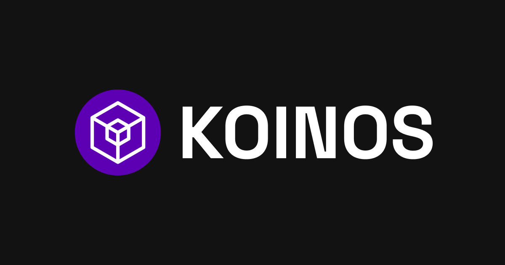
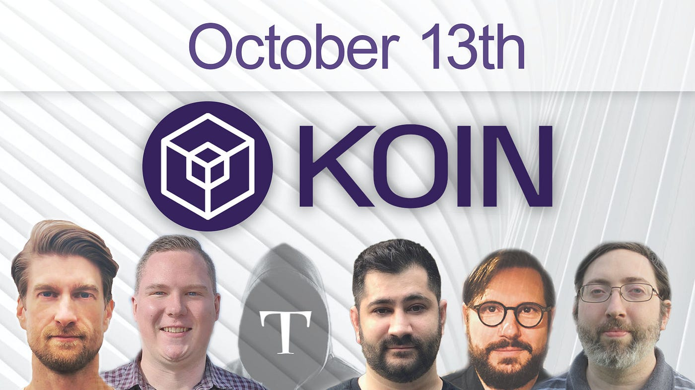
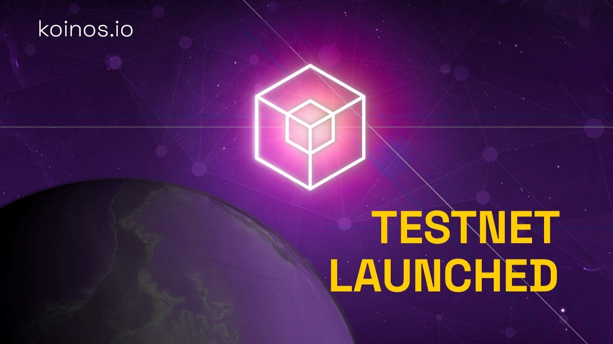
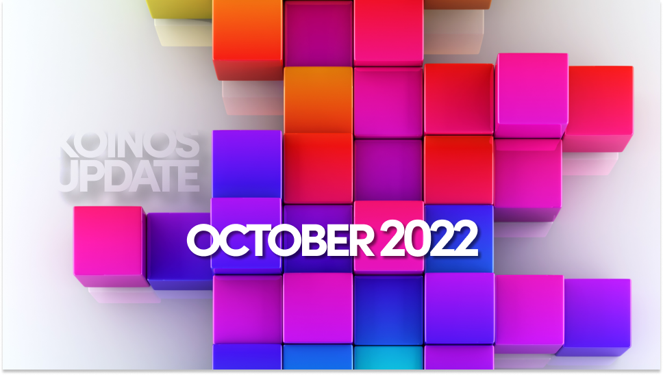
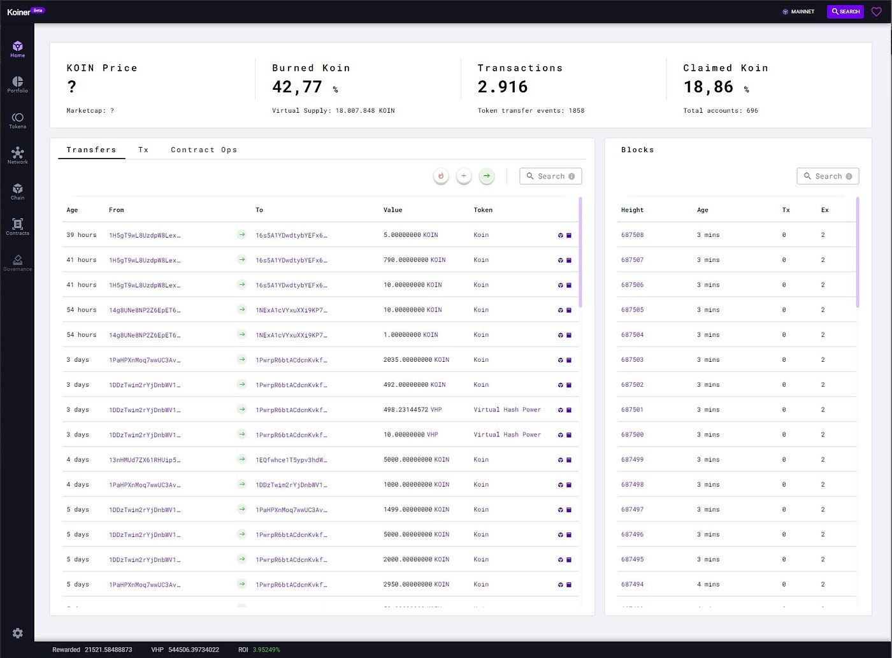
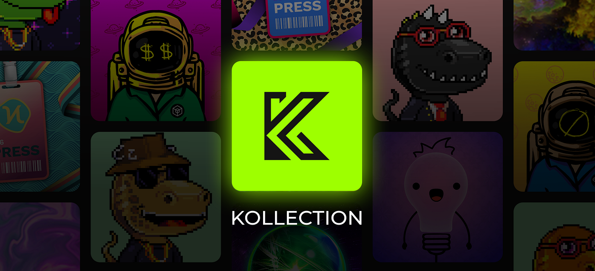
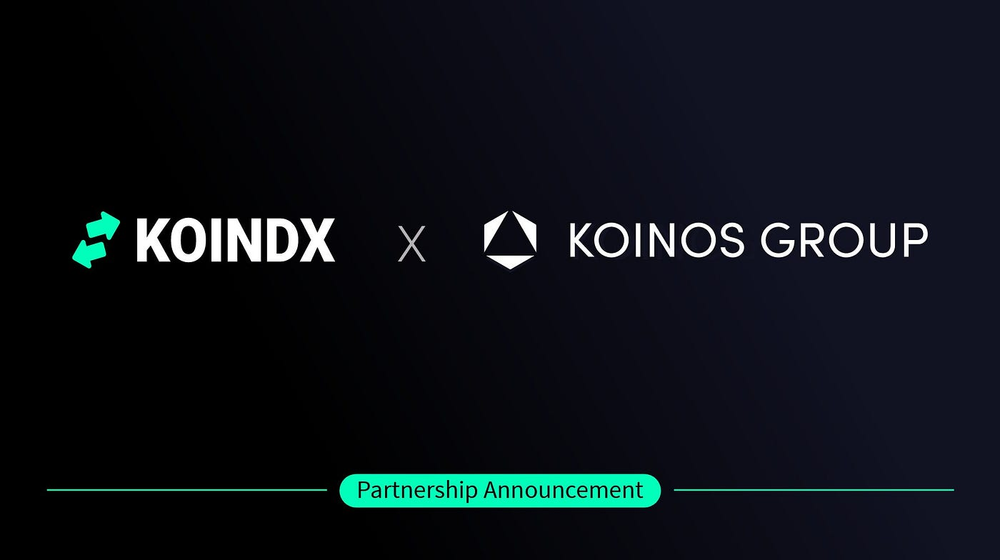
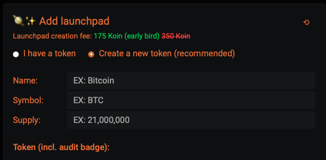
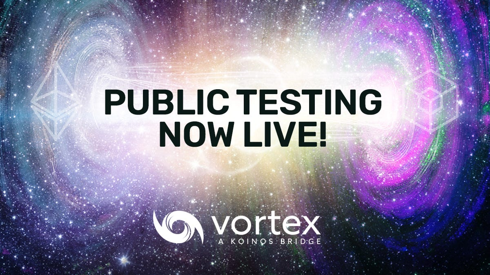

# Koinos Exists: A Chronicle of a Blockchain That Cannot Be Recreated

*Koinos official visual identity. Source: [Koinos media kit](https://koinos.io/media).*

We are entering an era in which artificial intelligence and large language models can help almost anyone write software. A single developer can generate an application, fork a codebase, modify a protocol, or even launch a new blockchain faster than ever before. In that world, the mere ability to create another chain is no longer the scarce thing.

What cannot be generated on demand is history.

Koinos matters because it exists as a lived blockchain: a chain launched on mainnet, used by real people, shaped by real transactions, tested by markets, criticized by its own community, maintained through difficult transitions, and extended by developers who were not all part of the founding company. Its value is not only in its code, architecture, or technical ideas. It is also in the path that brought it here: the people who mined it, built wallets and tools, debated governance, lost money, donated funds, launched applications, ran infrastructure, and kept the network visible when the original company stepped back.

In the age of AI-generated software, this distinction becomes more important. You can fork code. You can launch another blockchain. You can reproduce an architecture. But you cannot fork the exact history of Koinos. You cannot recreate the original ERC-20 mining period, the Steem lessons that shaped the project, the first mainnet transactions, the community debates around Cafe, the launch of KoinDX, Kollection, KAP, Fogata, Konio, Sovrano, Koinos.fun, the formation of Koinos Community Foundation, or the long chain of contributions that made the ecosystem what it is.

This article is therefore not only a list of milestones. It is an attempt to preserve the memory of a blockchain as a social, technical, and historical object.

The Koinos story does not begin with KOIN mining or mainnet. It begins in the Steem era: a practical demonstration that fee-less blockchain applications could reach normal users, followed by a governance crisis that shaped many of Koinos' design goals.

This chronology is based on public project material, the Koinos whitepaper, Koinos Group and Koinos Network posts, GitHub releases, ecosystem announcements, public X posts, and community discussions preserved in Telegram and Discord. Official publications are used for dates and formal announcements; community channels are used to recover context: what people were building, debating, doubting, translating, funding, and maintaining at each stage.

That distinction matters because Koinos' later history is not only the history of Koinos Group. It is also the story of independent community developers, operators, writers, translators, liquidity providers, wallet builders, NFT builders, governance participants, and critics who gradually became part of the chain's continuity.

## 2016-2020 - The Steem Lesson

Before Koinos, several of the people who later built it were core developers of Steem, one of the first large fee-less social blockchains. Steem and Steemit proved something important: ordinary users could interact with a blockchain every day if the product felt like a normal web application and did not ask them to pay fees for every action.

This is the positive lesson Koinos inherited from Steem. Free transactions, account abstraction, social applications, and resource delegation were not abstract ideas. They were tested in a real consumer environment.

The Steem ecosystem also produced applications that showed how far a fee-less blockchain could go. Steem Monsters, later Splinterlands, became one of the best-known blockchain games of that era. It demonstrated that games, social apps, and digital assets could attract users when the blockchain stayed mostly out of the way.

But Steem also exposed a severe governance weakness. In 2020, after Justin Sun acquired Steemit Inc., the Steem community entered a governance conflict in which exchange-held customer stake was used in witness voting. That event led to the Hive fork and became one of the clearest examples of how custodial stake and concentrated founder holdings can threaten a delegated proof-of-stake network.

The Koinos whitepaper describes this experience directly: the team had been core developers of Steem until a hostile takeover and exchange attack. Koinos was designed partly as an answer to that failure mode: a fee-less general-purpose blockchain that would be more decentralized at launch, more modular in operation, and more resistant to exchange governance capture.

## 2019-2020 - The Discord Conversation Before Koinos

The earliest useful Discord record begins before Koinos had its final name. In August 2019, the server still reflected the Steem ecosystem: proposals, application interoperability, and the search for better developer infrastructure. By November 2019, Andrew Levine was describing the server as a place to discuss cross-platform features for Steem applications, including OpenSeed, off-chain accounts, encrypted messaging, and a more consistent user experience across apps.

This pre-Koinos discussion matters because it shows continuity. The later Koinos emphasis on free accounts, fee-less usage, smooth UX, and application-level primitives did not appear suddenly in the 2020 whitepaper. It came out of a working social-blockchain environment where developers had already seen which parts of blockchain UX could reach normal users and which parts remained painful.

The same early Discord history also captured the negative lesson. Community members were already criticizing delegated proof-of-stake, premine dynamics, stakeholder governance, and price-driven thinking in late 2019 and early 2020. After the Steem/Hive split, those concerns became more concrete: people who were attracted to OpenOrchard were often attracted because they wanted the innovation and usability of Steem without repeating the governance weaknesses that had become visible in Steem and Hive.

## 16.04.2020 - OpenOrchard Is Announced

On April 16, 2020, after leaving Steemit Inc., a large part of the former Steem development team announced OpenOrchard. The mission was to make blockchain technology more accessible for decentralized application developers.

This is the organizational starting point of Koinos. The team did not begin by saying "we are launching another token." The initial framing was broader: build tools and technology that would let developers create applications with the usability of Steem, but without inheriting Steem's governance weaknesses.

The Koinos Discord `#general` channel preserves the public reception of that starting point. On April 16, 2020, Andrew Levine shared the OpenOrchard announcement there. Within days, community members were already comparing Steem, Hive, OpenOrchard, governance weaknesses, and the possibility of building on a more sustainable base layer. That matters because the Discord record shows Koinos beginning as a post-Steem developer conversation before it became a mining, exchange, or price story.

Ron Hamenahem's public record shows that the product and design side was already technical. On March 25, before the OpenOrchard announcement, he told Discord that he had been working on the **OpenLink mobile application** and offered to share what he had learned from the OpenSeed API. Later profiles identified him as OpenOrchard's Head of Design. That combination—interface work, API experimentation, and operational coordination—became the pattern of his Koinos contribution. He was not one of the principal blockchain architects, but he repeatedly made their protocol usable, visible, and easier to operate.

## 16.06.2020 - Koinos Is Announced as a New Blockchain

On June 16, 2020, OpenOrchard announced that it was building a new blockchain from scratch: Koinos.

That decision matters. The team could have built on Ethereum, Hive, EOSIO, or another existing chain. Instead, the conclusion was that none of the available platforms combined the properties they wanted: true fee-less usage, free accounts, free smart contract execution, resource delegation, modularity, fair launch, and governance that could evolve without hard forks.

Koinos was therefore not only a new chain. It was an attempt to generalize what Steem had proven at the application layer and rebuild it as a programmable smart contract platform.

Discord also clarifies how early the microservice idea entered the conversation. In `#general` on June 16, 2020, Andrew shared the OpenOrchard update on Koinos and ODESI, and the preview described the Koinos blockchain alongside ODESI microservices. A July 2020 discussion picked up the same architecture, with a community member noting that the project was being described as a suite of microservices. That is an early signal that Koinos' later modular-node architecture was not a late branding layer; it was already part of the technical identity in the first public months.

## 23.09.2020 - Koinos Group LLC Is Registered

On September 23, 2020, Koinos Group LLC was registered in Delaware. This formalized the team behind the project and set the stage for a more public launch.

The company would later become the center of Koinos development through the ERC-20 mining phase, testnets, mainnet launch, KoinosPro, Vortex development, and the early ecosystem. That role would change dramatically years later, when the community had to take over operational responsibility.

The core Koinos Group names referenced in this chronology are:

- **Andrew Levine / `@andrarchy`**: founding CEO of Koinos Group and the principal public communicator, strategist, business-development voice, and community interlocutor during Koinos' formation, testnets, mainnet launch, and first two production years. He was not the principal protocol architect; his distinctive contribution was translating the architects' work into an understandable mission, gathering feedback, promoting community developers, forming partnerships, and repeatedly distinguishing the company from the decentralized network. In August 2024 he moved from CEO to Chief Communications Officer. After leaving Koinos Group in December 2024, he continued for a time as an independent advocate and offered mentoring to Koinos builders. Public profile: X [`@andrarchy`](https://x.com/andrarchy).
- **Steve Gerbino / `@sgerbino`**: Koinos co-founder and blockchain architect. He was announced as CTO of Koinos Group in April 2022 and became CEO in August 2024. Steve's community role combined protocol design with unusually direct public support: he explained mining, mana, releases, governance proposals, and node upgrades; recognized independent builders; and invited community developers into the core repositories. During the 2025 transition he communicated the new-network direction and signed the operational handoff of Koinos Group assets and services to the community. Public profiles: X [`@ssgerbino`](https://x.com/ssgerbino), GitHub [`sgerbino`](https://github.com/sgerbino), LinkedIn [`stevegerbino`](https://www.linkedin.com/in/stevegerbino/).
- **Michael Vandeberg / `@mvandeberg`**: Koinos co-founder and principal blockchain architect; CTO of Koinos Group from August 2024. Michael was the project's most persistent public protocol reference: he explained consensus, mana, the snapshot and decentralized claim process, microservices, governance boundaries, token standards, node behavior, and the technical roadmap. He also reviewed community proposals and repeatedly converted operator and dApp-developer feedback into P2P fixes, safer contracts, nonce handling, and REST tooling. During the company wind-down he continued answering technical questions and gave detailed explanations of the legal and accounting constraints around Koinos Group's remaining tokens. Public profiles: X [`@koinosvandeberg`](https://x.com/koinosvandeberg), GitHub [`mvandeberg`](https://github.com/mvandeberg), LinkedIn [`michaelvandeberg`](https://www.linkedin.com/in/michaelvandeberg/).
- **Ron Hamenahem / `@brklyn8900`**: Koinos co-founder, product designer, operations lead, project manager, and hands-on front-end / application developer. He was Head of Design at OpenOrchard and Koinos Group, was publicly identified as Koinos Group's co-founder and COO by mainnet, remained COO in the August 2024 reorganization, and is listed on the current Koinos team page as **Koinos Founder, Project Manager + Developer**. His public work spans miner support, the Koinos brand and websites, documentation interfaces, tutorials and developer sessions, Kondor design, Armana Portal, Koinos.fun, Koinscan, the KPS front end, Foundation formation and infrastructure, and the Armana rewrite of Kondor v2. That breadth should not be confused with authorship of Koinos consensus or protocol architecture, which belonged principally to Steve Gerbino and Michael Vandeberg. Public profiles: GitHub [`brklyn8900`](https://github.com/brklyn8900), LinkedIn [`ronh`](https://www.linkedin.com/in/ronh).
- **Nathaniel Caldwell**: Koinos co-founder / blockchain architect referenced in early Koinos technical material, including the "easy fork" testnet discussion.

Those roles changed over time, especially after Koinos Group stopped being the operating center of the chain. Later names in this article, such as Luke Willis, Kui He, Julián González, Justin Welch, Adriano Foschi, Frank (`@ElImbatido`), VonLooten, fbslo, MiXiBo, Ederaleng, Saleh Hawi, Roamin, Jon Rice, and `@interfecto`, are treated as community contributors unless a cited source explicitly says otherwise.

Known public profiles for recurring community contributors include:

- **Luke Willis / `@lukemwillis`**: community protocol contributor, full-stack dApp and UX developer, product co-founder, pool operator, and educator. He created **The Koin Press**, whose newsletter and 57-episode podcast made Koinos and adjacent crypto ideas understandable in ordinary language from November 2021 through June 2024. His most consequential protocol contribution came after the original Proof-of-Burn paper: he proposed replacing NFT-like virtual miners with fungible Virtual Hash Power, an idea Koinos Group explicitly credited in the enhanced KPoB design and unified whitepaper. He then wrote the original BurnKoin pool contracts and frontend, co-operated the first KPoB pool with Kui He, co-founded KAP, built its user interface, and published smaller open-source experiments including the Press Badge NFT and reusable React components for Koinos dApps. The public KAP history also establishes an important collaboration boundary: Luke led the visible product and frontend track, while Roamin authored most of the surviving contract commits. The current official Koinos team page lists Luke as **Community Developer**. X [`@lukemwillis`](https://x.com/lukemwillis), GitHub [`lukemwillis`](https://github.com/lukemwillis), personal site [`lukewillis.com`](https://lukewillis.com/), and the historical [The Koin Press podcast record](https://www.listennotes.com/podcasts/the-koin-press-luke-willis-4Iuy2SLmGeg/).
- **Kui He / motoengineer**: community developer, product co-founder, mining-pool operator, technical educator, Discord moderator, and later Koinos Community Foundation member. His public background is unusual for an ecosystem builder: LinkedIn records his structural-engineering career and Professional Engineer qualification, while a December 2023 interview describes him as a first-generation American whose family is from Guangzhou and an early KOIN miner from launch day. He launched Koinos Forum and helped revive the community AMAs; co-founded BurnKoin and KAP with Luke Willis; co-founded Koinos-Social with Roamin; operated public seed and producer infrastructure; published a 30-video Koinos education sequence; co-hosted the Koinos Podcast; and returned with the AI-assisted Koinos Pulse beta in 2025. The current official Koinos team page lists him as **Developer**. X [`@kuixihe`](https://x.com/kuixihe), YouTube [`@kuixihe` / motoengineer](https://www.youtube.com/@kuixihe), LinkedIn [`kuixihe`](https://www.linkedin.com/in/kuixihe).
- **Julián González / `@jga` / `@joticajulian`**: independent developer whose contribution connects almost every technical layer between Koinos' fair-launch mining period and its community-maintained phase. His pre-Koinos public repositories already included Steem/Hive explorer and proposal tooling. On Koinos he co-built Koinos Club, created the JavaScript/TypeScript library **Koilib** and the original **Kondor** browser wallet, built the WKOIN/native claim interface, Fogata, Koinos Polls, Nicknames, Arkinos, Manuscript, the Koinos Fund System, smart-wallet and contract-development tools, and helped shape KCS standards. He also operated producers and pools, reviewed or authored core changes, supported other developers in Discord and Telegram, and became a member of the Koinos Community Foundation. The historically important pattern is continuity: mining infrastructure became developer tooling; developer tooling became wallets and dApps; dApps led into governance, standards, funding, and post-company network maintenance. He was not one of Koinos' founding protocol architects, and several milestones below were collaborations rather than solo work. Telegram [`@joticajulian`](https://t.me/joticajulian), X [`@joticajulian`](https://x.com/joticajulian), GitHub [`joticajulian`](https://github.com/joticajulian), Hive [`@jga`](https://hive.blog/@jga/posts).
- **Justin Welch / Justin W. / `@ogjustinw`**: early mining-era participant, full-stack / infrastructure engineer, Kollection co-founder, initiator of the Koinos Contract Standards repository, KCS-2 co-author, and a substantial contributor to Koinos.io, Vortex, Koinos.fun, and the Koinos Community Foundation. His professional background helps explain the breadth of that work: his public profiles record an infrastructure career beginning in 2001, Head of Engineering at Steemit from 2016 to 2020, and later senior engineering roles at Splinterlands and AppMakers USA. On Koinos he repeatedly worked across contracts, frontends, backend services, AWS / deployment, indexing, standards, and user support. Several of the products below were collaborations rather than solo projects: Kollection's launch team also included Dokterkraakbeen, Ederaleng, and VonLooten; KCS-2 had four named authors and drew on Roamin's reference implementation; Vortex grew from Roamin's earlier bridge and Ederaleng's leadership; and Koinos.fun was co-developed with Ron Hamenahem and the Koinos architects. X [`@ogjustinw`](https://x.com/ogjustinw), GitHub [`jredbeard`](https://github.com/jredbeard), LinkedIn [`justin-p-welch`](https://www.linkedin.com/in/justin-p-welch/).
- **Adriano Foschi / `@adrihoke`**: community product developer focused on removing user friction. He created the first native Koinos mobile wallet, **Konio**; the modular smart-account framework **Veive**; the **Sovrano** authentication and payment track; the **Sovry** Telegram wallet; and the original **Kuku Games** price-prediction prototype. He also coordinated a multi-project onboarding campaign, helped other dApp developers, and in 2025 created an early Foundation planning board and volunteered in the preparations for Vortex. Public profiles: X [`@adrihoke`](https://x.com/adrihoke), GitHub [`adrianofoschi`](https://github.com/adrianofoschi), LinkedIn [`adrianofoschi`](https://www.linkedin.com/in/adrianofoschi).
- **Frank / `@ElImbatido`**: Telegram [`@ElImbatido`](https://t.me/ElImbatido), creator and principal developer of **Koiner.App**, its explorer interface, indexing backend, and GraphQL data API. The historical V1 repository was `koiner-dao/koiner-backend`; its [original GitHub URL](https://github.com/koiner-dao/koiner-backend) is no longer available.
- **VonLooten / `@vonlooten`**: X [`@vonlooten`](https://x.com/vonlooten), GitHub [`vonlooten`](https://github.com/vonlooten), and Medium [`@vonlooten`](https://medium.com/@vonlooten). Co-founder and original CEO of KoinDX; he led business strategy, contributed to development, and was one of the project's most visible early communicators.
- **fbslo / `@fbsloXBT`**: X [`@fbsloXBT`](https://x.com/fbsloXBT), GitHub [`fbslo`](https://github.com/fbslo). Slovenia-based DeFi developer who created the earlier KoinoSwap project, joined forces with the KoinDX team in May 2022, and later built Koinos atomic-swap and bridge-related contracts.
- **MiXiBo / `@mixibo_koincity`**: principal developer, product designer, operator, and community support contact behind **KoinCity**. He turned the project from Koinos' first no-code token launchpad into a broader token platform with presales, token and liquidity locks, market and staking views, project chats, KoinDX integration, partner API keys, quick launches, NFT minting, and its own node and server infrastructure. Public profiles: Telegram [`@mixibo_koincity`](https://t.me/mixibo_koincity), GitHub [`MiXiBo`](https://github.com/MiXiBo), X [`@TheRealKoincity`](https://x.com/TheRealKoincity).
- **Ederaleng**: X [`@ederaleng`](https://x.com/ederaleng), Telegram [`@ederaleng`](https://t.me/ederaleng).
- **Saleh Hawi / `@saleh_hawi`**: Telegram [`@saleh_hawi`](https://t.me/saleh_hawi). Community organizer, KoinDX product / business contributor and user-facing operator, exchange-listing campaign coordinator, moderator, and technical explainer. He was not one of KoinDX's original co-founders, but by 2024 he had become one of its publicly recognized contributors and remained a support contact through 2025.
- **Roamin / `_roamin_`**: independent community engineer whose recurring contribution was turning experimental developer ideas into reusable Koinos infrastructure. He created the AssemblyScript toolchain that became first-party software; Local-Koinos; My Koinos Wallet and its dApp SDK; the original end-to-end Koinos-Ethereum bridge prototype; Koinos' WalletConnect chain integration and the Armana WalletConnect SDK; the original Koinos REST server; the AssemblyScript implementation of `get_contract_metadata`; VRF and stress-test applications; and, with Kui He, Koinos-Social. The current Koinos team page lists `@roamin` as **Community Developer**. Those contributions do not make him a founding protocol architect, a named KCS-2 author, the author of Portal, or the sole author of the later production REST and Vortex systems. GitHub [`roaminro`](https://github.com/roaminro).
- **Jon Rice / `@jonricecrypto`**: long-running Koinos adviser, communications strategist, writer, and community advocate. He said at the Federation launch that he had advised the team without compensation since 2020; his professional record includes editor-in-chief roles at Cointelegraph, Blockworks, and Crypto Briefing, co-founding Crypto Briefing, launching Cointelegraph Magazine, and earlier work as an advertising-agency founder and creative director. On Koinos he founded and served as the first president of the 2023 Koinos Federation, publicly articulated the “free, frictionless, familiar” adoption thesis, authored the 2024 long-form case for Koinos, brought Koinos.fun into crypto media, and later offered media access, the `feeless.io` domain, and a conditional 500,000 KOIN contribution to community funding. The current official Koinos team page lists him as **Community Advocate**. His role was advocacy, coordination, fundraising strategy, and editorial amplification—not protocol architecture or application development—and the Federation treasury proposal described below was never enacted. X [`@jonricecrypto`](https://x.com/jonricecrypto), LinkedIn [`jonricecrypto`](https://www.linkedin.com/in/jonricecrypto/). Earlier Federation-era Koinos posts also referenced [`@jonrice`](https://x.com/jonrice).
- **Pablo Garcia / `pgarcgo`**: early Spanish-community organizer and educator, creator of the discontinued podcast **Koincast**, testnet tester, long-running node operator, founding Koinos Community Foundation member, public testnet and API steward, lead developer of **Koinos One** and the monolithic **Teleno** node, and later an upstream contributor to the Koinos state-database and chain replay repair. His role changed substantially over time: he was not one of the original protocol architects, but developed from a bilingual community bridge into an infrastructure maintainer and consensus-adjacent contributor. Telegram [`@pgarcgo`](https://t.me/pgarcgo), X [`@pgarcgo`](https://x.com/pgarcgo), GitHub [`pgarciagon`](https://github.com/pgarciagon).
- **`@interfecto` / Atb 3tb / `@interfectoewm`**: community developer, applied researcher, Koinos Community Foundation member, testnet and node operator, data-infrastructure builder, ecosystem maintainer, and frequent user-support participant. His visible work began in 2025 with an LLM-oriented Koinos contract guide and maintenance of `koinos.io`, then expanded into the community testnet and faucet, **KoinosScan**, a KOIN/VHP distribution dashboard, node and seed monitoring, a Go/SQLite token indexer, and the **Koinos EVM Engine** proof of concept. He also submitted public-site updates as Koiner, Konio, Chainge, and MEXC stopped being valid references; the merged work removed Koiner and later MEXC, while the broader early Konio/Chainge cleanup closed without merge. In the main chat he repeatedly helped users move between MEXC, Kondor, MetaMask, and Vortex while recommending small test transactions, empty wallets for experiments, and caution around unsolicited direct messages. The record shows a recurring pattern: he uses AI-assisted development to produce working prototypes quickly, but publicly distinguishes functional tests from security review and production readiness. The current official Koinos team page lists `@interfecto` as **Consultant + Developer**. X [`@interf3cto`](https://x.com/interf3cto), GitHub [`interfecto`](https://github.com/interfecto), Telegram [`@interfectoewm`](https://t.me/interfectoewm).
- **Alberto / Transeunte**: Telegram [`@transeunte`](https://t.me/transeunte).
- **Nomad100x**: Telegram [`@nomad100x`](https://t.me/nomad100x).
- **Carlos Welele / `@Weleleliano`**: Telegram [`@Weleleliano`](https://t.me/Weleleliano). Early Spanish-community participant, bilingual explainer and translator, organizer of Koinos social-media materials and engagement channels, and long-running moderator of the main Koinos Telegram group. His contribution was social infrastructure: helping users understand Koinos, keeping information circulating, and protecting newcomers from spam, impersonators, and fake groups.

## 06.10.2020 - Whitepaper and KOIN Mining Are Announced

On October 6, 2020, Andrew Levine announced the Koinos whitepaper and the upcoming release of KOIN as a mineable ERC-20 token on Ethereum. The mining period was designed to be open and accessible: CPU mining, no ICO, no pre-mine, and a distribution mechanism intended to avoid the concentration problems that had damaged trust in other chains.

The goal was explicit: maximize decentralization by giving ordinary users a fair path to acquire the token before mainnet.

*The original KOIN mining announcement placed the October 13 launch date alongside the founding team. Source: [OpenOrchard, “Announcing Koinos Whitepaper & KOIN Mining”](https://medium.com/openorchard/announcing-koinos-whitepaper-koin-mining-e2755f5be33f).*

Discord `#general` shows the announcement functioning as an immediate onboarding event. Andrew posted the whitepaper and mining announcement on October 6, 2020, and the same discussion quickly turned into practical questions about proof frequency, ETH costs, laptops, and how the miner worked. Steve Gerbino explained that proof frequency affected ETH spending and mining variance rather than damaging hardware, which shows how quickly the channel shifted from narrative to support.

The same thread is also where the project's fair-launch language was tested publicly. Users asked whether Koinos would repeat Steem's premine problem or whether mining would behave like a disguised ICO because it required spending ETH on gas. Steve's answer was direct: no ICO, no ninja mine, no hidden launch trick. Other users framed the absence of a premined controlling stake as the key reason Koinos could claim a cleaner start than Steem, while still recognizing that fair launch did not guarantee perfect distribution.

To support this, the team published mining software in two forms:

- a desktop GUI miner for Mac and Windows;
- a Linux command-line miner for servers.

The default miner included an optional developer donation, but the setting was configurable. By the end of the mining period, the donations represented less than one percent of total supply.

## 13.10.2020 - KOIN ERC-20 Mining Begins

On October 13, 2020, after a seven-day countdown, KOIN ERC-20 mining officially began on Ethereum.

That same day, the first KOIN/ETH Uniswap v2 pair was created anonymously. Early trades happened at roughly one cent per KOIN in the exchange rate of the time.

This period is important because it shaped Koinos' later legitimacy. KOIN was not sold through an ICO. It was mined in the open before the native chain existed, and the future mainnet would later use a snapshot of those ERC-20 balances.

The Discord record captures the messy reality of that fair launch. On launch day, `#general` included users asking why ETH sent to the miner address had not appeared, whether the miner app had to remain open, and how to begin mining. Within the next days, discussions moved into Infura endpoints, Ropsten defaults, gas prices, hardware-wallet concerns, claiming mechanics, and the future mainnet handoff. That does not change the official launch date, but it makes the milestone more concrete: KOIN mining began as an open technical process that required real community troubleshooting, not as a polished centralized sale.

One especially important technical discussion explained how the mining difficulty worked. In Discord, Michael Vandeberg described the mechanism as an internal market-maker model, similar in spirit to Uniswap's constant-product logic: one side represented KOIN, the other represented hashes, hashes decayed over time, and competition changed the implied price of producing proofs. This is useful historically because it shows that KOIN mining was not only "CPU mining on Ethereum"; it was an economic mechanism implemented through smart-contract logic, Ethereum transactions, and a dynamic hash market.

The user-support questions were part of the launch itself. Miners had to understand proof frequency, ETH gas, Infura endpoints, local Ethereum nodes, and why lower proof frequency meant fewer Ethereum transactions but less frequent rewards. That friction explains both the strengths and weaknesses of the launch: it was open and technically verifiable, but it still favored people who could understand Ethereum tooling, gas costs, and mining variance.

Pablo Garcia / `pgarcgo` appears in this record as an early participant rather than a member of the development company. Before launch he shared Ubuntu and Node.js setup help; on launch day he asked about the first proof and proof frequency; and over the following week he helped other users with installation problems. He also challenged unsupported claims that GPU miners had already broken the fair launch, asking for evidence and proposing that the community test the hypothesis instead of repeating it. That pattern remained visible later: advocacy for Koinos combined with a preference for reproducible evidence, independent research, and open criticism.

Justin Welch was also present before the application ecosystem that later made his name visible. Discord records `ogjustinw` joining on October 14, 2020, the day after mining began. On October 25 he proposed an exact relationship between `OMP_NUM_THREADS` and the miner's `threadIterations` setting, while the surrounding discussions covered CPU farms, private-key handling, proof frequency, gas, and the fairness of the launch. This does not make him an author of the miner or a Koinos Group engineer. It establishes a more useful historical boundary: Justin entered as a technically experienced miner and community troubleshooter, more than two years before Kollection launched.

## 18.11.2020 - OpenOrchard Becomes Koinos Group

On November 18, 2020, OpenOrchard was rebranded as Koinos Group.

The rebrand made the project easier to understand publicly. OpenOrchard had been the company name, but Koinos was becoming the identity of the technology, the token, and the future chain.

## 22.11.2020-30.01.2021 - Koinos Club Makes Fair-Launch Mining Cheaper

Julián's first major Koinos product appeared during the ERC-20 mining period, not after mainnet. On November 22, 2020, he and community developer `@pstaiano` [introduced **Koinos Club**](https://hive.blog/koinos/@jga/koinos-pool), a pool designed around the mining contract's beneficiary feature. Groups of five miners could share one Ethereum proof transaction while the mining contract still paid rewards directly to each miner's address. The design reduced gas expenditure by as much as roughly 60 percent without placing mined KOIN in a custodial withdrawal account.

The [Koinos Club V2 announcement](https://hive.blog/koinos/@jga/koinos-pool-v2) on January 30, 2021 pushed the same idea further. Miners submitted frequent low-cost proofs to the pool, the pool paid rewards as WKOIN on Hive, and only sufficiently strong proofs were sent to Ethereum. Users did not have to register, deposit ETH into a pool account, or trust an operator to hold their native KOIN balance. A GUI miner and the Spanish community helped make the workflow more accessible.

Koinos Club matters because it established the pattern that later defined Julián's work: identify a protocol-level capability, wrap it in a usable open tool, and reduce the cost of participation for people who cannot operate at the most technical layer. It was still an experimental pool and its fee savings depended on Ethereum gas and proof conditions. An October 2020 [`koinos-miner` pull request](https://github.com/koinos/koinos-miner/pull/85) in which Julián proposed using miner difficulty rather than the target also belongs to this period, but it was closed without being merged and should be remembered as an early technical intervention, not as an accepted core fix.

## Late 2020 - Koinos en Español Becomes the First International Community Branch

The Spanish-speaking community formed unusually early. Telegram evidence from late November and December 2020 shows the `@koinoshispano` group already active, explaining Koinos' modular upgradeability and state-paging ideas in Spanish, discussing the ERC-20 mining phase, and sharing subtitled Koinos videos through the **Koinos en español** YouTube channel.

Pablo's first surviving message in the group, on November 18, identified the immediate problem: [“Hay muy poca información en español publicada”](https://t.me/koinoshispano/9) — very little information about Koinos had been published in Spanish. He then explained the miner, the absence of a conventional ICO, the future mainnet, state paging, and modular upgradeability. On November 29 he [summarized modular upgradeability](https://t.me/koinoshispano/241) as the ability to change rules and protocol without conventional hard forks. This makes his early contribution more specific than simply promoting a token: he was translating an unfinished technical architecture while the only live KOIN artifact was still an ERC-20 mining contract.

By December 20, 2020, the Spanish channel was already sharing a broader communication stack: YouTube, Facebook, Twitter / X as `@koinos_espaniol`, Telegram as `@koinoshispano`, and a Spanish-speaking Discord. On January 11, 2021, it shared a subtitled video of Andrew Levine presenting the Spanish community. Later, in November and December 2021, community member Pablo Garcia / `@pgarcgo` referred to those Spanish channels in the main group as official Spanish-speaking communication routes.

This makes `@koinoshispano` historically important beyond language. It was one of the first examples of Koinos becoming international through community work rather than through a formal corporate regional program. The channel was created and maintained in that early period by Spanish-speaking community members including `@pgarcgo` and Carlos Welele / `@Weleleliano`, and it became a place for translation, technical explanation, onboarding, mining help, testnet discussion, and later community coordination.

Pablo also brought prior blockchain-operator context into that work. In January 2021 he [described himself](https://t.me/koinoshispano/925) as having collaborated with Andrew Levine and Michael Vandeberg for years as a Steem block producer and as knowing them through conferences. That is a participant's own account rather than an independent employment record, but it helps explain his initial position in Koinos: he could introduce the original developers to Spanish users while still warning that, at that stage, the project consisted largely of reputation, an ERC-20 token, and promises rather than a finished public chain.

Welele's role as a bridge into the main English-language community was visible by April 18, 2021, when he reported, [“Gotta tell you, in the Spanish Telegram we are fomoing hard with Koinos”](https://t.me/koinos_community/8520). The phrase was playful, but the underlying role lasted for years: he carried questions from the Spanish group into the main channel, translated answers back, explained mana, Proof of Burn, wallets, supply, claims, and mainnet behavior in Spanish, and pushed for subtitles and more accessible presentation. In April 2022, while volunteering to add Spanish subtitles to a video, he summarized that philosophy in another characteristic line: [“This is the content that make crypto accesible.”](https://t.me/koinos_community/77315)

There is one nuance. Later Telegram lists described several language groups, including Spanish, as "Non-Official International Groups." That later wording should not erase the early history: in 2020 and 2021, Koinos en español was being treated publicly as the Spanish-language community route, while later community governance became more careful about what counted as official.

That Spanish track later also produced more formal media experiments. Pablo Garcia / `@pgarcgo` launched **Koincast**, a Spanish-language podcast connected with `koincast.io` and the X profile `@koincast`. The podcast is now discontinued, but it belongs to the same early international-community history: Koinos was not only translated into Spanish through Telegram posts, but also explained through longer-form Spanish audio content.

## 13.04.2021 - Mining Period Effectively Ends

By April 13, 2021, six months after mining began, approximately 99.34% of all KOIN had been mined and distributed across 1,306 Ethereum addresses, according to the original Hive chronology.

This completed the fair launch phase. The next challenge was no longer distribution. It was execution: could the team build the chain that would make those ERC-20 balances native?

Discord also shows why the end of mining did not end the distribution debate. By February and March 2021, community members were already asking who or what `cafe` was, how it had obtained so much hashpower, whether it represented rented CPU capacity, a coordinated miner, or possibly a bug, and whether two `0x1337cafe` addresses were related. Some users noted that Cafe had stopped or slowed down, that it did not appear to be dumping as aggressively as feared, and that the visible hashrate had looked unusually large. The important point is not that Discord proved Cafe's identity; it did not. The important point is that the Cafe question was born during the mining era itself, not years later as retrospective mythology.

That early uncertainty should be kept separate from later on-chain analysis. KoinosScan can identify known Cafe-linked wallet clusters and trace flows through Uniswap, snapshot balances, and claims. Discord adds the social layer: people experienced Cafe as an unresolved fairness question while mining was still recent, and the project had to carry that uncertainty into mainnet.

## 30.06.2021 - First Koinos Testnet Launches

On June 30, 2021, Koinos launched its first public testnet, version 0.1.

The testnet introduced one of Koinos' most important architectural decisions: a microservice-based blockchain framework. Instead of building a monolithic chain, Koinos split core functions into services, making the system more modular and easier to upgrade.

This was the first public technical proof that Koinos was not simply a token waiting for a chain. The chain framework itself was taking shape.

*The first public testnet turned Koinos from an ERC-20 distribution story into a running blockchain framework. Source: [Koinos Network, “Koinos Testnet: LIVE!”](https://medium.com/koinosnetwork/koinos-testnet-live-5674e93bd759).*

The `#general` history adds two useful details. First, by February 2021, community members were already treating the testnet as the next execution milestone after mining, with Pablo Garcia / `pgarcgo` urging patience until testnet arrived. Second, on July 19, 2021, Andrew shared the "EASY FORK" testnet update in `#general`; the preview stated that the testnet had gone live on time and that the team had already executed an easy fork. That makes the first testnet important not only because it existed, but because it immediately tested Koinos' promise of upgradeability without conventional hard-fork drama.

For Pablo, testnet was the point where community explanation began turning into direct software testing. On August 27 he [reported a CLI defect](https://github.com/koinos/koinos-cli/issues/39): the wallet claimed to be connected even when pointed at a nonexistent RPC endpoint, then returned a misleading zero balance. The issue was small, but historically useful. It is the first clear public GitHub record found for this chronology of `pgarciagon` testing Koinos software and converting user confusion into a reproducible bug report.

Andrew also framed testnet as a public learning process. In September, he [thanked the people who had asked questions, supplied critical feedback, and contributed to the conversation](https://t.me/koinos_community/22924). This was more than community management language: testnet users running nodes had already exposed synchronization and consensus behavior that led to early “easy fork” fixes. His public role was to keep that feedback loop open and explain why problems found by users were part of the product-development process rather than evidence that the experiment had failed.

## 28.05-20.09.2021 - Julián Builds the TypeScript and Browser-Wallet Access Layer

Before most ecosystem dApps existed, Julián worked on the path by which JavaScript and TypeScript developers could reach Koinos at all. In February he [documented Koinos Types](https://hive.blog/koinos/@jga/history-to-understand-what-koinos-types-is) and described his work bringing the protocol types into TypeScript. On May 28 he published a TypeScript microservice tutorial that subscribed to the chain's AMQP block queue, decoded blocks through Koinos Types, and verified their signers. The example connected the new microservice architecture to a language familiar to web developers instead of requiring every experiment to begin in C++.

On August 21 he released [Koilib](https://github.com/joticajulian/koilib), a JavaScript/TypeScript client library for browsers and Node.js. Its early `Provider`, `Signer`, `Contract`, and `Wallet` abstractions let developers create, sign, and broadcast transactions and call contracts without rebuilding the Protobuf and cryptographic layers themselves. Version 1.5 added contract deployment in September; later releases added Protobuf support, multisignature transactions, mana estimation, system-contract discovery, and contract-metadata calls.

On September 20 he introduced [Kondor](https://github.com/joticajulian/kondor), the first Koinos browser-extension wallet on the public testnet. The extension stored encrypted keys locally, exposed accounts to dApps, and gave the still-unlaunched chain a recognizable browser-wallet interaction model. Ron Hamenahem helped with the interface and logo, while Julián remained the original developer. Kondor was independent community software, not an official Koinos Group wallet.

Discord shows why these releases were infrastructure rather than one-time announcements. Julián announced Koilib there on August 21, helped developers use it through archived testnet and developer channels, and continued answering implementation questions years later. When Roamin pointed out in April 2024 that Koilib 5.7.0 contained a breaking API change under a minor version, Julián published 6.0.0 and deprecated the mistaken package version. In July 2024, while introducing Koilib 8's multisignature-aware mana estimation, he called it the base layer for websites that interact with Koinos. That long maintenance record is a central part of his contribution: other wallets, dApps, scripts, and tutorials could build on an independently maintained JavaScript access layer rather than each solving the same low-level problems.

## 02.11.2021 - Testnet v0.2 Goes Live

On November 2, 2021, testnet v0.2 was released. This continued the incremental march toward a production network.

During this period, the Koinos GitHub organization showed sustained development activity, and the team held regular AMAs and community updates. The project was still small, but technically active.

Discord shows the practical side of this phase. Users were already asking whether Kondor worked on testnet v2, how the later ERC-20 snapshot and claim process would connect Ethereum-compatible keys to native Koinos accounts, and how to keep testnet nodes running through Docker. Those details matter because wallet UX, claim UX, and node operations were not post-mainnet afterthoughts; they were being worked through publicly before the chain existed.

Pablo was one of those operators. On November 9 he worked through a fatal base58 configuration error in public, cleaned and relaunched the Docker stack, corrected the configuration, and then reported that his node was pushing blocks. In parallel, he used the Spanish group to recruit someone to translate the node instructions into an article or video that could be pinned and amplified. This combination—operate the software, document the failure, and translate the recovery—became the recurring shape of his later contribution.

## 09.10.2020-19.11.2021 - Ron Makes Design and Operations Part of the Product

Ron's earliest Koinos record is unusually concrete for someone later described mainly through an executive title. On October 9, 2020, he published an OpenOrchard GUI miner tutorial. During the mining launch he helped users troubleshoot Infura endpoints, process management, and release stability in Discord. On January 20, 2021, he said he had updated the public website in response to community criticism, asked for feedback, and then corrected its social-preview metadata. During the July testnet he was also running an Ubuntu VPS, finding blocks, and comparing setups with other operators.

The surviving public Git history shows the same work at larger scale. Ron prepared the [`koinos-branding`](https://github.com/koinos/koinos-branding/pulls?q=is%3Apr+author%3Abrklyn8900) repository for public use and corrected logo, font, SVG, tagline, and light-background assets. His Discord updates from January 2021 match the practical release cycle: publish the site, receive criticism, correct the interface and metadata, and ask the same users to verify the result.

He also built the presentation layer around protocol decisions and, on November 19, announced a weekly update email. The pattern is historically important: Andrew communicated the strategy, Steve and Michael designed the protocol, and Ron turned much of that work into a site, a brand, readable pages, operating instructions, and repeatable communications. Design was not decoration around Koinos; it was one of the interfaces through which users and developers could participate.

## 14.11.2021 - KOIN Reaches Its First Major Price Peak

On November 14, 2021, KOIN reached an all-time high around $1.63, according to the original Hive chronology.

This matters historically because later price weakness must be understood against the early market expectations. Koinos had attention, speculative interest, and a community that believed the technology could compete with larger smart contract platforms.

## 19.12.2021 - Proof of Burn Is Explained

On December 19, 2021, Koinos published an article explaining Koinos Proof of Burn, or KPoB.

Proof of Burn became one of the central economic ideas of Koinos. Instead of paying gas fees to validators, users consume mana derived from KOIN. Block producers compete through burning and opportunity cost rather than conventional transaction fees.

The aim was to preserve user-facing feelessness while still creating a security and incentive model for block production.

The Discord discussion around Proof of Burn was not only technical. In the archived AMA channel on December 19, 2021, a community member raised a tax concern: if burning KOIN is treated as a taxable disposal and block rewards are also taxable income, early producers could face a double burden. That question foreshadowed later Koinos debates about whether the economics of KPoB were elegant in protocol terms but complicated in real-world accounting terms.

At the same time, Discord users were connecting KPoB to mana and governance. Mana was often compared with Steem-style resource credits, but with the broader ambition of powering smart-contract interaction rather than only social actions. Governance-contract discussion appeared in late 2021 as well, with community developers asking how system-contract changes would move from company action toward on-chain governance.

## 02-03.02.2022 - Kui Launches Koinos Forum and Revives the Community AMAs

On February 3, 2022, an official Koinos project update credited **Kui He, known as motoengineer**, with launching [KoinosForum.com](https://medium.com/koinosnetwork/project-update-authorities-dsas-amas-8f37263bc66b) as a community-driven information source and discussion space. The same update said Kui had teamed up with Luke Willis to bring back the Koinos AMAs, beginning with a live Twitter Spaces session on February 2.

Discord preserves the operational cadence behind that announcement. Kui organized questions in the AMA channel, announced the live sessions, published recordings, and promoted weekly discussions about feeless blockchains, mana, wallets, Proof of Burn, developer incentives, onboarding, gaming, and bear-market economics. The visible sequence continued from February through at least June 2022. He also published short **Koinos Koncepts** explainers through the forum account and described his own role at the time as running Koinos talks while Luke maintained The Koin Press.

This was Kui's first clearly documented community product and an early example of his recurring pattern: create a venue, translate technical architecture into ordinary language, gather questions, and keep a live feedback loop between users and builders. No source found in this review documents a formal closure date or reason for Koinos Forum, so its later disappearance should not be assigned an invented post-mortem.

## 19.02.2022-29.03.2024 - Local-Koinos Makes Contract Integration Testing Reproducible

On February 19, 2022, Roamin announced that he had forked the Koinos node repository to let dApp developers start a local Koinos devnet quickly, with the system contracts and test accounts already available. By March 3 he was using it to run integration tests against testnet v3. In May he described **Local-Koinos** as a small Hardhat-like tool: instead of mocking every contract interaction or deploying repeatedly to a shared testnet, a developer could exercise contracts against a disposable local chain.

That distinction mattered as applications became more complex. The AssemblyScript Mock VM was useful for fast unit tests, but it could not reproduce every interaction among contracts, system calls, blocks, and transaction state. Local-Koinos supplied the heavier integration layer. Roamin kept it aligned with testnet v4 in October 2022, recommended it for application integration tests after mainnet, and released the `@roamin/local-koinos` CLI for Linux, macOS, and Windows in December 2023. The package remains publicly distributed as [`@roamin/local-koinos`](https://www.jsdelivr.com/package/npm/%40roamin/local-koinos), and the official AssemblyScript SDK documentation linked developers to it and to its examples.

Roamin summarized the reason for the tool in March 2024: once contracts became complicated, he preferred running integration tests through Local-Koinos to falling into “Mock hell.” The historical `roaminroe/local-koinos` repository linked by the official SDK README is no longer public, so its present maintenance state should not be inferred. Its historical role is nevertheless clear: it gave early Koinos developers a reproducible local-chain workflow before that experience was standard in the ecosystem.

## 08.03.2022 - Testnet v0.3

On March 8, 2022, Koinos launched testnet v0.3. This was another step toward mainnet readiness, adding more of the system contracts and chain logic needed for production.

## 25.03.2022 - Luke Willis Helps Replace NFT Miners with Fungible VHP

The original Proof-of-Burn design represented virtual miners as non-fungible tokens. After reading that paper, community developer and The Koin Press host **Luke Willis** proposed eliminating the NFT miners and using a fungible token to measure the virtual hash power acquired through burning KOIN. Koinos Group first acknowledged Luke's feedback in its [March 25 enhanced Proof-of-Burn update](https://hackernoon.com/enhanced-proof-of-burn-on-the-koinos-blockchain-explained), then credited his specific proposal again when it published the [unified whitepaper](https://medium.com/koinos-group/koinos-unified-whitepaper-the-evolving-blockchain-with-free-to-use-dapps-and-proof-of-burn-ff1185294b67) on July 6.

The change mattered at protocol level. Fungible **VHP** conserved chain state, let block producers hold and transfer a divisible mining resource, improved liquidity, and made it easier to leave a producing position than a design built around individual NFT miners. It also created the economic primitive that later pools such as BurnKoin and Fogata could aggregate and return to users.

Luke should not be rewritten as the sole designer or implementer of Koinos consensus: Steve Gerbino, Michael Vandeberg, and the core team turned community feedback into the final system contracts and network rules. But this was more than general commentary. The founding company documented that a community member proposed the representation used in the production KPoB design, making Luke one of the clearest early examples of Koinos' architecture changing through public external review.

## 27.04.2022 - Roamin's AssemblyScript SDK Becomes First-Party Koinos Software

On April 27, 2022, Koinos Network published an update saying that AssemblyScript had become first-party software on Koinos. The post credited community developer `@Roamin` for the AssemblyScript SDK, which made Koinos smart contracts accessible to developers familiar with TypeScript and JavaScript.

This was more than a tooling footnote. Before this shift, the original smart contract path was centered on C++. Roamin's SDK made Koinos development feel closer to the web-development world, where many more developers already know TypeScript-style syntax. An earlier [February project update](https://medium.com/koinosnetwork/project-update-finalizing-the-koinos-blockchain-framework-ee40a8f404cf) said his work had effectively added JavaScript smart contracts earlier than the core team expected and could implement system contracts as well as dApps. Koinos Group then integrated it into the main development path: the governance contract was rewritten in AssemblyScript, and the team described the SDK as the intended premier smart contract development toolkit for Koinos.

Discord shows the beginning of that path before the official April update. On January 20, 2022, Roamin introduced himself in `#general` as a developer who had worked on a blockchain explorer and was exploring whether AssemblyScript could be used to create a TypeScript-like contract development toolkit for Koinos. Andrew immediately pointed to NEAR's AssemblyScript-WASM contracts as validation of the direction, and Steve then discussed the low-level WASM interface questions with Roamin in the developer channels. By January 21, Roamin was already reporting that AssemblyScript code was running on Koinos and linking early CDT/example repositories.

Roamin had not built only one wrapper library. The public repository history preserves a connected toolchain: [`koinos-sdk-as`](https://github.com/koinos/koinos-sdk-as), generated Koinos definitions in [`koinos-proto-as`](https://github.com/koinos/koinos-proto-as), the [`as-proto`](https://github.com/koinos/as-proto) Protobuf runtime, the [`koinos-as-gen`](https://github.com/koinos/koinos-as-gen) compiler plugin, [`koinos-mock-vm`](https://github.com/koinos/koinos-mock-vm) for running contract WASM locally, [`koinos-sdk-as-cli`](https://github.com/koinos/koinos-sdk-as-cli) for builds, and [`koinos-abi-proto-gen`](https://github.com/koinos/koinos-abi-proto-gen) for ABI generation. At the time of this review, the main SDK history attributed 123 commits to Roamin; the companion repositories preserve dozens more. Counts are not an architectural metric, but they establish that the first-party adoption covered a compiler, serialization, code-generation, ABI, testing, and CLI path rather than a single example contract.

The [April adoption report](https://medium.com/koinosnetwork/koinos-update-governance-randomness-new-cto-58ee359f8ac7) also published one useful, bounded comparison: rewriting the governance contract reduced its compiled size from roughly 200 KB in C++ to 50 KB in AssemblyScript, and one test ran about 2% faster. That was not a universal language benchmark, but it showed that the more accessible path did not require accepting an obvious size or execution penalty. Chronologically, the decision belongs before the governance milestone because it helped shape how the core system itself was built, not only how third-party dApps were written.

Ron helped turn that technical opening into a teaching sequence. On May 3, 2022, he announced a Discord livestream in which Roamin would build a basic AssemblyScript contract and answer questions; on May 8 he converted the session into a YouTube tutorial; and on May 11 he organized a second, deeper livestream on storing and retrieving blockchain data. The authorship boundary is clear: Roamin created and taught the SDK, while Ron organized, packaged, and preserved the learning path. This is a good example of his project-manager role operating next to his design and code contributions.

Julián built a substantial layer around Roamin's original SDK rather than replacing its authorship. His public repositories from 2022 include a contract-development toolkit, MockVM testing support, AssemblyScript contract examples, ABI and source generators, and precompiler helpers. He also contributed fixes that were merged into the official Protobuf and AssemblyScript SDK repositories. The distinction matters: Roamin created the community SDK that became first-party software; Julián helped turn the surrounding TypeScript/AssemblyScript path into a more complete environment for testing, generating, deploying, and using contracts.

On May 4, 2022, Julián also demonstrated a smart-contract wallet with programmable authorities, multisignature control, social recovery, delayed recovery changes, daily limits, and modular protections. It was a set of open examples rather than a mass-market wallet, but it foreshadowed later Koinos work on contract-defined accounts, Nicknames, Manuscript, and KCS-4 authorization. On June 27 his [SLIP-0044 pull request assigning Koinos coin type 659](https://github.com/satoshilabs/slips/pull/1351) was merged into SatoshiLabs' registry. That small standards contribution gave hierarchical deterministic and hardware wallets a canonical Koinos derivation identifier, a prerequisite for the Ledger, Trezor, and Ethereum-compatible wallet paths he revisited in Manuscript.

## 16-17.05.2022 - KoinoSwap Developer fbslo Joins Forces with KoinDX

KoinDX's lineage began before its public mainnet launch and before its October 2022 team announcement. On December 14, 2021, developer **fbslo** [publicly introduced KoinoSwap as a project in development](https://web.archive.org/web/20211214004941/https://twitter.com/fbsloXBT/status/1470555266307567620). On January 7, 2022, Luke Willis described it in Telegram as being built by a community member, with no certainty that it would be ready for mainnet.

That developer was **fbslo**, X [`@fbsloXBT`](https://x.com/fbsloXBT), a Slovenia-based DeFi developer. On May 10, KoinoSwap reported that its core contract was finished and that only the website and extensive testing remained ([Telegram record](https://t.me/koinos_community/81583)). On May 16, the project then [announced that fbslo was joining the KoinDX team](https://web.archive.org/web/20220516214735/https://twitter.com/KoinoSwap/status/1526318305098797056). One day later, Koinos Network formally recorded the event under the heading [“Koinos DEXs Join Forces”](https://medium.com/koinosnetwork/verifiable-randomness-dexs-and-tutorials-9a8c7bcfbc35), saying that the KoinoSwap developer had joined the KoinDX team to build a single stronger DEX.

This is distinct from the later KoinDX founder record. The available evidence establishes fbslo as the developer of an earlier DEX that merged its effort into KoinDX, but the October 2022 KoinDX announcement identifies **VonLooten and Ederaleng** as the project's co-founders. fbslo should therefore be remembered as part of KoinDX's technical prehistory and consolidation, not silently substituted for either of its documented co-founders.

## 01.06.2022 - Governance Contract Completed

On June 1, 2022, Koinos announced the completion of the governance contract, described as the world's simplest DAO.

Governance was not a secondary feature. Because Koinos was designed to be upgradeable without hard forks, governance was the mechanism through which system-level changes would later be approved and applied.

## 06.07.2022 - Unified Whitepaper Published

On July 6, 2022, Koinos Group published the unified Koinos whitepaper: a broader explanation of the evolving blockchain, free-to-use dApps, mana, and Proof of Burn.

The whitepaper tied together the Steem lesson, the fair launch, the fee-less model, and the technical architecture. It also formally preserved a community contribution in the protocol record: the paper's VHP design incorporated Luke Willis' proposal to replace NFT miners with fungible virtual hash power.

## 19.08.2022 - Harbinger Testnet v4

On August 19, 2022, Koinos launched the final major testnet before mainnet: Harbinger v4.

This was the last full rehearsal before the ERC-20 snapshot and native chain launch.

## 27.09-30.10.2022 - Roamin Turns Harbinger into a VRF and Mempool Laboratory

On September 27, Roamin released an open-source dice application to demonstrate Koinos' verifiable random function. The dApp converted an abstract protocol feature into something developers could inspect: a contract could obtain verifiable randomness for games and other applications without trusting a centralized number generator. Koinos Network's [October testnet update](https://medium.com/koinosnetwork/snapshot-name-service-dapps-ac58a5974dfd) highlighted both the dice app and Roamin's wider set of AssemblyScript applications.

He then used a “firehose” transaction sender to stress Harbinger. The same official update recorded more than **450 transactions in a block** during the experiment. That figure should not be presented as a sustained mainnet throughput benchmark; it was a targeted testnet load. Its greater value was diagnostic. In the following days Roamin examined how a saturated mempool ordered transactions by payer and nonce and warned that aggressive traffic could push unrelated users' transactions down the queue or cause them to be pruned.

This was community testing at its most useful. The dice app validated a new application primitive, while the firehose converted nominal throughput into concrete questions about fairness, pruning, and user experience under load. Roamin was not redesigning the mempool alone; he was giving the core developers an adversarial workload and a reproducible observation before mainnet.

## 11.10.2022 - BurnKoin Launches the First Proof-of-Burn Pool on Testnet

On October 11, 2022, community member motoengineer published [Burn KOIN, Earn KOIN. The first and simplest Proof of Burn mining pool](https://hive.blog/koinos/@motoengineer/burn-koin-earn-koin-the-first-and-simplest-proof-of-burn-mining-pool). The post announced that BurnKoin.com was live on Koinos testnet and described it as the first Proof-of-Burn mining pool.

This was an important pre-mainnet ecosystem event. BurnKoin allowed KOIN holders to participate in block production, network security, and governance without operating their own node. The post described pooled VHP, a 5% operator fee on rewards, no hidden deposit or withdrawal fees, and Kondor-based interaction. It identified the creators more precisely as software developer Luke M. Willis and professional structural engineer Kui X. He. Public evidence supports treating both as co-founders and operators; it does not support silently assigning all of the smart-contract authorship to Kui.

The public GitHub history sharpens the attribution. [`lukemwillis/koinos-burn-pool`](https://github.com/lukemwillis/koinos-burn-pool) describes itself as the first burn-pool contracts created for Koinos and says the pool would be operated by Kui He and Luke Willis. All 31 commits in the reviewed contract history are recorded under Luke Willis or `luke`, from the August 24 initial commit through the December 6 released version. The companion [`koinos-burn-pool-ui`](https://github.com/lukemwillis/koinos-burn-pool-ui) similarly preserves 69 commits under those names. The strongest surviving evidence therefore identifies Luke as the principal author of the original pool contracts and frontend, while Kui co-founded the product, operated its infrastructure, tested it in production, and served as its most persistent public explainer and support contact.

Discord adds two details that make BurnKoin more than a launch announcement. First, motoengineer was already discussing BurnKoin testnet operation in early October 2022, including turning a large share of VHP on and off to observe the effect on production. Second, Luke Willis discussed a metadata-related security risk for dApps such as BurnKoin: if users trusted mutable metadata too naively, a malicious pool operator could redirect the system-contract address. That discussion shows that the first pool was also a live test of Koinos' dApp security assumptions. An official pre-mainnet update likewise recorded that the BurnKoin team found a `UInt8Array` comparison problem while testing, providing one concrete example of a community application exposing an SDK issue before launch.

## 28.10.2022 - VonLooten and Ederaleng Introduce the Early KoinDX Team

On October 28, 2022, before the KOIN snapshot and mainnet launch, KoinDX published its first detailed [team and product announcement](https://medium.com/@koindx/koindx-announcement-574aff8f3541). It identified **VonLooten** and **Ederaleng** as KoinDX's two co-founders. The team had already spent months building and testing a native decentralized exchange for Koinos.

The announcement also added three community members: **Dokterkraakbeen** for design, and **Glen Koin Master** and **Adem** as community moderators. It introduced the KNDX token, staking and governance plans, trading discounts, an updated brand, and a planned launchpad. This places KoinDX firmly in the pre-mainnet developer history rather than treating it as a project that appeared only when the DEX launched in August 2023.

The founders' later descriptions clarify their different roles. VonLooten identified himself as KoinDX's **CEO and co-founder**, responsible for business strategy while also contributing to development. He described Ederaleng as his co-founder and **CTO**, with a stronger focus on technical development. In March 2023, VonLooten also named himself, Ederaleng, and Dokterkraakbeen as the founding members of the planned KoinDX DAO. The historical record therefore supports shared authorship: VonLooten was the original public and strategic lead, while Ederaleng was present from the beginning as co-founder and technical lead.

## 31.10.2022 - ERC-20 KOIN Snapshot

On October 31, 2022, the ERC-20 KOIN snapshot was completed successfully. This snapshot determined the initial balances for native KOIN on the Koinos mainnet.

The snapshot connected the 2020 fair mining phase to the future native chain. Without it, the fair launch would have remained only an Ethereum-era distribution event.

*The October 2022 project update captured the final transition from Harbinger and the ERC-20 snapshot toward mainnet. Source: [Koinos Network, “Snapshot, Name Service, & DAPPS”](https://medium.com/koinosnetwork/snapshot-name-service-dapps-ac58a5974dfd).*

The user-facing claim path also became a community handoff. After `@harpagon` prepared the final WKOIN/native distribution information, Julián built the [`koinos-claim`](https://github.com/joticajulian/koinos-claim) contract interface and Kondor-based frontend. A holder could receive an encrypted secret through a Hive memo, prove control, and claim without asking a company employee to move funds manually. Julián also documented a manual-signing path for users who did not want to install Kondor. This work did not create the snapshot or the underlying decentralized claim system; Michael Vandeberg and the core team designed that mechanism. It made the mechanism usable for WKOIN holders and browser-wallet users.

Discord confirms how public and operational this moment was. In the official announcements channel, Michael Vandeberg posted on October 31, 2022 that the snapshot was complete and linked the Etherscan transaction. The Twitter relay then repeated that the KOIN snapshot had been successfully generated and that mainnet was next. In `#general`, users had already been asking how the snapshot would work and whether ERC-20 trading still mattered afterward.

Michael had already explained the security model publicly on September 1. The snapshot recorded addresses and balances, but a native claim required the holder to [sign a message with the Ethereum private key](https://t.me/koinos_community/96211); the token-claiming contract verified that proof without Koinos Group deciding who owned an account. His concise summary—“The claiming is completely decentralized”—helped users understand both the benefit and the hard limitation: an exchange screenshot or support request could not substitute for custody of the key.

KoinosScan's later [claims analysis](https://koinosscan.com/claims) gives a useful way to read this moment. It lists the snapshot at Ethereum block 15,868,963 and reconstructs 3,754 snapshot addresses holding about 99.74 million KOIN. By the time of that dataset, 1,974 addresses had claimed about 79.03 million KOIN, while 1,780 addresses still had about 20.71 million KOIN unclaimed.

The same dataset also gives a more careful way to discuss mining concentration. Its Cafe spotlight identifies a coordinated `0x1337cafe...` cluster of seven known wallets that mined about 67.56 million KOIN, sent about 52.09 million to Uniswap, sent about 16.39 million elsewhere, and retained only about 506,365 KOIN directly in the snapshot. The page also uses weighted F1-F7 heuristics to group broader Sybil-style clusters, but those heuristics should be treated as analytical signals, not as proof of a real-world identity.

This distinction matters. The raw mining number makes Cafe look like the dominant actor of the mining phase, but the snapshot and claims data show a more complicated path: much of the mined KOIN had already moved through Uniswap, OTC transfers, or downstream wallets before mainnet. The historically important question is therefore not only "who mined it?", but "where did it sit at the snapshot, who claimed it, and whether downstream wallets were independent or coordinated."

## 05.11.2022 - Koinos Mainnet Launches

On November 5, 2022, Koinos mainnet launched successfully.

The launch did not immediately represent the final governance state. The team kept a temporary administrative path open to handle unexpected problems without forcing the network into governance before it was ready.

Still, November 5, 2022, is the technical birth of the Koinos blockchain: KOIN became native, the fee-less smart contract platform went live, and the project moved from promise to production.

The final pre-launch Discord traffic shows how expectations had narrowed from theory to practical access. On November 4, 2022, `#general` users were discussing the website's statement that mainnet would launch the next day, asking whether claiming would also be available, and whether buying the ERC-20 token after the snapshot still made sense. On November 5, archived testnet discussion referred to the day's focus as the mainnet launch. That evidence helps place the launch as a community handoff moment: users were no longer only mining or following updates; they were preparing to claim, use wallets, and interact with the live chain.

Andrew's contribution to this milestone was primarily communication and coordination rather than the core protocol implementation. Before launch, he published the [Snapshot FAQs](https://medium.com/koinosnetwork/snapshot-faqs-54568ae581c8), explained how claiming would work, warned users that mistakes could permanently lose KOIN, and pointed to community-built tools such as Julián González's Kondor wallet. This was part of a broader role he had played throughout testnet: turning implementation decisions from the blockchain architects into instructions, narratives, and questions that users and external developers could act on.

Ron represented the design-and-operations side of the same launch. On November 3 he co-hosted the [Koinos launch party with The Tie](https://luma.com/TiexKoinos) in New York, two days before mainnet. On November 16, a [Nasdaq guest article](https://www.nasdaq.com/articles/why-we-all-need-to-take-responsibility-in-the-wake-of-ftx) identified him as Koinos Group co-founder and COO and recorded his previous role as OpenOrchard's Head of Design. His argument after FTX was not a protocol announcement: it connected decentralization with personal responsibility, regulation, education, and attention to warning signs. Together with his January appearance on The Koin Press about designing for blockchain, it shows that his public role extended from interfaces and internal operations into the trust and usability questions surrounding a live crypto product.

Pablo and the Spanish group performed a parallel community-support function after launch. He explained why post-snapshot ERC-20 purchases did not create native mainnet balances, distinguished burning KOIN from passive staking, described VHP and active block production, linked users to node and producer instructions, and compared the available wallets. He was also running a node and asking other Spanish-speaking participants to become operators. Mainnet therefore changed his role again: from testnet experimenter into a user-facing production educator and independent infrastructure participant.

The days immediately after launch also show early exchange confusion. Discord users discussed whether a MEXC listing was real, why some exchange links failed, and how to interpret ERC-20 trading after the snapshot. This is an early version of a much larger later theme: Koinos could ship novel chain technology, but liquidity, exchange communication, and user-facing market access remained weak and confusing.

## 12.04-18.11.2022 - Roamin Builds and Runs the Original Koinos-Ethereum Bridge Prototype

The bridge lineage that later became Vortex began months before its 2024 public test. Git history now preserved under the Vortex organization shows Roamin beginning the Ethereum-side contract in April 2022 and then building all four essential layers: the [`koinos-bridge-ethereum`](https://github.com/VortexBridge/koinos-bridge-ethereum) contract, [`koinos-bridge-contract`](https://github.com/VortexBridge/koinos-bridge-contract) on Koinos, [`koinos-bridge-validator`](https://github.com/VortexBridge/koinos-bridge-validator), and the original [`koinos-bridge-ui`](https://github.com/VortexBridge/koinos-bridge-ui). The repository histories attribute 36, 20, 42, and 27 contributions respectively to Roamin at the time of this review. Those counts do not describe the later production team; they establish the breadth of the original prototype.

On November 14, nine days after mainnet, Roamin reported a working Harbinger-Goerli bridge with three validators and scripted transfers of test KOIN and wrapped ETH. He described a Wormhole-inspired but simplified flow: validators observed a deposit, exposed signatures through HTTP services, and the user supplied the required signatures to unlock the destination asset. A first interface followed with MetaMask, Kondor, Ethereum confirmation handling, and a two-of-three validator threshold.

Roamin was equally explicit about what had **not** been solved. The validator set was small, there was no validator incentive model, the first transport was HTTP rather than a dedicated peer-to-peer network, contract fixes remained, and he did not want to become the permanent bridge operator or validator. He called the experiment “just a gift to the community.” It was therefore a functioning testnet prototype, not a production bridge or a claim of mature decentralization. That boundary explains both its importance and why Ederaleng, Justin Welch, and the later Vortex team still had substantial engineering, operations, interface, legal, and launch work ahead of them.

## 30.11.2022 - Community Developer Frank Launches Koiner.App

On November 30, 2022, only 25 days after Koinos mainnet, community developer **Frank**, known on Telegram as [`@ElImbatido`](https://t.me/ElImbatido), formally launched **Koiner.App**. The [official launch article](https://medium.com/@koiner/koiner-app-accelerating-decentralization-by-making-koinos-blockchain-data-accessible-45e6df75551a) called it the next live dApp in the ecosystem and described a dashboard designed to make Koinos blockchain data understandable without requiring users to query a node or interpret raw operations. A Koiner link was already circulating in the Spanish community on [November 29](https://t.me/koinoshispano/15217), and the main group reaction on launch day was immediate: [“Koiner.app is so good!”](https://t.me/koinos_community/122481).

*Koiner.App's launch dashboard made transfers, blocks, token activity, and producer data accessible from one interface. Source: [Frank's original Koiner.App launch article](https://medium.com/@koiner/koiner-app-accelerating-decentralization-by-making-koinos-blockchain-data-accessible-45e6df75551a).*

The first public version already went beyond a minimal block list. It included:

- portfolio tracking for multiple addresses stored locally in the browser;
- transaction history, token operations, and event search;
- block-producer rewards and blocks produced;
- a ranking of leading block producers;
- token operations, events, and holder balances;
- a network dashboard intended to make chain activity legible to users and operators.

The launch roadmap also anticipated a mobile version, KoinDX trade tracking, real-time updates, and a Koiner burn pool intended to help finance hosting. This milestone matters because Koiner arrived almost simultaneously with the network it observed. Frank was not documenting an already mature ecosystem; he was building one of the first public windows into a chain whose data tooling, standards, and applications were still being created.

## 05.12.2022 - Koinos Completes Its Initial Decentralization

On December 5, 2022, the team removed the temporary control path and Koinos entered its first fully decentralized operating phase. From that point forward, system-level changes had to pass through governance.

This is where the earlier Spanish chronology ended. It is also where the second act begins: the network had launched, but now it had to survive real usage, market cycles, infrastructure problems, governance, and eventually the withdrawal of Koinos Group as the central operating force.

## 05.11-19.12.2022 - BurnKoin Becomes the First Major Mainnet Pool

Kui's [November 9 mainnet launch report](https://medium.com/@kuixihe/burnkoin-updates-3bc02dccd4a5) says BurnKoin went live only hours after the chain launched on November 5. It says the pool began with 500,000 KOIN and had already received more than 1.4 million KOIN in external deposits. The team also committed to invoking the Koinos authorities override after 30 days: the deposit contracts would become immutable, while narrowly scoped entry points would remain for reburning rewards and changing operating parameters such as the operator fee and liquid-KOIN buffer.

On December 19, Kui published a [BurnKoin operator fee update](https://medium.com/@kuixihe/burnkoin-operator-fee-update-d27388499940). The update said BurnKoin had completed its first month of operation, helped produce the 1,000,000th block, and at its peak had produced nearly 40% of all blocks.

This made BurnKoin both a success and an early decentralization warning. It proved that Proof-of-Burn pooling could work in production, but it also showed how quickly a popular pool could concentrate block production and governance influence. The response was to adjust operator fees above certain VHP thresholds, encourage solo mining, and support competing pools.

That is why BurnKoin should appear before Fogata in the chronology. Fogata was not the first pool; it was an important second public pool and a decentralizing counterweight to BurnKoin's early dominance.

## 10.12.2022-11.07.2024 - My Koinos Wallet Adds a Mobile-Friendly Web Wallet and dApp SDK

On December 10, 2022, Roamin released the first version of a new open-source web wallet. Unlike the extension-only Kondor path, it ran in a normal modern browser, including on smartphones, and initially supported KOIN transfers plus account and wallet management. Five days later he renamed it **My Koinos Wallet**, with naming input from Luke Willis, Pablo Garcia, VonLooten, and another community participant; Karlos supplied the logo. Roamin then published a separate dApp SDK so applications could request account access and signed operations from the wallet.

The subsequent work attacked several early Koinos UX gaps. Roamin added an application-permission model, explored OAuth-like authorization with contract and mana limits, and estimated mana by dry-running a transaction with `broadcast: false` before adding a 10% resource margin. In April 2023 he added a non-consensus transfer memo in Protobuf field 100 and displayed it in the activity view. That convention did not become a required token standard, but My Koinos Wallet remained the only wallet he knew to display those memos as late as July 2024.

The wallet and its SDK also became dependencies or integration targets in KAP examples, Kollection documentation, KoinDX documentation, Roamin's bridge interface, and other community code. This makes it more than an isolated account manager: it was an early attempt to make a browser-hosted wallet function as a reusable dApp-signing layer without requiring a desktop extension.

Its later status should be described carefully. In October 2023 Roamin asked whether enough people still used My Koinos Wallet to justify further DeFi and UX work; in December he said it still worked but could not promise an update. No formal closure announcement was found, and the historical repositories are no longer public under his GitHub account. The evidence supports a tapering of active development and uncertain demand, not an invented shutdown date or a claim that users lost custody.

## 02.01.2023 - Fogata and Block-Production Decentralization

On January 2, 2023, community developer Julián González published [Fogata - mining pools for koinos](https://hive.blog/koinos/@jga/fogata). Less than two months after mainnet, the post framed additional mining pools as a way to reduce block-production concentration and make KPoB participation more accessible. The post explicitly recognized that BurnKoin already existed, which makes Fogata historically important as the next step in pool competition rather than the first pool.

Fogata supplied open contracts, a frontend, and automation for creating and operating pools instead of treating each producer as a bespoke private service. Julián emphasized that he would not charge a creation fee for new pools. His own JGA pools were early deployments, but the broader goal was to let other operators compete and to let users move VHP rather than depend on one dominant pool. A February guide for running a second producer addressed the operator side of the same problem.

The pools later became governance infrastructure. By July 2023, JGA pool participants could signal governance choices and allocate a share of rewards to sponsors. In December, Julián documented a 60 percent yes-or-no threshold: if neither side reached it, the operator retained the decision. This was delegated governance with an explicit rule and exit path, not a claim that depositors directly cast protocol votes. It nevertheless made the political power of pooled VHP more visible and gave depositors a practical way to influence the producer that held their voting weight.

This belongs early in the post-mainnet chronology because it links directly to Koinos' first decentralization test. Removing Koinos Group's temporary control path did not automatically mean block production was broadly distributed. Tools such as Fogata mattered because decentralization had to become operational, not only constitutional. Julián later summarized his own economic approach plainly: Kondor was free, open source, and ad-free; Fogata did not charge new-pool fees; and he depended on donations and sponsors while trying to reduce barriers. That public-good model expanded access, but it also helps explain why sustainable developer funding became one of his later governance priorities.

## 09.01.2023 - KAP Whitepaper Extends the Luke and Kui Track from Mining to Accounts

On January 9, 2023, Kui He published [Announcing KAP Whitepaper: Free Blockchain Access For All](https://medium.com/@kuixihe/announcing-kap-whitepaper-free-blockchain-access-for-all-8adaa0a3db1f). KAP, or Koinos Account Protocol, was presented as an all-in-one account management layer with three pillars: an NFT name service, account abstraction, and free mana.

This deserves a place immediately after the early mining-pool milestones because it shows how quickly community builders moved from block-production infrastructure to user-facing account infrastructure. The same post identified KAP as created by community developers Luke M. Willis and Kui Xi He, the same team behind BurnKoin. In other words, the BurnKoin team was not only helping users participate in KPoB; it was also trying to make Koinos accounts easier for normal users and dApps.

Kui's role was not limited to publishing the whitepaper. Discord shows him acting as KAP's product explainer, launch support, community-facing co-founder, and governance advocate: answering questions about name tiers and character sets, describing premium accounts as an MVP, inviting hackathon developers to ask for help, and arguing that KAP should eventually be governed by its users. The historical distinction is important, however: the January paper described the full architecture, while the first production release shipped the premium name-service layer. Smart wallets, account abstraction, free mana, free names, and token-holder governance remained roadmap items whose delivery has to be evaluated separately.

## 24-30.01.2023 - Justin Starts the Koinos Contract Standards Process and Co-Authors KCS-2

Kollection's marketplace work exposed a coordination problem before the product launched: wallets, collections, marketplaces, and later exchanges needed shared interfaces. On January 24, 2023, Justin created the original [`kollection-nft/Koinos-Contract-Standard`](https://github.com/kollection-nft/Koinos-Contract-Standard) repository. On January 25 he committed the initial standards framework and opened the first KCS-2 proposal; on January 26 Koinos created the [official standards repository](https://github.com/koinos/koinos-contract-standards), where the work continued. Justin later summarized the unusual adoption path with some humor: start a repository and call it official until Koinos Group adopts it. The dates support the substance of the joke—the community repository came first—but not a claim that Justin alone created every later KCS.

The initial [KCS-2 NFT collection standard](https://github.com/koinos/koinos-contract-standards/blob/master/KCSs/kcs-2.md) named Ederlang, Von Looten, Justin W, and Dokterkraakbeen as authors. Its reference implementation explicitly says that it was built by extending Roamin's original NFT example and thanks him. The distinction is important: Roamin supplied technical lineage and reusable contract code, but he was not one of KCS-2's four named standards authors. KCS-2 adapted familiar ERC-721 concepts to Koinos: ownership, transfers, approvals, royalties, metadata, and a common surface that marketplaces could index. Just as importantly, the repository defined a **standard for proposing standards**. On January 25 Justin [presented both ideas to the community](https://t.me/koinos_community/137632), while explicitly saying that the process itself remained open to debate.

Justin updated KCS-2 for mainnet in May 2023 in a change reviewed and approved by Julián González. In December 2024 he also [added `token_uri` to KCS-5](https://github.com/koinos/koinos-contract-standards/pull/18), [saying he had prioritized the change](https://t.me/koinos_community/321751) so another application would not remain blocked. The lasting contribution was therefore not ownership of the standards system. It was initiating a public compatibility process, co-authoring its first NFT standard, and continuing to resolve concrete application-level gaps as the ecosystem evolved.

## 2023-2024 - Koiner Evolves from Explorer into Shared Data Infrastructure

Koiner's visible explorer was only the front end of Frank's contribution. During 2023 and 2024, he progressively turned it into an indexed data service that other developers and external market-data providers could use.

The public milestones preserved in Telegram include:

- **12.01.2023:** Frank added a mobile mana bar for addresses saved in a user's portfolio ([message 134406](https://t.me/koinos_community/134406)).
- **16.02.2023:** Koiner gained a dedicated token-holders view ([message 142402](https://t.me/koinos_community/142402)).
- **03-04.03.2023:** Frank exposed live KOIN total supply, virtual supply, and VHP supply data, turning values that previously required chain analysis into [queryable endpoints](https://t.me/koinos_community/145540).
- **10.04.2023:** he [explained](https://t.me/koinos_community/158166) that Koiner synchronized the MEXC price into its backend and combined it with indexed supply data through GraphQL to calculate market capitalization. This avoided hitting an exchange API separately for every user request.
- **19.04.2023:** the explorer added an [operations-search page](https://t.me/koinos_community/161830) capable of finding contract operations and names.
- **23.07.2024:** Frank [updated the circulating-supply API](https://t.me/koinos_community/285219) used by CoinMarketCap and CoinGecko and added VHP virtual-supply information.

By late 2024, Frank described Koiner as an ecosystem data provider rather than merely an explorer. Developers could query its custom NestJS GraphQL API instead of maintaining a separate indexer for every contract. Koiner synchronized external price data, indexed chain operations and events, and maintained a large PostgreSQL database behind the public interface. That architecture supported features community members later remembered specifically: market capitalization, APY information, top-holder and distribution views, detailed network statistics, producer information, and data useful for whale monitoring.

The open-source history needs a precise distinction. On October 23, 2024, Frank [stated that Koiner V1 was open source](https://t.me/koinos_community/307533) and pointed developers to the Kubernetes configuration in the then-public `koiner-dao/koiner-backend` repository. That [original repository URL](https://github.com/koiner-dao/koiner-backend) is no longer available. The planned V2 architecture was still under development and was never released as a finished replacement. Later community statements that “Koiner was not open source” appear to refer to the unreleased V2 or to the fact that the complete production service could not be recreated from the V1 repository alone.

Koiner's importance was therefore broader than its role as a block explorer. It became an independently financed, community-built data warehouse and API layer at a time when every Koinos dApp otherwise faced the cost of operating nodes, decoding events, indexing history, and designing its own query service.

## 30.11.2021-14.06.2024 - The Koin Press and motoengineer Become Community Education Channels

Alongside software, Koinos needed people who could explain what was being built. Luke Willis filled part of that gap through **The Koin Press**, a newsletter and podcast that discussed Koinos and crypto concepts in plain English. The surviving [podcast record](https://www.listennotes.com/podcasts/the-koin-press-luke-willis-4Iuy2SLmGeg/) dates the show from November 30, 2021 to June 14, 2024 and lists **57 episodes** averaging about 44 minutes. Its first 38 episodes formed an almost weekly run through the November 2022 mainnet launch; later episodes returned to the products and organizations being built on the live chain. The original domain no longer hosts the publication, so third-party podcast indexes and web archives are now the safer historical references.

This matters because The Koin Press became a community memory layer. Many of the projects that later appear as milestones in this chronology also appeared there as interviews while they were still new: Kui He discussing the Koinos Burn Pool, Andrew Levine announcing the mainnet launch date, Julián González discussing Kondor and Fogata, Justin Welch discussing Kollection, VonLooten discussing KoinDX, Kui He returning for KAP, Jon Rice explaining the Koinos Federation, and MiXiBo discussing KoinCity.

The archive also shows editorial range rather than a company-controlled announcement feed. Luke interviewed Koinos founders and community builders, but also Kelsey Hightower on crypto skepticism, Max Howell on open-source funding, Brave's Luke Mulks on advertising and privacy, Splinterlands' Aggroed, and builders working on stablecoins, DAOs, games, modular chains, personal finance, and user-owned data. He also wrote short newsletter explanations of NFTs, DeFi, impermanent loss, taxes, inflation, and sound money. That combination let Koinos be examined beside other technical and economic ideas instead of only promoted inside its own bubble.

The Koin Press was also part of Luke's product strategy. In an [August 2023 interview about KAP's launch](https://podcast.ditchinghourly.com/episodes/luke-willis-39k-launch/transcript), he said the daily or semi-daily mailing list and weekly podcast had built trust before he asked the community to use a product. He reported roughly **500 KAP names and $39,000 of KOIN-denominated sales in the first 24 hours**, growing to about 750 names and $45,000 within the following weeks. Those are Luke's own dollar conversions and sales account, not an independently audited revenue statement. Their historical value is the mechanism he described: sustained education became reputation, and reputation became distribution for a community-built dApp.

Luke was developing during the same period. His public GitHub record preserves a February 2022 block-explorer experiment, the March 2022 **Pixels** one-million-pixel NFT concept, the original BurnKoin stack, the **Koin Press Badge** NFT contract and minting interface, KAP, and the 2023 [`react-koinos-toolkit`](https://github.com/lukemwillis/react-koinos-toolkit) for reusable wallet, account, KAP-profile, and provider components. The explorer and Pixels histories ended after short development bursts and should be treated as experiments, not production launches. BurnKoin and KAP became live products; the Press Badge contract was later updated for Kollection compatibility. The important pattern is that Luke used media, prototypes, contracts, interfaces, and reusable components as connected ways to explore fee-less dApp UX.

Kui He, known in the community as **motoengineer**, also built a substantial YouTube reference library under `@kuixihe`. The channel review for this chronology found **30 public videos published from July 13, 2022 through May 3, 2024**. The sequence began before mainnet with [a simple zero-fee blockchain explanation](https://www.youtube.com/watch?v=5Q7meM1_zdQ), a whitepaper deep dive, architecture comparisons, CLI-wallet and testnet-mining tutorials, then moved into [claiming mainnet KOIN from Ethereum wallets](https://www.youtube.com/watch?v=l-5dHGqUSj4), [technical mining guidance](https://www.youtube.com/watch?v=CYw2dyFKCRI), KAP explainers, supply and liquidity analysis, Proof of Burn, VHP mining, mana recharge, governance, forkless upgrades, and the economics of feeless apps.

The channel's final concentrated run, from January 24 to May 3, 2024, published fifteen videos. It included [Proof of Burn Explained](https://www.youtube.com/watch?v=ZYj0GUCuw0U), [How Koinos Governance Votes and Forkless Upgrades Works](https://www.youtube.com/watch?v=pO1P5JdhwSI), [Never pay a gas fee again with a Koinos Mana battery and FREE recharges!](https://www.youtube.com/watch?v=hGaJ5UdhzVU), and [How Do Miners and Apps Make Money with zero fee](https://www.youtube.com/watch?v=cxtRPWlJ_A0). The archive is unusually coherent: it follows a new user from understanding the chain, through claiming and mining, into governance and dApp economics.

On January 30, 2024, Kui and Andrew Levine also launched the **Koinos Podcast** as part of the Rhubarb Media strategy. Their stated goal was to unify decentralized community voices, make the ecosystem easier to understand, and attract new participants. Discord shows Kui promoting the first two episodes and inviting community members to host or present projects. This belongs in the chronology because video walkthroughs, live AMAs, written guides, Discord support, and podcast hosting were not side activities for Kui; they were a continuous education and onboarding layer.

Discord is the strongest quantitative evidence of that continuity. An authenticated search of the Koinos server on July 13, 2026 returned **17,758 messages** from `motoengineer`. The archive shows him operating as a moderator and first-line support route: welcoming hackathon builders, moving questions into the right channels, explaining wallets and claims, walking node operators through upgrades, monitoring seed nodes, publishing BurnKoin incidents, answering KAP launch questions, and debating when governance should—and should not—change chain state. In June 2023 he advised new dApp teams to discuss their idea publicly, collect feedback, and establish at least a website, demo, and GitHub repository before asking for a dedicated channel. His later line, **“Builders are laying foundation, you might not always see it,”** captures both his optimism and his view that community infrastructure was often invisible work.

The Spanish-language equivalent was smaller but still historically relevant. **Koincast**, launched by `@pgarcgo`, described itself on Spotify as a podcast about blockchains, decentralized economics, dApps, Web3, liberal thought, and artificial intelligence. By April 2023, it had published Koinos ecosystem content such as an interview with Ederaleng, CTO of KoinDX. Although Koincast was later discontinued, it is part of the same communication layer as The Koin Press and motoengineer videos: community members were trying to make Koinos understandable outside official announcements and outside English-only channels.

Koincast was not Pablo's only curation work. In October and November 2022 he repeatedly circulated a “Koinos Projects” directory that connected applications with their maintainers, and after mainnet he tested products such as Koiner, Kondor, Fogata, and community wallets while proposing concrete improvements. His December 2022 criticism is particularly revealing: he warned that Koinos developers were creating new wallets, explorers, and pools instead of strengthening existing projects. Years later, Koinos One would reflect the opposite instinct by consolidating node execution, restore, backup, exploration, documentation, and producer safety around a maintained local runtime.

Carlos Welele formed part of that education layer without running a comparable podcast or software product. He repeatedly translated questions from the Spanish group into English, returned technical explanations to Spanish speakers, offered subtitle and translation help, and turned difficult subjects into ordinary-language comparisons. His work is best understood as persistent peer education: not a single publication milestone, but years of answering the questions that appear when a fee-less blockchain, mana, Proof of Burn, token claiming, and forkless upgrades are new to users.

## 06.02.2023 - Running Multiple Producers on the Microservice Architecture

On February 6, 2023, community developer Julián González followed with [How to setup a second producer in Koinos Blockchain](https://hive.blog/koinos/@jga/koinos-2-producers). The post explained how Koinos' microservice architecture allowed more than one producer to be run from a single node setup.

This was a practical operator milestone. It showed that Koinos' modular architecture was not only an internal engineering choice, but something community operators could use to improve producer participation and experiment with pool infrastructure.

## 04.04.2023 - Koinos Army Becomes a Visible Community Hub

Telegram evidence shows that `@thekoinosarmy` was already active before mainnet as a price, speculation, and community chat. By late 2021 it had a working KOIN price bot, and by late 2022 it was already discussing mainnet, claims, circulating supply, and peer-to-peer buying. The formal public shape became clearer in April 2023.

On April 4 and 5, 2023, messages from the `@DeGemsCrew` account in `@thekoinosarmy` described a plan to use Koinos Army as more than a price room: a center hub for the Koinos blockchain, a place to connect developers with users through AMAs, a channel for updates about existing dApps, and a social layer around Koinos Army NFT collectibles. The same messages also referred to Koinos Army's previous two years of support, which places its community history back into the ERC-20 / pre-mainnet period.

This belongs in the chronology because Telegram groups were part of Koinos' actual infrastructure of coordination. The official Koinos community group often tried to keep technical and project discussion separate from price talk; over time, `@thekoinosarmy` became the place where price, speculation, market frustration, DeFi liquidity, wallet movement, and later community announcements could happen without overwhelming the main group.

The boundary with DeGems also matters. In October 2023, a message in Koinos Army explicitly distinguished the Koinos Army chat from the "degems" chat, saying the former was for Koinos Army rather than unrelated speculative tokens. That separation helps explain why Koinos Army later became useful as a Koinos-specific outlet even though it retained a more market-oriented tone than the main developer and community channels.

## 11.04-09.06.2023 - Roamin Brings Koinos into WalletConnect and Builds the Reusable SDK

On April 11, 2023, Roamin said he had started the process of making the WalletConnect protocol compatible with Koinos. On May 30 he reported that Koinos mainnet and Harbinger were recognized by WalletConnect, moving the problem from chain registration to actual wallet and dApp implementations. On June 9 he created [`Armana-group/walletconnect-koinos-sdk-js`](https://github.com/Armana-group/walletconnect-koinos-sdk-js), a reusable JavaScript library for connecting applications with WalletConnect-compatible Koinos wallets. Its public history attributes 35 commits to Roamin, who remained its only visible contributor through the reviewed releases.

This work addressed fragmentation rather than creating another wallet. A frontend could use a common signer pattern instead of writing a different connection flow for every mobile or browser wallet. Roamin published a vanilla integration demo, tracked testnet chain-ID changes that could break compatibility, and showed how Koilib applications could switch between Kondor and WalletConnect signers.

The attribution boundary matters in later milestones. Roamin added the Koinos chain path and built the shared SDK; Ron Hamenahem built Armana Portal as a mobile product; Konio implemented its own wallet experience; and Justin Welch later integrated WalletConnect into the Vortex interface and hardened its cross-wallet flow. Those are connected contributions, not evidence that any one of them authored the entire stack.

## 19.04.2023 - KAP Launches Its Premium Name Service

On April 18, 2023, Kui He published [Everything You Need to Know About KAP's April 19th Launch + Roadmap](https://medium.com/@kuixihe/everything-you-need-to-know-about-kaps-april-19th-launch-roadmap-1dcf8fa4ef77). The post announced that Koinos Account Protocol would launch on April 19, 2023, starting with its premium name service and expanding over the following year toward tokenless access and smart wallets.

The launch matters because it turned the January whitepaper into a live user-facing product. KAP was trying to make a Koinos account feel less like a raw blockchain address and more like a normal internet identity: a readable name, a path to free or subsidized access, and eventually customizable smart-wallet behavior.

Kui's Discord support makes the product boundary clearer. At launch he described the premium name tiers and character limits as an MVP, answered user questions about registration and airdrop expectations, and said smart wallets, mana stations, long free names, and eventual token-holder governance were still planned. By September he was describing KAP as an acquisition funnel: a free or subsidized identity layer that could introduce users to the next generation of Koinos dApps. That is an important contribution in product strategy and support, but the roadmap should not be rewritten as if every phase shipped on April 19.

By August 2023, community developers Luke and Kui presented KAP publicly on DevNTell. That presentation described KAP as a way to give users free or premium usernames, smart-wallet style account abstraction, and tokenless access through Koinos mana. Chronologically, KAP belongs before later identity and wallet milestones such as Koinos Nicknames, Kondor upgrades, and Manuscript because it was one of the earliest public attempts to turn Koinos' fee-less architecture into a complete onboarding experience.

The surviving Git history also makes the development partnership more precise. The reviewed [`kap-ui`](https://github.com/lukemwillis/kap-ui) history contains 100 commits authored as Luke Willis or `luke`, covering search, pricing, carts, profiles, social links, NFT metadata, oracle updates, launch state, and Kollection integration. In [`kap-contracts`](https://github.com/lukemwillis/kap-contracts), by contrast, 80 of the 100 reviewed commits are attributed to Roamin and 20 to Luke's author identities. Luke and Kui were KAP's co-founders, Luke was the principal visible frontend and product developer, Kui led much of its public explanation and support, and Roamin was the principal author in the surviving smart-contract history. Treating any one of them as the sole builder would erase how the product was actually assembled.

Andrew Levine's July 2023 X demo also shows why KAP mattered in practice: he demonstrated a fast, fee-less token transfer to an NFT-based account name using Kondor and KAP, framing it as the future of Web3 UX. The important point is not the demo itself, but the combination of pieces: readable names, a usable wallet, and no visible gas fee.

## 20.04.2023 - Koinos Group Focuses on Infrastructure and Applications

On April 20, 2023, Andrew Levine published [Koinos Group in 2023](https://medium.com/koinos-group/koinos-group-in-2023-f1b597839c79). The post explained that, after launching mainnet on November 5, 2022, Koinos Group had shifted focus toward Koinos Pro, a SaaS product intended to make integration with the blockchain easier.

The message was straightforward: Koinos had a fee-less network, but developers and businesses still needed reliable infrastructure. Koinos Pro was presented as the bridge between the chain and applications: APIs, scaling, and a future Mana Fountain so developers could access resources without operating every layer themselves.

The same article mentioned Koinos Play and gaming-oriented collaborations, including GameStack, Royal Reptile Studios, and Splinterlands. Not all of those efforts later had the same public visibility, but they show the early post-mainnet exploration phase: Koinos was looking for use cases where fee-less interaction could matter to normal users.

Koinos Group's X account later turned KoinosPro into a more explicit developer-infrastructure message. In July 2023 it described KoinosPro as a ready-to-use platform where developers could focus on coding while Koinos Group handled node operation, security, scalability, support, documentation, and access to the latest chain version. That public messaging matters because it shows the company moving from chain launch toward a SaaS-style infrastructure business before KoinosPro V1 went live in 2024.

## 27.04.2023 - Community Developer Justin Welch Launches Kollection, Koinos' First NFT Marketplace

On April 27, 2023, Kollection announced its launch on Koinos mainnet. The announcement described Kollection as the first NFT marketplace using the free-to-use Koinos blockchain and said that, for the first time, users could trade NFTs without gas fees. The community launch team was listed as Justin Welch, Dokterkraakbeen, Ederaleng, and VonLooten.

*Kollection's launch artwork brought together several of the earliest NFT collections built around Koinos. Source: [Kollection Launch Announcement](https://kollection.medium.com/kollection-launch-announcement-8ca9e67273f9).*

Kollection mattered because it gave Koinos an NFT surface very early in the post-mainnet ecosystem. Until then, Koinos had smart contracts, mana, wallets, and early infrastructure, but it still needed visible user applications. An NFT marketplace is not only about collectibles; it tests wallet signing, token standards, indexing, royalties, listings, metadata, and user-facing marketplace flows.

Justin's role was broader than publishing the marketplace interface. His public professional record describes him as Kollection's co-founder and technical lead across frontend, backend, contracts, AWS infrastructure, and product delivery. The GitHub organization preserves the layers of that work: the [marketplace](https://github.com/kollection-nft/marketplace), collection base contract, static site, standards proposal, documentation, royalty configuration, and later metadata tooling. LinkedIn also attributes multiple collection launches exceeding $100,000 in launch revenue to the product; that figure is Justin's professional self-report, not an independently audited marketplace total.

Kollection initially concentrated on browsing, buying, selling, sorting, and viewing NFTs. Justin described no-code creator tools and standardized collection deployment as a high-priority roadmap because audited templates could lower the cost of launching a collection. The reviewed public record, however, does not establish that the full no-code creator suite was ever delivered. That distinction matters: Kollection shipped a functioning marketplace and reusable contracts, while part of its creation-layer vision remained unfinished.

The marketplace also became a data service. By 2024, Justin was exposing a public API that returned the NFTs held by an address together with metadata, allowing wallets such as Kondor to display collections without building their own full indexer. The published [OpenAPI specification](https://github.com/kollection-nft/documentation/blob/main/openapi_specs/api-v1.yaml) described a free owner-and-metadata endpoint backed by Kollection's custom indexed data layer and cache. This made Kollection more than a storefront: it became shared read infrastructure for other wallets and dApps.

Steve Gerbino later summarized Justin's role clearly in a Koinos Network update, crediting him with leading the KCS effort and developing Kollection, one of the important on-chain dApps in the ecosystem. Chronologically, Kollection therefore belongs before later ecosystem summaries: it was one of the first signs that Koinos could support real consumer-facing applications, not only base-layer architecture.

## 13.05-22.11.2023 - Carlos Welele Organizes Community Marketing Workflows

This workflow had an earlier conceptual precursor. On December 6, 2022, Andrew Levine [suggested that community members propose and test a different set of Koinos “talking points” each week](https://t.me/koinos_community/123915), then coordinate comments, votes, and reposts around them. His example—whether Koinos could be presented as “The World's First DECENTRALIZED Unicorn”—was deliberately experimental. The important idea was that a decentralized network needed repeatable community communication rather than waiting for every message to come from the company.

On May 13, 2023, Carlos Welele [published a community-made compilation](https://t.me/koinos_community/168489) of relevant Koinos posts and reusable X / Twitter threads, divided into “Koin Topics” and “Koin Threads.” The practical aim was to reduce the work required for an ordinary holder to explain or promote Koinos: instead of reconstructing the same arguments every time, community members could reuse organized source material.

That effort developed into a broader social-media workflow around `@koinsocials` and `@koinosmarketing`. Welele repeatedly directed users to Koinos Socials to find posts worth liking, replying to, and reposting. On September 18, when the group had only 87 members, he expressed his participatory view of decentralization in a characteristically direct line: [“If you are not a dev, GO INTERACT. Is part of your job to make $KOIN bigger.”](https://t.me/koinos_community/191362)

By November, he was [helping organize the Koinos Marketing channel](https://t.me/koinos_community/204881) with searchable tags and prepared X replies, and [reported that a bot had been added](https://t.me/koinos_community/208073) to Koinos Socials so shared posts would receive useful previews. The available evidence supports saying that Welele helped operate, organize, and promote these community workflows; it does not establish that he was their sole founder. Their importance was modest but practical: they turned vague calls for “more marketing” into a repeatable place where non-developers could find material and contribute attention.

## May-July 2023 - Wachsman, HackerEarth, and the 20 dApps / 100,000 Users Campaign

In May 2023, Koinos Group's X account began describing a marketing campaign aimed at onboarding 20 dApps and 100,000 users to Koinos in six months. In June, Andrew Levine and Koinos Group said that Wachsman had been brought in to spearhead that campaign. In July, they connected the same strategy to a HackerEarth hackathon that was scheduled to start on July 10 and run for four weeks.

This belongs in the chronology because it shows the gap between technical launch and adoption. Koinos had mainnet, mana, wallets, and early applications, but the team was still looking for a repeatable path to attract outside developers. The campaign also helps explain the later focus on KoinosPro, documentation, examples, and developer experience: the project needed more than community belief; it needed builders who could discover the chain, ship a dApp, and stay.

The campaign should be read as an important strategic effort, not as proof that the adoption target was achieved. Its historical value is that it captures Koinos Group's 2023 growth thesis: use professional communications, developer competitions, and infrastructure tooling to turn the first fee-less blockchain into a developer platform.

## 16.05.2023 - Kui and BurnKoin Participate in the First On-Chain Governance Vote

On May 16, 2023, Kui published [BurnKoin Supports 1st On-Chain Governance Vote](https://medium.com/@kuixihe/burnkoin-supports-1st-on-chain-governance-vote-d00387531805). An anonymous developer had reported a security flaw, Steve Gerbino had confirmed it, and Koinos Group prepared a patch that required approval through on-chain governance. Kui announced that BurnKoin would vote in favor.

The announcement also explained the responsibility created by a pooled producer. BurnKoin depositors who disagreed could withdraw their VHP during the voting period, reducing the pool's voting power, and redeposit after the vote. This implemented a promise already present in the October 2022 pool design: BurnKoin would state its position publicly and users would retain an exit path rather than unknowingly delegating governance forever.

This is a distinct Kui milestone because he was acting simultaneously as pool operator, governance communicator, and custodian of delegated voting power. BurnKoin's early scale made transparent voting behavior materially important to the whole network.

## 24.05.2023-24.10.2024 - Ron Builds Armana Portal as a Mobile Koinos Product

Armana Portal makes Ron's developer role more tangible than an executive biography. Apple's [version history](https://apps.apple.com/om/app/armana-portal/id6448726023) dates version 1.0.0 to May 24, 2023. On June 19, Ron introduced it in Discord in unusually personal terms: **“Portal is my gift to the community and to myself.”** He said he had been part of the Koinos story since before the name existed and had always wanted a mobile application that made the blockchain feel accessible.

Portal was an Armana product, not a Koinos Group protocol component. Its early releases provided a mobile wallet and a container for Koinos applications; Ron discussed WalletConnect, account import, and direct user feedback while continuing to iterate. When an API failure disrupted wallet connections in November 2023, he reassured users that funds were safe and coordinated restoration. That incident illustrates the operational responsibility behind a consumer wallet: interface design only matters if the API, support, release, and recovery paths also work.

Portal's WalletConnect support sat on an integration layer Roamin had begun earlier that spring. Roamin registered the Koinos chain path and created Armana's reusable WalletConnect SDK; Ron then incorporated the wallet protocol into Portal's product, release, and support experience. The shared Armana organization makes the work easy to conflate, but the public histories support this division: common protocol tooling from Roamin, mobile-product ownership from Ron.

The second major cycle began in 2024. Ron privately distributed Android builds and Apple TestFlight invitations in May and June, then announced in August that Portal v2 was close to release. The [App Store record](https://apps.apple.com/om/app/armana-portal/id6448726023) dates version 2.0.0 to September 4 and later records the Offers peer-to-peer trading feature, passkeys, and a new design. Version 2.0.2 followed on October 24. The milestone is important because it joins Ron's recurring responsibilities in one product: design, mobile release management, wallet integration, dApp packaging, beta coordination, and user support.

## 14.06.2023 - First In-Band Upgrade Demonstrates Forkless Evolution

On June 14, 2023, Steve Gerbino described a successful in-band upgrade on Koinos, and Koinos Group said it was happy to vote on the upgrade through the on-chain DeGov system. Andrew Levine summarized the moment as a major milestone: a critical piece of the blockchain had been updated seamlessly through a transparent, decentralized process, without a hard fork.

Steve's intervention was important because he was not merely announcing a release. As one of the architects who designed Koinos' upgradeability, he translated the on-chain sequence for operators and voters and publicly confirmed that the live mechanism had behaved as intended. That combination—designing the system, participating in its governance path, and explaining the result in ordinary language—became a recurring part of his community role.

This is distinct from the February 2024 community governance milestone. The 2024 event was the first community-driven governance proposal applied on mainnet. The June 2023 event was earlier proof that Koinos' forkless upgrade architecture could actually update live network components through the governance path. Together, they show a progression: first the mechanism works, then independent community developers learn to use it.

## 15.06.2023 - Koinos Polls and Early Governance Coordination

On June 15, 2023, community developer Julián González published [Koinos Polls](https://hive.blog/koinos/@jga/polls), a free dApp for measuring consensus before code was ready for an on-chain governance proposal. The timing matters: Koinos had governance, but the community still needed lower-friction ways to discuss whether a proposal was worth building.

Polls used VHP-weighted signals and let a participant vote through a signed transaction without transferring the underlying token to Julián. It was deliberately not the system governance contract. Its purpose was earlier in the process: expose the proposal, measure whether block producers and holders wanted it, and avoid spending weeks on code that had no plausible mandate.

The first test showed restraint as well as participation. Julián proposed an update to the claim contract, including recovery for the Azadi situation, but the poll attracted too little support. On June 21 he publicly stopped the update instead of trying to convert technical ability into an upgrade mandate. This failed proposal is historically useful because it demonstrates the difference between building governance software and claiming authority over the chain.

That same period also included his post on updating the claiming contract and his June 26 post, [Is Koinos a decentralized blockchain?](https://hive.blog/koinos/@jga/is-koinos-a-decentralized-blockchain), which directly criticized the concentration of block production. In chronological terms, this is where the post-mainnet conversation shifted from "the chain launched" to "how decentralized is the chain in practice?"

By July 2023, Julián's work also reached block-producer governance participation. Andrew Levine amplified Julián's announcement that the JGA Mining Pool let participants take part in Koinos governance decisions, calling it a major innovation because it made block production and governance participation more accessible. That detail matters because it ties Julián's software milestones to the same decentralization problem raised in his June post.

Andrew also intervened in the practical problem of participation. In September, he [suggested that technically knowledgeable contributors publish their own recommendation through Koinos Polls](https://t.me/koinos_community/188642), so less technical voters could see a position, disagree with it if necessary, and mobilize. His point was not that experts should control the result; it was that silence makes participation harder because ordinary contributors often lack the time or confidence to evaluate system-level changes without a visible technical argument.

## 16.06.2023 - Adriano Launches Konio, the First Native Mobile Wallet

Konio's public milestone began earlier than the July release previously recorded in this chronology. On June 16, 2023, Adriano Foschi [announced the first native iOS and Android wallet for Koinos](https://t.me/koinos_community/174532) and, later the same day, [made its source code public](https://t.me/koinos_community/174613). The public alpha produced no critical issues, so on June 17 he began the TestFlight and Google Play beta process. Mainnet became the default network on June 25.

The [July 25 release of Konio v1.5.2](https://t.me/koinos_community/182230) supplied the memorable product message: **"FAST, SIMPLE, FREE."** Two days later the Italian software house E-Time [announced its backing](https://t.me/koinos_community/182422), providing distribution and development resources while Adriano remained the sole developer and the project remained open source. Konio reached the [Apple App Store on August 4](https://t.me/koinos_community/183819), added KAP Domains integration in v1.6, and by v1.7 said it could connect to all Koinos dApps.

Konio then earned external recognition. On September 15, Andrew Levine [announced it as a $1,000 HackerEarth hackathon runner-up](https://t.me/koinos_community/190739), alongside MapX, while Kanvas won the main prize. Adriano publicly credited the community, Julián González, and the other Koinos developers rather than treating the result as a solo achievement. On October 9 he released what he called Konio's largest update: real-time asset prices, NFT tracking and transfers, Nicknames integration, an embedded dApp browser, new localizations, and a rewritten architecture covering roughly 90 percent of the code. Andrew's immediate assessment was simple: ["latest update to Konio is fantastic"](https://t.me/koinos_community/193932).

Konio matters because Koinos' promise was not only technical. A fee-less blockchain still needs wallets that ordinary users can install, understand, and use away from a browser extension. Adriano later explained that he had discovered Koinos at the beginning of 2023 and created Konio because there was no mobile wallet for the chain. That made Konio one of the first serious attempts to turn Koinos' fee-less design into a mobile-first user experience.

The later history was mixed. The repository's last mobile release was v2.5.0 in February 2024, and by 2025 community messages described Konio as inactive and not updated for the KCS-4 transition. Discord shows the practical side of that transition as well: users reported that the old Konio wallet no longer opened, asked how to recover access, and were told to restore with their seed phrase or import the private key into another wallet such as Kondor. But that does not reduce Konio's historical role. Konio was the first native mobile-wallet step, and it also foreshadowed Adriano's later direction: moving from a conventional mobile wallet toward smart accounts, modular authorization, and Sovrano.

## August 2023 - KoinDX Launches the First DEX on Koinos

On July 31, 2023, Koinos Group announced its partnership with KoinDX, describing it as the first decentralized exchange on Koinos. Public KoinDX launch posts followed in early August, making KoinDX the first major DeFi trading venue native to the chain. On August 2, Steve Gerbino publicly [congratulated both `@vonlooten` and `@ederaleng`](https://t.me/koinos_community/183430) for the launch.

*The KoinDX–Koinos Group partnership announcement immediately preceded the launch of Koinos' first native DEX. Source: [Koinos Group](https://medium.com/koinos-group/ann-koindx-koinos-group-partnership-3916ebe57405).*

This was a major ecosystem milestone. Until KoinDX, Koinos had launched as a technically novel fee-less smart contract platform, but it still lacked a native market layer where users could trade assets, provide liquidity, and build DeFi activity without relying only on centralized exchanges or Ethereum-side liquidity. KoinDX gave Koinos its first AMM-style DEX and made the mana model visible in a financial application: trading could happen without conventional gas fees, directly from user wallets.

KoinDX also became important later when Koinos' CEX situation weakened. As listings, liquidity, and market-making became recurring problems, the existence of a native DEX made the ecosystem less dependent on centralized venues. That does not mean liquidity was solved; it means Koinos had a local place where liquidity could be built, incentivized, and governed.

The leadership story changed in 2024. In June, community discussion [reported that VonLooten was no longer part of KoinDX](https://t.me/koinos_community/276060), while Ederaleng remained its co-founder, main developer, and the person responsible for most subsequent technical updates. Dokterkraakbeen also remained associated with the team. This reported transition explains why later ecosystem history often identifies Ederaleng with KoinDX even though VonLooten had been its original CEO, public spokesperson, and co-founder.

Saleh Hawi belongs to this later KoinDX phase, not to the original founding record. The October 2022 team announcement did not name him, and the August 2023 launch congratulations went to VonLooten and Ederaleng. By June 2024, however, Saleh was speaking publicly from inside the project about investors, tokenomics, integrations, routing behavior, and support issues. On August 29, 2024, Steve Gerbino formally credited **Ederaleng, Dokterkraakbeen, and Saleh** with delivering KoinDX. The evidence supports describing Saleh as a product, business, operations, and community-facing contributor; it does not establish him as the DEX's original founder or principal smart-contract developer.

The maintenance story changed again over time. Saleh continued acting as a user-facing KoinDX operator during 2025: he explained swap routing, [relayed that Ederaleng was working on a Kondor-related fix](https://t.me/koindx/20839), and [answered basic DEX questions as late as September](https://t.me/koindx/20885). By late 2025, KoinDX community messages said active KoinDX development had been paused while contributors focused on stabilizing the broader Koinos network: bridge work, nodes, and related infrastructure. By 2026, community developer and operator `@ederaleng` was one of the visible community operators tied to the DeFi/liquidity side, including KFS-funded liquidity deployment and later Base expansion work. That makes KoinDX part of the broader transition from a co-founded community dApp into community-maintained market infrastructure.

## 05.08.2023 - Community Developer Julián González Proposes a Security-Oriented System Call

On August 5, 2023, community developer Julián González published [[koinos proposals] Improve security in koinos](https://hive.blog/koinos/@jga/improve-security-koinos). The proposal argued for a new system call to help classify addresses and improve token and NFT security, especially around smart wallets and authorization.

The underlying problem was not only labeling. Koinos applications needed a reliable way to discover whether an address contained contract code and how an account's authority should be checked. Without that primitive, a token standard could be safe for externally controlled accounts but incompatible with a smart wallet, or a dApp could make unsafe assumptions about which authorization path applied. Julián's initial `check_authority` direction was revised through public review into the more general `get_contract_metadata` system call, which later let SDKs and contracts build safer authority checks on top.

The implementation history adds a second community developer. On May 23, before Julián's public August proposal article, Roamin had opened [pull request #100 in `koinos-contracts-as`](https://github.com/koinos/koinos-contracts-as/pull/100) to implement the new `get_contract_metadata` system call and its AssemblyScript integration tests. Michael Vandeberg reviewed naming, cleanup, testing, and compatibility with the native implementation; Julián helped identify build and precompiler requirements. Roamin continued updating the Protobuf bindings and implementation as the design changed.

This was the start of the work that would later become Koinos' first forkless mainnet governance upgrade. It is important to place it here, before the February 2024 milestone, because the applied upgrade was not a sudden company release. It came from months of public community discussion, testing, and iteration.

## 21.08-16.11.2023 - Jon Rice Launches the Koinos Federation, Then Resigns After the Treasury Proposal

On August 21, 2023, Jon Rice published the signed launch statement for the **Koinos Federation** in Telegram and Discord. He presented it as a 100% community-led, voluntary, unpaid organization that could coordinate activities Koinos Group could not easily lead: marketing, CEX listings, market-maker and infrastructure conversations, educational resources, outreach, and support for ecosystem projects. Koinos Group became its first formal member; initial membership asked projects to share coordinated community messaging.

Jon's background was central to the proposition. He said he had known Andrew Levine since 2020 and had been an uncompensated adviser to the Koinos team for almost three years. He had recently left the editor-in-chief role at Blockworks, previously led Cointelegraph, co-founded Crypto Briefing, and before crypto had worked as an advertising creative director for major international brands. He committed at least six months to the Federation without pay, said he would never solicit community tokens personally, and named communications executive Jay Cassano and data-company founder Josh Frank as fellow volunteer instigators.

The organizing theory was what Jon called **“pragmatic decentralization”**: the fair launch had protected Koinos from founder allocations and investor control, but left no conventional treasury for listings, market making, marketing, developer grants, legal work, or business development. The Federation was intended to coordinate collective action without claiming ownership of the chain. In September, Jon translated the adoption side of that thesis into a Cointelegraph opinion essay: consumer blockchains had to become free for users, frictionless to enter, and familiar enough to disappear behind ordinary applications.

The organization did begin to take shape. On October 23 Jon announced a new seven-person Council and an upcoming discussion to ratify a public Charter; the following day he joined The Koin Press for a 43-minute episode about his journalism career, his reasons for supporting Koinos, and the Federation plan. The draft Charter defined an open general membership and a more restricted voting “Core,” but left important eligibility rules under discussion. It also specified that the first Council would be invited by the founder in consultation with stakeholders, while subsequent councils would be elected annually.

The decisive controversy came with the November document **“Hope is Not a Strategy.”** The Council voted 6–1 to recommend a one-time Treasury Event creating 100 million new KOIN over five years: 30 million in year one, then 25, 20, 15, and 10 million. The proposed funds would enter a 4-of-7 Council wallet and support exchange listings, market making and liquidity, marketing, documentation, developer grants, tooling, core development, mining incentives, hardware-wallet support, legal work, and operations. The document proposed OTC sales with lockups where stablecoins or fiat were needed and burning each year's unused allocation. It estimated that a competitive ecosystem program would cost more than $10 million per year.

The safeguards were substantial but did not remove the governance problem. The Charter prohibited Council salaries and tokens, self-dealing, and using treasury KOIN to vote on governance. Yet the first Council was appointed, Core membership rules were unresolved, the proposal would have approximately doubled the original 100-million-token launch supply, and a small council would have directed the resulting treasury. Julián González cast the documented dissenting vote: he preferred 10 million KOIN in the first year followed by gradual inflation and warned about changing the initial token distribution. Community opposition therefore centered not only on whether Koinos needed funding, but on who would control it, how quickly it would be created, and whether the remedy compromised the fair-launch premise.

The proposal never reached the execution stages described in the draft. It remained open for comment; no final governance proposal was applied, no 100-million-KOIN Treasury Event occurred, and no Federation treasury was funded. On November 16 Michael Vandeberg announced that the Federation chat had disappeared, Council President Jon Rice had resigned, the proposal was on hold, and the current Council would dissolve. Michael said elections would be held for a new 2024 Council, but the reviewed record does not show the original Federation being reconstituted through those elections.

The short experiment still had an effect. Some participants attacked the design and Jon's motives; others defended an unpaid volunteer whose attempt to solve the funding gap had become personalized. Steve Gerbino summarized the narrower historical outcome two days after the collapse: **“You have to admit that the Koinos Federation galvanized the community though.”** Andrew Levine had similarly praised Jon's leadership in public on X in October. The Federation failed as an institution, but it forced Koinos to confront a problem that would return repeatedly: a fair-launched network can reject centralized funding and still need sustainable budgets, accountable leadership, and people empowered to negotiate on its behalf.

## 17.09.2023 - The New System Call Reaches Testnet

On September 17, 2023, community developer Julián González wrote that the new Koinos system call was live on testnet. On October 24, he published a second update describing a revised approach after discussion with Michael Vandeberg and Steve Gerbino.

This is a good example of how Koinos governance was supposed to work in practice: not only voting, but public technical debate, testnet deployment, adjustment, and eventual mainnet proposal. Michael and Steve did not absorb the work into a company-only release; they acted as protocol reviewers for an independent developer, helping Julián refine the system-call design while he remained the proposal's author and public driver. Roamin authored the corresponding AssemblyScript system-contract implementation and tests. The later Koilib metadata API, AssemblyScript `System.checkAuthority` contribution, smart-wallet support, and KCS-4 work all grew from this shared primitive, which is why the milestone had a larger effect than one new RPC or SDK function.

## 30.09.2023 - Koinos Nicknames

On September 30, 2023, community developer Julián González published [Koinos Nicknames](https://hive.blog/koinos/@jga/nicknames), a human-readable naming service designed for safer transfers. The October updates improved similarity detection so users would be less likely to send funds to confusingly similar names.

The design was more careful than replacing an address with arbitrary text. Similar-looking names were restricted, project namespaces could be reserved, text ABIs made names visible to wallets and hardware-signing flows, and governance was intended to control policy rather than leaving a permanent private naming authority. By June 2024, a nickname could also point to an address different from its owner, which made names useful for projects, token identities, profiles, and recoverable account structures.

The decentralization boundary should be explicit. In June 2024 Julián said he still retained contract control so he could recover names for projects that had lost access and perform migrations while the smart-wallet path was unfinished. He planned to lock that control later. Nicknames were therefore a community-built usability layer with a stated governance destination, but they were not fully immutable or administrator-free during this period.

Nicknames were not a core protocol milestone, but they were important for usability. They addressed a real user failure mode: even experienced users can lose funds by mistyping or misreading an address-like identifier. They also connected Julián's earlier smart-wallet experiments with his later Manuscript account system: a name could become a stable user-facing identity while the underlying signing and recovery method changed.

## Late September 2023 - MiXiBo Launches KoinCity

In late September 2023, community developer MiXiBo launched KoinCity, which he described in his November retrospective as the first launchpad for the Koinos blockchain. Development had started in October 2022. That article gives the impossible date “31st of September 2023,” so the historically safe date is **late September**, not a fabricated exact day.

The first release was already more than a token-submission form. It combined no-code token and presale creation, token and KoinDX liquidity locks, automatic listing, soft-cap and hard-cap configuration, contribution limits, token-distribution charts, general and project-specific chats, KAP and Nicknames profiles, responsive mobile views, and wallet access through Kondor, Konio, and WalletConnect. Finalized launchpads could point users directly to the corresponding KoinDX trading pair. Koinos Garden appeared as an investment partner, while KoinDX provided the exchange layer rather than being absorbed into KoinCity.

*KoinCity's early interface let a user create both a token and its launchpad without writing the contracts from scratch. Source: [MiXiBo, “The Koincity Project”](https://mixibo.medium.com/the-koincity-project-launchpad-for-the-koinos-blockchain-b7ed343e0229).*

KoinCity deserves its own milestone because it filled a different ecosystem gap from KoinDX or Kollection. KoinDX gave Koinos a DEX, Kollection gave it NFTs, and KoinCity tried to give entrepreneurs a no-code route to launch tokens and presales on Koinos. That mattered because a layer-one needs more than base infrastructure: it needs repeatable paths for community projects to appear without every founder writing custom contracts from scratch.

The platform quickly demonstrated real use. On November 22, KoinCity [hosted the Koinos Army NFT presale](https://t.me/koinos_community/209999) through its mint interface. Two days later, MiXiBo's Black Friday announcement [reported](https://t.me/koinos_community/212542) that Koin Crew's KCT presale had filled 10,000 KOIN, DARE DRUGS 2,500 KOIN, and Liquidity UP had 2,385 KOIN active. Those are the developer's contemporary promotional figures rather than independently audited totals, but they show that KoinCity was processing actual launches within its first two months. By December it also offered [automatic token deployment](https://t.me/koinos_community/216997) and could support [automatic liquidity burning](https://t.me/koinos_community/228637), initially by request before the full user interface was ready.

MiXiBo's public GitHub account preserves contract-level evidence from this phase: the KoinCity standard-token and token-lock contracts, a Kollection-compatible NFT contract, the Koinos Army NFT contract, and several KoinCity NFT collections. The main web application, backend, and API were not published there. That distinction later became important: parts of KoinCity remain inspectable, but the complete operating product was still dependent on MiXiBo and his private infrastructure.

## 01.10.2023-21.05.2024 - Roamin's REST Server Becomes First-Party Koinos Infrastructure

The public history of [`koinos/koinos-rest`](https://github.com/koinos/koinos-rest) begins with Roamin on October 1, 2023. By December 20 he had published a hosted Koinos REST service at `rest.koinos.tools`. It exposed browser-friendly endpoints and Swagger documentation without requiring a developer to understand the node's Protobuf interface or install a Koinos-specific library. The initial surface included decoded blocks and transactions, contract reads, fungible- and non-fungible-token information, and KAP/Nicknames resolution; an ABI-conversion endpoint followed in January.

This was a translation layer between Koinos' technically efficient microservice API and ordinary web development. Instead of forcing every frontend to generate Protobuf bindings and reconstruct the same decoding logic, the service returned familiar HTTP and JSON. Roamin opened the project publicly, and the current repository history attributes 100 commits to him, beginning with its October 1 initial commit.

On May 21, 2024, Koinos Network [announced an official REST microservice](https://medium.com/koinosnetwork/documentation-and-rest-api-announcement-28ba317bd605) explicitly “based on Roamin's REST API server.” The announcement said his work had saved the core team substantial time, while explaining the next architectural step: the service could be deployed with any node and expose a safer public API separately from internal node interfaces. This is one of the clearest cases of a community prototype becoming supported chain infrastructure.

The later ownership boundary is just as important. Koinos Group engineers turned the server into a node-deployable first-party microservice; `gtandes`, Michael Vandeberg, Steve Gerbino, and other contributors extended it; and the 2024 roadmap and 2025 beta added contract-specific documentation, operation preparation, transaction status, and newer standards. Roamin originated the server and its initial implementation, but he did not single-handedly build every later version. Conversely, the later official releases should not be narrated as if the REST path began from zero inside Koinos Group.

## 25.10.2023 - Koinos Goes Cross-Chain with Chainge

On October 25, 2023, Koinos Network published [Chainge integrates Koinos](https://medium.com/koinosnetwork/koinos-goes-cross-chain-57d6e311fa86). The Chainge/Fusion integration allowed KOIN to move to Ethereum as wKOIN and allowed assets such as ETH to move toward Koinos.

This was important because Koinos was an independent chain. That independence made its resource model possible, but it also limited access to external liquidity. Chainge began addressing that tension: preserve the fee-less Koinos experience while opening routes into ecosystems where liquidity already existed.

In hindsight, Chainge was an early bridge in a narrative that would later become more central with Vortex. Koinos could not remain only a technically elegant isolated chain. It needed bridges, markets, and tools that made entering and leaving the ecosystem easier.

The later community view of Chainge became much darker. By 2026, Telegram discussions repeatedly described the Chainge situation as a major loss event. Community members claimed that users lost assets such as BTC, ETH, and USDT through wrapped assets and that the incident damaged KOIN's reputation, liquidity, and price. Some messages used words like "robbery", "rugged", or "scam"; those should be read as community allegations and sentiment, not as a legal finding in this article.

What can be said safely is that Chainge moved from being seen as an interoperability win to being seen by many community members as one of the largest strategic mistakes in Koinos' post-mainnet history. It also explains why Vortex later mattered so much: the community wanted a bridge path it could understand, operate, and replace if needed.

## November 2023 - Cafe Identity Speculation Becomes a Community Topic

By November 2023, Cafe had become not only a distribution concern but also an identity mystery. In `@thekoinosarmy`, community members summarized the basic uncertainty: the account was called "cafe" because of the original address prefix, but nobody knew whether it represented one person, a group, an external miner, or coordinated wallets.

Later speculation became much more personal and much less certain. Some analysis tried to connect Cafe-linked Ethereum and Koinos addresses with claims, OTC explanations, KAP name mints, Kollection-related transactions, and even $MONG memecoin trading activity. Names such as Justin W., Glen, and Kui appeared in discussions, but the Telegram evidence archive does not support treating any of those as proven identifications. The historically safe conclusion is narrower: Cafe became powerful enough that the community spent years debating mining concentration, downstream wallet independence, and the limits of on-chain attribution.

## 21.11.2023 - Konio Coordinates an Ecosystem-Wide Onboarding Giveaway

Konio also became a coordination vehicle rather than only a wallet. On November 13, Adriano [announced an onboarding giveaway beginning November 21](https://t.me/koinos_community/201228), with more than 3,000 USDT in prizes for ten winners. The sponsor list connected much of the live ecosystem: Kanvas, KAP, KoinCrew, KoinCity, Koiner.App, Koinos Garden, Koinos Raffles, KoinDX, Kollection, Koinos Blocks, and Planet Koinos.

This deserves its own milestone because it was one of the earliest ecosystem-wide attempts to turn many small Koinos projects into one coordinated acquisition campaign. It also shows a second side of Adriano's contribution: he did not only write wallet code; he used the product and its relationships to organize onboarding and joint promotion. In 2025 he [remembered the campaign as a major success](https://t.me/KoinosTCB/2234) and noted that KOIN reached an all-time high during the event. The timing is verifiable, but it should not be read as proof that the giveaway alone caused the price movement.

## 27.11.2023-23.01.2025 - Ron and Justin Rebuild Koinos.io as Community Infrastructure

On November 27, 2023, Justin opened the first of a sustained series of pull requests against the public [`koinos-io-website`](https://github.com/koinos/koinos-io-website) repository. Nineteen of his twenty-two website pull requests were merged. The work ranged from release and claim links, metadata, headers, copy, responsive layout, dark mode, animation, and visual fixes to a Medium RSS section and proxy. This was not one large redesign commit; it was the less visible maintenance work that turns a public landing page into an operating ecosystem directory.

Ron supplied an even longer website thread. His twenty-eight pull requests to the same repository included analytics, logos, headers, team and ecosystem pages, media-kit assets, exchange and bridge links, application highlights, metadata, routing, and framework upgrades; twenty-two were merged. These changes continued the site and branding work he had begun in 2020 rather than representing a new responsibility. They also explain why “project manager + developer” is a more accurate current description than treating him only as a former COO.

Across repositories that are publicly accessible today, GitHub search returned at least 73 pull requests authored by `brklyn8900`, 60 of them merged, at the time of this review. The largest clusters were the current website, developer documentation, GUI miner, branding, SDK, and tutorial front ends. Search counts can change and do not measure architectural importance, but they provide a useful correction to the idea that Ron's contribution was only managerial: a substantial part of his operations role was performed through public code and content review.

The attribution should remain collective. Justin [described the revamp](https://t.me/koinos_community/215078) as something “we” had done, and the repository includes substantial work from Ron, Steve Gerbino, and other contributors. Justin's record nevertheless shows that an independent application developer became one of the website's recurring maintainers while still running Kollection and contributing to Vortex; Ron's record shows the founding design lead continuing to write and merge the public-facing product himself.

On January 23, 2025, Justin's pull request updating the team page was merged, and the official website listed him as **Developer**. That public label recognizes a role broader than Kollection, but it does not by itself prove that he became a salaried Koinos Group employee. His own contemporary account still described community work performed around two paid engineering jobs.

## 05.12.2023-19.10.2024 - Kui and Roamin Launch, Iterate, and Close Koinos-Social

On December 5, 2023, Kui He and Roamin launched the MVP of **Koinos-Social**, which they described as Koinos' first native social network. Kui's contemporary [community-developer interview](https://medium.com/@teingvvv/%E9%95%BF%E6%96%87%E7%89%88-%E5%92%8C%E7%A4%BE%E5%8C%BA%E5%BC%80%E5%8F%91%E8%80%85%E8%81%8A%E4%B8%80%E8%81%8A-%E4%BB%96%E4%BB%AC%E4%B8%BA%E4%BB%80%E4%B9%88%E9%80%89%E6%8B%A9-koinos-d6c404d32e20) identified Roamin—the developer whose AssemblyScript SDK became first-party Koinos software—as his project partner.

The MVP deliberately felt like an ordinary Web2 application while writing posts directly to the blockchain. Users could create an account without first buying tokens, post and reply with mana subsidized by the application, retain their keys, and send or receive KOIN tips. Kui said the initial deployment used roughly 100 KOIN worth of regenerating mana and required no separate application backend. This made Koinos-Social a practical demonstration of Koinos' value proposition: a developer could deploy and repeatedly upgrade contracts, while users interacted without per-post gas fees.

Discord records unusually fast iteration after launch. Tips arrived by December 7; edit, delete, and character-count features by December 14; formatting and links by December 19; and image posts by January 1, 2024. Planned usernames, badges, reputation, communities, alternative front ends, and a Q1 2024 whitepaper were described as future work, not completed launch features.

The ending is equally important. On July 22, 2024, Roamin told Discord users that the project had been shut down and explained the custody boundary: users had retained their private keys and could move any KOIN from the generated accounts with another compatible tool. On October 19, Kui supplied the blunt product post-mortem: Koinos-Social had closed **because nobody was using it**. The two statements answer different questions—Roamin documented the shutdown and user exit path; Kui documented the lack of demand.

That makes the project more than a forgotten demo. It proved that free accounts, subsidized mana, on-chain posts, tips, and rapid contract upgrades could be assembled into a recognizable social product, but also that eliminating gas and onboarding friction did not automatically create demand. For Kui and Roamin, it became an early, concrete lesson in product-market fit on a small chain.

## 06.12.2023 - Governance Proposal Submitted on Mainnet

On December 6, 2023, community developer Julián González published [The gov proposal has been submitted in Koinos mainnet](https://hive.blog/koinos/@jga/gov-proposal-get-contract-metadata). The proposal added `get_contract_metadata`, a system call that exposed deployed-contract metadata and gave applications a reliable basis for distinguishing ordinary accounts from contract-controlled accounts.

This was the concrete bridge between the August security proposal and the February 2024 governance milestone. The proposal had been discussed publicly and reviewed by several developers, including Michael Vandeberg from Koinos Group. Julián also published voting instructions for independent producers and his own JGA pools, making the upgrade a combined software, testing, and governance-coordination effort.

The authorship was distributed. Julián designed, proposed, tested, and coordinated the governance change; Roamin wrote the AssemblyScript system-contract implementation and integration tests; and Michael performed protocol review and later merged the official implementation. Treating the milestone as Julián's governance initiative remains accurate, but describing all of its implementation as solo work would erase the component Roamin supplied.

## 17.12.2023 - Saleh Hawi Coordinates the Community Exchange-Listing Campaign

On December 17, 2023, Saleh Hawi [announced the Koinos Listing Campaign](https://t.me/koinos_community/224158), a community-led effort intended to secure at least two Tier-2 exchange listings and one Tier-1 listing during 2024. The announcement made Saleh the contact for community members who had relationships with exchanges, while Andrew Levine and community member G-20 were named as advisors. Its 29 reactions and subsequent replies show that the initiative was treated as a substantial community campaign rather than an isolated suggestion.

Andrew's advisory role fit a distinction he had articulated earlier that year. In an April discussion about exchanges, he described himself and others pursuing partnerships as [“members of the community”](https://t.me/koinos_community/159536), while describing Koinos Group as the **inventors of Koinos, but not its controllers**. He also argued that potential listings should not be teased for price effects or shared as inside information: announcements should be made only when events were real, so everyone learned at the same time. This intervention tried to separate legitimate business development from price promotion and to define fairness as an operating rule.

This milestone matters because it turned a recurring complaint about market access into an organized workstream. Saleh had already [identified himself as part of the exchange group](https://t.me/koinos_community/223583) and emphasized that listings required more than an application: exchanges evaluated trading volume, community activity, technical integration, market making, and the ability to pay or negotiate listing costs. During 2024 he [reported completed exchange paperwork and fees](https://t.me/koinos_community/276860), and [submitted or renewed requests involving CoinGecko, GeckoTerminal, Dexscreener, CoinMarketCap, and DEX-data integrations](https://t.me/koinos_community/286110).

The campaign's original numerical target should not be treated as Saleh's personal achievement or as a fully documented final result. Listings were negotiated and funded collectively, with Koinos Group, advisors, donors, technical contributors, and exchange representatives all involved. Saleh's historically verifiable role was the practical coordination layer: collecting contacts, communicating progress, connecting applications with technical projects, and keeping the community engaged with market-access work.

## 21.12.2023 - Community Marketing with Rhubarb Media

On December 21, 2023, Koinos Network published [The Koinos Community is partnering with Rhubarb Media](https://medium.com/koinosnetwork/the-koinos-community-is-partnering-with-rhubarb-media-a146ddeff309). The announcement came from the community marketing group, not simply from Koinos Group as a company.

The partnership mattered for two reasons. First, it recognized that Koinos' problem was not only technical. The project also needed a clearer message. Second, it reinforced the idea that promotion could come from the community rather than only from the founding company.

Telegram shows that the announcement moved quickly through the Spanish-speaking community. On December 19, 2023, `@koinoshispano` translated the notice that the community marketing group had signed with Rhubarb. On December 21, the Medium link was shared there. This turns the event from a corporate post into a multilingual community activation effort.

Andrew became a practical interface between the agency and independent builders. In February 2024, he [asked developers to send him upcoming releases](https://t.me/koinos_community/238426) and promised to act as liaison with Rhubarb so community projects could receive marketing support. That message drew eighteen fire reactions, reflecting how important this missing function was: developers could build applications, but someone still had to connect releases with professional communications, press, and coordinated distribution.

## 12.01.2024 - The Focus Shifts to Developer Experience

On January 12, 2024, Andrew Levine published [Welcome to 2024 Koinos Community!](https://medium.com/koinosnetwork/welcome-to-2024-koinos-community-cb45f1d59cde). The post framed 2024 as the year Koinos could move from having the best user experience, thanks to mana, toward competing for the best developer experience.

The thesis was concrete: TypeScript smart contracts, Koinos Pro, and an active community could make Koinos easier to build on than older, more expensive, or more VC-driven chains.

Ron had already been building pieces of that path. His [`koinos-nft-tutorial`](https://github.com/brklyn8900/koinos-nft-tutorial), created in February 2023 from Roamin's tutorial, walked through a basic NFT contract; [`learnkoinos`](https://github.com/brklyn8900/learnkoinos) became a VitePress learning site; and fourteen of his fifteen public pull requests to `koinos-docs` were merged. In April 2024 he asked Discord developers to complete a short documentation questionnaire and send direct feedback. As with the AssemblyScript sessions, this was not a claim to have invented the SDK or contract standard. His contribution was to turn other developers' primitives into maintained examples, pages, and a feedback process.

This marked a change in the question. It was no longer only whether Koinos could launch a decentralized fee-less mainnet. The question became whether it could attract enough developers to turn that technical advantage into applications.

## 14.01.2024 - Governance Proposal Resubmitted

On January 14, 2024, community developer Julián González published [Governance proposal in Koinos Mainnet (second try)](https://hive.blog/koinos/@jga/gov-proposal-in-koinos-mainnet-second-try). The first attempt had passed the voting threshold but failed during application because the proposal operations were not constructed correctly. Julián corrected the application sequence and resubmitted instead of presenting the vote itself as a completed upgrade.

Julián's contemporary account also credited further investigation by Roamin with identifying that the proposal itself had been formed incorrectly. Roamin then participated in the added validation before the second submission. That debugging contribution did not transfer proposal authorship, but it was decisive in converting a passed vote that could not apply into a corrected upgrade path.

This failed-and-resubmitted sequence is worth keeping in the chronology. It shows that forkless governance was powerful but unforgiving: community developers could upgrade the chain, but they also had to learn the exact mechanics of proposal construction, operation ordering, and application.

## 12.02.2024 - First Governance Proposal Applied Without a Hard Fork

On February 12, 2024, Chad Ballantyne published [First Koinos Governance Proposal Applied!](https://medium.com/koinosnetwork/first-koinos-governance-proposal-applied-a531dfb2a74e). Koinos had received its first forkless upgrade approved by decentralized governance.

This deserves a central place in the chronology. Koinos had long argued that its architecture allowed system logic to be upgraded without a traditional hard fork. In February 2024, that claim moved from theory to production.

The proposal improved support for smart wallets, prepared the path for safer approval mechanisms, and strengthened account abstraction. It was also developed and presented by community members: Julián González led the design, testnet deployment, proposal, and producer coordination; Roamin implemented and tested the AssemblyScript system contract and helped diagnose the failed first application; and Michael Vandeberg and Steve Gerbino provided protocol review. Michael merged Roamin's official `koinos-contracts-as` pull request on February 14, two days after the on-chain application; that merge records the SDK/system-contract repository integration, not a second chain upgrade. The full arc—proposal, testnet, redesign, mainnet submission, failed application, corrected resubmission, and final application—became a practical manual for later community upgrades.

## January 2024-June 2025 - Kui Operates BurnKoin Through Bot Pressure, Liquidity Limits, and Retirement

BurnKoin's difficult second phase is visible mainly in Kui's operator explanations on Discord. The immutable V1 pool did more than mine: users could redeem pooled positions as VHP or, when the treasury held enough liquid KOIN, withdraw KOIN. Automated traders discovered that this created a practical VHP/KOIN conversion route and arbitraged it against the KoinDX VHP/KOIN market. Because BurnKoin periodically reburned rewards to maximize production, the liquid-KOIN buffer could be drained faster than it recovered.

Kui responded as a live operator rather than pretending the design had no limits. He explained the economics publicly, changed programmable buffer and minimum-withdrawal settings, paused or restricted KOIN withdrawals so mana and liquidity could recharge, upgraded the BurnKoin nodes, monitored CPU and chain issues, and continued reminding users that they could redeem the underlying VHP. On January 27, 2024, he also made the immutability trade-off explicit: V1 could not simply be patched into V2; a replacement would require users to withdraw and migrate into a new contract.

The stress intensified in June, August, September, and November 2024. Kui reported wallet bots cycling deposits and withdrawals, temporary minimums as high as 40,000 KOIN, maintenance mode, mana-recharge pauses, and restrictions intended to stop the pool from becoming an always-open arbitrage faucet. At the same time, he emphasized an important resilience property: the pool contract and receipt token remained on-chain, so users could redeem their share as VHP even if the public frontend or operator nodes disappeared.

By June 27, 2025, Kui said BurnKoin was no longer active and pointed miners to Fogata as the main public pool. The evidence supports a cumulative explanation—immutable V1 limitations, bot exploitation of the KOIN buffer, operational maintenance, and a shrinking usage environment—but no formal BurnKoin post-mortem found in this review assigns retirement to one single cause. The historically important contribution is that Kui remained the public incident responder throughout: he exposed the pool's economic edge cases, preserved the withdrawal path, and documented why a successful immutable contract can remain solvent while its original product becomes operationally unsustainable.

## 12.03.2024 - KoinosPro V1 Goes Live

On March 12, 2024, Andrew Levine announced [KoinosPro is LIVE](https://andrewlevine.medium.com/koinospro-is-live-a9619f8e93ab). Koinos Group presented KoinosPro V1 as reliable and scalable API infrastructure for Koinos.

KoinosPro attacked a real bottleneck. Even if a blockchain is free for end users, developers still need nodes, APIs, indexing, uptime, and scaling. If every project must solve that infrastructure alone, the barrier to entry remains high.

KoinosPro was intended to let developers move from idea to application without operating their own node from day one. This connected directly to the promise of "feeless, frictionless, familiar": removing fees for users is not enough if building applications is still too hard.

Telegram adds later nuance. On February 6, 2025, `@koinos_community` reported that the KoinosPro website would be taken down, but that endpoints would continue operating without affecting users. KoinosPro as a brand or public site lost visibility, but some API infrastructure remained relevant.

## March 2024-April 2025 - Saleh Hawi and the Community Listing Fund

In March 2024, the community began organizing explicit donation addresses for listings and market access. A message shared in `@koinoshispano` on March 21, 2024 stated that Koinos Group had agreed to manage community donation addresses: one native KOIN address and one USDT address on Ethereum or BSC/BNB Chain.

This was another symptom of the same structural problem. Because Koinos had no large pre-mine, no ICO treasury, and no VC-funded market-making budget, exchange listings and liquidity campaigns required either direct community donations or some new treasury mechanism.

Saleh became a public liaison and discussion point for how those contributions could be used. On October 25, 2024, after the group received proposals from fiat-on-ramp providers, he [asked the donors directly](https://t.me/koinos_community/308436) whether they wanted listing-fund money used to let users buy KOIN inside wallets and dApps with cards or Apple Pay. His framing was explicit: these were the contributors' funds, so the decision belonged to them. On April 17, 2025, he [reported that the listing funds remained untouched](https://t.me/koinos_community/346553), because Koinos Group had paid listing expenses separately as part of its matching commitment.

The donation effort was controversial but important. Supporters saw it as proof that the community was willing to fund growth directly. Critics worried about accountability, who controlled the funds, whether listings were worth paying for, and whether community money should be spent on CEX access instead of infrastructure, liquidity, fiat ramps, or developer grants. Saleh's consultation and later accounting update did not resolve every governance question, but they created a visible record of donor consultation and public accounting around money that had been raised from community members.

## 06.04-20.11.2024 - Koilib Matures into Maintained Developer Infrastructure

The 2024 Koilib releases show how Julián's earliest Koinos library continued to absorb new protocol capabilities. Version 5.7 exposed the contract-metadata system call created by his governance proposal. After the semantic-versioning correction, version 7 introduced mana-estimation components used by Kondor, and version 8 redesigned that estimation so it also worked with multisignature transactions. Version 8.1 expanded provider interfaces, system-contract resolution, and documentation.

This work connected governance to ordinary application code. A system call applied in February was exposed in Koilib in April, consumed by wallet and contract tooling, and then documented for developers. Julián also [added Koilib to the official Koinos documentation](https://github.com/koinos/koinos-docs/pull/197), while a merged [`koinos-sdk-as` change](https://github.com/koinos/koinos-sdk-as/pull/74) used contract metadata in `System.checkAuthority`. In his own July summary, he wrote, [“My strength is not marketing but development”](https://t.me/koinos_community/279132), then listed Koilib, standards, documentation, free-mana integration, Kondor's mana logic, and Arkinos. The statement fits the evidence: much of his value was connective code that made protocol features usable in other people's applications.

Discord also preserves the less glamorous side of the maintenance. Developers repeatedly asked him about decoding Protobuf data, account authority, mana sharing, package versions, and library edge cases. In January 2025 he opened a Koilib issue while discussing inconsistent repeated integer encoding in the standards channel. This continuous support is why Koilib should be treated as ecosystem infrastructure, not only as Julián's personal library.

## 16.04.2024 - Arkinos Makes Contract Development Faster

On April 16, 2024, community developer Julián González introduced [Arkinos](https://hive.blog/koinos/@jga/arkinos), a tool for creating and deploying Koinos smart contracts quickly. It provided NPM templates for tokens, NFTs, and generic contracts, generated a basic interaction frontend, and was designed to move from selection to deployment in less than five minutes using Kondor, Konio, Portal, or My Koinos Wallet.

Arkinos 1.2 added Kollection-compatible NFT drops and a free-mana deployment route so a developer could deploy without first holding KOIN. Arkinos connects directly to the January 2024 developer-experience theme: Koinos had a fee-less architecture, but developers still needed tools that made contract creation approachable. Telegram later shows developers asking Julián how Arkinos handled authorization and reporting projects built with Cursor and Arkinos, which suggests it was used as practical tooling rather than only announced as a demo.

## 17.04.2024 - Veive Turns Adriano's Wallet Work into a Modular Smart-Account Framework

One year after first asking the community whether Koinos had a smartphone wallet, Adriano [introduced Veive](https://t.me/koinos_community/256226). Konio had addressed the missing mobile interface; Veive aimed at the deeper onboarding problem: an authentication and authorization framework based on Koinos smart accounts and WebAuthn, so an application could offer passkeys, programmable permissions, and sponsored execution without asking a new user to understand mana, transaction fees, or seed phrases.

Veive was not simply a renamed wallet. Adriano later described it as the general modular framework and Sovrano as one payment-oriented implementation built on top of it. The [public GitHub organization](https://github.com/veive-io) reflects that architecture: separate modules for execution, hooks, allowances, mnemonic and WebAuthn signing, signature and multisignature validation, and eventually OpenID. This was one of the ecosystem's clearest community-built experiments in account abstraction.

Adriano summarized the intended combination in May: ["koinos: zero fees + veive: smart wallet passkey = New world"](https://t.me/koinos_community/266696). His proposed examples ranged from games and private businesses to public administration and voting. Those examples were a product thesis, not evidence that all of those systems shipped. The concrete contribution was the reusable smart-account design and its open modules; the broader institutional use cases remained ambitions.

## 06.05.2024 - Steve Coordinates the Koinos Cluster v2.0.3 Upgrade

On May 6, Steve [announced Koinos cluster v2.0.3 directly to node operators](https://t.me/koinos_community/260316). The release improved recovery from failed transactions during block production, detected nonce conflicts when transactions were submitted, and added a mempool RPC that wallets and dApps could use to display pending mana more accurately. He also warned operators to blacklist the new block-proposal RPC on public nodes, told them to update their configuration, and answered the immediate operational question with an unambiguous recommendation: all nodes should upgrade.

This is a representative Steve milestone because it connects three audiences that are often separated in blockchain projects. The underlying work concerned block production and RPC security; the user-facing effects were fewer confusing nonce and mana errors; and the public message converted the release into concrete instructions for independent operators. His community value was not only architectural authorship, but making core changes deployable outside Koinos Group.

## 13.05.2024 - Kuku Games Opens Live KOIN Prediction Pools

Adriano's current public profile identifies **Kuku Games** as a personal project: a decentralized price-prediction prototype on Koinos. Telegram shows [live BTC/USD prediction-pool entries using KOIN on May 13](https://t.me/koinos_community/262280), and the following day Adriano [said he was working heavily on both Veive and Kuku](https://t.me/koinos_community/262697) while helping other developers when possible. By May 18 he had outlined a wider games, token, NFT, airdrop, and onboarding roadmap. The live prediction pools were the shipped portion; the later roadmap should be recorded as a plan rather than assumed to have been completed.

Kuku matters as a product experiment because it put KOIN into a simple consumer loop rather than another infrastructure screen: choose a market direction, enter a time-bounded pool, and settle the prediction. It later became an important test case for Adriano's frictionless-wallet thesis. By January 2025 Kuku was integrating Sovrano, and in May Adriano said it was the only dApp then ready for the new authentication flow.

The ownership history needs precision. Adriano's profile and his 2024 activity support identifying him as Kuku's original creator and developer, but in April 2025 he [explicitly said he was no longer its owner](https://t.me/koinos_community/347396). As of this July 2026 review, the public Kuku site returned a not-found response and its former GitHub organization no longer resolved. Kuku therefore belongs in Adriano's contribution record as a working prototype and early integration partner, not as a continuously maintained product under his control.

## 2024 - Ecosystem Becomes Concrete: dApps, Wallets, and Explorers

During 2024, the official Koinos website and community channels began showing a more recognizable ecosystem. Projects such as Kollection, KoinDX, Koinos Blocks, Koiner.App, KoinCity, Kondor, Kuku Games, Veive, and Sovrano represented different parts of the stack:

- **Kollection** as an NFT marketplace;
- **KoinDX** as a decentralized exchange on Koinos;
- **Koinos Blocks** as a block explorer;
- **Koiner.App** as an explorer, network dashboard, portfolio tracker, and indexed GraphQL data service;
- **KoinCity** as a token launchpad with staking and social interaction;
- **Kuku Games** as a KOIN price-prediction experiment;
- **Veive** as modular smart-account infrastructure;
- **Kondor** and **Sovrano** as wallets for users and dApps.

This mattered because a layer-one without an ecosystem remains abstract infrastructure. Wallets, DEXs, marketplaces, explorers, and launchpads made Koinos usable.

Andrew Levine had made a related point at the end of 2023: the first-year Koinos dApps were built by community developers with no grants, weak tooling, and poor documentation. That public criticism is important context. It was not simply a promotional claim that Koinos had an ecosystem; it was also an admission that early builders were operating without the support structure that most developer platforms need.

## 10.06.2024-14.03.2025 - Luke Extends KAP Names as the Original Roadmap Stalls

On June 10, 2024, Luke broke a long silence with [Your KAP names won't expire (yet)](https://web.archive.org/web/20240619044922/https://thekoinpress.com/kap-names-wont-expire-yet/). He acknowledged that names purchased at launch were approaching expiration and that he had not delivered the roadmap promised at launch. Rather than ask users to pay again, he granted every purchased name another year. He wrote that KAP was intended to be more than name ownership and that the extension would give him time to deliver additional value.

The post is also the clearest first-person explanation for Luke's reduced activity. He said life had been busy, did not expect it to slow down soon, and planned to continue building when he could make time. Four days later he published the final recorded episode of The Koin Press, a conversation with Kui about the state of Koinos. The public [`kap-ui` history](https://github.com/lukemwillis/kap-ui/commit/6a241c665f9e6b7380d90bb7a18af8b26a72b65a) shows one later maintenance change on March 14, 2025, making the oracle update daily; the public KAP contracts had received their last commit in November 2023.

The evidence supports a tapering of active development, not an invented closure. KAP's premium name service launched and remained on-chain, but the larger promise—free names, generalized account abstraction, smart wallets, mana stations, and user governance—did not appear as a completed public product in the reviewed record. No formal shutdown announcement was found. The current Koinos team page still recognizes Luke as a **Community Developer**, while the chronology records the narrower historical conclusion: after a highly active 2022-2023 run, KAP and The Koin Press moved into isolated maintenance and archival status rather than continuing at their earlier cadence.

## 20.06-29.08.2024 - Saleh Hawi Becomes a Public KoinDX Contributor

On June 20, 2024, Saleh spoke in the KoinDX community as part of the project, [describing approaches from venture investors](https://t.me/koindx/14218), the redesign of KOINDX tokenomics, private and public sale plans, vesting, and the need to finance development and marketing. In the following weeks, he discussed internal product decisions, integrations, liquidity-pool presentation, API work, and collaboration with other dApps. This provides a practical date by which his role had moved beyond general Koinos advocacy into KoinDX product and business operations.

The wider ecosystem formally acknowledged that role on August 29. In [A message from Steve](https://medium.com/koinosnetwork/a-message-from-steve-33ad9f685b8b), Koinos Group CEO Steve Gerbino named Ederaleng, Dokterkraakbeen, and Saleh as the community members who had delivered KoinDX. The same announcement said Koinos Group would invest directly in KoinDX, assist with liquidity, partnerships, and joint marketing, and collaborate on the KOINDX token launch.

Saleh's importance in this phase was connective rather than purely technical. Ederaleng remained the principal developer, while Saleh translated product decisions for users, coordinated commercial and listing conversations, organized campaigns, gathered feedback, and relayed incidents to the developer. That division of labor helped a small community DEX operate as a user-facing product rather than only as deployed contracts.

## 29.06.2024 - Nicknames Become More Flexible

On June 29, 2024, community developer Julián González published a Nicknames update that allowed the linked address to differ from the nickname owner. This made Nicknames more useful for profiles, token identities, and project addresses, not only for simple personal account naming.

This sits naturally after the broader ecosystem section: as dApps and tokens appeared, identity and addressing became more important. Nicknames were part of making the ecosystem legible.

## 09.07.2024 - Vortex Enters Public Testing

On July 9, 2024, Koinos Network published [Vortex Bridge Public Testing Now Live!](https://medium.com/koinosnetwork/vortex-bridge-public-testing-now-live-f7d2166d415a). Vortex opened public testing on Koinos Harbinger and Ethereum Sepolia.

*Vortex entered public testing in July 2024 after growing from Roamin's earlier bridge prototype into a wider community project. Source: [Koinos Network](https://medium.com/koinosnetwork/vortex-bridge-public-testing-now-live-f7d2166d415a).*

Vortex was presented as a native bridge between Koinos and Ethereum, inspired by Wormhole but adapted to Koinos and its fee-less model. At launch, users were expected to bridge KOIN, USDT, and ETH. The goal was clear: more ETH and USDT on KoinDX, and more KOIN available on Uniswap.

The design used independent guardian nodes: five of seven guardians had to validate deposits before assets could be bridged to the destination chain. The post also mentioned future improvements such as WalletConnect on Koinos, automatic claiming, an admin portal, and expansion to other chains.

On Telegram, Vortex appeared even before the official post as one of the most anticipated catalysts. On May 25, 2024, `@koinoshispano` summarized that Koinos Group had announced a bridge called Vortex. In July 2024, KoinCity groups were already discussing how Chainge and Vortex would coexist.

Justin's engineering contribution was direct and extensive. Across the Vortex repositories, he opened twenty-six pull requests and nineteen were merged: seventeen in `interface-bridge`, one in `koinos-bridge-validator`, and one in `validator-proxy`. He added validator and Docker configuration, home-directory handling, TLS / Let's Encrypt deployment for the proxy, validator and transaction polling, disclaimers and terms, transaction-hash and receivable-state feedback, redirects, metadata, numeric-input fixes, and other release-hardening work. His largest visible interface change [added WalletConnect support for Koinos](https://github.com/VortexBridge/interface-bridge/pull/58), with mobile testing across MetaMask, Konio, and Chrome.

Vortex was not a clean-room project begun in 2024. Justin [explained in July](https://t.me/koinos_community/285648) that the team had resumed the bridge Roamin built roughly two years earlier. The four inherited repositories preserve more than a vague “base”: Ethereum and Koinos contracts, validator software, and the original interface, with Roamin's history running from April 2022 into later maintenance. His November 2022 prototype had already moved test assets between Harbinger and Goerli. What it lacked was the production organization around the code: a larger and sustainable guardian set, incentives and operator ownership, hardened contracts and infrastructure, a finished user experience, security and legal work, and a team willing to run it.

Ederaleng became the principal developer of the resumed bridge and drove it toward production, while the wider Vortex team handled contracts, interface, validators, DevOps, business, and legal formation. Justin's 2024 work belongs to that second engineering phase. His WalletConnect interface pull request also depended on a Koinos WalletConnect path that Roamin had registered and packaged as an SDK in 2023; Justin's distinct contribution was integrating it into Vortex, testing it across wallets and mobile browsers, and hardening the bridge flow. Justin estimated that the renewed effort had already consumed more than 240 developer hours by late July; that is a participant's estimate, not a repository-derived time audit. He also made clear that he was helping Vortex get off the ground rather than controlling or operating it alone.

His [August reflection](https://t.me/koinos_community/288605) captured why the project mattered socially as well as technically: Vortex brought core ecosystem developers together, with each person contributing a different skill set. In 2025 Justin continued answering engineering questions and supporting a launch, but [said he could not take the lead](https://t.me/koinos_community/347002) because his available time was already split among paid work, Kollection, and other Koinos commitments. The boundary is important: his contribution was substantial implementation and support, not permanent ownership of the bridge.

## July-December 2024 - MiXiBo Expands KoinCity into a Broader Token Platform

KoinCity's most intensive product phase came during the second half of 2024. MiXiBo described it as the result of nearly two years of development and repeatedly shipped in public while also answering support questions. In July he [integrated KoinDX market data and Kondor multi-account support](https://t.me/Koincity/4809), added privacy-preserving session metrics, and began preparing paid subscriptions. His first short measurement window recorded 50 unique sessions and 1,000 page views in 20 hours; useful evidence of a live product, but also of the limited audience that would later constrain its economics.

The platform expanded into market pages, direct buy-and-sell flows, staking information, project promotion, free and premium service tiers, and partner API keys. The API-key model [let integrators create and read their own launchpads and receive part of the revenue](https://t.me/Koincity/5585). In August MiXiBo removed the up-front token-creation charge from a free package so projects could launch with less initial risk. In October he released a [two-minute no-code token flow](https://t.me/Koincity/7003), then added quick fair-launch presets and [pre-deployed vanilla contracts](https://t.me/Koincity/7072). Selected V2 work, including the redesigned launchpad list and funding-volume display, was backported into the live V1.

MiXiBo was also the operator. When public endpoints caused problems, he synced and moved KoinCity to [its own Koinos node on the same server as the dApp](https://t.me/Koincity/5040). In November he handled a physical-server migration and then [brought premium services online from a second server in New York](https://t.me/Koincity/7806). This is why his contribution should not be reduced to writing contracts: he combined frontend, backend, integrations, node operation, hosting, pricing, marketing, moderation, and direct user support in one maintainer role.

One September incident exposed an important governance boundary. After a discussion around the apparently abandoned WAR project, MiXiBo [unlocked and sold its liquidity](https://t.me/Koincity/6189), proposed returning the remaining KOIN proportionally, and retained a stated maintenance fee. Community members objected that the platform operator should not decide a project's fate or override the meaning of locked liquidity. Later that day MiXiBo restored the LP, apologized, and accepted the decentralized norm with the concise rule: [“your setup, your project, your rules.”](https://t.me/Koincity/6233) The episode should not be framed as a theft allegation; its historical value is that it revealed KoinCity's operational power, provoked a governance challenge, and ended with the maintainer reversing course.

The limits of the record matter too. MiXiBo discussed a larger V2 with wallet charts, bubble maps, and KoinCity as a single aggregation point for Koinos dApps. In December he also said he planned to migrate KoinCity contracts to Solana. Some V2 interface elements reached V1, but no surviving evidence establishes that the complete V2 or the Solana migration launched. They belong to the roadmap, not the shipped-feature list.

## July-November 2024 - Community Communication Also Means Guardrails

Communication work was not only marketing. It also meant helping users distinguish real community channels from scams and keeping public material circulating after official communication became thinner.

Carlos Welele had been performing this work well before the period named in the heading. In April 2023 he was already identifying and reporting imitation Koinos channels. During a wave of impersonation in November, he gave newcomers one of his most repeated security rules: [“NOT A SINGLE ADMIN will EVER DM you.”](https://t.me/koinos_community/206107) This mattered because scammers were copying administrator names and avatars, then opening private conversations with users who had just asked for wallet or claim help.

On July 1, 2024, Welele escalated the campaign by listing five fake Koinos groups and asking users to report each one. His warning was deliberately unambiguous: [“IF YOU GET ADDED TO A GROUP THAT LOOKS LIKE THE OFFICIAL BUT TALKS ABOUT A MIGRATION ITS A FAKE GROUP.”](https://t.me/koinos_community/277230) He also continued routine moderation: deleting context-free promotions, warning repeat spammers, banning obvious spam accounts, and reminding users to initiate conversations with verified administrators themselves. On November 24, he shared KoinSocials material back into the main community channel, connecting moderation with the other half of his contribution—keeping legitimate information circulating.

These are small actions compared with protocol releases, but they belong in the chronology because a small chain needs social hygiene as much as it needs software. Welele's repeated warnings created recognizable rules that newcomers could remember, while his day-to-day moderation helped preserve the main Telegram group as a technical and community channel rather than allowing it to become an unfiltered token-promotion room.

Saleh performed a similar guardrail role around KoinDX. On September 7, 2024, he [warned that unofficial tokens were appearing in users' wallets](https://t.me/koinos_community/293143), stressed that KOINDX had not yet launched, and told users not to interact with unknown tokens or contracts until the official contract address was announced. Later that month, he [acknowledged that he held administrator rights](https://t.me/koinos_community/296331) in the main Koinos group and explained that he was deliberately avoiding using those rights to promote KoinDX until the moderation guidelines were clear. Together, those messages show why his moderation role mattered: he combined product knowledge with caution about scams, conflicts of interest, and the limits of an administrator's authority.

Andrew's formal role changed during this period. On August 29, 2024, [Steve Gerbino became CEO of Koinos Group and Andrew moved into the Chief Communications Officer position](https://medium.com/koinosnetwork/a-message-from-steve-33ad9f685b8b). In September, Andrew [drafted public Telegram guidelines and invited community comments](https://t.me/koinos_community/296337). He also [distributed reusable promotional copy and UTM-tagged links](https://t.me/koinos_community/297527) so community outreach could be measured rather than judged only by impressions. This formalized work he had already performed for years: connecting company information, moderation policy, community feedback, and external messaging.

## 29.07.2024 - Koinos Group Deploys 1 Million KOIN to Make Usage Free

On July 29, 2024, Andrew Levine amplified a Koinos Network announcement that Koinos Group had deployed 1 million KOIN to make Koinos easier to use. The idea was to share the mana associated with that KOIN so users and dApps could interact with the chain without first buying tokens or managing resource constraints.

This milestone belongs beside Vortex and KoinosPro because it addresses the same adoption problem from another angle. Koinos could already be fee-less in protocol terms, but users still needed access to mana. A shared resource pool made the "free-to-use" claim more concrete for onboarding, especially for retail users and dApps trying to reduce first-use friction.

It also foreshadows the later institutional problem. Koinos Group was still using its remaining resources to support ecosystem access in mid-2024, but by late 2024 and 2025 the company was stepping back. That made the question of who funds shared infrastructure, liquidity, and user onboarding much more urgent.

Andrew used the deployment as a community-design exercise as well as an announcement. On July 31, he [asked users to identify the likely pain points](https://t.me/koinos_community/287273) for people arriving from Ethereum and Solana and to propose improvements that would make the Koinos experience “blow their socks off.” The message received twenty-five positive reactions and twelve replies. This illustrates his characteristic contribution: he did not design the mana contract itself, but he framed a technical resource as an onboarding experiment and solicited feedback from the people expected to support new users.

## 29.07.2024 - Jon Rice Explains the Federation's Unexecuted Treasury Deal

On July 29, 2024, Carlos Welele relayed a detailed statement from Jon Rice correcting the claim that the Federation had proposed giving newly minted tokens to Koinos Group to sell to venture capitalists. Jon restated the design as a new ecosystem treasury, overseen by an appointed committee in year one and an elected body from year two, which could sell part of its allocation OTC to fund exchange listings, market making, marketing, developer grants, and other ecosystem work. He emphasized that neither the tokens nor the sale proceeds were to be transferred to Koinos Group.

Jon also disclosed what he described as a previously confidential expression of interest from a major market maker and venture investor: purchase 5 million newly created KOIN at 50% of spot, use 1 million for market making alongside a new top-tier exchange listing, and subject the remaining 4 million to a one-year cliff and two-year vesting schedule. According to Jon, the plan became untenable when a Koinos Group member said the company would not use its tokens to vote for the governance proposal. He did not blame the company; he said he should have explained the benefits more forcefully but had been constrained by the nondisclosure agreement, and that personal attacks on his ethics meant he would not lead a renewed proposal.

Those details are historically important, but their evidentiary boundary is equally important. They are Jon's retrospective account, preserved through Welele's repost after the claimed NDA expired; the prospective counterparty and exchange were not named in the message, and the commercial terms are not independently verified here. More importantly, the transaction depended on new KOIN that was never created: no Treasury Event passed, no Federation treasury received tokens, and the market-maker purchase, vesting schedule, listing, and grants were never executed. The statement explains what Jon believed was lost; it does not turn a failed proposal into a completed milestone.

Welele participated in the same debate from a practical funding perspective. On July 29, he argued, [“We should be getting money for devs + marketing + listings”](https://t.me/koinos_community/286813), while also asking how to obtain it without simply printing more tokens. His alternatives included a “marketing Fogata pool” whose production could support liquidity and funding, transparent public donation requests with named budgets, and miners voluntarily converting part of their rewards to support developers. He also committed personally to continue donating to developers such as Julián. The proposal was never a formal treasury design, but it captured the recurring problem clearly: community enthusiasm could not substitute indefinitely for budgets and sustained labor.

Whether one considers that responsible ecosystem funding or unacceptable dilution, it belonged to the same chronological problem as the March donation addresses: Koinos had no large treasury, but it still needed listings, liquidity, grants, marketing, and coordination.

## July-October 2024 - KCS-4 and Safer Token Standards

In 2024, Koinos advanced its contract standards. Julián submitted a broad community proposal covering token, NFT, metadata, and allowance interfaces, then continued the work through reference contracts and smaller reviewable changes. The first broad pull request was closed rather than merged wholesale; later contributions, including a [KCS-4 operation-ordering fix](https://github.com/koinos/koinos-contract-standards/pull/14) and the AssemblyScript authority helper, were merged. This is a more accurate attribution than saying one person created the entire Koinos standards system.

The technical reason was important: dApps such as Kollection, KoinCity, and KoinDX need safer and more predictable token contracts. If every token introduces a different authorization model or attack surface, automated listings become risky.

On September 27, 2024, Julián González explained in `@koinoshispano` that KOIN and VHP had a security weakness or design limitation that made new standards and safer authorization patterns necessary. That Telegram message helps explain why KCS-4 was not cosmetic. It was part of making tokens safer for DEXs, marketplaces, and smart wallets, and it tied together his earlier metadata governance work, authority checks, Koilib support, wallet maintenance, and reference contracts.

Justin contributed from the application-operator side. In Discord he mapped the upgrade's effects across Kondor, Konio, Portal, the CLI, Kollection, KoinDX, Koiner, KoinCity, KoinCrew, SpaceStriker, KAP, Fogata, Kanvas, BurnKoin, Lords Forsaken, exchanges, wallets, bridges, and custody providers. For Kollection specifically, he identified that open sale orders might need to be dropped, new contract branches and allowances tested, and production hashes coordinated before migration. This ecosystem checklist is a different kind of standards work from writing a reference contract: it exposes where a nominally compatible protocol change can break live products.

He also argued that KCS examples should have real contract implementations and mainnet evidence, not exist only as interface documents. That insistence came from operating the marketplace and supporting wallets. In August 2024 he helped users test the Kondor beta while Julián was away, including backup warnings and NFT-display feedback. The standards history was therefore collaborative across roles: Julián and the core architects advanced authority and token behavior, while Justin supplied NFT-marketplace requirements, compatibility review, deployment consequences, and integration testing.

## 29.08-08.10.2024 - Steve Becomes CEO and Turns Outreach into a Community Task

On August 29, Steve became CEO of Koinos Group, Michael became CTO, Andrew moved to Chief Communications Officer, and Ron Hamenahem remained COO. Steve organized the immediate strategy around **Accessibility, Visibility, and Outreach**. The same announcement was notable for how much credit it gave outside the company: Julián, Justin, Adriano, MiXiBo, Ederaleng, Dokterkraakbeen, and Saleh were named for the infrastructure and applications they had delivered.

The community-facing side became concrete in October. When Koinos launched its TaskOn community campaign, Steve [warned that new users would arrive in Telegram and Discord](https://t.me/koinos_community/298902), asked members to be courteous and informative, encouraged every dApp team to prepare daily product communications, and summarized the standard he wanted with a memorable line: **“Let's make a professional first impression!”** This was not protocol engineering, but it shows Steve trying to make onboarding a shared responsibility rather than a company broadcast.

## 10.10.2024 - A More Explicit Technical Roadmap

In October 2024, Michael Vandeberg published [Koinos Technical Roadmap](https://medium.com/koinosnetwork/koinos-technical-roadmap-3be811a3dc0e). The roadmap organized priorities such as KOIN/VHP security, mempool v1.5, public snapshots, REST API v1.1, authority-system improvements, client libraries, SDKs, and VM optimizations.

The article also defined Michael's CTO role more precisely. He wrote that he and Steve had co-designed and built Koinos and remained involved in every technical decision, while his new responsibility was to plan the path from a stable protocol to a mature platform for developers and large audiences. He deliberately described the roadmap as a living, resource-constrained document and promised quarterly updates rather than presenting distant targets as guarantees.

This roadmap mattered because it made visible what Telegram often showed in fragments: Koinos was not evolving through one giant launch, but through many layers of small improvements that affect operators, developers, and users.

In Telegram, Michael reduced the developer thesis to a more memorable claim. The REST API and planned VS Code extension were intended to make contract development easier than Ethereum while preserving permissionless, token-free experimentation: [“We are going to have an ecosystem with no barriers”](https://t.me/koinos_community/305277), including a path for a student to experiment and deploy a dApp.

The REST item had a documented community lineage. Roamin had created the original server and authored 100 commits beginning with the repository's initial history; Koinos Group adopted it as a node-deployable microservice in May 2024; Michael's roadmap then defined the functionality required to mature it as official infrastructure. In an October developer discussion, Michael summarized the quality of the starting point directly: **“Roamin really did a phenomenal job on the REST API.”** The roadmap was therefore an extension and productionization plan, not the origin of the REST layer.

The most important items included:

- security improvements for KOIN and VHP;
- a mempool more tolerant of sequential transactions and nonces;
- public snapshots for faster node recovery and deployment;
- a REST API with better functional parity;
- Python and Go client libraries;
- C, C++, and Rust SDKs;
- WASM optimizations;
- more redundant microservices;
- optimistic execution and dynamic sharding as long-term goals.

## August-November 2024 - pgarcgo's Node Operation Becomes Persistent Infrastructure Work

The Discord node channel records a quieter milestone during the same period: Pablo Garcia was no longer only helping users understand nodes; he was operating and troubleshooting several of them. In August he tested Docker on Ubuntu 24.04. In September he asked about the availability of monthly block-store backups, investigated a Hetzner abuse block caused by apparent scans from a freshly installed Koinos validator, and worked through how to run two producer services against one node after Compose changes had invalidated an older guide.

The troubleshooting continued into November. Pablo reported that a four-CPU, eight-gigabyte VPS suffered repeated stops and that increasing it to eight CPUs stabilized the node. In March 2025 he extended the experiment to a small MINIX Z100 with 16 GB of RAM. These were not formal performance studies, but together they establish an important transition in his chronology: before joining the Foundation, he had already accumulated practical knowledge about validator hosting, backups, resource sizing, Compose drift, producer configuration, and low-cost local hardware.

That operator experience later shaped his software priorities. Koinos One did not begin from an abstract desire to write another client. Its emphasis on explicit producer identity, observer-first recovery, backup provenance, visible runtime configuration, and cautious mainnet activation corresponds closely to problems that Pablo had already encountered while operating the legacy microservice stack.

## 13.10.2024 - Kondor v1.0.0 Is Released

On October 13, 2024, community developer Julián González published [Kondor v1.0.0 is live](https://hive.blog/koinos/@jga/kondor-v1-is-live). Three years after the first testnet release, the wallet had become a mature dApp-signing and account-management layer. Version 1 added NFT display through the Kollection API, account history for token transfers, newer Koilib mana estimation, and the accumulated compatibility work required by mainnet contracts and standards.

Kondor had been important since testnet because Koinos needed a wallet that made fee-less interaction usable. It was also the integration point for much of Julián's other work: Koilib supplied the client layer; Nicknames improved identity; Arkinos used it to deploy; Polls and Fogata used it for signed governance interactions; and later KCS-4 required another authorization update. The v1.0.0 release therefore signaled not only that one extension had matured, but that a community-maintained wallet had become connective infrastructure for DEXs, NFT tools, token launchers, governance, and bridge experiments.

## 13.11.2024 - Sovrano Auth Testnet Begins the Post-Konio Wallet Track

On November 13, 2024, Koinos community channels shared the Sovrano Auth testnet announcement. The first public focus was not simply another wallet screen. It was passwordless account creation, authentication, authorization, and an SDK that developers could begin integrating into dApps.

The same date appears in Discord with more developer detail. A post by `adrihoke` announced that the Sovrano SDK was available for Koinos dApp integration, including account signup, user login, and transaction authorization through redirects. The message said the SDK was still on Harbinger testnet and added that Konio would be phased out in the coming months.

This was the next step in Adriano Foschi's wallet work after Konio. Konio had solved the earlier mobile-wallet gap. Veive and Sovrano moved the problem up a layer: instead of only giving users a mobile wallet, they tried to make smart accounts feel closer to familiar payment and login systems. Adriano later clarified the boundary: Veive was the general modular framework, while Sovrano was a payment and authentication product built with those modules.

That distinction matters. Koinos had always argued for fee-less, familiar user experience, but account abstraction is where that promise becomes practical: recovery, permissions, spending limits, delegated actions, and dApp authorization can be handled through account logic rather than raw key management. As Konio became less maintained after KCS-4, Sovrano became the forward-looking continuation of Adriano's accessibility track. Discord evidence from July 2025 described Sovrano as being in public beta, with social-login support for Google, Twitter, Discord, and Telegram and fee-less asset and identity management.

## 14.11.2024 - Jon Rice Publishes the Long-Form Case for Koinos

On November 14, 2024, Jon published the 29-minute essay [**Why Koinos: A Deep Dive Into Web3 For Everyone**](https://medium.com/koinosnetwork/why-koinos-a-deep-dive-into-web3-for-everyone-b5b040f22b18) through the official Koinos Network publication. It was the most complete version of the argument he had been developing since the Federation period: Internet centralization and surveillance had deprived users of agency; existing blockchains reproduced that failure through fees and intolerable onboarding; and mass adoption required applications that were **feeless, frictionless, and familiar**.

The essay translated Koinos' technical features into a public narrative. Jon explained mana delegation as a way for builders to pay their users' resource costs, compared KOIN ownership to reusable digital capacity, connected the fair launch and Proof of Burn to decentralization and environmental fairness, and argued that WASM and mainstream languages lowered the developer barrier. He also described upgradeability without hard forks and treated Koinos as background infrastructure rather than a product that forces every user to understand tokens, exchanges, or wallets.

Andrew Levine received explicit credit for editing and technical assistance, an important boundary for a non-developer author explaining architecture. Jon's contribution was to structure and write a durable adoption case; it was not authorship of mana, consensus, or the SDKs he described. The essay bridged his 2023 Cointelegraph thesis to the Koinos.fun launch that followed: first state why ordinary users should never encounter blockchain friction, then demonstrate that claim inside an existing social network.

## 20.12.2024 - Roadmap Update and 2025 Plans

On December 20, 2024, Michael Vandeberg published [Roadmap Update Q4 2024](https://medium.com/koinosnetwork/roadmap-update-q4-2024-e16ba1b3c3ce). The same day, Steve Gerbino published [Koinos Group Update: 2025 is Our Year](https://medium.com/koinosnetwork/koinos-group-update-2025-is-our-year-46c4942e9390).

The technical update acknowledged real node and block producer stability problems and explained that roadmap work had been reorganized to address them. This is important because it shows a production network facing production problems: not only aspirational planning, but maintenance, debugging, and reliability work.

Michael had documented the feedback loop three weeks earlier. On November 29, he [thanked Julián and Frank for sending logs and testing fixes](https://t.me/koinos_community/316393), saying that collaboration with community developers had exposed several P2P bugs behind unstable projects and services. The same report covered sequential-nonce handling, KCS-4 readiness, and early REST API work. This is one of the clearest examples of his community function: operator evidence did not end as chat support; it became a coordinated node release plan.

Steve Gerbino's update summarized the ecosystem more strategically: after mainnet, Koinos had wallets, explorers, a DEX, an NFT marketplace, and a token launcher. In other words, the basic pieces for testing fee-less Web3 were in place.

That post also connected KOIN/VHP improvements to the trust needed by Kollection, KoinCity, and KoinDX to automate listings and reduce manual contract review.

## December 2024-Early 2025 - Andrew Leaves Koinos Group as the Company Starts Stepping Back

One essential part of the post-mainnet story is that Koinos stopped being, in practice, a project led by Koinos Group. On December 11, 2024, Andrew Levine [announced in `@koinos_community` that he was leaving the company](https://t.me/koinos_community/319735) after discussions with his co-founders. He drew a deliberate line between the two relationships: “just because I will no longer be an employee of Koinos Group, that doesn't mean I am moving on from Koinos.” He offered to advise the company, told everyone building on Koinos that he remained available to help, and ended by saying that although he was technically leaving Koinos Group, he was “not going anywhere.” The announcement received twenty-eight heart and thirteen sad reactions.

Andrew's public X posts sharpen the chronology. On December 19, 2024, he wrote that he was no longer the CEO of Koinos Group and was taking a step back to evaluate Koinos from outside the company. He also asked whether leaving Koinos Group meant leaving Koinos, implying that the answer was no. On January 9, 2025, he added that he was no longer working at Koinos Group but remained bullish on Koinos and still a large shareholder in the company he had run for four years.

In April 2025, Andrew [repeated that he was open to advising or mentoring anyone building on Koinos](https://t.me/koinos_community/348611). In May, he [clarified that his departure was a personal decision](https://t.me/koinos_community/351504) connected to the birth of his third child and a desire to dedicate time to his family, not a rejection of the technology or of the community's builders. His visible Koinos participation became much lighter after that period as he shifted attention toward his Meaning Matters work.

This evidence supports calling Andrew an independent community advocate and potential mentor after December 2024, but not a later operational maintainer or Foundation leader. He was not listed among the founding members of the Koinos Community Foundation, and the infrastructure responsibilities that followed were taken on by other developers and operators. During 2025, community conversations also became more explicit that Koinos Group was no longer the center of the project and that some of its core architects were moving toward a new project, Respublica.

This changes the tone of the chronology. Until then, many milestones could be read as company execution on top of a decentralized network. After this transition, the harder question became: if the company that launched the chain no longer leads it, can the community maintain the chain, infrastructure, and narrative by itself?

## 02.01.2025 - Sovry Takes the Sovrano Model into Telegram

On January 2, 2025, Adriano [released Sovry in beta](https://t.me/koinos_community/324196), a Telegram wallet based on Sovrano. It let the community test passkey accounts, token transfers, account attachment and recovery flows inside a familiar messaging application. On January 17 he [made the Veive and Sovrano repositories public](https://t.me/koinos_community/326423), turning the design from a product claim into inspectable modules and an integration SDK.

The beta then exposed a real inclusion problem. In May, Adriano [reported that Sovrano was technically ready](https://t.me/KoinosTCB/1138) but that its Auth0 social-login dependency blocked users in countries such as Iran. He [replaced it with a self-hosted identity broker](https://t.me/KoinosTCB/1232), said the beta was ready on May 19, and [opened a tester group on May 20](https://t.me/KoinosTCB/1264). At that point Kuku was the only dApp he described as ready for Sovrano, while broader adoption still depended on other dApp teams integrating the SDK.

The continuation was not sustained. In July 2025 Adriano said his planning work was stalled until Koinos had a working proposal system and Vortex; in November he [said family commitments and a shift toward AI development had taken him away from Koinos](https://t.me/koinos_community/362978). The public repositories preserve a serious technical experiment, but the product line did not become the maintained successor to Konio that its roadmap envisioned. That ending is part of the milestone: Adriano repeatedly built prototypes that pushed Koinos UX forward, but integration capacity, funding, legal overhead, and his available spare time limited their durability.

## 04-19.01.2025 - Frank Defines Koiner V2 as an Ecosystem Data Provider

At the beginning of 2025, Frank described the unfinished Koiner V2 in unusually concrete terms. On [January 4](https://t.me/koinos_community/324652), he said that V2 would store every operation and event, decode them whenever possible, and allow specialized indexers to process that shared history in batches. A failed or upgraded indexer could restart from a selected block instead of forcing the entire chain to be indexed again. On [January 19](https://t.me/koinos_community/326788), he added another important goal: unlike V1, which indexed only irreversible blocks, V2 was intended to track the newest 60 blocks and roll back its indexed state when necessary. That would make live dApp and market activity visible without sacrificing consistency during short reorganizations.

This was a significant technical plan. It treated Koiner as a reusable data engine for the whole ecosystem: one expensive, reliable ingestion layer, followed by smaller application-specific indexers and APIs. Adriano Foschi noted that Sovrano already relied on Koiner for data that the standard REST API did not provide. Frank also recognized a possible overlap with KoinosPro and considered paid “Koiner Pro” subscriptions, potentially financed initially through an NFT presale.

The same messages exposed the sustainability problem before the shutdown. Frank [said he was personally paying hundreds of dollars per month](https://t.me/koinos_community/324647) and had already disabled testnet indexing and the staging environment to reduce costs. Migrating to V2 would temporarily double infrastructure expenditure, while the work required to make indexing accurate, reliable, scalable, and extensible remained substantial. The product had become shared ecosystem infrastructure, but it still depended financially and operationally on one independent developer.

## 28.01.2025 - Koinos.fun Shows AI, NFTs, and X-Based Onboarding

On January 28, 2025, Koinos launched [Koinos.fun](https://www.koinos.fun/), a web app that let users create AI-generated NFTs, tag a friend on X, and send the NFT without paying fees or first buying a token. The app connected several Koinos promises in one simple flow: AI-generated content, NFT minting, social sharing, automatic wallet creation, feeless transfer, and later visibility on Kollection.

*One of the AI-generated NFT visuals used in Koinos' official Koinos.fun launch announcement. Source: [Koinos on X](https://x.com/KoinosNetwork/status/1884255130725531903).*

Crypto Briefing described the launch as an app for minting an NFT and sending it to a friend on X, reporting that it had onboarded more than 1,000 blockchain users in less than four hours. The article also explained the key user experience: a user generated an NFT with a generative AI model, sent it over X, and the app created the recipient's blockchain wallet in the background.

The Crypto Briefing article was itself part of Jon Rice's contribution. It carried his byline and an explicit editorial disclosure, and converted an internal product launch into a story intelligible to the wider crypto press: Koinos.fun had implemented fee-free, tokenless value transfer over X before X's own announced payments product. Jon did not build the application; Ron Hamenahem, Justin Welch, Steve Gerbino, and Michael Vandeberg were the credited product and chain contributors. His role was positioning, reporting, and distribution—the media layer required for a reference application to be noticed outside its home community.

This was one of the clearest reference applications Koinos produced. Koinos had often claimed that blockchain should feel like the internet: no fees, no wallet ceremony, no token-first barrier. Koinos.fun made that argument concrete by using an existing social network as the distribution layer and Koinos as the invisible settlement layer. In the Telegram announcement, the app was framed as "Feeless, Frictionless, Familiar" and credited Ron Hamenahem / `@brklyn8900`, Justin Welch / `@justinw_t`, and chain architects Steve Gerbino and Michael Vandeberg.

For Ron, the product joined the two halves of his history. The interaction was a design problem—hide keys, tokens, fees, and blockchain terminology behind an ordinary social action—but delivering it also required application code, AI integration, wallet creation, NFT flows, and operations. The available public launch record credits him as a co-builder; it does not expose a complete code history that would justify assigning him a specific percentage or treating the product as his solo work. Koinos.fun was a collaboration between Ron and Justin on the application side and Steve and Michael on the chain side.

Justin described his role more specifically than the launch announcement did. In his public professional history he called Koinos.fun a collaboration with Armana from November 2024 through March 2025 and said he co-developed the application by combining large-language models, AI image generation, X-based distribution, and walletless NFT minting. He reported that, in one two-week period, the application produced more than 12,000 NFTs, 20,000 blockchain transactions, and 8,000 peer-to-peer transfers to X handles. Those are developer-reported operational figures rather than independently audited totals, but they show that his contribution concerned a running application rather than only launch promotion.

He also connected the application back into the wider NFT stack. On January 29, Justin [said he had updated Kollection](https://t.me/koinos_community/329462) so Koinos.fun NFTs appeared almost immediately, displayed the current minter and owner X identities, and preserved the original X minter as permanent provenance. He then added a gas-free listing workflow in February. In [his own February introduction](https://t.me/koinos_community/332815) he summarized the arc succinctly: he had helped build Kollection, the NFT standard, the standard for standards, and “a lot of koinos.fun”—all while working one full-time and one part-time engineering job.

The later community reaction was mixed but historically important. Some users saw Koinos.fun as the project's best "proof of technology": a real consumer app where the act of using it also became marketing. Others argued that the launch was too easy to misunderstand, and that many outside users confused the X-based NFT claim flow with spam or scams. That tension belongs in the chronology. Koinos.fun demonstrated a genuine breakthrough in onboarding design, but it also showed that even a strong product demo needs trust, distribution, explanation, and timing.

## 06.02.2025 - Manuscript Extends Wallet Usability

On February 6, 2025, community developer Julián González published [Manuscript: Koinos wallet that supports hardware wallets](https://hive.blog/koinos/@jga/manuscript). Manuscript was a smart-contract wallet whose authority could be satisfied through Kondor or through Ethereum-compatible signatures from MetaMask, Ledger, and Trezor. It also combined natural-language transaction descriptions with Koinos Nicknames, and the external authentication method could be disabled after account setup.

The security boundary was the contract, not a claim that MetaMask had become a native Koinos wallet. Manuscript translated an external signer into a Koinos account-authority rule, building on the HD derivation, smart-wallet, metadata, and nickname work Julián had been developing since 2022. He repeatedly asked the community to test it and acknowledged that the interface still needed substantial improvement. Chronologically, Manuscript belongs before the foundation crisis because it shows that community software work was still moving forward while the institutional center was weakening. Together with Kondor, Nicknames, and Arkinos, it pushed Koinos toward a more usable platform rather than a raw protocol.

## 10.02.2025 - Community Communication Continues Outside Core Development

On February 10, 2025, community member Alberto, Telegram `@transeunte`, described his non-technical contribution to Koinos in the main community channel. He wrote that he maintained a blog in English and Spanish covering ecosystem news, ran an X account that tried to keep up with Koinos updates every day, had created Koinos-themed NFTs on koinos.fun and other KOIN-related collections, and had made a video about Koinos.

That message matters because it captures a form of work that is easy to miss in a technical chronology. After Koinos Group's visibility weakened, the project needed people who could keep the story understandable across languages, social networks, videos, and non-developer audiences. Transeunte's work was not protocol engineering, but it was part of the community's attempt to keep Koinos visible and legible.

Telegram also shows other Spanish-speaking community members participating in this broader communication layer. `@nomad100x` discussed Koinos Garden activity in December 2024 and later, in June 2025, discussed the need for a foundation and a funding mechanism that could help developers ask for resources. This should not be overstated as a formal role, but it shows that community communication was not a single account or campaign. It was a distributed conversation across people who translated, questioned, shared proposals, warned about risks, and tried to keep the project understandable while the operating center was shifting.

## February 2025-June 2026 - Armana Builds Koinscan and the KPS User Interface

On February 11, 2025, Armana created the public [`koinscan`](https://github.com/Armana-group/koinscan) repository. Julián González supplied the initial explorer branch and early commits; Ron then became its largest visible contributor. The reviewed GitHub history records 89 contributions from `brklyn8900` and 16 from `joticajulian`. Counts are not a quality metric, but the commit subjects make Ron's work concrete: contract and system-contract pages, method forms, blocks, balances, address and transaction histories, wallet persistence, nickname-aware global search, data-accuracy fixes, RPC fallbacks, dependency updates, API hardening, and secret scanning.

This was not a continuation of Frank's Koiner.App. Koiner combined an explorer with a custom indexing and GraphQL data layer; Koinscan emerged from a different Armana codebase and initially relied much more directly on Koinos APIs. The shared historical problem was observability. After Koiner closed, Koinos needed a maintained way to search accounts, contracts, blocks, and transactions, and Ron's product/front-end work turned Julián's early branch into a broader explorer. The official Koinos ecosystem page now lists Koinscan, while its repository continued receiving reliability and data-accuracy fixes into June 2026.

The same collaboration extended to governance. On June 16 Armana created [`kps`](https://github.com/Armana-group/kps), the user-facing proposal interface for the Koinos funding system. Ron's commits added wallet connection, voting, proposal submission, navigation, documentation, mobile fixes, and later security and domain maintenance; Julián's contributions connected that interface to the proposal contracts and data. This boundary matters: Julián designed and deployed the KFS system contracts, while Ron made proposal discovery, submission, and voting usable in a browser. Together, Koinscan and KPS show Armana functioning as a product team, not merely a label attached to one app.

## 20.02-13.03.2025 - Michael Ships the REST Beta and KCS-4 Reaches Governance

On February 20, Michael [announced `beta.api.koinos.io`](https://t.me/koinos_community/334929), a new REST API beta that could prepare unsigned write operations, report pending-to-irreversible transaction status, support KCS-4 and KCS-5, and generate contract-specific Swagger documentation. He explicitly asked developers to report bugs in the public repository. This delivered a usable part of the October roadmap and reduced the need for dApp developers to interpret ABI files or work directly through the lower-level Protobuf interface.

This beta extended the first-party microservice based on Roamin's earlier REST server; it was not the first appearance of a Koinos REST API. Roamin's contribution was the original HTTP/JSON abstraction and initial implementation, while Michael and the later repository contributors expanded its standards support, write-operation tooling, dynamic documentation, transaction lifecycle, and production API path.

On March 12, he [submitted the KCS-4 governance proposal](https://t.me/koinos_community/341589) with the proposal ID, transaction, contract uploads, and proposal-generation source available for review. The next day Steve [explained the governance mechanics](https://t.me/koinos_community/341700): only block producers cast the formal vote, but pool users could inspect their operator's position and move VHP to a pool aligned with their preference. He also explained how replacing KOIN and VHP with KCS-4 implementations would improve their interaction with smart wallets and allowances.

Steve then made the decentralization objective explicit: [“I invite developers to familiarize themselves with core code”](https://t.me/koinos_community/341790), pointing to starter issues and encouraging contributors to introduce themselves and ask questions. Together, these interventions show the two architects at their most useful to the community: Michael shipped and exposed the technical artifacts; Steve explained participation and tried to widen the set of people capable of maintaining the core.

## 10-11.04.2025 - KOIN and VHP Move to KCS-4

On April 10, the governance upgrade replacing the KOIN and VHP implementations with KCS-4-compatible versions was applied. The same contract addresses remained in use, but allowance and authority behavior changed so tokens could interact more safely with smart wallets, DEXs, and applications. The protocol proposal was submitted by Michael Vandeberg; Julián's contribution was in the standards, reference-contract, authority, Koilib, and wallet layers that made the transition usable.

The upgrade immediately exposed the cost of maintaining that compatibility surface. Julián announced that Kondor required an approval-related patch and published version 1.2.4 on April 11. DApp developers also had to check allowance assumptions. This is an important maintenance milestone because it shows how protocol governance propagates outward: a successful system-contract vote is not finished until wallets, SDKs, dApps, and user instructions agree with the new behavior.

## 02.04-20.05.2025 - Kollection Enters Maintenance Mode and Exposes the Cost of Shared Infrastructure

Kollection's KCS-4 migration required coordinated changes to its collection contract, backend / indexer, and frontend. On April 2, Justin [warned that the site might enter maintenance](https://t.me/koinos_community/344404) during the transition. On [April 22](https://t.me/koinos_community/347568), he explained that the contract had reached testnet but the remaining layers were delayed: his available Koinos time had gone to Koinos.fun, he was working two paid jobs, Kollection had earned no net income after expenses, and its servers still cost significant fiat each month.

That explanation clarifies why “marketplace maintenance” was not merely a frontend bug. Kollection depended on a custom indexed data layer, API, metadata processing, cache, marketplace backend, contracts, and browser interface. Justin wanted to turn the generic indexing pattern into an open template for other developers, but [said he lacked the funded time](https://t.me/koinos_community/349906) to extract and maintain it. As with Koiner, a useful ecosystem service had become privately subsidized infrastructure.

When the front end went into maintenance, the NFTs did not disappear: ownership and collection contracts remained on-chain, compatible wallets could display them, and Justin [confirmed on May 20](https://t.me/koinos_community/353736) that the public API was still operating. The API was still being referenced in July 2025. By this review on July 14, 2026, however, `kollection.app` no longer resolves in DNS, so neither the site nor its documented API base URL is reachable. That is the end-state observable now, not proof of a single formal shutdown date.

Justin's May 2026 retrospective provides the human conclusion without turning disappointment into a technical verdict: he said he had poured extraordinary time and money into Koinos, had been strongly net-negative, and still considered the technology “incredible,” but concluded that technology alone had not been enough. Kollection's arc therefore belongs beside Koiner and KoinCity as a sustainability lesson: open contracts and on-chain assets can survive, while the indexing, interfaces, support, and integrations around them still require funded human maintenance.

## 11.04-09.05.2025 - MiXiBo Downsized KoinCity to Keep It Alive

KoinCity encountered the same structural problem that would close Koiner later that month: a useful ecosystem service was still being personally subsidized by one developer. On April 11, MiXiBo [said the server would be offline for several days](https://t.me/Koincity/8679) because he was short of funds. The next day he explained that the roughly $140 monthly bill was too much personally and that he would seek a $30-$50 alternative. His reason for resisting a shutdown was emotional as well as technical: [“we put heart and soul into koincity.”](https://t.me/Koincity/8741)

On May 4 he [specified the migration](https://t.me/Koincity/8844): from a €147 server to a €29 server, with backend-domain changes and frontend checks for KCS-4. KoinCity returned on May 9, slower but functional. The price oracle was down, so KOIN prices no longer updated automatically; MiXiBo asked users to report bugs while he looked for a workaround. This was not a clean product relaunch. It was a cost-controlled survival mode that preserved access while accepting lower performance and unresolved dependencies.

MiXiBo also linked the product's sustainability to the wider developer-funding failure. In his own account, he had tried to organize an alliance in which nine or ten Koinos developers would contribute ten hours per week for 10,000 KOIN per month, but Koinos Group did not accept the proposal. The message does not establish whether that figure was total or per developer, and no independent record found in this review verifies the negotiation. It should therefore be treated as MiXiBo's testimony, not as a confirmed company decision. It nevertheless explains his growing conclusion that he should build elsewhere and preserves an early attempt to turn fragmented volunteer labor into a paid developer collective.

The contrast with Koiner is useful. Frank closed a data service whose operating costs and workload had become unsustainable. MiXiBo instead kept cutting KoinCity's infrastructure cost and brought it back online again in August. Both cases point to the same ecosystem weakness: product quality did not create enough users, revenue, grants, or institutional support to fund the people and servers behind public-facing applications.

## 30.04.2025 - Frank Announces the Closure of Koiner

On April 30, 2025, Frank [announced the closure of Koiner](https://t.me/koinos_community/349832) in the main Koinos community group. The announcement drew a strongly emotional response, including twelve sad reactions, six expressions of thanks, and four crying reactions. By early May, community groups were reporting that the service was offline.

Frank's explanation was not that Koiner had failed technically. He had made a significant personal financial investment and expected wider Koinos adoption eventually to support a sustainable paid data service. That adoption timeline did not materialize, while the immediate future of the ecosystem had become uncertain. He still considered a robust data provider essential, but concluded in a follow-up that Koinos first needed applications capable of generating growth: Koiner was important, but it would not itself create that growth. Development of the new version stopped “for now,” with the possibility of revisiting it only if the outlook for Koinos improved.

The closure therefore had several connected causes:

- **Recurring infrastructure costs:** an independently operated node, indexing services, API infrastructure, and a large PostgreSQL database cost hundreds of dollars per month.
- **Unfunded development and maintenance:** Frank was not only paying servers; he was designing the indexer, maintaining the database and GraphQL service, correcting data, supporting consumers, and building a replacement architecture.
- **Insufficient adoption:** the expected number of dApps, users, and paying API customers did not arrive quickly enough to support a commercial data product.
- **An unproven revenue model:** a small number of voluntary subscriptions or donations could not fund both operating costs and the developer's time. Koiner Pro and the NFT-presale idea remained proposals rather than validated businesses.
- **Strategic uncertainty:** Koinos Group was stepping back, KoinosPro occupied adjacent infrastructure territory, and the ecosystem's short-term direction was unclear.
- **Human sustainability:** the concentration of a public ecosystem dependency in one person had become personally exhausting.

This distinction is important. Koiner was not discontinued because Frank did not value Koinos or because the product was poor. It was discontinued because a high-quality public data platform had become a privately subsidized public good without the adoption, institutional backing, or revenue required to sustain it.

## March-May 2025 - Steve Publicly Separates a New-Network Strategy from Koinos

The institutional transition became visible before Koinos Group's formal wind-down. On March 7, Steve [proposed launching a different blockchain](https://t.me/koinos_community/336660) that would retain lessons and components from Koinos—WebAssembly, the resource system, Proof of Burn, StateDB, and account abstraction—but remove governance, in-band upgrades, Protobuf, and the microservice architecture in pursuit of speed and outside funding.

On May 1, he [described the work as “not a reset, but an evolution”](https://t.me/koinos_community/350041), reported an internal figure of 150,000 transactions per second, and said that a funded launch was intended to recognize existing KOIN holders through an airdrop. He also cautioned that the project was early and funding uncertain. The response was visibly divided—32 positive and 12 negative reactions on the update—which reflects why this is an important community milestone rather than only a new-product announcement.

This direction later became associated with **Respublica**, but it must not be retroactively presented as the Koinos technical roadmap. It was a separate network proposal led by Steve and Michael after the original company's ability and willingness to continue developing Koinos had weakened. For supporters it preserved accumulated engineering lessons and offered a new financing path; for critics it looked like the founding architects redirecting attention away from the chain whose community was being asked to maintain it. Both readings shaped the 2025 transition.

## 15.05.2025 - Frank Clarifies Why Koiner V1 Will Not Return

On May 15, Frank gave a more personal and definitive [follow-up explanation](https://t.me/koinos_community/353328). He stressed that paying the servers was only part of the problem. The larger issue was the time and effort required, the lack of a clear path to profitability, and uncertainty about the network's future. A handful of subscriptions would not have been sufficient.

He said that **Koiner V1 would not return**. V2 was unfinished, and he did not want to resume such a demanding project at that time. Frank explained that he had finished a period of working **60 to 70 hours per week**, that building Koiner had been draining, and that he was finally enjoying free time again. He also clarified why a cheap restart was unrealistic: the public Koinos API did not have enough performance for Koiner's workload, so the service required its own node, and the large PostgreSQL database was itself a major operating cost.

That clarification also defines what a serious revival would require. Paying one server bill would not be enough. A successor would need funded maintenance, a performant node, a large indexed database, monitoring and recovery processes, a sustainable service model, and a technical handoff that distinguishes the available V1 code from the unfinished V2 design.

The loss became more visible over the following months. Operators missed the network section; users missed APY, supply, market-cap, top-holder, and distribution views; developers remembered the API as particularly valuable; and stale Koiner links eventually had to be removed from ecosystem and market-data listings. In January 2026, community members were still referring to the explorer V2 that “never came.” This aftermath confirms the scale of Frank's contribution: when Koiner disappeared, the ecosystem did not lose only a website. It lost a shared observability and data layer that had quietly supported users, operators, dApps, and external listings.

## 21.04-20.06.2025 - `@interfecto` Starts with LLM Documentation and Ecosystem Maintenance

On April 21, `@interfecto` created [`LLMKoinosInput`](https://github.com/interfecto/LLMKoinosInput), a self-contained HTML guide designed to give coding assistants and developers a compact description of Koinos architecture, mana, WASM contracts, governance, Protobuf, deployment, upgrades, and example contract workflows. It was not a new SDK or authoritative replacement for the official documentation. Its importance was methodological: he was already treating AI context, runnable examples, and fast prototyping as a practical entry path into a small developer ecosystem.

The following month he addressed a less glamorous but necessary transition. After Koiner closed, the official website still referenced a service that no longer existed. His [`koinos.io` pull request #139](https://github.com/koinos/koinos-io-website/pull/139), merged on May 20, removed the stale Koiner entries, pointed the ecosystem section toward Koinos Blocks, and replaced a Koiner API dependency with static chain statistics. This was not a replacement for Frank's explorer or GraphQL backend; it was cleanup that prevented the public website from presenting a dead dependency as working infrastructure.

On June 1 he published [`TCBSummary`](https://github.com/interfecto/TCBSummary), an interactive presentation of the community's strategic discussion around roadmap dependencies, capacity, funding, governance, risks, and immediate actions. Its own commit history labels the first version an AI summary, so it should be read as a communication artifact rather than an independently validated strategic audit. It nevertheless helped turn a large community discussion into a navigable document at the point when the Foundation idea was taking shape.

He also tried to update the official Telegram bot after products disappeared. A first [`koinbot` pull request](https://github.com/koinos/koinbot/pull/4) removed stale Koiner and KoinDX references but closed without merge. A larger [`pull request #6`](https://github.com/koinos/koinbot/pull/6) added further bot changes after local testing, but explicitly said that the main group still needed to test it because several bots could interfere; it remained open during this review. These attempts are part of the contribution record, but not evidence that his version became the production community bot.

These early projects established the pattern of his later work: identify a missing layer, use AI-assisted implementation to produce something concrete, expose it for testing, and then revise the surrounding public information so that users can tell what still works.

## May-June 2025 - The Community Foundation Takes Shape

In May and June 2025, `@KoinosTCB` discussed the need for a community entity, internal roles, and a GitHub project to organize future direction. This is where the later Koinos Community Foundation begins to appear as an operational answer rather than only a roadmap item.

Adriano made one of the first attempts to turn that discussion into a visible work system. On June 3 he [created a `koinos-foundation` GitHub organization and Foundation Planning board](https://t.me/koinos_community/355994), based on an earlier document shared by Edje. He populated a backlog and proposed short Agile iterations, priorities, milestones, issue-based discussion, planning meetings, reviews, and retrospectives. The practical objective was captured in his own phrase: **"deliver value quickly and adapt to changes."** The board did not yet have an on-chain mandate or voting system, so it should be understood as an organizing prototype, not the legal or formally announced Foundation.

His coordination extended into Vortex preparation. On June 27, after speaking with Justin, Ederaleng, Saleh, and other contributors, Adriano [listed four immediate bridge-launch problems](https://t.me/KoinosTCB/2538): find liquidity, recruit seven validators, decide whether the validator interface needed more work, and identify a legal entity that could support the bridge and application-store publication. He volunteered as a validator and offered to help with Kollection's Sovrano integration. This was project coordination and operational volunteering; Ederaleng and the bridge developers still owned the technical implementation.

The limitations were explicit. On July 26 Adriano [said the GitHub tasks were no longer being updated](https://t.me/KoinosTCB/2937) and that work appeared stalled until the proposal system and Vortex were functional. When the Koinos Community Foundation was formally announced in September, he was not listed among its members. His historical contribution belongs in the pre-formation phase: creating an early backlog, pushing the community from discussion toward assigned work, and helping surface the concrete dependencies that had to be solved before Vortex could launch.

The funding discussion had already become concrete in March. Welele summarized his view of what a sustainable ecosystem actually required with the line, [“a project has to be devs + sales + marketing + communication + operations”](https://t.me/koinos_community/342252). In feedback on an early funding proposal, he argued that a 25 KOIN submission fee was too low at then-current prices, suggested relating it to market conditions or the requested amount, and proposed limiting how much of the daily budget any one project could receive. His example cap was 20 percent. These were informal suggestions rather than adopted rules, but they show community members already thinking about spam resistance, capture, budget concentration, and accountability before the Foundation and KFS became formal milestones.

The initial answer was imperfect but real. Maintenance groups formed, roles were discussed, basic services were preserved, and the chain remained alive despite less visibility, lower market confidence, and fewer resources.

## 06.08-04.09.2025 - Ron and Julián Turn Foundation Discussion into a Founding Process

The formal Koinos Community Foundation did not simply inherit the earlier planning board. In the authenticated working-group history, Ron opened a new phase on August 6 by saying that Koinos Group had shut its doors and proposing that he and Julián form a **“small, volunteer-led Koinos Community Foundation.”** His outline was operational: write a charter, identify a founding team, assign working roles, prepare a public launch, connect future work to KFS proposals, and establish shared control over repositories, domains, RPC services, and signing keys so the new entity would not reproduce a single-person dependency.

During August, Ron coordinated the first meeting across time zones, prepared an ideas document, and volunteered with Julián to operate an Armana node. On September 3 he argued that the Foundation should announce itself early, explain management of community funds, and request the remaining Koinos Group assets through a public community process. On September 4 he circulated a mission-and-vision draft built around the transition from company control to community stewardship, the original fee-less and upgradeable Koinos vision, network operations, Vortex, KPS, asset custody, and explicit expectations for volunteers.

Those messages document initiation and drafting, not unilateral ownership. Julián, Justin, Ederaleng, Kui, Pablo, Atb 3tb, and other participants refined the working structure, and the public announcement was signed collectively. Ron's distinctive role was to turn a diffuse desire for “a foundation” into a concrete founding checklist and an operational handoff model. That continuity—from COO responsible for company operations to volunteer organizer concerned with shared custody—helps explain why he remained important after Koinos Group stopped operating.

## 04.09.2025 - Koinos Community Foundation Is Announced

On September 4, 2025, a Koinos Community Foundation announcement circulated in the community. It framed the foundation as stewardship, not a takeover, and described the goal as guiding Koinos from a company-led blockchain toward a community-governed project with visible execution.

The first version of the announcement, posted in the Koinos Community Working Group at 18:40 UTC, said the Foundation was a volunteer-led initiative and listed current members: **brklyn8900**, **Ederaleng**, **Julián González**, **Justin W**, **motoengineer**, **pgarcgo**, and **Atb 3tb**. A revised version later that evening kept the same core list, with the members signing as the Koinos Community Foundation.

The announcement did not assign rigid individual job titles. It defined the Foundation's functions instead: network operations, interoperability through Vortex, community funding through KPS/KFS, and custodianship of domains, repositories, and social channels where possible. In practical terms, the named people represented different community capabilities: coordination and communication, liquidity and bridge work, core tooling and governance software, NFT and standards experience, mining-pool and account infrastructure, public testnet / infrastructure work, and operational support.

For Ron, the announcement formalized a role already visible in the working group. He had drafted much of the initial mission, proposed shared asset control, and helped organize the meetings, but the Foundation did not appoint him CEO or grant him the operating authority he had held at Koinos Group. His value came from knowing the company's public assets and workflows while also contributing as an Armana developer and node operator. The stewardship boundary is important: prior access to domains, mailing infrastructure, repositories, and operational accounts could help complete a handoff, but durable community control required those assets to move into shared processes.

This is important for the chronological treatment of community developers such as Julián González, Ederaleng, Justin W, motoengineer, and pgarcgo: by this point their roles had moved beyond individual tools into the broader maintenance and coordination layer.

For Atb 3tb / `@interfecto`, Foundation membership joined an emerging developer role to infrastructure he was already paying for and sharing: the community testnet, its faucet, early KoinosScan work, and experiments around making producer nodes easier to operate. On August 30 he also opened an [`Armana-group/koinos-api-node` installer pull request](https://github.com/Armana-group/koinos-api-node/pull/1) with faster downloads, storage management, progress reporting, and installation fallbacks; he marked the separate hardening script untested, and the pull request remained open, so it should not be counted as deployed Foundation infrastructure. The announcement did not appoint him a Foundation officer, core architect, or security auditor. His later record instead makes the practical role clearer: operate and monitor nodes, maintain ecosystem information, test other contributors' chain fixes, build missing data services, and turn EVM compatibility from a discussion into a public testnet artifact.

For Justin, Foundation membership joined three previously separate tracks: standards, NFT / application infrastructure, and bridge implementation. The announcement did not appoint him Foundation CTO, bridge lead, or sole website custodian, and no such title should be inferred. His value was the accumulated integration knowledge of someone who had operated a marketplace and indexer, maintained the public website, implemented substantial Vortex components, and worked across the Koinos.fun onboarding stack. That breadth made him useful during a handoff in which repositories, domains, APIs, contracts, and user-facing products could no longer be treated as independent problems.

For `pgarcgo`, the Foundation announcement marks the point where a long informal contribution became explicit ecosystem stewardship. The announcement did not make him an officer or sole infrastructure owner. It placed him inside a volunteer group whose responsibilities had to be inferred from subsequent work. On September 30 he [said that the Foundation would pay for and maintain `claim.koinos.io`](https://t.me/koinos_community/361516), while also explaining that the interface was only a client for an on-chain claim contract and could be replaced if the website disappeared. That answer combined custodianship with the same decentralization distinction he had been explaining since the Spanish channel's early years.

On October 13 he [reported the practical state of the handoff](https://t.me/koinos_community/361742): producers were producing, the bridge was working, the API was available, and the websites and social accounts were moving to Foundation ownership. He also asked for more volunteers and acknowledged that progress would be slow because contributors were working after their paid jobs and family responsibilities. His summary—[“We are alive!!, and that is what counts”](https://t.me/koinos_community/361746)—was not a product roadmap, but it accurately described the Foundation's first operational objective: continuity before growth.

Kui's later infrastructure activity makes that role concrete. BurnKoin had operated public seed nodes since the early mainnet period, and on October 31, 2025 he reported submitting a pull request to correct a stale BurnKoin seed reference from `seed.burnkoin` to `seed-east.burnkoin`. This was a small fix compared with his earlier applications, but it illustrates the nature of the handoff: community members were now repairing discovery and connectivity details that had once sat behind independently operated services.

Pablo also helped define the social conditions of that maintenance. When a user dismissed the volunteer effort in November, he [asked for respect for people keeping the project alive in their free time](https://t.me/koinos_community/362313) and argued that kind words were part of what sustained motivation when no funded company remained. Yet he was not simply defending Koinos from criticism. In December he asked a harder strategic question: [whether decentralization itself was interesting enough to attract a sustainable dApp user base](https://t.me/koinos_community/363684). The combination is important to his role—protect the people doing unpaid maintenance, while remaining willing to question whether the ecosystem's application thesis had produced sustainable demand.

## 06.08-22.10.2025 - `@interfecto` Launches KoinosScan, Then Pauses for Lack of Feedback

The idea preceded the launch. On May 25, after Koiner's closure, `@interfecto` said that an explorer was one of the first things a user encountered on a new chain and that his goal was an Etherscan-like experience. By August 5 he was sharing fixes for timestamps and Etherscan-style transaction URLs. On August 6 he [announced the KoinosScan beta on X](https://x.com/interf3cto/status/1953104783214035424) as an independent explorer for viewing Koinos transactions and NFTs; three days later he demonstrated the mobile layout.

The project also exposed the integration cost of an explorer. He asked MiXiBo for broader token-price data from the KoinCity API, discussed whether the token list should continue to follow KoinDX or redirect toward Koinscan, and used community wallets to validate transaction views. KoinosScan was therefore more than a page renderer, but the available evidence does not support treating the 2025 beta as equivalent to Koiner's mature index, GraphQL service, or full historical feature set.

By September 2 he said he had stopped active development, although the last version remained usable. On October 22 he explained that he could add features and performance work but had received very little feedback. That pause belongs in the chronology alongside the launches: volunteer software needs an observable user loop as much as it needs hosting. He did not abandon the domain permanently; it later became the test surface for his token indexer and EVM quests.

His adjacent bot work followed the same observability theme. On September 20 he [announced a Koinos Hype Bot](https://x.com/interf3cto/status/1969355335115649518) that tracked vKOIN purchases on Ethereum and Vortex bridge transactions for the Koinos Army chat. The bot was promotional, but it also turned cross-chain activity into a visible community signal at a time when liquidity was moving away from failed or discontinued centralized routes.

## 10.09.2025 - Ron Shifts Full Attention to Armana

On September 10, Ron said that he had recently parted with Koinos Group after serving as co-founder and COO and was focusing on Armana, where Julián and Justin had joined him. This was a change in employment and attention, not the creation date of Armana: Portal's public history reaches back to 2023, and Armana's WalletConnect and NFT repositories also predate the company wind-down. The more accurate interpretation is that an existing product studio became Ron's principal vehicle for Koinos applications and tooling.

The public Armana record supports that continuity through Portal, Koinscan, and KPS. It does not support treating every Armana repository as Ron's solo work: Julián supplied contract and explorer foundations, Justin collaborated on Koinos.fun and joined the studio, and other earlier Armana tooling had separate authors. Ron's role was the connecting product and operations layer across those collaborations.

## 14.09.2025 - Vortex Bridge Goes Live

The official Koinos website placed Vortex launch in Q3 2025, and Telegram confirms the practical launch window. On September 14, 2025, `@KoinosTCB` and `@thekoinosarmy` announced that Vortex Bridge was live for Ethereum and Koinos. In Koinos Army, the launch message was practical rather than ceremonial: it linked the bridge, warned users not to grant infinite token approvals, and explained the thin-liquidity reality on KoinDX and Ethereum-side routes.

Vortex has to be understood as the successor to the Chainge disappointment. The earlier Chainge integration had been celebrated as cross-chain access, but by 2026 community discussions described it as a major loss event and strategic mistake. Vortex represented a more controlled route for bridging native KOIN and wrapped assets.

The production launch also completes the chronology of Justin's 2024 contribution without overstating his 2025 role. Much of his validator, proxy, WalletConnect, polling, and interface work had been merged during public testing; Ederaleng and the later validator / Foundation group carried the system through the extended path to launch. Justin supported that outcome and remained available for engineering questions, but had publicly declined the lead role months earlier because he lacked the time to own it sustainably.

## 15.09-20.10.2025 - Koinos Group Handoff, Tokens, Taxes, and the Community Buyout Question

The transition raised an immediate and sensitive question: what would happen to the KOIN and VHP still held by Koinos Group?

On September 15, 2025, a message signed by Steve Gerbino and Michael Vandeberg was shared in `@thekoinosarmy`. It announced that Koinos Group would begin winding down operations, that its market-making agreement had ended on September 13, that CEX delistings were possible, and that domains and GitHub ownership were being transferred to the community. The same message also asked users in the Koinos Group Fogata pool to withdraw their VHP before the pool stopped receiving returns.

The [same message in the main community channel](https://t.me/koinos_community/360591) framed Vortex as evidence of “the resolve of the community to take their destiny into their own hands.” Steve and Michael said their nodes and block producer would shut down by the end of the month, but that they were transferring repositories and domains and would support the community through the transition. This was their final major operational intervention as Koinos Group leaders: not a successful continuation plan, but a concrete warning and handoff that let pool users and maintainers prepare.

The most important part concerned the remaining company tokens. The message said that roughly **10 million KOIN/VHP** were not committed to anything, but that the tokens belonged to investors under Koinos Group's investment agreements when the company dissolved. Because of that, Koinos Group said it could not simply give those tokens away to another entity.

The tax explanation was also important. The message stated that Koinos Group had incurred taxable gains during market making and might need to sell KOIN cheaply in order to offset those gains with losses and reduce its IRS bill. If that happened, the company said it would sell KOIN at an extreme discount to prominent developers and community members who had demonstrated commitment and promised to use the tokens for the growth and development of the Koinos ecosystem.

That turned the remaining Koinos Group supply into both a risk and an opportunity. The risk was obvious: a large holder exiting could create market pressure or uncertainty. The opportunity was that, if handled carefully, those tokens could move from a defunct company balance sheet into the hands of active community builders.

Michael continued answering the uncomfortable details in October. He [explained the priority of SAFE investors and the directors' fiduciary constraints](https://t.me/koinos_community/361721), said the Foundation would receive the first opportunity to buy, and clarified the intended criterion: [deploy KOIN to improve the ecosystem, “not stack bags”](https://t.me/koinos_community/361727). On October 20 he warned contributors [not to wait for the legal dissolution](https://t.me/koinos_community/361882), because the company was already effectively shut down and the accounting could continue into the following year; proposals that could use the new funding system should move forward independently.

Telegram discussions the next day show how the community tried to reason through this. Some members argued that Koinos Group had few natural buyers, while the most interested buyers were already inside the community. Others suggested that the Koinos Community Foundation could act as the community representative and buy the tokens if Koinos Group made an offer, ideally at a very low or symbolic price. The group also discussed waiting until Koinos Group finished calculating taxes, expenses, and costs before making assumptions.

Those discussions also exposed governance concerns. If a foundation or community group received a large amount of KOIN, what should it do with it? Members discussed the need for a community communication, a rough consensus process through Telegram polling, and a multisig account to improve credibility outside the immediate working group. Even this was treated cautiously: Telegram sentiment could be manipulated, and a multisig would still require trusted signers and clear rules.

This episode is important because it compressed several Koinos tensions into one problem: investor rights, tax reality, market pressure, foundation legitimacy, community custody, and the unresolved question of whether Koinos could turn the remains of Koinos Group into a community-controlled asset rather than a final overhang.

## 14.10.2025 - Koinos Fund System Goes Live

On October 14, 2025, community developer Julián González published [The Koinos Fund System is Live!](https://hive.blog/koinos/@jga/the-koinos-fund-system-is-live). The post described KFS as a decentralized and transparent funding mechanism approved through governance. It changed inflation from a 2% flow to block producers into a 4% split: 2% for block producers and 2% for the Koinos Fund.

The design was conceptually influenced by Hive's Decentralized Hive Fund, a system Julián already knew from his pre-Koinos proposal tooling. Proposal submissions paid a dynamic fee; KOIN and VHP holders could distribute weighted votes across up to twenty projects; votes expired after six months; and the contract ranked proposals against a monthly budget. The fund could spend at most twice the current month's inflow, constraining how quickly accumulated reserves could be exhausted. Unlike a private grant committee, proposal, vote, ranking, and payment state were visible on-chain.

The implementation reached beyond one new contract. Julián proposed `bytestorage` and `bytelauncher` components so system contracts could be upgraded at their existing addresses, and the KFS rollout coordinated changes to the Fund, KOIN, VHP, and Proof-of-Burn path. He published the core contract, Protobuf definitions, deployment tooling, local-testnet results, and a public testnet where proposal submission, voting, and payment could be exercised before mainnet.

`@interfecto` supplied an important piece of that test environment rather than authoring KFS. On June 11, after a successful local run, Julián said he would deploy the governance update to the testnet operated by Atb 3tb. On June 14 he reported that the testnet was running the new KOIN, VHP, Proof-of-Burn, and Fund upgrade and exposed its RPC for Koinscan testing. `@interfecto` later described the division of labor directly: he had assembled the current testnet and Telegram faucet, while Julián completed the finalization. In September he offered Ron and the Foundation access to the server, noted that Julián already held an SSH key, and said he was personally paying the domain term. This was applied infrastructure collaboration: Julián owned the funding-system design and deployment logic; `@interfecto` kept a shared environment available for exercising it.

Ron and Armana supplied the corresponding product surface through KPS. The public interface let users connect a wallet, inspect projects, submit proposals, and vote without assembling contract calls manually. This does not make Ron a KFS contract author: Julián designed and deployed the funding system, while Ron's public commits were concentrated in the proposal front end, navigation, documentation, mobile behavior, and maintenance. The distinction is the same one visible throughout Ron's history—he repeatedly turned protocol capability into an interaction people could actually use.

The deployment history is essential to the milestone:

- **08.08.2025:** the first mainnet application failed for insufficient resource credits. The proposal fee of 63 KOIN supplied only 6.3 mana, which was not enough for the operation Julián submitted.
- **09.08.2025:** he resubmitted with a 3,000 KOIN fee and enough mana while preserving the intended proposal identity.
- **07.09.2025:** the scheduled upgrade was rejected because the Fund bytecode deployed on mainnet did not contain the latest version tested on testnet. Julián apologized publicly and accepted responsibility for coordinating the wrong artifact.
- **15.09.2025:** he published SHA-256 checks across the KOIN, VHP, Proof-of-Burn, and Fund artifacts, isolated the Fund as the stale contract, redeployed the correct bytecode, and updated the proposal.
- **14.10.2025:** the corrected system became active.

The work continued after launch. On October 30, Julián authored and merged a [`koinos-chain` Koinos Fund hotfix](https://github.com/koinos/koinos-chain/pull/857) that enlarged a return buffer and tightened title and description limits. This was one of the clearest examples of Koinos moving from company-led funding hopes toward on-chain community funding, but it was also an unusually transparent example of community engineering under pressure: design, testnet, failed submissions, public responsibility, artifact audit, redeployment, and production repair were all visible. Telegram users later asked Julián to review proposals precisely because the community had seen both the cost of mistakes and his willingness to diagnose them.

## 25.10.2025 - Donations Fund Moves to Community Control

On October 25, 2025, `@koinos_community` announced that the Koinos Community Donations Fund had been handed over to the Koinos Community Foundation for transparent community-run management.

The transferred funds were reported as 14,230 USD in stablecoins and 127,610.22 KOIN donated to the Koinos Funding System for future developer and ecosystem grants. The stablecoins were intended as initial liquidity for Koinos trading pairs, beginning on Solana and later expanding to other ecosystems.

## 04.11.2025 - vKOIN Reaches Solana Through Wormhole

On November 4, 2025, the community shared that vKOIN was live on Solana via Wormhole as part of an approved KFS proposal. This sits after the KFS launch because it shows the fund starting to support practical liquidity and multichain expansion.

The Koinos website also showed routes to acquire KOIN or wrapped representations through DeFiLlama DEX routes on Ethereum and Base, Jupiter on Solana, and KoinDX as the native DEX. It warned that long-term holders should bridge back to native KOIN on Koinos to avoid bridge and wrapped-token risk. In the same period, community developer and operator `@ederaleng` became a key visible maintainer of the liquidity layer, including KFS liquidity work and multichain expansion proposals.

## 05.11.2025 - Kui Returns to Application Building with Koinos Pulse

On November 5, 2025, Kui [launched the beta of Koinos Pulse](https://t.me/koinos_community/362365), describing it as the first new Koinos application in a long time. The application combined social login, an in-app generated Koinos wallet, AI sentiment analysis, and on-chain NFT badges: a user could create or reply to a topic, have the text analyzed, and mint a badge intended to preserve sentiment metadata on Koinos. The beta required no KOIN balance or separate minting payment.

Kui explicitly said the application had been built with AI and presented that as part of the lesson: a non-specialist could now assemble a working blockchain product and invite the rest of the community to do the same. He credited Koinos.fun as an influence, while changing the interaction from AI-generated artwork to user-owned metadata and sentiment badges. His public roadmap mentioned broader NFT models and using owned badges as the basis for future rewards.

The beta remained reachable at [`koinos-pulse.vercel.app`](https://koinos-pulse.vercel.app/) during this July 13, 2026 review. Its adoption story was much weaker than its technical launch. Kui repeatedly asked the community for constructive feedback, pushed an update that made topic categories easier to discover, and by March 2026 described himself as the only person to have launched an application in a long time while receiving little serious feedback. Those are the creator's own frustrated assessments, not audited usage statistics, but they make Koinos Pulse historically useful: after Koinos Group's withdrawal, Kui still returned to shipping and used AI to test whether the community could lower the builder barrier even further.

## 15.12.2025 - Koinos Group Shutdown Is Summarized Publicly

On December 15, 2025, `@thekoinosarmy` summarized the situation directly: Koinos Group had shut down, Steve Gerbino and Michael Vandeberg were building Respublica, and the Koinos Community Foundation would take over core maintenance of Koinos Chain.

This turned the earlier 2025 drift into a public reality. From this point, the community was no longer only supplementing Koinos Group. It was responsible for keeping the chain, infrastructure, and narrative alive.

## 30.12.2025 - MiXiBo Moves On from Active KoinCity Development

At the end of 2025, MiXiBo [said he would try to keep the KoinCity website online](https://t.me/Koincity/9010) but was moving to a new project. He tied that decision directly to the departure of the core Koinos team and his loss of confidence in the chain's future after roughly two years of KoinCity development. This was a maintainer transition, not evidence that every contract or service stopped that day: MiXiBo had already restored the site several times and was still describing uptime as a goal.

The archival problem is sharper. In August 2025 MiXiBo [confirmed that no open-source KoinCity API was available](https://t.me/Koincity/8989). His GitHub account preserves several token, lock, minting, and NFT contracts, but not the complete frontend, backend, data services, deployment configuration, or operational history. As of this July 13, 2026 review, `koincity.com` no longer resolved in DNS, even though the current Koinos ecosystem page still listed KoinCity and linked to that domain. The official listing should therefore be read as historical recognition, not proof that the service is currently reachable.

KoinCity remains important precisely because its ending was not a simple product failure. It shipped a substantial no-code creation and launch workflow, processed real community projects, integrated much of the early Koinos application layer, and survived repeated infrastructure disruptions through personal spending and smaller servers. But it also concentrated a private application stack, operational authority, and recurring costs in one person. When adoption and funding did not match the workload—and the founding company withdrew—the contracts alone were not enough to preserve the full product.

## January-April 2026 - Delistings and the Shift Toward DEX Liquidity

The negative side belongs in the chronology as well. KOIN suffered a clearly unfavorable price evolution, liquidity weakened, centralized exchange visibility deteriorated, and the community had to improvise.

MEXC became the most visible example. In January 2026, `@koinos_community` explained that the Koinos Community Foundation could not reach new terms with MEXC to maintain the KOIN listing that had been active since 2022. In March and April 2026, the main group and Koinos Army openly discussed the damage caused by delisting, low activity, the difficulty of obtaining a replacement CEX, and the need to move tokens to native wallets or DeFi routes.

That deterioration forced a change in priorities. Instead of depending on centralized exchanges with low volume and delisting risk, the community pushed DEX liquidity and wrapped pairs:

- vKOIN/KOIN liquidity on Ethereum, Solana, and Base;
- Vortex as the route back to native KOIN;
- deeper DEX pools as an alternative to weak CEX listings.

On January 26, 2026, `@koinos_community` discussed roughly 5.1 million KOIN in combined ETH + SOL liquidity for wKOIN/vKOIN, more than Chainge historically had and backed 1:1. In February 2026, the community discussed a KFS proposal to expand Koinos to Base, deploy wKOIN through Wormhole, and launch a Base liquidity pool.

This shift did not erase the damage caused by price decline and delistings, but it did show adaptation: Koinos moved from seeking validation through centralized exchanges toward building its own multichain DEX liquidity paths.

The Chainge loss discussion fed directly into this shift. Community members argued that Koinos needed open, transparent pools on Ethereum, Solana, and Base, rather than depending on opaque wrapped assets or a single bridge provider. Whether every accusation against Chainge is ultimately proven or not, the practical consequence was clear: Koinos' liquidity strategy became more defensive, more multichain, and more community-operated.

## 15.01-02.07.2026 - Jon Rice Returns to Active Community Advocacy

Jon's later record shows continuity without recreating the Federation. On January 15, after resigning from Cointelegraph, he told the main Telegram group that he could post on X again and invited members to send him interesting Koinos material. On February 17 he offered the domain [`feeless.io`](https://feeless.io/) for a Koinos community use, agreed to renew it, and left it available to anyone able to build something useful. These were small but concrete versions of the media access and common-resource coordination he had proposed in 2023.

The largest commitment came on March 7. After a Koinos Fund System representative noted that the fund had received no donations, Jon pledged **500,000 KOIN** if the rest of the community secured an equal matching commitment. The message establishes a conditional pledge, not a completed transfer: the reviewed record does not prove that the match was assembled or that the 500,000 KOIN reached the fund. It nevertheless shows Jon moving from his 2023 argument that donations suffered from a free-rider problem to using a matching offer as a way to overcome it.

Later that month Jon described Koinos.fun as the only demonstrated solution he knew for transferring small amounts of value over an existing social network without fees, an intermediary, or difficult onboarding. He also acknowledged the personal cost of supporting Koinos since 2020 and concluded, **“I find it hard to let go.”** By July he was testing and publicly praising the rebuilt Koinosscan, offering detailed product feedback, and celebrating Kondor v2 as foundational infrastructure returning to the ecosystem.

The current Koinos team page now lists Jon as **Community Advocate**, which fits this record better than founder, developer, or Foundation officer. His lasting contribution is the connective layer: explaining why the technology matters, translating launches for external audiences, introducing professional contacts and funding strategies, and continuing to offer reputation, assets, feedback, and capital after a highly public failed governance experiment.

## 22.01-21.03.2026 - A Producer Outage Becomes a Decentralization Mitigation

On January 22, Julián reported that a power outage had taken his production node offline and that the chain had stopped producing. His node was not the sole cause: the network had too few active producers, and a significant share of effective VHP was concentrated behind his JGA operation. But he did not hide the trigger or describe the event as somebody else's problem. Later that day he reported that blocks were moving again and nodes were resynchronizing, while warning that the public API was not yet ready.

The follow-up converted the incident into software. After `pgarcgo` helped resynchronize the node, Julián added a configurable `pob-production` percentage to the block producer and [merged the change upstream](https://github.com/koinos/koinos-block-producer/pull/155) on March 21. An operator with a large share of VHP could voluntarily produce only a percentage of eligible blocks instead of exercising all available power. Julián reduced JGA #2 to 40 percent and asked holders to move VHP toward other pools.

This did not solve producer concentration automatically: the control was voluntary, the node could still fail, and the network still needed more independent operators. It did create an immediate safety valve and a public signal that the JGA pools should not maximize their own production at the expense of network resilience. The episode is one of Julián's most revealing contributions because it joins operator accountability, protocol economics, an upstream code change, and an explicit request to reduce his own influence.

## 07.11.2025-03.04.2026 - `@interfecto` Turns Distribution Analysis into Node-Native Indexing

On November 7, `@interfecto` published the open-source [`KoinosDistribution`](https://github.com/interfecto/KoinosDistribution) dashboard. It visualized total addresses, KOIN and VHP holders, top-holder tables, Gini coefficients, top-ten concentration, and individual address lookup. He warned in both Telegram and the interface that wallets could be missing and that the data might be incomplete or stale. The qualification matters: it was an analytical prototype, not an authoritative supply audit.

His next step moved the work closer to the node. By January 2026 he was publishing structured status reports for multiple VPS nodes, producers, peers, containers, and seed endpoints. He said that he had bought enough KOIN on the open market to operate a producer with roughly one million VHP and was setting up another. That is a self-reported funding and operating claim rather than an independently audited wallet attribution, but the recurring node and seed alerts establish hands-on operational involvement.

On March 20 he also reported a separate local experiment: a Koinos-derived chain with EVM compatibility and the mana model that, in his testing, reached 10,000 transactions per second. He explicitly said he would not continue it because the workload was too large and he did not enjoy the project. No public repository, reproducible benchmark, workload definition, or consensus comparison accompanies that number, so the chronology records it as a self-reported local result—not as verified Koinos performance. The abandoned experiment is still revealing because it preceded his narrower decision to implement EVM execution as a contract on the existing chain.

On March 26 he announced two reproducible results. First, he had synchronized a node from genesis against `pgarcgo`'s merged [`koinos-chain` receipt-persistence fix](https://github.com/koinos/koinos-chain/pull/858) and reported that it passed the previously critical blocks. Second, he published [`koinos-token-tracker`](https://github.com/interfecto/koinos-token-tracker), a Go service connected directly to the node's AMQP bus. At announcement time it had indexed roughly 384,000 observed addresses and more than 55 million KOIN/VHP transfer records from genesis into SQLite; he reported a roughly 28 GB database and a full synchronization time of about five hours. The service exposed balances, transfers, holder rankings, distribution statistics, and block metadata through REST and Swagger while continuing to follow live blocks.

He was careful to say that the indexer complemented rather than replaced `account_history`, and that KoinosScan was a testing surface while Koinscan remained the intended primary explorer. After `pgarcgo` requested a view of producers and whether they were active, `@interfecto` added a block-producer endpoint and front-end tab on April 3, followed by inactive-producer timestamps and sortable columns. This feedback-to-commit loop is the strongest evidence that the second KoinosScan phase had become more than a static explorer experiment: a node-local data service could now support explorers without depending on one hosted API or the lost Koiner backend.

## 22.02.2026 - Knodel Begins as a Local, Recoverable Explorer

On February 22, 2026, `pgarcgo` published the [first commit of Knodel](https://github.com/koinos/koinos-one/commit/b6161a41888536d7e7cf905b73eec27a467fddc0). The initial scope was deliberately local: inspect a node, follow synchronization and indexing, expose useful chain statistics, and make backup and restoration easier. The idea was not merely to add another hosted explorer. It was to let an operator understand and recover a Koinos node without depending entirely on somebody else's web service.

The timing matters. The ecosystem had already experienced the loss of Frank's Koiner.App and its unusually useful shared indexing and GraphQL layer. Knodel was not a direct continuation of Koiner and did not reproduce that product, but it addressed a related vulnerability from the opposite direction: when a hosted service disappears, the operator should still have local observability, data access, and a recoverable node workflow.

This first commit is therefore the earliest verifiable milestone in the product line that would later become Koinos One. At this stage it was an exploratory operator tool, not yet the desktop application or alternative node implementation described later in the chronology.

## February-April 2026 - Foundation Work Becomes Operational

In 2026, the Koinos Community Foundation role became more concrete. On March 7, 2026, `@koinos_community` explained that the foundation was, for the moment, a group of users trying to keep infrastructure alive: seed nodes, API nodes, block producers, Vortex validators, websites, and domains. On April 19, the same idea was summarized bluntly: when Koinos Group shut down, the community formed the Koinos Community Foundation to maintain the blockchain voluntarily.

This is central because it grounds decentralization in operational labor. Maintaining a blockchain does not only mean voting. It means paying servers, running nodes, fixing failures, answering users, sustaining APIs, maintaining domains, and coordinating volunteers.

Ron's post-company work exposed that reality directly. Under Armana he operated an API node, increased its capacity, repaired RPC availability, added a REST endpoint and seed-domain configuration, and coordinated Koinos version updates. He also participated in the MEXC transition discussion and helped move company-controlled services and communications toward the Foundation. By March and April 2026, however, he reported that he could no longer fund both the API server and Docker Hub and asked the working group to take them over quickly. The precise cost context is not clear enough to preserve as a historical figure, but the dependency is clear: a public service was still being privately subsidized by one contributor.

That handoff should be read as part of the process that later produced a multi-operator public API, not as proof that Ron alone designed the May load-balancer arrangement. His contribution was to keep an Armana endpoint operating, document the financial boundary, and force the Foundation to confront succession before the server simply disappeared. This was the operations half of the same sustainability problem seen in Koiner and Kollection.

`pgarcgo` became one of the visible operators in that transition. His contribution crossed several layers: validating recovery procedures during chain trouble, maintaining nodes and backups, restoring the public testnet and faucet, helping coordinate the public API, and turning recurring operator failures into documentation and later software. This does not make him the sole core maintainer or an original protocol architect. It shows how a community educator and producer gradually became an infrastructure steward when the founding company was no longer doing that work.

Julián's role also appears here in operational form. In February 2026, after a previous KFS proposal caused chain problems, community members asked him to review another proposal. On February 18, `pgarcgo` reported that starting chain microservices with a `merkle-fallback` tag, using a patch provided by `@joticajulian`, started both producers and the seed node. The attribution is important: Julián supplied the patch; `pgarcgo` tested and reported its operational effect. That is not a polished product launch, but it is exactly the kind of developer-operator loop a small post-company network depends on.

This operational role sits beside his Foundation membership rather than replacing his independent-developer identity. He helped connect additional nodes to the load-balanced public API, reviewed governance-sensitive changes, operated producers, and remained a contact for KFS and core contract questions. The record does not support treating him as the sole core maintainer or Foundation leader. It does support treating him as one of the people who could move between dApp code, system contracts, governance mechanics, and live node recovery when the original company no longer supplied that connective layer.

## 29.05.2026 - `api.koinos.io` Is Decentralized Behind a Load Balancer

On May 29, 2026, `@koinos_community` and `@thekoinosarmy` shared an ecosystem update: the public testnet was available again, and the "official" API was wired through a Cloudflare load balancer across multiple node operators.

That public update followed several days of working-group setup. On May 24, `pgarcgo` asked whether anyone had a running testnet, and Atb 3tb replied that the existing node had no faucet yet but could be made public under a Foundation domain. He then added `pgarcgo`'s SSH key and documented the live handoff state: a 16 GB / 150 GB Hetzner host in Helsinki, about six months of testnet history, a height near 5.21 million, all thirteen Koinos containers running, and JSON-RPC bound locally pending the public proxy and domain work. The detailed server values are historical rather than current operating instructions; their importance is that a privately paid test environment was transferred through shared access instead of being rebuilt from zero.

On May 25, `pgarcgo` announced that the testnet was up and running with a README in [`pgarciagon/koinos_testnet`](https://github.com/pgarciagon/koinos_testnet), then added that the faucet bot was also live as `@KoinosTestnetFaucetBot`. The repository preserved more than an endpoint: JSON-RPC and REST access, health checks, faucet operation, security notes, backups, and recovery instructions made the service reproducible by another operator. The practical endpoint was later confirmed as `https://testnet.koinosfoundation.org/jsonrpc`. This milestone was therefore collaborative: `@interfecto` supplied and shared the already-synced host, Julián had finalized its contracts, and `pgarcgo` turned it into a documented Foundation service.

This matters more than it may appear. If `api.koinos.io` depends on a single server or operator, developers and users still face a single point of failure. By putting the API behind a load balancer with multiple operators, Koinos moved closer to its own narrative: not only decentralized consensus, but public infrastructure less dependent on one entity.

The [May 29 announcement](https://t.me/koinos_community/366213) invited more volunteers to join and told them to contact `@joticajulian` if they wanted to connect nodes to the load-balanced API setup. `pgarcgo` helped build and operate this public-service layer within the working group; the load balancer itself depended on several independent node operators, so it would be misleading to credit the result to one person. Infrastructure decentralization is not a final state. It is a process: the more independent operators support API nodes, seed nodes, and producers, the less fragile the ecosystem becomes.

The same May 29 update also mentioned EVM compatibility progress: a Uniswap V2 fork was already running on the Koinos testnet and could be used with MetaMask by adding the network. That connected the infrastructure work to a broader strategic question: should Koinos remain a distinct VM-only ecosystem, or should it also offer an EVM-compatible path for existing Solidity and Ethereum tooling?

## May-June 2026 - Knodel Evolves into Koinos One and the Teleno Native Node

Knodel did not remain only an explorer. By [May 28](https://t.me/koinos_community/366237), `pgarcgo` was publicly describing a much larger experiment: a monolithic optimized node, migration and backup support for legacy data, JSON-RPC and mempool access, a native C++ networking path using libp2p, Peer RPC and GossipSub, a private proof-of-burn/federated testnet, and a setup path for public-testnet producers. On [June 11](https://t.me/koinos_community/366335), the project was presented to the community as Koinos One.

The official [`koinos/koinos-one`](https://github.com/koinos/koinos-one) repository describes it carefully as a community-driven experimental desktop application led by `pgarciagon`. Its Electron, React, and TypeScript interface brings node health, synchronization, backup/restore, logs, wallet and producer workflows into one operator-facing product. The underlying [`koinos/teleno`](https://github.com/koinos/teleno) project goes deeper: it is a Koinos-compatible monolithic C++ node that combines observer or producer operation, JSON-RPC and gRPC interfaces, and recovery tools in a single binary.

*Koinos One's desktop dashboard turns producer distribution, node state, exploration, backup, and operations into one local interface. Source: [`koinos/koinos-one`](https://github.com/koinos/koinos-one/blob/03acdd1f64c0953fbc05584dbf68e3fce63de681/docs/marketing/assets/koinos-one-electron-dashboard-producers.png).*

This distinction matters. Koinos One is the desktop runtime and safety workflow; Teleno performs the native node work underneath it. Neither should be described as the original reference client, and the early releases did not yet claim complete parity with every legacy microservice or production configuration. Their historical importance is that a community developer moved beyond wrapping the old stack and attempted an independently engineered, compatible route to operating the same chain.

`pgarcgo` also published [`koinos-node-manager`](https://github.com/pgarciagon/koinos-node-manager), a separate plan for inspecting and managing fleets of nodes. It belongs to the same operator-tooling direction, but it should not be confused with the finished Koinos One product: the repository records an intended management layer rather than the main delivery described here.

## 03.06-07.07.2026 - `@interfecto` Publishes the Koinos EVM Engine and Proposes a KoinDX Path

The public result followed months of narrowing the problem. In February, `@interfecto` said that AI-assisted experiments translating Uniswap V3 logic toward KoinDX were promising but unfinished. In March he advocated EVM compatibility only after the network had more independent nodes and described—but did not publish—the separate high-throughput chain experiment recorded above. The eventual project made a smaller architectural bet: keep Koinos L1 and its mana model, and run an EVM inside a Koinos contract.

On June 3, 2026, he created the public repository [`interfecto/koinos-evm-engine`](https://github.com/interfecto/koinos-evm-engine). The engine compiles `revm` to MVP WebAssembly and deploys it as one Koinos contract. A Rust JSON-RPC relay accepts signed Ethereum transactions, wraps them in Koinos `call_contract` operations, and lets MetaMask, Foundry, `cast`, and Ethereum-style applications drive the tested paths. The relay operator signs the outer Koinos transaction and pays its mana, which makes the EVM-facing flow appear zero-gas to the user.

The strongest demonstrated result was not merely “Solidity compiles.” The repository documents unmodified Uniswap V2 and Uniswap V3 core and periphery paths running on the Foundation testnet, including CREATE2 pair creation, concentrated liquidity, tick-crossing and exact-output swaps, NFT positions, fee collection, and tested precompiles. For the exercised paths, outputs were compared byte-for-byte with an `anvil` reference loaded with the same compiled artifacts. The project also added a durable SQLite history index, `eth_getLogs`, receipt and block blooms, WebSocket subscriptions, a local explorer, swap and liquidity interfaces, guided quests, and scripts intended to reproduce the test campaign.

The repository is equally specific about what this does **not** prove. It is a testnet research artifact with a single relay key subsidizing transactions and a single authority able to upgrade the engine. It has no production fee market, decentralized relay, KOIN-to-EVM bridge, or complete Ethereum-equivalence claim. Default public-node read limits still constrain heavy views, native-value paths are unsupported, and some pairing workloads exceed the testnet's block compute limit. These are system and economic boundaries around a demonstrated execution core, not minor deployment polish.

On June 13, `@interfecto` shared the repo in `@koinos_community` and linked MetaMask quests at `koinosscan.com/evm/quest.html`. He told testers to use an empty wallet, described the code as AI-assisted and only partially reviewed, and later summarized the audit boundary bluntly: AI reviews were useful, but could not yet be trusted as security audits. That warning is part of the contribution because it prevents a working demo from being narrated as audited production infrastructure.

On July 7 he circulated a five-part **KoinDX × Koinos-EVM plan**. He reported that Uniswap V3 and its Nonfungible Position Manager were deployed and swapping on testnet, described vKOIN as a 1:1 representation of native KOIN inside the EVM layer, and gave measured costs of roughly 250 million mana for a swap and 530 million for a liquidity-position mint. The proposed next steps were deterministic canonical deployments, Multicall3, Permit2 and missing V3 periphery; a `viem` chain definition and MetaMask add-network flow; a self-hosted graph node; a same-chain 1:1 mirror between EVM and native Koinos tokens; Blockscout or equivalent verification; and a staged Chainlist, DeFiLlama, GeckoTerminal, DEX Screener, CoinMarketCap, and CoinGecko listing path.

That July document is a roadmap, not a completed KoinDX migration. `@interfecto` said the decision was not his alone, that he was discussing it with Ederaleng, and that he did not consider himself ready to operate a DEX. The distinction preserves the real historical achievement: a reproducible EVM execution core and live Uniswap test paths existed, while governance, trust, bridge design, economics, maintenance, and product ownership remained collective unsolved work.

This milestone broadens the post-Koinos Group roadmap. The community was not only keeping old infrastructure alive; it was testing whether Koinos could expose its feeless execution model through familiar Ethereum contracts and tools without replacing the underlying chain. Even if the proof of concept never reaches mainnet, it is one of the clearest examples of AI-assisted community development producing a technically serious, honestly bounded research artifact.

## 26.06.2026 - Kondor 2.0 Returns

On June 26, 2026, Ron [announced Kondor v2 for beta testing](https://t.me/koinos_community/366381) and directed feedback to the Armana channel. Kondor had been one of the most important wallets in the Koinos ecosystem since testnet, and its return carried both practical and symbolic weight.

The attribution needs a handoff boundary. In March and April, the original Kondor repository still shows Julián modernizing the v1 line: replacing the discontinued MEXC price source with on-chain KoinDX reserves, fixing Node 18/OpenSSL compatibility, updating vulnerable dependencies, migrating the interface to Vue 3, and improving token and account removal. The June public announcement, however, credited **Armana** with the complete v2 rewrite. Ron spoke as part of that team—“we released a Kondor v2”—and handled the public beta announcement and support path. Kondor v2 continued the wallet line Julián had created and maintained since 2021, but it was neither a solo Julián release nor evidence that Ron had authored the original wallet.

Practically, users needed a maintained wallet to interact with native Koinos, move funds from MEXC or multichain routes, and use Vortex with a compatible wallet. Symbolically, after months of uncertainty, delistings, and the Koinos Group transition, Kondor v2 looked like a sign that foundational ecosystem pieces were returning.

On July 2, a user summarized the mood in the main group: "Some really foundational stuff coming back slowly. Kondor v2 as well... Really great to see." It was not an institutional announcement, but it captured the moment well: recovery was not coming from a grand campaign, but from basic infrastructure coming back online.

## 06.08.2025-03.07.2026 - `@interfecto` Keeps Koinos.io and Market Metadata Current

`@interfecto`'s website maintenance continued after the May removal of dead Koiner references. His [`koinos.io` pull request #140](https://github.com/koinos/koinos-io-website/pull/140), opened alongside the KoinosScan beta and merged in December, added KoinosScan and Sovrano to the ecosystem pages, added Sovrano to the wallet list, refreshed multichain and community links, and updated the public team page for the post-company period. That page is the source that now lists him as **Consultant + Developer**; the title describes his current public Koinos role, not authorship of the core protocol.

On July 2, 2026, he asked Justin to merge [`pull request #141`](https://github.com/koinos/koinos-io-website/pull/141) because CoinMarketCap required the Base contract to appear on the official website. The merged change removed the obsolete MEXC route, added vKOIN addresses for Ethereum, Base, and Solana with their explorers, exposed the Base DeFiLlama route, and warned long-term holders that native KOIN avoids wrapped-token and bridge risk. On July 3 he reported that the Base contract had been updated on CoinMarketCap and identified restored CoinGecko coverage as the next target, while acknowledging that volume and liquidity would determine whether the listing could be sustained.

This work is easy to dismiss as website editing, but incorrect official addresses and dead exchange links are user-safety and market-infrastructure problems. The same contributor who was experimenting with an EVM layer was also maintaining the public map that told users which representation of KOIN existed on which chain and which routes no longer worked.

## 09.07.2026 - `koinos-chain v1.5.2` Fixes Fast Sync State Reconstruction

In 2026, the story moved further toward operational maturity. The main Koinos repository shows releases in the 2.x family. For example, `v2.1.0` introduced REST in the main package, `v2.2.0` included P2P stability improvements and support for sequential nonce transactions, and `v2.2.1` updated components such as `koinos-chain`.

On July 9, 2026, `koinos-chain v1.5.2` was published to fix a fast-sync state reconstruction problem. The issue involved how a node reconstructed historical state from receipts and deltas, potentially ending in errors such as `block previous state merkle mismatch` when reindexing, restoring, or syncing.

For this milestone, `pgarcgo` moved from downstream operator to upstream contributor. He authored the merged [`koinos-state-db-cpp` pull request #36](https://github.com/koinos/koinos-state-db-cpp/pull/36) and [`koinos-chain` pull request #861](https://github.com/koinos/koinos-chain/pull/861). The accompanying audit checked 37,280,004 blocks and 290,295,679 delta entries. The repair preserved deleted-key tombstones, calculated and checked the pending state Merkle root during replay, used a one-block lookahead where historical receipts required it, and retained a narrow fallback for two documented historical anomalies instead of silently accepting arbitrary mismatches.

The attribution is collaborative rather than heroic. `pgarcgo` authored the patches and large historical audit; Julián reviewed and merged the work; operators supplied the failures, databases, logs, and validation conditions that made the defect reproducible. The public explanation, [“Koinos Chain v1.5.2: Making Fast Node Sync Trustworthy Again”](https://medium.com/koinosnetwork/koinos-chain-v1-5-2-making-fast-node-sync-trustworthy-again-24376f834da4), documented that chain of evidence for operators.

This fix reinforced something essential for any blockchain: producing blocks is not enough. Nodes must be able to replay and verify history reliably. It also marked a real change in `pgarcgo`'s role. His earlier node failures and recovery experiments were no longer only being worked around in operator scripts; they were producing reviewed fixes in the upstream state database and chain repositories.

The same day, `@koinos_community` shared a Spanish operator-facing explanation: `koinos-chain v1.5.2` fixed an important fast-sync state issue, added earlier Merkle-root verification, and safely handled two historical anomalies. That turned a technical release into an operational instruction for producers, API nodes, and community infrastructure maintainers.

## 12.07.2026 - Koinos One and Teleno Produce Accepted Mainnet Blocks

On July 12, 2026, the Koinos One team completed an observer-first mainnet validation and then used Koinos One 1.1.0 with Teleno 1.1.0 to produce blocks accepted by the existing Koinos mainnet. The published [mainnet production validation](https://github.com/koinos/koinos-one/blob/main/docs/current/monolith/MAINNET_PRODUCTION_VALIDATION.md) records the sequence: synchronize without producing, confirm chain identity and head state, verify the producer address and hot key, enable production deliberately, and observe multiple accepted blocks advancing on mainnet.

This was more than a graphical-interface demonstration. Teleno performed consensus-critical observer and producer work, while Koinos One supplied the runtime, migration, verification, and operator-safety workflow around it. An implementation led outside the original founding team had joined and produced on the existing chain without creating a separate network.

The result still had boundaries. It did not prove complete legacy-stack parity under every topology, remove the need for cautious key management and backup testing, or authorize every operator to replace a stable production node immediately. But it was the strongest product milestone in `pgarcgo`'s progression: the Spanish educator, tester, project curator, and long-running node operator had become the lead of an alternative compatible node path that could participate in Koinos mainnet consensus.

## Summary

The Koinos story has several distinct phases:

1. **Steem era:** fee-less social blockchain UX proves that normal users can use blockchain if the product is simple.
2. **Pre-Koinos Discord roots:** OpenSeed, encrypted messaging, app interoperability, and Steem UX debates create the practical background for Koinos.
3. **Steem governance crisis:** exchange-backed governance capture, DPoS criticism, and the Hive fork shape Koinos' decentralization goals.
4. **OpenOrchard and Koinos Group:** the former Steem developers organize to build a new chain from scratch, with Andrew Levine acting as founding CEO and principal public interface, and Steve Gerbino and Michael Vandeberg co-designing the protocol while repeatedly explaining, reviewing, and operating it in public.
5. **Early internationalization:** `pgarcgo` and Carlos Welele help turn Koinos en español / `@koinoshispano` into a technical participation layer during the ERC-20 era, translating not only announcements but mining, state paging, modular upgrades, node operation, wallets, and proof-of-burn concepts.
6. **Fair launch:** KOIN is mined as an ERC-20 without ICO or pre-mine, while Discord debates gas costs, proof frequency, premine risk, and Cafe concentration. `pgarcgo`'s Ubuntu and installer support and Justin's miner-configuration contribution show the practical troubleshooting that accompanied the launch.
7. **Testnet era:** microservices, Kondor and claim UX, Roamin's AssemblyScript/TypeScript toolchain, Local-Koinos integration tests, VRF dice app and firehose stress tests, fbslo's KoinoSwap joining forces with KoinDX, governance, KPoB, mana, tax concerns, and modular architecture take shape. Luke Willis' proposal replaces NFT miners with fungible VHP in the enhanced Proof-of-Burn design, while Kui's Koinos Forum and revived weekly AMAs turn the architecture into a recurring public curriculum. `pgarcgo` adds reproducible CLI defect reporting, Docker and configuration debugging, block production, and Spanish node documentation.
8. **Mainnet:** Koinos launches on November 5, 2022, amid claim, wallet, exchange, and liquidity questions, then completes initial decentralization on December 5, 2022.
9. **Snapshot and distribution debate:** KoinosScan claims data and the Cafe cluster show why fair launch did not eliminate concentration questions.
10. **First mainnet year:** Koiner.App, Luke and Kui's BurnKoin, Roamin's bridge prototype and My Koinos Wallet, Fogata, KAP, Luke's Press Badge and The Koin Press, Kui's motoengineer videos, Koinos Army, Kollection, WalletConnect, the Wachsman/HackerEarth campaign, the first in-band upgrade, Adriano's Konio launch and ecosystem-wide onboarding campaign, VonLooten and Ederaleng's KoinDX, Saleh Hawi's exchange-listing campaign, KoinosPro, Koinos Polls, Nicknames, MiXiBo's no-code KoinCity launchpad, Koinos REST, Kui and Roamin's Koinos-Social, Chainge, Rhubarb, and the Koinos Federation debate show the chain moving from launch to usage.
11. **Julián's continuity arc:** Koinos Club reduces fair-launch mining costs; Koilib and Kondor create the JavaScript and browser-wallet access layer; Fogata, Polls, and JGA pools connect production with delegated governance; the metadata proposal, Nicknames, Arkinos, Manuscript, and KCS work extend smart accounts and developer tooling; KFS creates community funding; and the 2026 production throttle turns an outage and concentration problem into an upstream mitigation. The arc includes rejected proposals, versioning corrections, deployment failures, public apologies, audits, and handoffs as well as successful launches.
12. **Justin's continuity arc:** an early miner-support participant becomes the initiator of the KCS process and a KCS-2 co-author; Kollection turns the standard into a marketplace, indexer, API, and wallet dependency; website maintenance broadens his role; Vortex adds bridge, validator, proxy, and WalletConnect engineering; Koinos.fun connects AI, NFTs, and social onboarding; and Foundation membership carries that integration knowledge into community stewardship. The same arc exposes the limits of volunteer infrastructure: creator tools remain unfinished, KCS-4 migration spans three product layers, recurring costs continue without revenue, and Kollection's domain eventually disappears while its contracts and assets remain on-chain.
13. **Luke's protocol-product-media arc:** a podcast host reviewing the original Proof-of-Burn design proposes fungible VHP, then writes the first BurnKoin contracts and frontend around that primitive; The Koin Press turns technical explanation into a 57-episode community archive and trusted launch channel; Press Badge, KAP, and reusable React components extend the work into NFTs, identity, profiles, and wallet UX. The same arc exposes the maintenance limit: KAP's full roadmap stalls, Luke grants users a free renewal year, and active development tapers to isolated fixes rather than receiving a formal shutdown.
14. **Ron's continuity arc:** the OpenOrchard design lead becomes Koinos Group co-founder and COO without leaving product work behind; miner support, branding, websites, documentation, tutorials, Portal, Koinos.fun, Koinscan, and KPS connect design to application code and operations. After Koinos Group closes, he helps initiate the Foundation, operates and hands off API infrastructure, focuses on Armana, and coordinates Kondor v2's return. The arc is product and operational leadership, not authorship of the core protocol.
15. **Roamin's prototype-to-infrastructure arc:** the AssemblyScript SDK expands into a compiler, Protobuf, ABI, CLI, Mock VM, and local-integration-test stack; VRF and firehose applications test the chain; an end-to-end testnet bridge gives Vortex its starting point; My Koinos Wallet and WalletConnect explore browser and mobile signing; `get_contract_metadata` turns proposal design into system-contract code; and the original REST server becomes first-party infrastructure. Koinos-Social and the slowing wallet roadmap also expose the other half of community development: strong engineering cannot manufacture users, permanent operators, or sustainable maintenance on its own.
16. **Jon's advocacy-and-coordination arc:** an adviser working in the background since 2020 becomes the Federation's founder and first Council president; the organization articulates the funding gap but collapses before its 100-million-KOIN treasury proposal reaches governance; Jon later publishes the long-form adoption case, brings Koinos.fun into crypto media, and returns with media help, a community domain, product feedback, and a conditional 500,000 KOIN matching pledge. The arc demonstrates both the value of professional advocacy and the danger of moving from an appointed coordinating body to a very large treasury before governance legitimacy is settled.
17. **Governance proof:** Koinos demonstrates in-band upgradeability in 2023, and Julián González's metadata system-call proposal—implemented in AssemblyScript by Roamin and reviewed by the core architects—becomes the first community-driven forkless governance upgrade in 2024. KCS-4 and KFS later show the wider coordination cost of upgrading contracts, wallets, SDKs, proposals, and live production artifacts together.
18. **Developer and user tooling:** KCS-2/Kollection, Arkinos, KCS-4 work, Koilib, Kondor, Konio, Portal, Koinscan, KPS, Kuku Games, Veive, Sovrano, Sovry, Manuscript, Roamin's original REST API and its later first-party evolution, Koinos-Social, Koinos Pulse, and other ecosystem dApps make the chain more usable. Adriano's sequence is especially instructive: mobile wallet, smart-account modules, consumer dApp, Telegram wallet, and social-login SDK all attacked different layers of the same onboarding problem. Kui's sequence—from pool to naming protocol, social network, and AI-assisted NFT application—tested the same thesis across mining, identity, social content, and user-owned metadata.
19. **Community communication:** Andrew Levine's explainers, developer liaison work, campaigns, and public channel guidelines; Luke Willis' newsletter, podcast, AMAs, interviews, and plain-language explainers; Jon Rice's essays, external media work, Federation coordination, and later product amplification; Ron's developer sessions, product betas, and design communication; Kui's forum, AMAs, 30-video education sequence, podcast hosting, moderation, node support, and 17,758-message Discord record; `pgarcgo`'s Koinos en español work, Koincast interviews, Koinos Projects curation, and direct product testing; Transeunte; `@nomad100x`; Saleh Hawi's onboarding and scam warnings; and Carlos Welele's bilingual explanations, Koinos Socials workflows, moderation, and fake-group reporting show that translation, amplification, criticism, and social guardrails became shared infrastructure.
20. **Bridge failure and market pressure:** Chainge-related losses, price decline, MEXC delisting, weak CEX presence, Saleh's listing coordination, and the community listing fund force a DEX and multichain liquidity strategy.
21. **Koinos Group transition:** after Koinos Group deploys resources such as the 1 million KOIN free-usage pool and ships Koinos.fun as a strong reference app for AI-generated NFTs over X, Andrew leaves but offers to mentor builders; Steve and Michael redirect their main effort toward the separate Respublica concept; Ron shifts his full attention to Armana and volunteer stewardship; and the September handoff transfers repositories, domains, and operational responsibility to community developers and infrastructure maintainers.
22. **The Koiner sustainability lesson:** Frank's explorer grows into a shared indexing and GraphQL data layer, but closes after personally funded infrastructure, 60-70-hour workweeks, insufficient adoption, and an unproven paid-service model make it unsustainable.
23. **The KoinCity product and sustainability lesson:** MiXiBo expands a no-code launchpad into an integrated token platform, runs its node, servers, backend, and support, accepts a community correction over operator control, and repeatedly downsizes hosting before moving on when adoption, funding, and confidence in the core project fail to sustain active development.
24. **Token overhang and tax reality:** the remaining Koinos Group tokens become a question of investor agreements, IRS losses, discounted sales, and possible community custody.
25. **Community infrastructure:** Adriano's early Foundation backlog and Vortex coordination precede the formal KCF; Ron and Julián then turn the concept into a founding and asset-handoff process; KFS, Vortex validators, API nodes, seed nodes, public testnet, and domains become community responsibilities. Ron brings product, domain, communications, and API knowledge; Justin brings standards, NFT/indexing, website, bridge, and application integration knowledge; Julián moves from application developer into funding-system author, producer, API coordinator, reviewer, and recovery-patch contributor; Kui adds pool and seed infrastructure; and `pgarcgo` handles website claim, handoff coordination, testnet and faucet restoration, backup runbooks, and API-node work.
26. **`@interfecto`'s prototype-to-operations arc:** an LLM-friendly contract guide and removal of dead website dependencies lead into a shared KFS testnet and faucet, Foundation membership, KoinosScan, a cross-chain activity bot, node and seed monitoring, distribution analysis, a node-native token indexer, chain-fix validation, multichain website metadata, and the EVM engine. The arc also preserves its limits: the first explorer phase paused for lack of feedback, the 10,000-TPS chain test remains an unreproduced self-report that he abandoned, and the EVM result is a centralized testnet proof of concept rather than audited production software.
27. **Infrastructure decentralization and experimentation:** `api.koinos.io` moves from company and individually subsidized services toward a Cloudflare load balancer with multiple node operators; `@interfecto` supplies and shares the already-running testnet host; `pgarcgo` turns it into a documented Foundation service; and the EVM engine uses that environment to test a new developer-compatibility path.
28. **Alternative-client proof:** Knodel grows from a local explorer and recovery tool into Koinos One and Teleno; on July 12, 2026, the community-led compatible node path synchronizes with mainnet and produces accepted blocks while preserving an observer-first safety procedure.
29. **Upstream maintenance and rebuild signals:** Kondor v2 returns through Armana after Julián's final v1 modernization work, with Ron handling the public beta path; Julián's producer-throttling change reduces concentration risk; and `pgarcgo`'s reviewed state-database and chain patches in `koinos-chain v1.5.2` turn a 37-million-block audit and operator failures into safer, verifiable fast synchronization.

Koinos remains small compared with major layer-ones, but its history is unusually rich. It carries lessons from Steem, the Hive split, fair launch experiments, fee-less UX, modular blockchain architecture, company-led development, community-led maintenance, market failure, and infrastructure rebuilding.

That history is part of the asset. The chain is not only a repository, a whitepaper, a ticker, or a set of smart contracts. It is the cumulative result of decisions, mistakes, launches, arguments, migrations, integrations, transactions, and people. Every block after mainnet, every wallet created, every dApp deployed, every community proposal, every public disagreement, and every recovery effort added something that cannot be copied by cloning a GitHub repository.

That is why remembering the chronology matters. Koinos can inspire forks, competitors, experiments, and new implementations. But Koinos itself is the chain that went through this exact path. It exists because of its founding developers, its early miners, its users, its critics, its community builders, its infrastructure operators, and the transactions that now form its permanent record.

The central question is no longer only whether Koinos has interesting technology. It clearly does. The harder question is whether a community can keep that technology alive, useful, liquid, and legible after the founding company steps back. Since 2025, that has become the real test.

If that test succeeds, Koinos will not matter simply because it was another blockchain that could have been created. It will matter because it became a blockchain with continuity, memory, and ownership distributed across the people who kept building when there was no easy script to follow.

## Sources

- Koinos: [official media kit](https://koinos.io/media)
- OpenOrchard: [Announcing Koinos Whitepaper & KOIN Mining](https://medium.com/openorchard/announcing-koinos-whitepaper-koin-mining-e2755f5be33f)
- Koinos Network: [Koinos Testnet: LIVE!](https://medium.com/koinosnetwork/koinos-testnet-live-5674e93bd759)
- Original Hive chronology: [Algunos hechos importantes narrados en orden cronologico](https://hive.blog/koinos/@koinosenespanol/algunas-hechos-importantes-narrados-en-orden-cronologico)
- Koinos whitepaper: [Koinos whitepaper](https://koinos.io/whitepaper)
- KoinosScan: [KOIN claims and distribution analysis](https://koinosscan.com/claims)
- OpenOrchard / Koinos origin posts linked from the original Hive chronology
- Koinos official team page: [Who We Are](https://koinos.io/team)
- Luke Willis: X [`@lukemwillis`](https://x.com/lukemwillis), [GitHub / `lukemwillis`](https://github.com/lukemwillis), and [personal project portfolio](https://lukewillis.com/)
- Koinos Group: [Enhanced Proof of Burn](https://hackernoon.com/enhanced-proof-of-burn-on-the-koinos-blockchain-explained) and [Koinos Unified Whitepaper announcement](https://medium.com/koinos-group/koinos-unified-whitepaper-the-evolving-blockchain-with-free-to-use-dapps-and-proof-of-burn-ff1185294b67), both crediting Luke's VHP feedback
- GitHub: Luke's [`koinos-burn-pool`](https://github.com/lukemwillis/koinos-burn-pool), [`koinos-burn-pool-ui`](https://github.com/lukemwillis/koinos-burn-pool-ui), [`press-badge-nft`](https://github.com/lukemwillis/press-badge-nft), [`press-badge-nft-ui`](https://github.com/lukemwillis/press-badge-nft-ui), [`kap-ui`](https://github.com/lukemwillis/kap-ui), [`kap-contracts`](https://github.com/lukemwillis/kap-contracts), and [`react-koinos-toolkit`](https://github.com/lukemwillis/react-koinos-toolkit)
- The Koin Press: [57-episode record on Listen Notes](https://www.listennotes.com/podcasts/the-koin-press-luke-willis-4Iuy2SLmGeg/) and [Podchaser archive](https://www.podchaser.com/podcasts/the-koin-press-2182898)
- Ditching Hourly: [Luke Willis - $39k Launch transcript](https://podcast.ditchinghourly.com/episodes/luke-willis-39k-launch/transcript)
- Web Archive: [Luke grants KAP names a free renewal year and explains the delayed roadmap](https://web.archive.org/web/20240619044922/https://thekoinpress.com/kap-names-wont-expire-yet/)
- Jon Rice: X [`@jonricecrypto`](https://x.com/jonricecrypto), historical LinkedIn profile [`jonricecrypto`](https://www.linkedin.com/in/jonricecrypto/), and [Cointelegraph author profile](https://cointelegraph.com/authors/jon-rice)
- Roamin: [GitHub / `roaminro`](https://github.com/roaminro)
- Koinos Network: [Finalizing the Koinos Blockchain Framework](https://medium.com/koinosnetwork/project-update-finalizing-the-koinos-blockchain-framework-ee40a8f404cf), [AssemblyScript becomes first-party software](https://medium.com/koinosnetwork/koinos-update-governance-randomness-new-cto-58ee359f8ac7), and [Snapshot, Name Service & dApps](https://medium.com/koinosnetwork/snapshot-name-service-dapps-ac58a5974dfd)
- GitHub: Roamin's AssemblyScript toolchain in [`koinos-sdk-as`](https://github.com/koinos/koinos-sdk-as), [`koinos-proto-as`](https://github.com/koinos/koinos-proto-as), [`as-proto`](https://github.com/koinos/as-proto), [`koinos-as-gen`](https://github.com/koinos/koinos-as-gen), [`koinos-mock-vm`](https://github.com/koinos/koinos-mock-vm), [`koinos-sdk-as-cli`](https://github.com/koinos/koinos-sdk-as-cli), and [`koinos-abi-proto-gen`](https://github.com/koinos/koinos-abi-proto-gen)
- Local-Koinos: [`@roamin/local-koinos` package](https://www.jsdelivr.com/package/npm/%40roamin/local-koinos) and the [AssemblyScript SDK README preserving the integration-test link](https://app.unpkg.com/%40koinos/sdk-as%401.4.0/files/README.md)
- GitHub: [Armana WalletConnect Koinos SDK](https://github.com/Armana-group/walletconnect-koinos-sdk-js)
- GitHub: Roamin's original bridge layers now preserved as [`koinos-bridge-ethereum`](https://github.com/VortexBridge/koinos-bridge-ethereum), [`koinos-bridge-contract`](https://github.com/VortexBridge/koinos-bridge-contract), [`koinos-bridge-validator`](https://github.com/VortexBridge/koinos-bridge-validator), and [`koinos-bridge-ui`](https://github.com/VortexBridge/koinos-bridge-ui)
- GitHub: [Roamin's `get_contract_metadata` implementation and review](https://github.com/koinos/koinos-contracts-as/pull/100)
- Koinos Network: [Documentation and REST API Announcement](https://medium.com/koinosnetwork/documentation-and-rest-api-announcement-28ba317bd605) and GitHub [`koinos/koinos-rest`](https://github.com/koinos/koinos-rest)
- Ron Hamenahem: [GitHub / `brklyn8900`](https://github.com/brklyn8900) and [LinkedIn / `ronh`](https://www.linkedin.com/in/ronh)
- The Koin Press: [Ron Hamenahem - Designing for Blockchain](https://music.amazon.in/podcasts/cd786eb4-bb23-4b5d-9b3e-40d8db6d157b/episodes/4caecb21-27c6-486b-8d7c-4c3762244405/the-koin-press-ron-hamenahem---designing-for-blockchain)
- Nasdaq: [Why We All Need to Take Responsibility in the Wake of FTX](https://www.nasdaq.com/articles/why-we-all-need-to-take-responsibility-in-the-wake-of-ftx)
- The Tie / Luma: [Koinos Launch Party hosted with Ron Hamenahem](https://luma.com/TiexKoinos)
- GitHub: Ron's pull requests to the [current Koinos website](https://github.com/koinos/koinos-io-website/pulls?q=is%3Apr+author%3Abrklyn8900), [branding repository](https://github.com/koinos/koinos-branding/pulls?q=is%3Apr+author%3Abrklyn8900), and [developer documentation](https://github.com/koinos/koinos-docs/pulls?q=is%3Apr+author%3Abrklyn8900)
- Armana: [Portal App Store history](https://apps.apple.com/om/app/armana-portal/id6448726023), [Koinscan](https://github.com/Armana-group/koinscan), and [KPS proposal interface](https://github.com/Armana-group/kps)
- GitHub: Ron's [Koinos NFT tutorial](https://github.com/brklyn8900/koinos-nft-tutorial) and [Learn Koinos site](https://github.com/brklyn8900/learnkoinos)
- Telegram: [Ron announces the Armana rewrite of Kondor v2](https://t.me/koinos_community/366381)
- Koinos Network: [Introducing the EASY FORK](https://medium.com/koinosnetwork/introducing-the-easy-fork-testnet-update-81e7d09a1016)
- Koinos Developer Hub: [AssemblyScript SDK](https://docs.koinos.io/developers/as-sdk/)
- Koinos Network: [Verifiable Randomness, DEXs, and tutorials - KoinoSwap joins KoinDX](https://medium.com/koinosnetwork/verifiable-randomness-dexs-and-tutorials-9a8c7bcfbc35)
- Koinos Network: [Project Update: Authorities, DSAs, AMAs - Koinos Forum launch and revived AMAs](https://medium.com/koinosnetwork/project-update-authorities-dsas-amas-8f37263bc66b)
- Koinos Network: [Koinos Dev Update: Mainnet Here We Come! - BurnKoin testnet feedback](https://medium.com/koinosnetwork/koinos-dev-update-mainnet-here-we-come-6954050022a8)
- Web Archive: [fbslo introduces KoinoSwap, December 14, 2021](https://web.archive.org/web/20211214004941/https://twitter.com/fbsloXBT/status/1470555266307567620)
- Telegram: [KoinoSwap reports its core contract finished, May 10, 2022](https://t.me/koinos_community/81583)
- Web Archive: [KoinoSwap announces fbslo is joining KoinDX, May 16, 2022](https://web.archive.org/web/20220516214735/https://twitter.com/KoinoSwap/status/1526318305098797056)
- GitHub: [fbslo](https://github.com/fbslo)
- Koiner: [Koiner.App: Accelerating Decentralization by Making Koinos Blockchain Data Accessible](https://medium.com/@koiner/koiner-app-accelerating-decentralization-by-making-koinos-blockchain-data-accessible-45e6df75551a)
- GitHub: [`koiner-dao/koiner-backend` historical V1 URL, now unavailable](https://github.com/koiner-dao/koiner-backend)
- Telegram: [Frank confirms Koiner V1 is open source](https://t.me/koinos_community/307533)
- Telegram: [Frank describes Koiner V2 indexing architecture](https://t.me/koinos_community/324652)
- Telegram: [Frank announces the closure of Koiner](https://t.me/koinos_community/349832)
- Telegram: [Frank explains the costs, workload, and why V1 will not return](https://t.me/koinos_community/353328)
- BurnKoin: [Burn Koin](https://burnkoin.com/)
- GitHub: [lukemwillis/koinos-burn-pool](https://github.com/lukemwillis/koinos-burn-pool)
- motoengineer: [Burn KOIN, Earn KOIN. The first and simplest Proof of Burn mining pool](https://hive.blog/koinos/@motoengineer/burn-koin-earn-koin-the-first-and-simplest-proof-of-burn-mining-pool)
- Kui He: [BurnKoin Launches On Koinos Main Net!](https://medium.com/@kuixihe/burnkoin-updates-3bc02dccd4a5)
- Kui He: [BurnKoin Operator Fee Update](https://medium.com/@kuixihe/burnkoin-operator-fee-update-d27388499940)
- Kui He: [BurnKoin Supports 1st On-Chain Governance Vote](https://medium.com/@kuixihe/burnkoin-supports-1st-on-chain-governance-vote-d00387531805)
- Kui He: [Announcing KAP Whitepaper: Free Blockchain Access For All](https://medium.com/@kuixihe/announcing-kap-whitepaper-free-blockchain-access-for-all-8adaa0a3db1f)
- Kui He: [Everything You Need to Know About KAP's April 19th Launch + Roadmap](https://medium.com/@kuixihe/everything-you-need-to-know-about-kaps-april-19th-launch-roadmap-1dcf8fa4ef77)
- Kui He: [LinkedIn profile](https://www.linkedin.com/in/kuixihe)
- YouTube: [motoengineer / `@kuixihe`](https://www.youtube.com/@kuixihe)
- Koinos Network: [Introducing the Koinos Podcast](https://medium.com/koinosnetwork/introducing-the-koinos-podcast-d2443a20b2a1)
- Spotify: [Koincast](https://open.spotify.com/show/4iINZLo8nDtC1YUHBdhR8o)
- Spotify: [Koincast interview with Ederaleng, CTO of KoinDX](https://open.spotify.com/episode/6omwPLm22w7V8UkSs7JRaZ)
- X indexed search result from [BabyCervantes / `@cervanteshive`](https://x.com/cervanteshive) mentioning `@pgarcgo` launching Koincast at `koincast.io`
- Telegram: [`pgarcgo` identifies the shortage of Spanish Koinos information](https://t.me/koinoshispano/9) and [explains modular blockchain state and upgrades](https://t.me/koinoshispano/241)
- Telegram: [`pgarcgo` describes his earlier Steem block-producer experience and contact with Andrew and Michael](https://t.me/koinoshispano/925)
- GitHub: [`pgarciagon` reports misleading Koinos CLI connection state](https://github.com/koinos/koinos-cli/issues/39)
- Telegram: [Welele reports early enthusiasm in the Spanish Koinos group, April 2021](https://t.me/koinos_community/8520)
- Telegram: [Welele volunteers Spanish subtitles and argues for accessible content](https://t.me/koinos_community/77315)
- Telegram: [Welele compiles reusable Koinos topics and X threads](https://t.me/koinos_community/168489)
- Telegram: [Welele calls non-developers to participate through Koinos Socials](https://t.me/koinos_community/191362)
- Telegram: [Welele organizes tagged community-marketing materials](https://t.me/koinos_community/204881)
- Telegram: [Welele reports the Koinos Socials preview bot](https://t.me/koinos_community/208073)
- Telegram: [Welele warns that legitimate administrators will not initiate private messages](https://t.me/koinos_community/206107)
- Telegram: [Welele warns users about fake migration groups](https://t.me/koinos_community/277230)
- Telegram: [Welele proposes community funding routes for developers, marketing, and listings](https://t.me/koinos_community/286813)
- Telegram: [Welele summarizes the operational components of a sustainable project](https://t.me/koinos_community/342252)
- Telegram: [Welele proposes safeguards for an early community-funding design](https://t.me/koinos_community/342801)
- DevNTell: [Koinos Account Protocol](https://www.devntell.com/podcast/koinos-account-protocol)
- Developer DAO: [DevNTell - Koinos Account Protocol](https://blog.developerdao.com/devntell-koinos-account-protocol)
- Andrew Levine on X: [KAP/Kondor fee-less UX demo](https://x.com/andrarchy/status/1681005550128046080)
- Koinos Network: [Snapshot FAQs by Andrew Levine](https://medium.com/koinosnetwork/snapshot-faqs-54568ae581c8)
- Telegram: [Andrew thanks testnet-era users for questions and critical feedback](https://t.me/koinos_community/22924)
- Telegram: [Andrew proposes rotating community social-media talking points](https://t.me/koinos_community/123915)
- Telegram: [Andrew describes Koinos Group as inventor but not controller of Koinos](https://t.me/koinos_community/159536)
- Telegram: [Andrew discusses expert recommendations and participation through Koinos Polls](https://t.me/koinos_community/188642)
- Telegram: [Andrew offers to connect community developers with Rhubarb Media](https://t.me/koinos_community/238426)
- Telegram: [Andrew asks the community to identify onboarding pain points after the 1 million KOIN deployment](https://t.me/koinos_community/287273)
- Telegram: [Andrew publishes draft guidelines for the Koinos Telegram community](https://t.me/koinos_community/296337)
- Telegram: [Andrew distributes measurable community-marketing links and sample messages](https://t.me/koinos_community/297527)
- Telegram: [Andrew announces his departure from Koinos Group but not from Koinos](https://t.me/koinos_community/319735)
- Telegram: [Andrew offers mentoring to anyone building on Koinos](https://t.me/koinos_community/348611)
- Telegram: [Andrew explains the personal reason for stepping down and affirms belief in community builders](https://t.me/koinos_community/351504)
- Koinos Group: [Koinos Group in 2023](https://medium.com/koinos-group/koinos-group-in-2023-f1b597839c79)
- Koinos Group on X: [KoinosPro developer-infrastructure post](https://x.com/TheKoinosGroup/status/1678865248164478976)
- Kollection: [Kollection Launch Announcement](https://kollection.medium.com/kollection-launch-announcement-8ca9e67273f9)
- GitHub: [kollection-nft/marketplace](https://github.com/kollection-nft/marketplace)
- GitHub: [KCS-2 NFT Collection Standard](https://github.com/koinos/koinos-contract-standards/blob/master/KCSs/kcs-2.md)
- Justin Welch: [GitHub / `jredbeard`](https://github.com/jredbeard), [X / `@ogjustinw`](https://x.com/ogjustinw), and [current LinkedIn profile](https://www.linkedin.com/in/justin-p-welch/)
- Teing: [December 2023 community-developer interview with Justin Welch and other Koinos builders](https://medium.com/@teingvvv/%E9%95%BF%E6%96%87%E7%89%88-%E5%92%8C%E7%A4%BE%E5%8C%BA%E5%BC%80%E5%8F%91%E8%80%85%E8%81%8A%E4%B8%80%E8%81%8A-%E4%BB%96%E4%BB%AC%E4%B8%BA%E4%BB%80%E4%B9%88%E9%80%89%E6%8B%A9-koinos-d6c404d32e20)
- GitHub: [original community Koinos Contract Standard repository](https://github.com/kollection-nft/Koinos-Contract-Standard), [official Koinos Contract Standards repository](https://github.com/koinos/koinos-contract-standards), and [Justin's KCS-5 `token_uri` pull request](https://github.com/koinos/koinos-contract-standards/pull/18)
- GitHub: [Kollection public API specification](https://github.com/kollection-nft/documentation/blob/main/openapi_specs/api-v1.yaml), [Justin's Koinos.io pull requests](https://github.com/koinos/koinos-io-website/pulls?q=is%3Apr+author%3Ajredbeard), and [Justin's Vortex pull requests](https://github.com/pulls?q=is%3Apr+author%3Ajredbeard+org%3AVortexBridge)
- GitHub: [Vortex WalletConnect implementation](https://github.com/VortexBridge/interface-bridge/pull/58), [validator repository](https://github.com/VortexBridge/koinos-bridge-validator), and [validator proxy](https://github.com/VortexBridge/validator-proxy)
- Telegram: [Justin proposes KCS and KCS-2](https://t.me/koinos_community/137632), [announces Kollection live](https://t.me/koinos_community/164860), and [explains the community-to-official KCS adoption path](https://t.me/koinos_community/243764)
- Telegram: [Justin describes Vortex's origins and team effort](https://t.me/koinos_community/285648), [reflects on the developer collaboration](https://t.me/koinos_community/288605), and [sets a support-but-not-lead boundary](https://t.me/koinos_community/347002)
- Telegram: [Justin updates Kollection for Koinos.fun](https://t.me/koinos_community/329462), [summarizes his Koinos work and two-job workload](https://t.me/koinos_community/332815), and [explains the Kollection KCS-4 migration and economics](https://t.me/koinos_community/347568)
- Telegram: [Justin explains Kollection's indexed data layer](https://t.me/koinos_community/349906), [confirms the API and on-chain NFTs outlast the front end](https://t.me/koinos_community/353736), and [reflects on the personal cost of his Koinos work](https://t.me/koinos_community/366152)
- Koinos Network: [A message from Steve](https://medium.com/koinosnetwork/a-message-from-steve-33ad9f685b8b)
- Telegram: [Steve announces cluster v2.0.3 and gives node-operator instructions](https://t.me/koinos_community/260316)
- Telegram: [Steve asks the community to make a professional first impression during TaskOn onboarding](https://t.me/koinos_community/298902)
- Telegram: [Steve explains KCS-4 governance and the role of pool participants](https://t.me/koinos_community/341700)
- Telegram: [Steve invites developers to contribute to the Koinos core](https://t.me/koinos_community/341790)
- Telegram: [Steve proposes a separate high-performance blockchain strategy](https://t.me/koinos_community/336660)
- Telegram: [Steve describes the new network as an evolution and discusses a possible KOIN-holder airdrop](https://t.me/koinos_community/350041)
- Telegram: [Steve and Michael announce the Koinos Group wind-down and community handoff](https://t.me/koinos_community/360591)
- Telegram: [Michael explains decentralized KOIN claiming](https://t.me/koinos_community/96211)
- Telegram: [Michael thanks Julián and Frank for logs and testing behind P2P fixes](https://t.me/koinos_community/316393)
- Telegram: [Michael describes the no-barriers developer-tooling objective](https://t.me/koinos_community/305277)
- Telegram: [Michael launches the new REST API beta](https://t.me/koinos_community/334929)
- Telegram: [Michael publishes the KCS-4 governance proposal and review artifacts](https://t.me/koinos_community/341589)
- Telegram: [Michael explains the legal and accounting constraints on Koinos Group tokens](https://t.me/koinos_community/361721)
- Telegram: [Michael says remaining KOIN should improve the ecosystem rather than accumulate in private holdings](https://t.me/koinos_community/361727)
- Telegram: [Michael tells community proposals not to wait for Koinos Group's legal dissolution](https://t.me/koinos_community/361882)
- Telegram: [Saleh identifies himself as part of the Koinos exchange group](https://t.me/koinos_community/223583)
- Telegram: [Saleh Hawi announces the Koinos exchange-listing campaign](https://t.me/koinos_community/224158)
- Telegram: [Saleh reports completed exchange paperwork and listing fees](https://t.me/koinos_community/276860)
- Telegram: [Saleh reports chain, DEX, and market-data listing requests](https://t.me/koinos_community/286110)
- Telegram: [Saleh discusses KoinDX investor interest and token-sale planning](https://t.me/koindx/14218)
- Telegram: [Saleh warns users about fake KOINDX tokens](https://t.me/koinos_community/293143)
- Telegram: [Saleh discusses the limits of using his Koinos administrator rights to promote KoinDX](https://t.me/koinos_community/296331)
- Telegram: [Saleh asks listing-fund donors about funding fiat ramps](https://t.me/koinos_community/308436)
- Telegram: [Saleh reports that the community listing funds remain untouched](https://t.me/koinos_community/346553)
- Telegram: [Saleh relays a KoinDX wallet fix from Ederaleng](https://t.me/koindx/20839)
- Telegram: [Saleh continues answering KoinDX user questions in September 2025](https://t.me/koindx/20885)
- Koinos Group on X: [20 dApps and 100,000 users campaign](https://x.com/TheKoinosGroup/status/1663975840151896066)
- Andrew Levine on X: [Wachsman marketing campaign](https://x.com/andrarchy/status/1672255967159779328)
- Andrew Levine on X: [HackerEarth hackathon strategy](https://x.com/andrarchy/status/1677338793404235776)
- Andrew Levine on X: [first successful forkless upgrade](https://x.com/andrarchy/status/1668803627237134337)
- Koinos Group on X: [DeGov in-band upgrade vote](https://x.com/TheKoinosGroup/status/1668804432052785153)
- Andrew Levine on X: [JGA Mining Pool governance participation](https://x.com/andrarchy/status/1681786592795541504)
- KoinDX: [KoinDX Announcement - original team, KNDX, governance, and launchpad](https://medium.com/@koindx/koindx-announcement-574aff8f3541)
- The Koin Press: [VonLooten - KoinDX](https://music.amazon.ca/podcasts/cd786eb4-bb23-4b5d-9b3e-40d8db6d157b/episodes/e5a104c8-dafe-4ec3-afd9-993839c05929/the-koin-press-vonlooten---koindx)
- Teing: [Community-developer interview with VonLooten and other Koinos builders](https://medium.com/@teingvvv/%E9%95%BF%E6%96%87%E7%89%88-%E5%92%8C%E7%A4%BE%E5%8C%BA%E5%BC%80%E5%8F%91%E8%80%85%E8%81%8A%E4%B8%80%E8%81%8A-%E4%BB%96%E4%BB%AC%E4%B8%BA%E4%BB%80%E4%B9%88%E9%80%89%E6%8B%A9-koinos-d6c404d32e20)
- Telegram: [KoinDX launch congratulations to VonLooten and Ederaleng](https://t.me/koinos_community/183430)
- Telegram: [June 2024 discussion of VonLooten leaving KoinDX and Ederaleng continuing as main developer](https://t.me/koinos_community/276060)
- Koinos Group: [ANN: KoinDX & Koinos Group Partnership](https://medium.com/koinos-group/ann-koindx-koinos-group-partnership-3916ebe57405)
- KoinDX: [KoinDX Docs](https://docs.koindx.com/)
- KoinDX: [KoinDX Mana Fountain](https://medium.com/@koindx/koindx-mana-fountain-98253a10dc2c)
- GitHub: [konio-io/konio-mobile](https://github.com/konio-io/konio-mobile)
- Konio: [Welcome in our Medium space!](https://medium.com/@konio_io/welcome-9b49af842775)
- GitHub: [Adriano Foschi](https://github.com/adrianofoschi)
- Telegram: [Adriano announces Konio's first public mobile release](https://t.me/koinos_community/174532)
- Telegram: [Konio becomes open source](https://t.me/koinos_community/174613)
- Telegram: [E-Time backs Konio while it remains open source](https://t.me/koinos_community/182422)
- Telegram: [Konio reaches the Apple App Store](https://t.me/koinos_community/183819)
- Telegram: [Konio named a HackerEarth runner-up](https://t.me/koinos_community/190739)
- Telegram: [Konio's major October 2023 wallet update](https://t.me/koinos_community/193815)
- Telegram: [Konio ecosystem onboarding giveaway announcement](https://t.me/koinos_community/201228)
- Veive: [Introduction article](https://medium.com/@veiveprotocol/veive-protocol-13c0f6f2a670)
- Telegram: [Adriano introduces Veive](https://t.me/koinos_community/256226)
- GitHub: [Veive modular smart-account repositories](https://github.com/veive-io)
- GitHub: [Sovrano authentication SDK](https://github.com/sovrano-io/auth-sdk)
- Telegram: [Sovry Telegram wallet beta release](https://t.me/koinos_community/324196)
- Telegram: [Veive and Sovrano repositories made public](https://t.me/koinos_community/326423)
- Telegram: [Adriano creates the early Koinos Foundation planning board](https://t.me/koinos_community/355994)
- Telegram: [Adriano coordinates Vortex launch dependencies](https://t.me/KoinosTCB/2538)
- Telegram: [Adriano explains his November 2025 pause from Koinos](https://t.me/koinos_community/362978)
- Koinos Discord authenticated searches in the Koinos server, accessed on July 11, July 13, and July 14, 2026: early `#general` searches for `Steem`, `DPoS`, `OpenOrchard`, `ODESI`, `Koinos whitepaper`, `no ICO`, `premine`, `fair launch`, `KOIN mining`, `mining begins`, `proof frequency`, `Infura`, `Ropsten`, `Uniswap`, `gas price`, `big miners`, `cafe`, `0x1337cafe`, `testnet launch`, `easy fork`, `smart contracts API`, `docker testnet`, `Kondor`, `governance contract`, `Proof of Burn`, `mana`, `AssemblyScript`, `Roamin`, `BurnKoin`, `snapshot complete`, `mainnet tomorrow`, `claim koin`, and `MEXC`; later ecosystem searches for `Konio`, `Sovrano`, `Veive`, and `Adriano`; a dedicated `from:motoengineer` scan returning 17,758 messages, with focused searches for `koinosforum`, `BurnKoin`, `KAP`, `governance`, `podcast`, `Koinos-Social`, `app`, `seed`, and `PR`; a dedicated `from:pgarcgo` scan of roughly 380 messages covering the mining launch, testnet, CLI and node problems, project curation, wallets, explorers, pools, and operator work; a 231-result `Koilib` search that preserved Julián's August and September 2021 announcements, ongoing developer support, the April 2024 semantic-versioning correction, versions 7 and 8 mana work, and a January 2025 Protobuf edge-case discussion; a dedicated `from:ogjustinw` / display-name `justinw` scan returning 1,806 messages from October 2020 through February 2025, with focused review of miner configuration, KCS and KCS-2, Kollection, NFT compatibility, KCS-4 migration planning, Kondor testing, Vortex, and application-integration discussions; a dedicated `from:brklyn8900` scan returning 180 messages from March 2020 through August 2024, covering OpenLink, miner support, website publication, testnet operation, AssemblyScript sessions, Portal launch and v2 betas, API incidents, documentation feedback, and user support; and a dedicated `from:_roamin_` scan returning 2,340 messages, with focused searches for `local-koinos`, `dice`, `firehose`, `bridge`, `My Koinos Wallet`, `MKW`, `WalletConnect`, `REST API`, `Koinos-Social`, and `get_contract_metadata`
- Koinos Discord authenticated search on July 14, 2026: dedicated `"Jon Rice"` review preserving Jon's signed Federation launch in `#general`, the public Federation links, and October questions about Federation collaboration and funding
- MiXiBo: [The Koincity Project: Launchpad for the Koinos Blockchain](https://mixibo.medium.com/the-koincity-project-launchpad-for-the-koinos-blockchain-b7ed343e0229)
- GitHub: [MiXiBo profile and KoinCity repositories](https://github.com/MiXiBo)
- GitHub: [KoinCity Token Lock](https://github.com/MiXiBo/Koincity-Token-Lock), [Standard Token](https://github.com/MiXiBo/Koincity-Standard-Token), [Kollection NFT Contract](https://github.com/MiXiBo/Koincity-Kollection-NFT-Contract), and [Koinos Army NFT Contract](https://github.com/MiXiBo/Koinos-Army-Nft-Contract)
- Koinos official site: [KoinCity ecosystem listing](https://koinos.io/ecosystem)
- The Koin Press: [Episode 56 - MiXiBo / KoinCity](https://www.podcasts-online.org/the-koin-press-1600323819)
- Telegram: [KoinCity's reported early launchpad results](https://t.me/koinos_community/212542), [automatic token deployment](https://t.me/koinos_community/216997), and [automatic liquidity burning](https://t.me/koinos_community/228637)
- Telegram: [KoinCity KoinDX/Kondor integration and privacy-preserving metrics](https://t.me/Koincity/4809), [partner API keys](https://t.me/Koincity/5585), and [quick launches with pre-deployed contracts](https://t.me/Koincity/7072)
- Telegram: [MiXiBo moves KoinCity to its own node](https://t.me/Koincity/5040) and [restores premium services after a server move](https://t.me/Koincity/7806)
- Telegram: [WAR liquidity intervention](https://t.me/Koincity/6189) and [MiXiBo's reversal and apology](https://t.me/Koincity/6233)
- Telegram: [April 2025 KoinCity hosting-cost explanation](https://t.me/Koincity/8741), [May low-cost-server migration](https://t.me/Koincity/8844), and [return to service](https://t.me/Koincity/8874)
- Telegram: [MiXiBo's account of the proposed developer alliance](https://t.me/Koincity/8871), [lack of an open-source KoinCity API](https://t.me/Koincity/8989), and [decision to move to another project](https://t.me/Koincity/9010)
- Koinos Federation: Jon's [Telegram launch statement](https://t.me/koinos_community/186385), [first Council and Charter update](https://t.me/koinos_community/195736), public [Charter v1.1](https://docs.google.com/document/d/15Hb_SZ5Z82Eo_Sjc5Rl9CHi-eyeCtfYmESFD4WLgPxw/edit), and [“Hope is Not a Strategy” treasury proposal](https://docs.google.com/document/d/1KBMkz_F-Z5ZLDrSa4hmiWs4kC9JLmjjsu9fJquxwlPc/edit)
- Telegram: Michael Vandeberg [announces Jon's resignation, proposal hold, and Council dissolution](https://t.me/koinos_community/202364); Steve Gerbino [says the Federation galvanized the community](https://t.me/koinos_community/204776); and Carlos Welele [relays Jon's July 2024 retrospective](https://t.me/koinoshispano/33737)
- Andrew Levine on X: [Koinos Federation and Jon Rice](https://x.com/andrarchy/status/1715443278202429875)
- Cointelegraph: Jon Rice, [Pay-to-use blockchains will never achieve mass adoption](https://cointelegraph.com/news/pay-blockchains-will-never-achieve-mass-adoption)
- The Koin Press: [Jon Rice - Koinos Federation](https://www.listennotes.com/podcasts/the-koin-press/jon-rice-koinos-federation-xAj7E_msS9J/)
- Koinos Network: Jon Rice, [Why Koinos: A Deep Dive Into Web3 For Everyone](https://medium.com/koinosnetwork/why-koinos-a-deep-dive-into-web3-for-everyone-b5b040f22b18)
- Telegram: Jon [offers renewed media help](https://t.me/koinos_community/364188), [offers `feeless.io`](https://t.me/koinos_community/364806), [pledges 500,000 KOIN conditional on a community match](https://t.me/koinos_community/365210), [reflects on Koinos.fun and continued commitment](https://t.me/koinos_community/365689), and [reviews the rebuilt Koinosscan](https://t.me/koinos_community/366449)
- Koinos Network: [Chainge integrates Koinos](https://medium.com/koinosnetwork/koinos-goes-cross-chain-57d6e311fa86)
- Andrew Levine on X: [first-year community dApps without grants](https://x.com/andrarchy/status/1735300843086217605)
- Koinos Network: [The Koinos Community is partnering with Rhubarb Media](https://medium.com/koinosnetwork/the-koinos-community-is-partnering-with-rhubarb-media-a146ddeff309)
- Koinos Network: [Welcome to 2024 Koinos Community!](https://medium.com/koinosnetwork/welcome-to-2024-koinos-community-cb45f1d59cde)
- Koinos Network: [First Koinos Governance Proposal Applied!](https://medium.com/koinosnetwork/first-koinos-governance-proposal-applied-a531dfb2a74e)
- Andrew Levine: [KoinosPro is LIVE](https://andrewlevine.medium.com/koinospro-is-live-a9619f8e93ab)
- Koinos Network: [Vortex Bridge Public Testing Now Live!](https://medium.com/koinosnetwork/vortex-bridge-public-testing-now-live-f7d2166d415a)
- Andrew Levine on X: [1 million KOIN free-usage pool](https://x.com/andrarchy/status/1817937409620783289)
- Koinos Network: [Koinos Technical Roadmap](https://medium.com/koinosnetwork/koinos-technical-roadmap-3be811a3dc0e)
- Koinos Network: [Roadmap Update Q4 2024](https://medium.com/koinosnetwork/roadmap-update-q4-2024-e16ba1b3c3ce)
- Koinos Network: [Koinos Group Update: 2025 is Our Year](https://medium.com/koinosnetwork/koinos-group-update-2025-is-our-year-46c4942e9390)
- Koinos.fun: [official launch announcement on X](https://x.com/KoinosNetwork/status/1884255130725531903) and [AI to NFT Generator](https://www.koinos.fun/)
- Crypto Briefing: [Koinos.fun beats Elon Musk to feeless, tokenless transfers over X social platform](https://cryptobriefing.com/koinos-fun-elon-musk-x-feeless/)
- Koinos Pulse: [live beta](https://koinos-pulse.vercel.app/)
- Telegram: [Kui launches Koinos Pulse](https://t.me/koinos_community/362365), [describes the AI-assisted build](https://t.me/koinos_community/362367), [publishes the first discovery update](https://t.me/koinos_community/362486), and [asks for constructive feedback](https://t.me/koinos_community/362517)
- Andrew Levine on X: [no longer CEO of Koinos Group](https://x.com/andrarchy/status/1869805708222562568)
- Andrew Levine on X: [leaving Koinos Group and future plans](https://x.com/andrarchy/status/1869831897565597735)
- Andrew Levine on X: [no longer working at Koinos Group but still bullish](https://x.com/andrarchy/status/1877464315462361175)
- Koinos official site: [koinos.io](https://koinos.io/)
- Koinos Developer Hub: [docs.koinos.io](https://docs.koinos.io/)
- Julian Gonzalez / @jga: [Hive posts](https://hive.blog/@jga/posts)
- Julian Gonzalez: [Introducing Koinos Club](https://hive.blog/koinos/@jga/koinos-pool) and [Koinos Club v2.0](https://hive.blog/koinos/@jga/koinos-pool-v2)
- Julian Gonzalez: [How to create a Koinos microservice in TypeScript](https://hive.blog/koinos/@jga/koinos-tutorial-microservice-typescript), [Koilib - JS Koinos Library](https://hive.blog/koinos/@jga/koilib), and [Kondor - Koinos Wallet in your browser](https://hive.blog/koinos/@jga/kondor-koinos-wallet-in-your-browser)
- Julian Gonzalez: [Smart Contract Wallet v0.1](https://hive.blog/koinos/@jga/smart-contract-wallet), [Snapshot of WKOIN and claiming process](https://hive.blog/koinos/@jga/wkoin-claim), and [How to claim WKOIN](https://hive.blog/koinos/@jga/how-to-claim-wkoin)
- Julian Gonzalez: [Fogata - mining pools for koinos](https://hive.blog/koinos/@jga/fogata)
- Julian Gonzalez: [How to setup a second producer in Koinos Blockchain](https://hive.blog/koinos/@jga/koinos-2-producers)
- Julian Gonzalez: [Is Koinos a decentralized blockchain?](https://hive.blog/koinos/@jga/is-koinos-a-decentralized-blockchain)
- Julian Gonzalez: [Koinos Polls](https://hive.blog/koinos/@jga/polls)
- Julian Gonzalez: [[koinos proposals] Improve security in koinos](https://hive.blog/koinos/@jga/improve-security-koinos)
- Julian Gonzalez: [The new koinos system call is now live in the testnet!](https://hive.blog/koinos/@jga/check-authority-2-testnet)
- Julian Gonzalez: [New Koinos System Call live in the Testnet](https://hive.blog/koinos/@jga/new-koinos-system-call-live-in-the-testnet)
- Julian Gonzalez: [Koinos Nicknames](https://hive.blog/koinos/@jga/nicknames)
- Julian Gonzalez: [Governance proposal in Koinos Mainnet (second try)](https://hive.blog/koinos/@jga/gov-proposal-in-koinos-mainnet-second-try)
- Julian Gonzalez: [The gov proposal has been submitted in Koinos mainnet](https://hive.blog/koinos/@jga/gov-proposal-get-contract-metadata)
- Julian Gonzalez: [New Tool "Arkinos": Create and deploy Koinos contracts FAST](https://hive.blog/koinos/@jga/arkinos)
- Julian Gonzalez: [Kondor v1.0.0 is live](https://hive.blog/koinos/@jga/kondor-v1-is-live)
- Julian Gonzalez: [Manuscript: Koinos wallet that supports hardware wallets](https://hive.blog/koinos/@jga/manuscript)
- Julian Gonzalez: [The Koinos Fund System is Live!](https://hive.blog/koinos/@jga/the-koinos-fund-system-is-live)
- GitHub: Julián's [Koilib](https://github.com/joticajulian/koilib), [Kondor](https://github.com/joticajulian/kondor), [Koinos claim interface](https://github.com/joticajulian/koinos-claim), [Fogata](https://github.com/joticajulian/fogata), and [Koinos contracts](https://github.com/joticajulian/koinos-contracts-as) repositories
- GitHub: Julián's [early miner difficulty proposal, closed without merge](https://github.com/koinos/koinos-miner/pull/85), [SLIP-0044 Koinos coin type 659](https://github.com/satoshilabs/slips/pull/1351), [official Koilib documentation](https://github.com/koinos/koinos-docs/pull/197), [AssemblyScript authority helper](https://github.com/koinos/koinos-sdk-as/pull/74), and [KCS-4 ordering fix](https://github.com/koinos/koinos-contract-standards/pull/14)
- GitHub: Julián's [Koinos Fund system-contract hotfix](https://github.com/koinos/koinos-chain/pull/857) and [configurable Proof-of-Burn production percentage](https://github.com/koinos/koinos-block-producer/pull/155)
- Telegram: [Julián explains his free/open-source public-good model](https://t.me/koinos_community/144591), [pre-code governance purpose for Polls](https://t.me/koinos_community/171768), [Polls launch](https://t.me/koinos_community/174416), and [stops the claim update after low support](https://t.me/koinos_community/175396)
- Telegram: [JGA pool governance and sponsor allocation](https://t.me/koinos_community/180810), [producer voting instructions](https://t.me/koinos_community/183962), and [the 60 percent delegated-vote threshold](https://t.me/koinos_community/219936)
- Telegram: [Julián summarizes his developer role and Koilib/standards/tooling work](https://t.me/koinos_community/279132), [explains temporary Nicknames recovery control](https://t.me/koinos_community/276997), and [launches the free-mana Arkinos NFT-drop path](https://t.me/koinos_community/277744)
- Telegram: [KFS contract review request](https://t.me/koinos_community/353140), [successful local KFS upgrade test](https://t.me/koinos_community/356551), [public KFS testnet](https://t.me/koinos_community/356728), [insufficient-mana proposal failure](https://t.me/koinos_community/359468), [resubmission](https://t.me/koinos_community/359486), [stale-bytecode failure and public apology](https://t.me/koinos_community/360436), and [artifact audit and redeployment](https://t.me/koinos_community/360638)
- Telegram: [Julián reports the January 2026 producer outage and concentration risk](https://t.me/koinos_community/364250), [reports chain recovery](https://t.me/koinos_community/364297), and [documents the 40 percent JGA #2 throttle and upstream mitigation](https://t.me/koinos_community/365513)
- GitHub: [pgarciagon/koinos_testnet](https://github.com/pgarciagon/koinos_testnet)
- Telegram: [`pgarcgo` says the Foundation will maintain the claim interface](https://t.me/koinos_community/361516), [summarizes the Koinos Group operational handoff](https://t.me/koinos_community/361742), and [responds “We are alive!!” after the transition](https://t.me/koinos_community/361746)
- Telegram: [`pgarcgo` defends respect for volunteer labor](https://t.me/koinos_community/362313) and [asks how the Foundation can create sustainable demand for dApps](https://t.me/koinos_community/363684)
- Telegram: [multi-operator `api.koinos.io` and restored public-testnet announcement](https://t.me/koinos_community/366213)
- Telegram: [`pgarcgo` describes the Knodel monolithic-node experiment](https://t.me/koinos_community/366237)
- Telegram: [Knodel is presented publicly as Koinos One](https://t.me/koinos_community/366335)
- GitHub: [first Knodel commit, later preserved in Koinos One](https://github.com/koinos/koinos-one/commit/b6161a41888536d7e7cf905b73eec27a467fddc0)
- GitHub: [`koinos/koinos-one`](https://github.com/koinos/koinos-one), [`koinos/teleno`](https://github.com/koinos/teleno), and [`pgarciagon/koinos-node-manager`](https://github.com/pgarciagon/koinos-node-manager)
- GitHub: [`koinos-state-db-cpp` pull request #36](https://github.com/koinos/koinos-state-db-cpp/pull/36) and [`koinos-chain` pull request #861](https://github.com/koinos/koinos-chain/pull/861)
- GitHub: [Koinos One and Teleno mainnet production validation](https://github.com/koinos/koinos-one/blob/main/docs/current/monolith/MAINNET_PRODUCTION_VALIDATION.md)
- Koinos Network: [Koinos Chain v1.5.2 - Making Fast Node Sync Trustworthy Again](https://medium.com/koinosnetwork/koinos-chain-v1-5-2-making-fast-node-sync-trustworthy-again-24376f834da4)
- `@interfecto`: X [`@interf3cto`](https://x.com/interf3cto), GitHub [`interfecto`](https://github.com/interfecto), and Telegram [`@interfectoewm`](https://t.me/interfectoewm)
- GitHub: `@interfecto`'s [`LLMKoinosInput`](https://github.com/interfecto/LLMKoinosInput), [`TCBSummary`](https://github.com/interfecto/TCBSummary), [`KoinosDistribution`](https://github.com/interfecto/KoinosDistribution), [`koinos-token-tracker`](https://github.com/interfecto/koinos-token-tracker), and [`koinos-evm-engine`](https://github.com/interfecto/koinos-evm-engine)
- GitHub: `@interfecto`'s unmerged Koinbot [cleanup PR #4](https://github.com/koinos/koinbot/pull/4) and [larger locally tested PR #6](https://github.com/koinos/koinbot/pull/6)
- GitHub: `@interfecto`'s open [Koinos API-node installer PR #1](https://github.com/Armana-group/koinos-api-node/pull/1), including tested installer changes and an explicitly untested hardening experiment
- GitHub: `@interfecto`'s Koinos website [closed Konio/Chainge cleanup PR #138](https://github.com/koinos/koinos-io-website/pull/138), merged [Koiner cleanup PR #139](https://github.com/koinos/koinos-io-website/pull/139), [ecosystem and community-team PR #140](https://github.com/koinos/koinos-io-website/pull/140), and [multichain contract / MEXC cleanup PR #141](https://github.com/koinos/koinos-io-website/pull/141)
- X: `@interfecto` [launches KoinosScan beta](https://x.com/interf3cto/status/1953104783214035424), [announces the Koinos Hype Bot](https://x.com/interf3cto/status/1969355335115649518), and [describes the post-company network as community-operated](https://x.com/interf3cto/status/1981039123243598173)
- Telegram: `@interfecto` [states the Etherscan-like KoinosScan objective](https://t.me/KoinosTCB/1300), [shares the August test build](https://t.me/KoinosTCB/2975), and [pauses for lack of feedback](https://t.me/koinos_community/361931)
- Telegram: Julián [prepares the KFS upgrade for Atb 3tb's testnet](https://t.me/KoinosTCB/2238) and [reports the upgraded testnet running](https://t.me/KoinosTCB/2307)
- Telegram: `@interfecto` [publishes the distribution dashboard](https://t.me/koinos_community/362467), [describes personally funded node operation and the infrastructure boundary](https://t.me/koinos_community/364443), [reports the unpublished 10,000-TPS local-chain experiment and its abandonment](https://t.me/koinos_community/365471), and [launches the open token indexer after validating the chain fix from genesis](https://t.me/koinos_community/365539)
- Telegram: `@interfecto` [shares the EVM engine and testnet quests](https://t.me/koinos_community/366344), [warns that AI audits cannot yet be trusted](https://t.me/koinos_community/366348), and [reports the CoinMarketCap Base-contract update](https://t.me/koinos_community/366460)
- Telegram: `@interfecto` [warns a wallet user about scammers](https://t.me/koinos_community/366399), [intervenes against an unsolicited scam message](https://t.me/koinos_community/366480), and [recommends a small MEXC-to-Kondor test transaction](https://t.me/koinos_community/366485)
- GitHub: [koinos/koinos releases](https://github.com/koinos/koinos/releases)
- GitHub: [koinos/koinos-chain](https://github.com/koinos/koinos-chain)
- X: [Koinos Network](https://x.com/KoinosNetwork)
- Local Telegram evidence archive: `koinos-telegram-evidence.json`
- Telegram authenticated search: Koinos Community Working Group announcement, message 144 and revised message 182, September 4, 2025
- Telegram authenticated search: Ron Hamenahem / `brklyn8900` in the Koinos Community Working Group, messages 2, 17, 32, 49, 58, 75, and 115, August 6-September 4, 2025, covering the Foundation proposal, kickoff, node operation, asset stewardship, public announcement, and mission draft
- Telegram authenticated search: Ron's post-Koinos Group Armana statement, September 10, 2025; Armana API, REST, seed, MEXC, DNS, Docker Hub, and service-handoff discussions, October 2025-April 2026
- Telegram authenticated search: `@interfectoewm` resolves to user `Atb 3tb`; sender history covering testnet and faucet collaboration, KoinosScan, KCF membership, node operation and monitoring, distribution analysis, chain-fix validation, token indexing, EVM research, wallet support, website metadata, and liquidity coordination, March 2025-July 2026
- Telegram authenticated search: Koinos Community Working Group testnet and faucet messages 512 and 814, September 8-10, 2025; messages 3748-3751, May 24, 2026, covering shared SSH access, the six-month testnet host, running services, and Foundation-domain handoff
- Telegram authenticated search: `@interfectoewm` EVM compatibility messages, February 5 and 7, March 20 and 27, May 29, June 3 and 13, and July 7, 2026, distinguishing early translation tests, the unpublished local-chain experiment, the public EVM engine, testnet quests, security caveats, and the proposed KoinDX integration plan
- Telegram authenticated search: Koinos.fun launch announcement, January 28, 2025
- Telegram authenticated search: Koinos.fun community reaction and marketing discussion, January 31 and March 10, 2025
- Telegram authenticated search: Alberto / `@transeunte` bilingual blog, X updates, NFTs, and Koinos video message, February 10, 2025
- Telegram authenticated search: `@nomad100x` Koinos Garden, foundation, and funding-mechanism discussion messages, December 30, 2024 and June 26, 2025
- Telegram authenticated search: `@DeGemsCrew` / Koinos Army hub and NFT collectible messages, April 4-5, 2023
- Telegram authenticated search: Koinos Army / DeGems boundary message, October 6, 2023
- Telegram authenticated search: `@thekoinosarmy` Vortex Bridge launch message, September 14, 2025
- Telegram authenticated search: `@koinoshispano` early Spanish community messages, November 29, December 20, 2020 and January 11, 2021
- Telegram authenticated search: `@pgarcgo` official Spanish-channel references in the main Koinos group, November 14 and December 19, 2021
- Telegram channels: [`@koinos_community`](https://t.me/koinos_community), [`@thekoinosarmy`](https://t.me/thekoinosarmy), [`@DeGemsCrew`](https://t.me/DeGemsCrew), [`@koinoshispano`](https://t.me/koinoshispano), [`@KoinosTCB`](https://t.me/KoinosTCB), [`@Koincity`](https://t.me/Koincity), [`@koindx`](https://t.me/koindx), [`@koinsocials`](https://t.me/koinsocials)
